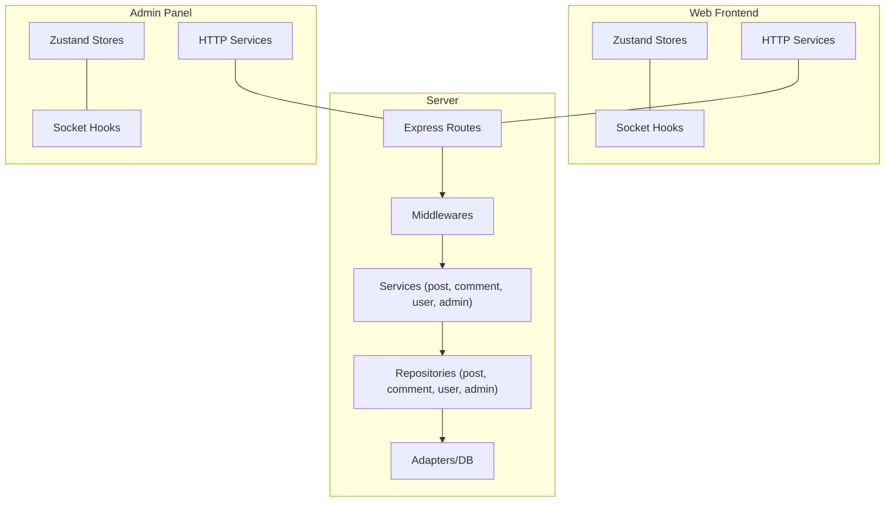
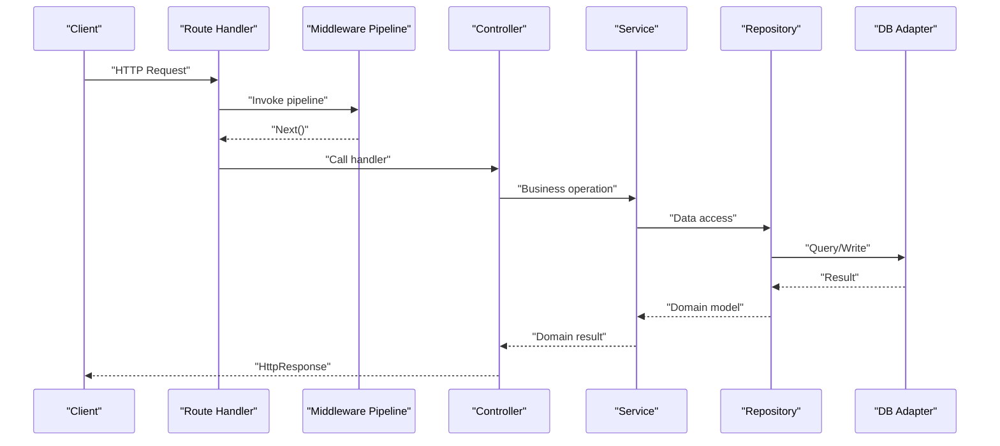
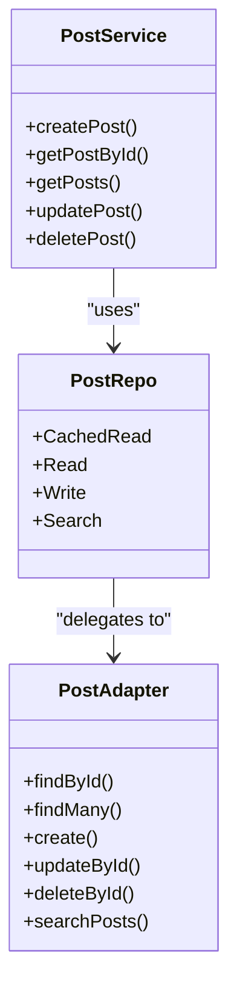
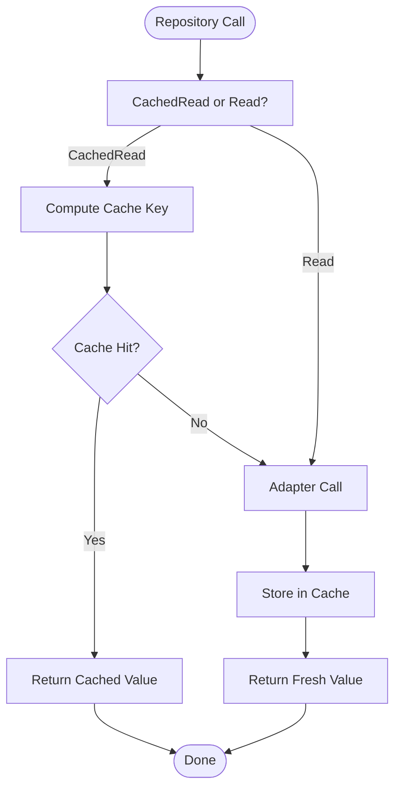
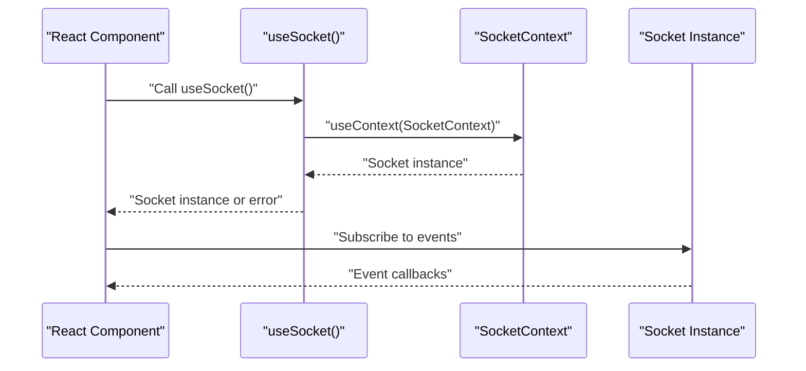
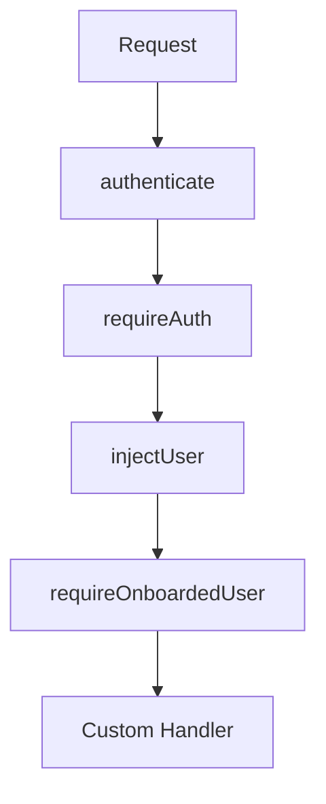
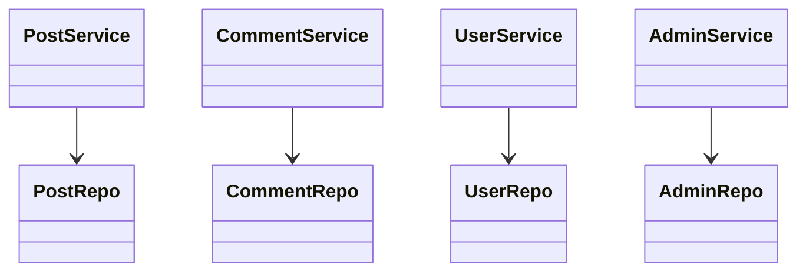
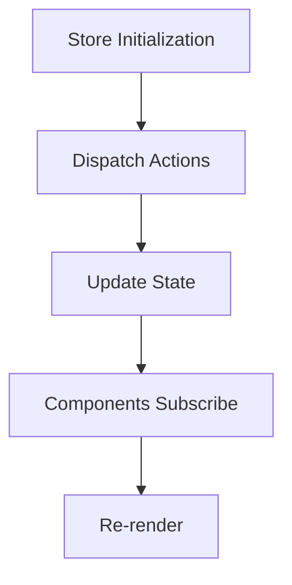
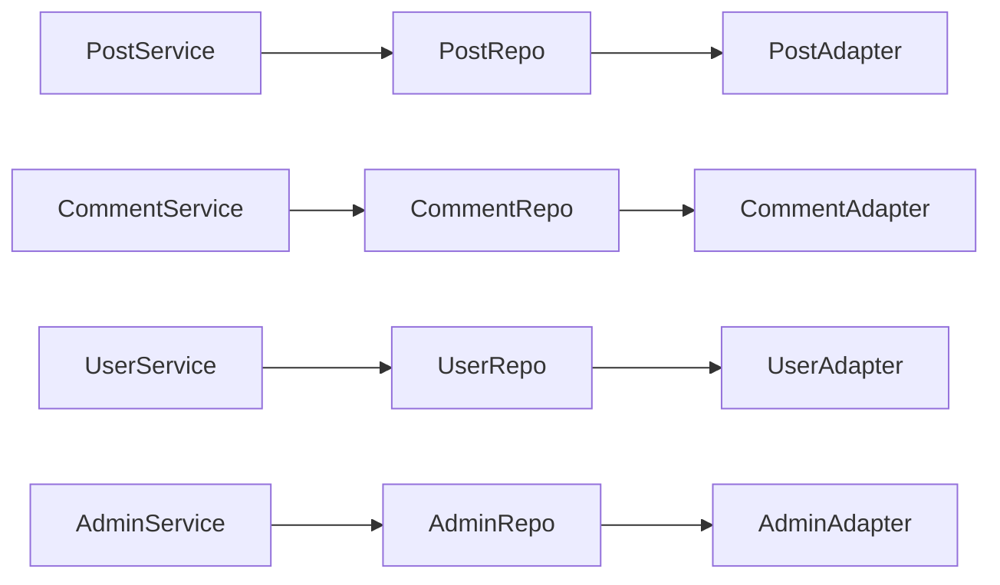

# Design Patterns & Best Practices

<cite>
**Referenced Files in This Document**
- [controller.ts](file://server/src/core/http/controller.ts)
- [pipelines.ts](file://server/src/core/middlewares/pipelines.ts)
- [compose-middleware.ts](file://server/src/lib/compose-middleware.ts)
- [post.service.ts](file://server/src/modules/post/post.service.ts)
- [comment.service.ts](file://server/src/modules/comment/comment.service.ts)
- [user.service.ts](file://server/src/modules/user/user.service.ts)
- [admin.service.ts](file://server/src/modules/admin/admin.service.ts)
- [post.repo.ts](file://server/src/modules/post/post.repo.ts)
- [comment.repo.ts](file://server/src/modules/comment/comment.repo.ts)
- [admin.repo.ts](file://server/src/modules/admin/admin.repo.ts)
- [user.repo.ts](file://server/src/modules/user/user.repo.ts)
- [postStore.ts](file://web/src/store/postStore.ts)
- [ReportStore.ts](file://admin/src/store/ReportStore.ts)
- [useSocket.ts (web)](file://web/src/socket/useSocket.ts)
- [useSocket.ts (admin)](file://admin/src/socket/useSocket.ts)
</cite>

## Table of Contents
1. [Introduction](#introduction)
2. [Project Structure](#project-structure)
3. [Core Components](#core-components)
4. [Architecture Overview](#architecture-overview)
5. [Detailed Component Analysis](#detailed-component-analysis)
6. [Dependency Analysis](#dependency-analysis)
7. [Performance Considerations](#performance-considerations)
8. [Troubleshooting Guide](#troubleshooting-guide)
9. [Conclusion](#conclusion)
10. [Appendices](#appendices)

## Introduction
This document consolidates the design patterns and architectural best practices implemented across the Flick system. It focuses on:
- MVC-like separation of concerns in the backend
- Repository pattern for data access
- Middleware pipeline design and composition
- Service layer architecture and cross-cutting concerns
- State management via Zustand stores
- Real-time updates through SocketContext and hooks
- Error handling and response normalization
- Naming conventions and organizational principles guiding development

## Project Structure
The system is organized into multiple packages:
- server: Backend API with modular domain services, repositories, middleware, and infrastructure
- web: Next.js frontend with stores, sockets, and typed APIs
- admin: Next.js admin panel with stores, sockets, and typed APIs
- landing: Next.js marketing site
- ocr: Standalone OCR service
- shared: Shared library

**Diagram sources**
- [controller.ts](file://server/src/core/http/controller.ts#L1-L80)
- [pipelines.ts](file://server/src/core/middlewares/pipelines.ts#L1-L28)
- [post.service.ts](file://server/src/modules/post/post.service.ts#L1-L451)
- [comment.service.ts](file://server/src/modules/comment/comment.service.ts#L1-L377)
- [user.service.ts](file://server/src/modules/user/user.service.ts#L1-L137)
- [admin.service.ts](file://server/src/modules/admin/admin.service.ts#L1-L207)
- [post.repo.ts](file://server/src/modules/post/post.repo.ts#L1-L147)
- [comment.repo.ts](file://server/src/modules/comment/comment.repo.ts#L1-L90)
- [admin.repo.ts](file://server/src/modules/admin/admin.repo.ts#L1-L60)
- [user.repo.ts](file://server/src/modules/user/user.repo.ts#L1-L67)
- [postStore.ts](file://web/src/store/postStore.ts#L1-L30)
- [ReportStore.ts](file://admin/src/store/ReportStore.ts#L1-L43)
- [useSocket.ts (web)](file://web/src/socket/useSocket.ts#L1-L9)
- [useSocket.ts (admin)](file://admin/src/socket/useSocket.ts#L1-L13)

**Section sources**
- [controller.ts](file://server/src/core/http/controller.ts#L1-L80)
- [pipelines.ts](file://server/src/core/middlewares/pipelines.ts#L1-L28)

## Core Components
- HTTP Controllers and Response Normalization: Controllers are decorated to ensure a consistent response type and standardized sending mechanism.
- Middleware Pipeline: Composable middleware functions enable layered cross-cutting concerns (authentication, role checks, logging).
- Service Layer: Business logic encapsulated per domain module with explicit responsibilities and error signaling.
- Repository Pattern: Abstractions over data access with cached and uncached variants for performance and correctness.
- State Management: Zustand stores for local UI state in web and admin apps.
- Real-time Updates: SocketContext and hooks for reactive updates.

**Section sources**
- [controller.ts](file://server/src/core/http/controller.ts#L1-L80)
- [pipelines.ts](file://server/src/core/middlewares/pipelines.ts#L1-L28)
- [compose-middleware.ts](file://server/src/lib/compose-middleware.ts#L1-L20)
- [post.service.ts](file://server/src/modules/post/post.service.ts#L1-L451)
- [comment.service.ts](file://server/src/modules/comment/comment.service.ts#L1-L377)
- [user.service.ts](file://server/src/modules/user/user.service.ts#L1-L137)
- [admin.service.ts](file://server/src/modules/admin/admin.service.ts#L1-L207)
- [post.repo.ts](file://server/src/modules/post/post.repo.ts#L1-L147)
- [comment.repo.ts](file://server/src/modules/comment/comment.repo.ts#L1-L90)
- [admin.repo.ts](file://server/src/modules/admin/admin.repo.ts#L1-L60)
- [user.repo.ts](file://server/src/modules/user/user.repo.ts#L1-L67)
- [postStore.ts](file://web/src/store/postStore.ts#L1-L30)
- [ReportStore.ts](file://admin/src/store/ReportStore.ts#L1-L43)
- [useSocket.ts (web)](file://web/src/socket/useSocket.ts#L1-L9)
- [useSocket.ts (admin)](file://admin/src/socket/useSocket.ts#L1-L13)

## Architecture Overview
The backend follows a layered architecture:
- HTTP layer: Routes and controllers
- Middleware layer: Pipelines for authentication, authorization, and context injection
- Service layer: Domain logic and orchestration
- Repository layer: Data access abstractions
- Infrastructure: Adapters and external integrations

**Diagram sources**
- [controller.ts](file://server/src/core/http/controller.ts#L13-L55)
- [pipelines.ts](file://server/src/core/middlewares/pipelines.ts#L1-L28)
- [post.service.ts](file://server/src/modules/post/post.service.ts#L40-L94)
- [post.repo.ts](file://server/src/modules/post/post.repo.ts#L6-L147)
- [compose-middleware.ts](file://server/src/lib/compose-middleware.ts#L1-L20)

## Detailed Component Analysis

### MVC Pattern Implementation
- Model: Repositories encapsulate data access and caching keys; domain models are returned by adapters.
- View: Controllers return HttpResponse instances; frontends render state from stores and socket events.
- Controller: Decorators enforce return type safety and standardized response emission.

**Diagram sources**
- [post.service.ts](file://server/src/modules/post/post.service.ts#L12-L451)
- [post.repo.ts](file://server/src/modules/post/post.repo.ts#L6-L147)

**Section sources**
- [controller.ts](file://server/src/core/http/controller.ts#L13-L55)
- [post.service.ts](file://server/src/modules/post/post.service.ts#L12-L451)
- [post.repo.ts](file://server/src/modules/post/post.repo.ts#L6-L147)

### Repository Pattern for Data Access
- CachedRead vs Read: CachedRead wraps adapter calls with cache keys; Read bypasses cache for immediate reads.
- Write: Direct write operations exposed uniformly.
- Search: Dedicated search interface for scalable queries.

**Diagram sources**
- [post.repo.ts](file://server/src/modules/post/post.repo.ts#L7-L86)
- [comment.repo.ts](file://server/src/modules/comment/comment.repo.ts#L7-L57)
- [user.repo.ts](file://server/src/modules/user/user.repo.ts#L24-L47)

**Section sources**
- [post.repo.ts](file://server/src/modules/post/post.repo.ts#L6-L147)
- [comment.repo.ts](file://server/src/modules/comment/comment.repo.ts#L1-L90)
- [user.repo.ts](file://server/src/modules/user/user.repo.ts#L1-L67)

### Factory Pattern for Service Instantiation
- Services are exported as singletons (default export of new instance). This acts as a factory for consumers who import the service directly, avoiding repeated construction while keeping instantiation centralized.

Examples:
- PostService singleton export
- CommentService singleton export
- UserService singleton export
- AdminService singleton export

**Section sources**
- [post.service.ts](file://server/src/modules/post/post.service.ts#L450-L451)
- [comment.service.ts](file://server/src/modules/comment/comment.service.ts#L376-L377)
- [user.service.ts](file://server/src/modules/user/user.service.ts#L136-L137)
- [admin.service.ts](file://server/src/modules/admin/admin.service.ts#L206-L207)

### Observer Pattern for Real-Time Updates
- SocketContext and useSocket hook provide a React-friendly observer-like subscription to server-sent events.
- Web and Admin share the same pattern: context provider supplies socket instance; hooks expose it safely.

**Diagram sources**
- [useSocket.ts (web)](file://web/src/socket/useSocket.ts#L1-L9)
- [useSocket.ts (admin)](file://admin/src/socket/useSocket.ts#L1-L13)

**Section sources**
- [useSocket.ts (web)](file://web/src/socket/useSocket.ts#L1-L9)
- [useSocket.ts (admin)](file://admin/src/socket/useSocket.ts#L1-L13)

### Middleware Pipeline Design
- compose-middleware chains multiple middleware functions into a single handler.
- pipelines.ts defines named pipelines for common scenarios: authenticated, admin-only, withRequiredUserContext, etc.

**Diagram sources**
- [compose-middleware.ts](file://server/src/lib/compose-middleware.ts#L1-L20)
- [pipelines.ts](file://server/src/core/middlewares/pipelines.ts#L1-L28)

**Section sources**
- [compose-middleware.ts](file://server/src/lib/compose-middleware.ts#L1-L20)
- [pipelines.ts](file://server/src/core/middlewares/pipelines.ts#L1-L28)

### Dependency Injection Patterns
- Services depend on repositories and infrastructure services (cache, moderation, mail). This promotes testability and modularity.
- Example: AdminService depends on AdminRepo and CollegeRepo, and triggers cache invalidation.

**Section sources**
- [admin.service.ts](file://server/src/modules/admin/admin.service.ts#L1-L207)

### Service Layer Architecture
- Each domain module exposes a service with cohesive responsibilities:
  - PostService: CRUD, moderation, visibility checks, audit recording, cache versioning
  - CommentService: nested comments, moderation, audit, cache versioning
  - UserService: profile retrieval/search, terms acceptance, blocking/unblocking
  - AdminService: dashboards, reporting, college management, feedback/log retrieval

**Diagram sources**
- [post.service.ts](file://server/src/modules/post/post.service.ts#L12-L451)
- [comment.service.ts](file://server/src/modules/comment/comment.service.ts#L12-L377)
- [user.service.ts](file://server/src/modules/user/user.service.ts#L9-L137)
- [admin.service.ts](file://server/src/modules/admin/admin.service.ts#L7-L207)
- [post.repo.ts](file://server/src/modules/post/post.repo.ts#L6-L147)
- [comment.repo.ts](file://server/src/modules/comment/comment.repo.ts#L6-L90)
- [user.repo.ts](file://server/src/modules/user/user.repo.ts#L6-L67)
- [admin.repo.ts](file://server/src/modules/admin/admin.repo.ts#L4-L60)

**Section sources**
- [post.service.ts](file://server/src/modules/post/post.service.ts#L12-L451)
- [comment.service.ts](file://server/src/modules/comment/comment.service.ts#L12-L377)
- [user.service.ts](file://server/src/modules/user/user.service.ts#L9-L137)
- [admin.service.ts](file://server/src/modules/admin/admin.service.ts#L7-L207)

### State Management Patterns with Zustand
- Stores encapsulate state and actions for a bounded context:
  - postStore: posts lifecycle (set/add/remove/update)
  - ReportStore: admin reports lifecycle (setReports, updateReportStatus, updateReport)
- Stores are thin and focused, enabling predictable updates and easy testing.

**Diagram sources**
- [postStore.ts](file://web/src/store/postStore.ts#L12-L27)
- [ReportStore.ts](file://admin/src/store/ReportStore.ts#L11-L40)

**Section sources**
- [postStore.ts](file://web/src/store/postStore.ts#L1-L30)
- [ReportStore.ts](file://admin/src/store/ReportStore.ts#L1-L43)

### Component Composition Strategies
- Hooks encapsulate cross-cutting concerns (e.g., useSocket) and are composable across components.
- Layouts and pages compose reusable UI components and services.

[No sources needed since this section provides general guidance]

### Error Boundary Implementations
- Controllers enforce returning HttpResponse to normalize responses.
- Services throw HttpError with structured metadata for client consumption.
- Frontend hooks and components can leverage error handlers and toast utilities to surface errors.

**Section sources**
- [controller.ts](file://server/src/core/http/controller.ts#L13-L55)
- [post.service.ts](file://server/src/modules/post/post.service.ts#L13-L38)
- [comment.service.ts](file://server/src/modules/comment/comment.service.ts#L12-L38)

## Dependency Analysis
- Cohesion: Each module’s service and repo focus on a single domain.
- Coupling: Services depend on repositories; repositories depend on adapters. External services (cache, moderation, mail) are injected via imports.
- No circular dependencies observed at module boundaries.

**Diagram sources**
- [post.service.ts](file://server/src/modules/post/post.service.ts#L10-L11)
- [comment.service.ts](file://server/src/modules/comment/comment.service.ts#L9-L10)
- [user.service.ts](file://server/src/modules/user/user.service.ts#L5-L7)
- [admin.service.ts](file://server/src/modules/admin/admin.service.ts#L4-L5)
- [post.repo.ts](file://server/src/modules/post/post.repo.ts#L1-L2)
- [comment.repo.ts](file://server/src/modules/comment/comment.repo.ts#L1-L2)
- [user.repo.ts](file://server/src/modules/user/user.repo.ts#L1-L2)
- [admin.repo.ts](file://server/src/modules/admin/admin.repo.ts#L1-L2)

**Section sources**
- [post.service.ts](file://server/src/modules/post/post.service.ts#L10-L11)
- [comment.service.ts](file://server/src/modules/comment/comment.service.ts#L9-L10)
- [user.service.ts](file://server/src/modules/user/user.service.ts#L5-L7)
- [admin.service.ts](file://server/src/modules/admin/admin.service.ts#L4-L5)
- [post.repo.ts](file://server/src/modules/post/post.repo.ts#L1-L2)
- [comment.repo.ts](file://server/src/modules/comment/comment.repo.ts#L1-L2)
- [user.repo.ts](file://server/src/modules/user/user.repo.ts#L1-L2)
- [admin.repo.ts](file://server/src/modules/admin/admin.repo.ts#L1-L2)

## Performance Considerations
- Caching: CachedRead variants compute cache keys and reuse results to reduce database load.
- Cache Versioning: Services increment cache version keys after mutations to ensure cache invalidation.
- Moderation Checks: Content is moderated before persistence to avoid storing violations.
- Pagination and Counts: Services compute totals and pagination metadata for efficient client rendering.

**Section sources**
- [post.service.ts](file://server/src/modules/post/post.service.ts#L85-L86)
- [comment.service.ts](file://server/src/modules/comment/comment.service.ts#L195-L200)
- [post.repo.ts](file://server/src/modules/post/post.repo.ts#L46-L61)
- [comment.repo.ts](file://server/src/modules/comment/comment.repo.ts#L39-L50)

## Troubleshooting Guide
- Controller must return HttpResponse: Decorators enforce this contract; otherwise, an error is thrown.
- Unauthorized/Forbidden/Not Found: Services throw HttpError with structured metadata for precise client handling.
- Socket availability: useSocket throws if called outside provider; ensure components are wrapped in SocketProvider.

**Section sources**
- [controller.ts](file://server/src/core/http/controller.ts#L17-L19)
- [post.service.ts](file://server/src/modules/post/post.service.ts#L96-L143)
- [comment.service.ts](file://server/src/modules/comment/comment.service.ts#L13-L67)
- [useSocket.ts (admin)](file://admin/src/socket/useSocket.ts#L6-L8)
- [useSocket.ts (web)](file://web/src/socket/useSocket.ts#L5-L6)

## Conclusion
Flick’s architecture emphasizes clear separation of concerns, robust middleware pipelines, and pragmatic patterns:
- MVC-like separation in the backend with normalized responses
- Repository pattern with caching for performance
- Singleton services for cohesive domain logic
- Composable middleware pipelines
- Zustand stores for predictable UI state
- SocketContext for real-time updates
These practices collectively improve maintainability, testability, and scalability.

## Appendices
- Naming Conventions
  - Services: PascalCaseService (e.g., PostService)
  - Repositories: PascalCaseRepo (e.g., PostRepo)
  - Stores: camelCaseStore (e.g., postStore)
  - Hooks: useXxx (e.g., useSocket)
  - Pipelines: camelCase (e.g., authenticated)
- Architectural Decision Rationales
  - Singleton services centralize business logic and simplify imports
  - CachedRead reduces latency and DB pressure
  - Middleware composition enables layered policies
  - Zustand stores keep UI state local and testable
  - SocketContext decouples real-time concerns from components