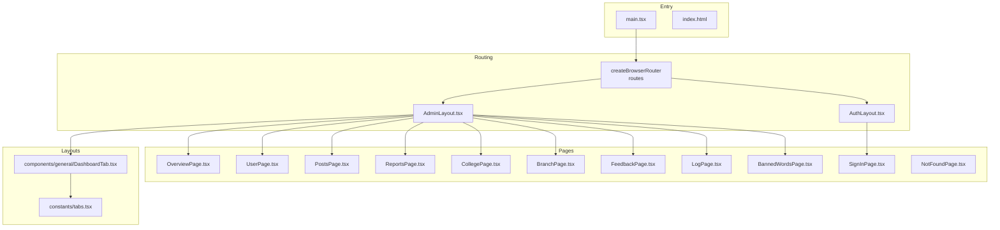
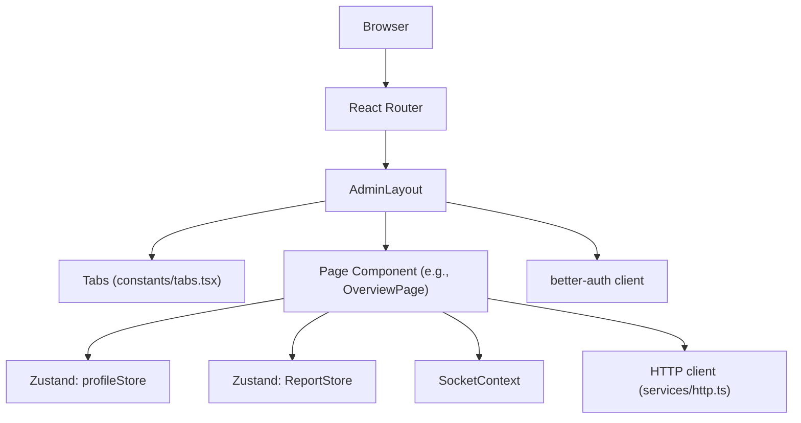
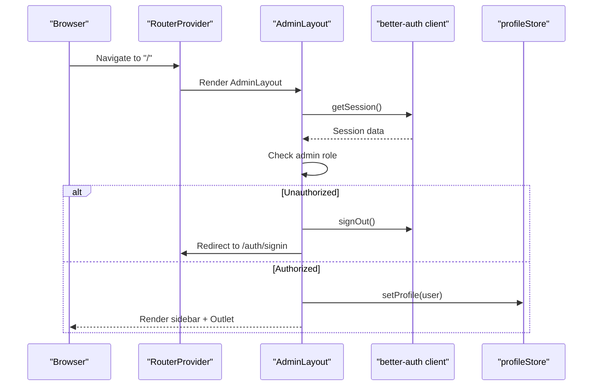
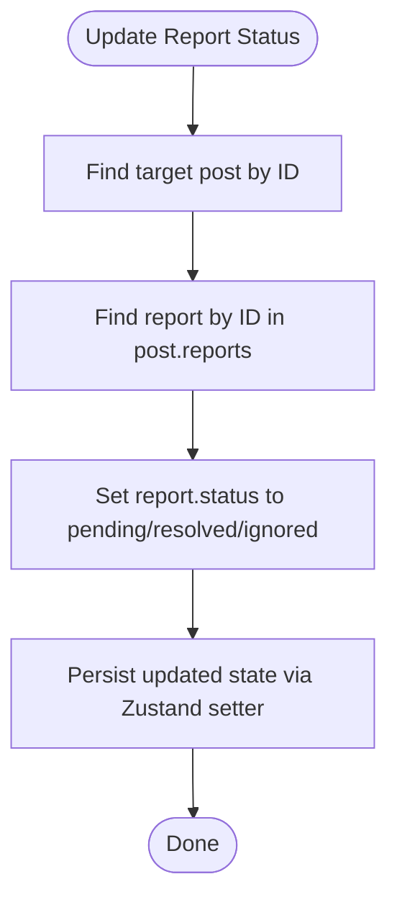
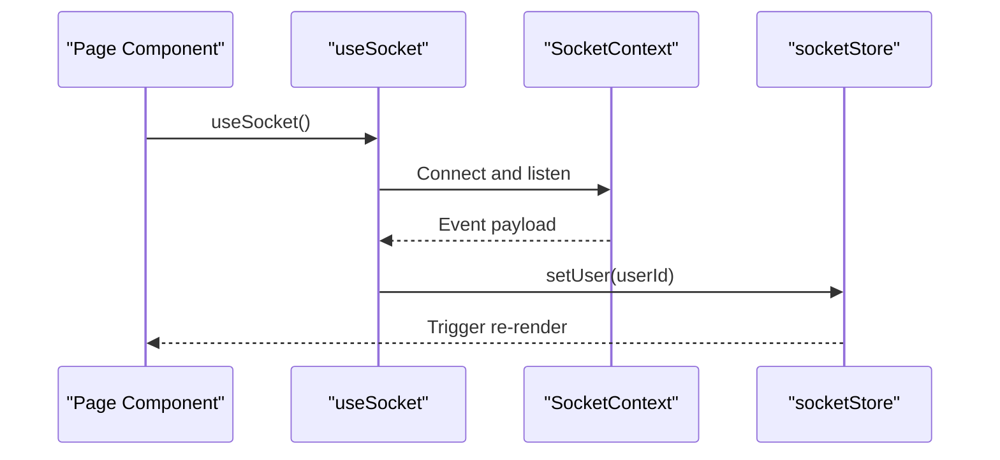
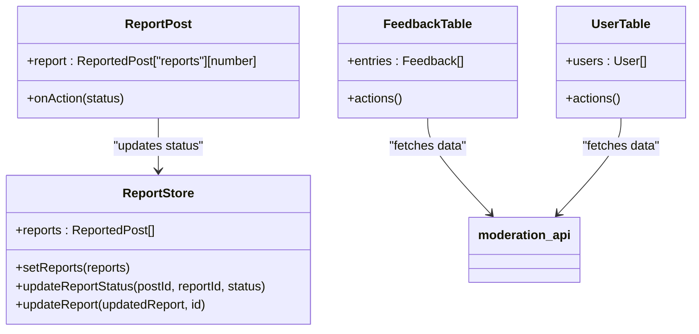
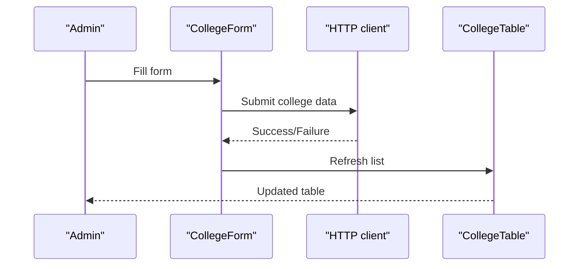
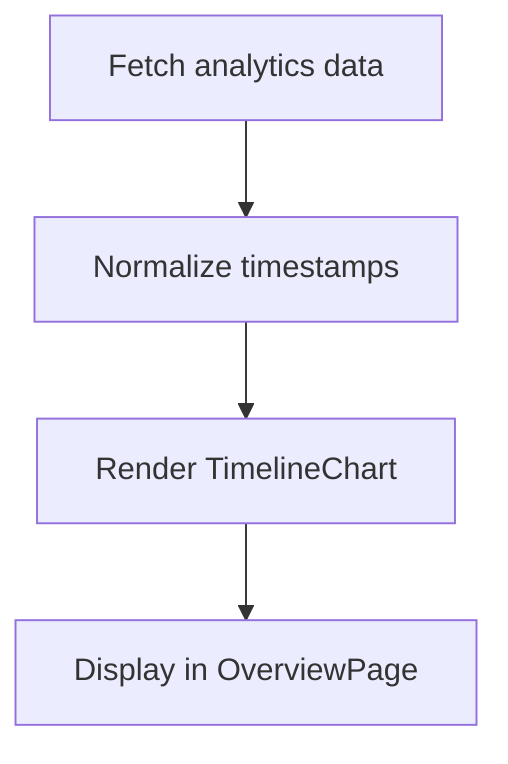
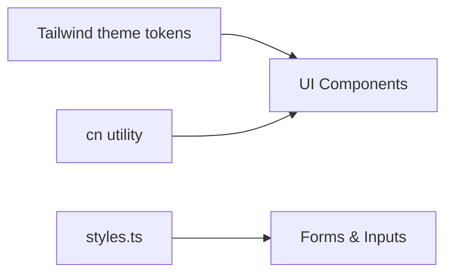
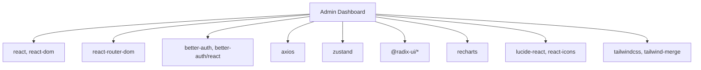

# Admin Dashboard

<cite>
**Referenced Files in This Document**
- [package.json](file://admin/package.json)
- [vite.config.ts](file://admin/vite.config.ts)
- [tsconfig.app.json](file://admin/tsconfig.app.json)
- [tailwind.config.js](file://admin/tailwind.config.js)
- [index.html](file://admin/index.html)
- [main.tsx](file://admin/src/main.tsx)
- [AdminLayout.tsx](file://admin/src/layouts/AdminLayout.tsx)
- [AppLayout.tsx](file://admin/src/layouts/AppLayout.tsx)
- [tabs.tsx](file://admin/src/constants/tabs.tsx)
- [styles.ts](file://admin/src/constants/styles.ts)
- [utils.ts](file://admin/src/lib/utils.ts)
- [auth-client.ts](file://admin/src/lib/auth-client.ts)
- [profileStore.ts](file://admin/src/store/profileStore.ts)
- [ReportStore.ts](file://admin/src/store/ReportStore.ts)
- [socketStore.ts](file://admin/src/store/socketStore.ts)
- [CollegeForm.tsx](file://admin/src/components/forms/CollegeForm.tsx)
- [CollegeTable.tsx](file://admin/src/components/general/CollegeTable.tsx)
- [CollegeRequestTable.tsx](file://admin/src/components/general/CollegeRequestTable.tsx)
- [UserTable.tsx](file://admin/src/components/general/UserTable.tsx)
- [FeedbackTable.tsx](file://admin/src/components/general/FeedbackTable.tsx)
- [ReportPost.tsx](file://admin/src/components/general/ReportPost.tsx)
- [Header.tsx](file://admin/src/components/general/Header.tsx)
- [TimelineChart.tsx](file://admin/src/components/charts/TimelineChart.tsx)
- [SocketContext.tsx](file://admin/src/socket/SocketContext.tsx)
- [useSocket.ts](file://admin/src/socket/useSocket.ts)
- [moderation.ts](file://admin/src/services/api/moderation.ts)
- [http.ts](file://admin/src/services/http.ts)
- [OverviewPage.tsx](file://admin/src/pages/OverviewPage.tsx)
- [UserPage.tsx](file://admin/src/pages/UserPage.tsx)
- [PostsPage.tsx](file://admin/src/pages/PostsPage.tsx)
- [ReportsPage.tsx](file://admin/src/pages/ReportsPage.tsx)
- [CollegePage.tsx](file://admin/src/pages/CollegePage.tsx)
- [BranchPage.tsx](file://admin/src/pages/BranchPage.tsx)
- [FeedbackPage.tsx](file://admin/src/pages/FeedbackPage.tsx)
- [LogPage.tsx](file://admin/src/pages/LogPage.tsx)
- [BannedWordsPage.tsx](file://admin/src/pages/BannedWordsPage.tsx)
- [SignInPage.tsx](file://admin/src/pages/SignInPage.tsx)
- [NotFoundPage.tsx](file://admin/src/pages/NotFoundPage.tsx)
</cite>

## Table of Contents
1. [Introduction](#introduction)
2. [Project Structure](#project-structure)
3. [Core Components](#core-components)
4. [Architecture Overview](#architecture-overview)
5. [Detailed Component Analysis](#detailed-component-analysis)
6. [Dependency Analysis](#dependency-analysis)
7. [Performance Considerations](#performance-considerations)
8. [Troubleshooting Guide](#troubleshooting-guide)
9. [Conclusion](#conclusion)

## Introduction
This document describes the Flick Admin Dashboard frontend, a React-based administrative interface built with Vite and TypeScript. It covers the layout system, navigation structure, dashboard components, moderation tools, user management, analytics visualization, form handling, state management with Zustand, real-time updates via sockets, theming, responsive design, and component library usage with Radix UI and Tailwind CSS.

## Project Structure
The admin frontend is organized into feature-focused directories under src:
- layouts: Page-level layouts (AdminLayout, AppLayout, AuthLayout, RootLayout)
- pages: Route handlers for admin sections (Overview, Users, Posts, Reports, Colleges, Branches, Feedback, Logs, Banned Words, Sign In, Not Found)
- components: Reusable UI and domain-specific components (general, forms, charts, ui)
- services: HTTP client and API service modules
- store: Zustand stores for state management
- socket: Socket context and hooks for real-time updates
- lib: Authentication client, utilities, and types
- constants: Tabs configuration and shared styles
- types: Type definitions for domain entities
- utils: Formatting and helper utilities

**Diagram sources**
- [main.tsx](file://admin/src/main.tsx#L1-L96)
- [AdminLayout.tsx](file://admin/src/layouts/AdminLayout.tsx#L1-L132)
- [tabs.tsx](file://admin/src/constants/tabs.tsx#L1-L53)

**Section sources**
- [main.tsx](file://admin/src/main.tsx#L1-L96)
- [vite.config.ts](file://admin/vite.config.ts#L1-L19)
- [tsconfig.app.json](file://admin/tsconfig.app.json#L1-L34)
- [tailwind.config.js](file://admin/tailwind.config.js#L1-L82)
- [index.html](file://admin/index.html#L1-L14)

## Core Components
- Layouts and Navigation
  - AdminLayout provides the main admin shell with responsive sidebar, mobile menu, and tabbed navigation driven by constants/tabs.tsx.
  - AppLayout is used in the main web app for feed and branches navigation.
- Authentication and Session Management
  - better-auth client configured for admin access with session validation and role checks.
- State Management
  - Zustand stores for profile, reports, and socket user state.
- UI Library and Theming
  - Radix UI primitives integrated via npm packages; Tailwind CSS with custom theme tokens and animations.
- Real-time Updates
  - Socket context and hook for live events.
- Analytics
  - TimelineChart component for time-series visualization.

**Section sources**
- [AdminLayout.tsx](file://admin/src/layouts/AdminLayout.tsx#L1-L132)
- [AppLayout.tsx](file://admin/src/layouts/AppLayout.tsx#L1-L46)
- [tabs.tsx](file://admin/src/constants/tabs.tsx#L1-L53)
- [auth-client.ts](file://admin/src/lib/auth-client.ts#L1-L11)
- [profileStore.ts](file://admin/src/store/profileStore.ts#L1-L39)
- [ReportStore.ts](file://admin/src/store/ReportStore.ts#L1-L43)
- [socketStore.ts](file://admin/src/store/socketStore.ts#L1-L14)
- [tailwind.config.js](file://admin/tailwind.config.js#L1-L82)
- [TimelineChart.tsx](file://admin/src/components/charts/TimelineChart.tsx)

## Architecture Overview
The admin app uses React Router for routing, with nested routes inside AdminLayout. Authentication is enforced at the layout level, redirecting unauthorized users to sign-in. State is managed via Zustand stores, while real-time updates are handled through Socket.IO. UI components are built with Radix UI primitives styled via Tailwind CSS.

**Diagram sources**
- [main.tsx](file://admin/src/main.tsx#L19-L89)
- [AdminLayout.tsx](file://admin/src/layouts/AdminLayout.tsx#L11-L65)
- [tabs.tsx](file://admin/src/constants/tabs.tsx#L7-L53)
- [profileStore.ts](file://admin/src/store/profileStore.ts#L12-L35)
- [ReportStore.ts](file://admin/src/store/ReportStore.ts#L11-L40)
- [auth-client.ts](file://admin/src/lib/auth-client.ts#L4-L10)
- [http.ts](file://admin/src/services/http.ts)

## Detailed Component Analysis

### Layout and Navigation
- AdminLayout
  - Implements a responsive sidebar with mobile hamburger menu, persistent header with admin info, and tabbed navigation.
  - Validates session and role on mount; redirects non-admin users to sign-in and clears stale sessions.
  - Uses Outlet to render child pages.
- AppLayout
  - Provides primary navigation for the main application (feed, college, polls, trending, branches).
- Tabs Configuration
  - Centralized tab definitions with icons and paths for consistent navigation across layouts.

**Diagram sources**
- [AdminLayout.tsx](file://admin/src/layouts/AdminLayout.tsx#L17-L65)
- [auth-client.ts](file://admin/src/lib/auth-client.ts#L4-L10)
- [profileStore.ts](file://admin/src/store/profileStore.ts#L18-L29)

**Section sources**
- [AdminLayout.tsx](file://admin/src/layouts/AdminLayout.tsx#L1-L132)
- [tabs.tsx](file://admin/src/constants/tabs.tsx#L1-L53)

### State Management with Zustand
- profileStore
  - Holds current admin profile, supports setting, updating, removing profile, and theme updates.
- ReportStore
  - Manages reported posts, supports bulk loading and per-report status updates with immutable updates.
- socketStore
  - Stores current socket user identifier for real-time features.

**Diagram sources**
- [ReportStore.ts](file://admin/src/store/ReportStore.ts#L14-L26)

**Section sources**
- [profileStore.ts](file://admin/src/store/profileStore.ts#L1-L39)
- [ReportStore.ts](file://admin/src/store/ReportStore.ts#L1-L43)
- [socketStore.ts](file://admin/src/store/socketStore.ts#L1-L14)

### Real-time Data Updates
- SocketContext and useSocket
  - Provide a global socket connection and hook for subscribing to events.
  - Integrates with Zustand stores to update UI reactively.

**Diagram sources**
- [SocketContext.tsx](file://admin/src/socket/SocketContext.tsx)
- [useSocket.ts](file://admin/src/socket/useSocket.ts)
- [socketStore.ts](file://admin/src/store/socketStore.ts#L8-L11)

**Section sources**
- [SocketContext.tsx](file://admin/src/socket/SocketContext.tsx)
- [useSocket.ts](file://admin/src/socket/useSocket.ts)
- [socketStore.ts](file://admin/src/store/socketStore.ts#L1-L14)

### Moderation Tools
- ReportsPage
  - Displays reported posts and allows changing report statuses.
- ReportPost component
  - Individual report item with action buttons to resolve/ignore.
- FeedbackTable
  - Lists feedback entries for moderation review.
- UserTable
  - Displays users with moderation controls.
- CollegeRequestTable and CollegeTable
  - Manage college requests and approved colleges.
- moderation API service
  - HTTP module for moderation endpoints.

**Diagram sources**
- [ReportStore.ts](file://admin/src/store/ReportStore.ts#L4-L9)
- [ReportPost.tsx](file://admin/src/components/general/ReportPost.tsx)
- [FeedbackTable.tsx](file://admin/src/components/general/FeedbackTable.tsx)
- [UserTable.tsx](file://admin/src/components/general/UserTable.tsx)
- [moderation.ts](file://admin/src/services/api/moderation.ts)

**Section sources**
- [ReportsPage.tsx](file://admin/src/pages/ReportsPage.tsx)
- [ReportPost.tsx](file://admin/src/components/general/ReportPost.tsx)
- [FeedbackTable.tsx](file://admin/src/components/general/FeedbackTable.tsx)
- [UserTable.tsx](file://admin/src/components/general/UserTable.tsx)
- [CollegeRequestTable.tsx](file://admin/src/components/general/CollegeRequestTable.tsx)
- [CollegeTable.tsx](file://admin/src/components/general/CollegeTable.tsx)
- [moderation.ts](file://admin/src/services/api/moderation.ts)

### Form Handling for College Management
- CollegeForm
  - Handles creation and editing of colleges with validation and submission.
- http service
  - Centralized HTTP client for API calls.

**Diagram sources**
- [CollegeForm.tsx](file://admin/src/components/forms/CollegeForm.tsx)
- [http.ts](file://admin/src/services/http.ts)
- [CollegeTable.tsx](file://admin/src/components/general/CollegeTable.tsx)

**Section sources**
- [CollegeForm.tsx](file://admin/src/components/forms/CollegeForm.tsx)
- [http.ts](file://admin/src/services/http.ts)
- [CollegeTable.tsx](file://admin/src/components/general/CollegeTable.tsx)

### Analytics Visualization
- TimelineChart
  - Renders time-series analytics using Recharts.

**Diagram sources**
- [TimelineChart.tsx](file://admin/src/components/charts/TimelineChart.tsx)
- [OverviewPage.tsx](file://admin/src/pages/OverviewPage.tsx)

**Section sources**
- [TimelineChart.tsx](file://admin/src/components/charts/TimelineChart.tsx)
- [OverviewPage.tsx](file://admin/src/pages/OverviewPage.tsx)

### Theming and Responsive Design
- Tailwind CSS
  - Custom theme tokens for background, foreground, card, popover, primary, secondary, muted, accent, destructive, border, input, ring, and chart palettes.
  - Animations for accordion and dark mode via class.
- Utility function
  - cn combines and merges Tailwind classes safely.
- Styles constant
  - Shared input styling for form controls.

**Diagram sources**
- [tailwind.config.js](file://admin/tailwind.config.js#L8-L79)
- [utils.ts](file://admin/src/lib/utils.ts#L4-L6)
- [styles.ts](file://admin/src/constants/styles.ts#L1-L2)

**Section sources**
- [tailwind.config.js](file://admin/tailwind.config.js#L1-L82)
- [utils.ts](file://admin/src/lib/utils.ts#L1-L7)
- [styles.ts](file://admin/src/constants/styles.ts#L1-L2)

### Component Library Usage (Radix UI)
- Radix UI primitives are integrated via npm packages for dialogs, dropdowns, popovers, switches, selects, inputs, labels, and more.
- These are consumed through the ui directory components and individual wrappers.

**Section sources**
- [package.json](file://admin/package.json#L17-L31)

## Dependency Analysis
Key runtime dependencies include React, React Router DOM, better-auth for authentication, Axios for HTTP, Zustand for state, Recharts for charts, Lucide React for icons, and Tailwind CSS with Radix UI.

**Diagram sources**
- [package.json](file://admin/package.json#L13-L57)

**Section sources**
- [package.json](file://admin/package.json#L1-L78)

## Performance Considerations
- Prefer lightweight state updates with Zustand selectors to avoid unnecessary re-renders.
- Lazy-load heavy components (e.g., charts) when appropriate.
- Use efficient list rendering with stable keys in tables.
- Minimize deep object mutations; leverage immutable updates as seen in ReportStore.
- Defer non-critical computations to Web Workers if needed.

## Troubleshooting Guide
- Authentication failures
  - Verify base URL for better-auth client and ensure environment variables are set.
  - Confirm session validation logic in AdminLayout and proper redirects to sign-in.
- Routing issues
  - Check route definitions in main.tsx and ensure AdminLayout wraps child routes.
- State not persisting
  - Confirm Zustand store initialization and that setters are invoked correctly.
- Styling inconsistencies
  - Ensure Tailwind content paths include all component directories and rebuild after theme changes.
- Real-time updates not appearing
  - Verify SocketContext connection and event listeners; confirm socketStore updates trigger re-renders.

**Section sources**
- [auth-client.ts](file://admin/src/lib/auth-client.ts#L4-L10)
- [main.tsx](file://admin/src/main.tsx#L19-L89)
- [AdminLayout.tsx](file://admin/src/layouts/AdminLayout.tsx#L17-L65)
- [ReportStore.ts](file://admin/src/store/ReportStore.ts#L14-L26)
- [tailwind.config.js](file://admin/tailwind.config.js#L3-L6)

## Conclusion
The Flick Admin Dashboard leverages modern React tooling with Vite and TypeScript, a robust layout and routing system, centralized state via Zustand, real-time capabilities with sockets, and a cohesive UI built on Radix UI and Tailwind CSS. The moderation tools, user management panels, analytics visualization, and form handling are modular and maintainable, enabling efficient administration of the platform.