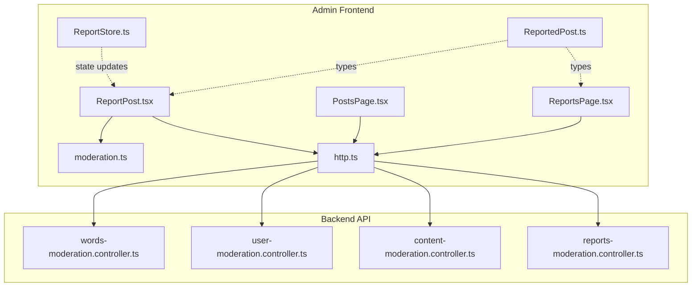
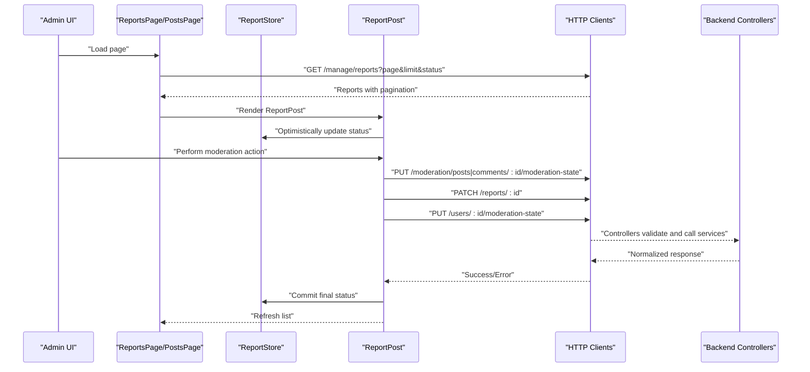
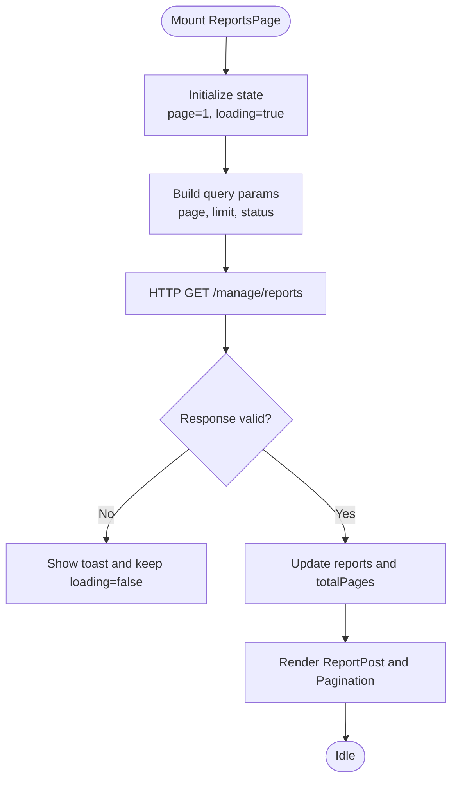
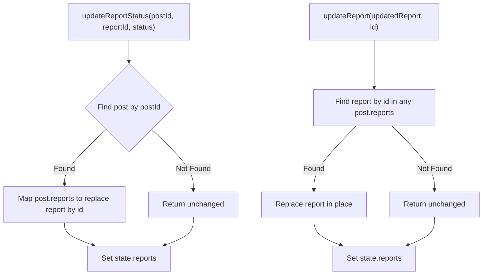
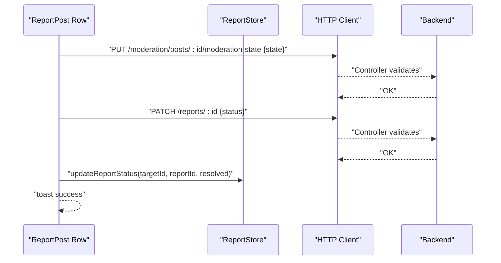
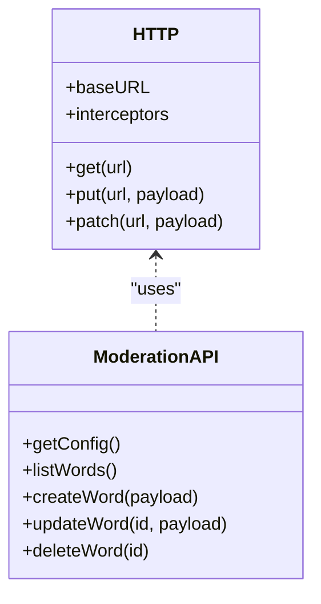
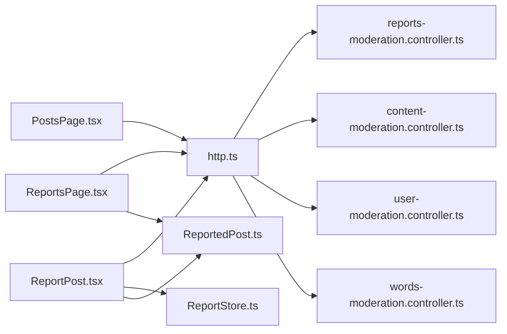

# Content Moderation Tools

<cite>
**Referenced Files in This Document**
- [ReportsPage.tsx](file://admin/src/pages/ReportsPage.tsx)
- [PostsPage.tsx](file://admin/src/pages/PostsPage.tsx)
- [ReportStore.ts](file://admin/src/store/ReportStore.ts)
- [ReportPost.tsx](file://admin/src/components/general/ReportPost.tsx)
- [ReportedPost.ts](file://admin/src/types/ReportedPost.ts)
- [Post.ts](file://admin/src/types/Post.ts)
- [moderation.ts](file://admin/src/services/api/moderation.ts)
- [http.ts](file://admin/src/services/http.ts)
- [reports-moderation.controller.ts](file://server/src/modules/moderation/reports/reports-moderation.controller.ts)
- [content-moderation.controller.ts](file://server/src/modules/moderation/content/content-moderation.controller.ts)
- [user-moderation.controller.ts](file://server/src/modules/moderation/user/user-moderation.controller.ts)
- [words-moderation.controller.ts](file://server/src/modules/moderation/words/words-moderation.controller.ts)
</cite>

## Table of Contents
1. [Introduction](#introduction)
2. [Project Structure](#project-structure)
3. [Core Components](#core-components)
4. [Architecture Overview](#architecture-overview)
5. [Detailed Component Analysis](#detailed-component-analysis)
6. [Dependency Analysis](#dependency-analysis)
7. [Performance Considerations](#performance-considerations)
8. [Troubleshooting Guide](#troubleshooting-guide)
9. [Conclusion](#conclusion)

## Introduction
This document describes the admin content moderation system with a focus on:
- ReportsPage for reviewing reported content, including filtering by status, pagination, and moderation actions.
- ReportStore for managing moderation queues, status updates, and batch operations.
- Moderation API integration for content review, user flagging, and automated content detection.
- PostsPage for content management, visibility controls, and moderation history tracking.

The system separates concerns between the admin frontend (React + Zustand) and the backend (Express controllers and services), communicating via normalized HTTP APIs.

## Project Structure
The moderation system spans three layers:
- Admin Frontend (React):
  - Pages: ReportsPage, PostsPage
  - Store: ReportStore
  - Components: ReportPost (table and actions)
  - Services: HTTP clients and moderation API bindings
  - Types: ReportedPost, Post
- Backend (Express):
  - Controllers: Reports, Content, User, Words moderation
  - Services: Business logic for moderation operations
  - Schemas: Validation for requests and responses

**Diagram sources**
- [ReportsPage.tsx](file://admin/src/pages/ReportsPage.tsx#L1-L122)
- [PostsPage.tsx](file://admin/src/pages/PostsPage.tsx#L1-L68)
- [ReportStore.ts](file://admin/src/store/ReportStore.ts#L1-L43)
- [ReportPost.tsx](file://admin/src/components/general/ReportPost.tsx#L1-L503)
- [http.ts](file://admin/src/services/http.ts#L1-L154)
- [moderation.ts](file://admin/src/services/api/moderation.ts#L1-L49)
- [ReportedPost.ts](file://admin/src/types/ReportedPost.ts#L1-L28)
- [reports-moderation.controller.ts](file://server/src/modules/moderation/reports/reports-moderation.controller.ts#L1-L86)
- [content-moderation.controller.ts](file://server/src/modules/moderation/content/content-moderation.controller.ts#L1-L90)
- [user-moderation.controller.ts](file://server/src/modules/moderation/user/user-moderation.controller.ts#L1-L82)
- [words-moderation.controller.ts](file://server/src/modules/moderation/words/words-moderation.controller.ts#L1-L46)

**Section sources**
- [ReportsPage.tsx](file://admin/src/pages/ReportsPage.tsx#L1-L122)
- [PostsPage.tsx](file://admin/src/pages/PostsPage.tsx#L1-L68)
- [ReportStore.ts](file://admin/src/store/ReportStore.ts#L1-L43)
- [ReportPost.tsx](file://admin/src/components/general/ReportPost.tsx#L1-L503)
- [http.ts](file://admin/src/services/http.ts#L1-L154)
- [moderation.ts](file://admin/src/services/api/moderation.ts#L1-L49)
- [ReportedPost.ts](file://admin/src/types/ReportedPost.ts#L1-L28)
- [reports-moderation.controller.ts](file://server/src/modules/moderation/reports/reports-moderation.controller.ts#L1-L86)
- [content-moderation.controller.ts](file://server/src/modules/moderation/content/content-moderation.controller.ts#L1-L90)
- [user-moderation.controller.ts](file://server/src/modules/moderation/user/user-moderation.controller.ts#L1-L82)
- [words-moderation.controller.ts](file://server/src/modules/moderation/words/words-moderation.controller.ts#L1-L46)

## Core Components
- ReportsPage: Fetches paginated reports filtered by status, renders a filter bar, and delegates moderation actions to ReportPost.
- PostsPage: Similar to ReportsPage but focuses on posts and resolves resolved/pending reports.
- ReportStore: Centralized state for moderation queues and optimistic updates to report statuses.
- ReportPost: Renders a table of reports, exposes actions (ban/unban, shadow ban, suspend, ignore, undo), and integrates with moderation APIs.
- HTTP Layer: Provides two clients (admin and root) with interceptors for auth and envelope normalization.
- Moderation API: Typed wrappers for banned word management and moderation configuration.

Key responsibilities:
- Filtering and pagination in pages
- Local state updates and optimistic UI in ReportStore
- Action orchestration and API calls in ReportPost
- Backend endpoints for reports, content moderation, user moderation, and banned words

**Section sources**
- [ReportsPage.tsx](file://admin/src/pages/ReportsPage.tsx#L14-L122)
- [PostsPage.tsx](file://admin/src/pages/PostsPage.tsx#L11-L68)
- [ReportStore.ts](file://admin/src/store/ReportStore.ts#L4-L43)
- [ReportPost.tsx](file://admin/src/components/general/ReportPost.tsx#L39-L503)
- [http.ts](file://admin/src/services/http.ts#L11-L154)
- [moderation.ts](file://admin/src/services/api/moderation.ts#L23-L48)

## Architecture Overview
The moderation workflow connects the admin UI to backend controllers through typed APIs. The frontend handles user interactions and state, while the backend enforces business rules and persists changes.

**Diagram sources**
- [ReportsPage.tsx](file://admin/src/pages/ReportsPage.tsx#L24-L69)
- [PostsPage.tsx](file://admin/src/pages/PostsPage.tsx#L20-L42)
- [ReportPost.tsx](file://admin/src/components/general/ReportPost.tsx#L61-L207)
- [http.ts](file://admin/src/services/http.ts#L11-L154)
- [reports-moderation.controller.ts](file://server/src/modules/moderation/reports/reports-moderation.controller.ts#L25-L68)
- [content-moderation.controller.ts](file://server/src/modules/moderation/content/content-moderation.controller.ts#L29-L86)
- [user-moderation.controller.ts](file://server/src/modules/moderation/user/user-moderation.controller.ts#L48-L71)

## Detailed Component Analysis

### ReportsPage: Reviewing Reported Content
Responsibilities:
- Manage pagination and status filter (pending/resolved/ignored).
- Fetch reports with query params and update global state.
- Render ReportPost and pagination controls.

Processing logic:
- Build query string with page, limit, and comma-separated statuses.
- Normalize response payload and compute total pages.
- Reset to first page when changing status filter.

**Diagram sources**
- [ReportsPage.tsx](file://admin/src/pages/ReportsPage.tsx#L24-L69)

**Section sources**
- [ReportsPage.tsx](file://admin/src/pages/ReportsPage.tsx#L14-L122)

### ReportStore: State Management for Moderation Queues
Responsibilities:
- Hold current reports array.
- Update report status locally for optimistic UI.
- Update a single report entry by id.

Data model:
- reports: array of ReportedPost or null.
- updateReportStatus: nested mutation by postId and reportId.
- updateReport: replace a report entry by id.

**Diagram sources**
- [ReportStore.ts](file://admin/src/store/ReportStore.ts#L14-L39)

**Section sources**
- [ReportStore.ts](file://admin/src/store/ReportStore.ts#L1-L43)

### ReportPost: Moderation Actions and Decision Workflows
Responsibilities:
- Render a table of reports grouped by target (Post/Comment).
- Provide contextual actions (ban/unban, shadow ban, suspend, ignore, mark pending, undo).
- Orchestrate multiple API calls per action with error handling and toasts.

Decision workflow (example: ban post and resolve report):
- Call PUT to update content moderation state (/moderation/posts/:id/moderation-state).
- Call PATCH to update report status (/reports/:id).
- Update local state via ReportStore.
- Refresh parent list.

**Diagram sources**
- [ReportPost.tsx](file://admin/src/components/general/ReportPost.tsx#L61-L90)
- [ReportStore.ts](file://admin/src/store/ReportStore.ts#L14-L26)
- [content-moderation.controller.ts](file://server/src/modules/moderation/content/content-moderation.controller.ts#L29-L61)
- [reports-moderation.controller.ts](file://server/src/modules/moderation/reports/reports-moderation.controller.ts#L61-L68)

**Section sources**
- [ReportPost.tsx](file://admin/src/components/general/ReportPost.tsx#L39-L503)

### Moderation API Integration
Endpoints and capabilities:
- Banned words management:
  - GET /moderation/config
  - GET /moderation/words
  - POST /moderation/words
  - PATCH /moderation/words/:id
  - DELETE /moderation/words/:id
- Content moderation:
  - PUT /moderation/posts/:postId/moderation-state
  - PUT /moderation/comments/:commentId/moderation-state
- User moderation:
  - PUT /users/:userId/moderation-state
- Reports:
  - GET /manage/reports
  - PATCH /reports/:id

HTTP client behavior:
- Two clients: adminApiBase and rootApiBase.
- Interceptors add Authorization header and normalize responses.
- Automatic token refresh on 401 with retry.

**Diagram sources**
- [http.ts](file://admin/src/services/http.ts#L11-L154)
- [moderation.ts](file://admin/src/services/api/moderation.ts#L23-L48)

**Section sources**
- [moderation.ts](file://admin/src/services/api/moderation.ts#L1-L49)
- [http.ts](file://admin/src/services/http.ts#L1-L154)

### PostsPage: Content Management and Visibility Controls
Responsibilities:
- Fetch reports filtered by pending and resolved.
- Render ReportPost without explicit status filter controls.
- Provide refresh and pagination.

Visibility controls:
- Content state: active, banned, shadow_banned via PUT to content moderation endpoints.
- User state: blocked, suspension via PUT to user moderation endpoint.

**Section sources**
- [PostsPage.tsx](file://admin/src/pages/PostsPage.tsx#L11-L68)
- [ReportPost.tsx](file://admin/src/components/general/ReportPost.tsx#L61-L83)

## Dependency Analysis
- Pages depend on HTTP client and types.
- ReportPost depends on:
  - HTTP client for API calls
  - ReportStore for optimistic updates
  - Types for shape validation
- Backend controllers depend on services and schemas for validation and business logic.

**Diagram sources**
- [ReportsPage.tsx](file://admin/src/pages/ReportsPage.tsx#L1-L122)
- [PostsPage.tsx](file://admin/src/pages/PostsPage.tsx#L1-L68)
- [ReportPost.tsx](file://admin/src/components/general/ReportPost.tsx#L1-L503)
- [ReportStore.ts](file://admin/src/store/ReportStore.ts#L1-L43)
- [http.ts](file://admin/src/services/http.ts#L1-L154)
- [reports-moderation.controller.ts](file://server/src/modules/moderation/reports/reports-moderation.controller.ts#L1-L86)
- [content-moderation.controller.ts](file://server/src/modules/moderation/content/content-moderation.controller.ts#L1-L90)
- [user-moderation.controller.ts](file://server/src/modules/moderation/user/user-moderation.controller.ts#L1-L82)
- [words-moderation.controller.ts](file://server/src/modules/moderation/words/words-moderation.controller.ts#L1-L46)
- [ReportedPost.ts](file://admin/src/types/ReportedPost.ts#L1-L28)

**Section sources**
- [ReportsPage.tsx](file://admin/src/pages/ReportsPage.tsx#L1-L122)
- [PostsPage.tsx](file://admin/src/pages/PostsPage.tsx#L1-L68)
- [ReportPost.tsx](file://admin/src/components/general/ReportPost.tsx#L1-L503)
- [ReportStore.ts](file://admin/src/store/ReportStore.ts#L1-L43)
- [http.ts](file://admin/src/services/http.ts#L1-L154)
- [reports-moderation.controller.ts](file://server/src/modules/moderation/reports/reports-moderation.controller.ts#L1-L86)
- [content-moderation.controller.ts](file://server/src/modules/moderation/content/content-moderation.controller.ts#L1-L90)
- [user-moderation.controller.ts](file://server/src/modules/moderation/user/user-moderation.controller.ts#L1-L82)
- [words-moderation.controller.ts](file://server/src/modules/moderation/words/words-moderation.controller.ts#L1-L46)
- [ReportedPost.ts](file://admin/src/types/ReportedPost.ts#L1-L28)

## Performance Considerations
- Pagination: Use page and limit to avoid large payloads.
- Optimistic updates: Apply local state immediately, then reconcile with server responses.
- Batch operations: Prefer server-side bulk endpoints when available to reduce round trips.
- Debounce refresh: Avoid rapid successive fetches when toggling filters.

## Troubleshooting Guide
Common issues and resolutions:
- Authentication failures:
  - Symptom: 401 responses followed by retries.
  - Resolution: Ensure access token interceptor is configured and refresh callback succeeds.
- Invalid responses:
  - Symptom: Toasts indicating invalid server response.
  - Resolution: Verify pagination payload shape and status codes.
- Suspension inputs:
  - Symptom: Validation errors for suspension days or reason.
  - Resolution: Ensure positive integer days and non-empty reason.
- Best-effort operations:
  - Symptom: Some moderation operations silently ignored.
  - Resolution: Backend controllers ignore idempotent states (e.g., already banned).

**Section sources**
- [http.ts](file://admin/src/services/http.ts#L97-L150)
- [ReportPost.tsx](file://admin/src/components/general/ReportPost.tsx#L209-L239)
- [content-moderation.controller.ts](file://server/src/modules/moderation/content/content-moderation.controller.ts#L14-L27)
- [user-moderation.controller.ts](file://server/src/modules/moderation/user/user-moderation.controller.ts#L11-L24)

## Conclusion
The admin moderation system combines a clean frontend architecture with robust backend controllers to manage reports, content states, user moderation, and banned word policies. ReportsPage and PostsPage provide intuitive filtering and pagination, ReportStore optimistically updates moderation queues, and ReportPost orchestrates actions with clear workflows and error handling. The HTTP layer ensures consistent authentication and response normalization, while backend controllers enforce validation and idempotency.