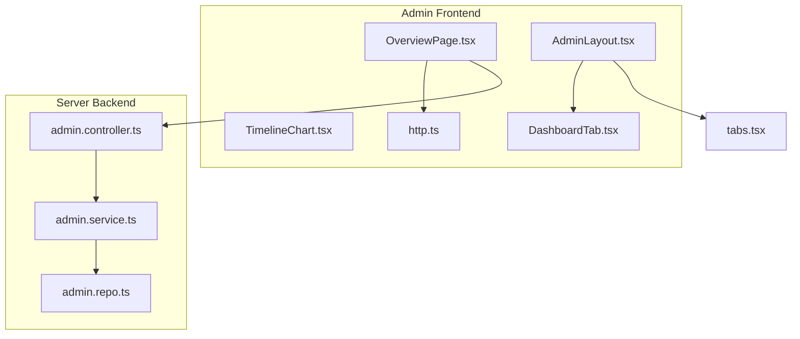
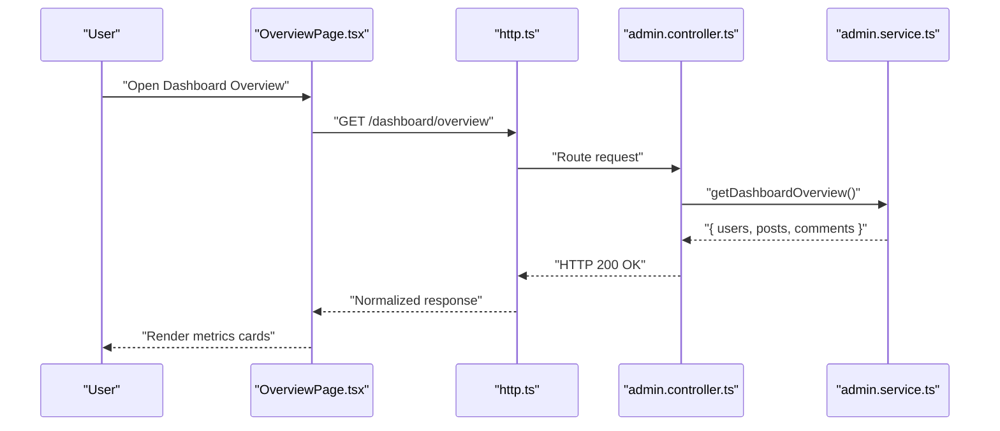
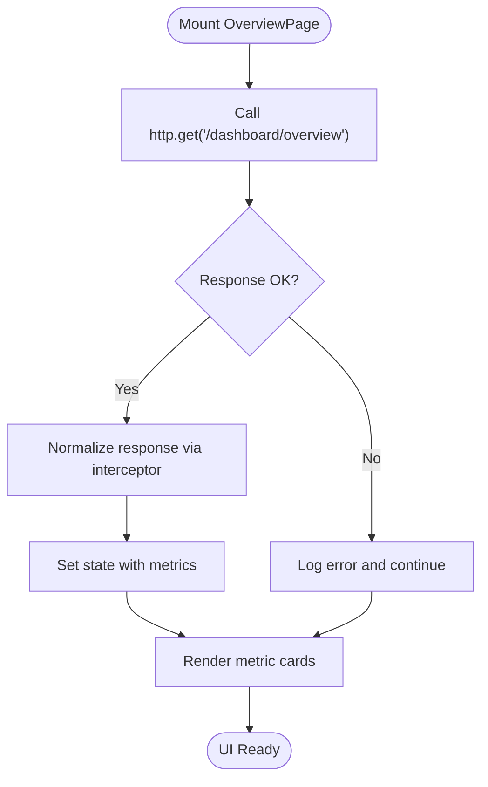
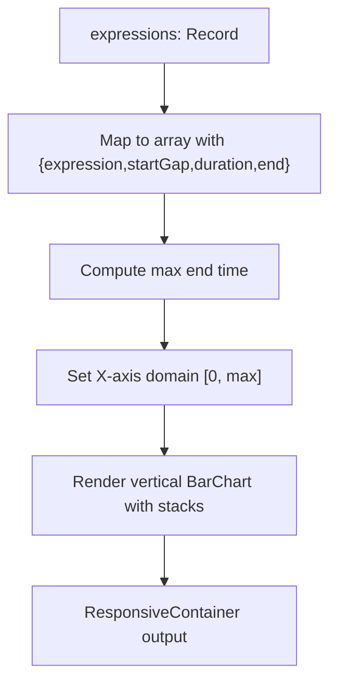
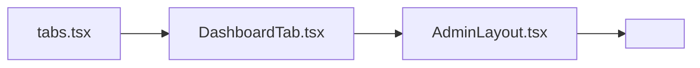
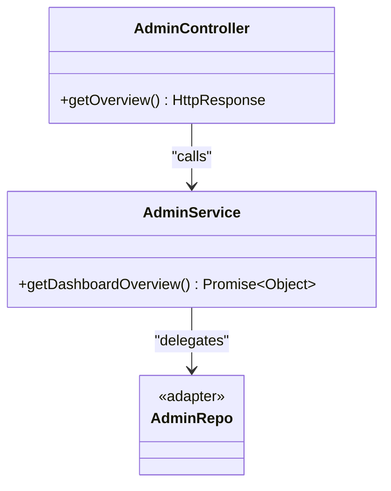
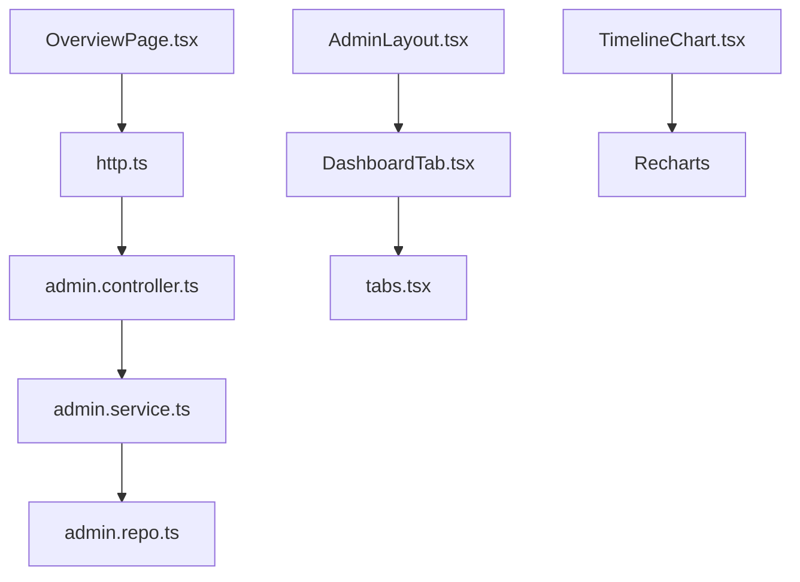

# Dashboard and Analytics

<cite>
**Referenced Files in This Document**
- [OverviewPage.tsx](file://admin/src/pages/OverviewPage.tsx)
- [TimelineChart.tsx](file://admin/src/components/charts/TimelineChart.tsx)
- [DashboardTab.tsx](file://admin/src/components/general/DashboardTab.tsx)
- [AdminLayout.tsx](file://admin/src/layouts/AdminLayout.tsx)
- [tabs.tsx](file://admin/src/constants/tabs.tsx)
- [http.ts](file://admin/src/services/http.ts)
- [admin.controller.ts](file://server/src/modules/admin/admin.controller.ts)
- [admin.service.ts](file://server/src/modules/admin/admin.service.ts)
- [admin.repo.ts](file://server/src/modules/admin/admin.repo.ts)
</cite>

## Table of Contents
1. [Introduction](#introduction)
2. [Project Structure](#project-structure)
3. [Core Components](#core-components)
4. [Architecture Overview](#architecture-overview)
5. [Detailed Component Analysis](#detailed-component-analysis)
6. [Dependency Analysis](#dependency-analysis)
7. [Performance Considerations](#performance-considerations)
8. [Troubleshooting Guide](#troubleshooting-guide)
9. [Conclusion](#conclusion)

## Introduction
This document explains the admin dashboard analytics and overview components. It covers:
- OverviewPage: key metrics display, loading states, and data presentation
- TimelineChart: vertical bar chart for time-based analytics
- DashboardTab and AdminLayout: navigation and tab organization
- Data aggregation patterns and administrative KPI tracking
- Real-time update considerations and performance characteristics

## Project Structure
The admin dashboard is a React application integrated with a backend service. The overview page fetches aggregated metrics from the backend and renders them in cards. Navigation is provided via a sidebar with tab entries. Charts are built using Recharts.

**Diagram sources**
- [OverviewPage.tsx](file://admin/src/pages/OverviewPage.tsx#L1-L80)
- [TimelineChart.tsx](file://admin/src/components/charts/TimelineChart.tsx#L1-L47)
- [DashboardTab.tsx](file://admin/src/components/general/DashboardTab.tsx#L1-L28)
- [AdminLayout.tsx](file://admin/src/layouts/AdminLayout.tsx#L1-L132)
- [tabs.tsx](file://admin/src/constants/tabs.tsx#L1-L53)
- [http.ts](file://admin/src/services/http.ts#L1-L154)
- [admin.controller.ts](file://server/src/modules/admin/admin.controller.ts#L1-L125)
- [admin.service.ts](file://server/src/modules/admin/admin.service.ts#L1-L207)
- [admin.repo.ts](file://server/src/modules/admin/admin.repo.ts#L1-L60)

**Section sources**
- [OverviewPage.tsx](file://admin/src/pages/OverviewPage.tsx#L1-L80)
- [AdminLayout.tsx](file://admin/src/layouts/AdminLayout.tsx#L1-L132)
- [tabs.tsx](file://admin/src/constants/tabs.tsx#L1-L53)
- [http.ts](file://admin/src/services/http.ts#L1-L154)
- [admin.controller.ts](file://server/src/modules/admin/admin.controller.ts#L1-L125)
- [admin.service.ts](file://server/src/modules/admin/admin.service.ts#L1-L207)
- [admin.repo.ts](file://server/src/modules/admin/admin.repo.ts#L1-L60)

## Core Components
- OverviewPage: Fetches and displays total users, posts, and comments. Uses a dedicated HTTP client and handles loading and error states.
- TimelineChart: Renders a responsive vertical bar chart from time-range data, supporting dynamic height and tooltips.
- DashboardTab: Styled navigation link for the admin sidebar, highlighting active routes.
- AdminLayout: Provides the admin shell with sidebar navigation, mobile menu, and outlet rendering for child pages.
- Tabs configuration: Centralized list of navigation entries for the admin panel.

**Section sources**
- [OverviewPage.tsx](file://admin/src/pages/OverviewPage.tsx#L12-L78)
- [TimelineChart.tsx](file://admin/src/components/charts/TimelineChart.tsx#L10-L44)
- [DashboardTab.tsx](file://admin/src/components/general/DashboardTab.tsx#L4-L25)
- [AdminLayout.tsx](file://admin/src/layouts/AdminLayout.tsx#L11-L129)
- [tabs.tsx](file://admin/src/constants/tabs.tsx#L7-L52)

## Architecture Overview
The overview page integrates with the backend via a typed HTTP client. The server exposes a route that delegates to a controller and service layer, returning a simple data envelope. The UI renders cards with icons and counts.

**Diagram sources**
- [OverviewPage.tsx](file://admin/src/pages/OverviewPage.tsx#L16-L29)
- [http.ts](file://admin/src/services/http.ts#L34-L57)
- [admin.controller.ts](file://server/src/modules/admin/admin.controller.ts#L9-L12)
- [admin.service.ts](file://server/src/modules/admin/admin.service.ts#L8-L17)

## Detailed Component Analysis

### OverviewPage Implementation
OverviewPage fetches dashboard metrics and renders three summary cards:
- Total Users
- Total Posts
- Total Comments

Key behaviors:
- Uses a dedicated HTTP client to call the backend endpoint
- Normalizes responses via interceptors
- Handles loading state and fallback values
- Uses Tailwind classes for theming and layout

**Diagram sources**
- [OverviewPage.tsx](file://admin/src/pages/OverviewPage.tsx#L16-L29)
- [http.ts](file://admin/src/services/http.ts#L34-L57)

**Section sources**
- [OverviewPage.tsx](file://admin/src/pages/OverviewPage.tsx#L12-L78)
- [http.ts](file://admin/src/services/http.ts#L11-L19)
- [http.ts](file://admin/src/services/http.ts#L34-L57)

### TimelineChart Component
TimelineChart visualizes time-based intervals per expression category:
- Accepts an object mapping categories to [start, end] tuples
- Transforms data into a vertical stacked bar layout
- Computes chart domain from maximum end time
- Responsive container adjusts height based on number of categories
- Includes grid, axes, tooltip, and transparent offset bars

**Diagram sources**
- [TimelineChart.tsx](file://admin/src/components/charts/TimelineChart.tsx#L16-L24)
- [TimelineChart.tsx](file://admin/src/components/charts/TimelineChart.tsx#L30-L41)

**Section sources**
- [TimelineChart.tsx](file://admin/src/components/charts/TimelineChart.tsx#L4-L46)

### DashboardTab and Navigation Organization
DashboardTab wraps NavLink to provide consistent styling and active state handling. AdminLayout composes the sidebar, mobile menu, and outlet area. The tabs configuration centralizes navigation entries.

**Diagram sources**
- [tabs.tsx](file://admin/src/constants/tabs.tsx#L7-L52)
- [DashboardTab.tsx](file://admin/src/components/general/DashboardTab.tsx#L12-L24)
- [AdminLayout.tsx](file://admin/src/layouts/AdminLayout.tsx#L101-L110)

**Section sources**
- [DashboardTab.tsx](file://admin/src/components/general/DashboardTab.tsx#L4-L25)
- [AdminLayout.tsx](file://admin/src/layouts/AdminLayout.tsx#L101-L110)
- [tabs.tsx](file://admin/src/constants/tabs.tsx#L1-L53)

### Data Aggregation Patterns and Administrative KPI Tracking
The backend currently returns placeholder metrics for users, posts, and comments. The service method logs and returns a fixed structure. Future enhancements can:
- Query database aggregates for counts
- Add filters for time windows
- Introduce caching for frequent reads
- Expose additional KPIs (e.g., growth rates, engagement)

**Diagram sources**
- [admin.controller.ts](file://server/src/modules/admin/admin.controller.ts#L9-L12)
- [admin.service.ts](file://server/src/modules/admin/admin.service.ts#L8-L17)
- [admin.repo.ts](file://server/src/modules/admin/admin.repo.ts#L4-L22)

**Section sources**
- [admin.controller.ts](file://server/src/modules/admin/admin.controller.ts#L9-L12)
- [admin.service.ts](file://server/src/modules/admin/admin.service.ts#L8-L17)
- [admin.repo.ts](file://server/src/modules/admin/admin.repo.ts#L4-L22)

### Real-Time Updates and Filtering
- Real-time updates: Not implemented in current OverviewPage; consider integrating WebSocket updates or polling for live metrics.
- Filtering: No filter controls exist yet; add date range pickers and category selectors to TimelineChart for richer analytics.

[No sources needed since this section provides general guidance]

## Dependency Analysis
The frontend depends on:
- Axios-based HTTP client with interceptors for normalization and token injection
- Recharts for visualization
- React Router for navigation

The backend depends on:
- Express controllers and services
- Repository adapters for data access

**Diagram sources**
- [OverviewPage.tsx](file://admin/src/pages/OverviewPage.tsx#L1-L3)
- [http.ts](file://admin/src/services/http.ts#L1-L19)
- [admin.controller.ts](file://server/src/modules/admin/admin.controller.ts#L1-L12)
- [admin.service.ts](file://server/src/modules/admin/admin.service.ts#L1-L6)
- [admin.repo.ts](file://server/src/modules/admin/admin.repo.ts#L1-L3)
- [AdminLayout.tsx](file://admin/src/layouts/AdminLayout.tsx#L1-L7)
- [DashboardTab.tsx](file://admin/src/components/general/DashboardTab.tsx#L1-L2)
- [tabs.tsx](file://admin/src/constants/tabs.tsx#L1-L53)
- [TimelineChart.tsx](file://admin/src/components/charts/TimelineChart.tsx#L1-L2)

**Section sources**
- [http.ts](file://admin/src/services/http.ts#L11-L19)
- [admin.controller.ts](file://server/src/modules/admin/admin.controller.ts#L1-L12)
- [admin.service.ts](file://server/src/modules/admin/admin.service.ts#L1-L6)
- [admin.repo.ts](file://server/src/modules/admin/admin.repo.ts#L1-L3)

## Performance Considerations
- Use virtualization for large datasets in future analytics tables
- Debounce or throttle chart interactions (e.g., tooltips, zoom)
- Cache frequently accessed overview metrics with appropriate TTL
- Lazy-load charts and heavy components to reduce initial bundle size
- Monitor network latency and implement retry/backoff for API calls

[No sources needed since this section provides general guidance]

## Troubleshooting Guide
Common issues and resolutions:
- Unauthorized access: Session validation redirects to sign-in and clears invalid tokens
- 401 responses: Automatic token refresh via interceptor queues requests until refreshed
- Network failures: Errors are logged; ensure base URLs and credentials are configured correctly
- Empty metrics: UI falls back to zero values; verify backend endpoint returns expected shape

**Section sources**
- [AdminLayout.tsx](file://admin/src/layouts/AdminLayout.tsx#L17-L65)
- [http.ts](file://admin/src/services/http.ts#L97-L150)
- [OverviewPage.tsx](file://admin/src/pages/OverviewPage.tsx#L16-L29)

## Conclusion
The admin dashboard provides a solid foundation for analytics with a concise overview page, reusable navigation, and a flexible chart component. Extending the backend with real aggregates, adding filtering and real-time updates, and enhancing the chart with interactivity will elevate the system to a production-ready analytics hub.