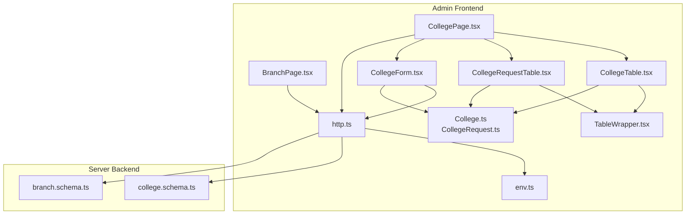
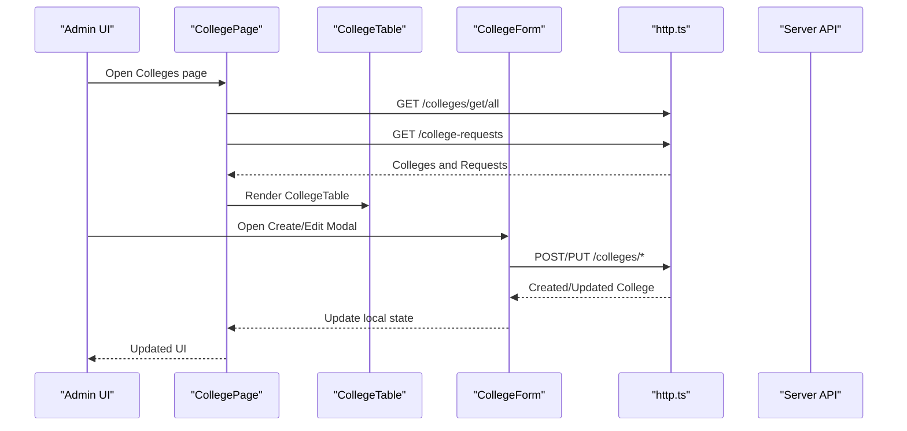
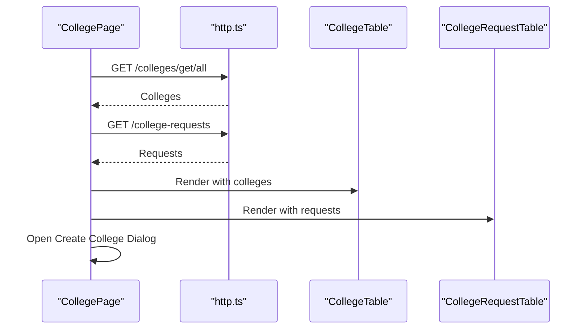
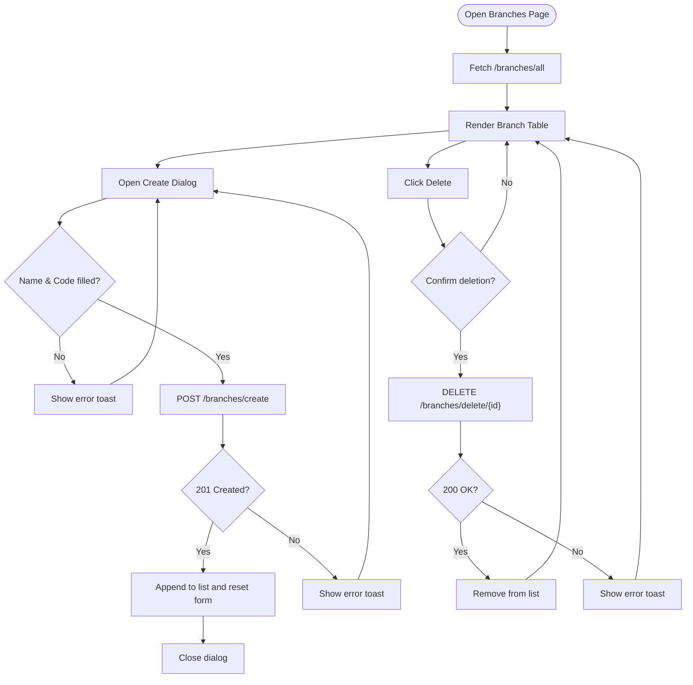
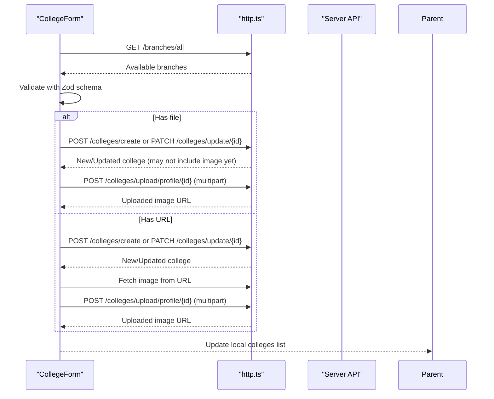
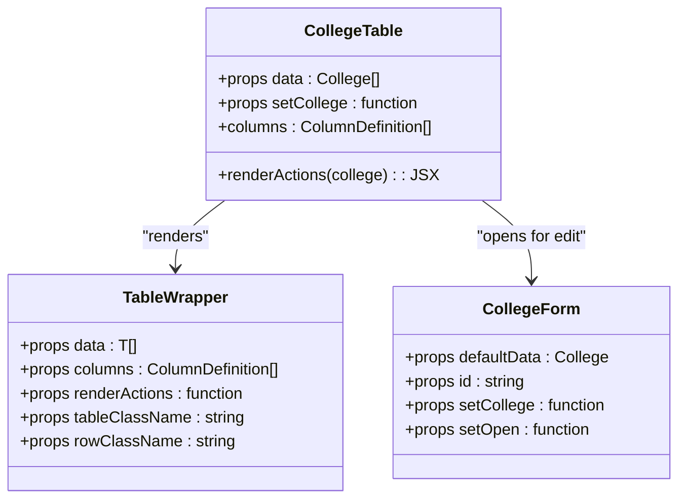
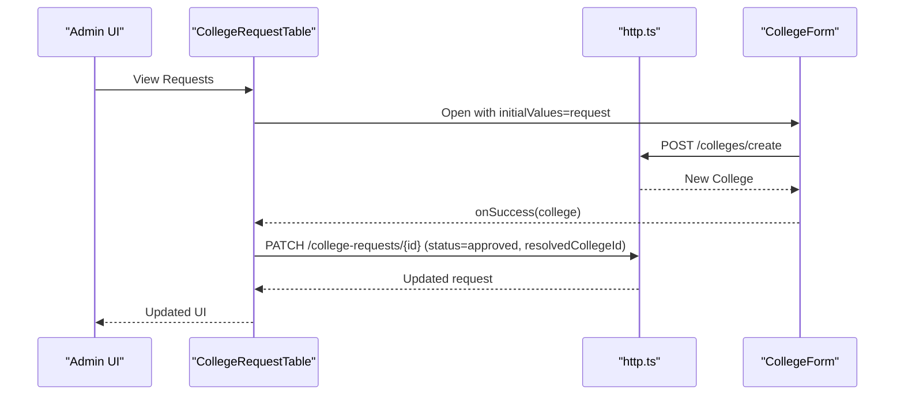
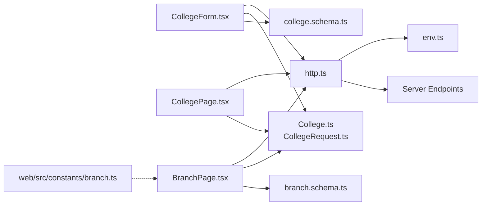

# Institutional Management

<cite>
**Referenced Files in This Document**
- [CollegePage.tsx](file://admin/src/pages/CollegePage.tsx)
- [BranchPage.tsx](file://admin/src/pages/BranchPage.tsx)
- [CollegeForm.tsx](file://admin/src/components/forms/CollegeForm.tsx)
- [CollegeTable.tsx](file://admin/src/components/general/CollegeTable.tsx)
- [CollegeRequestTable.tsx](file://admin/src/components/general/CollegeRequestTable.tsx)
- [TableWrapper.tsx](file://admin/src/components/general/TableWrapper.tsx)
- [College.ts](file://admin/src/types/College.ts)
- [CollegeRequest.ts](file://admin/src/types/CollegeRequest.ts)
- [college.schema.ts](file://server/src/modules/college/college.schema.ts)
- [branch.schema.ts](file://server/src/modules/admin/branch/branch.schema.ts)
- [http.ts](file://admin/src/services/http.ts)
- [env.ts](file://admin/src/config/env.ts)
- [api.ts](file://admin/src/types/api.ts)
- [branch.ts](file://web/src/constants/branch.ts)
</cite>

## Table of Contents
1. [Introduction](#introduction)
2. [Project Structure](#project-structure)
3. [Core Components](#core-components)
4. [Architecture Overview](#architecture-overview)
5. [Detailed Component Analysis](#detailed-component-analysis)
6. [Dependency Analysis](#dependency-analysis)
7. [Performance Considerations](#performance-considerations)
8. [Troubleshooting Guide](#troubleshooting-guide)
9. [Conclusion](#conclusion)

## Introduction
This document explains the institutional management system focused on colleges and branches. It covers:
- CollegePage: central administrative view for colleges and college requests, including creation and approval workflows.
- BranchPage: department and program management with a simple CRUD interface for branches.
- CollegeForm: a robust form for creating and updating colleges with validation, image handling, and branch selection.
- CollegeTable: an overview table for colleges with inline editing capabilities.

The system integrates frontend React components with a backend API using typed schemas and a normalized HTTP client.

## Project Structure
The institutional management resides primarily in the admin application under the admin package. Key areas:
- Pages: CollegePage and BranchPage orchestrate data fetching and UI composition.
- Forms: CollegeForm encapsulates validation, submission, and media handling.
- Tables: CollegeTable and CollegeRequestTable present institutional data and actions.
- Shared: Types define the data contracts; HTTP service abstracts API communication.

**Diagram sources**
- [CollegePage.tsx](file://admin/src/pages/CollegePage.tsx#L1-L98)
- [BranchPage.tsx](file://admin/src/pages/BranchPage.tsx#L1-L142)
- [CollegeForm.tsx](file://admin/src/components/forms/CollegeForm.tsx#L1-L432)
- [CollegeTable.tsx](file://admin/src/components/general/CollegeTable.tsx#L1-L95)
- [CollegeRequestTable.tsx](file://admin/src/components/general/CollegeRequestTable.tsx#L1-L145)
- [TableWrapper.tsx](file://admin/src/components/general/TableWrapper.tsx#L1-L101)
- [http.ts](file://admin/src/services/http.ts#L1-L154)
- [env.ts](file://admin/src/config/env.ts#L1-L5)
- [College.ts](file://admin/src/types/College.ts#L1-L10)
- [CollegeRequest.ts](file://admin/src/types/CollegeRequest.ts#L1-L14)
- [college.schema.ts](file://server/src/modules/college/college.schema.ts#L1-L67)
- [branch.schema.ts](file://server/src/modules/admin/branch/branch.schema.ts#L1-L26)

**Section sources**
- [CollegePage.tsx](file://admin/src/pages/CollegePage.tsx#L1-L98)
- [BranchPage.tsx](file://admin/src/pages/BranchPage.tsx#L1-L142)
- [CollegeForm.tsx](file://admin/src/components/forms/CollegeForm.tsx#L1-L432)
- [CollegeTable.tsx](file://admin/src/components/general/CollegeTable.tsx#L1-L95)
- [CollegeRequestTable.tsx](file://admin/src/components/general/CollegeRequestTable.tsx#L1-L145)
- [TableWrapper.tsx](file://admin/src/components/general/TableWrapper.tsx#L1-L101)
- [http.ts](file://admin/src/services/http.ts#L1-L154)
- [env.ts](file://admin/src/config/env.ts#L1-L5)
- [College.ts](file://admin/src/types/College.ts#L1-L10)
- [CollegeRequest.ts](file://admin/src/types/CollegeRequest.ts#L1-L14)
- [college.schema.ts](file://server/src/modules/college/college.schema.ts#L1-L67)
- [branch.schema.ts](file://server/src/modules/admin/branch/branch.schema.ts#L1-L26)

## Core Components
- CollegePage: Loads colleges and college requests, renders overview and requests, and provides a modal to create colleges via CollegeForm.
- BranchPage: Lists branches and supports creation and deletion with basic validation.
- CollegeForm: Validates input, handles profile image selection or URL, and manages creation/update of colleges with branch associations.
- CollegeTable: Displays colleges with metadata and inline edit actions using a generic TableWrapper.

**Section sources**
- [CollegePage.tsx](file://admin/src/pages/CollegePage.tsx#L12-L95)
- [BranchPage.tsx](file://admin/src/pages/BranchPage.tsx#L16-L139)
- [CollegeForm.tsx](file://admin/src/components/forms/CollegeForm.tsx#L35-L255)
- [CollegeTable.tsx](file://admin/src/components/general/CollegeTable.tsx#L23-L94)

## Architecture Overview
The system follows a layered architecture:
- Presentation layer: React pages and components.
- Data layer: HTTP client with interceptors for auth and response normalization.
- Validation layer: Zod schemas on the backend for strict input validation.
- Types layer: TypeScript interfaces ensuring consistency between frontend and backend.

**Diagram sources**
- [CollegePage.tsx](file://admin/src/pages/CollegePage.tsx#L19-L42)
- [CollegeTable.tsx](file://admin/src/components/general/CollegeTable.tsx#L85-L93)
- [CollegeForm.tsx](file://admin/src/components/forms/CollegeForm.tsx#L172-L255)
- [http.ts](file://admin/src/services/http.ts#L11-L19)

## Detailed Component Analysis

### CollegePage
Responsibilities:
- Fetch colleges and college requests concurrently.
- Provide a modal to create colleges using CollegeForm.
- Render CollegeTable for existing colleges.
- Render CollegeRequestTable for pending requests with approve/reject actions.

Key behaviors:
- Uses Promise.all to fetch both datasets efficiently.
- Displays loading state until data is ready.
- Opens a dialog to host CollegeForm for creation.

**Diagram sources**
- [CollegePage.tsx](file://admin/src/pages/CollegePage.tsx#L19-L42)
- [CollegeTable.tsx](file://admin/src/components/general/CollegeTable.tsx#L23-L94)
- [CollegeRequestTable.tsx](file://admin/src/components/general/CollegeRequestTable.tsx#L26-L59)

**Section sources**
- [CollegePage.tsx](file://admin/src/pages/CollegePage.tsx#L12-L95)

### BranchPage
Responsibilities:
- Load branches from the backend.
- Provide a modal to create new branches with name and code.
- Delete branches with confirmation.
- Display branches in a table with action buttons.

Validation and UX:
- Enforces non-empty name and code.
- Shows success/error notifications.
- Disables controls during save/delete operations.

**Diagram sources**
- [BranchPage.tsx](file://admin/src/pages/BranchPage.tsx#L25-L73)

**Section sources**
- [BranchPage.tsx](file://admin/src/pages/BranchPage.tsx#L16-L139)

### CollegeForm
Responsibilities:
- Validate input using Zod schema.
- Manage profile image selection or URL input.
- Upload images to Cloudinary via the backend.
- Create or update colleges and update local state.
- Allow selecting multiple branches.

Data handling:
- Supports file upload and remote URL fetching for profile images.
- Determines whether to upload a file or fetch a URL based on user input.
- On success, updates the parent’s college list.

**Diagram sources**
- [CollegeForm.tsx](file://admin/src/components/forms/CollegeForm.tsx#L48-L58)
- [CollegeForm.tsx](file://admin/src/components/forms/CollegeForm.tsx#L172-L255)
- [http.ts](file://admin/src/services/http.ts#L11-L19)

**Section sources**
- [CollegeForm.tsx](file://admin/src/components/forms/CollegeForm.tsx#L35-L255)

### CollegeTable
Responsibilities:
- Display a list of colleges with columns for name, profile preview, email domain, city, state, and branches.
- Provide inline edit actions via a dialog hosting CollegeForm pre-filled with data.
- Support copying profile URLs to clipboard.

Integration:
- Uses TableWrapper to render standardized tables.
- Leverages hover-triggered dialogs for minimal UI clutter.

**Diagram sources**
- [CollegeTable.tsx](file://admin/src/components/general/CollegeTable.tsx#L23-L94)
- [TableWrapper.tsx](file://admin/src/components/general/TableWrapper.tsx#L35-L101)
- [CollegeForm.tsx](file://admin/src/components/forms/CollegeForm.tsx#L35-L85)

**Section sources**
- [CollegeTable.tsx](file://admin/src/components/general/CollegeTable.tsx#L23-L94)

### CollegeRequestTable
Responsibilities:
- Display pending college requests with metadata and status.
- Approve requests by opening a modal pre-populated with request data and creating a new college.
- Reject requests by updating status.

Approval workflow:
- Approve triggers CollegeForm with initial values from the request.
- On success, updates the request status to approved and records the resolved college ID.

**Diagram sources**
- [CollegeRequestTable.tsx](file://admin/src/components/general/CollegeRequestTable.tsx#L87-L114)
- [CollegeForm.tsx](file://admin/src/components/forms/CollegeForm.tsx#L35-L85)

**Section sources**
- [CollegeRequestTable.tsx](file://admin/src/components/general/CollegeRequestTable.tsx#L26-L133)

### Backend Schemas and Validation
- College schemas enforce:
  - Non-empty, properly formatted email domains.
  - UUID-format branch arrays.
  - Optional fields for updates.
- Branch schemas enforce minimum length for name and code.

These schemas guide both frontend validation and backend enforcement.

**Section sources**
- [college.schema.ts](file://server/src/modules/college/college.schema.ts#L3-L35)
- [branch.schema.ts](file://server/src/modules/admin/branch/branch.schema.ts#L3-L25)

### Data Contracts
- College: identifier, name, profile URL, email domain, city, state, and associated branch IDs.
- CollegeRequest: request metadata, status, optional resolved college ID, timestamps.

**Section sources**
- [College.ts](file://admin/src/types/College.ts#L1-L10)
- [CollegeRequest.ts](file://admin/src/types/CollegeRequest.ts#L1-L14)

## Dependency Analysis
- Frontend depends on:
  - HTTP client for API communication.
  - Environment configuration for base URLs.
  - Zod schemas for validation.
  - Shared types for data contracts.
- Backend enforces validation via Zod schemas.
- Web constants provide fallbacks for branch selection in the web app.

**Diagram sources**
- [http.ts](file://admin/src/services/http.ts#L1-L154)
- [env.ts](file://admin/src/config/env.ts#L1-L5)
- [CollegeForm.tsx](file://admin/src/components/forms/CollegeForm.tsx#L1-L432)
- [CollegePage.tsx](file://admin/src/pages/CollegePage.tsx#L1-L98)
- [BranchPage.tsx](file://admin/src/pages/BranchPage.tsx#L1-L142)
- [College.ts](file://admin/src/types/College.ts#L1-L10)
- [CollegeRequest.ts](file://admin/src/types/CollegeRequest.ts#L1-L14)
- [college.schema.ts](file://server/src/modules/college/college.schema.ts#L1-L67)
- [branch.schema.ts](file://server/src/modules/admin/branch/branch.schema.ts#L1-L26)
- [branch.ts](file://web/src/constants/branch.ts#L1-L7)

**Section sources**
- [http.ts](file://admin/src/services/http.ts#L1-L154)
- [env.ts](file://admin/src/config/env.ts#L1-L5)
- [CollegeForm.tsx](file://admin/src/components/forms/CollegeForm.tsx#L1-L432)
- [CollegePage.tsx](file://admin/src/pages/CollegePage.tsx#L1-L98)
- [BranchPage.tsx](file://admin/src/pages/BranchPage.tsx#L1-L142)
- [College.ts](file://admin/src/types/College.ts#L1-L10)
- [CollegeRequest.ts](file://admin/src/types/CollegeRequest.ts#L1-L14)
- [college.schema.ts](file://server/src/modules/college/college.schema.ts#L1-L67)
- [branch.schema.ts](file://server/src/modules/admin/branch/branch.schema.ts#L1-L26)
- [branch.ts](file://web/src/constants/branch.ts#L1-L7)

## Performance Considerations
- Batch data fetching: CollegePage uses concurrent requests for colleges and requests to reduce load time.
- Minimal re-renders: TableWrapper renders rows efficiently with mapped columns and optional action cells.
- Lazy branch loading: CollegeForm fetches available branches only when the form mounts.
- Image handling: Profile image upload occurs after college creation to avoid blocking the primary operation.

[No sources needed since this section provides general guidance]

## Troubleshooting Guide
Common issues and resolutions:
- Network errors:
  - Symptom: Toast messages indicate failure to fetch or submit.
  - Action: Verify API base URL and credentials; check interceptor logs.
- Validation errors:
  - Symptom: Form displays validation messages for name, email domain, city, state, or branches.
  - Action: Ensure inputs meet schema requirements; confirm branch IDs are valid UUIDs.
- Image upload failures:
  - Symptom: Profile image fails to upload or preview does not appear.
  - Action: Confirm file type is an image, or the URL is accessible; retry after fixing the URL or selecting a valid file.
- Request approval failures:
  - Symptom: Approving a request does not update status.
  - Action: Ensure the resolved college ID is valid; verify backend permissions and network connectivity.

**Section sources**
- [http.ts](file://admin/src/services/http.ts#L97-L150)
- [CollegeForm.tsx](file://admin/src/components/forms/CollegeForm.tsx#L244-L255)
- [CollegeRequestTable.tsx](file://admin/src/components/general/CollegeRequestTable.tsx#L53-L58)

## Conclusion
The institutional management system provides a cohesive solution for managing colleges and branches:
- CollegePage orchestrates overview and approval workflows.
- BranchPage offers straightforward branch administration.
- CollegeForm ensures robust data entry with validation and media handling.
- CollegeTable delivers a clean, editable overview of institutions.

The design leverages strong typing, centralized HTTP configuration, and reusable table components to maintain consistency and scalability.