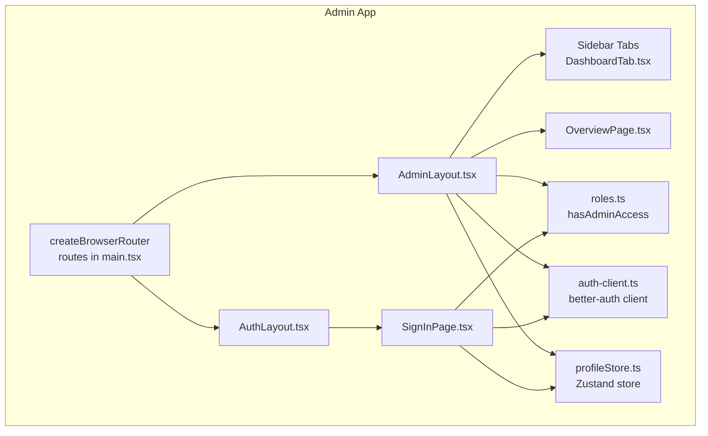
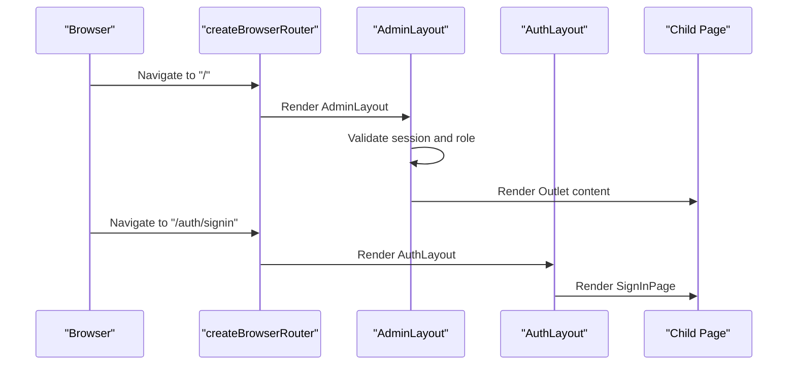
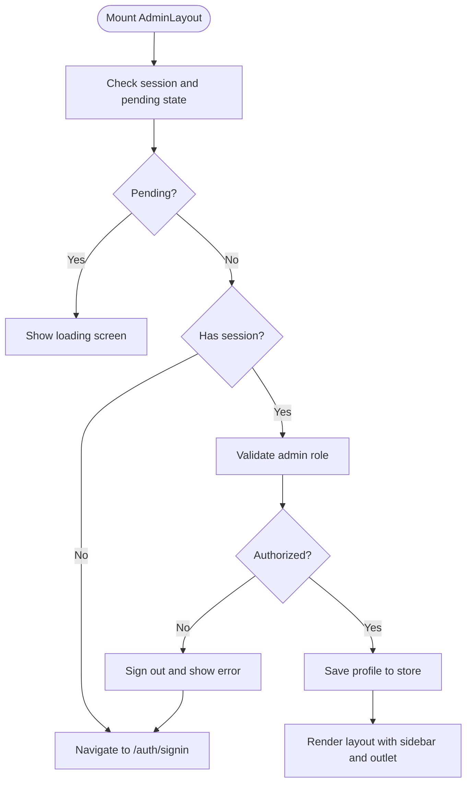
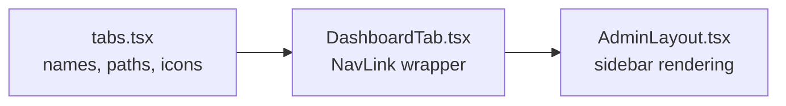
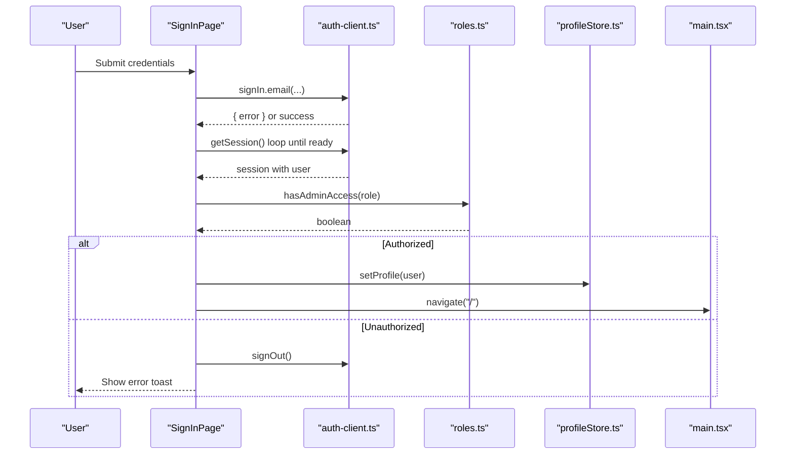
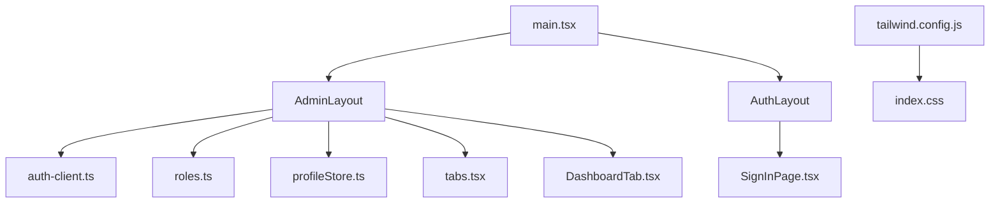

# Layout and Navigation

<cite>
**Referenced Files in This Document**
- [AdminLayout.tsx](file://admin/src/layouts/AdminLayout.tsx)
- [AuthLayout.tsx](file://admin/src/layouts/AuthLayout.tsx)
- [main.tsx](file://admin/src/main.tsx)
- [auth-client.ts](file://admin/src/lib/auth-client.ts)
- [roles.ts](file://admin/src/lib/roles.ts)
- [tabs.tsx](file://admin/src/constants/tabs.tsx)
- [DashboardTab.tsx](file://admin/src/components/general/DashboardTab.tsx)
- [Header.tsx](file://admin/src/components/general/Header.tsx)
- [profileStore.ts](file://admin/src/store/profileStore.ts)
- [OverviewPage.tsx](file://admin/src/pages/OverviewPage.tsx)
- [SignInPage.tsx](file://admin/src/pages/SignInPage.tsx)
- [index.css](file://admin/src/index.css)
- [tailwind.config.js](file://admin/tailwind.config.js)
- [package.json](file://admin/package.json)
</cite>

## Table of Contents
1. [Introduction](#introduction)
2. [Project Structure](#project-structure)
3. [Core Components](#core-components)
4. [Architecture Overview](#architecture-overview)
5. [Detailed Component Analysis](#detailed-component-analysis)
6. [Dependency Analysis](#dependency-analysis)
7. [Performance Considerations](#performance-considerations)
8. [Troubleshooting Guide](#troubleshooting-guide)
9. [Conclusion](#conclusion)

## Introduction
This document explains the admin dashboard layout system and navigation structure. It covers the AdminLayout component that provides the main administrative interface framework, including sidebar navigation, header components, and responsive design patterns. It also documents the routing configuration with React Router, nested route structure, authentication guards, navigation hierarchy, and user access controls. Additionally, it describes the AuthLayout for authentication flows and the overall theming system using Tailwind CSS and Radix UI components.

## Project Structure
The admin application is organized around a React Router-based routing tree with dedicated layouts for authenticated admin views and authentication flows. The AdminLayout composes the sidebar navigation, mobile menu, and outlet rendering for child pages. The AuthLayout hosts sign-in and related authentication pages. Theming leverages Tailwind CSS with a dark mode configuration and Radix UI primitives for accessible UI components.

**Diagram sources**
- [main.tsx](file://admin/src/main.tsx#L20-L89)
- [AdminLayout.tsx](file://admin/src/layouts/AdminLayout.tsx#L11-L132)
- [AuthLayout.tsx](file://admin/src/layouts/AuthLayout.tsx#L4-L16)
- [DashboardTab.tsx](file://admin/src/components/general/DashboardTab.tsx#L4-L28)
- [roles.ts](file://admin/src/lib/roles.ts#L3-L6)
- [auth-client.ts](file://admin/src/lib/auth-client.ts#L4-L10)
- [profileStore.ts](file://admin/src/store/profileStore.ts#L12-L35)

**Section sources**
- [main.tsx](file://admin/src/main.tsx#L1-L96)
- [AdminLayout.tsx](file://admin/src/layouts/AdminLayout.tsx#L1-L132)
- [AuthLayout.tsx](file://admin/src/layouts/AuthLayout.tsx#L1-L16)

## Core Components
- AdminLayout: Provides the main admin shell with responsive sidebar, mobile menu, and outlet rendering for nested routes. Implements session validation and admin-role checks.
- AuthLayout: Wraps authentication routes with centered layout and toast support.
- DashboardTab: Styled navigation item for sidebar links with active state styling.
- tabs constant: Defines the sidebar navigation entries with labels, paths, and icons.
- roles: Role-based access control for admin-only areas.
- auth-client: Better Auth client configured for admin flows and inferred user fields.
- profileStore: Zustand store for user profile and theme preferences.
- Header: Optional top navigation bar used in other parts of the system (not part of AdminLayout).
- Routing: Nested routes under "/" for admin pages and "/auth" for sign-in.

**Section sources**
- [AdminLayout.tsx](file://admin/src/layouts/AdminLayout.tsx#L11-L132)
- [AuthLayout.tsx](file://admin/src/layouts/AuthLayout.tsx#L4-L16)
- [DashboardTab.tsx](file://admin/src/components/general/DashboardTab.tsx#L4-L28)
- [tabs.tsx](file://admin/src/constants/tabs.tsx#L7-L53)
- [roles.ts](file://admin/src/lib/roles.ts#L3-L6)
- [auth-client.ts](file://admin/src/lib/auth-client.ts#L4-L10)
- [profileStore.ts](file://admin/src/store/profileStore.ts#L12-L35)
- [Header.tsx](file://admin/src/components/general/Header.tsx#L12-L65)
- [main.tsx](file://admin/src/main.tsx#L20-L89)

## Architecture Overview
The admin layout system centers on AdminLayout as the primary container. It manages:
- Session lifecycle via better-auth client
- Role validation for admin access
- Persistent user profile in Zustand store
- Responsive sidebar with mobile overlay
- Outlet rendering for nested routes

Routing is defined in main.tsx with two roots:
- "/" with AdminLayout and nested pages
- "/auth" with AuthLayout and sign-in page

**Diagram sources**
- [main.tsx](file://admin/src/main.tsx#L20-L89)
- [AdminLayout.tsx](file://admin/src/layouts/AdminLayout.tsx#L17-L65)
- [AuthLayout.tsx](file://admin/src/layouts/AuthLayout.tsx#L4-L16)

## Detailed Component Analysis

### AdminLayout Component
Responsibilities:
- Manage mobile sidebar visibility and backdrop
- Validate session and enforce admin-only access
- Persist user profile in store and redirect on failure
- Render sidebar tabs and outlet area

Key behaviors:
- Uses better-auth client to fetch and validate sessions
- Checks user role against admin roles
- Redirects unauthenticated or unauthorized users to sign-in
- Stores profile in Zustand for downstream components
- Renders a responsive grid with sidebar and content area

**Diagram sources**
- [AdminLayout.tsx](file://admin/src/layouts/AdminLayout.tsx#L17-L65)
- [roles.ts](file://admin/src/lib/roles.ts#L3-L6)
- [auth-client.ts](file://admin/src/lib/auth-client.ts#L4-L10)
- [profileStore.ts](file://admin/src/store/profileStore.ts#L18-L29)

**Section sources**
- [AdminLayout.tsx](file://admin/src/layouts/AdminLayout.tsx#L11-L132)
- [roles.ts](file://admin/src/lib/roles.ts#L1-L7)
- [auth-client.ts](file://admin/src/lib/auth-client.ts#L1-L11)
- [profileStore.ts](file://admin/src/store/profileStore.ts#L1-L39)

### AuthLayout Component
Responsibilities:
- Provide a centered container for authentication routes
- Host the sign-in page and similar auth flows
- Integrate toast notifications for user feedback

Usage:
- Nested under "/auth" in the router
- Wraps SignInPage and future auth-related pages

**Section sources**
- [AuthLayout.tsx](file://admin/src/layouts/AuthLayout.tsx#L4-L16)
- [main.tsx](file://admin/src/main.tsx#L79-L89)

### Navigation and Sidebar
Navigation hierarchy:
- Sidebar built from tabs constant
- Each tab is a styled link via DashboardTab
- Active state styling applied automatically by NavLink

Responsive behavior:
- Mobile menu toggles with overlay backdrop
- On desktop, sidebar is fixed and spans grid columns

**Diagram sources**
- [tabs.tsx](file://admin/src/constants/tabs.tsx#L7-L53)
- [DashboardTab.tsx](file://admin/src/components/general/DashboardTab.tsx#L12-L24)
- [AdminLayout.tsx](file://admin/src/layouts/AdminLayout.tsx#L101-L110)

**Section sources**
- [tabs.tsx](file://admin/src/constants/tabs.tsx#L1-L53)
- [DashboardTab.tsx](file://admin/src/components/general/DashboardTab.tsx#L1-L28)
- [AdminLayout.tsx](file://admin/src/layouts/AdminLayout.tsx#L75-L129)

### Authentication Guards and Routing
Routing configuration:
- Root "/" renders AdminLayout with nested pages
- Root "/auth" renders AuthLayout with sign-in page
- "*" falls back to NotFoundPage

Sign-in flow:
- Validates credentials via better-auth client
- Waits for session cookie readiness
- Verifies admin role and redirects accordingly
- Persists profile and navigates to home

**Diagram sources**
- [SignInPage.tsx](file://admin/src/pages/SignInPage.tsx#L38-L78)
- [auth-client.ts](file://admin/src/lib/auth-client.ts#L4-L10)
- [roles.ts](file://admin/src/lib/roles.ts#L3-L6)
- [profileStore.ts](file://admin/src/store/profileStore.ts#L18-L18)
- [main.tsx](file://admin/src/main.tsx#L79-L89)

**Section sources**
- [main.tsx](file://admin/src/main.tsx#L20-L89)
- [SignInPage.tsx](file://admin/src/pages/SignInPage.tsx#L24-L78)
- [auth-client.ts](file://admin/src/lib/auth-client.ts#L1-L11)
- [roles.ts](file://admin/src/lib/roles.ts#L1-L7)
- [profileStore.ts](file://admin/src/store/profileStore.ts#L1-L39)

### Theming System
Theming approach:
- Tailwind CSS configured with dark mode support
- CSS variables define color tokens for light/dark themes
- Radix UI components integrate with Tailwind utilities
- Consistent color palette applied across layout and components

Key files:
- Tailwind configuration extends colors and animations
- Global CSS defines base styles and dark mode tokens
- Package dependencies include Radix UI packages and Tailwind plugins

**Section sources**
- [tailwind.config.js](file://admin/tailwind.config.js#L1-L82)
- [index.css](file://admin/src/index.css#L15-L72)
- [package.json](file://admin/package.json#L13-L57)

## Dependency Analysis
Component relationships:
- AdminLayout depends on auth-client, roles, profileStore, tabs, and DashboardTab
- AuthLayout depends on better-auth client and sign-in page
- Routing depends on layout components and page components
- Theming depends on Tailwind configuration and CSS variables

**Diagram sources**
- [AdminLayout.tsx](file://admin/src/layouts/AdminLayout.tsx#L3-L9)
- [auth-client.ts](file://admin/src/lib/auth-client.ts#L4-L10)
- [roles.ts](file://admin/src/lib/roles.ts#L3-L6)
- [profileStore.ts](file://admin/src/store/profileStore.ts#L1-L10)
- [tabs.tsx](file://admin/src/constants/tabs.tsx#L1-L6)
- [DashboardTab.tsx](file://admin/src/components/general/DashboardTab.tsx#L1-L2)
- [AuthLayout.tsx](file://admin/src/layouts/AuthLayout.tsx#L1-L3)
- [SignInPage.tsx](file://admin/src/pages/SignInPage.tsx#L1-L13)
- [main.tsx](file://admin/src/main.tsx#L6-L17)
- [tailwind.config.js](file://admin/tailwind.config.js#L1-L82)
- [index.css](file://admin/src/index.css#L1-L132)

**Section sources**
- [AdminLayout.tsx](file://admin/src/layouts/AdminLayout.tsx#L1-L132)
- [AuthLayout.tsx](file://admin/src/layouts/AuthLayout.tsx#L1-L16)
- [main.tsx](file://admin/src/main.tsx#L1-L96)
- [auth-client.ts](file://admin/src/lib/auth-client.ts#L1-L11)
- [roles.ts](file://admin/src/lib/roles.ts#L1-L7)
- [tabs.tsx](file://admin/src/constants/tabs.tsx#L1-L53)
- [DashboardTab.tsx](file://admin/src/components/general/DashboardTab.tsx#L1-L28)
- [profileStore.ts](file://admin/src/store/profileStore.ts#L1-L39)
- [tailwind.config.js](file://admin/tailwind.config.js#L1-L82)
- [index.css](file://admin/src/index.css#L1-L132)

## Performance Considerations
- Prefer lazy-loading routes for large admin pages to reduce initial bundle size.
- Debounce or throttle session validation to avoid redundant network calls.
- Use virtualized lists for large tables in admin pages to improve scrolling performance.
- Minimize re-renders by isolating state in smaller stores and avoiding unnecessary prop drilling.
- Optimize images and assets used in admin dashboards.

## Troubleshooting Guide
Common issues and resolutions:
- Unauthorized access attempts: AdminLayout signs out and redirects to sign-in with an error toast when role validation fails.
- Session readiness after sign-in: SignInPage waits for session cookie to be readable before proceeding.
- Navigation resets on route change: AdminLayout clears mobile menu state on navigation events.
- Styling inconsistencies: Verify Tailwind configuration and CSS variable definitions for dark mode.

**Section sources**
- [AdminLayout.tsx](file://admin/src/layouts/AdminLayout.tsx#L35-L57)
- [SignInPage.tsx](file://admin/src/pages/SignInPage.tsx#L52-L63)
- [index.css](file://admin/src/index.css#L45-L72)

## Conclusion
The admin dashboard layout system provides a robust, role-secured, and responsive framework. AdminLayout orchestrates session validation, role enforcement, and navigation, while AuthLayout supports authentication flows. The routing tree cleanly separates admin and auth contexts, and the theming system ensures consistent visuals across components. Together, these pieces deliver a maintainable and scalable admin experience.