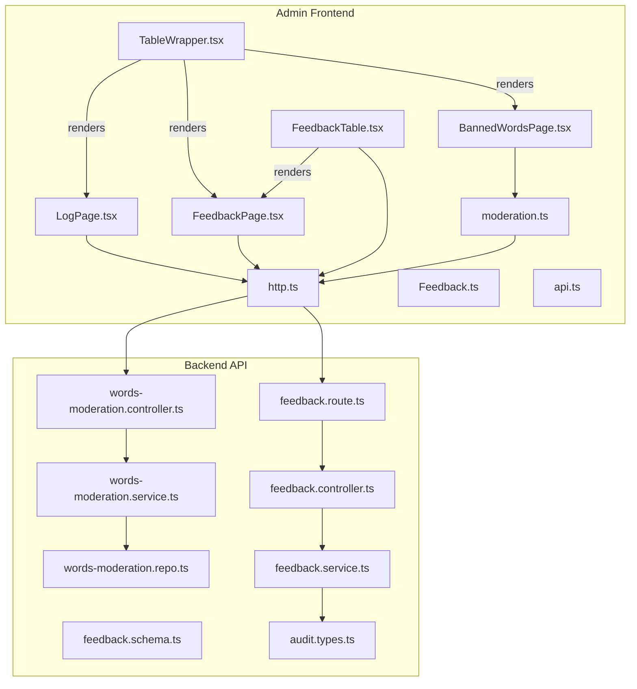
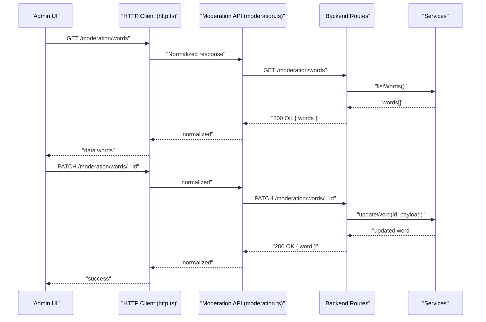
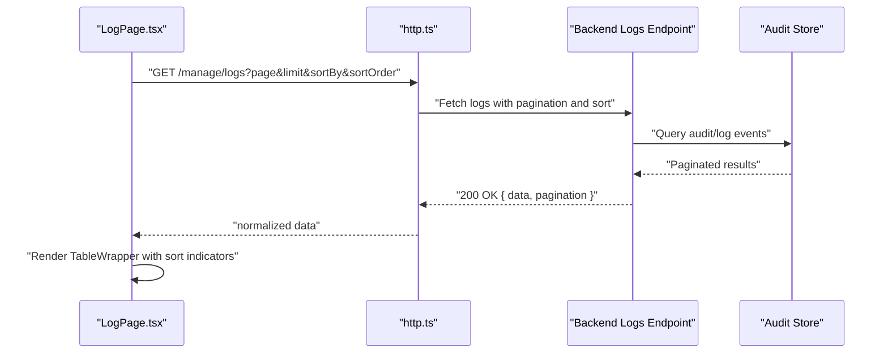
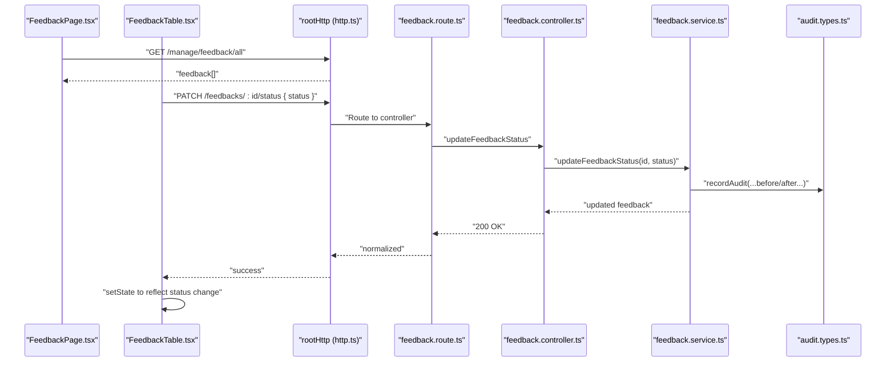
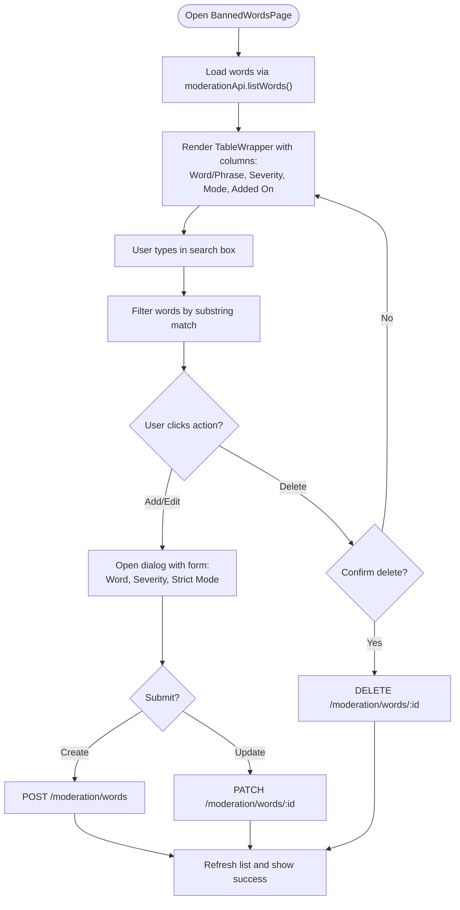
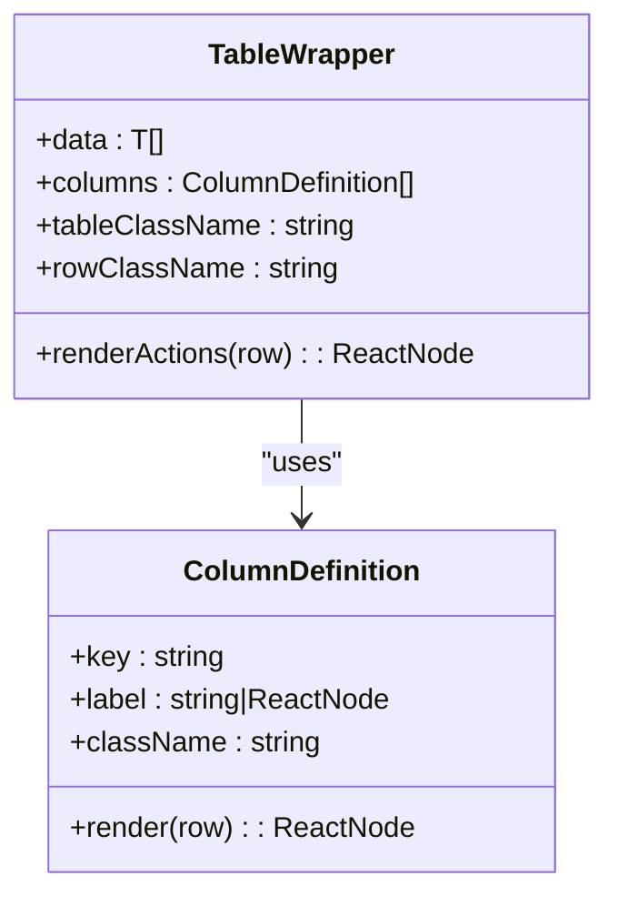
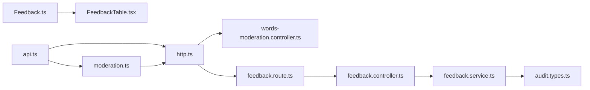

# System Configuration

<cite>
**Referenced Files in This Document**
- [LogPage.tsx](file://admin/src/pages/LogPage.tsx)
- [FeedbackPage.tsx](file://admin/src/pages/FeedbackPage.tsx)
- [BannedWordsPage.tsx](file://admin/src/pages/BannedWordsPage.tsx)
- [FeedbackTable.tsx](file://admin/src/components/general/FeedbackTable.tsx)
- [moderation.ts](file://admin/src/services/api/moderation.ts)
- [http.ts](file://admin/src/services/http.ts)
- [Feedback.ts](file://admin/src/types/Feedback.ts)
- [TableWrapper.tsx](file://admin/src/components/general/TableWrapper.tsx)
- [api.ts](file://admin/src/types/api.ts)
- [words-moderation.controller.ts](file://server/src/modules/moderation/words/words-moderation.controller.ts)
- [words-moderation.service.ts](file://server/src/modules/moderation/words/words-moderation.service.ts)
- [words-moderation.schema.ts](file://server/src/modules/moderation/words/words-moderation.schema.ts)
- [words-moderation.repo.ts](file://server/src/modules/moderation/words/words-moderation.repo.ts)
- [feedback.service.ts](file://server/src/modules/feedback/feedback.service.ts)
- [feedback.route.ts](file://server/src/modules/feedback/feedback.route.ts)
- [feedback.controller.ts](file://server/src/modules/feedback/feedback.controller.ts)
- [feedback.schema.ts](file://server/src/modules/feedback/feedback.schema.ts)
- [audit.types.ts](file://server/src/modules/audit/audit.types.ts)
</cite>

## Table of Contents
1. [Introduction](#introduction)
2. [Project Structure](#project-structure)
3. [Core Components](#core-components)
4. [Architecture Overview](#architecture-overview)
5. [Detailed Component Analysis](#detailed-component-analysis)
6. [Dependency Analysis](#dependency-analysis)
7. [Performance Considerations](#performance-considerations)
8. [Troubleshooting Guide](#troubleshooting-guide)
9. [Conclusion](#conclusion)

## Introduction
This document explains the admin system configuration and maintenance tools focused on three primary areas:
- System monitoring, audit trails, and operational logging via LogPage
- User feedback management, response tracking, and feedback analysis via FeedbackPage and FeedbackTable
- Content policy management, word filtering configuration, and moderation rule maintenance via BannedWordsPage

It covers UI components, data flows, backend integrations, and operational logging to help administrators monitor, manage, and maintain the platform effectively.

## Project Structure
The admin application is a React-based SPA that communicates with a backend API. The relevant parts for system configuration and maintenance include:
- Pages: LogPage, FeedbackPage, BannedWordsPage
- Shared components: FeedbackTable, TableWrapper
- Services: HTTP clients and moderation API
- Types: Feedback model and API response envelope
- Backend modules: Moderation (words), Feedback, Audit

**Diagram sources**
- [LogPage.tsx](file://admin/src/pages/LogPage.tsx#L1-L177)
- [FeedbackPage.tsx](file://admin/src/pages/FeedbackPage.tsx#L1-L37)
- [BannedWordsPage.tsx](file://admin/src/pages/BannedWordsPage.tsx#L1-L307)
- [FeedbackTable.tsx](file://admin/src/components/general/FeedbackTable.tsx#L1-L130)
- [TableWrapper.tsx](file://admin/src/components/general/TableWrapper.tsx#L1-L101)
- [moderation.ts](file://admin/src/services/api/moderation.ts#L1-L49)
- [http.ts](file://admin/src/services/http.ts#L1-L154)
- [Feedback.ts](file://admin/src/types/Feedback.ts#L1-L14)
- [api.ts](file://admin/src/types/api.ts#L1-L20)
- [words-moderation.controller.ts](file://server/src/modules/moderation/words/words-moderation.controller.ts#L1-L45)
- [words-moderation.service.ts](file://server/src/modules/moderation/words/words-moderation.service.ts#L1-L65)
- [words-moderation.repo.ts](file://server/src/modules/moderation/words/words-moderation.repo.ts#L1-L60)
- [feedback.service.ts](file://server/src/modules/feedback/feedback.service.ts#L50-L181)
- [feedback.route.ts](file://server/src/modules/feedback/feedback.route.ts#L1-L27)
- [feedback.controller.ts](file://server/src/modules/feedback/feedback.controller.ts#L1-L73)
- [feedback.schema.ts](file://server/src/modules/feedback/feedback.schema.ts#L1-L35)
- [audit.types.ts](file://server/src/modules/audit/audit.types.ts#L1-L22)

**Section sources**
- [LogPage.tsx](file://admin/src/pages/LogPage.tsx#L1-L177)
- [FeedbackPage.tsx](file://admin/src/pages/FeedbackPage.tsx#L1-L37)
- [BannedWordsPage.tsx](file://admin/src/pages/BannedWordsPage.tsx#L1-L307)
- [FeedbackTable.tsx](file://admin/src/components/general/FeedbackTable.tsx#L1-L130)
- [TableWrapper.tsx](file://admin/src/components/general/TableWrapper.tsx#L1-L101)
- [moderation.ts](file://admin/src/services/api/moderation.ts#L1-L49)
- [http.ts](file://admin/src/services/http.ts#L1-L154)
- [Feedback.ts](file://admin/src/types/Feedback.ts#L1-L14)
- [api.ts](file://admin/src/types/api.ts#L1-L20)
- [words-moderation.controller.ts](file://server/src/modules/moderation/words/words-moderation.controller.ts#L1-L45)
- [words-moderation.service.ts](file://server/src/modules/moderation/words/words-moderation.service.ts#L1-L65)
- [words-moderation.repo.ts](file://server/src/modules/moderation/words/words-moderation.repo.ts#L1-L60)
- [feedback.service.ts](file://server/src/modules/feedback/feedback.service.ts#L50-L181)
- [feedback.route.ts](file://server/src/modules/feedback/feedback.route.ts#L1-L27)
- [feedback.controller.ts](file://server/src/modules/feedback/feedback.controller.ts#L1-L73)
- [feedback.schema.ts](file://server/src/modules/feedback/feedback.schema.ts#L1-L35)
- [audit.types.ts](file://server/src/modules/audit/audit.types.ts#L1-L22)

## Core Components
- LogPage: Fetches and displays system audit/log events with sorting and pagination.
- FeedbackPage: Loads all feedback entries for administrative review.
- FeedbackTable: Provides actionable controls for feedback status updates and deletion.
- BannedWordsPage: Manages banned words, severity, strict mode, and search/filtering.
- TableWrapper: Reusable table renderer supporting dynamic columns and actions.
- moderation API: Admin endpoints for moderation configuration and banned word CRUD.
- HTTP service: Centralized Axios clients with interceptors and response normalization.

**Section sources**
- [LogPage.tsx](file://admin/src/pages/LogPage.tsx#L26-L177)
- [FeedbackPage.tsx](file://admin/src/pages/FeedbackPage.tsx#L7-L35)
- [FeedbackTable.tsx](file://admin/src/components/general/FeedbackTable.tsx#L13-L129)
- [BannedWordsPage.tsx](file://admin/src/pages/BannedWordsPage.tsx#L35-L306)
- [TableWrapper.tsx](file://admin/src/components/general/TableWrapper.tsx#L35-L100)
- [moderation.ts](file://admin/src/services/api/moderation.ts#L23-L48)
- [http.ts](file://admin/src/services/http.ts#L11-L154)

## Architecture Overview
The admin UI communicates with backend endpoints through normalized HTTP clients. Moderation and feedback operations are protected by admin-only middleware and logged via audit records.

**Diagram sources**
- [moderation.ts](file://admin/src/services/api/moderation.ts#L29-L47)
- [http.ts](file://admin/src/services/http.ts#L11-L154)
- [words-moderation.controller.ts](file://server/src/modules/moderation/words/words-moderation.controller.ts#L17-L42)
- [words-moderation.service.ts](file://server/src/modules/moderation/words/words-moderation.service.ts#L17-L49)
- [words-moderation.repo.ts](file://server/src/modules/moderation/words/words-moderation.repo.ts#L16-L23)

## Detailed Component Analysis

### LogPage: System Monitoring, Audit Trails, and Operational Logging
LogPage retrieves paginated, sortable log entries and renders them in a responsive table. It supports:
- Sorting by timestamp, action, platform, and status
- Metadata inspection via hover cards
- Pagination template integration
- Loading states, error handling, and empty state

Operational logging:
- Backend audit events are captured with action, platform, status, and metadata.
- Frontend displays these events for admin review.

**Diagram sources**
- [LogPage.tsx](file://admin/src/pages/LogPage.tsx#L39-L61)
- [http.ts](file://admin/src/services/http.ts#L11-L19)
- [audit.types.ts](file://server/src/modules/audit/audit.types.ts#L7-L22)

**Section sources**
- [LogPage.tsx](file://admin/src/pages/LogPage.tsx#L26-L177)

### FeedbackPage and FeedbackTable: User Feedback Management and Resolution Tracking
FeedbackPage loads all feedback entries and delegates rendering to FeedbackTable. FeedbackTable provides:
- Columns for type, title, content, status, and user
- Action menu to mark as reviewed, dismiss, or delete
- Real-time UI updates after successful operations
- Clipboard copy for title/content

Resolution tracking:
- Status transitions are audited with before/after snapshots.
- Cache invalidation ensures list freshness.

**Diagram sources**
- [FeedbackPage.tsx](file://admin/src/pages/FeedbackPage.tsx#L11-L22)
- [FeedbackTable.tsx](file://admin/src/components/general/FeedbackTable.tsx#L68-L96)
- [http.ts](file://admin/src/services/http.ts#L16-L19)
- [feedback.route.ts](file://server/src/modules/feedback/feedback.route.ts#L19-L22)
- [feedback.controller.ts](file://server/src/modules/feedback/feedback.controller.ts#L48-L62)
- [feedback.service.ts](file://server/src/modules/feedback/feedback.service.ts#L106-L134)
- [audit.types.ts](file://server/src/modules/audit/audit.types.ts#L7-L22)

**Section sources**
- [FeedbackPage.tsx](file://admin/src/pages/FeedbackPage.tsx#L7-L35)
- [FeedbackTable.tsx](file://admin/src/components/general/FeedbackTable.tsx#L13-L129)
- [Feedback.ts](file://admin/src/types/Feedback.ts#L1-L14)
- [feedback.service.ts](file://server/src/modules/feedback/feedback.service.ts#L106-L134)

### BannedWordsPage: Content Policy Management and Moderation Rule Maintenance
BannedWordsPage manages banned words with:
- CRUD operations via moderation API
- Severity selection (mild, moderate, severe)
- Strict mode toggle to enforce stricter matching
- Search/filtering by word
- Action buttons to edit or delete entries
- Responsive table with badges for severity and mode

Backend integration:
- Words are persisted and matched using a moderation service.
- Updates trigger matcher rebuild to apply new rules immediately.

**Diagram sources**
- [BannedWordsPage.tsx](file://admin/src/pages/BannedWordsPage.tsx#L50-L129)
- [moderation.ts](file://admin/src/services/api/moderation.ts#L29-L47)
- [words-moderation.controller.ts](file://server/src/modules/moderation/words/words-moderation.controller.ts#L22-L42)
- [words-moderation.service.ts](file://server/src/modules/moderation/words/words-moderation.service.ts#L21-L49)
- [words-moderation.repo.ts](file://server/src/modules/moderation/words/words-moderation.repo.ts#L45-L60)

**Section sources**
- [BannedWordsPage.tsx](file://admin/src/pages/BannedWordsPage.tsx#L35-L306)
- [moderation.ts](file://admin/src/services/api/moderation.ts#L23-L48)
- [words-moderation.schema.ts](file://server/src/modules/moderation/words/words-moderation.schema.ts#L3-L17)

### TableWrapper: Generic Table Rendering and Actions
TableWrapper provides a reusable table abstraction:
- Accepts column definitions with optional renderers
- Supports nested property access via dot notation
- Renders optional action cells per row
- Applies consistent styling and hover states

**Diagram sources**
- [TableWrapper.tsx](file://admin/src/components/general/TableWrapper.tsx#L11-L24)
- [TableWrapper.tsx](file://admin/src/components/general/TableWrapper.tsx#L35-L100)

**Section sources**
- [TableWrapper.tsx](file://admin/src/components/general/TableWrapper.tsx#L1-L101)

## Dependency Analysis
- Frontend depends on:
  - HTTP clients for base URLs and interceptors
  - Normalized API envelopes for consistent responses
  - Type-safe models for feedback and moderation entities
- Backend depends on:
  - Validation schemas for request payloads
  - Services to orchestrate persistence and external moderation systems
  - Audit logging for admin actions

**Diagram sources**
- [Feedback.ts](file://admin/src/types/Feedback.ts#L1-L14)
- [api.ts](file://admin/src/types/api.ts#L1-L20)
- [moderation.ts](file://admin/src/services/api/moderation.ts#L1-L49)
- [http.ts](file://admin/src/services/http.ts#L1-L154)
- [words-moderation.controller.ts](file://server/src/modules/moderation/words/words-moderation.controller.ts#L1-L45)
- [feedback.route.ts](file://server/src/modules/feedback/feedback.route.ts#L1-L27)
- [feedback.controller.ts](file://server/src/modules/feedback/feedback.controller.ts#L1-L73)
- [feedback.service.ts](file://server/src/modules/feedback/feedback.service.ts#L50-L181)
- [audit.types.ts](file://server/src/modules/audit/audit.types.ts#L1-L22)

**Section sources**
- [Feedback.ts](file://admin/src/types/Feedback.ts#L1-L14)
- [api.ts](file://admin/src/types/api.ts#L1-L20)
- [moderation.ts](file://admin/src/services/api/moderation.ts#L1-L49)
- [http.ts](file://admin/src/services/http.ts#L1-L154)
- [words-moderation.controller.ts](file://server/src/modules/moderation/words/words-moderation.controller.ts#L1-L45)
- [feedback.route.ts](file://server/src/modules/feedback/feedback.route.ts#L1-L27)
- [feedback.controller.ts](file://server/src/modules/feedback/feedback.controller.ts#L1-L73)
- [feedback.service.ts](file://server/src/modules/feedback/feedback.service.ts#L50-L181)
- [audit.types.ts](file://server/src/modules/audit/audit.types.ts#L1-L22)

## Performance Considerations
- Prefer server-side pagination and filtering for large datasets (as seen in LogPage and FeedbackPage).
- Debounce search inputs in BannedWordsPage to reduce unnecessary requests.
- Use caching keys and list versioning for feedback lists to minimize redundant queries.
- Normalize API responses to avoid repeated parsing and improve error handling consistency.

## Troubleshooting Guide
Common issues and resolutions:
- Authentication failures: The HTTP client refreshes tokens automatically; ensure refresh endpoints are reachable and credentials are valid.
- API response mismatch: The envelope normalizer standardizes responses; verify backend endpoints return the expected structure.
- Feedback status update failures: Confirm admin permissions and that the feedback exists; check audit logs for action traces.
- Banned word updates not taking effect: Verify the moderation service rebuilds matchers after create/update/delete operations.

**Section sources**
- [http.ts](file://admin/src/services/http.ts#L94-L150)
- [feedback.service.ts](file://server/src/modules/feedback/feedback.service.ts#L106-L134)
- [words-moderation.service.ts](file://server/src/modules/moderation/words/words-moderation.service.ts#L27-L47)

## Conclusion
The admin system provides robust tools for monitoring, managing feedback, and maintaining content policies. LogPage offers visibility into system activity, FeedbackPage and FeedbackTable streamline resolution workflows, and BannedWordsPage centralizes moderation rule administration. Together, they enable efficient operations and maintain platform integrity through structured logging and audit trails.