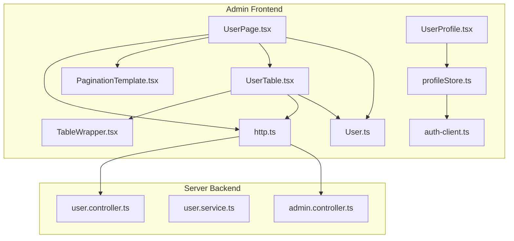
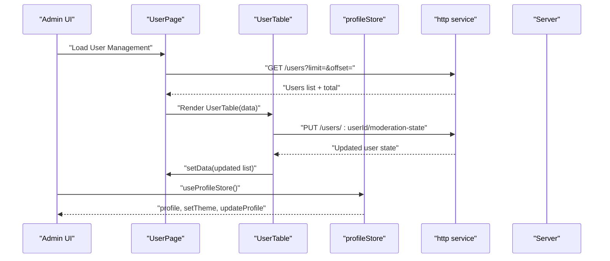
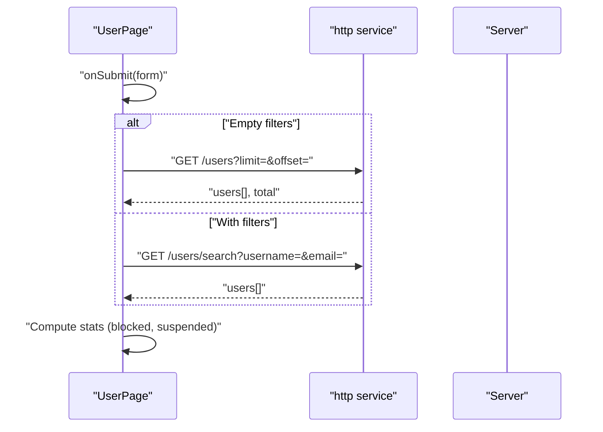
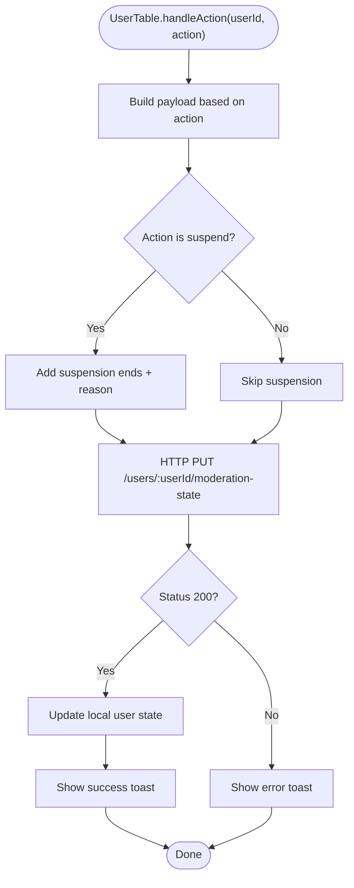
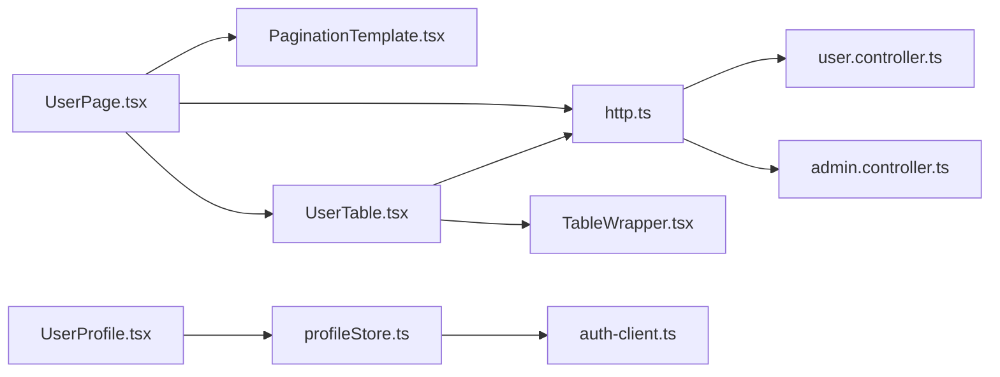

# User Management

<cite>
**Referenced Files in This Document**
- [UserPage.tsx](file://admin/src/pages/UserPage.tsx)
- [UserTable.tsx](file://admin/src/components/general/UserTable.tsx)
- [UserProfile.tsx](file://admin/src/components/general/UserProfile.tsx)
- [profileStore.ts](file://admin/src/store/profileStore.ts)
- [User.ts](file://admin/src/types/User.ts)
- [TableWrapper.tsx](file://admin/src/components/general/TableWrapper.tsx)
- [PaginationTemplate.tsx](file://admin/src/components/general/PaginationTemplate.tsx)
- [http.ts](file://admin/src/services/http.ts)
- [auth-client.ts](file://admin/src/lib/auth-client.ts)
- [types.ts](file://admin/src/lib/types.ts)
- [user.controller.ts](file://server/src/modules/user/user.controller.ts)
- [user.service.ts](file://server/src/modules/user/user.service.ts)
- [admin.controller.ts](file://server/src/modules/admin/admin.controller.ts)
</cite>

## Table of Contents
1. [Introduction](#introduction)
2. [Project Structure](#project-structure)
3. [Core Components](#core-components)
4. [Architecture Overview](#architecture-overview)
5. [Detailed Component Analysis](#detailed-component-analysis)
6. [Dependency Analysis](#dependency-analysis)
7. [Performance Considerations](#performance-considerations)
8. [Troubleshooting Guide](#troubleshooting-guide)
9. [Conclusion](#conclusion)

## Introduction
This document describes the admin user management system, focusing on:
- The UserPage interface for searching users, viewing statistics, and navigating to filtered results.
- The UserTable component for displaying user lists, rendering profile thumbnails, and performing administrative actions such as banning, unbanning, suspending, and removing suspensions.
- The UserProfile component for admin profile display and logout.
- The profileStore state management for storing and updating admin profile data and theme preferences.

The system integrates frontend React components with backend endpoints for user retrieval, search, and moderation actions.

## Project Structure
The admin user management spans three layers:
- Frontend pages and components (React + Zustand)
- Shared types and UI utilities
- Backend controllers and services for user and admin operations

**Diagram sources**
- [UserPage.tsx](file://admin/src/pages/UserPage.tsx#L1-L235)
- [UserTable.tsx](file://admin/src/components/general/UserTable.tsx#L1-L323)
- [TableWrapper.tsx](file://admin/src/components/general/TableWrapper.tsx#L1-L101)
- [UserProfile.tsx](file://admin/src/components/general/UserProfile.tsx#L1-L45)
- [profileStore.ts](file://admin/src/store/profileStore.ts#L1-L39)
- [http.ts](file://admin/src/services/http.ts#L1-L154)
- [auth-client.ts](file://admin/src/lib/auth-client.ts#L1-L11)
- [User.ts](file://admin/src/types/User.ts#L1-L16)
- [PaginationTemplate.tsx](file://admin/src/components/general/PaginationTemplate.tsx#L1-L88)
- [user.controller.ts](file://server/src/modules/user/user.controller.ts#L1-L72)
- [user.service.ts](file://server/src/modules/user/user.service.ts#L1-L137)
- [admin.controller.ts](file://server/src/modules/admin/admin.controller.ts#L1-L125)

**Section sources**
- [UserPage.tsx](file://admin/src/pages/UserPage.tsx#L1-L235)
- [UserTable.tsx](file://admin/src/components/general/UserTable.tsx#L1-L323)
- [TableWrapper.tsx](file://admin/src/components/general/TableWrapper.tsx#L1-L101)
- [UserProfile.tsx](file://admin/src/components/general/UserProfile.tsx#L1-L45)
- [profileStore.ts](file://admin/src/store/profileStore.ts#L1-L39)
- [http.ts](file://admin/src/services/http.ts#L1-L154)
- [auth-client.ts](file://admin/src/lib/auth-client.ts#L1-L11)
- [User.ts](file://admin/src/types/User.ts#L1-L16)
- [PaginationTemplate.tsx](file://admin/src/components/general/PaginationTemplate.tsx#L1-L88)
- [user.controller.ts](file://server/src/modules/user/user.controller.ts#L1-L72)
- [user.service.ts](file://server/src/modules/user/user.service.ts#L1-L137)
- [admin.controller.ts](file://server/src/modules/admin/admin.controller.ts#L1-L125)

## Core Components
- UserPage: Orchestrates user listing, search, pagination, and statistics.
- UserTable: Renders user rows, supports per-row actions, and handles moderation operations.
- TableWrapper: Generic table renderer with column definitions and nested property accessors.
- UserProfile: Displays admin profile avatar and provides logout.
- profileStore: Zustand store for admin profile and theme state.
- http service: Axios client with interceptors for admin API base URL and token refresh.
- Types: Shared User model and theme types.

**Section sources**
- [UserPage.tsx](file://admin/src/pages/UserPage.tsx#L22-L133)
- [UserTable.tsx](file://admin/src/components/general/UserTable.tsx#L41-L116)
- [TableWrapper.tsx](file://admin/src/components/general/TableWrapper.tsx#L35-L100)
- [UserProfile.tsx](file://admin/src/components/general/UserProfile.tsx#L8-L42)
- [profileStore.ts](file://admin/src/store/profileStore.ts#L12-L35)
- [http.ts](file://admin/src/services/http.ts#L11-L154)
- [User.ts](file://admin/src/types/User.ts#L3-L15)

## Architecture Overview
The admin user management follows a clean separation of concerns:
- Frontend pages and components call the http service to communicate with backend endpoints.
- Backend controllers expose endpoints for user retrieval, search, and moderation.
- The http service normalizes responses and manages authentication tokens via interceptors.
- The profileStore maintains admin session state and theme preferences.

**Diagram sources**
- [UserPage.tsx](file://admin/src/pages/UserPage.tsx#L45-L117)
- [UserTable.tsx](file://admin/src/components/general/UserTable.tsx#L48-L116)
- [profileStore.ts](file://admin/src/store/profileStore.ts#L12-L35)
- [http.ts](file://admin/src/services/http.ts#L11-L154)
- [user.controller.ts](file://server/src/modules/user/user.controller.ts#L53-L63)

## Detailed Component Analysis

### UserPage: User Search and Listing
Responsibilities:
- Fetch all users with pagination or search users by username/email.
- Compute and display user statistics (total, active, blocked, suspended).
- Provide reset filters and navigation controls.

Key behaviors:
- Uses http.get("/users") for paginated listing and "/users/search" for filtered queries.
- Maps backend user records to the frontend User type.
- Manages loading states and error notifications via toasts.

**Diagram sources**
- [UserPage.tsx](file://admin/src/pages/UserPage.tsx#L73-L111)
- [http.ts](file://admin/src/services/http.ts#L11-L19)
- [user.controller.ts](file://server/src/modules/user/user.controller.ts#L17-L26)

**Section sources**
- [UserPage.tsx](file://admin/src/pages/UserPage.tsx#L22-L133)
- [PaginationTemplate.tsx](file://admin/src/components/general/PaginationTemplate.tsx#L17-L85)

### UserTable: User List Rendering and Administrative Actions
Responsibilities:
- Render user rows with columns for username, profile thumbnail, branch, blocked status, and suspension expiry.
- Provide contextual actions via a dropdown menu: Ban, Unban, Suspend, Remove Suspension.
- Manage suspension dialog inputs and submit moderation state updates.

Processing logic highlights:
- Calculates active suspension by comparing suspension ends to current time.
- Updates local state after successful moderation actions to reflect immediate UI changes.
- Supports copying profile URLs to clipboard via hover card.

**Diagram sources**
- [UserTable.tsx](file://admin/src/components/general/UserTable.tsx#L48-L116)

**Section sources**
- [UserTable.tsx](file://admin/src/components/general/UserTable.tsx#L41-L116)
- [TableWrapper.tsx](file://admin/src/components/general/TableWrapper.tsx#L35-L100)

### UserProfile: Admin Profile and Logout
Responsibilities:
- Display admin avatar with fallback initials.
- Trigger logout via auth client, clear profile from store, and redirect to sign-in.

Integration:
- Uses profileStore for profile data and removeProfile.
- Uses auth-client for session termination.

**Section sources**
- [UserProfile.tsx](file://admin/src/components/general/UserProfile.tsx#L8-L42)
- [profileStore.ts](file://admin/src/store/profileStore.ts#L12-L35)
- [auth-client.ts](file://admin/src/lib/auth-client.ts#L4-L10)

### profileStore: Admin State Management
Responsibilities:
- Store and update admin profile information.
- Update partial profile fields and theme preferences.
- Clear profile on logout.

State shape:
- profile: minimal admin profile with id and email.
- Methods: setProfile, updateProfile, removeProfile, setTheme.

**Section sources**
- [profileStore.ts](file://admin/src/store/profileStore.ts#L4-L35)
- [types.ts](file://admin/src/lib/types.ts#L5-L11)

### Backend Integration: Controllers and Services
Endpoints used by the frontend:
- GET /users: Paginated user listing.
- GET /users/search: Filtered user search by username/email.
- PUT /users/:userId/moderation-state: Update user moderation state (block/suspend/remove suspension).
- GET /users/:userId: Get user profile by ID (used elsewhere in the app).
- GET /users/me: Get current user profile (used elsewhere in the app).

Services:
- user.controller.ts: Exposes endpoints for user profile, search, and moderation-related operations.
- user.service.ts: Implements user retrieval, search, blocking/unblocking, and audit recording.
- admin.controller.ts: Provides admin-specific queries and dashboards; used here for user search filtering.

**Section sources**
- [user.controller.ts](file://server/src/modules/user/user.controller.ts#L17-L63)
- [user.service.ts](file://server/src/modules/user/user.service.ts#L29-L125)
- [admin.controller.ts](file://server/src/modules/admin/admin.controller.ts#L14-L22)

## Dependency Analysis
Component and module relationships:
- UserPage depends on http service and PaginationTemplate.
- UserTable depends on http service, TableWrapper, and UI primitives.
- profileStore integrates with auth-client for logout.
- http service depends on environment configuration and interceptors for token refresh and response normalization.

**Diagram sources**
- [UserPage.tsx](file://admin/src/pages/UserPage.tsx#L1-L235)
- [UserTable.tsx](file://admin/src/components/general/UserTable.tsx#L1-L323)
- [TableWrapper.tsx](file://admin/src/components/general/TableWrapper.tsx#L1-L101)
- [UserProfile.tsx](file://admin/src/components/general/UserProfile.tsx#L1-L45)
- [profileStore.ts](file://admin/src/store/profileStore.ts#L1-L39)
- [http.ts](file://admin/src/services/http.ts#L1-L154)
- [auth-client.ts](file://admin/src/lib/auth-client.ts#L1-L11)
- [user.controller.ts](file://server/src/modules/user/user.controller.ts#L1-L72)
- [admin.controller.ts](file://server/src/modules/admin/admin.controller.ts#L1-L125)

**Section sources**
- [http.ts](file://admin/src/services/http.ts#L11-L154)
- [auth-client.ts](file://admin/src/lib/auth-client.ts#L4-L10)
- [user.controller.ts](file://server/src/modules/user/user.controller.ts#L17-L63)
- [admin.controller.ts](file://server/src/modules/admin/admin.controller.ts#L14-L22)

## Performance Considerations
- Pagination: The frontend uses fixed page size and computes total pages to avoid large payloads.
- Local state updates: After moderation actions, the UI updates immediately without refetching, reducing network overhead.
- Token refresh: The http service queues concurrent requests during token refresh to minimize redundant refresh attempts.
- Image rendering: Profile thumbnails are rendered conditionally and only when available to avoid unnecessary network calls.

[No sources needed since this section provides general guidance]

## Troubleshooting Guide
Common issues and resolutions:
- Search yields no results:
  - Ensure filters are not both empty; empty filters fall back to paginated listing.
  - Verify backend search endpoint availability and query parameters.
- Action buttons disabled:
  - Busy state prevents multiple clicks; wait for previous action to complete.
  - Some actions are disabled under specific conditions (e.g., suspend requires active suspension to be false).
- Suspension dialog validation:
  - Days must be a positive integer; reason must be non-empty.
- Authentication failures:
  - Token refresh interceptor handles 401 responses; ensure refresh endpoint is reachable and credentials are valid.

**Section sources**
- [UserPage.tsx](file://admin/src/pages/UserPage.tsx#L73-L111)
- [UserTable.tsx](file://admin/src/components/general/UserTable.tsx#L118-L144)
- [http.ts](file://admin/src/services/http.ts#L97-L150)

## Conclusion
The admin user management system combines a responsive frontend with robust backend endpoints to enable efficient user oversight. UserPage provides search and pagination, UserTable delivers actionable moderation capabilities, and profileStore centralizes admin session state. Together, these components support scalable administration with clear UI feedback and reliable state synchronization.