# Component Library & Design System

<cite>
**Referenced Files in This Document**
- [globals.css](file://web/src/app/globals.css)
- [themeMethods.ts](file://web/src/utils/themeMethods.ts)
- [ThemeToggler.tsx](file://web/src/components/general/ThemeToggler.tsx)
- [button.tsx](file://web/src/components/ui/button.tsx)
- [card.tsx](file://web/src/components/ui/card.tsx)
- [input.tsx](file://web/src/components/ui/input.tsx)
- [textarea.tsx](file://web/src/components/ui/textarea.tsx)
- [select.tsx](file://web/src/components/ui/select.tsx)
- [switch.tsx](file://web/src/components/ui/switch.tsx)
- [avatar.tsx](file://web/src/components/ui/avatar.tsx)
- [dialog.tsx](file://web/src/components/ui/dialog.tsx)
- [drawer.tsx](file://web/src/components/ui/drawer.tsx)
- [badge.tsx](file://web/src/components/ui/badge.tsx)
- [form.tsx](file://web/src/components/ui/form.tsx)
- [index.css](file://admin/src/index.css)
- [tailwind.config.js](file://admin/tailwind.config.js)
</cite>

## Table of Contents
1. [Introduction](#introduction)
2. [Project Structure](#project-structure)
3. [Core Components](#core-components)
4. [Architecture Overview](#architecture-overview)
5. [Detailed Component Analysis](#detailed-component-analysis)
6. [Dependency Analysis](#dependency-analysis)
7. [Performance Considerations](#performance-considerations)
8. [Accessibility Guidelines](#accessibility-guidelines)
9. [Responsive Design Patterns](#responsive-design-patterns)
10. [Component Composition Strategies](#component-composition-strategies)
11. [Design Tokens System](#design-tokens-system)
12. [Theming Implementation](#theming-implementation)
13. [Form Components](#form-components)
14. [Modal Systems](#modal-systems)
15. [Interactive Elements](#interactive-elements)
16. [Troubleshooting Guide](#troubleshooting-guide)
17. [Conclusion](#conclusion)

## Introduction
This document describes the Flick component library and design system. It focuses on shared UI components built with Radix UI primitives and Tailwind CSS utility classes, explaining component architecture patterns, prop interfaces, styling conventions, and the design tokens system. It also covers theming (light and dark modes), component variants, customization options, form components, modal systems, interactive elements, accessibility guidelines, responsive design patterns, and composition strategies used across frontend applications.

## Project Structure
The component library is primarily located under the web application’s UI components directory. The design system leverages:
- Radix UI for accessible, headless primitives
- Tailwind CSS for utility-first styling and design tokens
- A centralized theme provider and CSS custom properties for consistent theming

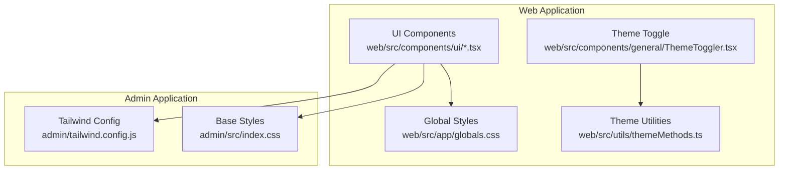

**Diagram sources**
- [globals.css](file://web/src/app/globals.css#L1-L88)
- [themeMethods.ts](file://web/src/utils/themeMethods.ts#L1-L18)
- [ThemeToggler.tsx](file://web/src/components/general/ThemeToggler.tsx#L1-L30)
- [tailwind.config.js](file://admin/tailwind.config.js#L1-L52)
- [index.css](file://admin/src/index.css#L1-L43)

**Section sources**
- [globals.css](file://web/src/app/globals.css#L1-L88)
- [tailwind.config.js](file://admin/tailwind.config.js#L1-L52)
- [index.css](file://admin/src/index.css#L1-L43)

## Core Components
The core component library exposes a set of styled, accessible building blocks that follow consistent design tokens and variant patterns. Each component:
- Uses Radix UI primitives for accessibility and composability
- Applies Tailwind utility classes for styling
- Exposes variant and size props for customization
- Supports composition via data-slot attributes and asChild patterns

Key components include:
- Button: Variants (default, destructive, outline, secondary, ghost, link) and sizes (default, xs, sm, lg, icon variants)
- Card: Header, Title, Description, Action, Content, Footer segments
- Input, Textarea: Consistent focus states, invalid states, and sizing
- Select: Trigger, Content, Item, Label, Scroll buttons, and portal rendering
- Switch: Size variants and controlled behavior
- Avatar: Sizes, image, fallback, badge, and group/count utilities
- Dialog: Overlay, Content, Title, Description, Header/Footer, Close controls
- Drawer: Vaul-powered drawer with directional variants and overlay
- Badge: Variants (default, secondary, destructive, outline, ghost, link)
- Form: Provider, Field, Label, Control, Description, Message with react-hook-form integration

**Section sources**
- [button.tsx](file://web/src/components/ui/button.tsx#L1-L68)
- [card.tsx](file://web/src/components/ui/card.tsx#L1-L93)
- [input.tsx](file://web/src/components/ui/input.tsx#L1-L22)
- [textarea.tsx](file://web/src/components/ui/textarea.tsx#L1-L19)
- [select.tsx](file://web/src/components/ui/select.tsx#L1-L191)
- [switch.tsx](file://web/src/components/ui/switch.tsx#L1-L36)
- [avatar.tsx](file://web/src/components/ui/avatar.tsx#L1-L110)
- [dialog.tsx](file://web/src/components/ui/dialog.tsx#L1-L159)
- [drawer.tsx](file://web/src/components/ui/drawer.tsx#L1-L135)
- [badge.tsx](file://web/src/components/ui/badge.tsx#L1-L49)
- [form.tsx](file://web/src/components/ui/form.tsx#L1-L168)

## Architecture Overview
The component architecture follows a layered pattern:
- Primitives Layer: Radix UI components for semantics and accessibility
- Styling Layer: Tailwind utilities and design tokens
- Composition Layer: Higher-order wrappers that expose variants, sizes, and slots
- Theming Layer: CSS custom properties and class-based dark mode

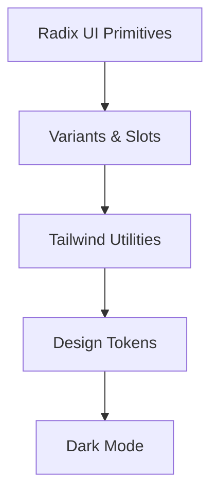

[No sources needed since this diagram shows conceptual workflow, not actual code structure]

## Detailed Component Analysis

### Button Component
The Button component demonstrates variant-driven styling and size scaling. It supports an asChild pattern to render semantic anchors or buttons while preserving styling.

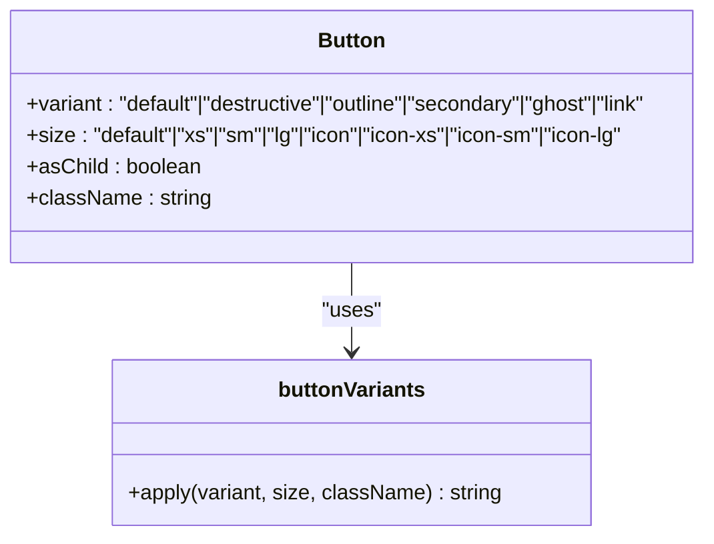

**Diagram sources**
- [button.tsx](file://web/src/components/ui/button.tsx#L7-L39)

**Section sources**
- [button.tsx](file://web/src/components/ui/button.tsx#L1-L68)

### Dialog Component
The Dialog composes Radix UI Dialog primitives with Tailwind-styled overlays, content, and close controls. It supports optional close button rendering and responsive sizing.

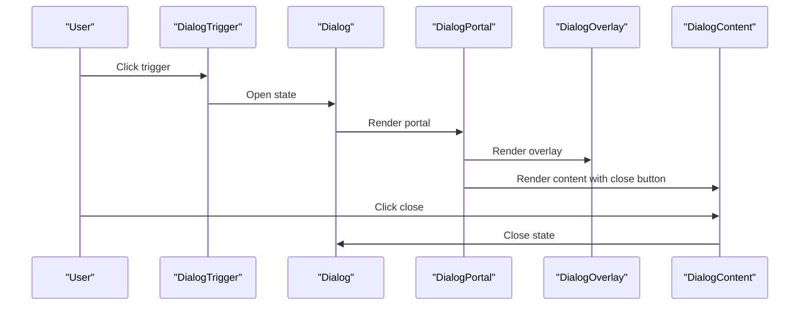

**Diagram sources**
- [dialog.tsx](file://web/src/components/ui/dialog.tsx#L10-L82)

**Section sources**
- [dialog.tsx](file://web/src/components/ui/dialog.tsx#L1-L159)

### Select Component
The Select component integrates Radix UI Select with a scrollable viewport, icons, and item indicators. It supports size variants and alignment options.

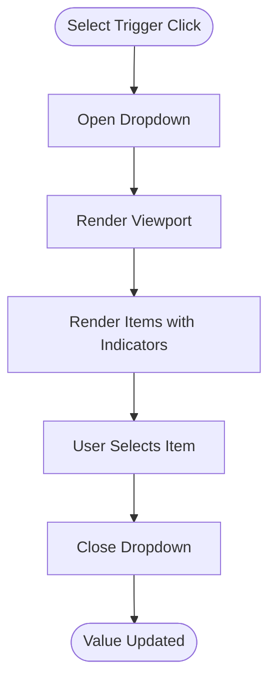

**Diagram sources**
- [select.tsx](file://web/src/components/ui/select.tsx#L53-L88)

**Section sources**
- [select.tsx](file://web/src/components/ui/select.tsx#L1-L191)

### Form Component System
The Form system integrates react-hook-form with Radix UI labels and slots. It provides Field, Label, Control, Description, and Message components with accessible ARIA attributes.

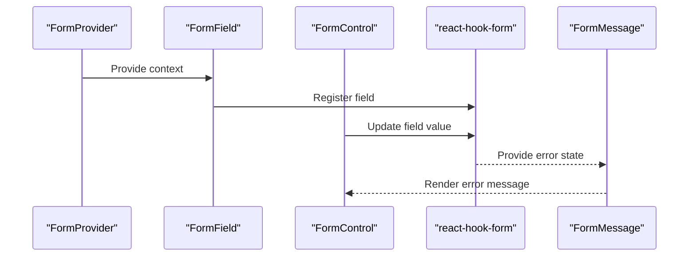

**Diagram sources**
- [form.tsx](file://web/src/components/ui/form.tsx#L19-L168)

**Section sources**
- [form.tsx](file://web/src/components/ui/form.tsx#L1-L168)

### Drawer Component
The Drawer wraps Vaul Drawer primitives with directional variants and overlay styling. It supports top, bottom, left, and right directions.

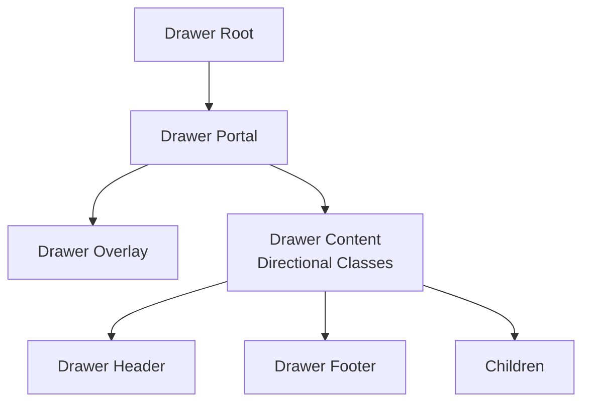

**Diagram sources**
- [drawer.tsx](file://web/src/components/ui/drawer.tsx#L8-L73)

**Section sources**
- [drawer.tsx](file://web/src/components/ui/drawer.tsx#L1-L135)

### Conceptual Overview
The design system emphasizes:
- Accessibility: ARIA attributes, keyboard navigation, and semantic markup
- Consistency: Shared tokens, variants, and composition patterns
- Extensibility: Variants, sizes, and slot-based composition
- Theming: CSS custom properties and class-based dark mode

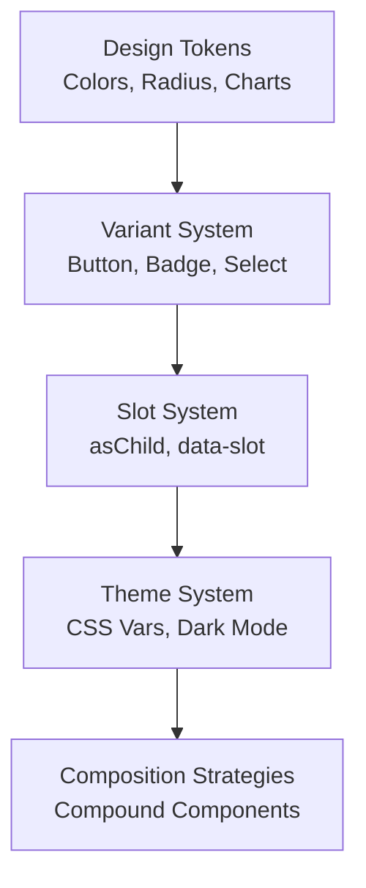

[No sources needed since this diagram shows conceptual workflow, not actual code structure]

## Dependency Analysis
The component library depends on:
- Radix UI for accessible primitives
- Tailwind CSS for styling and design tokens
- Vaul for drawer behavior
- react-hook-form for form integration

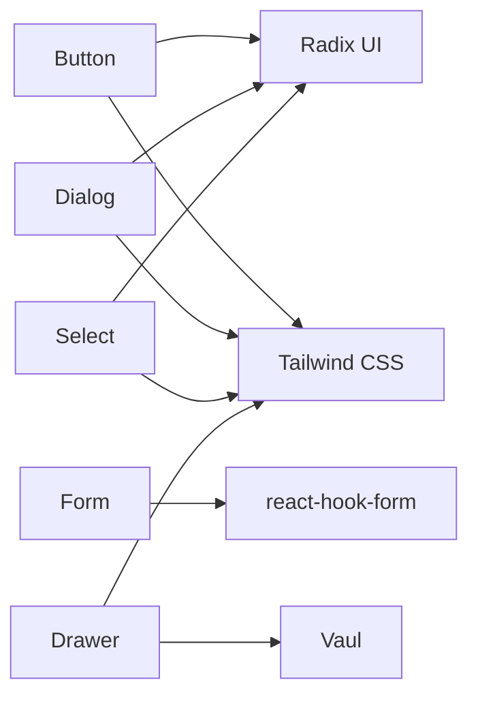

[No sources needed since this diagram shows conceptual dependencies, not specific code structure]

## Performance Considerations
- Prefer variant props over dynamic class concatenation to reduce re-renders
- Use asChild patterns to avoid unnecessary DOM wrappers
- Keep Tailwind utilities scoped to minimize CSS bloat
- Defer heavy computations in component render paths

[No sources needed since this section provides general guidance]

## Accessibility Guidelines
- All interactive components expose proper ARIA attributes and keyboard navigation
- Focus management is handled by Radix UI primitives
- Invalid states communicate via aria-invalid and color tokens
- Sighted users see visual cues; screen reader users rely on aria-describedby and aria-invalid

[No sources needed since this section provides general guidance]

## Responsive Design Patterns
- Components use responsive utilities (e.g., md:, sm:) for consistent breakpoints
- Dialogs scale with max-width and padding utilities
- Inputs and Textareas adapt sizing and padding across breakpoints
- Drawer content respects viewport constraints and direction-specific layouts

[No sources needed since this section provides general guidance]

## Component Composition Strategies
- Compound Components: Group related parts (e.g., CardHeader, CardTitle, CardContent)
- Slot-based Composition: data-slot attributes enable internal styling hooks
- Variant Composition: Variants encapsulate style sets for consistent usage
- Provider Pattern: FormProvider and ThemeToggler manage global state

[No sources needed since this section provides general guidance]

## Design Tokens System
The design system defines tokens via CSS custom properties and Tailwind theme extensions:
- Color Tokens: background, foreground, primary, secondary, muted, accent, destructive, border, input, ring, and chart palettes
- Border Radius Tokens: radius-sm, radius-md, radius-lg, and larger variants
- Typography Tokens: font families and weights are configured via theme variables
- Sidebar Tokens: sidebar, sidebar-foreground, sidebar-primary, etc., for sidebar theming

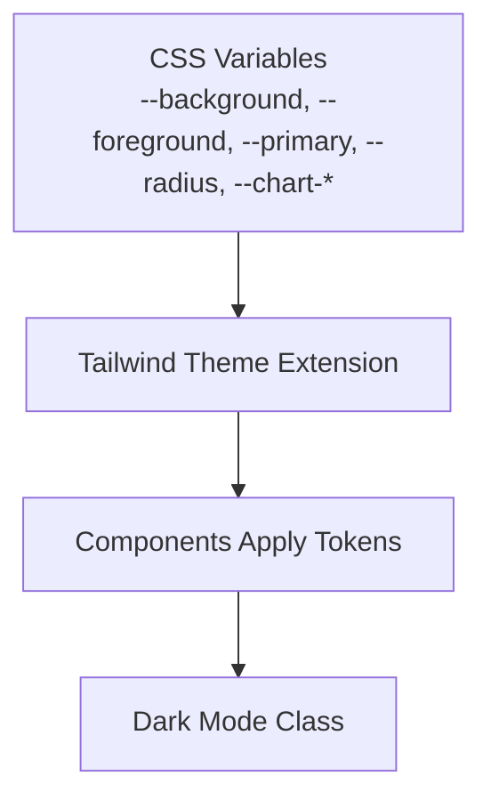

**Diagram sources**
- [globals.css](file://web/src/app/globals.css#L55-L88)
- [tailwind.config.js](file://admin/tailwind.config.js#L9-L52)

**Section sources**
- [globals.css](file://web/src/app/globals.css#L1-L88)
- [tailwind.config.js](file://admin/tailwind.config.js#L1-L52)
- [index.css](file://admin/src/index.css#L15-L43)

## Theming Implementation
The theming system combines CSS custom properties with a class-based dark mode strategy:
- CSS Variables: Define tokens in :root and extend Tailwind to resolve HSL/OKLCH values
- Dark Mode: A class applied to the root element toggles dark styles
- Theme Persistence: ThemeToggler reads/writes theme to localStorage and synchronizes the root class

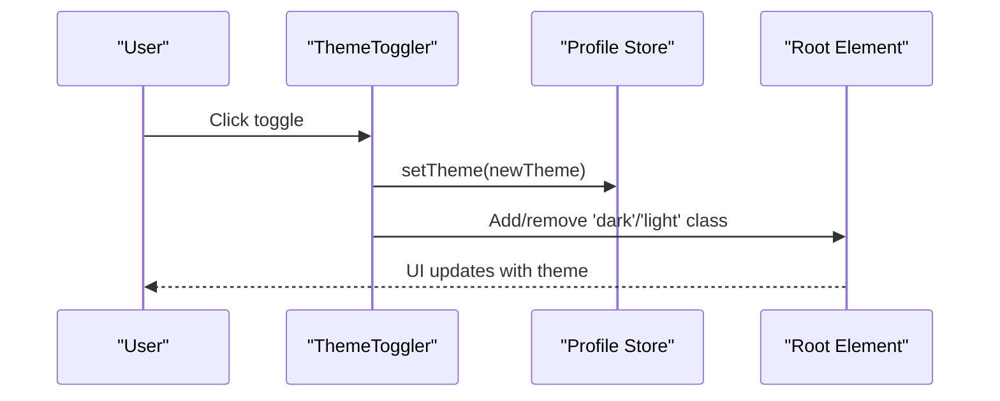

**Diagram sources**
- [ThemeToggler.tsx](file://web/src/components/general/ThemeToggler.tsx#L7-L21)
- [themeMethods.ts](file://web/src/utils/themeMethods.ts#L1-L18)

**Section sources**
- [ThemeToggler.tsx](file://web/src/components/general/ThemeToggler.tsx#L1-L30)
- [themeMethods.ts](file://web/src/utils/themeMethods.ts#L1-L18)
- [globals.css](file://web/src/app/globals.css#L6-L88)
- [tailwind.config.js](file://admin/tailwind.config.js#L7-L8)

## Form Components
Form components integrate with react-hook-form:
- Form: Provides context for fields
- FormField: Registers field with controller
- FormLabel: Accessible label for fields
- FormControl: Wraps input elements
- FormDescription: Optional helper text
- FormMessage: Renders validation errors

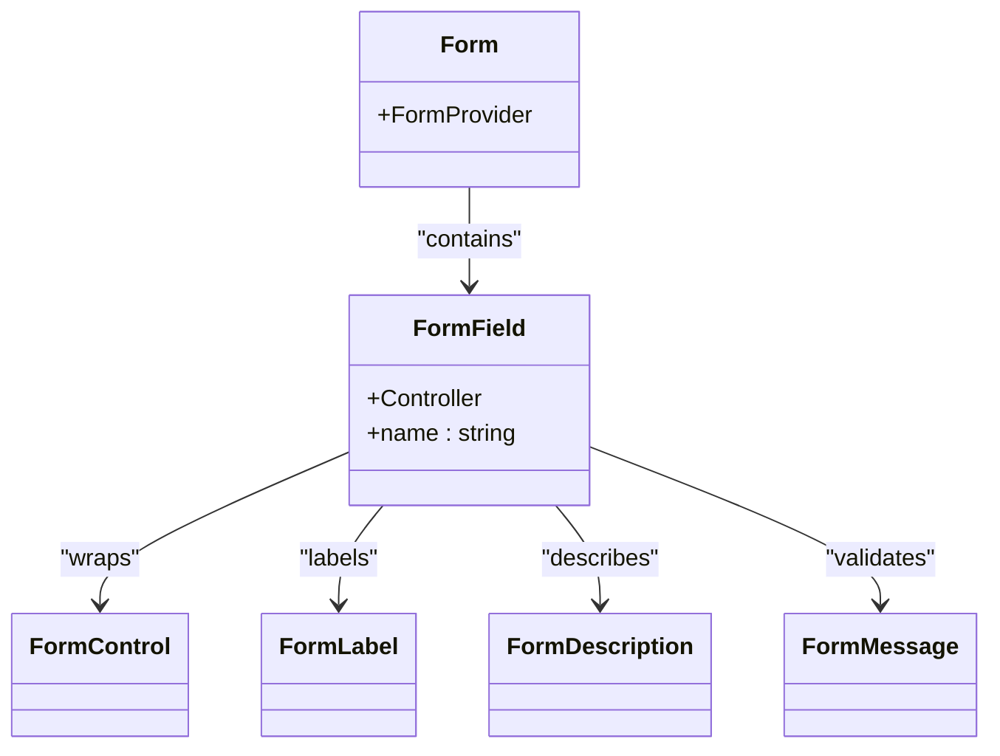

**Diagram sources**
- [form.tsx](file://web/src/components/ui/form.tsx#L19-L168)

**Section sources**
- [form.tsx](file://web/src/components/ui/form.tsx#L1-L168)

## Modal Systems
Modal systems include:
- Dialog: Full-featured modal with overlay, close button, and responsive sizing
- Drawer: Touch-friendly drawer with directional variants and overlay

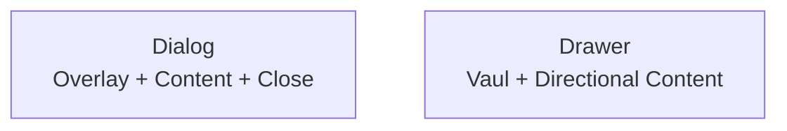

**Diagram sources**
- [dialog.tsx](file://web/src/components/ui/dialog.tsx#L34-L82)
- [drawer.tsx](file://web/src/components/ui/drawer.tsx#L32-L73)

**Section sources**
- [dialog.tsx](file://web/src/components/ui/dialog.tsx#L1-L159)
- [drawer.tsx](file://web/src/components/ui/drawer.tsx#L1-L135)

## Interactive Elements
Interactive elements include:
- Input and Textarea: Focus, invalid, and disabled states
- Select: Trigger, content, items, and scroll buttons
- Switch: Controlled thumb movement and sizing
- Avatar: Image, fallback, badge, and group utilities

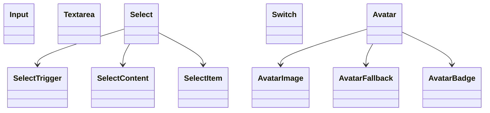

**Diagram sources**
- [input.tsx](file://web/src/components/ui/input.tsx#L5-L19)
- [textarea.tsx](file://web/src/components/ui/textarea.tsx#L5-L16)
- [select.tsx](file://web/src/components/ui/select.tsx#L27-L177)
- [switch.tsx](file://web/src/components/ui/switch.tsx#L8-L33)
- [avatar.tsx](file://web/src/components/ui/avatar.tsx#L8-L109)

**Section sources**
- [input.tsx](file://web/src/components/ui/input.tsx#L1-L22)
- [textarea.tsx](file://web/src/components/ui/textarea.tsx#L1-L19)
- [select.tsx](file://web/src/components/ui/select.tsx#L1-L191)
- [switch.tsx](file://web/src/components/ui/switch.tsx#L1-L36)
- [avatar.tsx](file://web/src/components/ui/avatar.tsx#L1-L110)

## Troubleshooting Guide
Common issues and resolutions:
- Theme not applying: Ensure the root element has the correct class ('dark' or 'light') and CSS variables are defined
- Dialog/Drawer not closing: Verify portal rendering and close button usage
- Form validation not visible: Confirm FormMessage receives error state from react-hook-form
- Select items not aligned: Check position and align props; ensure viewport width matches trigger

**Section sources**
- [ThemeToggler.tsx](file://web/src/components/general/ThemeToggler.tsx#L17-L21)
- [dialog.tsx](file://web/src/components/ui/dialog.tsx#L57-L82)
- [drawer.tsx](file://web/src/components/ui/drawer.tsx#L54-L73)
- [form.tsx](file://web/src/components/ui/form.tsx#L139-L157)
- [select.tsx](file://web/src/components/ui/select.tsx#L59-L87)

## Conclusion
The Flick component library provides a robust, accessible, and theme-aware design system. By combining Radix UI primitives with Tailwind utilities and a centralized token system, it enables consistent, scalable UI development across applications. The variant and slot-based patterns, combined with strong theming and form integrations, offer flexibility and maintainability for diverse product needs.