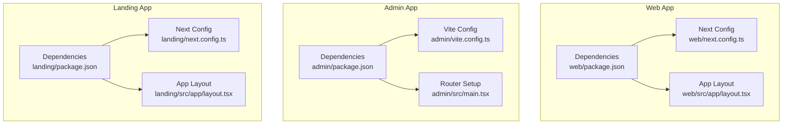
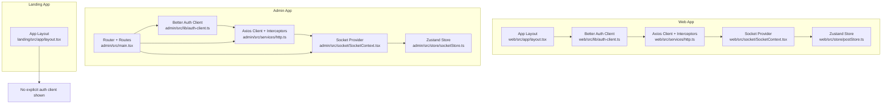
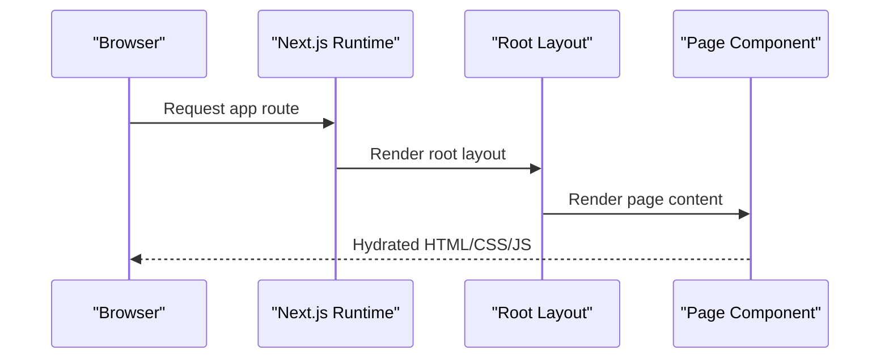
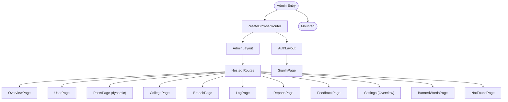
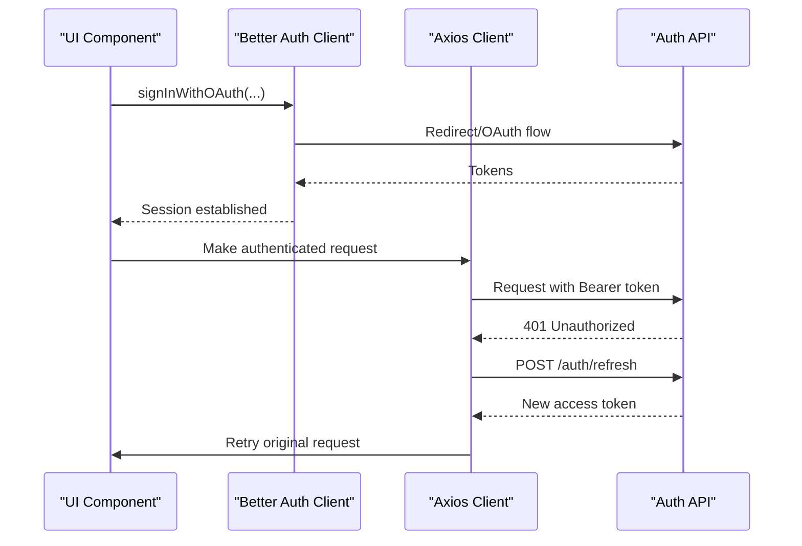
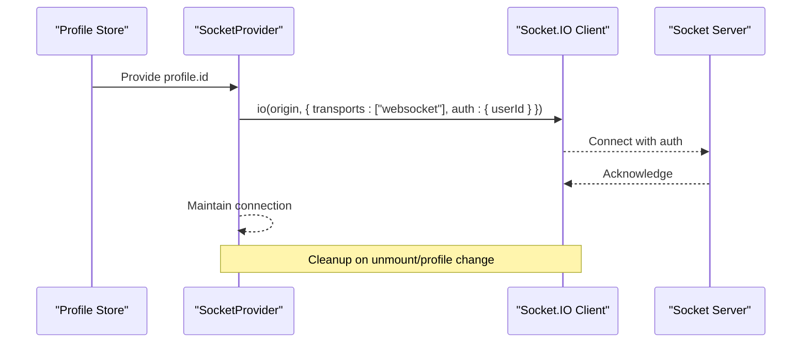
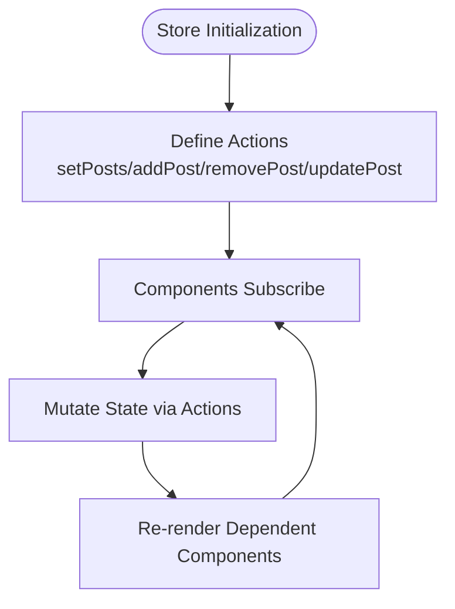
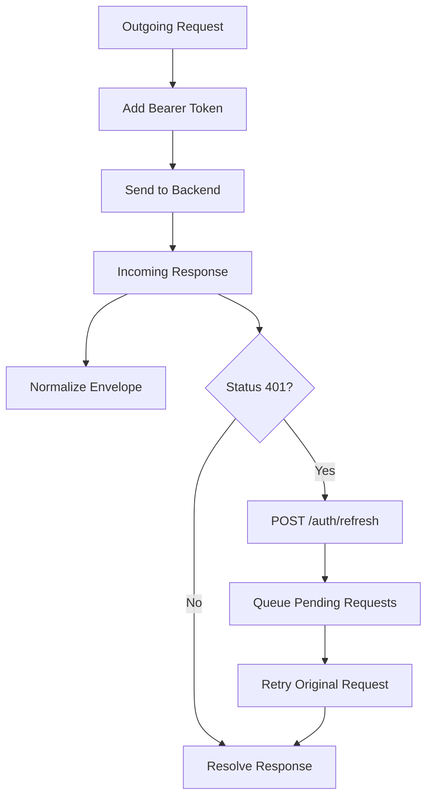
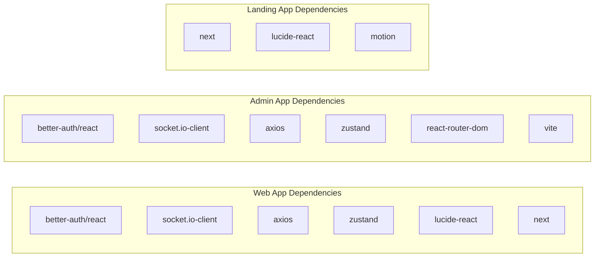

# Frontend Architecture

<cite>
**Referenced Files in This Document**
- [web/package.json](file://web/package.json)
- [admin/package.json](file://admin/package.json)
- [landing/package.json](file://landing/package.json)
- [web/next.config.ts](file://web/next.config.ts)
- [admin/vite.config.ts](file://admin/vite.config.ts)
- [landing/next.config.ts](file://landing/next.config.ts)
- [web/src/app/layout.tsx](file://web/src/app/layout.tsx)
- [admin/src/main.tsx](file://admin/src/main.tsx)
- [landing/src/app/layout.tsx](file://landing/src/app/layout.tsx)
- [web/src/lib/auth-client.ts](file://web/src/lib/auth-client.ts)
- [admin/src/lib/auth-client.ts](file://admin/src/lib/auth-client.ts)
- [web/src/socket/SocketContext.tsx](file://web/src/socket/SocketContext.tsx)
- [admin/src/socket/SocketContext.tsx](file://admin/src/socket/SocketContext.tsx)
- [web/src/socket/useSocket.ts](file://web/src/socket/useSocket.ts)
- [web/src/store/postStore.ts](file://web/src/store/postStore.ts)
- [admin/src/store/socketStore.ts](file://admin/src/store/socketStore.ts)
- [web/src/services/http.ts](file://web/src/services/http.ts)
- [admin/src/services/http.ts](file://admin/src/services/http.ts)
</cite>

## Table of Contents
1. [Introduction](#introduction)
2. [Project Structure](#project-structure)
3. [Core Components](#core-components)
4. [Architecture Overview](#architecture-overview)
5. [Detailed Component Analysis](#detailed-component-analysis)
6. [Dependency Analysis](#dependency-analysis)
7. [Performance Considerations](#performance-considerations)
8. [Troubleshooting Guide](#troubleshooting-guide)
9. [Conclusion](#conclusion)

## Introduction
This document describes the frontend architecture of the Flick platform, focusing on the Next.js-based web application, the Vite-powered admin application, and the Next.js landing site. It explains the app router structure, component architecture, state management patterns, real-time communication via Socket.IO, authentication flows using Better Auth, API integration layers, design system and theming, responsive design, and client-side routing configurations.

## Project Structure
The repository hosts three distinct frontend applications:
- Web: Next.js application implementing the social feed and user-facing features.
- Admin: Vite + React application for administrative controls and analytics.
- Landing: Next.js application for marketing and onboarding.

Each application defines its own build tooling, routing, and runtime configuration.

**Diagram sources**
- [web/next.config.ts](file://web/next.config.ts#L1-L9)
- [web/src/app/layout.tsx](file://web/src/app/layout.tsx#L1-L21)
- [admin/vite.config.ts](file://admin/vite.config.ts#L1-L19)
- [admin/src/main.tsx](file://admin/src/main.tsx#L1-L96)
- [landing/next.config.ts](file://landing/next.config.ts#L1-L8)
- [landing/src/app/layout.tsx](file://landing/src/app/layout.tsx#L1-L27)

**Section sources**
- [web/next.config.ts](file://web/next.config.ts#L1-L9)
- [admin/vite.config.ts](file://admin/vite.config.ts#L1-L19)
- [landing/next.config.ts](file://landing/next.config.ts#L1-L8)
- [web/src/app/layout.tsx](file://web/src/app/layout.tsx#L1-L21)
- [admin/src/main.tsx](file://admin/src/main.tsx#L1-L96)
- [landing/src/app/layout.tsx](file://landing/src/app/layout.tsx#L1-L27)

## Core Components
- Authentication client powered by Better Auth for both web and admin apps, configured with base URLs and optional Google OAuth integration in the web app.
- HTTP clients with Axios interceptors for request/response normalization, bearer token injection, and automatic token refresh on 401 responses.
- Socket.IO providers encapsulating real-time connections, with per-app contexts and initialization strategies.
- Zustand stores for lightweight state management (e.g., posts, socket user identity).
- Routing:
  - Web app uses Next.js App Router conventions with nested route groups and shared layouts.
  - Admin app uses React Router DOM with a centralized router definition and nested routes under an admin layout.

Key implementation references:
- Authentication client creation and plugin configuration
- HTTP client interceptors and token refresh logic
- Socket provider initialization and context exposure
- Zustand store definitions for posts and socket user
- Router setup for admin app

**Section sources**
- [web/src/lib/auth-client.ts](file://web/src/lib/auth-client.ts#L1-L20)
- [admin/src/lib/auth-client.ts](file://admin/src/lib/auth-client.ts#L1-L11)
- [web/src/services/http.ts](file://web/src/services/http.ts#L1-L135)
- [admin/src/services/http.ts](file://admin/src/services/http.ts#L1-L154)
- [web/src/socket/SocketContext.tsx](file://web/src/socket/SocketContext.tsx#L1-L45)
- [admin/src/socket/SocketContext.tsx](file://admin/src/socket/SocketContext.tsx#L1-L26)
- [web/src/store/postStore.ts](file://web/src/store/postStore.ts#L1-L30)
- [admin/src/store/socketStore.ts](file://admin/src/store/socketStore.ts#L1-L14)
- [admin/src/main.tsx](file://admin/src/main.tsx#L1-L96)

## Architecture Overview
The frontend architecture follows a multi-application pattern:
- Shared authentication and API concerns are abstracted behind Better Auth and Axios interceptors.
- Real-time features are isolated via Socket.IO contexts per app.
- State management is kept minimal and local where appropriate, leveraging Zustand for cross-component sharing.
- Routing is app-specific: Next.js App Router for web and landing, React Router DOM for admin.

**Diagram sources**
- [web/src/lib/auth-client.ts](file://web/src/lib/auth-client.ts#L1-L20)
- [web/src/services/http.ts](file://web/src/services/http.ts#L1-L135)
- [web/src/socket/SocketContext.tsx](file://web/src/socket/SocketContext.tsx#L1-L45)
- [web/src/store/postStore.ts](file://web/src/store/postStore.ts#L1-L30)
- [web/src/app/layout.tsx](file://web/src/app/layout.tsx#L1-L21)
- [admin/src/lib/auth-client.ts](file://admin/src/lib/auth-client.ts#L1-L11)
- [admin/src/services/http.ts](file://admin/src/services/http.ts#L1-L154)
- [admin/src/socket/SocketContext.tsx](file://admin/src/socket/SocketContext.tsx#L1-L26)
- [admin/src/store/socketStore.ts](file://admin/src/store/socketStore.ts#L1-L14)
- [admin/src/main.tsx](file://admin/src/main.tsx#L1-L96)
- [landing/src/app/layout.tsx](file://landing/src/app/layout.tsx#L1-L27)

## Detailed Component Analysis

### Next.js App Router (Web and Landing)
- Both apps define a root layout that sets global fonts and basic HTML attributes. The web app additionally exposes metadata and a theme container ID for client-side theming.
- The web app uses Next.js App Router conventions with a root layout and shared fonts. The landing app similarly defines metadata and a root layout.

**Diagram sources**
- [web/src/app/layout.tsx](file://web/src/app/layout.tsx#L1-L21)
- [landing/src/app/layout.tsx](file://landing/src/app/layout.tsx#L1-L27)

**Section sources**
- [web/src/app/layout.tsx](file://web/src/app/layout.tsx#L1-L21)
- [landing/src/app/layout.tsx](file://landing/src/app/layout.tsx#L1-L27)

### Admin Application Routing
- The admin app initializes a browser router with nested routes under an admin layout. Routes include dashboard, users, posts, colleges, branches, logs, reports, feedbacks, settings, and banned words. A dedicated auth layout hosts sign-in.
- The router is defined centrally in the entry file, enabling clear separation of concerns between layout and route definitions.

**Diagram sources**
- [admin/src/main.tsx](file://admin/src/main.tsx#L1-L96)

**Section sources**
- [admin/src/main.tsx](file://admin/src/main.tsx#L1-L96)

### Authentication Flows (Better Auth)
- The web app configures a Better Auth client with a base URL pointing to the backend auth API and integrates Google One Tap via a client plugin. The admin app configures a similar client with admin and inferred fields plugins.
- Token management is handled centrally via HTTP interceptors that inject Authorization headers and refresh tokens on 401 responses.

**Diagram sources**
- [web/src/lib/auth-client.ts](file://web/src/lib/auth-client.ts#L1-L20)
- [admin/src/lib/auth-client.ts](file://admin/src/lib/auth-client.ts#L1-L11)
- [web/src/services/http.ts](file://web/src/services/http.ts#L1-L135)
- [admin/src/services/http.ts](file://admin/src/services/http.ts#L1-L154)

**Section sources**
- [web/src/lib/auth-client.ts](file://web/src/lib/auth-client.ts#L1-L20)
- [admin/src/lib/auth-client.ts](file://admin/src/lib/auth-client.ts#L1-L11)
- [web/src/services/http.ts](file://web/src/services/http.ts#L1-L135)
- [admin/src/services/http.ts](file://admin/src/services/http.ts#L1-L154)

### Real-Time Communication (Socket.IO)
- The web app initializes a Socket.IO connection when a user profile is available, passing the user ID as authentication credentials and restricting transport to WebSocket. The connection is cleaned up on unmount or profile change.
- The admin app creates a Socket.IO instance with WebSocket transport at startup and exposes it via a context provider.

**Diagram sources**
- [web/src/socket/SocketContext.tsx](file://web/src/socket/SocketContext.tsx#L1-L45)
- [admin/src/socket/SocketContext.tsx](file://admin/src/socket/SocketContext.tsx#L1-L26)

**Section sources**
- [web/src/socket/SocketContext.tsx](file://web/src/socket/SocketContext.tsx#L1-L45)
- [admin/src/socket/SocketContext.tsx](file://admin/src/socket/SocketContext.tsx#L1-L26)
- [web/src/socket/useSocket.ts](file://web/src/socket/useSocket.ts#L1-L9)

### State Management Patterns (Zustand)
- The web app maintains a post store with CRUD-like actions for posts, enabling optimistic updates and local synchronization.
- The admin app maintains a simple socket user store for administrative contexts.

**Diagram sources**
- [web/src/store/postStore.ts](file://web/src/store/postStore.ts#L1-L30)
- [admin/src/store/socketStore.ts](file://admin/src/store/socketStore.ts#L1-L14)

**Section sources**
- [web/src/store/postStore.ts](file://web/src/store/postStore.ts#L1-L30)
- [admin/src/store/socketStore.ts](file://admin/src/store/socketStore.ts#L1-L14)

### API Integration Layers (Axios Interceptors)
- Both apps configure Axios instances with base URLs derived from environment variables and enable credentials for cookie-based sessions.
- Interceptors handle:
  - Injecting Authorization headers with Bearer tokens.
  - Normalizing backend envelope responses into a unified API response shape.
  - Refreshing access tokens on 401 responses and retrying failed requests.

**Diagram sources**
- [web/src/services/http.ts](file://web/src/services/http.ts#L1-L135)
- [admin/src/services/http.ts](file://admin/src/services/http.ts#L1-L154)

**Section sources**
- [web/src/services/http.ts](file://web/src/services/http.ts#L1-L135)
- [admin/src/services/http.ts](file://admin/src/services/http.ts#L1-L154)

### Design System, Theming, and Responsive Patterns
- Fonts are configured globally via Next.js font modules in both web and landing apps, ensuring consistent typography across pages.
- The web app layout includes a theme container ID for client-side theming integration.
- Tailwind-based styling is present in all apps, with Tailwind v4 in the web app and Tailwind v3 in the admin app.

**Section sources**
- [web/src/app/layout.tsx](file://web/src/app/layout.tsx#L1-L21)
- [landing/src/app/layout.tsx](file://landing/src/app/layout.tsx#L1-L27)
- [web/package.json](file://web/package.json#L1-L67)
- [admin/package.json](file://admin/package.json#L1-L78)
- [landing/package.json](file://landing/package.json#L1-L37)

### Build Tooling and Configuration
- Web app: Next.js with React Compiler enabled.
- Admin app: Vite with React plugin and path aliasing for "@".
- Landing app: Next.js with default configuration.

**Section sources**
- [web/next.config.ts](file://web/next.config.ts#L1-L9)
- [admin/vite.config.ts](file://admin/vite.config.ts#L1-L19)
- [landing/next.config.ts](file://landing/next.config.ts#L1-L8)

## Dependency Analysis
The frontend apps share common libraries for UI primitives, HTTP, and state management while maintaining separate routing and build systems.

**Diagram sources**
- [web/package.json](file://web/package.json#L1-L67)
- [admin/package.json](file://admin/package.json#L1-L78)
- [landing/package.json](file://landing/package.json#L1-L37)

**Section sources**
- [web/package.json](file://web/package.json#L1-L67)
- [admin/package.json](file://admin/package.json#L1-L78)
- [landing/package.json](file://landing/package.json#L1-L37)

## Performance Considerations
- Prefer lightweight state with Zustand for small slices of state to avoid unnecessary re-renders.
- Use React Compiler in the web app to optimize rendering performance.
- Restrict Socket.IO transports to WebSocket where supported to reduce overhead.
- Centralize token refresh logic to minimize redundant network calls and improve UX during 401 scenarios.

## Troubleshooting Guide
- Authentication failures:
  - Verify base URLs for Better Auth clients and ensure environment variables are set.
  - Confirm that the backend auth endpoints are reachable and returning valid tokens.
- Token refresh errors:
  - Inspect interceptor callbacks and ensure the refresh endpoint responds with a new access token.
  - Check that queued requests are properly retried after refresh.
- Socket.IO connection issues:
  - Ensure the user profile is available before initializing the socket in the web app.
  - Confirm transport configuration and CORS settings on the backend.
- Routing problems in admin:
  - Validate route definitions and layout nesting in the router setup.

**Section sources**
- [web/src/lib/auth-client.ts](file://web/src/lib/auth-client.ts#L1-L20)
- [admin/src/lib/auth-client.ts](file://admin/src/lib/auth-client.ts#L1-L11)
- [web/src/services/http.ts](file://web/src/services/http.ts#L1-L135)
- [admin/src/services/http.ts](file://admin/src/services/http.ts#L1-L154)
- [web/src/socket/SocketContext.tsx](file://web/src/socket/SocketContext.tsx#L1-L45)
- [admin/src/main.tsx](file://admin/src/main.tsx#L1-L96)

## Conclusion
The Flick frontend employs a clean, modular architecture with app-specific routing and build systems. Authentication, HTTP, and real-time capabilities are standardized across apps, while state management remains lightweight and predictable. The design system leverages Tailwind and Next.js font modules for consistency, and responsive patterns are enforced through modern CSS frameworks. This structure supports scalability, maintainability, and a smooth developer experience across the web, admin, and landing applications.