# Landing Page

<cite>
**Referenced Files in This Document**
- [layout.tsx](file://landing/src/app/layout.tsx)
- [page.tsx](file://landing/src/app/page.tsx)
- [fonts.ts](file://landing/src/app/fonts.ts)
- [Header.tsx](file://landing/src/components/landing/Header.tsx)
- [Footer.tsx](file://landing/src/components/landing/Footer.tsx)
- [FeatureCard.tsx](file://landing/src/components/landing/FeatureCard.tsx)
- [FAQs.tsx](file://landing/src/components/landing/FAQs.tsx)
- [CTAButton.tsx](file://landing/src/components/landing/CTAButton.tsx)
- [HowItWorks.tsx](file://landing/src/components/landing/HowItWorks.tsx)
- [BackgroundPattern.tsx](file://landing/src/components/landing/BackgroundPattern.tsx)
- [AnimateWrapper.tsx](file://landing/src/components/animations/AnimateWrapper.tsx)
- [LogoSVG.tsx](file://landing/src/components/animations/LogoSVG.tsx)
- [text-animate.tsx](file://landing/src/components/magicui/text-animate.tsx)
- [HowItWorksSteps.ts](file://landing/src/data/HowItWorksSteps.ts)
- [utils.ts](file://landing/src/lib/utils.ts)
</cite>

## Table of Contents
1. [Introduction](#introduction)
2. [Project Structure](#project-structure)
3. [Core Components](#core-components)
4. [Architecture Overview](#architecture-overview)
5. [Detailed Component Analysis](#detailed-component-analysis)
6. [Dependency Analysis](#dependency-analysis)
7. [Performance Considerations](#performance-considerations)
8. [Troubleshooting Guide](#troubleshooting-guide)
9. [Conclusion](#conclusion)

## Introduction
This document describes the Flick landing page frontend built with Next.js App Router. It focuses on the marketing site’s component architecture, animation system, typography and responsive design, performance optimizations, and integration touchpoints such as external links and newsletter subscription. The site emphasizes a mobile-first approach, smooth micro-interactions, and a cohesive visual identity using custom fonts and SVG-based motion.

## Project Structure
The landing application is organized under the landing directory with:
- App Router pages and metadata in src/app
- Shared components in src/components
- Typography and fonts in src/app/fonts.ts
- Static assets and fonts in src/assets/fonts
- Utility helpers in src/lib/utils.ts

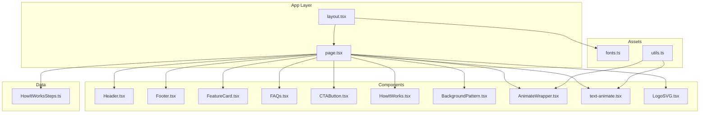

**Diagram sources**
- [layout.tsx](file://landing/src/app/layout.tsx#L1-L27)
- [page.tsx](file://landing/src/app/page.tsx#L1-L195)
- [fonts.ts](file://landing/src/app/fonts.ts#L1-L84)
- [Header.tsx](file://landing/src/components/landing/Header.tsx#L1-L58)
- [Footer.tsx](file://landing/src/components/landing/Footer.tsx#L1-L175)
- [FeatureCard.tsx](file://landing/src/components/landing/FeatureCard.tsx#L1-L33)
- [FAQs.tsx](file://landing/src/components/landing/FAQs.tsx#L1-L61)
- [CTAButton.tsx](file://landing/src/components/landing/CTAButton.tsx#L1-L35)
- [HowItWorks.tsx](file://landing/src/components/landing/HowItWorks.tsx#L1-L28)
- [BackgroundPattern.tsx](file://landing/src/components/landing/BackgroundPattern.tsx#L1-L514)
- [AnimateWrapper.tsx](file://landing/src/components/animations/AnimateWrapper.tsx#L1-L113)
- [text-animate.tsx](file://landing/src/components/magicui/text-animate.tsx#L1-L413)
- [LogoSVG.tsx](file://landing/src/components/animations/LogoSVG.tsx#L1-L140)
- [HowItWorksSteps.ts](file://landing/src/data/HowItWorksSteps.ts#L1-L26)
- [utils.ts](file://landing/src/lib/utils.ts#L1-L7)

**Section sources**
- [layout.tsx](file://landing/src/app/layout.tsx#L1-L27)
- [fonts.ts](file://landing/src/app/fonts.ts#L1-L84)

## Core Components
- Layout and metadata: Defines global metadata and font variables injected into the HTML root.
- Page composition: Orchestrates hero, posts, feature highlights, steps, FAQs, and CTA sections.
- Navigation: Sticky header with scroll-aware styling and responsive behavior.
- Footer: Multi-column layout with links, contact, legal, and newsletter subscription.
- Feature cards: Reusable cards for benefits with icon rendering.
- FAQ accordion: Expandable questions with consistent styling.
- Call-to-action: Prominent primary button with hover effects and external link.
- How It Works: Step cards with emojis and descriptions.
- Background pattern: SVG tile pattern of Lucide icons for visual texture.
- Animations: Motion wrappers for micro-interactions and text animations.

**Section sources**
- [page.tsx](file://landing/src/app/page.tsx#L27-L195)
- [Header.tsx](file://landing/src/components/landing/Header.tsx#L7-L58)
- [Footer.tsx](file://landing/src/components/landing/Footer.tsx#L8-L175)
- [FeatureCard.tsx](file://landing/src/components/landing/FeatureCard.tsx#L9-L33)
- [FAQs.tsx](file://landing/src/components/landing/FAQs.tsx#L8-L61)
- [CTAButton.tsx](file://landing/src/components/landing/CTAButton.tsx#L7-L35)
- [HowItWorks.tsx](file://landing/src/components/landing/HowItWorks.tsx#L8-L28)
- [BackgroundPattern.tsx](file://landing/src/components/landing/BackgroundPattern.tsx#L35-L514)
- [AnimateWrapper.tsx](file://landing/src/components/animations/AnimateWrapper.tsx#L82-L113)
- [text-animate.tsx](file://landing/src/components/magicui/text-animate.tsx#L306-L413)

## Architecture Overview
The landing page follows a component-driven architecture:
- Root layout injects fonts and metadata globally.
- The home page composes reusable components and data.
- Animations are encapsulated in dedicated wrappers and text animators.
- Utilities consolidate Tailwind class merging.

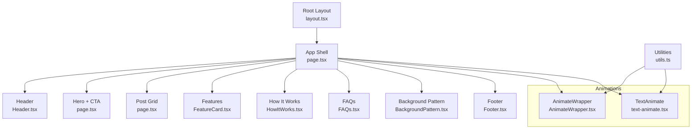

**Diagram sources**
- [layout.tsx](file://landing/src/app/layout.tsx#L1-L27)
- [page.tsx](file://landing/src/app/page.tsx#L27-L195)
- [Header.tsx](file://landing/src/components/landing/Header.tsx#L7-L58)
- [Footer.tsx](file://landing/src/components/landing/Footer.tsx#L8-L175)
- [FeatureCard.tsx](file://landing/src/components/landing/FeatureCard.tsx#L9-L33)
- [FAQs.tsx](file://landing/src/components/landing/FAQs.tsx#L8-L61)
- [CTAButton.tsx](file://landing/src/components/landing/CTAButton.tsx#L7-L35)
- [HowItWorks.tsx](file://landing/src/components/landing/HowItWorks.tsx#L8-L28)
- [BackgroundPattern.tsx](file://landing/src/components/landing/BackgroundPattern.tsx#L35-L514)
- [AnimateWrapper.tsx](file://landing/src/components/animations/AnimateWrapper.tsx#L82-L113)
- [text-animate.tsx](file://landing/src/components/magicui/text-animate.tsx#L306-L413)
- [utils.ts](file://landing/src/lib/utils.ts#L4-L6)

## Detailed Component Analysis

### Typography and Fonts
- Global fonts are configured in the app root:
  - Geist Sans and Geist Mono for system fonts with CSS variables.
  - Local fonts include Avallon, Editorial Old Font, SoupBone, Caveat, Gloria Hallelujah, Handlee, Patrick Hand, Shadows Into Light, Neue Montreal, Garnett, Inter, and Poppins.
- These variables are applied in the root layout body class to cascade font families across the app.

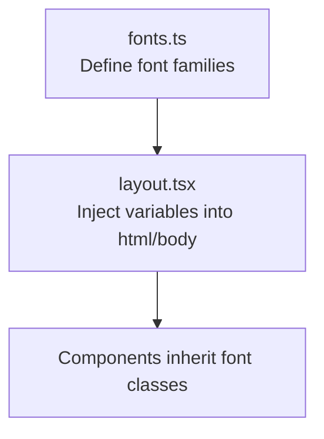

**Diagram sources**
- [fonts.ts](file://landing/src/app/fonts.ts#L1-L84)
- [layout.tsx](file://landing/src/app/layout.tsx#L18-L22)

**Section sources**
- [fonts.ts](file://landing/src/app/fonts.ts#L1-L84)
- [layout.tsx](file://landing/src/app/layout.tsx#L18-L22)

### Header Navigation
- Implements a sticky header that adapts its appearance on scroll.
- Dynamically renders navigation links and a CTA button depending on scroll position.
- Uses a backdrop blur effect and rounded corners on scroll.

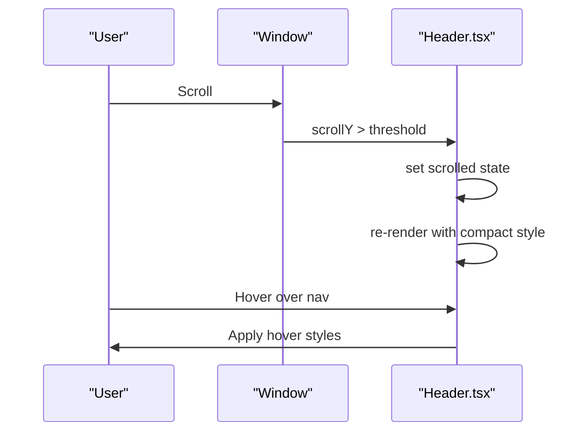

**Diagram sources**
- [Header.tsx](file://landing/src/components/landing/Header.tsx#L10-L17)
- [Header.tsx](file://landing/src/components/landing/Header.tsx#L20-L26)

**Section sources**
- [Header.tsx](file://landing/src/components/landing/Header.tsx#L7-L58)

### Feature Showcase Cards
- Reusable card component with:
  - Flexible icon rendering (React element or string).
  - Consistent shadow, border, and hover behavior.
  - Responsive layout for stacked and horizontal arrangements.

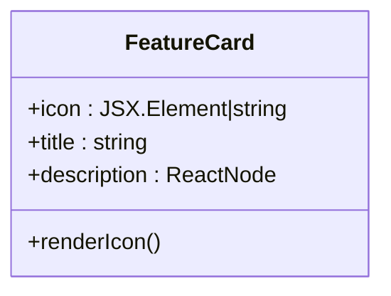

**Diagram sources**
- [FeatureCard.tsx](file://landing/src/components/landing/FeatureCard.tsx#L9-L33)

**Section sources**
- [FeatureCard.tsx](file://landing/src/components/landing/FeatureCard.tsx#L9-L33)

### FAQ Section
- Uses an accordion component to present collapsible Q&A entries.
- Data is statically defined and mapped to accordion items.

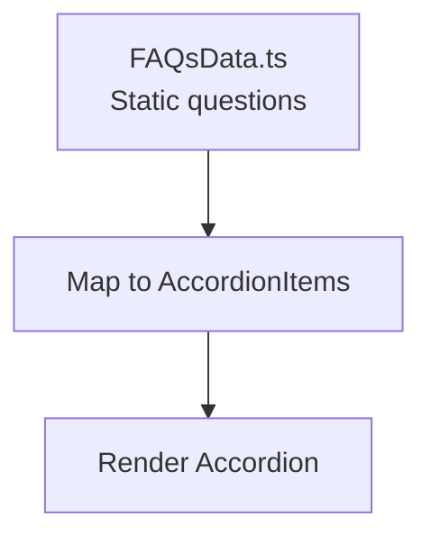

**Diagram sources**
- [FAQs.tsx](file://landing/src/components/landing/FAQs.tsx#L29-L61)

**Section sources**
- [FAQs.tsx](file://landing/src/components/landing/FAQs.tsx#L8-L61)

### Call-to-Action Components
- Primary CTA button:
  - Opens an external link on click.
  - Hover scaling and arrow transition.
  - Variant and sizing props for composition.

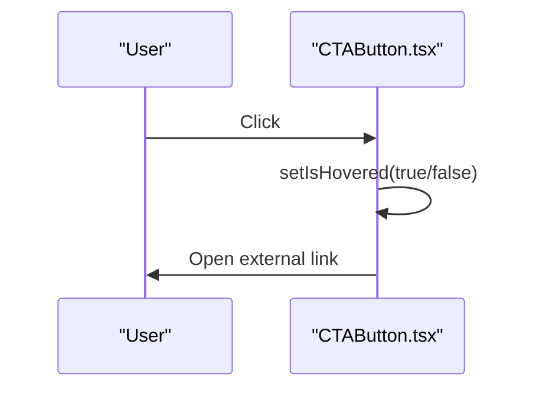

**Diagram sources**
- [CTAButton.tsx](file://landing/src/components/landing/CTAButton.tsx#L14-L31)

**Section sources**
- [CTAButton.tsx](file://landing/src/components/landing/CTAButton.tsx#L7-L35)

### How It Works Steps
- Presents three steps with emoji, title, and description.
- Uses a data module to centralize copy and styling classes.

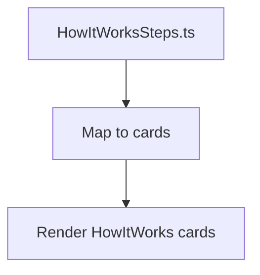

**Diagram sources**
- [HowItWorksSteps.ts](file://landing/src/data/HowItWorksSteps.ts#L1-L26)
- [HowItWorks.tsx](file://landing/src/components/landing/HowItWorks.tsx#L8-L28)

**Section sources**
- [HowItWorks.tsx](file://landing/src/components/landing/HowItWorks.tsx#L8-L28)
- [HowItWorksSteps.ts](file://landing/src/data/HowItWorksSteps.ts#L1-L26)

### Background Pattern
- Renders a repeating SVG pattern of Lucide icons at a fixed tile size.
- Applies subtle opacity and blend mode for a soft, integrated background.

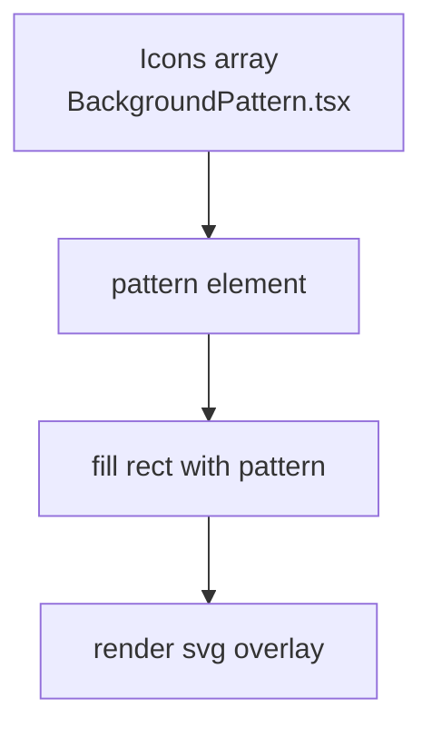

**Diagram sources**
- [BackgroundPattern.tsx](file://landing/src/components/landing/BackgroundPattern.tsx#L473-L514)

**Section sources**
- [BackgroundPattern.tsx](file://landing/src/components/landing/BackgroundPattern.tsx#L35-L514)

### Animation System
- AnimateWrapper: Provides a library of motion variants (fade, blur, slide, scale) with viewport-triggered animations and optional one-time execution.
- TextAnimate: Splits text into segments (text, word, character, line) and applies staggered motion variants with configurable timing.
- LogoSVG: Demonstrates a custom SVG animation with cascading strokes and thickening effects.

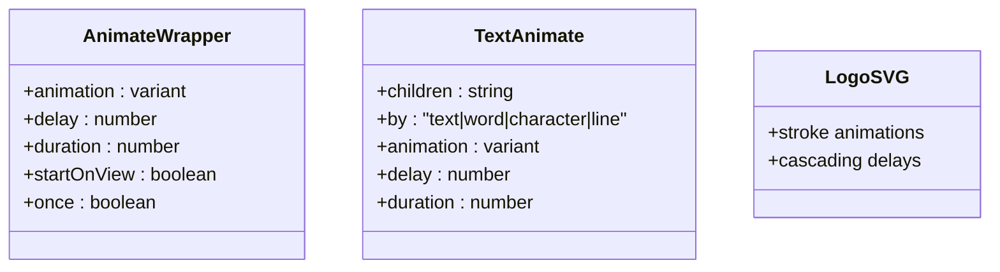

**Diagram sources**
- [AnimateWrapper.tsx](file://landing/src/components/animations/AnimateWrapper.tsx#L12-L32)
- [AnimateWrapper.tsx](file://landing/src/components/animations/AnimateWrapper.tsx#L82-L113)
- [text-animate.tsx](file://landing/src/components/magicui/text-animate.tsx#L13-L71)
- [text-animate.tsx](file://landing/src/components/magicui/text-animate.tsx#L306-L413)
- [LogoSVG.tsx](file://landing/src/components/animations/LogoSVG.tsx#L3-L51)

**Section sources**
- [AnimateWrapper.tsx](file://landing/src/components/animations/AnimateWrapper.tsx#L82-L113)
- [text-animate.tsx](file://landing/src/components/magicui/text-animate.tsx#L306-L413)
- [LogoSVG.tsx](file://landing/src/components/animations/LogoSVG.tsx#L3-L51)

### Footer and Newsletter Subscription
- Multi-column footer with brand, navigation, contact, and legal sections.
- Newsletter subscription form with controlled submission handling.

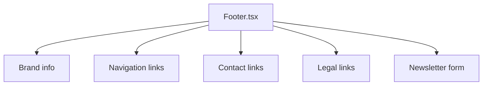

**Diagram sources**
- [Footer.tsx](file://landing/src/components/landing/Footer.tsx#L8-L175)

**Section sources**
- [Footer.tsx](file://landing/src/components/landing/Footer.tsx#L8-L175)

## Dependency Analysis
- Root layout depends on fonts.ts for CSS variables.
- Page composes multiple components and data modules.
- Animation components depend on utils.ts for class merging.
- BackgroundPattern imports Lucide icons for the tile.

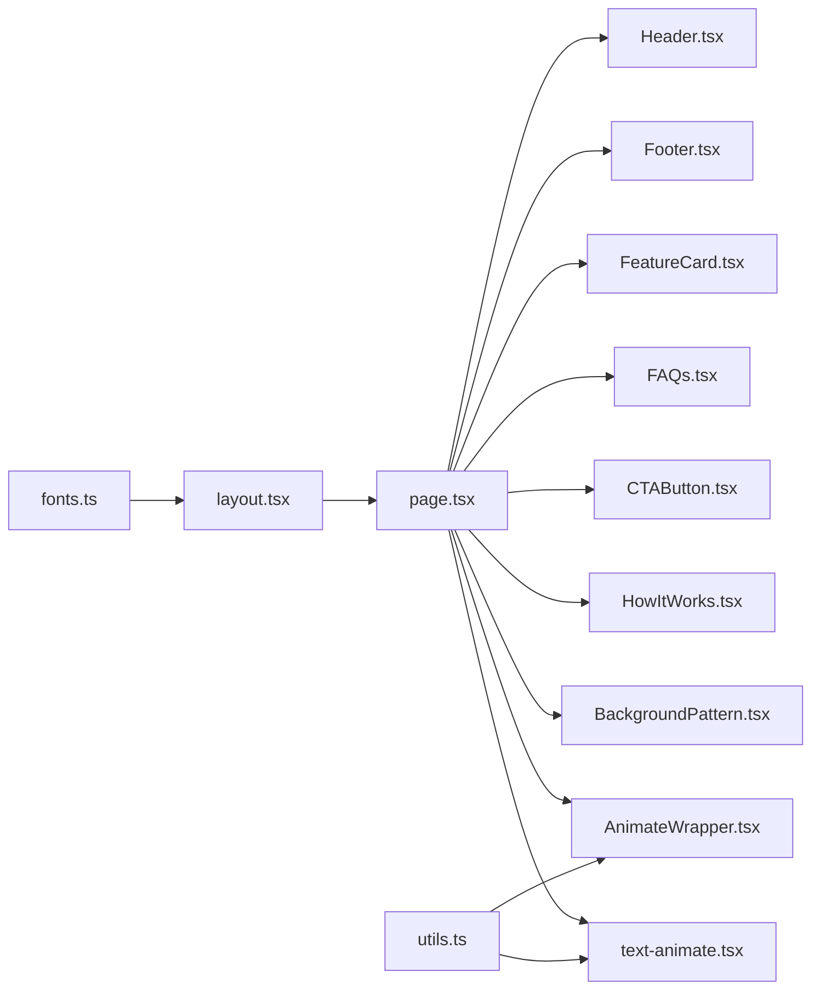

**Diagram sources**
- [fonts.ts](file://landing/src/app/fonts.ts#L1-L84)
- [layout.tsx](file://landing/src/app/layout.tsx#L1-L27)
- [page.tsx](file://landing/src/app/page.tsx#L1-L20)
- [utils.ts](file://landing/src/lib/utils.ts#L4-L6)

**Section sources**
- [page.tsx](file://landing/src/app/page.tsx#L1-L20)
- [utils.ts](file://landing/src/lib/utils.ts#L4-L6)

## Performance Considerations
- Font loading:
  - Next/font is used for Google fonts; local fonts are loaded via next/font/local with display swap to avoid FOIT.
  - CSS variables are injected at the root to minimize repaints.
- Animations:
  - Motion components leverage viewport triggers and optional one-time execution to reduce unnecessary work.
  - Stagger timings are tuned per text segmentation to balance perceived performance and polish.
- Rendering:
  - SVG background pattern uses a single tile repeated via pattern units to minimize DOM nodes.
  - Components use minimal state and event handlers to keep re-renders lightweight.
- Responsiveness:
  - Mobile-first grid and spacing scales progressively with breakpoints.
  - Scroll-aware header reduces heavy DOM at top of viewport.

[No sources needed since this section provides general guidance]

## Troubleshooting Guide
- Fonts not applying:
  - Verify font variables are included in the root body class and font files exist in assets.
- Animations not triggering:
  - Ensure viewport options are enabled and components are within view during initial load.
- Newsletter form submission:
  - Current handler prevents default; integrate backend endpoint to process subscriptions.

**Section sources**
- [layout.tsx](file://landing/src/app/layout.tsx#L18-L22)
- [AnimateWrapper.tsx](file://landing/src/components/animations/AnimateWrapper.tsx#L96-L106)
- [Footer.tsx](file://landing/src/components/landing/Footer.tsx#L149-L161)

## Conclusion
The Flick landing page leverages Next.js App Router to deliver a fast, animated, and responsive marketing site. Its component architecture promotes reuse and maintainability, while the animation system adds delightful micro-interactions. The typography system and background pattern reinforce brand identity, and the footer integrates essential navigation and conversion touchpoints. Together, these elements create a cohesive, performant user experience aligned with a mobile-first design philosophy.