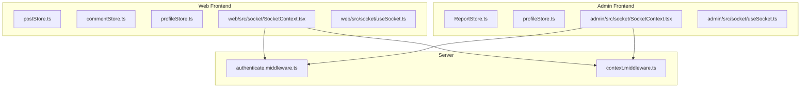
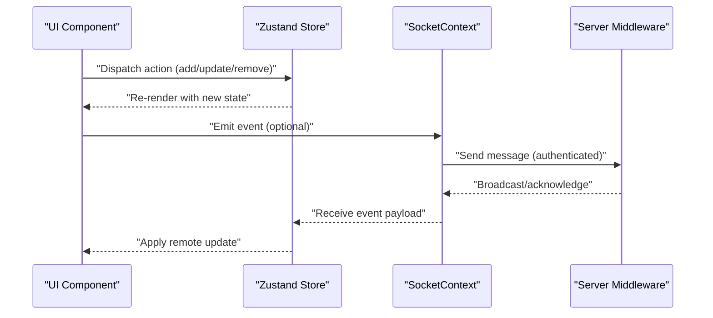
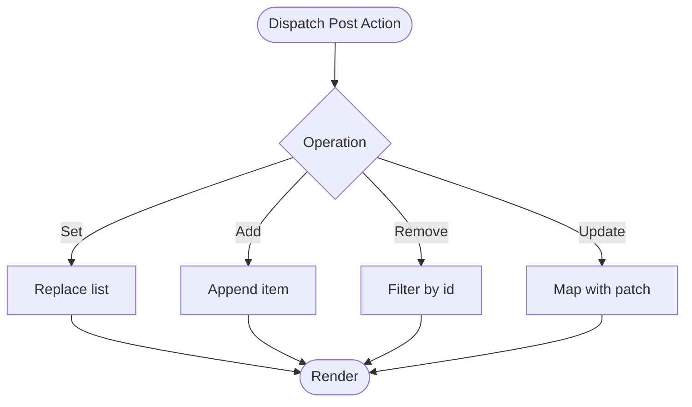
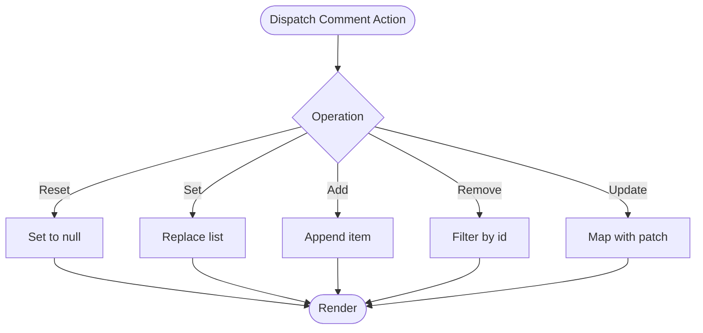
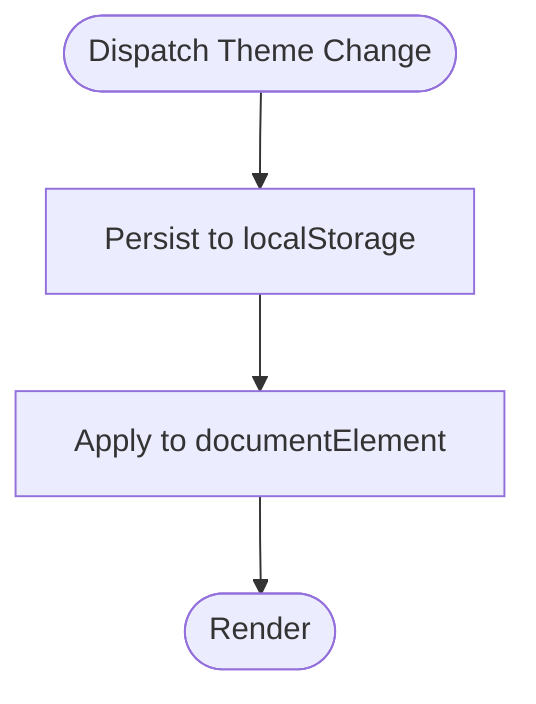
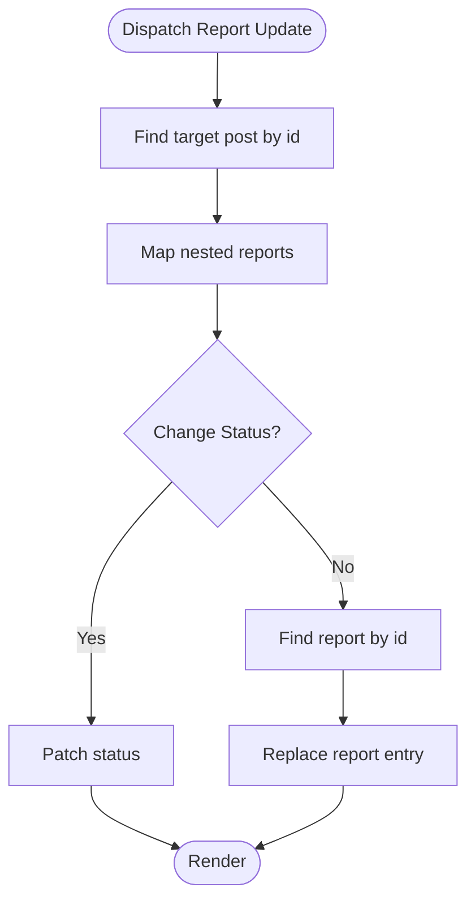
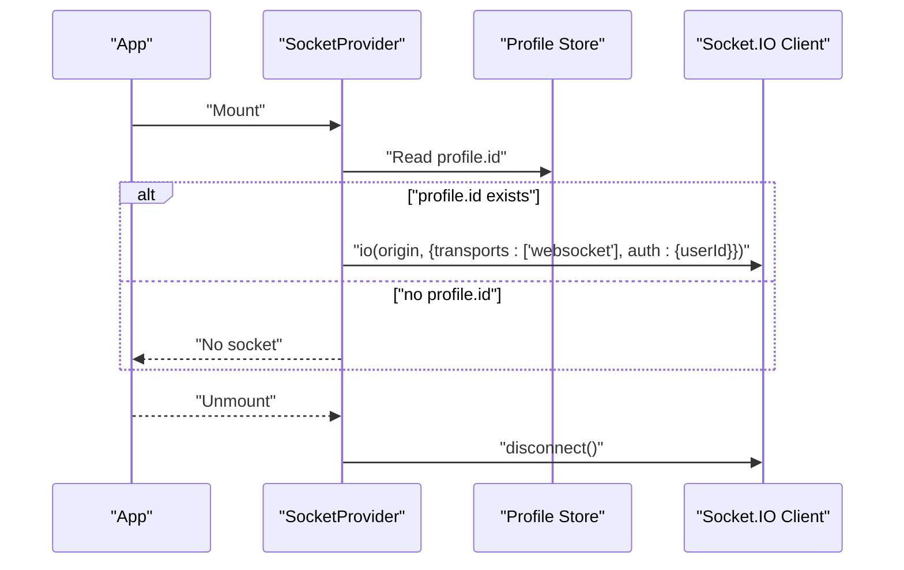
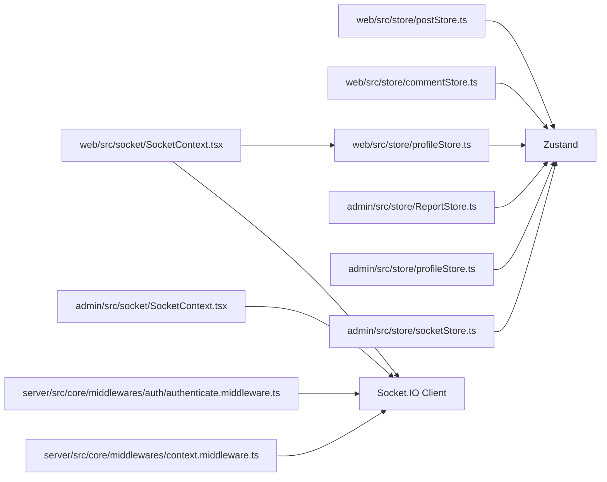

# State Management

<cite>
**Referenced Files in This Document**
- [admin/src/store/socketStore.ts](file://admin/src/store/socketStore.ts)
- [admin/src/store/profileStore.ts](file://admin/src/store/profileStore.ts)
- [admin/src/store/ReportStore.ts](file://admin/src/store/ReportStore.ts)
- [web/src/store/postStore.ts](file://web/src/store/postStore.ts)
- [web/src/store/commentStore.ts](file://web/src/store/commentStore.ts)
- [web/src/store/profileStore.ts](file://web/src/store/profileStore.ts)
- [admin/src/socket/SocketContext.tsx](file://admin/src/socket/SocketContext.tsx)
- [admin/src/socket/useSocket.ts](file://admin/src/socket/useSocket.ts)
- [web/src/socket/SocketContext.tsx](file://web/src/socket/SocketContext.tsx)
- [web/src/socket/useSocket.ts](file://web/src/socket/useSocket.ts)
- [server/src/core/middlewares/context.middleware.ts](file://server/src/core/middlewares/context.middleware.ts)
- [server/src/core/middlewares/auth/authenticate.middleware.ts](file://server/src/core/middlewares/auth/authenticate.middleware.ts)
</cite>

## Table of Contents
1. [Introduction](#introduction)
2. [Project Structure](#project-structure)
3. [Core Components](#core-components)
4. [Architecture Overview](#architecture-overview)
5. [Detailed Component Analysis](#detailed-component-analysis)
6. [Dependency Analysis](#dependency-analysis)
7. [Performance Considerations](#performance-considerations)
8. [Troubleshooting Guide](#troubleshooting-guide)
9. [Conclusion](#conclusion)
10. [Appendices](#appendices)

## Introduction
This document explains the Flick state management architecture across the admin and web frontend applications. It focuses on the Zustand stores used for managing posts, comments, user profiles, and administrative reports, and how real-time updates are integrated via Socket.IO. It also covers optimistic updates, conflict resolution strategies, store composition patterns, middleware usage, and state persistence techniques. Guidance is included for debugging, inspection, and state migration.

## Project Structure
The state management spans two frontend apps:
- Web app: manages posts, comments, and user profile state.
- Admin app: manages reports and a minimal socket-backed state.

Real-time capabilities are provided by Socket.IO contexts and hooks in both apps. Server-side middleware supports request tracing and authentication, which underpin reliable state synchronization.

**Diagram sources**
- [web/src/store/postStore.ts](file://web/src/store/postStore.ts#L1-L30)
- [web/src/store/commentStore.ts](file://web/src/store/commentStore.ts#L1-L34)
- [web/src/store/profileStore.ts](file://web/src/store/profileStore.ts#L1-L45)
- [admin/src/store/ReportStore.ts](file://admin/src/store/ReportStore.ts#L1-L43)
- [admin/src/store/profileStore.ts](file://admin/src/store/profileStore.ts#L1-L39)
- [web/src/socket/SocketContext.tsx](file://web/src/socket/SocketContext.tsx#L1-L45)
- [web/src/socket/useSocket.ts](file://web/src/socket/useSocket.ts#L1-L9)
- [admin/src/socket/SocketContext.tsx](file://admin/src/socket/SocketContext.tsx#L1-L26)
- [admin/src/socket/useSocket.ts](file://admin/src/socket/useSocket.ts#L1-L13)
- [server/src/core/middlewares/auth/authenticate.middleware.ts](file://server/src/core/middlewares/auth/authenticate.middleware.ts#L1-L27)
- [server/src/core/middlewares/context.middleware.ts](file://server/src/core/middlewares/context.middleware.ts#L1-L61)

**Section sources**
- [web/src/store/postStore.ts](file://web/src/store/postStore.ts#L1-L30)
- [web/src/store/commentStore.ts](file://web/src/store/commentStore.ts#L1-L34)
- [web/src/store/profileStore.ts](file://web/src/store/profileStore.ts#L1-L45)
- [admin/src/store/ReportStore.ts](file://admin/src/store/ReportStore.ts#L1-L43)
- [admin/src/store/profileStore.ts](file://admin/src/store/profileStore.ts#L1-L39)
- [web/src/socket/SocketContext.tsx](file://web/src/socket/SocketContext.tsx#L1-L45)
- [web/src/socket/useSocket.ts](file://web/src/socket/useSocket.ts#L1-L9)
- [admin/src/socket/SocketContext.tsx](file://admin/src/socket/SocketContext.tsx#L1-L26)
- [admin/src/socket/useSocket.ts](file://admin/src/socket/useSocket.ts#L1-L13)
- [server/src/core/middlewares/auth/authenticate.middleware.ts](file://server/src/core/middlewares/auth/authenticate.middleware.ts#L1-L27)
- [server/src/core/middlewares/context.middleware.ts](file://server/src/core/middlewares/context.middleware.ts#L1-L61)

## Core Components
- Web Zustand stores:
  - Post store: maintains a list of posts and supports set/add/remove/update operations.
  - Comment store: maintains a list of comments and supports set/reset/add/remove/update operations.
  - Profile store: maintains user profile and theme, with persistence to localStorage and DOM attributes.
- Admin Zustand stores:
  - Report store: maintains reported posts and supports setting reports and updating report statuses/reports.
  - Profile store: mirrors user profile shape and theme handling similar to the web app.
  - Socket store: minimal socket-backed state holder (user identifier).
- Socket providers and hooks:
  - Web: initializes a Socket.IO client with WebSocket transport and attaches authentication via the user ID from profile state.
  - Admin: initializes a Socket.IO client with WebSocket transport and provides a hook to access the socket instance.

Key patterns:
- Composition: stores encapsulate state and pure updater functions.
- Persistence: profile theme is persisted to localStorage and applied to the document element.
- Real-time: socket initialization is derived from authenticated user context.

**Section sources**
- [web/src/store/postStore.ts](file://web/src/store/postStore.ts#L1-L30)
- [web/src/store/commentStore.ts](file://web/src/store/commentStore.ts#L1-L34)
- [web/src/store/profileStore.ts](file://web/src/store/profileStore.ts#L1-L45)
- [admin/src/store/ReportStore.ts](file://admin/src/store/ReportStore.ts#L1-L43)
- [admin/src/store/profileStore.ts](file://admin/src/store/profileStore.ts#L1-L39)
- [admin/src/store/socketStore.ts](file://admin/src/store/socketStore.ts#L1-L14)
- [web/src/socket/SocketContext.tsx](file://web/src/socket/SocketContext.tsx#L16-L37)
- [web/src/socket/useSocket.ts](file://web/src/socket/useSocket.ts#L1-L9)
- [admin/src/socket/SocketContext.tsx](file://admin/src/socket/SocketContext.tsx#L12-L23)
- [admin/src/socket/useSocket.ts](file://admin/src/socket/useSocket.ts#L1-L13)

## Architecture Overview
The state architecture combines local Zustand stores with server-backed real-time updates. The server provides request context and authentication middleware, while the client initializes a Socket.IO connection authenticated by the current user’s ID.

**Diagram sources**
- [web/src/socket/SocketContext.tsx](file://web/src/socket/SocketContext.tsx#L16-L37)
- [server/src/core/middlewares/auth/authenticate.middleware.ts](file://server/src/core/middlewares/auth/authenticate.middleware.ts#L8-L26)
- [server/src/core/middlewares/context.middleware.ts](file://server/src/core/middlewares/context.middleware.ts#L28-L57)

## Detailed Component Analysis

### Web Post Store
Purpose:
- Manage a list of posts with CRUD-like operations.

Implementation highlights:
- Maintains a nullable array of posts.
- Supports setting the entire list, adding a single post, removing by id, and updating by id.

Optimistic updates:
- Apply UI changes immediately upon dispatch.
- Reconcile with server responses; rollback or merge on conflict.

Conflict resolution:
- Prefer server authoritative state on acknowledgment.
- Merge strategies: replace on full refresh, selective updates on partial edits.

**Diagram sources**
- [web/src/store/postStore.ts](file://web/src/store/postStore.ts#L12-L27)

**Section sources**
- [web/src/store/postStore.ts](file://web/src/store/postStore.ts#L1-L30)

### Web Comment Store
Purpose:
- Manage a list of comments with CRUD-like operations.

Implementation highlights:
- Maintains a nullable array of comments.
- Supports resetting to null, setting the list, adding a single comment, removing by id, and updating by id.

Optimistic updates:
- Immediate UI updates for add/remove/update.
- Resolve conflicts by acknowledging server responses.

Conflict resolution:
- Replace or merge based on server acknowledgment.
- Reset to null when navigating away or refreshing.

**Diagram sources**
- [web/src/store/commentStore.ts](file://web/src/store/commentStore.ts#L13-L30)

**Section sources**
- [web/src/store/commentStore.ts](file://web/src/store/commentStore.ts#L1-L34)

### Web Profile Store
Purpose:
- Manage user profile and theme.

Implementation highlights:
- Holds profile and theme.
- Provides setters for profile and theme.
- Persists theme to localStorage and applies it to the document element.

Persistence:
- Theme persistence and DOM attribute application ensure consistent UI across reloads.

**Diagram sources**
- [web/src/store/profileStore.ts](file://web/src/store/profileStore.ts#L37-L41)

**Section sources**
- [web/src/store/profileStore.ts](file://web/src/store/profileStore.ts#L1-L45)

### Admin Report Store
Purpose:
- Manage reported posts and nested report items.

Implementation highlights:
- Maintains nullable list of reported posts.
- Supports setting the list and updating report statuses or specific report entries.

Conflict resolution:
- Map over nested arrays to update status or replace report entries.
- Ensure fallback to empty arrays when initial state is null.

**Diagram sources**
- [admin/src/store/ReportStore.ts](file://admin/src/store/ReportStore.ts#L14-L39)

**Section sources**
- [admin/src/store/ReportStore.ts](file://admin/src/store/ReportStore.ts#L1-L43)

### Admin Profile Store
Purpose:
- Mirror user profile and theme handling similar to the web app.

Implementation highlights:
- Similar structure to web profile store with theme persistence and DOM attribute application.

**Section sources**
- [admin/src/store/profileStore.ts](file://admin/src/store/profileStore.ts#L1-L39)

### Admin Socket Store
Purpose:
- Minimal socket-backed state holder for user identifier.

Implementation highlights:
- Simple state with setter for user.

Usage:
- Integrate with Socket.IO context to manage user presence or targeted events.

**Section sources**
- [admin/src/store/socketStore.ts](file://admin/src/store/socketStore.ts#L1-L14)

### Socket Providers and Hooks
Web Socket Provider:
- Initializes Socket.IO with WebSocket transport.
- Authenticates via userId extracted from profile state.
- Disconnects on unmount or when profile id changes.

Admin Socket Provider:
- Initializes Socket.IO with WebSocket transport.
- Provides a hook to access the socket instance with error handling if used outside provider.

**Diagram sources**
- [web/src/socket/SocketContext.tsx](file://web/src/socket/SocketContext.tsx#L16-L37)
- [web/src/store/profileStore.ts](file://web/src/store/profileStore.ts#L14-L41)
- [admin/src/socket/SocketContext.tsx](file://admin/src/socket/SocketContext.tsx#L12-L23)
- [admin/src/socket/useSocket.ts](file://admin/src/socket/useSocket.ts#L4-L9)

**Section sources**
- [web/src/socket/SocketContext.tsx](file://web/src/socket/SocketContext.tsx#L1-L45)
- [web/src/socket/useSocket.ts](file://web/src/socket/useSocket.ts#L1-L9)
- [admin/src/socket/SocketContext.tsx](file://admin/src/socket/SocketContext.tsx#L1-L26)
- [admin/src/socket/useSocket.ts](file://admin/src/socket/useSocket.ts#L1-L13)

## Dependency Analysis
- Stores depend on Zustand for state creation and updates.
- Web socket provider depends on profile store for authentication context.
- Server middleware provides request context and optional authentication, enabling traceable and auditable operations.

**Diagram sources**
- [web/src/store/postStore.ts](file://web/src/store/postStore.ts#L1-L30)
- [web/src/store/commentStore.ts](file://web/src/store/commentStore.ts#L1-L34)
- [web/src/store/profileStore.ts](file://web/src/store/profileStore.ts#L1-L45)
- [admin/src/store/ReportStore.ts](file://admin/src/store/ReportStore.ts#L1-L43)
- [admin/src/store/profileStore.ts](file://admin/src/store/profileStore.ts#L1-L39)
- [admin/src/store/socketStore.ts](file://admin/src/store/socketStore.ts#L1-L14)
- [web/src/socket/SocketContext.tsx](file://web/src/socket/SocketContext.tsx#L16-L37)
- [admin/src/socket/SocketContext.tsx](file://admin/src/socket/SocketContext.tsx#L12-L23)
- [server/src/core/middlewares/auth/authenticate.middleware.ts](file://server/src/core/middlewares/auth/authenticate.middleware.ts#L8-L26)
- [server/src/core/middlewares/context.middleware.ts](file://server/src/core/middlewares/context.middleware.ts#L28-L57)

**Section sources**
- [web/src/store/postStore.ts](file://web/src/store/postStore.ts#L1-L30)
- [web/src/store/commentStore.ts](file://web/src/store/commentStore.ts#L1-L34)
- [web/src/store/profileStore.ts](file://web/src/store/profileStore.ts#L1-L45)
- [admin/src/store/ReportStore.ts](file://admin/src/store/ReportStore.ts#L1-L43)
- [admin/src/store/profileStore.ts](file://admin/src/store/profileStore.ts#L1-L39)
- [admin/src/store/socketStore.ts](file://admin/src/store/socketStore.ts#L1-L14)
- [web/src/socket/SocketContext.tsx](file://web/src/socket/SocketContext.tsx#L16-L37)
- [admin/src/socket/SocketContext.tsx](file://admin/src/socket/SocketContext.tsx#L12-L23)
- [server/src/core/middlewares/auth/authenticate.middleware.ts](file://server/src/core/middlewares/auth/authenticate.middleware.ts#L1-L27)
- [server/src/core/middlewares/context.middleware.ts](file://server/src/core/middlewares/context.middleware.ts#L1-L61)

## Performance Considerations
- Prefer immutable updates in stores to minimize re-renders.
- Batch updates when possible to reduce render churn.
- Use optimistic updates for immediate feedback; ensure quick reconciliation with server acknowledgments.
- Debounce or throttle frequent updates (e.g., live feeds) to avoid excessive renders.
- Persist only essential state (e.g., theme) to localStorage to avoid bloating storage.

## Troubleshooting Guide
- Socket initialization errors:
  - Verify environment variable for server URI and ensure it resolves to a reachable origin.
  - Confirm that the profile id is present before initializing the socket.
- Authentication failures:
  - Ensure the server authentication middleware is attached and that sessions are valid.
  - Check request headers for cookies/session tokens.
- Real-time updates not reflected:
  - Confirm the socket provider is mounted and the socket instance is available.
  - Verify event names and payloads match server expectations.
- State not persisting:
  - For theme persistence, confirm localStorage writes and DOM attribute application occur after theme updates.

**Section sources**
- [web/src/socket/SocketContext.tsx](file://web/src/socket/SocketContext.tsx#L16-L37)
- [web/src/store/profileStore.ts](file://web/src/store/profileStore.ts#L37-L41)
- [server/src/core/middlewares/auth/authenticate.middleware.ts](file://server/src/core/middlewares/auth/authenticate.middleware.ts#L8-L26)
- [server/src/core/middlewares/context.middleware.ts](file://server/src/core/middlewares/context.middleware.ts#L28-L57)

## Conclusion
Flick’s state management leverages Zustand for straightforward, composable local state and integrates Socket.IO for real-time synchronization. The web and admin apps share consistent patterns for store composition, optimistic updates, and conflict resolution. Server middleware ensures traceability and optional authentication, laying the groundwork for secure and observable state updates.

## Appendices
- Debugging and inspection:
  - Use browser devtools to inspect Zustand state snapshots.
  - Monitor network tab for Socket.IO handshake and message traffic.
  - Enable logging in middleware to trace request IDs and audit buffers.
- State migration:
  - When changing store shapes, maintain backward compatibility during transitions.
  - Provide migrations for persisted keys (e.g., theme) to handle schema evolution.