# API Integration

<cite>
**Referenced Files in This Document**
- [web/src/services/http.ts](file://web/src/services/http.ts)
- [admin/src/services/http.ts](file://admin/src/services/http.ts)
- [web/src/services/api/post.ts](file://web/src/services/api/post.ts)
- [web/src/services/api/user.ts](file://web/src/services/api/user.ts)
- [web/src/services/api/auth.ts](file://web/src/services/api/auth.ts)
- [web/src/services/api/comment.ts](file://web/src/services/api/comment.ts)
- [web/src/services/api/bookmark.ts](file://web/src/services/api/bookmark.ts)
- [web/src/services/api/vote.ts](file://web/src/services/api/vote.ts)
- [web/src/lib/auth-client.ts](file://web/src/lib/auth-client.ts)
- [admin/src/lib/auth-client.ts](file://admin/src/lib/auth-client.ts)
- [web/src/hooks/useErrorHandler.tsx](file://web/src/hooks/useErrorHandler.tsx)
- [web/src/store/postStore.ts](file://web/src/store/postStore.ts)
- [web/src/store/commentStore.ts](file://web/src/store/commentStore.ts)
- [web/src/store/profileStore.ts](file://web/src/store/profileStore.ts)
- [admin/src/store/ReportStore.ts](file://admin/src/store/ReportStore.ts)
</cite>

## Table of Contents
1. [Introduction](#introduction)
2. [Project Structure](#project-structure)
3. [Core Components](#core-components)
4. [Architecture Overview](#architecture-overview)
5. [Detailed Component Analysis](#detailed-component-analysis)
6. [Dependency Analysis](#dependency-analysis)
7. [Performance Considerations](#performance-considerations)
8. [Troubleshooting Guide](#troubleshooting-guide)
9. [Conclusion](#conclusion)

## Introduction
This document describes the API integration layer used by the web application. It covers HTTP client configuration, request and response handling, error management, and the API service modules for posts, users, authentication, comments, bookmarks, votes, and notifications. It also explains data fetching patterns, caching strategies, and state synchronization across the frontend. Integration with backend services, authentication headers, and error boundary implementations are documented with practical examples and diagrams.

## Project Structure
The API integration layer is organized into:
- Shared HTTP client configuration for both web and admin applications
- API service modules grouped by domain (posts, users, auth, comments, bookmarks, votes)
- Authentication client integrations
- Error handling utilities and state stores for synchronization

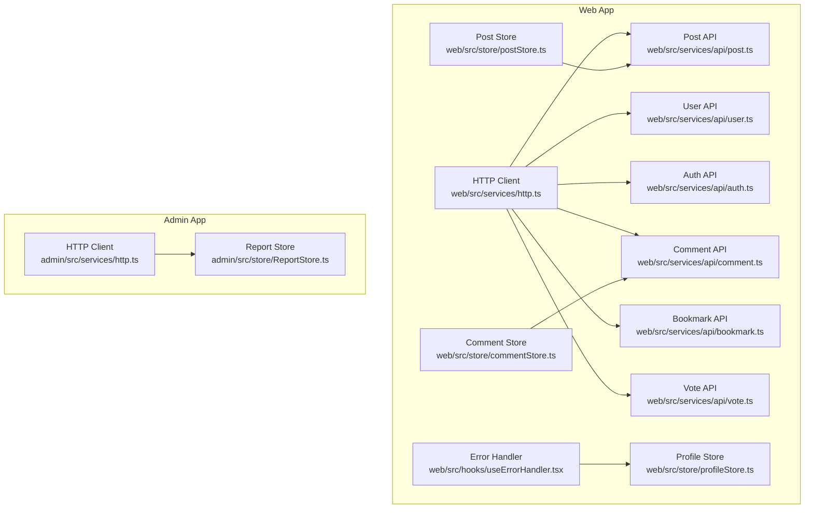

**Diagram sources**
- [web/src/services/http.ts](file://web/src/services/http.ts#L1-L135)
- [admin/src/services/http.ts](file://admin/src/services/http.ts#L1-L154)
- [web/src/services/api/post.ts](file://web/src/services/api/post.ts#L1-L68)
- [web/src/services/api/user.ts](file://web/src/services/api/user.ts#L1-L26)
- [web/src/services/api/auth.ts](file://web/src/services/api/auth.ts#L1-L156)
- [web/src/services/api/comment.ts](file://web/src/services/api/comment.ts#L1-L24)
- [web/src/services/api/bookmark.ts](file://web/src/services/api/bookmark.ts#L1-L14)
- [web/src/services/api/vote.ts](file://web/src/services/api/vote.ts#L1-L27)
- [web/src/hooks/useErrorHandler.tsx](file://web/src/hooks/useErrorHandler.tsx#L1-L170)
- [web/src/store/postStore.ts](file://web/src/store/postStore.ts#L1-L30)
- [web/src/store/commentStore.ts](file://web/src/store/commentStore.ts#L1-L34)
- [web/src/store/profileStore.ts](file://web/src/store/profileStore.ts#L1-L45)
- [admin/src/store/ReportStore.ts](file://admin/src/store/ReportStore.ts#L1-L43)

**Section sources**
- [web/src/services/http.ts](file://web/src/services/http.ts#L1-L135)
- [admin/src/services/http.ts](file://admin/src/services/http.ts#L1-L154)

## Core Components
- HTTP client with base URL, credentials, and interceptors for auth tokens and response normalization
- API service modules encapsulating domain-specific endpoints
- Error handling hook with retry and refresh logic
- Zustand stores for state synchronization and caching

Key responsibilities:
- Centralized HTTP configuration and auth header injection
- Consistent response envelope normalization
- Automatic token refresh on 401 Unauthorized
- Domain APIs for CRUD and specialized operations
- Global error extraction and user feedback
- Local state caches synchronized with backend responses

**Section sources**
- [web/src/services/http.ts](file://web/src/services/http.ts#L1-L135)
- [admin/src/services/http.ts](file://admin/src/services/http.ts#L1-L154)
- [web/src/hooks/useErrorHandler.tsx](file://web/src/hooks/useErrorHandler.tsx#L1-L170)

## Architecture Overview
The API integration layer follows a layered architecture:
- HTTP client layer handles base configuration, auth headers, and response normalization
- Service layer exposes typed domain APIs
- State layer manages local caches and synchronization
- Error handling layer centralizes error reporting and recovery

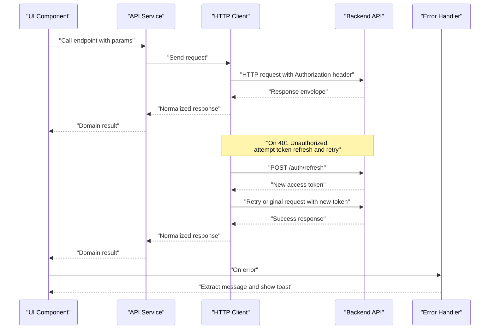

**Diagram sources**
- [web/src/services/http.ts](file://web/src/services/http.ts#L56-L111)
- [web/src/hooks/useErrorHandler.tsx](file://web/src/hooks/useErrorHandler.tsx#L105-L166)
- [web/src/services/api/post.ts](file://web/src/services/api/post.ts#L14-L16)

## Detailed Component Analysis

### HTTP Client Configuration
- Base URL configured from environment variables
- Credentials enabled for cross-origin cookies
- Request interceptor injects Authorization header when present
- Response interceptor normalizes backend envelopes into a unified shape
- Automatic 401 handling with token refresh and queued retry

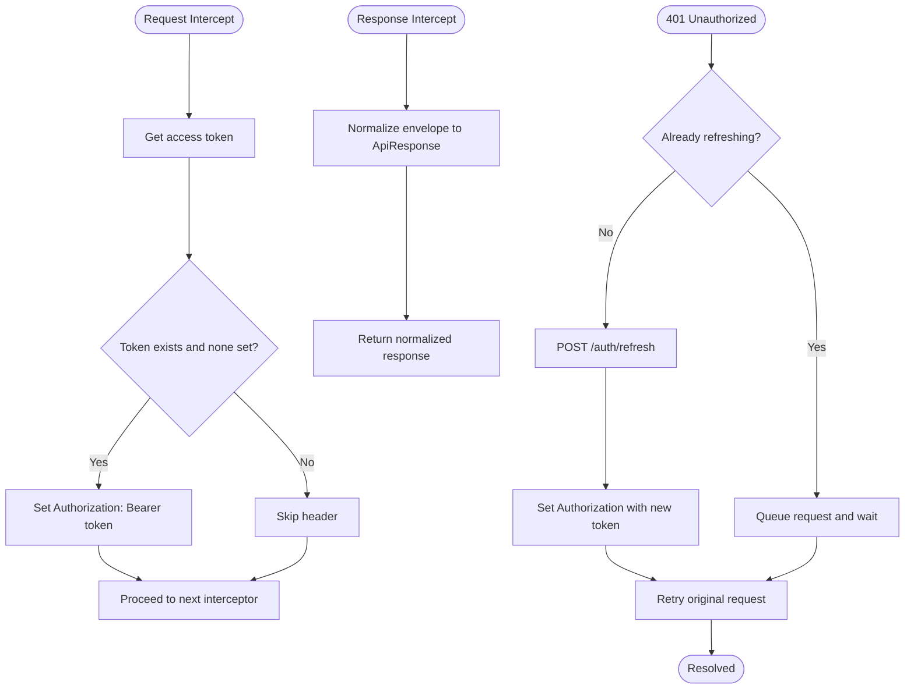

**Diagram sources**
- [web/src/services/http.ts](file://web/src/services/http.ts#L10-L19)
- [web/src/services/http.ts](file://web/src/services/http.ts#L56-L111)
- [web/src/services/http.ts](file://web/src/services/http.ts#L113-L134)

**Section sources**
- [web/src/services/http.ts](file://web/src/services/http.ts#L1-L135)
- [admin/src/services/http.ts](file://admin/src/services/http.ts#L1-L154)

### API Services

#### Posts API
- Fetch paginated posts with filters (branch, topic, sort)
- Search posts by query
- Get posts by college or user
- Increment views, create, update, delete posts
- Retrieve trending posts

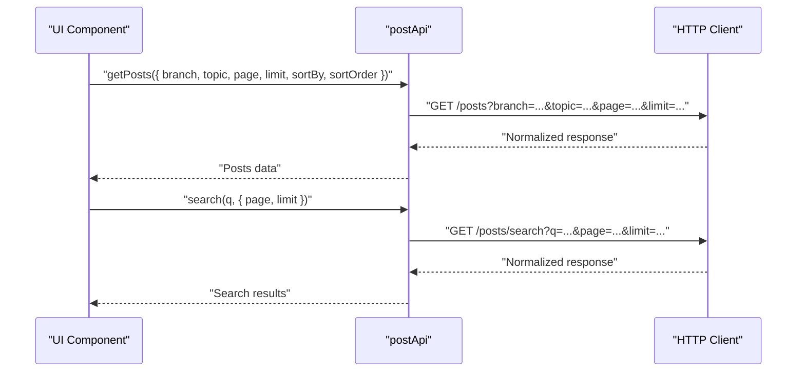

**Diagram sources**
- [web/src/services/api/post.ts](file://web/src/services/api/post.ts#L14-L16)
- [web/src/services/api/post.ts](file://web/src/services/api/post.ts#L17-L18)

**Section sources**
- [web/src/services/api/post.ts](file://web/src/services/api/post.ts#L1-L68)

#### Users API
- Get current user profile
- Accept terms
- Update profile branch
- Block/unblock users
- List blocked users

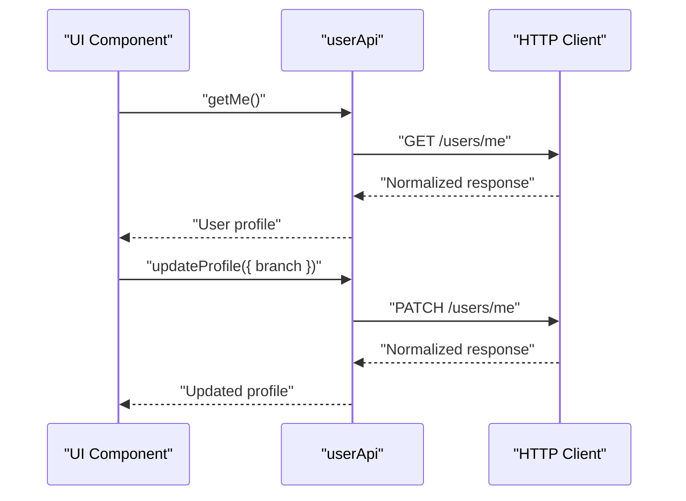

**Diagram sources**
- [web/src/services/api/user.ts](file://web/src/services/api/user.ts#L4-L5)
- [web/src/services/api/user.ts](file://web/src/services/api/user.ts#L13-L14)

**Section sources**
- [web/src/services/api/user.ts](file://web/src/services/api/user.ts#L1-L26)

#### Authentication API
- Session management: login, refresh, logout, logout-all
- OTP flows: send, verify, login variants
- Password management: status, set
- Registration: initialize, finalize
- Onboarding completion
- Account deletion

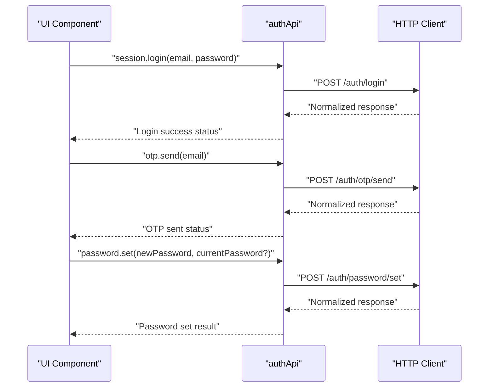

**Diagram sources**
- [web/src/services/api/auth.ts](file://web/src/services/api/auth.ts#L135-L140)
- [web/src/services/api/auth.ts](file://web/src/services/api/auth.ts#L19-L24)
- [web/src/services/api/auth.ts](file://web/src/services/api/auth.ts#L67-L72)

**Section sources**
- [web/src/services/api/auth.ts](file://web/src/services/api/auth.ts#L1-L156)

#### Comments API
- Fetch comments by post ID
- Create, update, delete comments

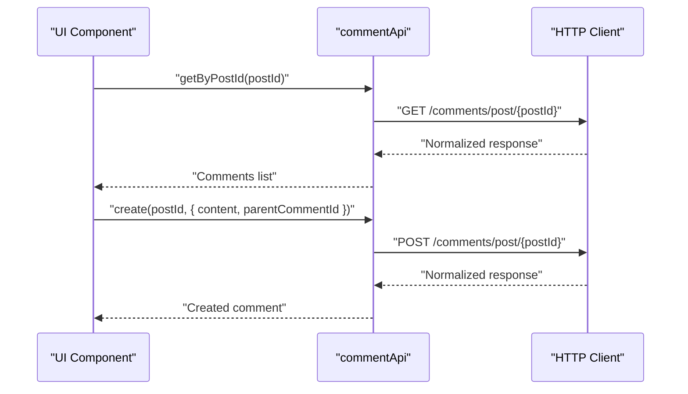

**Diagram sources**
- [web/src/services/api/comment.ts](file://web/src/services/api/comment.ts#L4-L5)
- [web/src/services/api/comment.ts](file://web/src/services/api/comment.ts-L11)

**Section sources**
- [web/src/services/api/comment.ts](file://web/src/services/api/comment.ts#L1-L24)

#### Bookmarks API
- List user bookmarks
- Create/remove bookmarks

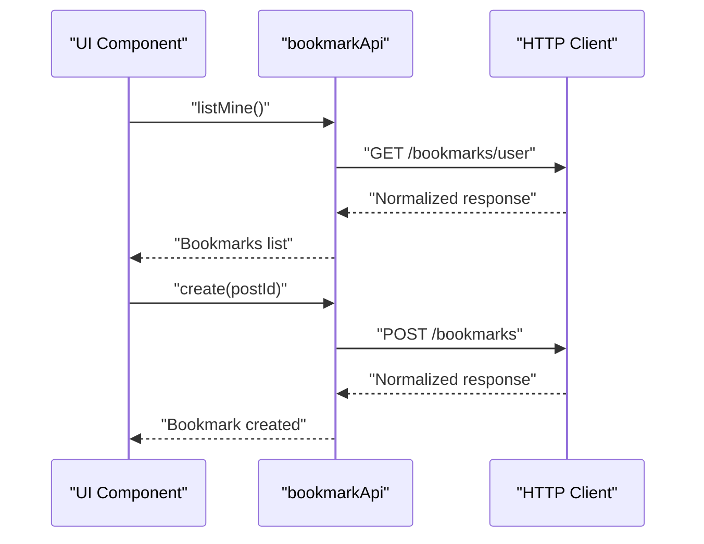

**Diagram sources**
- [web/src/services/api/bookmark.ts](file://web/src/services/api/bookmark.ts#L4-L5)
- [web/src/services/api/bookmark.ts](file://web/src/services/api/bookmark.ts#L7-L8)

**Section sources**
- [web/src/services/api/bookmark.ts](file://web/src/services/api/bookmark.ts#L1-L14)

#### Votes API
- Create, update, remove votes on posts or comments

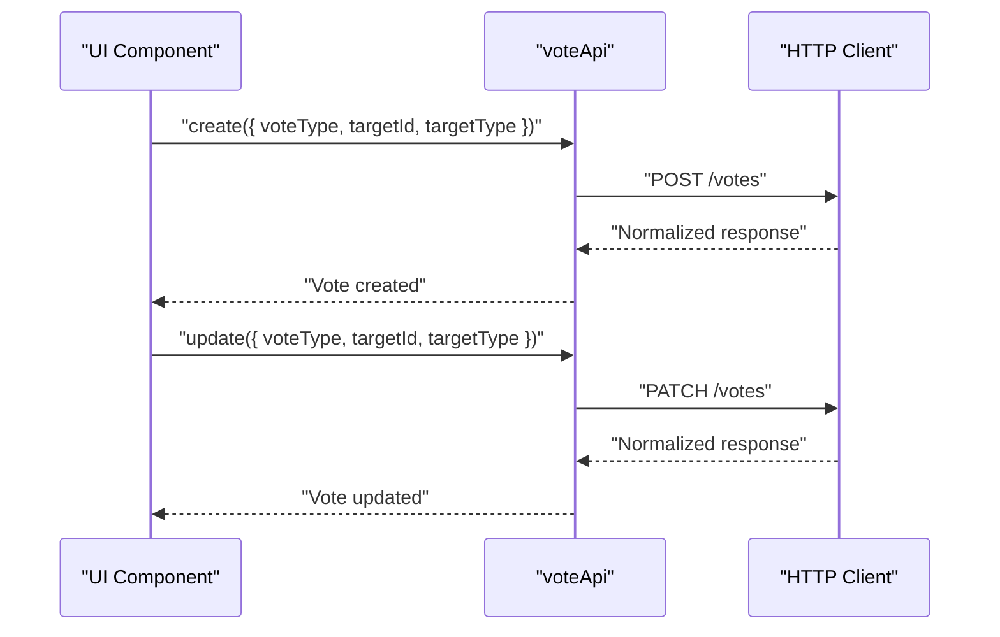

**Diagram sources**
- [web/src/services/api/vote.ts](file://web/src/services/api/vote.ts#L7-L12)
- [web/src/services/api/vote.ts](file://web/src/services/api/vote.ts#L14-L21)

**Section sources**
- [web/src/services/api/vote.ts](file://web/src/services/api/vote.ts#L1-L27)

### Authentication Clients
- Better Auth client configured with base URL and plugins
- Admin client for admin app
- Web client for web app with Google One Tap configuration

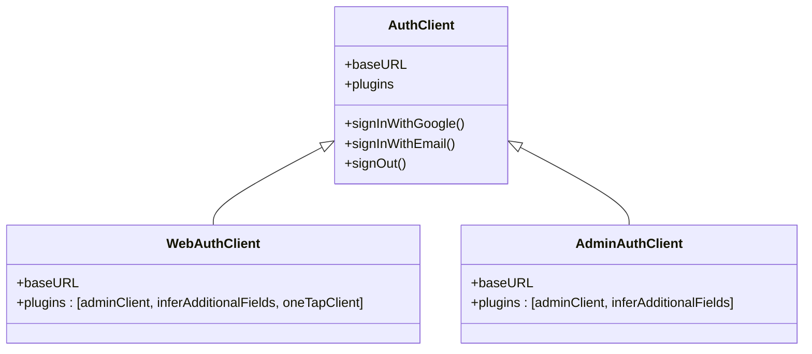

**Diagram sources**
- [web/src/lib/auth-client.ts](file://web/src/lib/auth-client.ts#L9-L19)
- [admin/src/lib/auth-client.ts](file://admin/src/lib/auth-client.ts#L4-L10)

**Section sources**
- [web/src/lib/auth-client.ts](file://web/src/lib/auth-client.ts#L1-L20)
- [admin/src/lib/auth-client.ts](file://admin/src/lib/auth-client.ts#L1-L11)

### Error Management and Boundary Implementation
- Centralized error handler extracts messages from backend envelopes
- Handles moderation-specific policies and user-friendly messages
- Implements automatic token refresh on 401 Unauthorized with retry
- Integrates with toast notifications and profile store cleanup

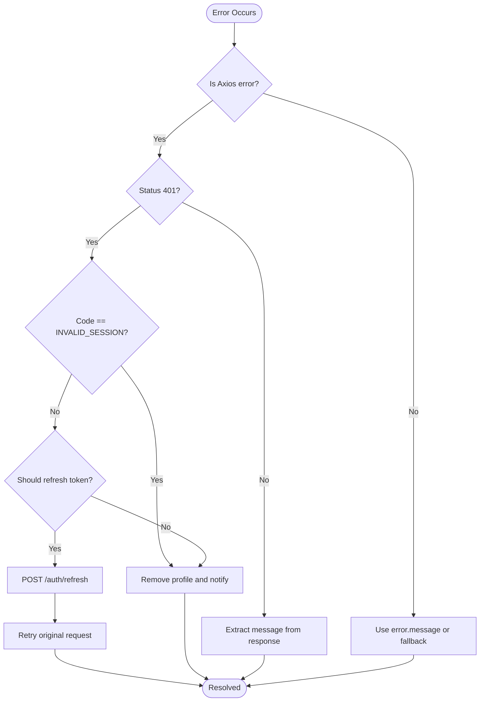

**Diagram sources**
- [web/src/hooks/useErrorHandler.tsx](file://web/src/hooks/useErrorHandler.tsx#L105-L166)
- [web/src/services/http.ts](file://web/src/services/http.ts#L56-L111)

**Section sources**
- [web/src/hooks/useErrorHandler.tsx](file://web/src/hooks/useErrorHandler.tsx#L1-L170)

### State Synchronization and Caching Strategies
- Profile store holds user profile and theme preferences
- Post and comment stores maintain local caches for lists and updates
- Report store synchronizes moderation report states in admin
- Stores support add/update/remove operations to keep UI in sync with backend

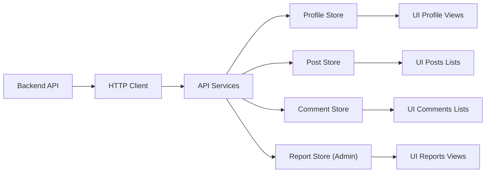

**Diagram sources**
- [web/src/store/profileStore.ts](file://web/src/store/profileStore.ts#L14-L42)
- [web/src/store/postStore.ts](file://web/src/store/postStore.ts#L12-L27)
- [web/src/store/commentStore.ts](file://web/src/store/commentStore.ts#L13-L31)
- [admin/src/store/ReportStore.ts](file://admin/src/store/ReportStore.ts#L11-L40)

**Section sources**
- [web/src/store/profileStore.ts](file://web/src/store/profileStore.ts#L1-L45)
- [web/src/store/postStore.ts](file://web/src/store/postStore.ts#L1-L30)
- [web/src/store/commentStore.ts](file://web/src/store/commentStore.ts#L1-L34)
- [admin/src/store/ReportStore.ts](file://admin/src/store/ReportStore.ts#L1-L43)

## Dependency Analysis
- HTTP client depends on environment configuration and axios
- API services depend on the shared HTTP client
- Error handler depends on axios, toast notifications, and profile store
- Stores are independent and consumed by UI components

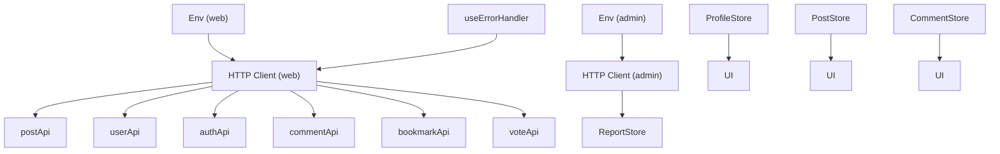

**Diagram sources**
- [web/src/services/http.ts](file://web/src/services/http.ts#L5-L8)
- [admin/src/services/http.ts](file://admin/src/services/http.ts#L11-L19)
- [web/src/services/api/post.ts](file://web/src/services/api/post.ts#L1-L1)
- [web/src/hooks/useErrorHandler.tsx](file://web/src/hooks/useErrorHandler.tsx#L1-L10)
- [web/src/store/profileStore.ts](file://web/src/store/profileStore.ts#L1-L12)
- [web/src/store/postStore.ts](file://web/src/store/postStore.ts#L1-L10)
- [web/src/store/commentStore.ts](file://web/src/store/commentStore.ts#L1-L11)
- [admin/src/store/ReportStore.ts](file://admin/src/store/ReportStore.ts#L1-L9)

**Section sources**
- [web/src/services/http.ts](file://web/src/services/http.ts#L1-L135)
- [admin/src/services/http.ts](file://admin/src/services/http.ts#L1-L154)

## Performance Considerations
- Centralized interceptors reduce duplication and overhead
- Queued retries during refresh prevent redundant requests
- Normalized responses simplify UI handling and reduce branching
- Local stores minimize repeated fetches and improve perceived performance
- Consider adding optimistic updates for write-heavy flows (create/update/delete) to enhance responsiveness

## Troubleshooting Guide
Common scenarios and resolutions:
- 401 Unauthorized
  - The client attempts a token refresh automatically; if successful, the original request is retried
  - If refresh fails, the profile is cleared and the user is prompted to log in again
- Content moderation violations
  - The error handler inspects backend metadata and field-level errors to provide user-friendly guidance
- Network or unexpected errors
  - Messages are extracted from the response envelope or error object and surfaced via toast notifications
- Token refresh conflicts
  - Requests are queued while a refresh is in progress; they resolve with the new token

Operational tips:
- Verify environment variables for base URLs
- Ensure cookies are accepted for cross-origin requests
- Confirm that the access token getter is registered so interceptors can attach Authorization headers
- Use the error handler consistently across API calls to standardize user feedback

**Section sources**
- [web/src/services/http.ts](file://web/src/services/http.ts#L56-L111)
- [web/src/hooks/useErrorHandler.tsx](file://web/src/hooks/useErrorHandler.tsx#L105-L166)

## Conclusion
The API integration layer provides a robust, centralized mechanism for HTTP communication, consistent error handling, and state synchronization. By encapsulating domain-specific endpoints, normalizing responses, and managing authentication transparently, it enables scalable development and reliable user experiences across the application.