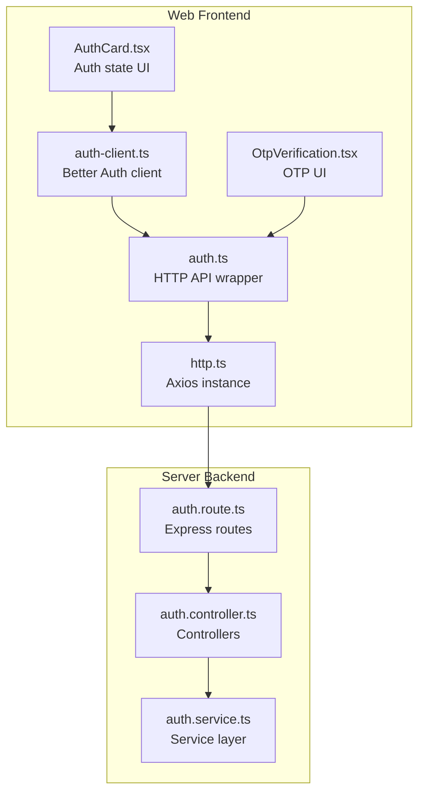
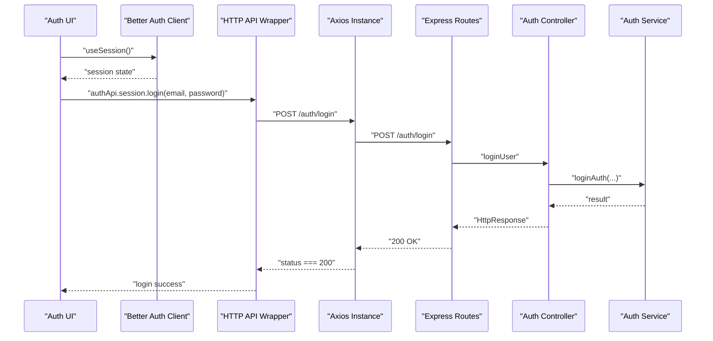
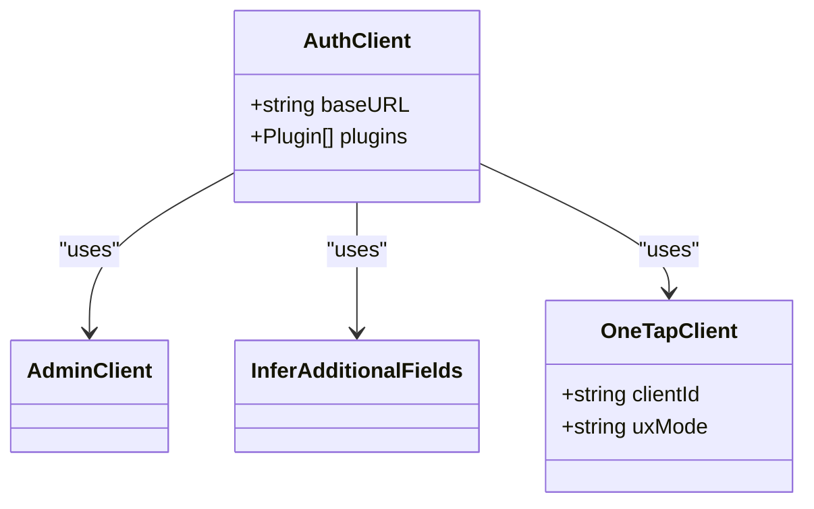
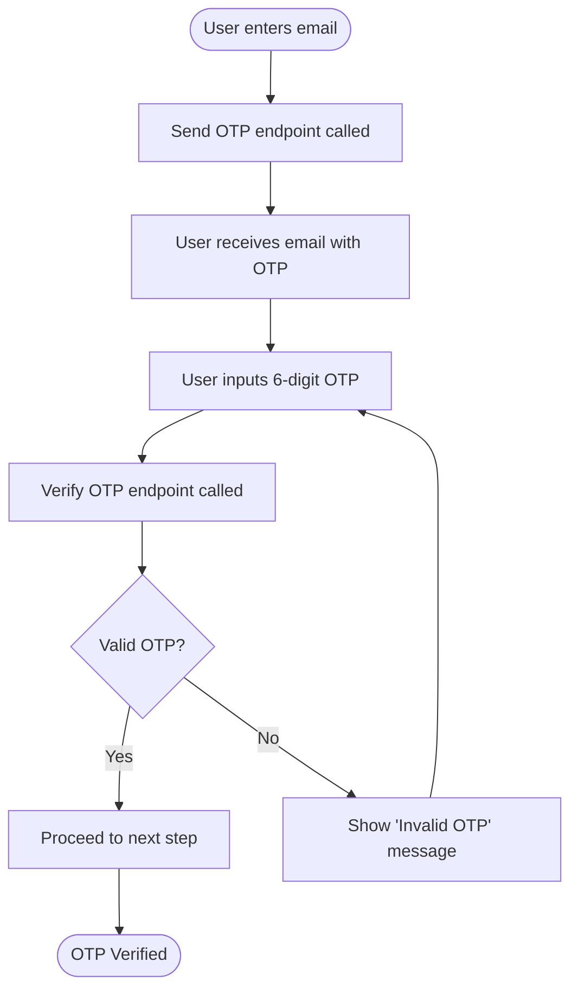
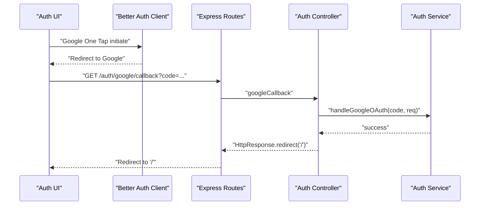
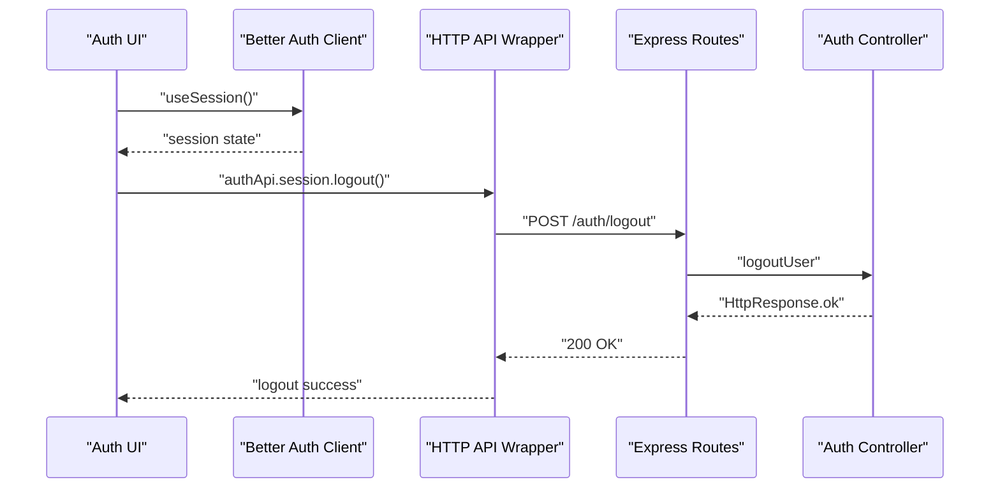
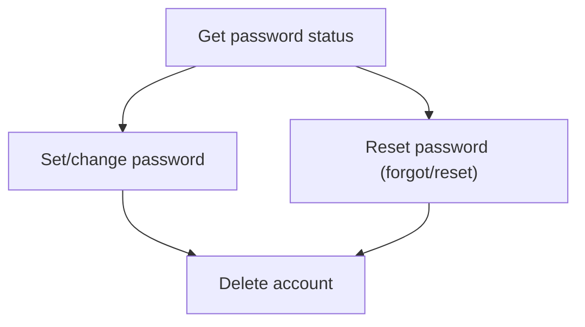
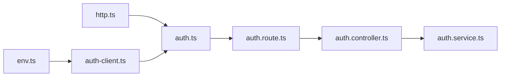

# Authentication Client

<cite>
**Referenced Files in This Document**
- [auth-client.ts](file://web/src/lib/auth-client.ts)
- [env.ts](file://web/src/config/env.ts)
- [auth.ts](file://web/src/services/api/auth.ts)
- [OtpVerification.tsx](file://web/src/components/general/OtpVerification.tsx)
- [AuthCard.tsx](file://web/src/components/general/AuthCard.tsx)
- [auth.route.ts](file://server/src/modules/auth/auth.route.ts)
- [auth.controller.ts](file://server/src/modules/auth/auth.controller.ts)
- [auth.service.ts](file://server/src/modules/auth/auth.service.ts)
- [http.ts](file://web/src/services/http.ts)
</cite>

## Table of Contents
1. [Introduction](#introduction)
2. [Project Structure](#project-structure)
3. [Core Components](#core-components)
4. [Architecture Overview](#architecture-overview)
5. [Detailed Component Analysis](#detailed-component-analysis)
6. [Dependency Analysis](#dependency-analysis)
7. [Performance Considerations](#performance-considerations)
8. [Troubleshooting Guide](#troubleshooting-guide)
9. [Conclusion](#conclusion)

## Introduction
This document describes the authentication client implementation for the web application, focusing on OTP verification, OAuth integration via Google One Tap, session lifecycle, and user state management. It explains how the frontend Better Auth client integrates with backend endpoints, how tokens are handled, and how guards and protected routes are enforced. It also covers logout mechanisms, error handling strategies, and security considerations derived from the codebase.

## Project Structure
The authentication implementation spans the frontend and backend:
- Frontend
  - Authentication client configured with Better Auth and plugins
  - HTTP service wrappers for API calls
  - UI components for OTP verification and auth state display
- Backend
  - Express routes exposing authentication endpoints
  - Controller layer orchestrating requests
  - Service layer interacting with Better Auth and database

**Diagram sources**
- [auth-client.ts](file://web/src/lib/auth-client.ts#L1-L20)
- [auth.ts](file://web/src/services/api/auth.ts#L1-L156)
- [OtpVerification.tsx](file://web/src/components/general/OtpVerification.tsx#L1-L140)
- [AuthCard.tsx](file://web/src/components/general/AuthCard.tsx#L1-L44)
- [http.ts](file://web/src/services/http.ts)
- [auth.route.ts](file://server/src/modules/auth/auth.route.ts#L1-L44)
- [auth.controller.ts](file://server/src/modules/auth/auth.controller.ts#L1-L236)
- [auth.service.ts](file://server/src/modules/auth/auth.service.ts#L517-L583)

**Section sources**
- [auth-client.ts](file://web/src/lib/auth-client.ts#L1-L20)
- [auth.ts](file://web/src/services/api/auth.ts#L1-L156)
- [auth.route.ts](file://server/src/modules/auth/auth.route.ts#L1-L44)

## Core Components
- Better Auth client
  - Initializes base URL and plugins (admin client, infer additional fields, Google One Tap)
  - Provides session state and auth hooks for UI
- HTTP API module
  - Encapsulates typed endpoints for OTP, password, OAuth, registration, onboarding, account, and session operations
- OTP Verification UI
  - InputOTP component with resend and validation logic
- Auth Card UI
  - Displays session state and navigates to sign-in when unauthenticated
- Environment configuration
  - Validates and exposes client-side environment variables including Google OAuth client ID and server URI

Key responsibilities:
- Frontend: manage auth state, trigger OTP flows, integrate OAuth, and call backend APIs
- Backend: enforce rate limits, protect routes, and delegate auth operations to Better Auth

**Section sources**
- [auth-client.ts](file://web/src/lib/auth-client.ts#L9-L19)
- [auth.ts](file://web/src/services/api/auth.ts#L12-L155)
- [OtpVerification.tsx](file://web/src/components/general/OtpVerification.tsx#L30-L139)
- [AuthCard.tsx](file://web/src/components/general/AuthCard.tsx#L36-L44)
- [env.ts](file://web/src/config/env.ts#L4-L28)

## Architecture Overview
The frontend Better Auth client communicates with backend routes. The HTTP API module abstracts endpoint calls. Controllers orchestrate requests and delegate to services. Services interact with Better Auth and the database.

**Diagram sources**
- [auth-client.ts](file://web/src/lib/auth-client.ts#L9-L19)
- [auth.ts](file://web/src/services/api/auth.ts#L134-L141)
- [auth.route.ts](file://server/src/modules/auth/auth.route.ts#L10-L10)
- [auth.controller.ts](file://server/src/modules/auth/auth.controller.ts#L8-L18)
- [auth.service.ts](file://server/src/modules/auth/auth.service.ts#L517-L583)

## Detailed Component Analysis

### Better Auth Client Configuration
- Base URL is constructed from the frontend environment variable for the server URI and appended with the auth API prefix
- Plugins:
  - Admin client for administrative features
  - Infer additional fields for dynamic user metadata
  - Google One Tap client configured with the frontend Google OAuth client ID and popup UX mode

**Diagram sources**
- [auth-client.ts](file://web/src/lib/auth-client.ts#L9-L19)

**Section sources**
- [auth-client.ts](file://web/src/lib/auth-client.ts#L9-L19)
- [env.ts](file://web/src/config/env.ts#L9-L27)

### OTP Verification Flow
- UI component renders a 6-digit OTP input, resend controls, and validation messaging
- The component disables input after max attempts and invalid OTP conditions
- The HTTP API module exposes endpoints for sending OTPs and verifying OTPs during registration and login

**Diagram sources**
- [OtpVerification.tsx](file://web/src/components/general/OtpVerification.tsx#L30-L139)
- [auth.ts](file://web/src/services/api/auth.ts#L18-L60)

**Section sources**
- [OtpVerification.tsx](file://web/src/components/general/OtpVerification.tsx#L30-L139)
- [auth.ts](file://web/src/services/api/auth.ts#L18-L60)

### OAuth Integration (Google One Tap)
- The Better Auth client initializes a Google One Tap plugin with the frontend OAuth client ID
- The backend exposes a Google callback route that delegates to the service layer to handle OAuth code exchange
- On successful OAuth completion, the backend redirects to the home page

**Diagram sources**
- [auth-client.ts](file://web/src/lib/auth-client.ts#L14-L17)
- [auth.route.ts](file://server/src/modules/auth/auth.route.ts#L17-L17)
- [auth.controller.ts](file://server/src/modules/auth/auth.controller.ts#L94-L98)
- [auth.service.ts](file://server/src/modules/auth/auth.service.ts#L517-L583)

**Section sources**
- [auth-client.ts](file://web/src/lib/auth-client.ts#L14-L17)
- [auth.route.ts](file://server/src/modules/auth/auth.route.ts#L17-L17)
- [auth.controller.ts](file://server/src/modules/auth/auth.controller.ts#L94-L98)

### Session Management and Protected Routes
- The frontend Better Auth client manages session state and exposes hooks to consume session data
- The backend enforces rate limiting for auth endpoints and uses an authenticated middleware for protected routes
- Logout endpoints support single-device and multi-device termination

**Diagram sources**
- [AuthCard.tsx](file://web/src/components/general/AuthCard.tsx#L42-L42)
- [auth.ts](file://web/src/services/api/auth.ts#L146-L149)
- [auth.route.ts](file://server/src/modules/auth/auth.route.ts#L33-L33)
- [auth.controller.ts](file://server/src/modules/auth/auth.controller.ts#L20-L24)

**Section sources**
- [AuthCard.tsx](file://web/src/components/general/AuthCard.tsx#L36-L44)
- [auth.ts](file://web/src/services/api/auth.ts#L134-L154)
- [auth.route.ts](file://server/src/modules/auth/auth.route.ts#L24-L43)
- [auth.controller.ts](file://server/src/modules/auth/auth.controller.ts#L20-L24)

### Password and Account Operations
- The HTTP API module exposes endpoints for password status, setting a password, resetting a password, and deleting an account
- The backend controller validates inputs and delegates to the service layer

**Diagram sources**
- [auth.ts](file://web/src/services/api/auth.ts#L62-L133)
- [auth.controller.ts](file://server/src/modules/auth/auth.controller.ts#L203-L232)

**Section sources**
- [auth.ts](file://web/src/services/api/auth.ts#L62-L133)
- [auth.controller.ts](file://server/src/modules/auth/auth.controller.ts#L203-L232)

## Dependency Analysis
- Frontend
  - auth-client.ts depends on environment configuration and Better Auth libraries
  - auth.ts depends on http.ts for Axios configuration
  - UI components depend on auth-client.ts and auth.ts
- Backend
  - auth.route.ts registers routes and applies rate limiting and authentication middleware
  - auth.controller.ts orchestrates requests and delegates to auth.service.ts
  - auth.service.ts interacts with Better Auth and records audit events

**Diagram sources**
- [env.ts](file://web/src/config/env.ts#L4-L28)
- [auth-client.ts](file://web/src/lib/auth-client.ts#L1-L20)
- [http.ts](file://web/src/services/http.ts)
- [auth.ts](file://web/src/services/api/auth.ts#L1-L156)
- [auth.route.ts](file://server/src/modules/auth/auth.route.ts#L1-L44)
- [auth.controller.ts](file://server/src/modules/auth/auth.controller.ts#L1-L236)
- [auth.service.ts](file://server/src/modules/auth/auth.service.ts#L517-L583)

**Section sources**
- [auth-client.ts](file://web/src/lib/auth-client.ts#L1-L20)
- [auth.ts](file://web/src/services/api/auth.ts#L1-L156)
- [auth.route.ts](file://server/src/modules/auth/auth.route.ts#L1-L44)

## Performance Considerations
- Rate limiting is applied to authentication endpoints on the backend to prevent abuse
- Prefer using Better Auth’s built-in session caching and cookie handling to minimize network overhead
- Defer heavy computations in UI components; keep OTP and auth flows synchronous and responsive
- Use environment variables to configure base URLs and OAuth client IDs to avoid hardcoding

[No sources needed since this section provides general guidance]

## Troubleshooting Guide
Common issues and strategies:
- OTP verification failures
  - Validate that the pending signup identifier is present and cookies are enabled
  - Ensure resend and verify endpoints are invoked with correct parameters
- OAuth callback errors
  - Confirm the Google OAuth client ID is set and matches the backend configuration
  - Verify the redirect URI and callback route are reachable
- Session state inconsistencies
  - Use Better Auth’s session hook to detect loading and authenticated states
  - Clear stale cookies and retry login if refresh fails
- Logout not effective
  - Try logout-all to terminate sessions on other devices
  - Confirm backend logout endpoints are reachable and rate limits are not exceeded

**Section sources**
- [auth.ts](file://web/src/services/api/auth.ts#L18-L60)
- [auth.ts](file://web/src/services/api/auth.ts#L146-L154)
- [auth.route.ts](file://server/src/modules/auth/auth.route.ts#L8-L8)
- [auth.controller.ts](file://server/src/modules/auth/auth.controller.ts#L20-L24)

## Conclusion
The authentication client leverages Better Auth for session management and integrates with backend endpoints for OTP verification, OAuth, password operations, and logout. The frontend provides robust UI components and typed API wrappers, while the backend enforces security through rate limiting, protected routes, and service-layer delegation. Following the documented flows and troubleshooting steps ensures reliable authentication behavior across the application.