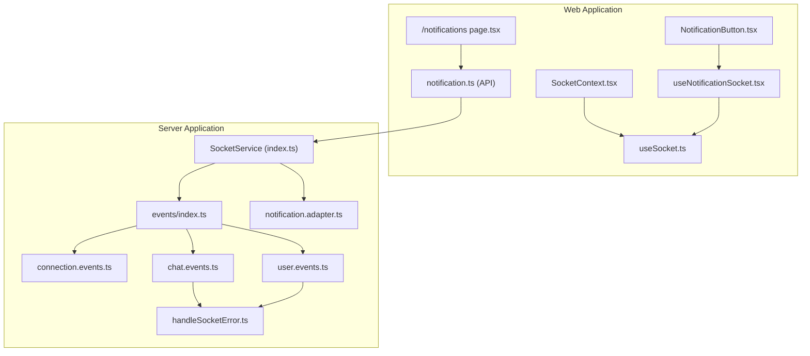
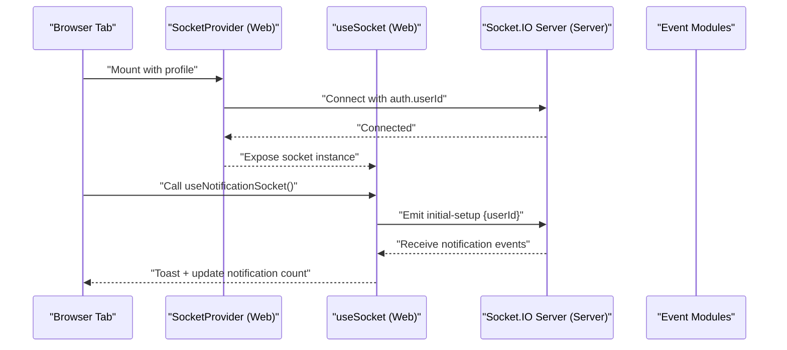
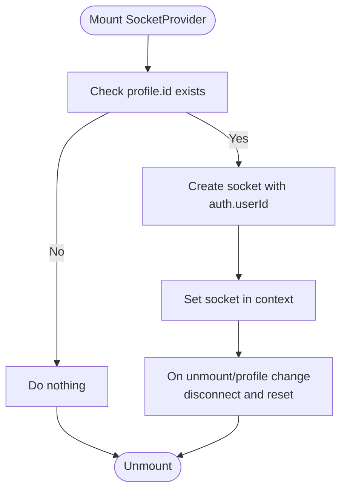
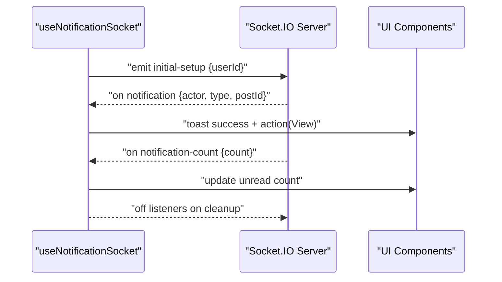
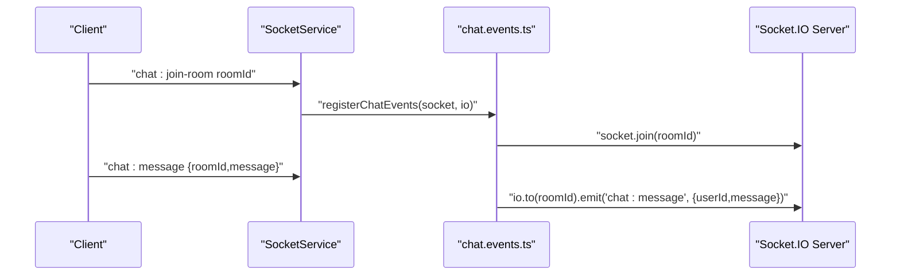
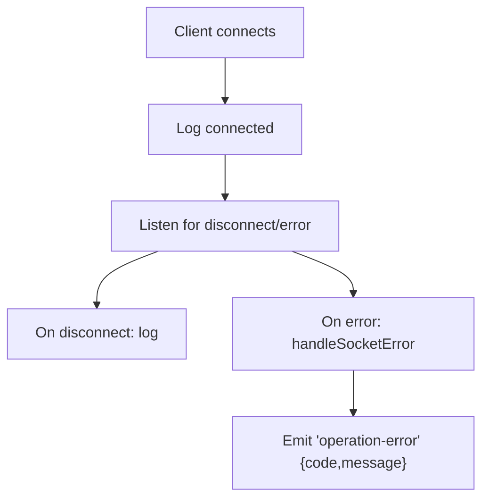

# Real-Time Communication

<cite>
**Referenced Files in This Document**
- [web/src/socket/SocketContext.tsx](file://web/src/socket/SocketContext.tsx)
- [web/src/socket/useSocket.ts](file://web/src/socket/useSocket.ts)
- [web/src/hooks/useNotificationSocket.tsx](file://web/src/hooks/useNotificationSocket.tsx)
- [web/src/components/general/NotificationButton.tsx](file://web/src/components/general/NotificationButton.tsx)
- [web/src/services/api/notification.ts](file://web/src/services/api/notification.ts)
- [web/src/app/(root)/(app)/notifications/page.tsx](file://web/src/app/(root)/(app)/notifications/page.tsx)
- [server/src/infra/services/socket/index.ts](file://server/src/infra/services/socket/index.ts)
- [server/src/infra/services/socket/events/index.ts](file://server/src/infra/services/socket/events/index.ts)
- [server/src/infra/services/socket/events/connection.events.ts](file://server/src/infra/services/socket/events/connection.events.ts)
- [server/src/infra/services/socket/events/chat.events.ts](file://server/src/infra/services/socket/events/chat.events.ts)
- [server/src/infra/services/socket/events/user.events.ts](file://server/src/infra/services/socket/events/user.events.ts)
- [server/src/infra/services/socket/errors/handleSocketError.ts](file://server/src/infra/services/socket/errors/handleSocketError.ts)
- [server/src/infra/db/adapters/notification.adapter.ts](file://server/src/infra/db/adapters/notification.adapter.ts)
</cite>

## Table of Contents
1. [Introduction](#introduction)
2. [Project Structure](#project-structure)
3. [Core Components](#core-components)
4. [Architecture Overview](#architecture-overview)
5. [Detailed Component Analysis](#detailed-component-analysis)
6. [Dependency Analysis](#dependency-analysis)
7. [Performance Considerations](#performance-considerations)
8. [Troubleshooting Guide](#troubleshooting-guide)
9. [Conclusion](#conclusion)

## Introduction
This document explains the real-time communication system built with Socket.IO in the web application. It covers socket connection management, event handling, message broadcasting, the notification system, live updates, connection state management, the socket context provider, custom hooks, and error handling strategies. It also documents integration with the backend socket server and outlines performance considerations.

## Project Structure
The real-time system spans two applications:
- Web application (Next.js): socket provider, custom hook, notification integration, and UI components.
- Server application (Node.js + Socket.IO): socket service initialization, event modules, and error handling.



**Diagram sources**
- [web/src/socket/SocketContext.tsx](file://web/src/socket/SocketContext.tsx#L1-L45)
- [web/src/socket/useSocket.ts](file://web/src/socket/useSocket.ts#L1-L9)
- [web/src/hooks/useNotificationSocket.tsx](file://web/src/hooks/useNotificationSocket.tsx#L1-L54)
- [web/src/components/general/NotificationButton.tsx](file://web/src/components/general/NotificationButton.tsx#L1-L20)
- [web/src/services/api/notification.ts](file://web/src/services/api/notification.ts#L1-L10)
- [web/src/app/(root)/(app)/notifications/page.tsx](file://web/src/app/(root)/(app)/notifications/page.tsx#L31-L82)
- [server/src/infra/services/socket/index.ts](file://server/src/infra/services/socket/index.ts#L1-L47)
- [server/src/infra/services/socket/events/index.ts](file://server/src/infra/services/socket/events/index.ts#L1-L9)
- [server/src/infra/services/socket/events/connection.events.ts](file://server/src/infra/services/socket/events/connection.events.ts#L1-L20)
- [server/src/infra/services/socket/events/chat.events.ts](file://server/src/infra/services/socket/events/chat.events.ts#L1-L27)
- [server/src/infra/services/socket/events/user.events.ts](file://server/src/infra/services/socket/events/user.events.ts#L1-L10)
- [server/src/infra/services/socket/errors/handleSocketError.ts](file://server/src/infra/services/socket/errors/handleSocketError.ts#L1-L22)
- [server/src/infra/db/adapters/notification.adapter.ts](file://server/src/infra/db/adapters/notification.adapter.ts#L1-L83)

**Section sources**
- [web/src/socket/SocketContext.tsx](file://web/src/socket/SocketContext.tsx#L1-L45)
- [server/src/infra/services/socket/index.ts](file://server/src/infra/services/socket/index.ts#L1-L47)

## Core Components
- Socket Provider and Hook (Web):
  - Socket provider initializes a single persistent WebSocket connection per session and exposes it via context.
  - Custom hook retrieves the socket instance safely.
- Notification Integration (Web):
  - A dedicated hook sets up initial user binding, listens for live notifications and counts, and triggers UI updates.
- Socket Service and Event Modules (Server):
  - Centralized Socket.IO server initialization with CORS and transport configuration.
  - Event modules for connection lifecycle, chat room messaging, and typing indicators.
  - Global error handler emits structured errors to clients.

Key responsibilities:
- Connection lifecycle: connect/disconnect/error handling.
- Broadcasting: room-based broadcasts for chat and typing events.
- Live updates: notification delivery and counters.
- Error handling: consistent error emission to clients.

**Section sources**
- [web/src/socket/SocketContext.tsx](file://web/src/socket/SocketContext.tsx#L16-L42)
- [web/src/socket/useSocket.ts](file://web/src/socket/useSocket.ts#L4-L6)
- [web/src/hooks/useNotificationSocket.tsx](file://web/src/hooks/useNotificationSocket.tsx#L9-L53)
- [server/src/infra/services/socket/index.ts](file://server/src/infra/services/socket/index.ts#L10-L32)
- [server/src/infra/services/socket/events/connection.events.ts](file://server/src/infra/services/socket/events/connection.events.ts#L4-L18)
- [server/src/infra/services/socket/events/chat.events.ts](file://server/src/infra/services/socket/events/chat.events.ts#L4-L24)
- [server/src/infra/services/socket/events/user.events.ts](file://server/src/infra/services/socket/events/user.events.ts#L3-L7)
- [server/src/infra/services/socket/errors/handleSocketError.ts](file://server/src/infra/services/socket/errors/handleSocketError.ts#L3-L22)

## Architecture Overview
The system uses a single persistent WebSocket connection per browser tab/session. The server exposes event modules that define how incoming messages are processed and broadcasted. Clients listen for live events and update UI state accordingly.



**Diagram sources**
- [web/src/socket/SocketContext.tsx](file://web/src/socket/SocketContext.tsx#L20-L37)
- [web/src/hooks/useNotificationSocket.tsx](file://web/src/hooks/useNotificationSocket.tsx#L14-L50)
- [server/src/infra/services/socket/index.ts](file://server/src/infra/services/socket/index.ts#L10-L24)
- [server/src/infra/services/socket/events/connection.events.ts](file://server/src/infra/services/socket/events/connection.events.ts#L4-L18)

## Detailed Component Analysis

### Socket Context Provider (Web)
- Initializes a single Socket.IO client with WebSocket transport.
- Authenticates the client using the current user’s ID from the profile store.
- Disconnects and cleans up on unmount or when the user ID changes.
- Exposes the socket instance to descendant components via context.



**Diagram sources**
- [web/src/socket/SocketContext.tsx](file://web/src/socket/SocketContext.tsx#L16-L42)

**Section sources**
- [web/src/socket/SocketContext.tsx](file://web/src/socket/SocketContext.tsx#L16-L42)

### Custom Socket Hook (Web)
- Provides a safe way to access the socket instance from any component.
- Returns null when no socket is available, enabling defensive rendering.

**Section sources**
- [web/src/socket/useSocket.ts](file://web/src/socket/useSocket.ts#L4-L6)

### Notification Integration (Web)
- Emits an initial setup event with the authenticated user ID.
- Listens for live notification and notification count events.
- Displays toast notifications with a “View” action that navigates to the related post.
- Maintains a local notification count and cleans up listeners on unmount.



**Diagram sources**
- [web/src/hooks/useNotificationSocket.tsx](file://web/src/hooks/useNotificationSocket.tsx#L14-L50)
- [web/src/components/general/NotificationButton.tsx](file://web/src/components/general/NotificationButton.tsx#L5-L18)

**Section sources**
- [web/src/hooks/useNotificationSocket.tsx](file://web/src/hooks/useNotificationSocket.tsx#L9-L53)
- [web/src/components/general/NotificationButton.tsx](file://web/src/components/general/NotificationButton.tsx#L5-L18)

### Chat and Typing Events (Server)
- Chat message event:
  - Validates payload and broadcasts to a specific room.
  - Emits structured operation errors on exceptions.
- Join room event:
  - Joins the socket to a room for targeted broadcasting.
- Typing indicator event:
  - Broadcasts typing status to other users in the same room.



**Diagram sources**
- [server/src/infra/services/socket/events/chat.events.ts](file://server/src/infra/services/socket/events/chat.events.ts#L4-L24)
- [server/src/infra/services/socket/index.ts](file://server/src/infra/services/socket/index.ts#L26-L32)

**Section sources**
- [server/src/infra/services/socket/events/chat.events.ts](file://server/src/infra/services/socket/events/chat.events.ts#L4-L24)
- [server/src/infra/services/socket/events/user.events.ts](file://server/src/infra/services/socket/events/user.events.ts#L3-L7)

### Connection Lifecycle and Error Handling (Server)
- Logs connection and disconnection events.
- Emits structured error events to clients with a code and message.
- Ensures graceful handling of runtime exceptions during event processing.



**Diagram sources**
- [server/src/infra/services/socket/events/connection.events.ts](file://server/src/infra/services/socket/events/connection.events.ts#L4-L18)
- [server/src/infra/services/socket/errors/handleSocketError.ts](file://server/src/infra/services/socket/errors/handleSocketError.ts#L3-L22)

**Section sources**
- [server/src/infra/services/socket/events/connection.events.ts](file://server/src/infra/services/socket/events/connection.events.ts#L4-L18)
- [server/src/infra/services/socket/errors/handleSocketError.ts](file://server/src/infra/services/socket/errors/handleSocketError.ts#L3-L22)

### Notification Persistence (Server)
- Provides database adapters for fetching latest notifications and marking them as seen.
- Supports joining notification records with post metadata for richer UI displays.

**Section sources**
- [server/src/infra/db/adapters/notification.adapter.ts](file://server/src/infra/db/adapters/notification.adapter.ts#L18-L83)

## Dependency Analysis
- Web-side:
  - Socket provider depends on the profile store for authentication context.
  - Notification hook depends on the socket hook and UI navigation.
  - Notification UI depends on the notification count from the hook.
- Server-side:
  - Socket service depends on event modules and exports a singleton server instance.
  - Event modules depend on the global error handler for consistent error emission.

```mermaid
graph LR
subgraph "Web"
SP["SocketProvider"] --> SH["useSocket"]
NS["useNotificationSocket"] --> SH
NB["NotificationButton"] --> NS
end
subgraph "Server"
SS["SocketService"] --> EM["Event Modules"]
EM --> ERR["handleSocketError"]
end
SP <- --> SS
NS <- --> SS
```

**Diagram sources**
- [web/src/socket/SocketContext.tsx](file://web/src/socket/SocketContext.tsx#L16-L42)
- [web/src/socket/useSocket.ts](file://web/src/socket/useSocket.ts#L4-L6)
- [web/src/hooks/useNotificationSocket.tsx](file://web/src/hooks/useNotificationSocket.tsx#L9-L53)
- [server/src/infra/services/socket/index.ts](file://server/src/infra/services/socket/index.ts#L10-L32)
- [server/src/infra/services/socket/errors/handleSocketError.ts](file://server/src/infra/services/socket/errors/handleSocketError.ts#L3-L22)

**Section sources**
- [server/src/infra/services/socket/index.ts](file://server/src/infra/services/socket/index.ts#L10-L32)
- [server/src/infra/services/socket/events/index.ts](file://server/src/infra/services/socket/events/index.ts#L1-L9)

## Performance Considerations
- Transport choice: WebSocket is configured for both client and server, minimizing overhead compared to polling.
- Room-based broadcasting: Reduces unnecessary fan-out by targeting rooms instead of emitting to all clients.
- Single connection per tab: Avoids multiple concurrent connections; cleanup on unmount prevents leaks.
- Defensive rendering: Returning null from the socket hook allows components to render gracefully while the socket is unavailable.
- Error containment: Centralized error handling avoids cascading failures and informs clients with structured messages.

[No sources needed since this section provides general guidance]

## Troubleshooting Guide
Common scenarios and remedies:
- Socket not available:
  - Ensure the socket provider wraps the consuming components and that the profile ID is present before connecting.
  - Use the socket hook defensively; avoid assuming a non-null socket.
- No live notifications:
  - Verify the initial setup event is emitted with the correct user ID.
  - Confirm listeners for notification and notification-count events are attached and cleaned up properly.
- Errors on the server:
  - Inspect server logs for connection lifecycle events and error emissions.
  - Review the centralized error handler for emitted operation errors.
- Chat room issues:
  - Ensure clients join the intended room before sending messages.
  - Validate room IDs and payload structure for chat events.

**Section sources**
- [web/src/socket/SocketContext.tsx](file://web/src/socket/SocketContext.tsx#L20-L37)
- [web/src/hooks/useNotificationSocket.tsx](file://web/src/hooks/useNotificationSocket.tsx#L14-L50)
- [server/src/infra/services/socket/events/connection.events.ts](file://server/src/infra/services/socket/events/connection.events.ts#L4-L18)
- [server/src/infra/services/socket/errors/handleSocketError.ts](file://server/src/infra/services/socket/errors/handleSocketError.ts#L3-L22)
- [server/src/infra/services/socket/events/chat.events.ts](file://server/src/infra/services/socket/events/chat.events.ts#L17-L23)

## Conclusion
The real-time communication system leverages a clean separation of concerns: a lightweight socket provider and hook in the web app, and modular event handlers on the server. Room-based broadcasting and a single persistent connection enable efficient live updates for notifications and chat. Centralized error handling ensures robustness, while defensive programming patterns in the UI provide resilience. Together, these components deliver responsive, reliable real-time experiences.