# Routing Structure

<cite>
**Referenced Files in This Document**
- [web/src/app/layout.tsx](file://web/src/app/layout.tsx)
- [web/src/app/(root)/layout.tsx](file://web/src/app/(root)/layout.tsx)
- [web/src/app/(root)/(app)/layout.tsx](file://web/src/app/(root)/(app)/layout.tsx)
- [web/src/app/(root)/(app)/u/layout.tsx](file://web/src/app/(root)/(app)/u/layout.tsx)
- [web/src/app/(root)/auth/layout.tsx](file://web/src/app/(root)/auth/layout.tsx)
- [web/src/app/(root)/(app)/page.tsx](file://web/src/app/(root)/(app)/page.tsx)
- [web/src/app/(root)/(app)/p/[id]/page.tsx](file://web/src/app/(root)/(app)/p/[id]/page.tsx)
- [web/src/app/(root)/(app)/u/profile/page.tsx](file://web/src/app/(root)/(app)/u/profile/page.tsx)
- [web/src/app/(root)/auth/signin/page.tsx](file://web/src/app/(root)/auth/signin/page.tsx)
- [web/src/app/(root)/auth/signup/page.tsx](file://web/src/app/(root)/auth/signup/page.tsx)
- [web/next.config.ts](file://web/next.config.ts)
</cite>

## Table of Contents
1. [Introduction](#introduction)
2. [Project Structure](#project-structure)
3. [Core Components](#core-components)
4. [Architecture Overview](#architecture-overview)
5. [Detailed Component Analysis](#detailed-component-analysis)
6. [Dependency Analysis](#dependency-analysis)
7. [Performance Considerations](#performance-considerations)
8. [Troubleshooting Guide](#troubleshooting-guide)
9. [Conclusion](#conclusion)

## Introduction
This document explains the Next.js App Router structure for the Flick web application. It focuses on the hierarchical routing system, including the root layout, route groups, authentication routes, and social platform routes. It details dynamic routes for posts and profiles, nested layout configurations, authentication flows, protected routes, public routes, and middleware integration. It also describes how route parameters are used and how the app integrates with backend APIs.

## Project Structure
The web application uses Next.js App Router conventions with route groups and nested layouts. The primary routing segments are:
- Root-level app shell and global metadata
- Route group (root) containing:
  - Public app routes under (app): feed, trending, college, bookmarks, onboarding, settings, and nested user routes
  - Authentication routes under auth: sign-in, sign-up, OTP, OAuth callbacks, password recovery, and setup
  - Additional top-level pages: feedback, server booting, and not-found
- Shared layouts per group to encapsulate navigation, authentication guards, and UI scaffolding

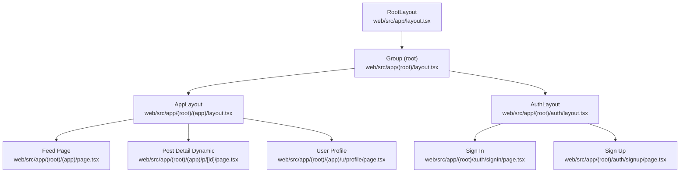

**Diagram sources**
- [web/src/app/layout.tsx](file://web/src/app/layout.tsx#L1-L21)
- [web/src/app/(root)/layout.tsx](file://web/src/app/(root)/layout.tsx#L1-L31)
- [web/src/app/(root)/(app)/layout.tsx](file://web/src/app/(root)/(app)/layout.tsx#L1-L290)
- [web/src/app/(root)/auth/layout.tsx](file://web/src/app/(root)/auth/layout.tsx#L1-L19)
- [web/src/app/(root)/(app)/page.tsx](file://web/src/app/(root)/(app)/page.tsx#L1-L409)
- [web/src/app/(root)/(app)/p/[id]/page.tsx](file://web/src/app/(root)/(app)/p/[id]/page.tsx#L1-L253)
- [web/src/app/(root)/(app)/u/profile/page.tsx](file://web/src/app/(root)/(app)/u/profile/page.tsx#L1-L324)
- [web/src/app/(root)/auth/signin/page.tsx](file://web/src/app/(root)/auth/signin/page.tsx#L1-L293)
- [web/src/app/(root)/auth/signup/page.tsx](file://web/src/app/(root)/auth/signup/page.tsx#L1-L430)

**Section sources**
- [web/src/app/layout.tsx](file://web/src/app/layout.tsx#L1-L21)
- [web/src/app/(root)/layout.tsx](file://web/src/app/(root)/layout.tsx#L1-L31)
- [web/src/app/(root)/(app)/layout.tsx](file://web/src/app/(root)/(app)/layout.tsx#L1-L290)
- [web/src/app/(root)/auth/layout.tsx](file://web/src/app/(root)/auth/layout.tsx#L1-L19)

## Core Components
- RootLayout: Provides global HTML wrapper, fonts, and metadata export.
- Group (root) Layout: Orchestrates server health checks and renders child routes with a themed container and toast provider.
- AppLayout: Implements sidebar navigation, trending section, mobile navigation, and socket provider for real-time updates.
- AuthLayout: Wraps authentication pages with a back link to the home feed.
- Protected App Layout: Enforces authentication for user-centric routes under /u.

Key responsibilities:
- Global metadata and HTML shell
- Health checks and server availability
- Navigation, filtering, and discovery (branches/topics)
- Authentication flows and redirects
- Protected route enforcement

**Section sources**
- [web/src/app/layout.tsx](file://web/src/app/layout.tsx#L1-L21)
- [web/src/app/(root)/layout.tsx](file://web/src/app/(root)/layout.tsx#L1-L31)
- [web/src/app/(root)/(app)/layout.tsx](file://web/src/app/(root)/(app)/layout.tsx#L1-L290)
- [web/src/app/(root)/auth/layout.tsx](file://web/src/app/(root)/auth/layout.tsx#L1-L19)
- [web/src/app/(root)/(app)/u/layout.tsx](file://web/src/app/(root)/(app)/u/layout.tsx#L1-L21)

## Architecture Overview
The routing architecture follows a layered approach:
- Root-level metadata and HTML shell
- Group-level routing boundary for app and auth
- Nested layouts for app and auth
- Dynamic routes for post detail and user profile
- Authentication guard for private user routes

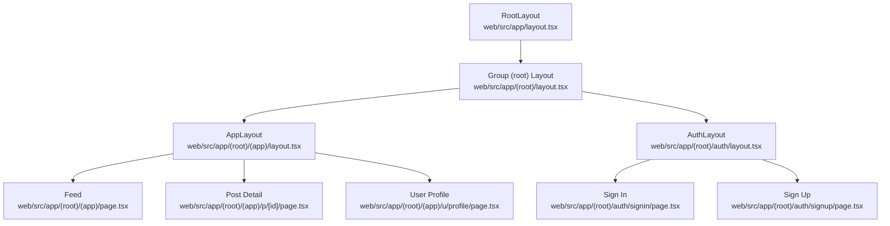

**Diagram sources**
- [web/src/app/layout.tsx](file://web/src/app/layout.tsx#L1-L21)
- [web/src/app/(root)/layout.tsx](file://web/src/app/(root)/layout.tsx#L1-L31)
- [web/src/app/(root)/(app)/layout.tsx](file://web/src/app/(root)/(app)/layout.tsx#L1-L290)
- [web/src/app/(root)/auth/layout.tsx](file://web/src/app/(root)/auth/layout.tsx#L1-L19)
- [web/src/app/(root)/(app)/page.tsx](file://web/src/app/(root)/(app)/page.tsx#L1-L409)
- [web/src/app/(root)/(app)/p/[id]/page.tsx](file://web/src/app/(root)/(app)/p/[id]/page.tsx#L1-L253)
- [web/src/app/(root)/(app)/u/profile/page.tsx](file://web/src/app/(root)/(app)/u/profile/page.tsx#L1-L324)
- [web/src/app/(root)/auth/signin/page.tsx](file://web/src/app/(root)/auth/signin/page.tsx#L1-L293)
- [web/src/app/(root)/auth/signup/page.tsx](file://web/src/app/(root)/auth/signup/page.tsx#L1-L430)

## Detailed Component Analysis

### Root Layout and Metadata
- Provides the HTML document structure, fonts, and global CSS.
- Exports metadata for SEO and social previews.

**Section sources**
- [web/src/app/layout.tsx](file://web/src/app/layout.tsx#L1-L21)

### Group (root) Layout
- Initializes a themed container and toast provider.
- Performs a server health check during development to redirect to a server booting page when the backend is unavailable.

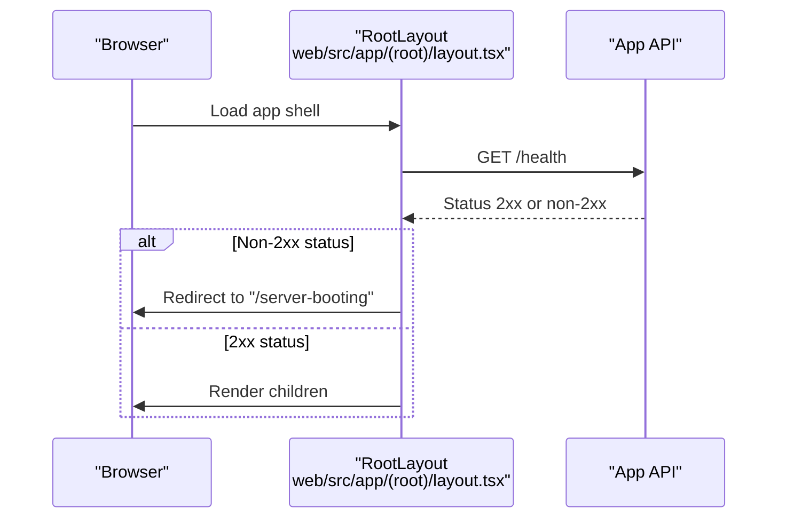

**Diagram sources**
- [web/src/app/(root)/layout.tsx](file://web/src/app/(root)/layout.tsx#L12-L20)

**Section sources**
- [web/src/app/(root)/layout.tsx](file://web/src/app/(root)/layout.tsx#L1-L31)

### AppLayout (Social Platform Routes)
- Implements desktop and mobile navigation, sidebar with branches and topics, trending section, and socket provider.
- Uses URL search params for filtering posts by branch and topic.
- Integrates with profile store and navigation utilities.

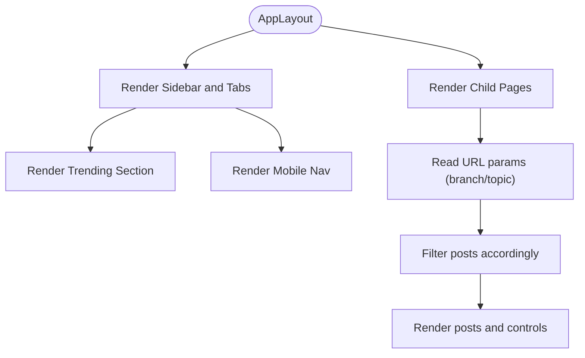

**Diagram sources**
- [web/src/app/(root)/(app)/layout.tsx](file://web/src/app/(root)/(app)/layout.tsx#L23-L55)

**Section sources**
- [web/src/app/(root)/(app)/layout.tsx](file://web/src/app/(root)/(app)/layout.tsx#L1-L290)

### Public Routes (Feed, Trending, College)
- Feed page reads branch and topic from URL search params, fetches posts, and displays a list with search capabilities.
- Trending and college routes are defined under the app group and rendered within AppLayout.

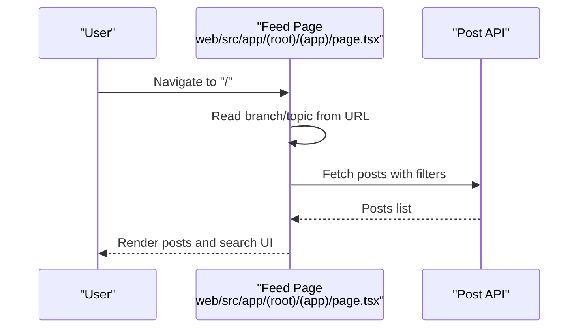

**Diagram sources**
- [web/src/app/(root)/(app)/page.tsx](file://web/src/app/(root)/(app)/page.tsx#L34-L66)

**Section sources**
- [web/src/app/(root)/(app)/page.tsx](file://web/src/app/(root)/(app)/page.tsx#L1-L409)

### Dynamic Routes (Post Detail and Profile)
- Post detail route uses a dynamic segment [id] to load a single post and its comments.
- Profile route under /u/profile is protected and requires authentication.

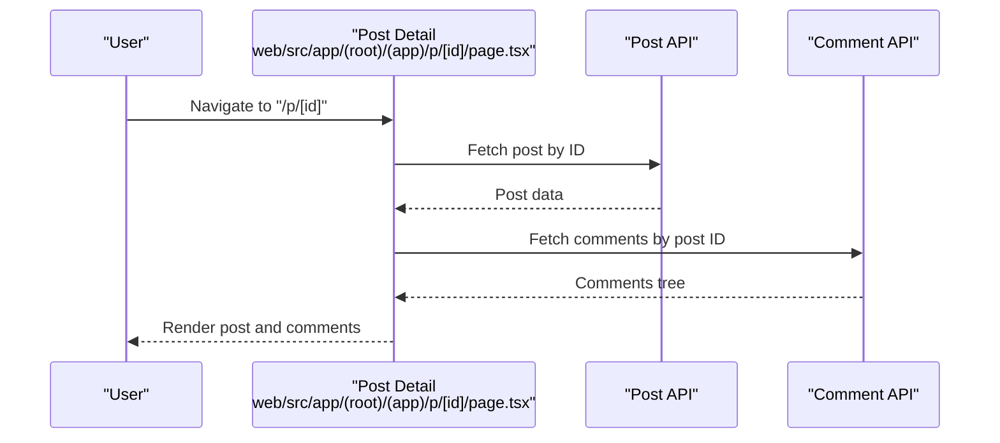

**Diagram sources**
- [web/src/app/(root)/(app)/p/[id]/page.tsx](file://web/src/app/(root)/(app)/p/[id]/page.tsx#L85-L133)

**Section sources**
- [web/src/app/(root)/(app)/p/[id]/page.tsx](file://web/src/app/(root)/(app)/p/[id]/page.tsx#L1-L253)
- [web/src/app/(root)/(app)/u/layout.tsx](file://web/src/app/(root)/(app)/u/layout.tsx#L1-L21)
- [web/src/app/(root)/(app)/u/profile/page.tsx](file://web/src/app/(root)/(app)/u/profile/page.tsx#L1-L324)

### Authentication Routes and Flows
- Sign-in page validates existing sessions, handles OAuth-only accounts, and supports email/password and Google OAuth.
- Sign-up page supports email/password registration, Google OAuth, OCR-based student ID parsing, and college request flow.

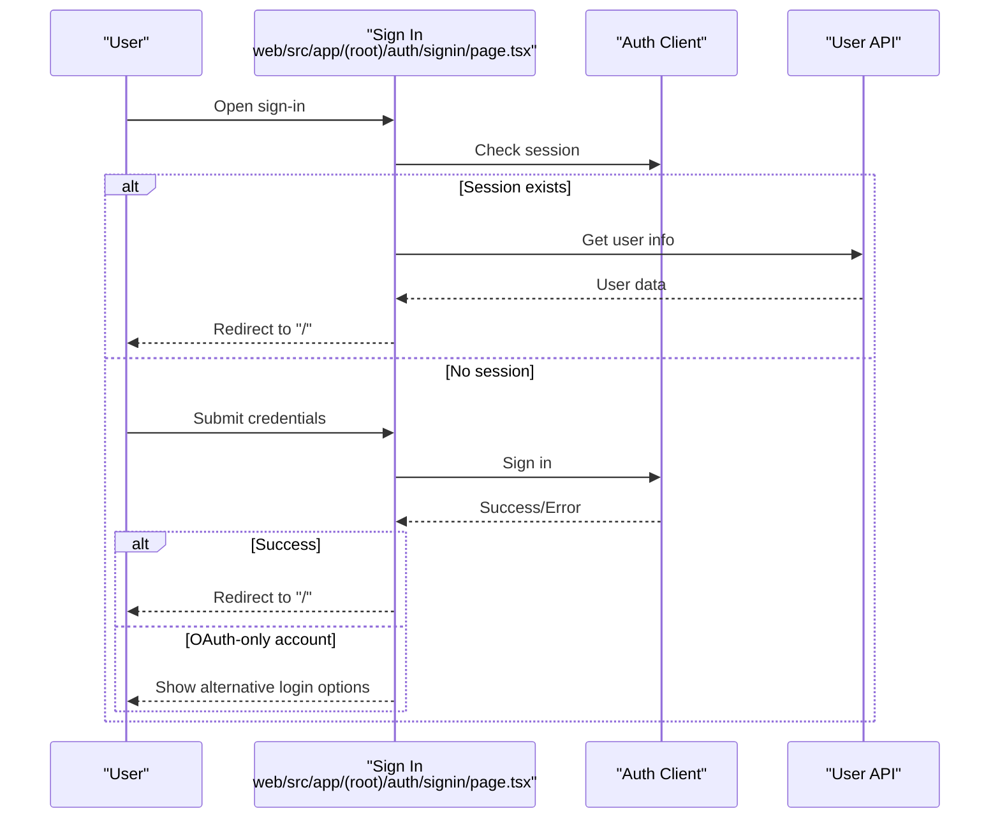

**Diagram sources**
- [web/src/app/(root)/auth/signin/page.tsx](file://web/src/app/(root)/auth/signin/page.tsx#L56-L93)

**Section sources**
- [web/src/app/(root)/auth/signin/page.tsx](file://web/src/app/(root)/auth/signin/page.tsx#L1-L293)
- [web/src/app/(root)/auth/signup/page.tsx](file://web/src/app/(root)/auth/signup/page.tsx#L1-L430)
- [web/src/app/(root)/auth/layout.tsx](file://web/src/app/(root)/auth/layout.tsx#L1-L19)

### Route Groups and Nesting
- Route groups enable logical separation of app and auth routes while sharing a common layout boundary.
- AppLayout wraps social platform pages, while AuthLayout wraps authentication pages.

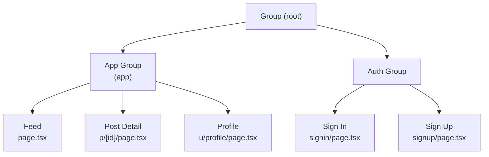

**Diagram sources**
- [web/src/app/(root)/(app)/layout.tsx](file://web/src/app/(root)/(app)/layout.tsx#L1-L290)
- [web/src/app/(root)/auth/layout.tsx](file://web/src/app/(root)/auth/layout.tsx#L1-L19)

**Section sources**
- [web/src/app/(root)/(app)/layout.tsx](file://web/src/app/(root)/(app)/layout.tsx#L1-L290)
- [web/src/app/(root)/auth/layout.tsx](file://web/src/app/(root)/auth/layout.tsx#L1-L19)

### Protected Routes and Authentication Guard
- The user route group (/u) is wrapped by a private layout that enforces authentication. If no profile is present, the user is redirected to the sign-in page.

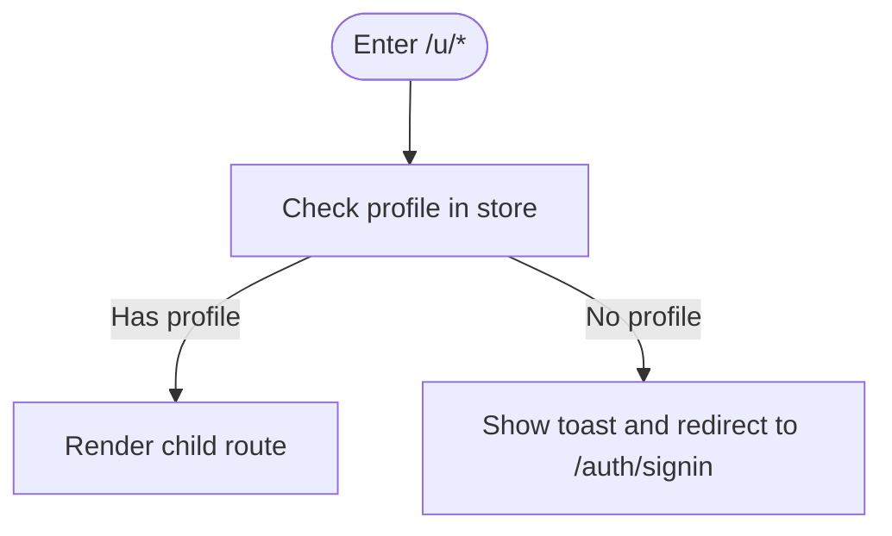

**Diagram sources**
- [web/src/app/(root)/(app)/u/layout.tsx](file://web/src/app/(root)/(app)/u/layout.tsx#L8-L18)

**Section sources**
- [web/src/app/(root)/(app)/u/layout.tsx](file://web/src/app/(root)/(app)/u/layout.tsx#L1-L21)

### Middleware Integration
- The group (root) layout performs a server health check against the backend API and redirects to a server booting page if the backend is unreachable. This acts as a lightweight middleware-like behavior at the route boundary.

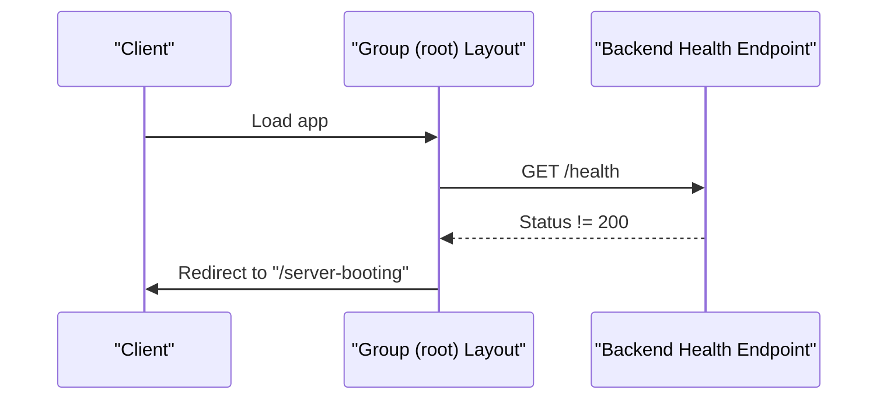

**Diagram sources**
- [web/src/app/(root)/layout.tsx](file://web/src/app/(root)/layout.tsx#L12-L20)

**Section sources**
- [web/src/app/(root)/layout.tsx](file://web/src/app/(root)/layout.tsx#L1-L31)

## Dependency Analysis
- RootLayout depends on metadata exports and global styles.
- Group (root) Layout depends on the app API for health checks.
- AppLayout depends on profile store, socket provider, and navigation utilities.
- Authentication pages depend on the auth client and user API for session validation and navigation.
- Dynamic routes depend on post and comment APIs for data fetching.

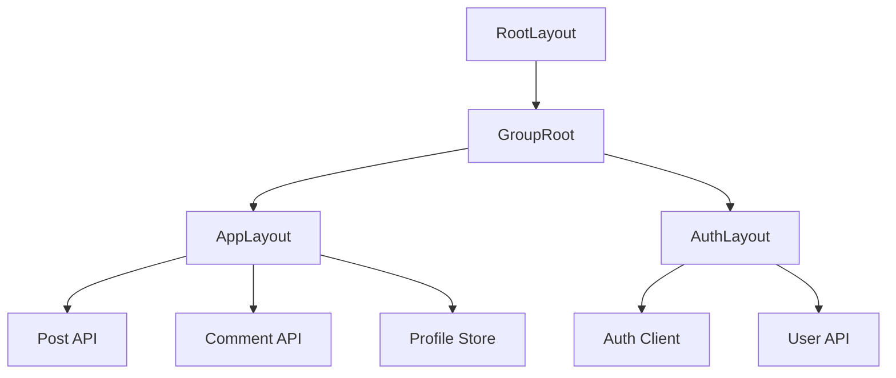

**Diagram sources**
- [web/src/app/layout.tsx](file://web/src/app/layout.tsx#L1-L21)
- [web/src/app/(root)/layout.tsx](file://web/src/app/(root)/layout.tsx#L1-L31)
- [web/src/app/(root)/(app)/layout.tsx](file://web/src/app/(root)/(app)/layout.tsx#L1-L290)
- [web/src/app/(root)/auth/layout.tsx](file://web/src/app/(root)/auth/layout.tsx#L1-L19)

**Section sources**
- [web/src/app/(root)/(app)/layout.tsx](file://web/src/app/(root)/(app)/layout.tsx#L1-L290)
- [web/src/app/(root)/auth/layout.tsx](file://web/src/app/(root)/auth/layout.tsx#L1-L19)

## Performance Considerations
- Use of Suspense in AppLayout ensures smooth loading states for socket provider and child components.
- Client-side navigation and URL search params minimize unnecessary re-renders for feed filtering.
- Conditional rendering and lazy initialization reduce initial payload sizes.

[No sources needed since this section provides general guidance]

## Troubleshooting Guide
- Server health redirection: If the backend is down, the app redirects to a server booting page. Verify backend connectivity and retry.
- Authentication loops: If sign-in redirects to itself, confirm session validity and ensure user API returns expected data.
- Protected route access: If navigating to /u/* fails, ensure the profile store is populated and the user is authenticated.

**Section sources**
- [web/src/app/(root)/layout.tsx](file://web/src/app/(root)/layout.tsx#L12-L20)
- [web/src/app/(root)/auth/signin/page.tsx](file://web/src/app/(root)/auth/signin/page.tsx#L56-L93)
- [web/src/app/(root)/(app)/u/layout.tsx](file://web/src/app/(root)/(app)/u/layout.tsx#L8-L18)

## Conclusion
The Flick web application leverages Next.js App Router with route groups to cleanly separate public and authenticated experiences. The group (root) layout serves as a boundary for health checks and shared UI, while nested layouts implement navigation and protection. Dynamic routes support scalable content consumption, and authentication flows integrate seamlessly with the app’s backend APIs. This structure promotes maintainability, scalability, and a consistent user experience across public and private areas of the platform.