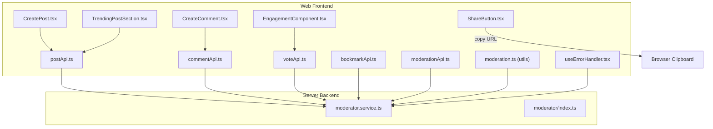
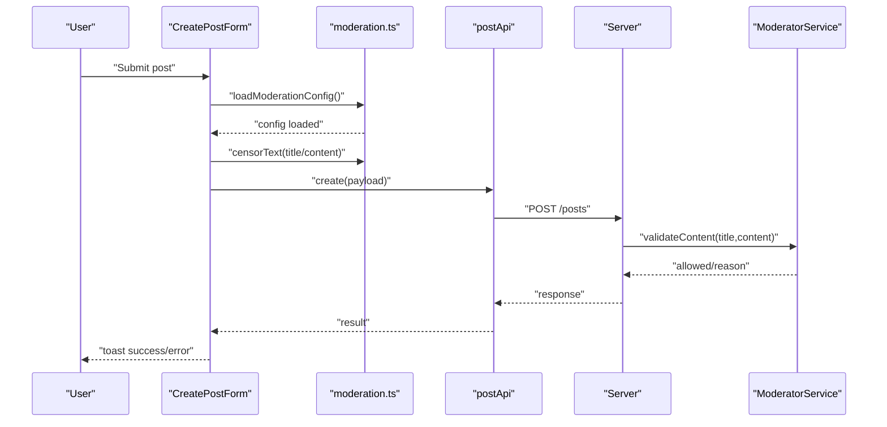
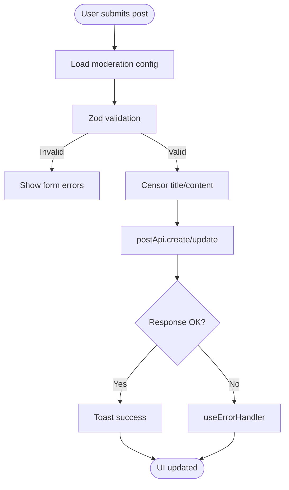
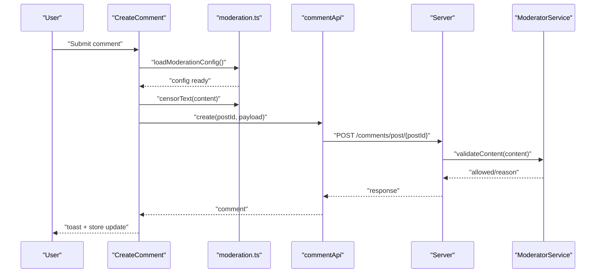
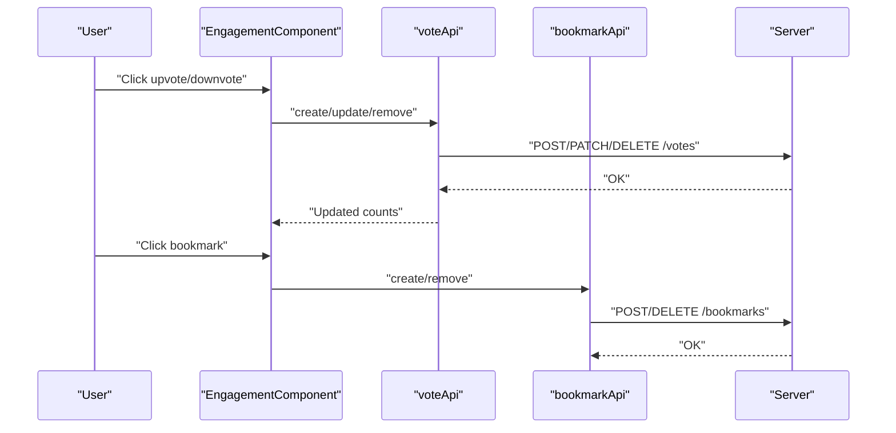
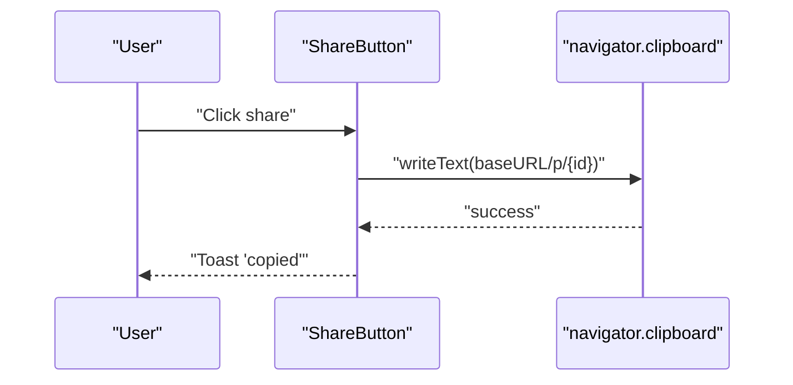
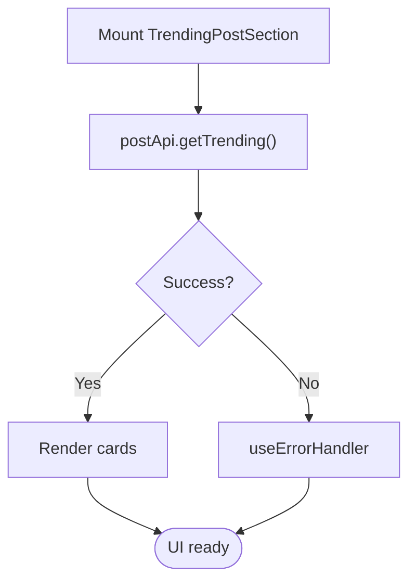
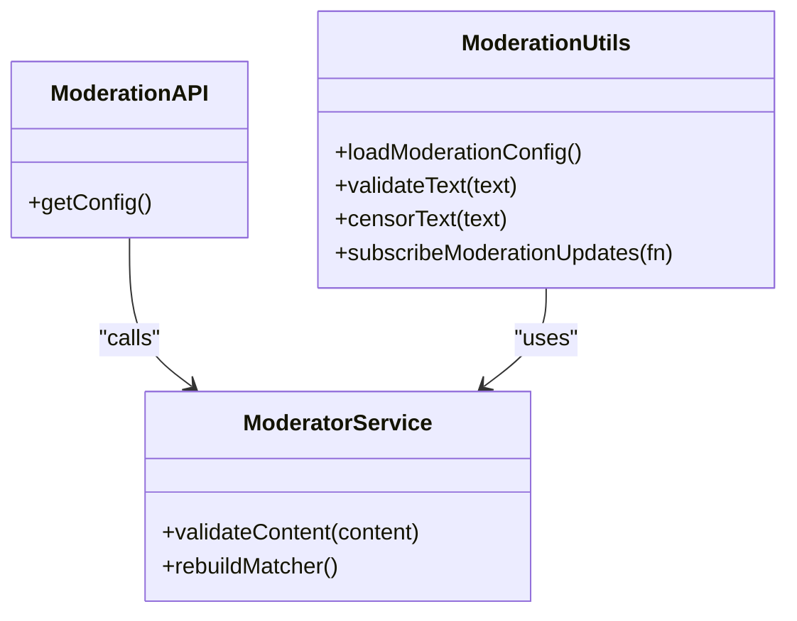
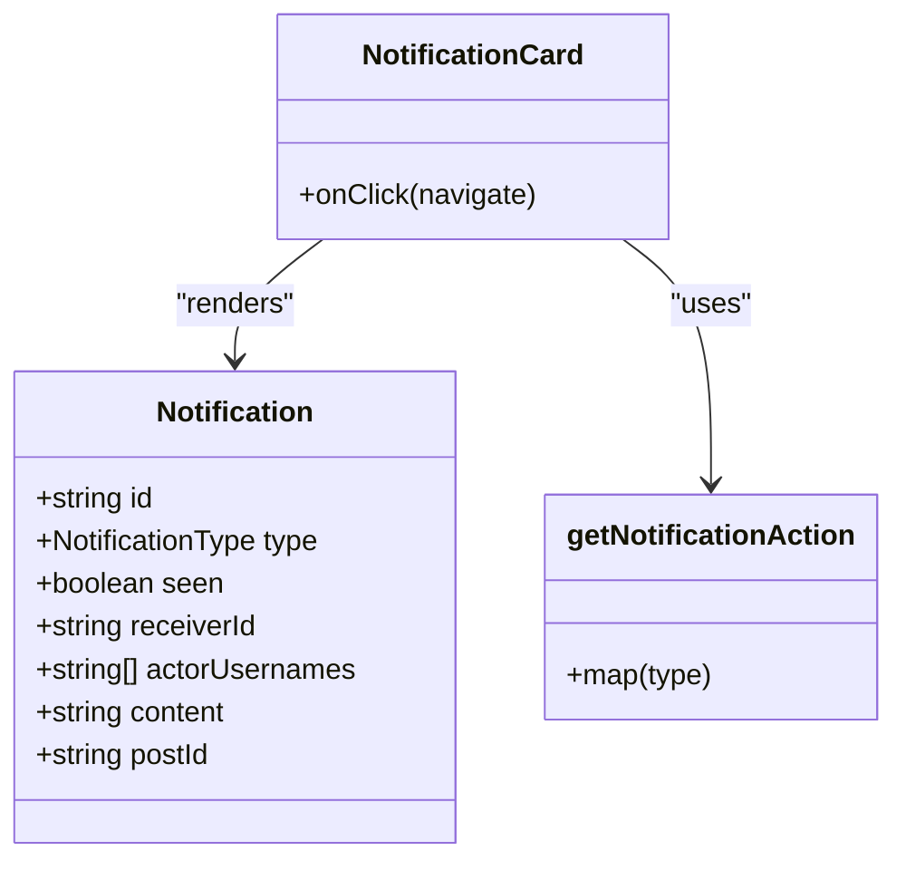
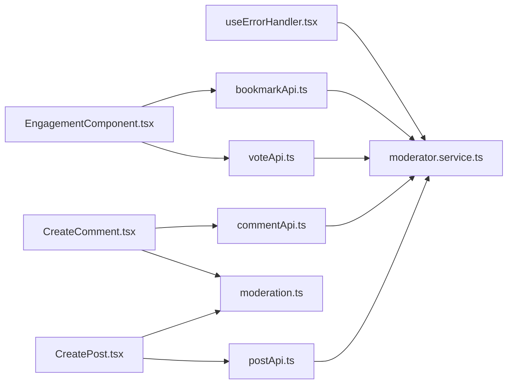

# Social Features

<cite>
**Referenced Files in This Document**
- [web/src/components/general/CreatePost.tsx](file://web/src/components/general/CreatePost.tsx)
- [web/src/components/general/Comment.tsx](file://web/src/components/general/Comment.tsx)
- [web/src/components/general/CreateComment.tsx](file://web/src/components/general/CreateComment.tsx)
- [web/src/components/general/EngagementComponent.tsx](file://web/src/components/general/EngagementComponent.tsx)
- [web/src/components/actions/ShareButton.tsx](file://web/src/components/actions/ShareButton.tsx)
- [web/src/components/general/TrendingPostSection.tsx](file://web/src/components/general/TrendingPostSection.tsx)
- [web/src/services/api/post.ts](file://web/src/services/api/post.ts)
- [web/src/services/api/comment.ts](file://web/src/services/api/comment.ts)
- [web/src/services/api/vote.ts](file://web/src/services/api/vote.ts)
- [web/src/services/api/bookmark.ts](file://web/src/services/api/bookmark.ts)
- [web/src/services/api/moderation.ts](file://web/src/services/api/moderation.ts)
- [web/src/utils/moderation.ts](file://web/src/utils/moderation.ts)
- [web/src/hooks/useErrorHandler.tsx](file://web/src/hooks/useErrorHandler.tsx)
- [web/src/types/Notification.ts](file://web/src/types/Notification.ts)
- [web/src/utils/getNotificationAction.ts](file://web/src/utils/getNotificationAction.ts)
- [web/src/components/general/NotificationCard.tsx](file://web/src/components/general/NotificationCard.tsx)
- [server/src/infra/services/moderator/moderator.service.ts](file://server/src/infra/services/moderator/moderator.service.ts)
- [server/src/infra/services/moderator/index.ts](file://server/src/infra/services/moderator/index.ts)
</cite>

## Table of Contents
1. [Introduction](#introduction)
2. [Project Structure](#project-structure)
3. [Core Components](#core-components)
4. [Architecture Overview](#architecture-overview)
5. [Detailed Component Analysis](#detailed-component-analysis)
6. [Dependency Analysis](#dependency-analysis)
7. [Performance Considerations](#performance-considerations)
8. [Troubleshooting Guide](#troubleshooting-guide)
9. [Conclusion](#conclusion)

## Introduction
This document explains the social features implementation in the web application, focusing on:
- Post creation and moderation integration
- Comment system and nested replies
- Voting mechanism and bookmarks
- Engagement components and sharing
- Trending content display
- Backend integration, real-time updates, and performance optimizations

The goal is to help developers and product teams understand how user interactions are composed, how data flows across frontend and backend, and how moderation and notifications are integrated.

## Project Structure
The social features span the web frontend and the server backend:
- Frontend (Next.js):
  - UI components for posts, comments, engagement, sharing, trending
  - Services for API communication (posts, comments, votes, bookmarks, moderation)
  - Utilities for moderation and error handling
- Backend (Node.js):
  - Moderation service implementing dynamic word matching, spam detection, and policy checks
  - REST endpoints for posts, comments, votes, bookmarks, and moderation config

**Diagram sources**
- [web/src/components/general/CreatePost.tsx](file://web/src/components/general/CreatePost.tsx#L1-L409)
- [web/src/components/general/CreateComment.tsx](file://web/src/components/general/CreateComment.tsx#L1-L310)
- [web/src/components/general/EngagementComponent.tsx](file://web/src/components/general/EngagementComponent.tsx#L1-L120)
- [web/src/components/actions/ShareButton.tsx](file://web/src/components/actions/ShareButton.tsx#L1-L36)
- [web/src/components/general/TrendingPostSection.tsx](file://web/src/components/general/TrendingPostSection.tsx#L1-L113)
- [web/src/services/api/post.ts](file://web/src/services/api/post.ts#L1-L68)
- [web/src/services/api/comment.ts](file://web/src/services/api/comment.ts#L1-L24)
- [web/src/services/api/vote.ts](file://web/src/services/api/vote.ts#L1-L27)
- [web/src/services/api/bookmark.ts](file://web/src/services/api/bookmark.ts#L1-L14)
- [web/src/services/api/moderation.ts](file://web/src/services/api/moderation.ts#L1-L8)
- [web/src/utils/moderation.ts](file://web/src/utils/moderation.ts#L461-L511)
- [web/src/hooks/useErrorHandler.tsx](file://web/src/hooks/useErrorHandler.tsx#L46-L72)
- [server/src/infra/services/moderator/moderator.service.ts](file://server/src/infra/services/moderator/moderator.service.ts#L1-L486)
- [server/src/infra/services/moderator/index.ts](file://server/src/infra/services/moderator/index.ts#L1-L5)

**Section sources**
- [web/src/components/general/CreatePost.tsx](file://web/src/components/general/CreatePost.tsx#L1-L409)
- [web/src/components/general/CreateComment.tsx](file://web/src/components/general/CreateComment.tsx#L1-L310)
- [web/src/components/general/EngagementComponent.tsx](file://web/src/components/general/EngagementComponent.tsx#L1-L120)
- [web/src/components/actions/ShareButton.tsx](file://web/src/components/actions/ShareButton.tsx#L1-L36)
- [web/src/components/general/TrendingPostSection.tsx](file://web/src/components/general/TrendingPostSection.tsx#L1-L113)
- [web/src/services/api/post.ts](file://web/src/services/api/post.ts#L1-L68)
- [web/src/services/api/comment.ts](file://web/src/services/api/comment.ts#L1-L24)
- [web/src/services/api/vote.ts](file://web/src/services/api/vote.ts#L1-L27)
- [web/src/services/api/bookmark.ts](file://web/src/services/api/bookmark.ts#L1-L14)
- [web/src/services/api/moderation.ts](file://web/src/services/api/moderation.ts#L1-L8)
- [web/src/utils/moderation.ts](file://web/src/utils/moderation.ts#L461-L511)
- [web/src/hooks/useErrorHandler.tsx](file://web/src/hooks/useErrorHandler.tsx#L46-L72)
- [server/src/infra/services/moderator/moderator.service.ts](file://server/src/infra/services/moderator/moderator.service.ts#L1-L486)
- [server/src/infra/services/moderator/index.ts](file://server/src/infra/services/moderator/index.ts#L1-L5)

## Core Components
- Post creation and moderation:
  - CreatePost and CreatePostForm validate input, integrate moderation preview, and submit via postApi.
  - Moderation utilities load and apply censorship and warnings before submission.
- Comments and nested replies:
  - CreateComment handles creation/update with moderation checks and stores in commentStore.
  - Comment renders nested replies with expand/collapse behavior and engagement metrics.
- Voting and bookmarks:
  - EngagementComponent orchestrates optimistic vote counts and delegates to voteApi.
  - Bookmark toggling uses bookmarkApi and updates local state.
- Sharing:
  - ShareButton copies a canonical post link to clipboard and notifies the user.
- Trending:
  - TrendingPostSection fetches top posts by views and renders cards with skeleton loaders.
- Notifications:
  - NotificationCard displays actionable events; getNotificationAction maps types to human-readable actions.

**Section sources**
- [web/src/components/general/CreatePost.tsx](file://web/src/components/general/CreatePost.tsx#L104-L220)
- [web/src/components/general/CreateComment.tsx](file://web/src/components/general/CreateComment.tsx#L107-L165)
- [web/src/components/general/Comment.tsx](file://web/src/components/general/Comment.tsx#L20-L156)
- [web/src/components/general/EngagementComponent.tsx](file://web/src/components/general/EngagementComponent.tsx#L33-L120)
- [web/src/components/actions/ShareButton.tsx](file://web/src/components/actions/ShareButton.tsx#L7-L36)
- [web/src/components/general/TrendingPostSection.tsx](file://web/src/components/general/TrendingPostSection.tsx#L12-L86)
- [web/src/types/Notification.ts](file://web/src/types/Notification.ts#L1-L21)
- [web/src/utils/getNotificationAction.ts](file://web/src/utils/getNotificationAction.ts#L1-L18)

## Architecture Overview
The frontend composes UI components that call service APIs. Moderation is enforced client-side via utils and server-side via the moderator service. Real-time updates are supported through sockets and notification systems.

**Diagram sources**
- [web/src/components/general/CreatePost.tsx](file://web/src/components/general/CreatePost.tsx#L163-L219)
- [web/src/utils/moderation.ts](file://web/src/utils/moderation.ts#L461-L511)
- [web/src/services/api/post.ts](file://web/src/services/api/post.ts#L29-L38)
- [server/src/infra/services/moderator/moderator.service.ts](file://server/src/infra/services/moderator/moderator.service.ts#L464-L486)

## Detailed Component Analysis

### Post Creation System
- Validation and UX:
  - Zod schema enforces length constraints for title and content.
  - Real-time moderation warnings preview censored text and reasons.
- Submission flow:
  - Loads moderation config, censors inputs, and calls postApi.create or postApi.update.
  - Handles Terms Not Accepted errors by prompting TermsForm.
- Optimistic updates:
  - On success, addPost/updatePost updates the UI immediately.

**Diagram sources**
- [web/src/components/general/CreatePost.tsx](file://web/src/components/general/CreatePost.tsx#L163-L219)
- [web/src/utils/moderation.ts](file://web/src/utils/moderation.ts#L461-L511)

**Section sources**
- [web/src/components/general/CreatePost.tsx](file://web/src/components/general/CreatePost.tsx#L104-L220)
- [web/src/services/api/post.ts](file://web/src/services/api/post.ts#L29-L51)
- [web/src/utils/moderation.ts](file://web/src/utils/moderation.ts#L461-L511)

### Comment System and Nested Replies
- Creation and editing:
  - CreateComment validates content, applies moderation, and calls commentApi.create or commentApi.update.
  - Supports parentCommentId for threaded replies.
- Rendering:
  - Comment displays author info, content, and nested children with expand/collapse controls.
  - Integrates EngagementComponent for upvotes/downvotes/comments.
- Store integration:
  - Uses commentStore to add or update comments after successful API calls.

**Diagram sources**
- [web/src/components/general/CreateComment.tsx](file://web/src/components/general/CreateComment.tsx#L107-L165)
- [web/src/services/api/comment.ts](file://web/src/services/api/comment.ts#L7-L14)
- [server/src/infra/services/moderator/moderator.service.ts](file://server/src/infra/services/moderator/moderator.service.ts#L464-L486)

**Section sources**
- [web/src/components/general/CreateComment.tsx](file://web/src/components/general/CreateComment.tsx#L107-L165)
- [web/src/components/general/Comment.tsx](file://web/src/components/general/Comment.tsx#L20-L156)
- [web/src/services/api/comment.ts](file://web/src/services/api/comment.ts#L1-L24)

### Voting Mechanism and Bookmarks
- Voting:
  - EngagementComponent tracks optimistic counts and delegates to voteApi.create/update/remove.
  - Supports upvotes/downvotes for posts and comments.
- Bookmarks:
  - Uses bookmarkApi.listMine, bookmarkApi.create, and bookmarkApi.remove.
  - Integrates with PostDropdown for per-item actions.

**Diagram sources**
- [web/src/components/general/EngagementComponent.tsx](file://web/src/components/general/EngagementComponent.tsx#L33-L120)
- [web/src/services/api/vote.ts](file://web/src/services/api/vote.ts#L6-L26)
- [web/src/services/api/bookmark.ts](file://web/src/services/api/bookmark.ts#L3-L13)

**Section sources**
- [web/src/components/general/EngagementComponent.tsx](file://web/src/components/general/EngagementComponent.tsx#L33-L120)
- [web/src/services/api/vote.ts](file://web/src/services/api/vote.ts#L1-L27)
- [web/src/services/api/bookmark.ts](file://web/src/services/api/bookmark.ts#L1-L14)

### Sharing Functionality
- ShareButton copies a canonical post URL to the clipboard and shows a success toast.
- Disables the button temporarily to prevent repeated actions.

**Diagram sources**
- [web/src/components/actions/ShareButton.tsx](file://web/src/components/actions/ShareButton.tsx#L10-L18)

**Section sources**
- [web/src/components/actions/ShareButton.tsx](file://web/src/components/actions/ShareButton.tsx#L1-L36)

### Trending Content Display
- TrendingPostSection fetches top posts sorted by views and renders cards.
- Uses skeleton loaders while loading and handles empty states.

**Diagram sources**
- [web/src/components/general/TrendingPostSection.tsx](file://web/src/components/general/TrendingPostSection.tsx#L18-L44)
- [web/src/services/api/post.ts](file://web/src/services/api/post.ts#L55-L63)

**Section sources**
- [web/src/components/general/TrendingPostSection.tsx](file://web/src/components/general/TrendingPostSection.tsx#L12-L86)
- [web/src/services/api/post.ts](file://web/src/services/api/post.ts#L55-L63)

### Content Moderation Integration
- Client-side:
  - moderationApi.getConfig loads server-side moderation configuration.
  - moderation.ts compiles matchers, subscribes to updates, and provides validateText and censorText.
  - useErrorHandler maps moderation violations to user-friendly messages.
- Server-side:
  - moderator.service.ts performs dynamic word matching, spam detection, and policy checks.
  - Returns allowed flag and violation metadata for enforcement.

**Diagram sources**
- [web/src/services/api/moderation.ts](file://web/src/services/api/moderation.ts#L3-L7)
- [web/src/utils/moderation.ts](file://web/src/utils/moderation.ts#L461-L511)
- [server/src/infra/services/moderator/moderator.service.ts](file://server/src/infra/services/moderator/moderator.service.ts#L464-L486)

**Section sources**
- [web/src/services/api/moderation.ts](file://web/src/services/api/moderation.ts#L1-L8)
- [web/src/utils/moderation.ts](file://web/src/utils/moderation.ts#L461-L511)
- [web/src/hooks/useErrorHandler.tsx](file://web/src/hooks/useErrorHandler.tsx#L46-L72)
- [server/src/infra/services/moderator/moderator.service.ts](file://server/src/infra/services/moderator/moderator.service.ts#L1-L486)

### Notifications and Engagement Signals
- Notification types and rendering:
  - NotificationCard displays actionable events mapped by getNotificationAction.
  - Notification type enumeration covers general, upvoted_post, upvoted_comment, replied, posted.
- Engagement signals:
  - EngagementComponent supports upvotes, downvotes, comments, and views for posts and comments.

**Diagram sources**
- [web/src/types/Notification.ts](file://web/src/types/Notification.ts#L1-L21)
- [web/src/utils/getNotificationAction.ts](file://web/src/utils/getNotificationAction.ts#L1-L18)
- [web/src/components/general/NotificationCard.tsx](file://web/src/components/general/NotificationCard.tsx#L1-L42)

**Section sources**
- [web/src/types/Notification.ts](file://web/src/types/Notification.ts#L1-L21)
- [web/src/utils/getNotificationAction.ts](file://web/src/utils/getNotificationAction.ts#L1-L18)
- [web/src/components/general/NotificationCard.tsx](file://web/src/components/general/NotificationCard.tsx#L1-L42)
- [web/src/components/general/EngagementComponent.tsx](file://web/src/components/general/EngagementComponent.tsx#L14-L31)

## Dependency Analysis
- Frontend-to-backend:
  - postApi, commentApi, voteApi, bookmarkApi, moderationApi call server endpoints.
  - Server-side moderator service encapsulates all moderation logic.
- Frontend-to-frontend:
  - EngagementComponent coordinates optimistic UI updates for votes and bookmarks.
  - CreatePost and CreateComment rely on moderation utilities for UX feedback.
- Error handling:
  - useErrorHandler centralizes mapping of moderation and other backend errors to user-facing messages.

**Diagram sources**
- [web/src/components/general/CreatePost.tsx](file://web/src/components/general/CreatePost.tsx#L163-L219)
- [web/src/components/general/CreateComment.tsx](file://web/src/components/general/CreateComment.tsx#L107-L165)
- [web/src/components/general/EngagementComponent.tsx](file://web/src/components/general/EngagementComponent.tsx#L33-L120)
- [web/src/services/api/post.ts](file://web/src/services/api/post.ts#L1-L68)
- [web/src/services/api/comment.ts](file://web/src/services/api/comment.ts#L1-L24)
- [web/src/services/api/vote.ts](file://web/src/services/api/vote.ts#L1-L27)
- [web/src/services/api/bookmark.ts](file://web/src/services/api/bookmark.ts#L1-L14)
- [web/src/utils/moderation.ts](file://web/src/utils/moderation.ts#L461-L511)
- [server/src/infra/services/moderator/moderator.service.ts](file://server/src/infra/services/moderator/moderator.service.ts#L464-L486)
- [web/src/hooks/useErrorHandler.tsx](file://web/src/hooks/useErrorHandler.tsx#L46-L72)

**Section sources**
- [web/src/services/api/post.ts](file://web/src/services/api/post.ts#L1-L68)
- [web/src/services/api/comment.ts](file://web/src/services/api/comment.ts#L1-L24)
- [web/src/services/api/vote.ts](file://web/src/services/api/vote.ts#L1-L27)
- [web/src/services/api/bookmark.ts](file://web/src/services/api/bookmark.ts#L1-L14)
- [web/src/utils/moderation.ts](file://web/src/utils/moderation.ts#L461-L511)
- [server/src/infra/services/moderator/moderator.service.ts](file://server/src/infra/services/moderator/moderator.service.ts#L464-L486)
- [web/src/hooks/useErrorHandler.tsx](file://web/src/hooks/useErrorHandler.tsx#L46-L72)

## Performance Considerations
- Optimistic UI updates:
  - EngagementComponent and post/comment stores update counts immediately upon user actions, reducing perceived latency.
- Client-side moderation caching:
  - moderation.ts caches compiled matchers and subscribes to updates, minimizing repeated work and enabling fast validation.
- Minimal re-renders:
  - Components use shallow props and local state to avoid unnecessary re-renders.
- Lazy loading and skeleton UI:
  - TrendingPostSection uses skeleton loaders during initial fetch to improve perceived performance.
- Debounced or interval-based moderation config refresh:
  - moderation.ts checks for updates periodically and rebuilds matchers only when the server-side version changes.

[No sources needed since this section provides general guidance]

## Troubleshooting Guide
- Moderation-related errors:
  - useErrorHandler maps moderation violation codes and reasons to user-friendly messages (e.g., SELF_HARM, BANNED_WORDS).
- Terms not accepted:
  - CreatePost and CreateComment route 403 errors with code TERMS_NOT_ACCEPTED to TermsForm for acceptance.
- Network failures:
  - useErrorHandler retries and logs errors; components show toast notifications and preserve form state.

**Section sources**
- [web/src/hooks/useErrorHandler.tsx](file://web/src/hooks/useErrorHandler.tsx#L46-L72)
- [web/src/components/general/CreatePost.tsx](file://web/src/components/general/CreatePost.tsx#L199-L215)
- [web/src/components/general/CreateComment.tsx](file://web/src/components/general/CreateComment.tsx#L145-L154)

## Conclusion
The social features are built around modular, composable components that communicate with backend services through typed APIs. Moderation is enforced both client-side for UX and server-side for safety. Engagement, sharing, and trending features are integrated with optimistic updates and robust error handling. The architecture supports scalability and maintainability while ensuring a responsive user experience.