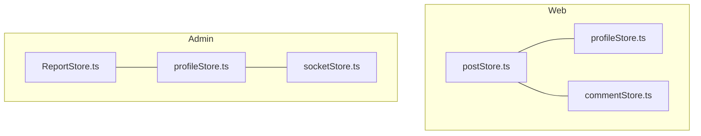
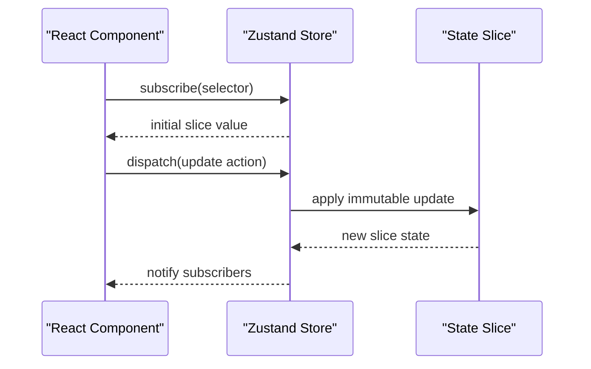
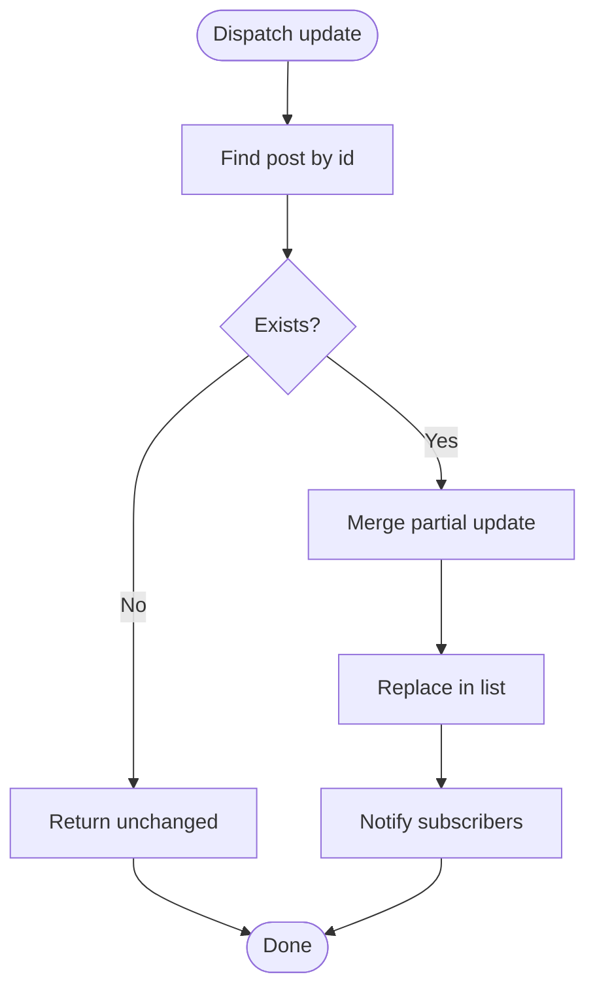
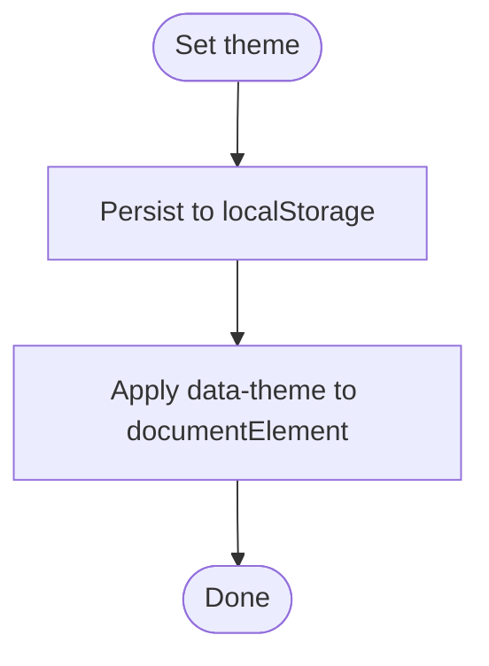
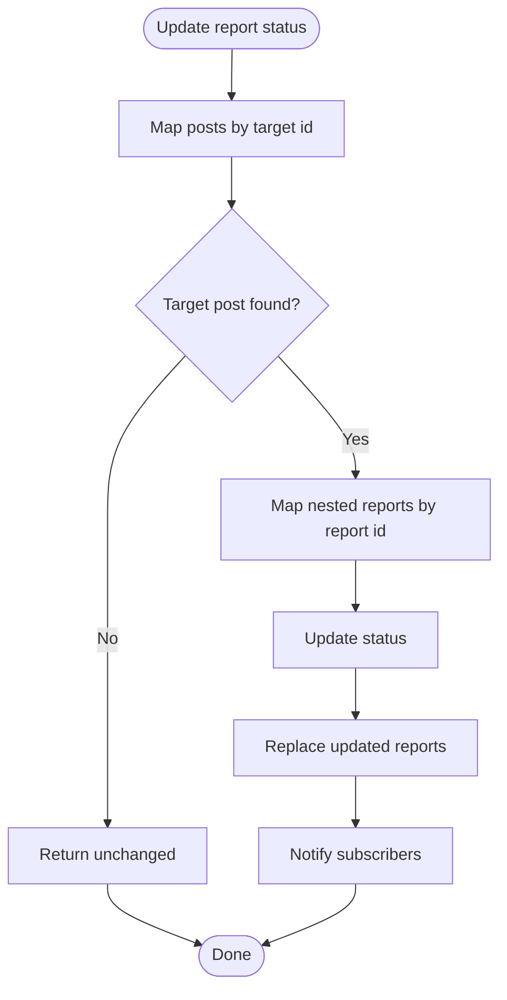
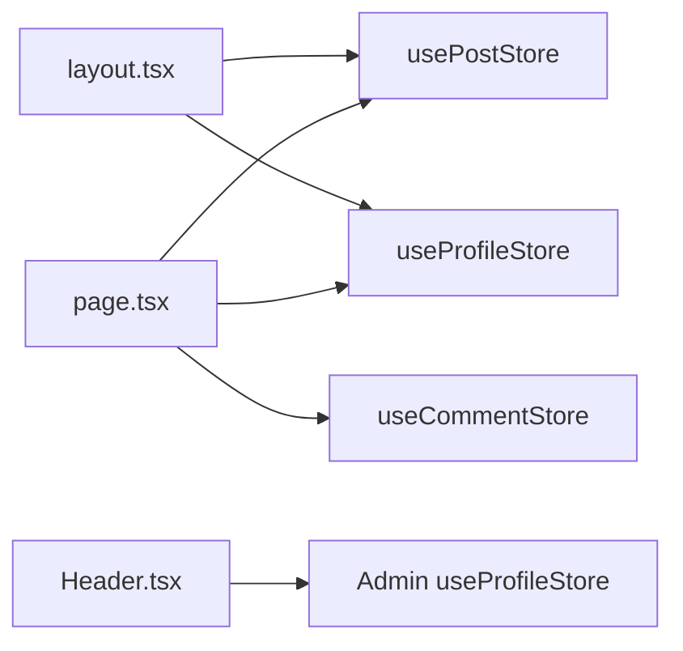

# State Management

<cite>
**Referenced Files in This Document**
- [postStore.ts](file://web/src/store/postStore.ts)
- [profileStore.ts](file://web/src/store/profileStore.ts)
- [commentStore.ts](file://web/src/store/commentStore.ts)
- [ReportStore.ts](file://admin/src/store/ReportStore.ts)
- [profileStore.ts](file://admin/src/store/profileStore.ts)
- [socketStore.ts](file://admin/src/store/socketStore.ts)
- [Post.ts](file://web/src/types/Post.ts)
- [Comment.ts](file://web/src/types/Comment.ts)
- [User.ts](file://web/src/types/User.ts)
- [layout.tsx](file://web/src/app/(root)/(app)/layout.tsx)
- [page.tsx](file://web/src/app/(root)/(app)/p/[id]/page.tsx)
- [Header.tsx](file://admin/src/components/general/Header.tsx)
</cite>

## Table of Contents
1. [Introduction](#introduction)
2. [Project Structure](#project-structure)
3. [Core Components](#core-components)
4. [Architecture Overview](#architecture-overview)
5. [Detailed Component Analysis](#detailed-component-analysis)
6. [Dependency Analysis](#dependency-analysis)
7. [Performance Considerations](#performance-considerations)
8. [Troubleshooting Guide](#troubleshooting-guide)
9. [Conclusion](#conclusion)
10. [Appendices](#appendices)

## Introduction
This document explains the state management architecture using Zustand in the web application. It covers store patterns, state slices for posts, profiles, and comments, and state update mechanisms. It also documents store composition, selectors and subscription patterns, integration with React components, persistence strategies, debugging approaches, and best practices for organization and performance.

## Project Structure
Zustand stores are organized per domain slice under the web and admin applications:
- Web application stores:
  - Post store for feed and post-specific lists
  - Profile store for user identity and theme
  - Comment store for comment threads
- Admin application stores:
  - Report store for moderation reports
  - Profile store for admin identity
  - Socket store for socket-related state

**Diagram sources**
- [postStore.ts](file://web/src/store/postStore.ts#L1-L30)
- [profileStore.ts](file://web/src/store/profileStore.ts#L1-L45)
- [commentStore.ts](file://web/src/store/commentStore.ts#L1-L34)
- [ReportStore.ts](file://admin/src/store/ReportStore.ts#L1-L43)
- [profileStore.ts](file://admin/src/store/profileStore.ts#L1-L39)
- [socketStore.ts](file://admin/src/store/socketStore.ts#L1-L14)

**Section sources**
- [postStore.ts](file://web/src/store/postStore.ts#L1-L30)
- [profileStore.ts](file://web/src/store/profileStore.ts#L1-L45)
- [commentStore.ts](file://web/src/store/commentStore.ts#L1-L34)
- [ReportStore.ts](file://admin/src/store/ReportStore.ts#L1-L43)
- [profileStore.ts](file://admin/src/store/profileStore.ts#L1-L39)
- [socketStore.ts](file://admin/src/store/socketStore.ts#L1-L14)

## Core Components
- Post store
  - Maintains a list of posts and exposes setters for full replacement, addition, removal, and partial updates.
  - Typical usage: feed rendering, post detail hydration, and real-time updates.
- Profile store
  - Holds theme and user profile data; includes persistence for theme via local storage and DOM attributes.
  - Typical usage: global theme switching, user avatar rendering, and session state.
- Comment store
  - Manages comment threads with full replacement, addition, removal, reset, and partial updates.
  - Typical usage: comment tree rendering and live comment updates.
- Admin Report store
  - Manages reported posts and nested reports with status transitions and targeted updates.
  - Typical usage: moderation dashboard and report resolution workflows.
- Admin Profile store
  - Mirrors profile management for admin users.
- Admin Socket store
  - Minimal store for socket-related identifiers.

**Section sources**
- [postStore.ts](file://web/src/store/postStore.ts#L4-L10)
- [profileStore.ts](file://web/src/store/profileStore.ts#L5-L12)
- [commentStore.ts](file://web/src/store/commentStore.ts#L4-L11)
- [ReportStore.ts](file://admin/src/store/ReportStore.ts#L4-L9)
- [profileStore.ts](file://admin/src/store/profileStore.ts#L4-L10)
- [socketStore.ts](file://admin/src/store/socketStore.ts#L3-L6)

## Architecture Overview
Zustand stores are created with a typed state interface and a reducer-like updater function. Components subscribe to slices using selector functions to minimize re-renders. Stores are independent and can be composed to support cross-component sharing.

**Diagram sources**
- [postStore.ts](file://web/src/store/postStore.ts#L12-L27)
- [profileStore.ts](file://web/src/store/profileStore.ts#L14-L42)
- [commentStore.ts](file://web/src/store/commentStore.ts#L13-L31)

## Detailed Component Analysis

### Post Store
- Purpose: Manage a list of posts with CRUD-like operations.
- Key actions:
  - Set posts
  - Add a single post
  - Remove a post by id
  - Update a post by id
- Subscription pattern: Components select only the posts array and relevant setters.

**Diagram sources**
- [postStore.ts](file://web/src/store/postStore.ts#L21-L26)

**Section sources**
- [postStore.ts](file://web/src/store/postStore.ts#L1-L30)
- [Post.ts](file://web/src/types/Post.ts#L4-L22)

### Profile Store (Web)
- Purpose: Track theme and user profile; persists theme to local storage and applies a data attribute to the document element.
- Key actions:
  - Set profile
  - Update profile
  - Remove profile
  - Set theme (persists and updates DOM)
- Subscription pattern: Components subscribe to theme and profile fields independently.

**Diagram sources**
- [profileStore.ts](file://web/src/store/profileStore.ts#L37-L41)

**Section sources**
- [profileStore.ts](file://web/src/store/profileStore.ts#L1-L45)
- [User.ts](file://web/src/types/User.ts#L3-L12)

### Comment Store
- Purpose: Manage comment threads with full replacement, addition, removal, reset, and partial updates.
- Key actions:
  - Reset comments
  - Set comments
  - Add a comment
  - Remove a comment by id
  - Update a comment by id
- Subscription pattern: Components select comments and setters for rendering and live updates.

**Section sources**
- [commentStore.ts](file://web/src/store/commentStore.ts#L1-L34)
- [Comment.ts](file://web/src/types/Comment.ts#L4-L17)

### Admin Report Store
- Purpose: Manage reported posts and nested reports with status transitions and targeted updates.
- Key actions:
  - Set reports
  - Update report status by ids
  - Update a report item by id
- Subscription pattern: Components subscribe to the reports list and update handlers.

**Diagram sources**
- [ReportStore.ts](file://admin/src/store/ReportStore.ts#L14-L26)

**Section sources**
- [ReportStore.ts](file://admin/src/store/ReportStore.ts#L1-L43)

### Admin Profile Store
- Purpose: Manage admin user profile and theme updates.
- Key actions:
  - Set profile
  - Update profile
  - Remove profile
  - Set theme
- Subscription pattern: Components subscribe to profile and theme fields.

**Section sources**
- [profileStore.ts](file://admin/src/store/profileStore.ts#L1-L39)

### Admin Socket Store
- Purpose: Minimal store for socket-related identifiers.
- Key actions:
  - Set user identifier
- Subscription pattern: Components subscribe to the user field.

**Section sources**
- [socketStore.ts](file://admin/src/store/socketStore.ts#L1-L14)

## Dependency Analysis
Stores are independent and accessed by components via selectors. Cross-store interactions are rare; when needed, they are orchestrated by components.

**Diagram sources**
- [layout.tsx](file://web/src/app/(root)/(app)/layout.tsx#L59-L60)
- [layout.tsx](file://web/src/app/(root)/(app)/layout.tsx#L124-L125)
- [page.tsx](file://web/src/app/(root)/(app)/p/[id]/page.tsx#L35-L43)
- [Header.tsx](file://admin/src/components/general/Header.tsx#L13-L14)

**Section sources**
- [layout.tsx](file://web/src/app/(root)/(app)/layout.tsx#L59-L60)
- [layout.tsx](file://web/src/app/(root)/(app)/layout.tsx#L124-L125)
- [page.tsx](file://web/src/app/(root)/(app)/p/[id]/page.tsx#L35-L43)
- [Header.tsx](file://admin/src/components/general/Header.tsx#L13-L14)

## Performance Considerations
- Selectors: Prefer narrow selectors to avoid unnecessary re-renders. Subscribe only to the fields a component needs.
- Immutable updates: Use functional updates to ensure immutability and predictable state transitions.
- Batch updates: Group related updates to reduce intermediate renders.
- Avoid subscribing to entire state objects when only a small slice is required.
- Large lists: Consider pagination or virtualization to limit render scope.
- Persistence: Keep persisted keys minimal and scoped to avoid bloating storage.

## Troubleshooting Guide
- Selector pitfalls:
  - Avoid creating new objects/functions inside render; define selectors outside or memoize them.
  - Prefer shallow equality checks for primitive slices; for object slices, use equality checks or immer-style updates.
- Debugging:
  - Use Zustand’s built-in devtools or logging around updates to inspect state transitions.
  - Temporarily subscribe to the whole store to confirm updates are reaching the store.
- Common issues:
  - Infinite loops: Ensure effects depend on stable values and avoid triggering updates in render.
  - Stale reads: When reading from the store outside of subscriptions, use the store’s get state method sparingly and only for non-reactive reads.

## Conclusion
The Zustand-based state management in this application is modular, explicit, and easy to debug. By organizing stores per domain, using narrow selectors, and applying immutable updates, the system achieves clear separation of concerns and predictable behavior. Persistence is handled cleanly for theme state, and cross-component sharing is achieved through focused subscriptions.

## Appendices

### Store Initialization Examples
- Initialize stores by importing the store hook and using it in components:
  - Web post store: Import the store hook and call it with a selector to read and write.
  - Web profile store: Import the store hook and call it with a selector to read and write theme and profile.
  - Web comment store: Import the store hook and call it with a selector to read and write comments.
  - Admin report store: Import the store hook and call it with a selector to read and update reports.
  - Admin profile store: Import the store hook and call it with a selector to read and write admin profile.
  - Admin socket store: Import the store hook and call it with a selector to read and write user.

### State Update Mechanisms
- Posts:
  - Full replacement: Use the setter to replace the entire list.
  - Add/remove/update: Use add/remove/update actions to mutate the list immutably.
- Comments:
  - Full replacement: Use the setter to replace the entire thread.
  - Add/remove/update/reset: Use add/remove/update/reset actions to manage the thread.
- Profiles:
  - Set/update/remove: Use setters to manage user identity and theme.
  - Theme persistence: Use the theme setter to persist and apply theme changes.
- Reports:
  - Set/update: Use setters to manage reports and nested report updates.

### Cross-Component State Sharing
- Layout and post detail:
  - Layout subscribes to theme and profile to render UI and avatar.
  - Post detail subscribes to posts and comments to hydrate and render content.
- Admin header:
  - Header subscribes to profile to display session state and trigger sign-out flows.

**Section sources**
- [layout.tsx](file://web/src/app/(root)/(app)/layout.tsx#L59-L60)
- [layout.tsx](file://web/src/app/(root)/(app)/layout.tsx#L124-L125)
- [page.tsx](file://web/src/app/(root)/(app)/p/[id]/page.tsx#L35-L43)
- [Header.tsx](file://admin/src/components/general/Header.tsx#L13-L14)