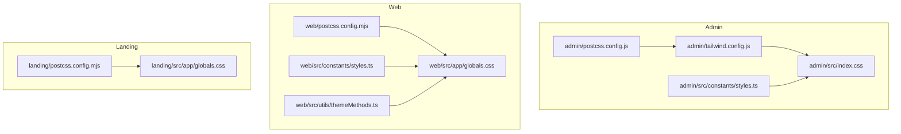
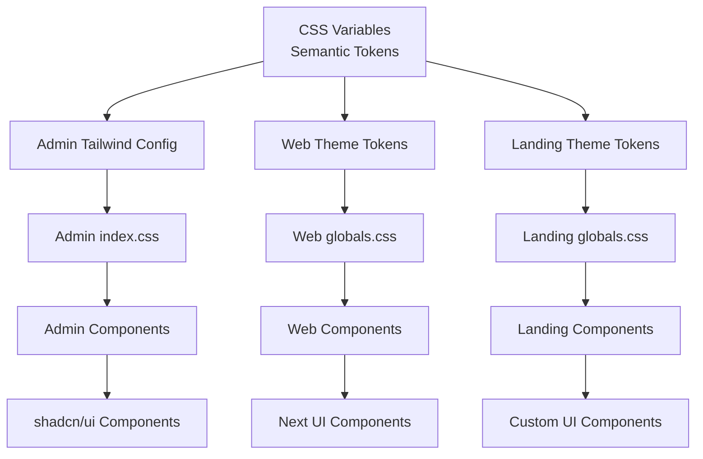
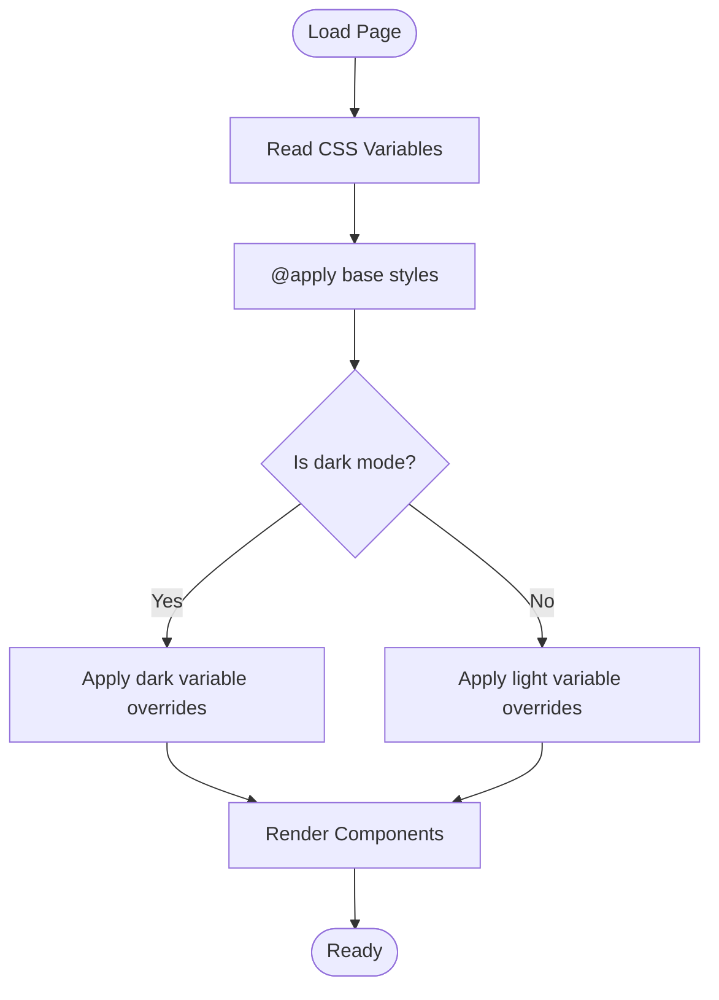
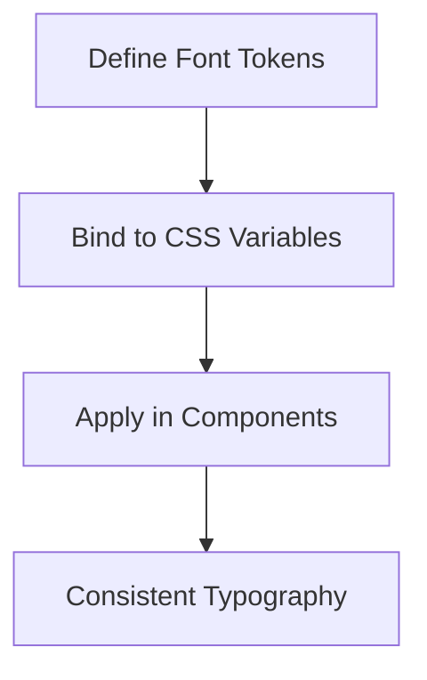
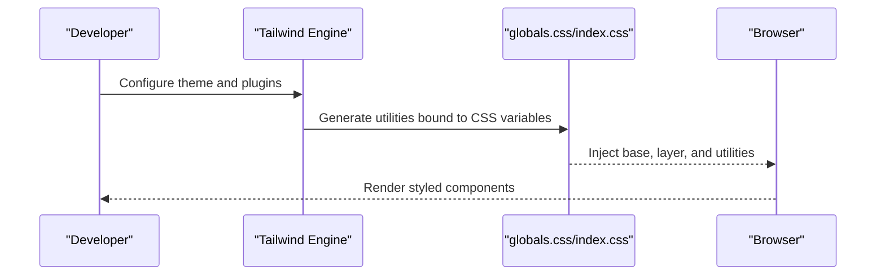
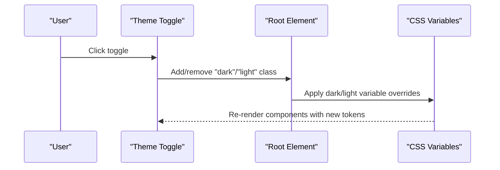
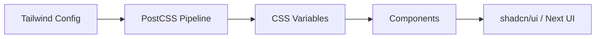

# Theming & Design System

<cite>
**Referenced Files in This Document**
- [admin/tailwind.config.js](file://admin/tailwind.config.js)
- [admin/postcss.config.js](file://admin/postcss.config.js)
- [admin/src/index.css](file://admin/src/index.css)
- [admin/src/constants/styles.ts](file://admin/src/constants/styles.ts)
- [web/postcss.config.mjs](file://web/postcss.config.mjs)
- [web/src/app/globals.css](file://web/src/app/globals.css)
- [web/src/constants/styles.ts](file://web/src/constants/styles.ts)
- [web/src/utils/themeMethods.ts](file://web/src/utils/themeMethods.ts)
- [landing/postcss.config.mjs](file://landing/postcss.config.mjs)
- [landing/src/app/globals.css](file://landing/src/app/globals.css)
- [admin/components.json](file://admin/components.json)
- [web/components.json](file://web/components.json)
</cite>

## Table of Contents
1. [Introduction](#introduction)
2. [Project Structure](#project-structure)
3. [Core Components](#core-components)
4. [Architecture Overview](#architecture-overview)
5. [Detailed Component Analysis](#detailed-component-analysis)
6. [Dependency Analysis](#dependency-analysis)
7. [Performance Considerations](#performance-considerations)
8. [Troubleshooting Guide](#troubleshooting-guide)
9. [Conclusion](#conclusion)
10. [Appendices](#appendices)

## Introduction
This document describes the theming and design system across the admin, web, and landing applications. It covers font configuration, color schemes, design tokens, Tailwind CSS integration, component variants, responsive design patterns, theme switching (light/dark), and accessibility considerations. It also provides practical guidance on styling components, using utility classes, and integrating the design system consistently.

## Project Structure
Each application defines its own design system layer:
- Admin: Uses Tailwind CSS with CSS variables and shadcn/ui configuration.
- Web: Uses Next.js with @tailwindcss/postcss plugin and CSS theme tokens.
- Landing: Uses Tailwind CSS with @tailwindcss/postcss plugin and a rich set of custom font tokens.

**Diagram sources**
- [admin/tailwind.config.js](file://admin/tailwind.config.js#L1-L82)
- [admin/postcss.config.js](file://admin/postcss.config.js#L1-L7)
- [admin/src/index.css](file://admin/src/index.css#L1-L132)
- [admin/src/constants/styles.ts](file://admin/src/constants/styles.ts#L1-L2)
- [web/postcss.config.mjs](file://web/postcss.config.mjs#L1-L8)
- [web/src/app/globals.css](file://web/src/app/globals.css#L1-L133)
- [web/src/constants/styles.ts](file://web/src/constants/styles.ts#L1-L4)
- [web/src/utils/themeMethods.ts](file://web/src/utils/themeMethods.ts#L1-L19)
- [landing/postcss.config.mjs](file://landing/postcss.config.mjs#L1-L6)
- [landing/src/app/globals.css](file://landing/src/app/globals.css#L1-L143)

**Section sources**
- [admin/tailwind.config.js](file://admin/tailwind.config.js#L1-L82)
- [admin/postcss.config.js](file://admin/postcss.config.js#L1-L7)
- [admin/src/index.css](file://admin/src/index.css#L1-L132)
- [admin/src/constants/styles.ts](file://admin/src/constants/styles.ts#L1-L2)
- [web/postcss.config.mjs](file://web/postcss.config.mjs#L1-L8)
- [web/src/app/globals.css](file://web/src/app/globals.css#L1-L133)
- [web/src/constants/styles.ts](file://web/src/constants/styles.ts#L1-L4)
- [web/src/utils/themeMethods.ts](file://web/src/utils/themeMethods.ts#L1-L19)
- [landing/postcss.config.mjs](file://landing/postcss.config.mjs#L1-L6)
- [landing/src/app/globals.css](file://landing/src/app/globals.css#L1-L143)

## Core Components
- Color system: CSS variables define semantic tokens for light and dark modes. Admin uses HSL-based variables; Web and Landing use OKLCH-based variables for perceptually uniform colors.
- Typography: Fonts are registered via @theme tokens and custom font families are declared in CSS.
- Spacing and radii: Radius tokens are derived from a base radius variable and applied consistently across components.
- Utilities: Shared input styling constants unify focus and ring styles across apps.
- Theme switching: Web implements programmatic theme toggling at the root element; Admin relies on Tailwind’s class-based dark mode.

Key implementation references:
- Admin color tokens and dark mode: [admin/src/index.css](file://admin/src/index.css#L15-L72)
- Web color tokens and dark mode: [web/src/app/globals.css](file://web/src/app/globals.css#L55-L122)
- Landing font tokens and animations: [landing/src/app/globals.css](file://landing/src/app/globals.css#L28-L97)
- Web theme toggling utilities: [web/src/utils/themeMethods.ts](file://web/src/utils/themeMethods.ts#L1-L19)
- Shared input styling: [admin/src/constants/styles.ts](file://admin/src/constants/styles.ts#L1-L2), [web/src/constants/styles.ts](file://web/src/constants/styles.ts#L1-L4)

**Section sources**
- [admin/src/index.css](file://admin/src/index.css#L15-L132)
- [web/src/app/globals.css](file://web/src/app/globals.css#L55-L133)
- [landing/src/app/globals.css](file://landing/src/app/globals.css#L28-L143)
- [web/src/utils/themeMethods.ts](file://web/src/utils/themeMethods.ts#L1-L19)
- [admin/src/constants/styles.ts](file://admin/src/constants/styles.ts#L1-L2)
- [web/src/constants/styles.ts](file://web/src/constants/styles.ts#L1-L4)

## Architecture Overview
The design systems are layered:
- Base tokens: CSS variables define semantic roles (background, foreground, primary, secondary, muted, accent, destructive, borders, input, ring, chart palette).
- Layered styles: Tailwind utilities and @apply directives bind tokens to components.
- Dark mode: Implemented via class-based dark variant in Admin and CSS variable overrides in Web/Landing.
- Component library: Admin integrates shadcn/ui with Tailwind; Web uses built-in Next.js theme tokens.

**Diagram sources**
- [admin/tailwind.config.js](file://admin/tailwind.config.js#L8-L82)
- [admin/src/index.css](file://admin/src/index.css#L15-L132)
- [web/src/app/globals.css](file://web/src/app/globals.css#L8-L53)
- [landing/src/app/globals.css](file://landing/src/app/globals.css#L28-L97)

## Detailed Component Analysis

### Color System and Design Tokens
- Admin: Defines HSL-based tokens for light and dark modes, including card, popover, primary, secondary, muted, accent, destructive, border, input, ring, and chart palette.
- Web: Defines OKLCH-based tokens for perceptual uniformity, with consistent dark mode overrides.
- Landing: Similar OKLCH tokens with additional font tokens and custom animations.

Implementation references:
- Admin tokens: [admin/src/index.css](file://admin/src/index.css#L16-L71)
- Web tokens: [web/src/app/globals.css](file://web/src/app/globals.css#L55-L122)
- Landing tokens: [landing/src/app/globals.css](file://landing/src/app/globals.css#L99-L132)

**Diagram sources**
- [admin/src/index.css](file://admin/src/index.css#L15-L132)
- [web/src/app/globals.css](file://web/src/app/globals.css#L55-L133)
- [landing/src/app/globals.css](file://landing/src/app/globals.css#L99-L143)

**Section sources**
- [admin/src/index.css](file://admin/src/index.css#L15-L132)
- [web/src/app/globals.css](file://web/src/app/globals.css#L55-L133)
- [landing/src/app/globals.css](file://landing/src/app/globals.css#L99-L143)

### Typography System
- Admin: Uses Tailwind base utilities and applies background/foreground classes globally.
- Web: Declares font tokens via @theme and binds them to CSS variables for consistent usage across components.
- Landing: Registers multiple font families and defines custom animations for transitions.

Implementation references:
- Web font tokens: [web/src/app/globals.css](file://web/src/app/globals.css#L8-L10)
- Landing font tokens: [landing/src/app/globals.css](file://landing/src/app/globals.css#L28-L43)

**Diagram sources**
- [web/src/app/globals.css](file://web/src/app/globals.css#L8-L10)
- [landing/src/app/globals.css](file://landing/src/app/globals.css#L28-L43)

**Section sources**
- [web/src/app/globals.css](file://web/src/app/globals.css#L8-L10)
- [landing/src/app/globals.css](file://landing/src/app/globals.css#L28-L43)

### Spacing Conventions and Radius Tokens
- Base radius token is defined and extended into sm/md/lg/xl/2xl/3xl/4xl variants.
- Components derive spacing from these tokens for consistent gutters and corner radii.

Implementation references:
- Radius tokens: [web/src/app/globals.css](file://web/src/app/globals.css#L46-L52)
- Admin radius extensions: [admin/tailwind.config.js](file://admin/tailwind.config.js#L10-L14)

**Section sources**
- [web/src/app/globals.css](file://web/src/app/globals.css#L46-L52)
- [admin/tailwind.config.js](file://admin/tailwind.config.js#L10-L14)

### Tailwind CSS Integration
- Admin: Tailwind config extends colors and keyframes; CSS variables are mapped to Tailwind utilities.
- Web: Uses @tailwindcss/postcss plugin; theme tokens are defined via @theme and @theme inline blocks.
- Landing: Uses @tailwindcss/postcss plugin with rich token sets.

Implementation references:
- Admin Tailwind config: [admin/tailwind.config.js](file://admin/tailwind.config.js#L1-L82)
- Admin PostCSS: [admin/postcss.config.js](file://admin/postcss.config.js#L1-L7)
- Web PostCSS: [web/postcss.config.mjs](file://web/postcss.config.mjs#L1-L8)
- Landing PostCSS: [landing/postcss.config.mjs](file://landing/postcss.config.mjs#L1-L6)

**Diagram sources**
- [admin/tailwind.config.js](file://admin/tailwind.config.js#L1-L82)
- [admin/src/index.css](file://admin/src/index.css#L1-L132)
- [web/src/app/globals.css](file://web/src/app/globals.css#L1-L133)
- [landing/src/app/globals.css](file://landing/src/app/globals.css#L1-L143)

**Section sources**
- [admin/tailwind.config.js](file://admin/tailwind.config.js#L1-L82)
- [admin/postcss.config.js](file://admin/postcss.config.js#L1-L7)
- [web/postcss.config.mjs](file://web/postcss.config.mjs#L1-L8)
- [landing/postcss.config.mjs](file://landing/postcss.config.mjs#L1-L6)

### Component Variants and Responsive Patterns
- Admin: Uses Tailwind utilities with dark mode variants and custom animations for accordions.
- Web: Leverages CSS variables and @apply directives for consistent component styling.
- Landing: Provides custom animations and font tokens for engaging UI elements.

Implementation references:
- Admin animations: [admin/tailwind.config.js](file://admin/tailwind.config.js#L57-L78)
- Web base layer: [web/src/app/globals.css](file://web/src/app/globals.css#L124-L132)
- Landing animations: [landing/src/app/globals.css](file://landing/src/app/globals.css#L4-L26)

**Section sources**
- [admin/tailwind.config.js](file://admin/tailwind.config.js#L57-L78)
- [web/src/app/globals.css](file://web/src/app/globals.css#L124-L132)
- [landing/src/app/globals.css](file://landing/src/app/globals.css#L4-L26)

### Theme Switching and Accessibility
- Web: Programmatic theme toggling at the root element synchronizes UI state and respects user preferences.
- Admin: Class-based dark mode via Tailwind’s darkMode setting.
- Accessibility: Focus rings and outline tokens are applied globally; ensure sufficient contrast per theme.

Implementation references:
- Web theme utilities: [web/src/utils/themeMethods.ts](file://web/src/utils/themeMethods.ts#L1-L19)
- Admin dark mode: [admin/tailwind.config.js](file://admin/tailwind.config.js#L7-L7)
- Global focus and border: [admin/src/index.css](file://admin/src/index.css#L75-L81), [web/src/app/globals.css](file://web/src/app/globals.css#L124-L132)

**Diagram sources**
- [web/src/utils/themeMethods.ts](file://web/src/utils/themeMethods.ts#L1-L19)
- [web/src/app/globals.css](file://web/src/app/globals.css#L55-L122)
- [admin/src/index.css](file://admin/src/index.css#L45-L71)

**Section sources**
- [web/src/utils/themeMethods.ts](file://web/src/utils/themeMethods.ts#L1-L19)
- [admin/tailwind.config.js](file://admin/tailwind.config.js#L7-L7)
- [admin/src/index.css](file://admin/src/index.css#L75-L81)
- [web/src/app/globals.css](file://web/src/app/globals.css#L124-L132)

### Component Styling Examples and Utility Classes
- Shared input styling constants unify focus and ring behavior across apps.
- Tailwind utilities bind to CSS variables for consistent component appearance.

Implementation references:
- Admin input styling: [admin/src/constants/styles.ts](file://admin/src/constants/styles.ts#L1-L2)
- Web input styling: [web/src/constants/styles.ts](file://web/src/constants/styles.ts#L1-L4)
- Admin base utilities: [admin/src/index.css](file://admin/src/index.css#L74-L132)
- Web base utilities: [web/src/app/globals.css](file://web/src/app/globals.css#L124-L132)

**Section sources**
- [admin/src/constants/styles.ts](file://admin/src/constants/styles.ts#L1-L2)
- [web/src/constants/styles.ts](file://web/src/constants/styles.ts#L1-L4)
- [admin/src/index.css](file://admin/src/index.css#L74-L132)
- [web/src/app/globals.css](file://web/src/app/globals.css#L124-L132)

### Component Library Integration
- Admin: shadcn/ui configured with Tailwind; CSS variables enable theme-aware components.
- Web: Built-in Next.js theme tokens support component libraries and design systems.

Implementation references:
- Admin shadcn config: [admin/components.json](file://admin/components.json#L1-L21)
- Web shadcn config: [web/components.json](file://web/components.json#L1-L24)

**Section sources**
- [admin/components.json](file://admin/components.json#L1-L21)
- [web/components.json](file://web/components.json#L1-L24)

## Dependency Analysis
The design system depends on:
- Tailwind configuration and PostCSS pipeline.
- CSS variable tokens and @apply directives.
- Component library configuration for consistent variants.

**Diagram sources**
- [admin/tailwind.config.js](file://admin/tailwind.config.js#L1-L82)
- [admin/postcss.config.js](file://admin/postcss.config.js#L1-L7)
- [admin/src/index.css](file://admin/src/index.css#L15-L132)
- [web/src/app/globals.css](file://web/src/app/globals.css#L8-L53)
- [landing/src/app/globals.css](file://landing/src/app/globals.css#L28-L97)

**Section sources**
- [admin/tailwind.config.js](file://admin/tailwind.config.js#L1-L82)
- [admin/postcss.config.js](file://admin/postcss.config.js#L1-L7)
- [admin/src/index.css](file://admin/src/index.css#L15-L132)
- [web/src/app/globals.css](file://web/src/app/globals.css#L8-L53)
- [landing/src/app/globals.css](file://landing/src/app/globals.css#L28-L97)

## Performance Considerations
- Prefer CSS variables for theme tokens to minimize reflows and enable efficient dark/light switching.
- Use Tailwind utilities sparingly; batch styles with @apply to reduce CSS bloat.
- Avoid excessive custom animations; leverage built-in transitions where possible.
- Keep font subsets minimal to reduce initial payload.

## Troubleshooting Guide
- Theme not applying: Verify dark mode class presence on the root element and CSS variable overrides.
- Colors appear incorrect: Confirm token values and ensure Tailwind utilities map to CSS variables.
- Fonts not loading: Check @theme declarations and ensure font families are properly imported.

References:
- Web theme utilities: [web/src/utils/themeMethods.ts](file://web/src/utils/themeMethods.ts#L1-L19)
- Admin dark mode: [admin/tailwind.config.js](file://admin/tailwind.config.js#L7-L7)
- Token overrides: [admin/src/index.css](file://admin/src/index.css#L45-L71), [web/src/app/globals.css](file://web/src/app/globals.css#L90-L122)

**Section sources**
- [web/src/utils/themeMethods.ts](file://web/src/utils/themeMethods.ts#L1-L19)
- [admin/tailwind.config.js](file://admin/tailwind.config.js#L7-L7)
- [admin/src/index.css](file://admin/src/index.css#L45-L71)
- [web/src/app/globals.css](file://web/src/app/globals.css#L90-L122)

## Conclusion
The design system leverages CSS variables, Tailwind utilities, and component libraries to deliver a cohesive, themeable interface. Admin emphasizes class-based dark mode and HSL tokens; Web and Landing adopt OKLCH tokens for perceptual uniformity and rich typography. Shared utilities and constants ensure consistent styling across components, while theme switching is handled programmatically in Web and via Tailwind in Admin.

## Appendices
- Example usage patterns:
  - Apply global base styles and tokens: [admin/src/index.css](file://admin/src/index.css#L74-L132), [web/src/app/globals.css](file://web/src/app/globals.css#L124-L132)
  - Use shared input styling: [admin/src/constants/styles.ts](file://admin/src/constants/styles.ts#L1-L2), [web/src/constants/styles.ts](file://web/src/constants/styles.ts#L1-L4)
  - Configure shadcn/ui: [admin/components.json](file://admin/components.json#L1-L21), [web/components.json](file://web/components.json#L1-L24)