# Web Application

<cite>
**Referenced Files in This Document**
- [layout.tsx](file://web/src/app/layout.tsx)
- [meta.ts](file://web/src/app/meta.ts)
- [fonts.ts](file://web/src/app/fonts.ts)
- [globals.css](file://web/src/app/globals.css)
- [next.config.ts](file://web/next.config.ts)
- [package.json](file://web/package.json)
- [auth-client.ts](file://web/src/lib/auth-client.ts)
- [auth.ts](file://web/src/services/api/auth.ts)
- [http.ts](file://web/src/services/http.ts)
- [SocketContext.tsx](file://web/src/socket/SocketContext.tsx)
- [useSocket.ts](file://web/src/socket/useSocket.ts)
- [useNotificationSocket.tsx](file://web/src/hooks/useNotificationSocket.tsx)
- [postStore.ts](file://web/src/store/postStore.ts)
- [profileStore.ts](file://web/src/store/profileStore.ts)
- [post.ts](file://web/src/services/api/post.ts)
- [vote.ts](file://web/src/services/api/vote.ts)
- [bookmark.ts](file://web/src/services/api/bookmark.ts)
- [notification.ts](file://web/src/services/api/notification.ts)
- [CreatePost.tsx](file://web/src/components/general/CreatePost.tsx)
- [Post.tsx](file://web/src/components/general/Post.tsx)
- [EngagementComponent.tsx](file://web/src/components/general/EngagementComponent.tsx)
- [ThemeToggler.tsx](file://web/src/components/general/ThemeToggler.tsx)
- [ThemedToaster.tsx](file://web/src/components/general/ThemedToaster.tsx)
- [NotificationButton.tsx](file://web/src/components/general/NotificationButton.tsx)
- [NotificationCard.tsx](file://web/src/components/general/NotificationCard.tsx)
- [UserProfile.tsx](file://web/src/components/general/UserProfile.tsx)
- [button.tsx](file://web/src/components/ui/button.tsx)
- [dialog.tsx](file://web/src/components/ui/dialog.tsx)
- [select.tsx](file://web/src/components/ui/select.tsx)
- [textarea.tsx](file://web/src/components/ui/textarea.tsx)
- [input.tsx](file://web/src/components/ui/input.tsx)
- [card.tsx](file://web/src/components/ui/card.tsx)
- [avatar.tsx](file://web/src/components/ui/avatar.tsx)
- [separator.tsx](file://web/src/components/ui/separator.tsx)
- [toast.tsx](file://web/src/components/ui/toast.tsx)
- [toaster.tsx](file://web/src/components/ui/toaster.tsx)
- [themeMethods.ts](file://web/src/utils/themeMethods.ts)
- [moderation.ts](file://web/src/utils/moderation.ts)
- [formatTime.ts](file://web/src/utils/formatTime.ts)
- [getNotificationAction.ts](file://web/src/utils/getNotificationAction.ts)
- [branch.ts](file://web/src/constants/branch.ts)
- [styles.ts](file://web/src/constants/styles.ts)
- [env.ts](file://web/src/config/env.ts)
- [zod-resolver.ts](file://web/src/lib/zod-resolver.ts)
- [useErrorHandler.tsx](file://web/src/hooks/useErrorHandler.tsx)
- [use-file-upload.ts](file://web/src/hooks/use-file-upload.ts)
- [useLeavePageWarning.tsx](file://web/src/hooks/useLeavePageWarning.tsx)
- [logo.svg](file://web/src/app/logo.svg)
- [favicon.ico](file://web/src/app/favicon.ico)
- [not-found.tsx](file://web/src/app/not-found.tsx)
- [auth-success/page.tsx](file://web/src/app/auth-success/page.tsx)
- [server-booting/page.tsx](file://web/src/app/server-booting/page.tsx)
- [feedback/page.tsx](file://web/src/app/feedback/page.tsx)
- [feedback/service.ts](file://web/src/services/api/feedback.ts)
- [feedback/http.ts](file://web/src/services/http.ts)
- [feedback/env.ts](file://web/src/config/env.ts)
- [feedback/socket/SocketContext.tsx](file://web/src/socket/SocketContext.tsx)
- [feedback/socket/useSocket.ts](file://web/src/socket/useSocket.ts)
- [feedback/store/profileStore.ts](file://web/src/store/profileStore.ts)
- [feedback/store/postStore.ts](file://web/src/store/postStore.ts)
- [feedback/services/api/post.ts](file://web/src/services/api/post.ts)
- [feedback/services/api/vote.ts](file://web/src/services/api/vote.ts)
- [feedback/services/api/bookmark.ts](file://web/src/services/api/bookmark.ts)
- [feedback/services/api/notification.ts](file://web/src/services/api/notification.ts)
- [feedback/components/general/CreatePost.tsx](file://web/src/components/general/CreatePost.tsx)
- [feedback/components/general/Post.tsx](file://web/src/components/general/Post.tsx)
- [feedback/components/general/EngagementComponent.tsx](file://web/src/components/general/EngagementComponent.tsx)
- [feedback/components/general/ThemeToggler.tsx](file://web/src/components/general/ThemeToggler.tsx)
- [feedback/components/general/ThemedToaster.tsx](file://web/src/components/general/ThemedToaster.tsx)
- [feedback/components/general/NotificationButton.tsx](file://web/src/components/general/NotificationButton.tsx)
- [feedback/components/general/NotificationCard.tsx](file://web/src/components/general/NotificationCard.tsx)
- [feedback/components/general/UserProfile.tsx](file://web/src/components/general/UserProfile.tsx)
- [feedback/components/ui/button.tsx](file://web/src/components/ui/button.tsx)
- [feedback/components/ui/dialog.tsx](file://web/src/components/ui/dialog.tsx)
- [feedback/components/ui/select.tsx](file://web/src/components/ui/select.tsx)
- [feedback/components/ui/textarea.tsx](file://web/src/components/ui/textarea.tsx)
- [feedback/components/ui/input.tsx](file://web/src/components/ui/input.tsx)
- [feedback/components/ui/card.tsx](file://web/src/components/ui/card.tsx)
- [feedback/components/ui/avatar.tsx](file://web/src/components/ui/avatar.tsx)
- [feedback/components/ui/separator.tsx](file://web/src/components/ui/separator.tsx)
- [feedback/components/ui/toast.tsx](file://web/src/components/ui/toast.tsx)
- [feedback/components/ui/toaster.tsx](file://web/src/components/ui/toaster.tsx)
- [feedback/utils/themeMethods.ts](file://web/src/utils/themeMethods.ts)
- [feedback/utils/moderation.ts](file://web/src/utils/moderation.ts)
- [feedback/utils/formatTime.ts](file://web/src/utils/formatTime.ts)
- [feedback/utils/getNotificationAction.ts](file://web/src/utils/getNotificationAction.ts)
- [feedback/constants/branch.ts](file://web/src/constants/branch.ts)
- [feedback/constants/styles.ts](file://web/src/constants/styles.ts)
- [feedback/config/env.ts](file://web/src/config/env.ts)
- [feedback/lib/zod-resolver.ts](file://web/src/lib/zod-resolver.ts)
- [feedback/hooks/useErrorHandler.tsx](file://web/src/hooks/useErrorHandler.tsx)
- [feedback/hooks/use-file-upload.ts](file://web/src/hooks/use-file-upload.ts)
- [feedback/hooks/useLeavePageWarning.tsx](file://web/src/hooks/useLeavePageWarning.tsx)
</cite>

## Table of Contents
1. [Introduction](#introduction)
2. [Project Structure](#project-structure)
3. [Core Components](#core-components)
4. [Architecture Overview](#architecture-overview)
5. [Detailed Component Analysis](#detailed-component-analysis)
6. [Dependency Analysis](#dependency-analysis)
7. [Performance Considerations](#performance-considerations)
8. [Troubleshooting Guide](#troubleshooting-guide)
9. [Conclusion](#conclusion)
10. [Appendices](#appendices)

## Introduction
This document describes the Flick web application frontend built with Next.js App Router. It covers the routing model, authentication client setup, API integration patterns, real-time communication via Socket.IO, and the social platform features including post creation, commenting, voting, and bookmarking. It also documents the component architecture, reusable UI components, state management with Zustand stores, responsive design patterns, theming and typography, and notification systems.

## Project Structure
The frontend is organized as a Next.js application under the web directory. Key areas include:
- App Router pages and layouts
- Authentication client and API services
- Real-time communication via Socket.IO
- Social features: posts, comments, votes, bookmarks, notifications
- Reusable UI components and styling with Tailwind CSS
- State management with Zustand stores
- Theming and typography configuration

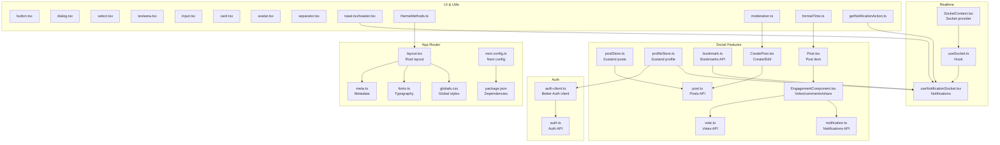

**Diagram sources**
- [layout.tsx](file://web/src/app/layout.tsx#L1-L21)
- [meta.ts](file://web/src/app/meta.ts)
- [fonts.ts](file://web/src/app/fonts.ts)
- [globals.css](file://web/src/app/globals.css)
- [next.config.ts](file://web/next.config.ts#L1-L9)
- [package.json](file://web/package.json#L1-L67)
- [auth-client.ts](file://web/src/lib/auth-client.ts#L1-L20)
- [auth.ts](file://web/src/services/api/auth.ts#L1-L156)
- [SocketContext.tsx](file://web/src/socket/SocketContext.tsx#L1-L45)
- [useSocket.ts](file://web/src/socket/useSocket.ts)
- [useNotificationSocket.tsx](file://web/src/hooks/useNotificationSocket.tsx#L1-L54)
- [postStore.ts](file://web/src/store/postStore.ts#L1-L30)
- [profileStore.ts](file://web/src/store/profileStore.ts)
- [post.ts](file://web/src/services/api/post.ts#L1-L68)
- [vote.ts](file://web/src/services/api/vote.ts#L1-L27)
- [bookmark.ts](file://web/src/services/api/bookmark.ts#L1-L14)
- [notification.ts](file://web/src/services/api/notification.ts#L1-L11)
- [CreatePost.tsx](file://web/src/components/general/CreatePost.tsx#L1-L409)
- [Post.tsx](file://web/src/components/general/Post.tsx#L1-L179)
- [EngagementComponent.tsx](file://web/src/components/general/EngagementComponent.tsx#L1-L247)
- [button.tsx](file://web/src/components/ui/button.tsx)
- [dialog.tsx](file://web/src/components/ui/dialog.tsx)
- [select.tsx](file://web/src/components/ui/select.tsx)
- [textarea.tsx](file://web/src/components/ui/textarea.tsx)
- [input.tsx](file://web/src/components/ui/input.tsx)
- [card.tsx](file://web/src/components/ui/card.tsx)
- [avatar.tsx](file://web/src/components/ui/avatar.tsx)
- [separator.tsx](file://web/src/components/ui/separator.tsx)
- [toast.tsx](file://web/src/components/ui/toast.tsx)
- [toaster.tsx](file://web/src/components/ui/toaster.tsx)
- [themeMethods.ts](file://web/src/utils/themeMethods.ts)
- [moderation.ts](file://web/src/utils/moderation.ts)
- [formatTime.ts](file://web/src/utils/formatTime.ts)
- [getNotificationAction.ts](file://web/src/utils/getNotificationAction.ts)

**Section sources**
- [layout.tsx](file://web/src/app/layout.tsx#L1-L21)
- [next.config.ts](file://web/next.config.ts#L1-L9)
- [package.json](file://web/package.json#L1-L67)

## Core Components
- App Router and Layout: Root layout defines HTML attributes, font variables, and global CSS. Metadata is centralized.
- Authentication Client: Better Auth client configured with base URL and Google One Tap plugin.
- API Services: Centralized HTTP client and typed service modules for auth, posts, votes, bookmarks, notifications.
- Real-time Communication: Socket.IO provider and hook; notification listener with optimistic updates.
- Social Components: Post rendering, engagement controls, and post creation/editing with moderation and terms acceptance.
- State Management: Zustand stores for posts and profile; optimistic UI for votes and bookmarks.
- UI Library: Reusable Radix and custom UI components styled with Tailwind CSS.
- Theming and Typography: Font configuration and theme toggler utilities.

**Section sources**
- [layout.tsx](file://web/src/app/layout.tsx#L1-L21)
- [auth-client.ts](file://web/src/lib/auth-client.ts#L1-L20)
- [auth.ts](file://web/src/services/api/auth.ts#L1-L156)
- [SocketContext.tsx](file://web/src/socket/SocketContext.tsx#L1-L45)
- [useNotificationSocket.tsx](file://web/src/hooks/useNotificationSocket.tsx#L1-L54)
- [CreatePost.tsx](file://web/src/components/general/CreatePost.tsx#L1-L409)
- [Post.tsx](file://web/src/components/general/Post.tsx#L1-L179)
- [EngagementComponent.tsx](file://web/src/components/general/EngagementComponent.tsx#L1-L247)
- [postStore.ts](file://web/src/store/postStore.ts#L1-L30)
- [profileStore.ts](file://web/src/store/profileStore.ts)
- [button.tsx](file://web/src/components/ui/button.tsx)
- [themeMethods.ts](file://web/src/utils/themeMethods.ts)

## Architecture Overview
The frontend follows a layered architecture:
- Presentation Layer: Next.js App Router pages and components
- Domain Services: API modules encapsulate HTTP requests
- State Management: Zustand stores for cross-component state
- Real-time Layer: Socket.IO for live notifications
- Authentication: Better Auth client integrated with API services

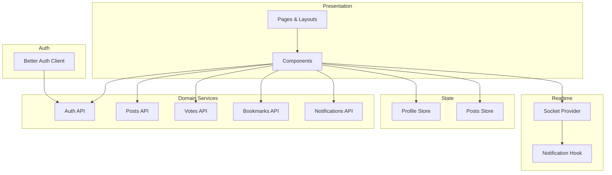

**Diagram sources**
- [auth-client.ts](file://web/src/lib/auth-client.ts#L1-L20)
- [auth.ts](file://web/src/services/api/auth.ts#L1-L156)
- [post.ts](file://web/src/services/api/post.ts#L1-L68)
- [vote.ts](file://web/src/services/api/vote.ts#L1-L27)
- [bookmark.ts](file://web/src/services/api/bookmark.ts#L1-L14)
- [notification.ts](file://web/src/services/api/notification.ts#L1-L11)
- [SocketContext.tsx](file://web/src/socket/SocketContext.tsx#L1-L45)
- [useNotificationSocket.tsx](file://web/src/hooks/useNotificationSocket.tsx#L1-L54)
- [profileStore.ts](file://web/src/store/profileStore.ts)
- [postStore.ts](file://web/src/store/postStore.ts#L1-L30)

## Detailed Component Analysis

### Next.js App Router and Routing Model
- Root layout sets HTML lang and theme container ID, applies font variables and global styles.
- Metadata is exported from a dedicated module for reuse across pages.
- Global fonts and CSS are imported at the root level.
- Next configuration enables React Compiler.

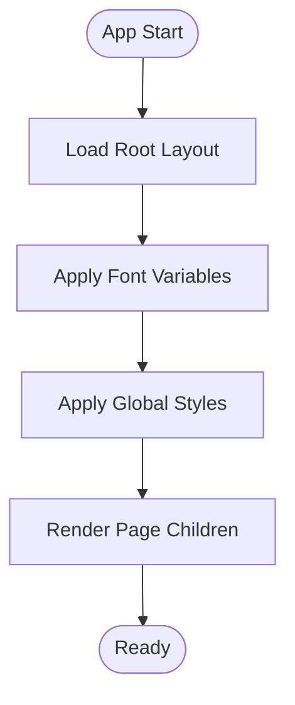

**Diagram sources**
- [layout.tsx](file://web/src/app/layout.tsx#L1-L21)
- [meta.ts](file://web/src/app/meta.ts)
- [fonts.ts](file://web/src/app/fonts.ts)
- [globals.css](file://web/src/app/globals.css)
- [next.config.ts](file://web/next.config.ts#L1-L9)

**Section sources**
- [layout.tsx](file://web/src/app/layout.tsx#L1-L21)
- [meta.ts](file://web/src/app/meta.ts)
- [fonts.ts](file://web/src/app/fonts.ts)
- [globals.css](file://web/src/app/globals.css)
- [next.config.ts](file://web/next.config.ts#L1-L9)

### Authentication Client Setup
- Better Auth client configured with base URL pointing to the backend auth API.
- Plugins include admin client, inferred additional fields, and Google One Tap with popup UX mode.
- Environment variables supply server URI and Google OAuth client ID.

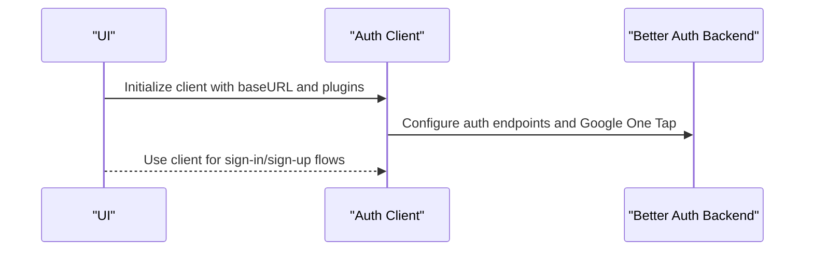

**Diagram sources**
- [auth-client.ts](file://web/src/lib/auth-client.ts#L1-L20)
- [env.ts](file://web/src/config/env.ts)

**Section sources**
- [auth-client.ts](file://web/src/lib/auth-client.ts#L1-L20)
- [auth.ts](file://web/src/services/api/auth.ts#L1-L156)

### API Integration Patterns
- Centralized HTTP client abstracts axios configuration and defaults.
- Typed API modules expose domain-specific functions for auth, posts, votes, bookmarks, and notifications.
- Error handling utilities wrap network calls to provide consistent feedback.

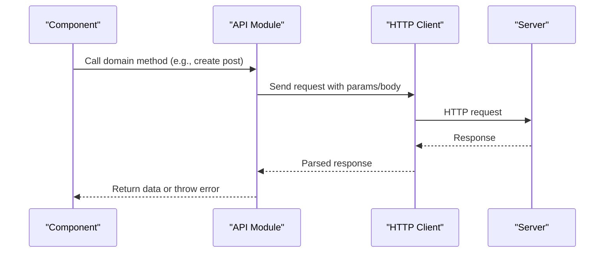

**Diagram sources**
- [http.ts](file://web/src/services/http.ts)
- [post.ts](file://web/src/services/api/post.ts#L1-L68)
- [auth.ts](file://web/src/services/api/auth.ts#L1-L156)
- [useErrorHandler.tsx](file://web/src/hooks/useErrorHandler.tsx)

**Section sources**
- [post.ts](file://web/src/services/api/post.ts#L1-L68)
- [auth.ts](file://web/src/services/api/auth.ts#L1-L156)
- [useErrorHandler.tsx](file://web/src/hooks/useErrorHandler.tsx)

### Real-time Communication via Socket.IO
- Socket provider initializes a connection with WebSocket transport and attaches user ID as auth credentials.
- Notification hook listens for live events, displays toast notifications, and navigates to related content.
- Cleanup disconnects sockets on unmount or profile changes.

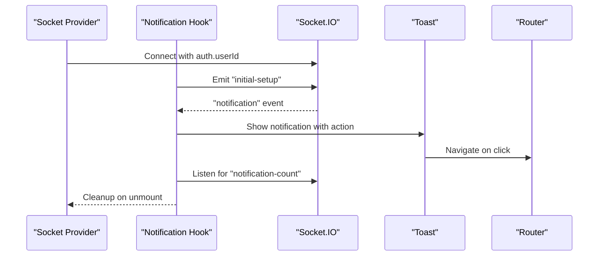

**Diagram sources**
- [SocketContext.tsx](file://web/src/socket/SocketContext.tsx#L1-L45)
- [useNotificationSocket.tsx](file://web/src/hooks/useNotificationSocket.tsx#L1-L54)

**Section sources**
- [SocketContext.tsx](file://web/src/socket/SocketContext.tsx#L1-L45)
- [useNotificationSocket.tsx](file://web/src/hooks/useNotificationSocket.tsx#L1-L54)

### Social Platform Features

#### Post Creation and Editing
- CreatePost component manages form state, validation, moderation checks, and submission.
- Supports updating existing posts and handles terms acceptance flow.
- Uses Zustand store to optimistically update the post list after create/update.

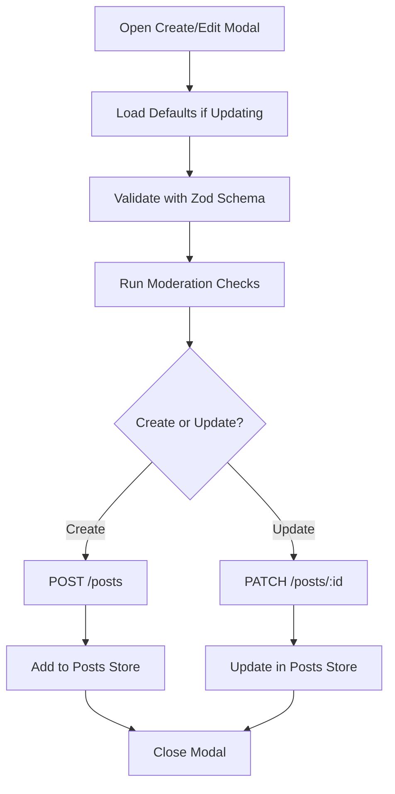

**Diagram sources**
- [CreatePost.tsx](file://web/src/components/general/CreatePost.tsx#L1-L409)
- [postStore.ts](file://web/src/store/postStore.ts#L1-L30)
- [post.ts](file://web/src/services/api/post.ts#L1-L68)
- [moderation.ts](file://web/src/utils/moderation.ts)

**Section sources**
- [CreatePost.tsx](file://web/src/components/general/CreatePost.tsx#L1-L409)
- [postStore.ts](file://web/src/store/postStore.ts#L1-L30)
- [post.ts](file://web/src/services/api/post.ts#L1-L68)

#### Voting System
- EngagementComponent implements optimistic voting with upvote/downvote toggling.
- Handles three actions: create, update, and delete votes depending on current state.
- Updates counts locally and syncs with backend via vote API.

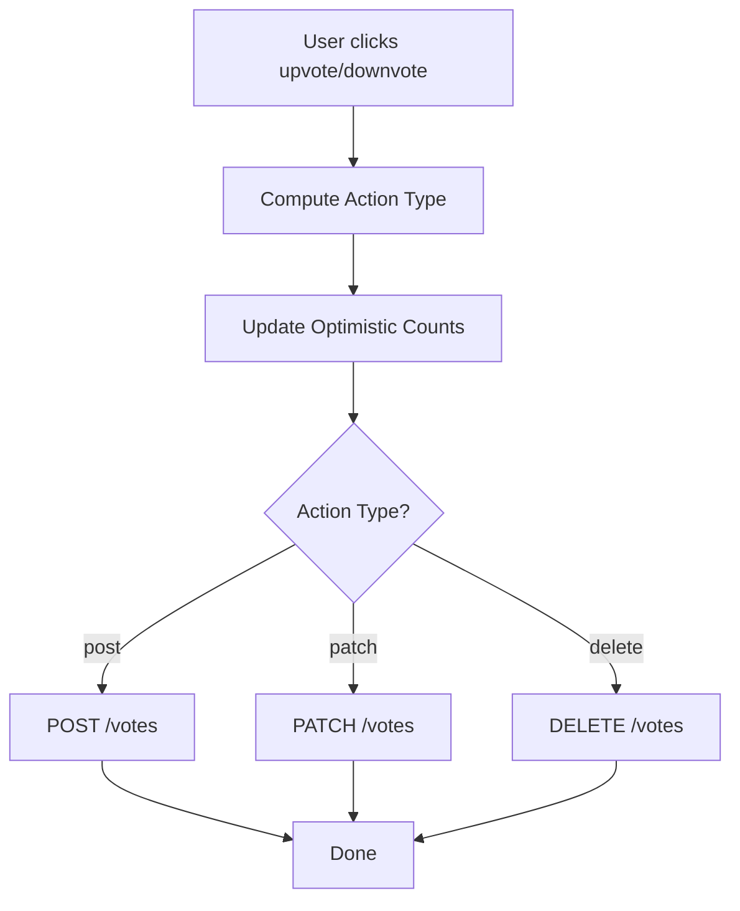

**Diagram sources**
- [EngagementComponent.tsx](file://web/src/components/general/EngagementComponent.tsx#L1-L247)
- [vote.ts](file://web/src/services/api/vote.ts#L1-L27)

**Section sources**
- [EngagementComponent.tsx](file://web/src/components/general/EngagementComponent.tsx#L1-L247)
- [vote.ts](file://web/src/services/api/vote.ts#L1-L27)

#### Bookmarking System
- Bookmark API supports listing, creating, and removing bookmarks.
- Integrates with notification system for live updates.

**Section sources**
- [bookmark.ts](file://web/src/services/api/bookmark.ts#L1-L14)

#### Notifications
- Notification API lists and marks notifications as seen.
- Notification hook subscribes to live events and displays toast notifications with navigation actions.

**Section sources**
- [notification.ts](file://web/src/services/api/notification.ts#L1-L11)
- [useNotificationSocket.tsx](file://web/src/hooks/useNotificationSocket.tsx#L1-L54)

#### Post Rendering and Interaction
- Post component renders metadata, content preview, and engagement metrics.
- Integrates with EngagementComponent for voting and sharing.
- Supports editing for authorized authors via PostDropdown.

**Section sources**
- [Post.tsx](file://web/src/components/general/Post.tsx#L1-L179)
- [EngagementComponent.tsx](file://web/src/components/general/EngagementComponent.tsx#L1-L247)

### Component Architecture and Reusable UI
- UI primitives are implemented as reusable components (buttons, dialogs, selects, inputs, cards, avatars, separators, toasts).
- Components are designed with Tailwind classes and dark mode variants.
- Custom components like EngagementComponent encapsulate complex interactions while remaining composable.

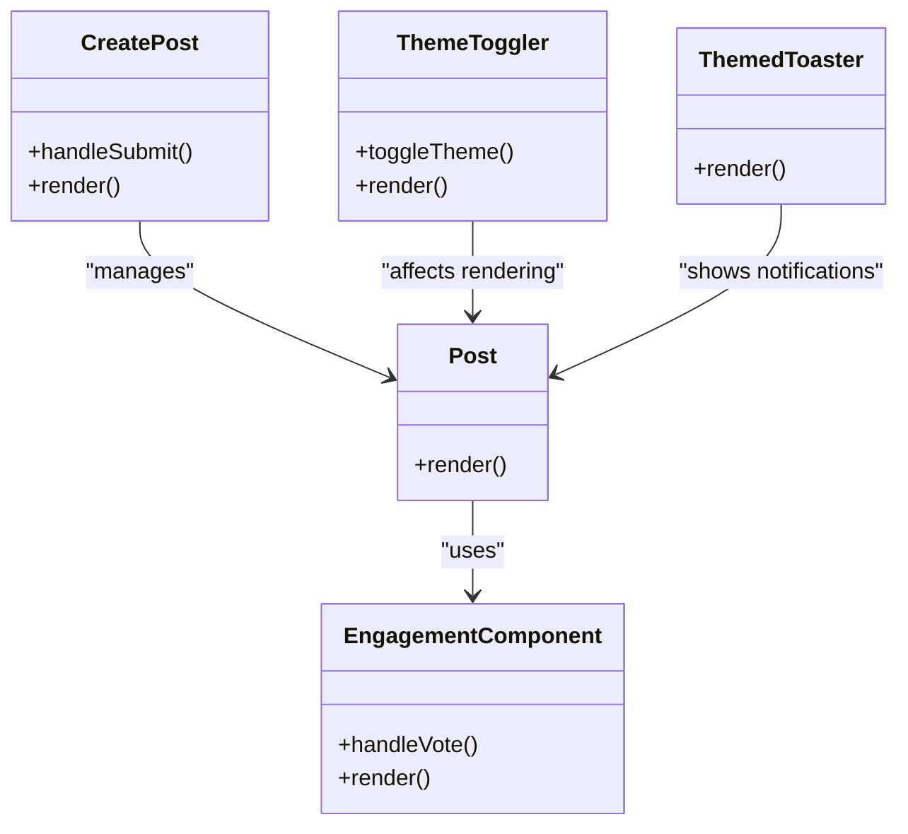

**Diagram sources**
- [Post.tsx](file://web/src/components/general/Post.tsx#L1-L179)
- [EngagementComponent.tsx](file://web/src/components/general/EngagementComponent.tsx#L1-L247)
- [CreatePost.tsx](file://web/src/components/general/CreatePost.tsx#L1-L409)
- [ThemeToggler.tsx](file://web/src/components/general/ThemeToggler.tsx)
- [ThemedToaster.tsx](file://web/src/components/general/ThemedToaster.tsx)

**Section sources**
- [button.tsx](file://web/src/components/ui/button.tsx)
- [dialog.tsx](file://web/src/components/ui/dialog.tsx)
- [select.tsx](file://web/src/components/ui/select.tsx)
- [textarea.tsx](file://web/src/components/ui/textarea.tsx)
- [input.tsx](file://web/src/components/ui/input.tsx)
- [card.tsx](file://web/src/components/ui/card.tsx)
- [avatar.tsx](file://web/src/components/ui/avatar.tsx)
- [separator.tsx](file://web/src/components/ui/separator.tsx)
- [toast.tsx](file://web/src/components/ui/toast.tsx)
- [toaster.tsx](file://web/src/components/ui/toaster.tsx)

### State Management with Zustand
- profileStore holds the authenticated user profile and related state.
- postStore maintains a list of posts and supports add/update/remove operations.
- Stores are consumed by components to enable optimistic UI and reduce prop drilling.

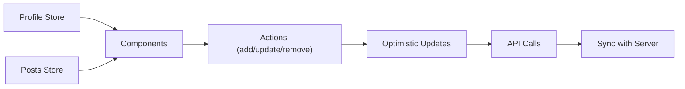

**Diagram sources**
- [profileStore.ts](file://web/src/store/profileStore.ts)
- [postStore.ts](file://web/src/store/postStore.ts#L1-L30)

**Section sources**
- [profileStore.ts](file://web/src/store/profileStore.ts)
- [postStore.ts](file://web/src/store/postStore.ts#L1-L30)

### Theming, Fonts, and Styling
- Typography: Font variables are applied at the root layout for system-safe font stacks.
- Theming: Theme methods support toggling and persisting theme preferences.
- Styling: Tailwind CSS classes dominate component styling; dark mode variants are used extensively.

**Section sources**
- [layout.tsx](file://web/src/app/layout.tsx#L1-L21)
- [fonts.ts](file://web/src/app/fonts.ts)
- [themeMethods.ts](file://web/src/utils/themeMethods.ts)

## Dependency Analysis
External dependencies include Next.js, React, Better Auth, Socket.IO client, Axios, Radix UI, Tailwind CSS v4, Zustand, and Sonner for toasts. These enable modern UI patterns, authentication, real-time features, and state management.

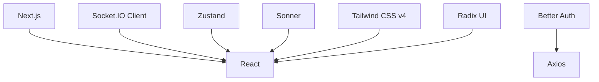

**Diagram sources**
- [package.json](file://web/package.json#L1-L67)

**Section sources**
- [package.json](file://web/package.json#L1-L67)

## Performance Considerations
- Optimize re-renders by using selective state extraction from Zustand stores.
- Debounce or batch API calls for frequent interactions like voting.
- Lazy-load non-critical components and images.
- Use React Compiler and Tailwind’s purge to minimize CSS and JS bundles.
- Implement caching strategies for posts and user profiles.

## Troubleshooting Guide
- Authentication failures: Verify base URL and Google OAuth client ID in environment variables. Check OTP flows and session refresh endpoints.
- Socket connection issues: Ensure server endpoint origin matches client configuration and that auth.userId is present before connecting.
- API errors: Wrap calls with error handler to display user-friendly messages and retry logic.
- Moderation warnings: Review moderation configuration and censored previews to guide content creators.

**Section sources**
- [auth-client.ts](file://web/src/lib/auth-client.ts#L1-L20)
- [SocketContext.tsx](file://web/src/socket/SocketContext.tsx#L1-L45)
- [useErrorHandler.tsx](file://web/src/hooks/useErrorHandler.tsx)
- [moderation.ts](file://web/src/utils/moderation.ts)

## Conclusion
The Flick web application frontend leverages Next.js App Router for structured routing, Better Auth for robust authentication, Socket.IO for real-time notifications, and a cohesive set of UI components styled with Tailwind CSS. Zustand stores enable efficient state management, while typed API modules and optimistic UI patterns deliver a responsive social platform experience.

## Appendices

### Authentication Flows
- Sign-in/Sign-up: Use Better Auth client with Google One Tap.
- OTP verification: Dedicated endpoints for registration and login OTP flows.
- Password management: Status, set, and reset flows with secure tokens.

**Section sources**
- [auth-client.ts](file://web/src/lib/auth-client.ts#L1-L20)
- [auth.ts](file://web/src/services/api/auth.ts#L1-L156)

### User Profile Management
- Fetch current user profile via authenticated endpoint.
- Onboarding completion and account deletion supported.

**Section sources**
- [auth.ts](file://web/src/services/api/auth.ts#L1-L156)

### Notification Systems
- List and mark notifications as seen.
- Live notifications with toast actions and navigation.

**Section sources**
- [notification.ts](file://web/src/services/api/notification.ts#L1-L11)
- [useNotificationSocket.tsx](file://web/src/hooks/useNotificationSocket.tsx#L1-L54)

### Responsive Design Patterns
- Tailwind utilities for responsive breakpoints and spacing.
- Dark mode variants across components for accessibility.

**Section sources**
- [button.tsx](file://web/src/components/ui/button.tsx)
- [card.tsx](file://web/src/components/ui/card.tsx)
- [avatar.tsx](file://web/src/components/ui/avatar.tsx)