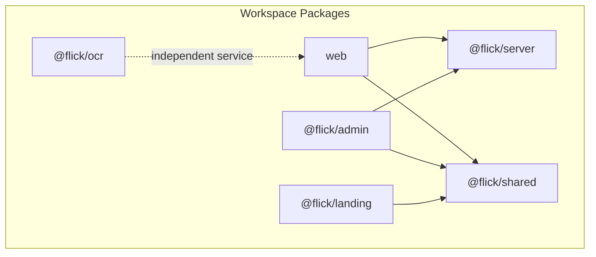
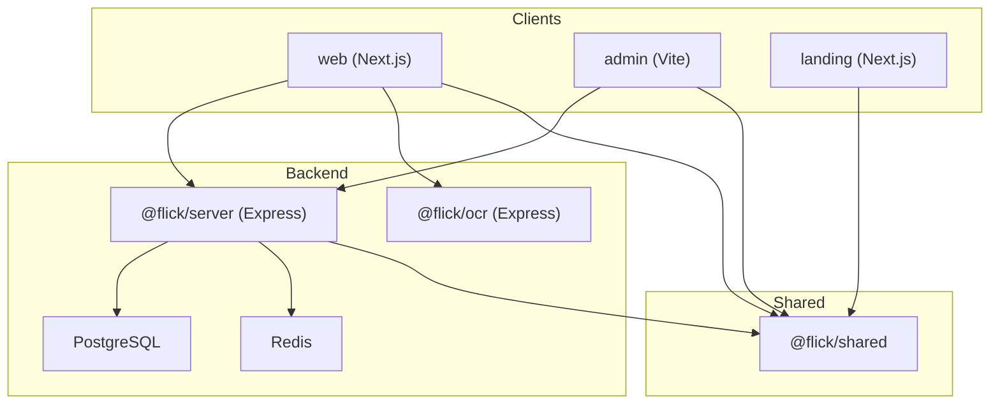
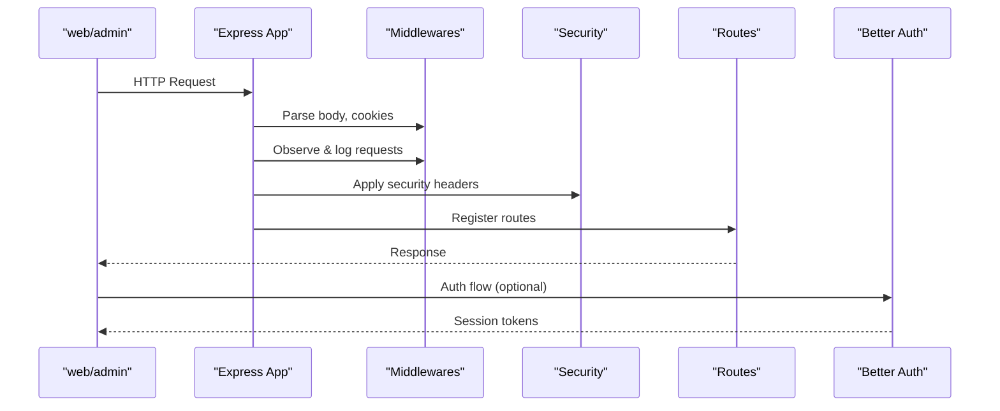
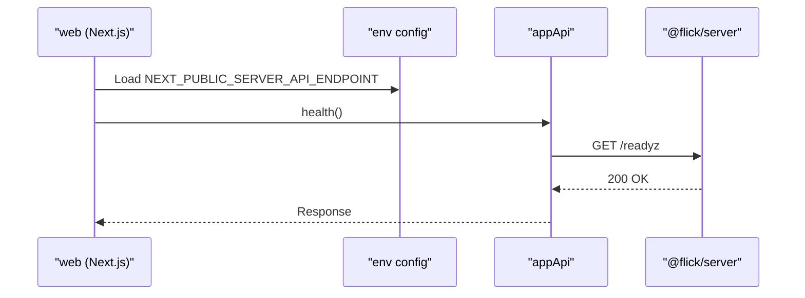
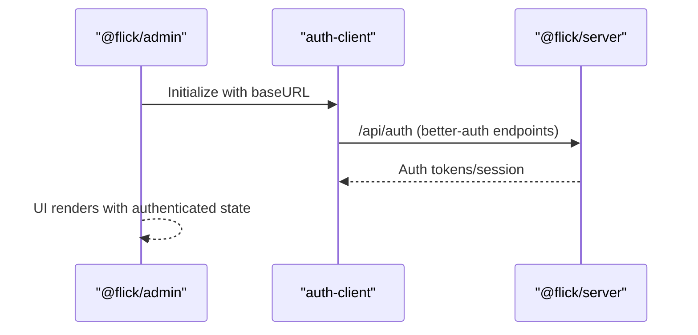
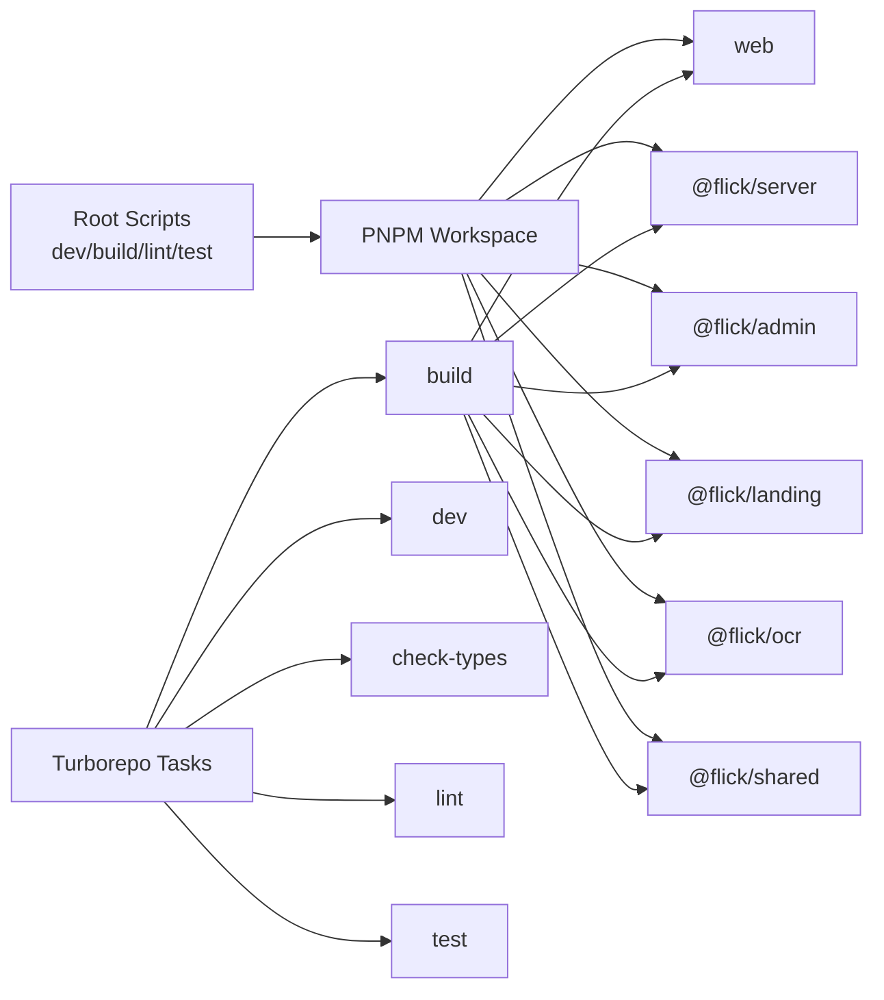
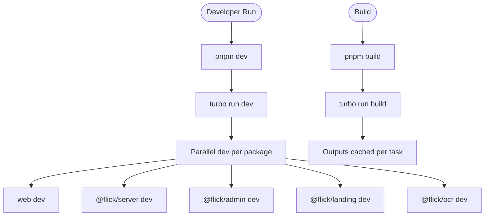

# Monorepo Structure

<cite>
**Referenced Files in This Document**
- [package.json](file://package.json)
- [pnpm-workspace.yaml](file://pnpm-workspace.yaml)
- [turbo.json](file://turbo.json)
- [shared/package.json](file://shared/package.json)
- [shared/src/index.ts](file://shared/src/index.ts)
- [server/package.json](file://server/package.json)
- [server/src/app.ts](file://server/src/app.ts)
- [server/src/routes/index.ts](file://server/src/routes/index.ts)
- [web/package.json](file://web/package.json)
- [web/src/config/env.ts](file://web/src/config/env.ts)
- [web/src/services/api/app.ts](file://web/src/services/api/app.ts)
- [admin/package.json](file://admin/package.json)
- [admin/src/lib/auth-client.ts](file://admin/src/lib/auth-client.ts)
- [admin/src/config/env.ts](file://admin/src/config/env.ts)
- [landing/package.json](file://landing/package.json)
- [landing/src/app/layout.tsx](file://landing/src/app/layout.tsx)
- [ocr/package.json](file://ocr/package.json)
</cite>

## Table of Contents
1. [Introduction](#introduction)
2. [Project Structure](#project-structure)
3. [Core Components](#core-components)
4. [Architecture Overview](#architecture-overview)
5. [Detailed Component Analysis](#detailed-component-analysis)
6. [Dependency Analysis](#dependency-analysis)
7. [Performance Considerations](#performance-considerations)
8. [Troubleshooting Guide](#troubleshooting-guide)
9. [Conclusion](#conclusion)
10. [Appendices](#appendices)

## Introduction
This document explains the Flick monorepo architecture and its five-package structure: server, web, admin, landing, and ocr. It covers workspace configuration with PNPM, dependency management, task orchestration with Turborepo, shared library usage, cross-package dependencies, build pipelines, development workflows, and deployment strategies. Practical examples illustrate how packages interact and why this monorepo approach benefits the system.

## Project Structure
The repository is organized as a PNPM workspace containing six packages:
- server: Express-based backend with modular routes, authentication, caching, and database integrations
- web: Next.js frontend application for student interactions, posts, comments, notifications, and OAuth
- admin: Vite-based admin dashboard for moderation and analytics
- landing: Next.js marketing site for outreach and onboarding
- ocr: Standalone OCR service for extracting text from images
- shared: Internal TypeScript library published under @flick/shared for reusable types and utilities

Workspace and orchestration are configured via PNPM workspace and Turborepo.

**Diagram sources**
- [pnpm-workspace.yaml](file://pnpm-workspace.yaml#L1-L15)
- [turbo.json](file://turbo.json#L1-L27)
- [server/package.json](file://server/package.json#L1-L80)
- [web/package.json](file://web/package.json#L1-L67)
- [admin/package.json](file://admin/package.json#L1-L78)
- [landing/package.json](file://landing/package.json#L1-L37)
- [ocr/package.json](file://ocr/package.json#L1-L33)
- [shared/package.json](file://shared/package.json#L1-L19)

**Section sources**
- [pnpm-workspace.yaml](file://pnpm-workspace.yaml#L1-L15)
- [turbo.json](file://turbo.json#L1-L27)
- [package.json](file://package.json#L1-L32)

## Core Components
- server: Provides REST APIs, authentication, rate limiting, logging, and real-time features via Socket.IO. Routes are modularized per domain (auth, user, post, vote, moderation, admin).
- web: Next.js application consuming server APIs, managing user sessions, notifications, and OAuth flows.
- admin: Vite app for administrative tasks, leveraging better-auth client and Radix UI components.
- landing: Next.js marketing site with animations and typography assets.
- ocr: Express-based OCR microservice using Tesseract.js for image-to-text extraction.
- shared: Internal library exporting utilities and types consumed by server, web, and admin.

Key integration points:
- Environment-driven base URLs connect web and admin to server and OCR endpoints.
- better-auth client integrates admin with server’s auth endpoints.
- Modular routing in server exposes domain-specific endpoints for clients to consume.

**Section sources**
- [server/src/app.ts](file://server/src/app.ts#L1-L33)
- [server/src/routes/index.ts](file://server/src/routes/index.ts#L1-L39)
- [web/src/config/env.ts](file://web/src/config/env.ts#L1-L29)
- [web/src/services/api/app.ts](file://web/src/services/api/app.ts#L1-L11)
- [admin/src/lib/auth-client.ts](file://admin/src/lib/auth-client.ts#L1-L11)
- [admin/src/config/env.ts](file://admin/src/config/env.ts#L1-L5)
- [landing/src/app/layout.tsx](file://landing/src/app/layout.tsx#L1-L27)
- [ocr/package.json](file://ocr/package.json#L1-L33)
- [shared/src/index.ts](file://shared/src/index.ts#L1-L8)

## Architecture Overview
The system follows a client-server model with complementary UIs and a dedicated OCR service:
- web and admin are frontends that communicate with server via REST and Socket.IO
- server manages authentication, business logic, persistence, and moderation
- landing serves marketing content
- OCR is a separate service invoked by web when needed

**Diagram sources**
- [server/src/app.ts](file://server/src/app.ts#L1-L33)
- [server/src/routes/index.ts](file://server/src/routes/index.ts#L1-L39)
- [web/src/config/env.ts](file://web/src/config/env.ts#L1-L29)
- [admin/src/lib/auth-client.ts](file://admin/src/lib/auth-client.ts#L1-L11)
- [landing/src/app/layout.tsx](file://landing/src/app/layout.tsx#L1-L27)
- [ocr/package.json](file://ocr/package.json#L1-L33)
- [shared/package.json](file://shared/package.json#L1-L19)

## Detailed Component Analysis

### Server Package
Purpose:
- Central API gateway, authentication, rate limiting, logging, and real-time features
- Modular route registration for posts, users, votes, bookmarks, colleges, comments, feedback, moderation, and admin

Key implementation highlights:
- Express app bootstrapped with middleware, security, and logging
- Route registration groups endpoints by domain
- Uses better-auth for authentication and Socket.IO for real-time updates

**Diagram sources**
- [server/src/app.ts](file://server/src/app.ts#L1-L33)
- [server/src/routes/index.ts](file://server/src/routes/index.ts#L1-L39)

**Section sources**
- [server/src/app.ts](file://server/src/app.ts#L1-L33)
- [server/src/routes/index.ts](file://server/src/routes/index.ts#L1-L39)
- [server/package.json](file://server/package.json#L1-L80)

### Web Package
Purpose:
- Next.js application for student interactions, posts, comments, notifications, and OAuth
- Consumes server APIs and initializes better-auth client for session management

Key implementation highlights:
- Environment configuration validates and exposes base URLs for server and OCR
- API client calls server readiness endpoint
- Integrates better-auth client for auth flows

**Diagram sources**
- [web/src/config/env.ts](file://web/src/config/env.ts#L1-L29)
- [web/src/services/api/app.ts](file://web/src/services/api/app.ts#L1-L11)

**Section sources**
- [web/package.json](file://web/package.json#L1-L67)
- [web/src/config/env.ts](file://web/src/config/env.ts#L1-L29)
- [web/src/services/api/app.ts](file://web/src/services/api/app.ts#L1-L11)

### Admin Package
Purpose:
- Vite-based admin dashboard for moderation and analytics
- Uses better-auth client to integrate with server auth

Key implementation highlights:
- better-auth client configured with server auth base URL
- Environment-driven configuration for API and socket endpoints

**Diagram sources**
- [admin/src/lib/auth-client.ts](file://admin/src/lib/auth-client.ts#L1-L11)
- [admin/src/config/env.ts](file://admin/src/config/env.ts#L1-L5)

**Section sources**
- [admin/package.json](file://admin/package.json#L1-L78)
- [admin/src/lib/auth-client.ts](file://admin/src/lib/auth-client.ts#L1-L11)
- [admin/src/config/env.ts](file://admin/src/config/env.ts#L1-L5)

### Landing Package
Purpose:
- Next.js marketing site for outreach and onboarding
- Uses shared assets and typography

Key implementation highlights:
- Layout defines metadata and font variables
- Consumes shared resources via shared package exports

**Section sources**
- [landing/package.json](file://landing/package.json#L1-L37)
- [landing/src/app/layout.tsx](file://landing/src/app/layout.tsx#L1-L27)
- [shared/package.json](file://shared/package.json#L1-L19)

### OCR Package
Purpose:
- Standalone OCR microservice using Tesseract.js for image-to-text extraction
- Exposed as a separate service for scalability and isolation

Key implementation highlights:
- Express server with multer for uploads and CORS support
- Intended to be invoked by web when OCR is needed

**Section sources**
- [ocr/package.json](file://ocr/package.json#L1-L33)

### Shared Library (@flick/shared)
Purpose:
- Internal library for reusable utilities and types
- Exported via named exports for selective consumption

Key implementation highlights:
- Declares exports for root and subpath modules
- Used by server, web, and admin

**Section sources**
- [shared/package.json](file://shared/package.json#L1-L19)
- [shared/src/index.ts](file://shared/src/index.ts#L1-L8)

## Dependency Analysis
Workspace and build orchestration:
- PNPM workspace enumerates all packages and marks specific native dependencies as onlyBuiltDependencies
- Turborepo defines task contracts for build, dev, check-types, lint, and test with inter-package caching and outputs

**Diagram sources**
- [pnpm-workspace.yaml](file://pnpm-workspace.yaml#L1-L15)
- [turbo.json](file://turbo.json#L1-L27)
- [package.json](file://package.json#L10-L16)

Inter-package dependencies:
- web depends on @flick/shared and server for auth and API
- admin depends on @flick/shared and server for auth and moderation
- server depends on @flick/shared and internal modules
- landing depends on @flick/shared for shared assets
- ocr is independent and invoked by web

**Section sources**
- [pnpm-workspace.yaml](file://pnpm-workspace.yaml#L1-L15)
- [turbo.json](file://turbo.json#L1-L27)
- [web/package.json](file://web/package.json#L14-L14)
- [server/package.json](file://server/package.json#L27-L27)
- [admin/package.json](file://admin/package.json#L1-L78)
- [shared/package.json](file://shared/package.json#L14-L17)

## Performance Considerations
- Turborepo caching: build outputs are cached per task; inter-package dependencies trigger downstream builds efficiently
- Only-built dependencies: specific native-heavy packages are built only when necessary to reduce install overhead
- Frontend frameworks: Next.js and Vite offer optimized dev servers and production builds
- Server-side concerns: rate limiting, request logging, and Redis caching improve throughput and reliability

[No sources needed since this section provides general guidance]

## Troubleshooting Guide
Common areas to inspect:
- Environment configuration mismatches between web/admin and server/OCR endpoints
- Authentication client base URL alignment with server auth routes
- Route registration completeness in server to avoid 404s
- Build outputs and cache invalidation when switching branches

Practical checks:
- Verify NEXT_PUBLIC_SERVER_API_ENDPOINT and NEXT_PUBLIC_OCR_SERVER_API_ENDPOINT in web
- Confirm VITE_SERVER_URI in admin points to the same server
- Ensure server routes are registered in the central router
- Clear turborepo cache if incremental builds appear stale

**Section sources**
- [web/src/config/env.ts](file://web/src/config/env.ts#L1-L29)
- [admin/src/config/env.ts](file://admin/src/config/env.ts#L1-L5)
- [server/src/routes/index.ts](file://server/src/routes/index.ts#L20-L38)

## Conclusion
The Flick monorepo leverages PNPM workspaces and Turborepo to coordinate five distinct packages: server, web, admin, landing, and ocr. A shared library promotes reuse across packages, while environment-driven configuration ensures flexible deployments. The modular server architecture and client integrations enable scalable development and clear separation of concerns.

[No sources needed since this section summarizes without analyzing specific files]

## Appendices

### Build Pipeline and Development Workflow
- Root scripts orchestrate parallel development across packages
- Turborepo tasks define caching and outputs for efficient incremental builds
- Each package runs its own dev/build commands tailored to its framework

**Diagram sources**
- [package.json](file://package.json#L10-L16)
- [turbo.json](file://turbo.json#L3-L26)

### Deployment Strategies
- server: Containerized with Docker; orchestrated via docker-compose for DB and Redis; migrations handled via drizzle-kit
- web: Next.js static generation and server runtime; deployable to any static host or SSR provider
- admin: Vite build; deployable to static hosting or CDN
- landing: Next.js build; suitable for static hosting
- ocr: Standalone Express service; containerized and deployed independently

[No sources needed since this section provides general guidance]