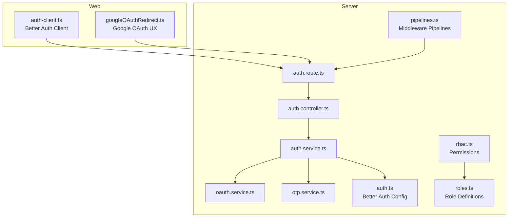
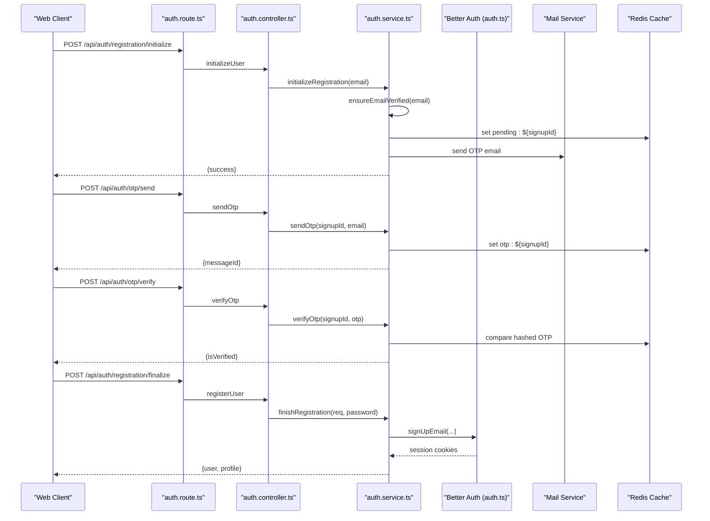
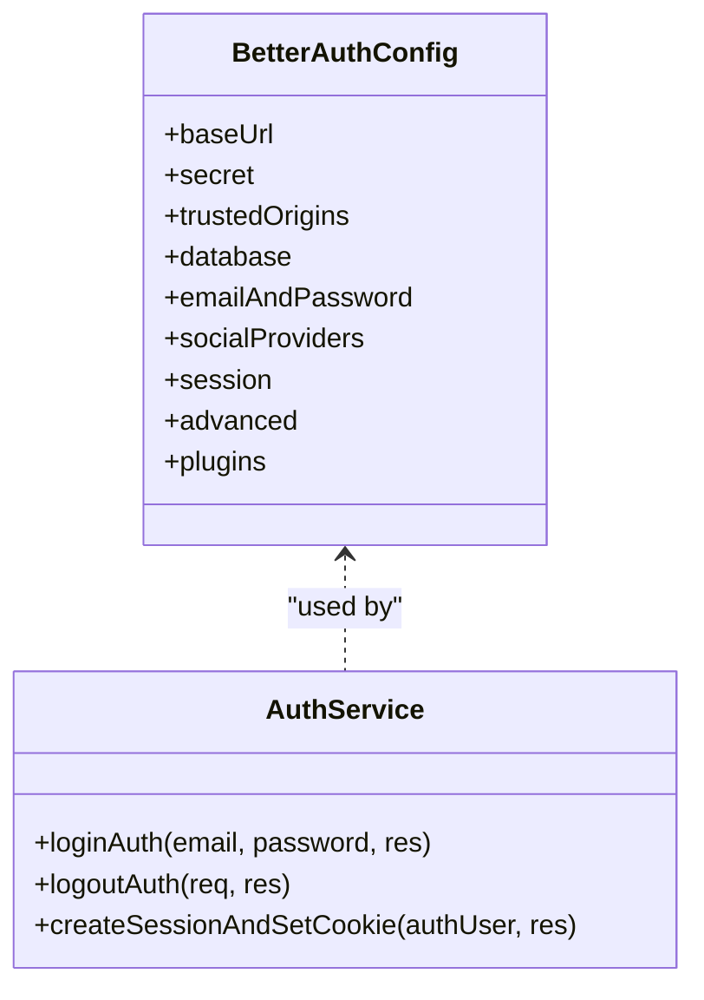
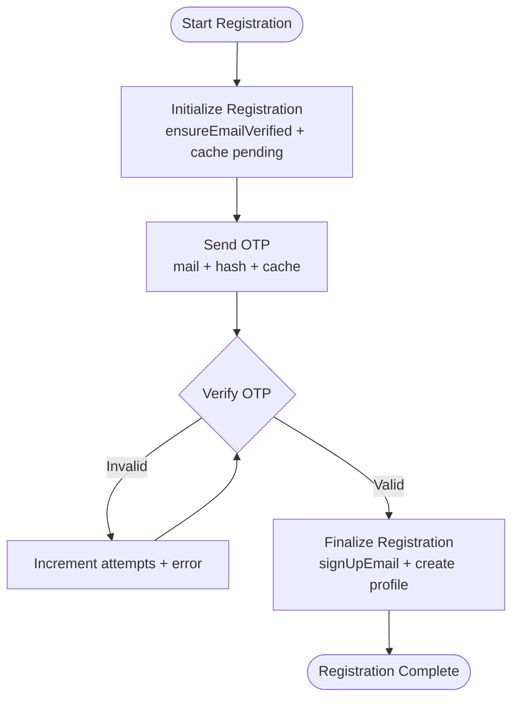
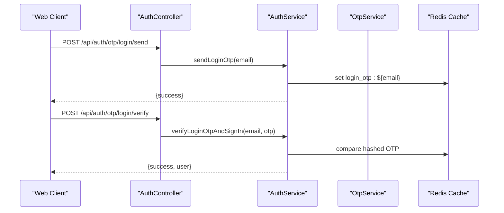
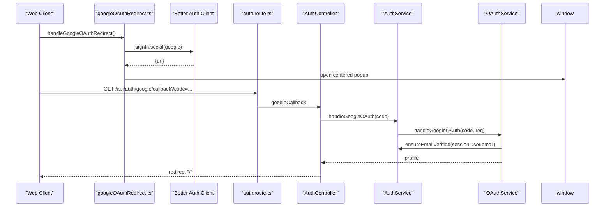
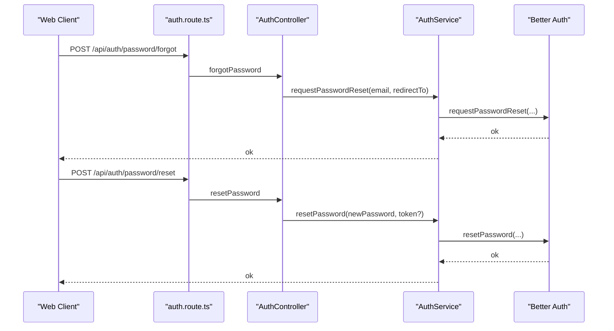
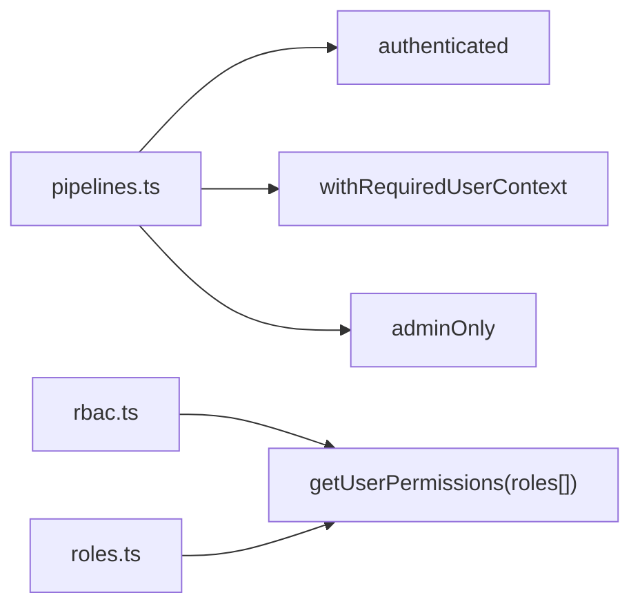
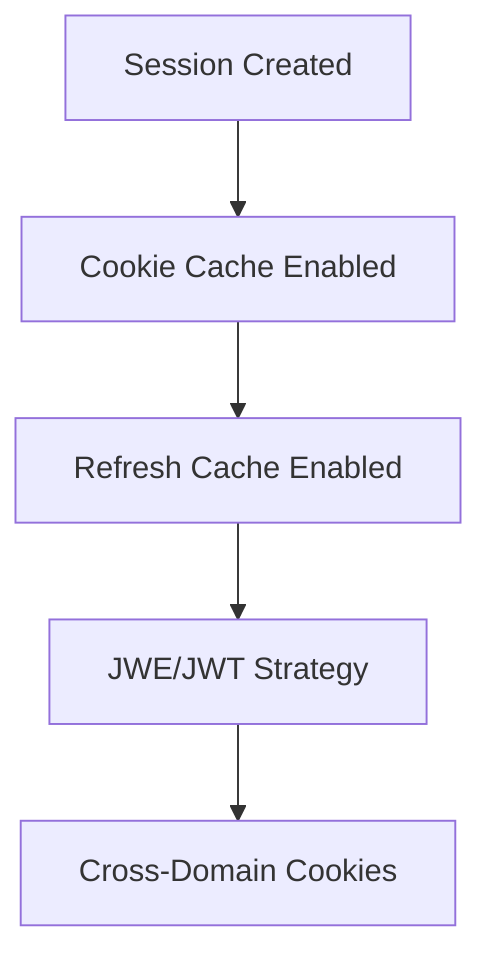
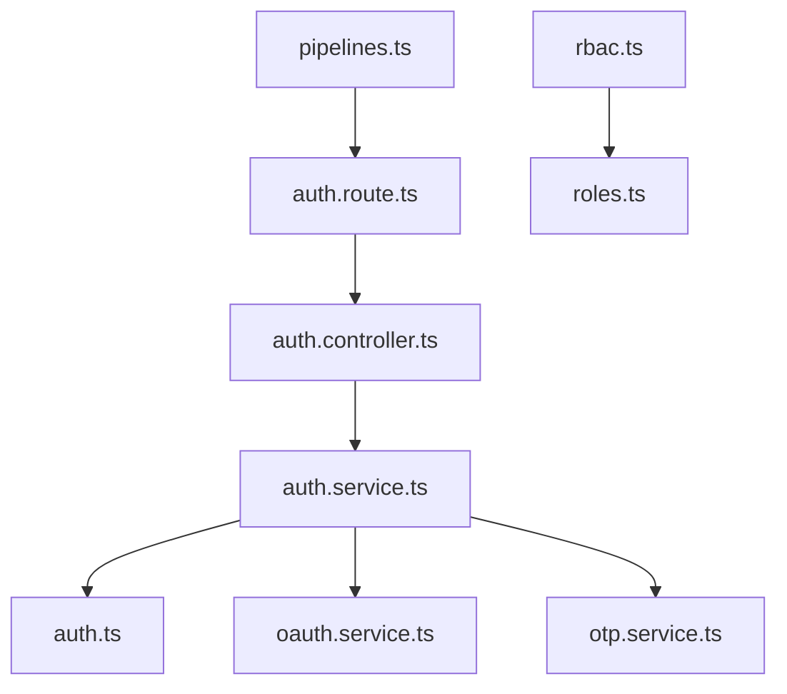

# Authentication System

<cite>
**Referenced Files in This Document**
- [auth.service.ts](file://server/src/modules/auth/auth.service.ts)
- [auth.controller.ts](file://server/src/modules/auth/auth.controller.ts)
- [auth.route.ts](file://server/src/modules/auth/auth.route.ts)
- [auth.schema.ts](file://server/src/modules/auth/auth.schema.ts)
- [oauth.service.ts](file://server/src/modules/auth/oauth/oauth.service.ts)
- [otp.service.ts](file://server/src/modules/auth/otp/otp.service.ts)
- [auth.ts](file://server/src/infra/auth/auth.ts)
- [rbac.ts](file://server/src/core/security/rbac.ts)
- [roles.ts](file://server/src/config/roles.ts)
- [pipelines.ts](file://server/src/core/middlewares/pipelines.ts)
- [auth-client.ts](file://web/src/lib/auth-client.ts)
- [googleOAuthRedirect.ts](file://web/src/utils/googleOAuthRedirect.ts)
- [auth.schema.ts](file://server/src/shared/validators/auth.schema.ts)
</cite>

## Table of Contents
1. [Introduction](#introduction)
2. [Project Structure](#project-structure)
3. [Core Components](#core-components)
4. [Architecture Overview](#architecture-overview)
5. [Detailed Component Analysis](#detailed-component-analysis)
6. [Dependency Analysis](#dependency-analysis)
7. [Performance Considerations](#performance-considerations)
8. [Troubleshooting Guide](#troubleshooting-guide)
9. [Conclusion](#conclusion)

## Introduction
This document provides comprehensive documentation for the Flick authentication system. It covers the multi-stage registration process, OTP verification workflow, OAuth integration with Google, session management, Better Auth integration, JWT token handling, refresh token mechanisms, and security measures. It also explains user registration flows, email verification, password recovery, and account activation processes. Additionally, it documents authentication middleware implementation, role-based access control (RBAC), and permission systems, along with practical integration patterns for common authentication scenarios.

## Project Structure
The authentication system spans backend and frontend modules:
- Backend (server):
  - Authentication service orchestrating Better Auth, OTP, and OAuth flows
  - Controllers and routes exposing REST endpoints
  - Middleware for authentication, authorization, and RBAC
  - Better Auth configuration for sessions, cookies, and plugins
- Frontend (web):
  - Better Auth client configured for React integration
  - Utility for initiating Google OAuth with popup/redirect UX

**Diagram sources**
- [auth.route.ts](file://server/src/modules/auth/auth.route.ts#L1-L44)
- [auth.controller.ts](file://server/src/modules/auth/auth.controller.ts#L1-L228)
- [auth.service.ts](file://server/src/modules/auth/auth.service.ts#L1-L782)
- [oauth.service.ts](file://server/src/modules/auth/oauth/oauth.service.ts#L1-L76)
- [otp.service.ts](file://server/src/modules/auth/otp/otp.service.ts#L1-L44)
- [auth.ts](file://server/src/infra/auth/auth.ts#L1-L85)
- [pipelines.ts](file://server/src/core/middlewares/pipelines.ts#L1-L28)
- [rbac.ts](file://server/src/core/security/rbac.ts#L1-L15)
- [roles.ts](file://server/src/config/roles.ts#L1-L11)
- [auth-client.ts](file://web/src/lib/auth-client.ts#L1-L20)
- [googleOAuthRedirect.ts](file://web/src/utils/googleOAuthRedirect.ts#L1-L56)

**Section sources**
- [auth.route.ts](file://server/src/modules/auth/auth.route.ts#L1-L44)
- [auth.controller.ts](file://server/src/modules/auth/auth.controller.ts#L1-L228)
- [auth.service.ts](file://server/src/modules/auth/auth.service.ts#L1-L782)
- [auth.ts](file://server/src/infra/auth/auth.ts#L1-L85)
- [pipelines.ts](file://server/src/core/middlewares/pipelines.ts#L1-L28)
- [rbac.ts](file://server/src/core/security/rbac.ts#L1-L15)
- [roles.ts](file://server/src/config/roles.ts#L1-L11)
- [auth-client.ts](file://web/src/lib/auth-client.ts#L1-L20)
- [googleOAuthRedirect.ts](file://web/src/utils/googleOAuthRedirect.ts#L1-L56)

## Core Components
- Better Auth configuration:
  - Centralized session management, cookie caching, and plugin integration
  - Email/password with verification and password reset hooks
  - Social providers (Google) and advanced cookie settings
- Authentication service:
  - Multi-stage registration with pending user cache and OTP verification
  - Login via credentials or OTP
  - Password reset and set/change password flows
  - Cleanup of orphaned auth users
- OAuth service:
  - Google OAuth callback handling and profile creation for verified student emails
- OTP service:
  - OTP generation, hashing, caching, and verification
- Middleware and RBAC:
  - Authentication pipelines, role checks, and permission derivation
- Frontend client:
  - Better Auth React client with admin and one-tap plugins
  - Google OAuth redirect utility with popup UX

**Section sources**
- [auth.ts](file://server/src/infra/auth/auth.ts#L1-L85)
- [auth.service.ts](file://server/src/modules/auth/auth.service.ts#L1-L782)
- [oauth.service.ts](file://server/src/modules/auth/oauth/oauth.service.ts#L1-L76)
- [otp.service.ts](file://server/src/modules/auth/otp/otp.service.ts#L1-L44)
- [pipelines.ts](file://server/src/core/middlewares/pipelines.ts#L1-L28)
- [rbac.ts](file://server/src/core/security/rbac.ts#L1-L15)
- [roles.ts](file://server/src/config/roles.ts#L1-L11)
- [auth-client.ts](file://web/src/lib/auth-client.ts#L1-L20)
- [googleOAuthRedirect.ts](file://web/src/utils/googleOAuthRedirect.ts#L1-L56)

## Architecture Overview
The system integrates Better Auth for session and cookie management, while the server exposes REST endpoints for registration, OTP, OAuth, and password operations. Frontend clients use the Better Auth React client and a dedicated Google OAuth utility.

**Diagram sources**
- [auth.route.ts](file://server/src/modules/auth/auth.route.ts#L10-L16)
- [auth.controller.ts](file://server/src/modules/auth/auth.controller.ts#L100-L117)
- [auth.service.ts](file://server/src/modules/auth/auth.service.ts#L48-L103)
- [auth.ts](file://server/src/infra/auth/auth.ts#L11-L85)

## Detailed Component Analysis

### Better Auth Integration and Session Management
- Configuration:
  - Base URL, secret, trusted origins, and Drizzle adapter
  - Cookie caching with JWE/JWT strategy and refresh cache enabled
  - Cross-subdomain cookies and secure defaults
  - Plugins: two-factor, admin
- Behavior:
  - Email/password with verification and reset hooks
  - Social login via Google with client credentials
  - Account cookie storage for stateless flows

**Diagram sources**
- [auth.ts](file://server/src/infra/auth/auth.ts#L11-L85)
- [auth.service.ts](file://server/src/modules/auth/auth.service.ts#L340-L422)

**Section sources**
- [auth.ts](file://server/src/infra/auth/auth.ts#L1-L85)
- [auth.service.ts](file://server/src/modules/auth/auth.service.ts#L340-L422)

### Multi-Stage Registration Flow
- Initialization:
  - Validates student email domain and disposable email policy
  - Generates UUID-based signup ID, encrypts email, caches pending user, sets cookie
- OTP Verification:
  - Sends OTP via mail service, stores hashed OTP in cache
  - Verifies OTP with attempt limits and cleanup on failure
- Finalization:
  - Creates Better Auth email account if new, marks email verified
  - Creates user profile with ONBOARDING status
  - Clears pending cache and cookies

**Diagram sources**
- [auth.service.ts](file://server/src/modules/auth/auth.service.ts#L48-L103)
- [otp.service.ts](file://server/src/modules/auth/otp/otp.service.ts#L8-L31)
- [auth.service.ts](file://server/src/modules/auth/auth.service.ts#L149-L243)

**Section sources**
- [auth.service.ts](file://server/src/modules/auth/auth.service.ts#L48-L103)
- [otp.service.ts](file://server/src/modules/auth/otp/otp.service.ts#L8-L31)
- [auth.service.ts](file://server/src/modules/auth/auth.service.ts#L149-L243)

### OTP Verification Workflow
- Login OTP:
  - Rate-limited per email with cooldown and attempt counters
  - Stores hashed OTP in cache; compares on verification
- Registration OTP:
  - Similar flow but scoped to pending signup sessions

**Diagram sources**
- [auth.controller.ts](file://server/src/modules/auth/auth.controller.ts#L189-L201)
- [auth.service.ts](file://server/src/modules/auth/auth.service.ts#L591-L681)
- [otp.service.ts](file://server/src/modules/auth/otp/otp.service.ts#L33-L41)

**Section sources**
- [auth.controller.ts](file://server/src/modules/auth/auth.controller.ts#L189-L201)
- [auth.service.ts](file://server/src/modules/auth/auth.service.ts#L591-L681)
- [otp.service.ts](file://server/src/modules/auth/otp/otp.service.ts#L33-L41)

### OAuth Integration with Google
- Frontend:
  - Initiates Google OAuth via Better Auth client with popup UX
  - Redirects to callback URL on success
- Backend:
  - Exchanges authorization code for tokens
  - Ensures email verification and creates user profile if needed
  - Records audit event for account creation

**Diagram sources**
- [googleOAuthRedirect.ts](file://web/src/utils/googleOAuthRedirect.ts#L6-L20)
- [auth-client.ts](file://web/src/lib/auth-client.ts#L9-L19)
- [auth.route.ts](file://server/src/modules/auth/auth.route.ts#L17-L17)
- [auth.controller.ts](file://server/src/modules/auth/auth.controller.ts#L94-L98)
- [oauth.service.ts](file://server/src/modules/auth/oauth/oauth.service.ts#L13-L72)
- [auth.service.ts](file://server/src/modules/auth/auth.service.ts#L288-L308)

**Section sources**
- [googleOAuthRedirect.ts](file://web/src/utils/googleOAuthRedirect.ts#L6-L20)
- [auth-client.ts](file://web/src/lib/auth-client.ts#L9-L19)
- [auth.route.ts](file://server/src/modules/auth/auth.route.ts#L17-L17)
- [auth.controller.ts](file://server/src/modules/auth/auth.controller.ts#L94-L98)
- [oauth.service.ts](file://server/src/modules/auth/oauth/oauth.service.ts#L13-L72)
- [auth.service.ts](file://server/src/modules/auth/auth.service.ts#L288-L308)

### Password Recovery and Management
- Password reset:
  - Requests reset via Better Auth; optionally auto-verifies email on reset completion
- Set/change password:
  - Requires session; supports changing existing password or setting password for OAuth-only users
  - Revokes other sessions when applicable

**Diagram sources**
- [auth.controller.ts](file://server/src/modules/auth/auth.controller.ts#L136-L158)
- [auth.service.ts](file://server/src/modules/auth/auth.service.ts#L480-L529)
- [auth.ts](file://server/src/infra/auth/auth.ts#L38-L54)

**Section sources**
- [auth.controller.ts](file://server/src/modules/auth/auth.controller.ts#L136-L158)
- [auth.service.ts](file://server/src/modules/auth/auth.service.ts#L480-L529)
- [auth.ts](file://server/src/infra/auth/auth.ts#L38-L54)

### Authentication Middleware and RBAC
- Middleware pipelines:
  - Identity, authenticated, withRequiredUserContext, withOptionalUserContext, adminOnly
- RBAC:
  - Role-to-permission mapping with wildcard support
  - Permission derivation from user roles

**Diagram sources**
- [pipelines.ts](file://server/src/core/middlewares/pipelines.ts#L8-L27)
- [rbac.ts](file://server/src/core/security/rbac.ts#L4-L14)
- [roles.ts](file://server/src/config/roles.ts#L3-L7)

**Section sources**
- [pipelines.ts](file://server/src/core/middlewares/pipelines.ts#L1-L28)
- [rbac.ts](file://server/src/core/security/rbac.ts#L1-L15)
- [roles.ts](file://server/src/config/roles.ts#L1-L11)

### JWT Token Handling and Refresh Tokens
- Better Auth manages session cookies and cookie cache with configurable max age and refresh cache
- Stateless refresh is enabled via cookie cache strategy
- Frontend uses Better Auth client to persist and manage session state

**Diagram sources**
- [auth.ts](file://server/src/infra/auth/auth.ts#L61-L78)

**Section sources**
- [auth.ts](file://server/src/infra/auth/auth.ts#L61-L78)
- [auth-client.ts](file://web/src/lib/auth-client.ts#L9-L19)

### Security Measures
- Disposable email domains blocked during registration
- Student email domain validation enforced
- OTP cooldown and attempt limits to prevent brute force
- Rate limiting applied to auth endpoints
- Secure cookie attributes (HttpOnly, Secure, SameSite) configured based on environment
- Audit logging for key actions (login, password reset, account creation)

**Section sources**
- [auth.service.ts](file://server/src/modules/auth/auth.service.ts#L561-L589)
- [auth.service.ts](file://server/src/modules/auth/auth.service.ts#L591-L629)
- [auth.route.ts](file://server/src/modules/auth/auth.route.ts#L8-L8)
- [auth.ts](file://server/src/infra/auth/auth.ts#L70-L78)

## Dependency Analysis
The authentication system exhibits clear separation of concerns:
- Routes depend on controllers
- Controllers depend on services
- Services depend on Better Auth, repositories, cache, and mail services
- Middleware pipelines wrap routes for authentication and authorization
- RBAC depends on role definitions

**Diagram sources**
- [auth.route.ts](file://server/src/modules/auth/auth.route.ts#L1-L44)
- [auth.controller.ts](file://server/src/modules/auth/auth.controller.ts#L1-L228)
- [auth.service.ts](file://server/src/modules/auth/auth.service.ts#L1-L782)
- [auth.ts](file://server/src/infra/auth/auth.ts#L1-L85)
- [oauth.service.ts](file://server/src/modules/auth/oauth/oauth.service.ts#L1-L76)
- [otp.service.ts](file://server/src/modules/auth/otp/otp.service.ts#L1-L44)
- [pipelines.ts](file://server/src/core/middlewares/pipelines.ts#L1-L28)
- [rbac.ts](file://server/src/core/security/rbac.ts#L1-L15)
- [roles.ts](file://server/src/config/roles.ts#L1-L11)

**Section sources**
- [auth.route.ts](file://server/src/modules/auth/auth.route.ts#L1-L44)
- [auth.controller.ts](file://server/src/modules/auth/auth.controller.ts#L1-L228)
- [auth.service.ts](file://server/src/modules/auth/auth.service.ts#L1-L782)
- [pipelines.ts](file://server/src/core/middlewares/pipelines.ts#L1-L28)
- [rbac.ts](file://server/src/core/security/rbac.ts#L1-L15)
- [roles.ts](file://server/src/config/roles.ts#L1-L11)

## Performance Considerations
- Use Redis cache for OTP and session data to minimize database load
- Prefer cookie cache for sessions to reduce server-side state
- Apply rate limiting to OTP and login endpoints
- Keep audit logs minimal and batch where possible
- Ensure cross-domain cookie settings align with deployment environment

## Troubleshooting Guide
- OTP failures:
  - Verify cache keys and attempt counters; check cooldown periods
  - Confirm mail service delivery and OTP hashing/compare logic
- OAuth issues:
  - Validate Better Auth base URL and trusted origins
  - Ensure Google OAuth client credentials are configured
- Session problems:
  - Confirm cookie attributes (Secure, SameSite) match environment
  - Check cookie cache strategy and refresh cache settings
- RBAC issues:
  - Verify role definitions and permission derivation
  - Ensure middleware pipelines are applied correctly

**Section sources**
- [auth.service.ts](file://server/src/modules/auth/auth.service.ts#L591-L681)
- [auth.ts](file://server/src/infra/auth/auth.ts#L11-L85)
- [pipelines.ts](file://server/src/core/middlewares/pipelines.ts#L1-L28)
- [rbac.ts](file://server/src/core/security/rbac.ts#L1-L15)

## Conclusion
The Flick authentication system leverages Better Auth for robust session and cookie management, complemented by custom services for OTP, OAuth, and user lifecycle operations. The modular design, middleware pipelines, and RBAC enable secure, scalable, and maintainable authentication flows across the platform. Proper configuration of cookies, rate limits, and audit logging ensures reliability and compliance.