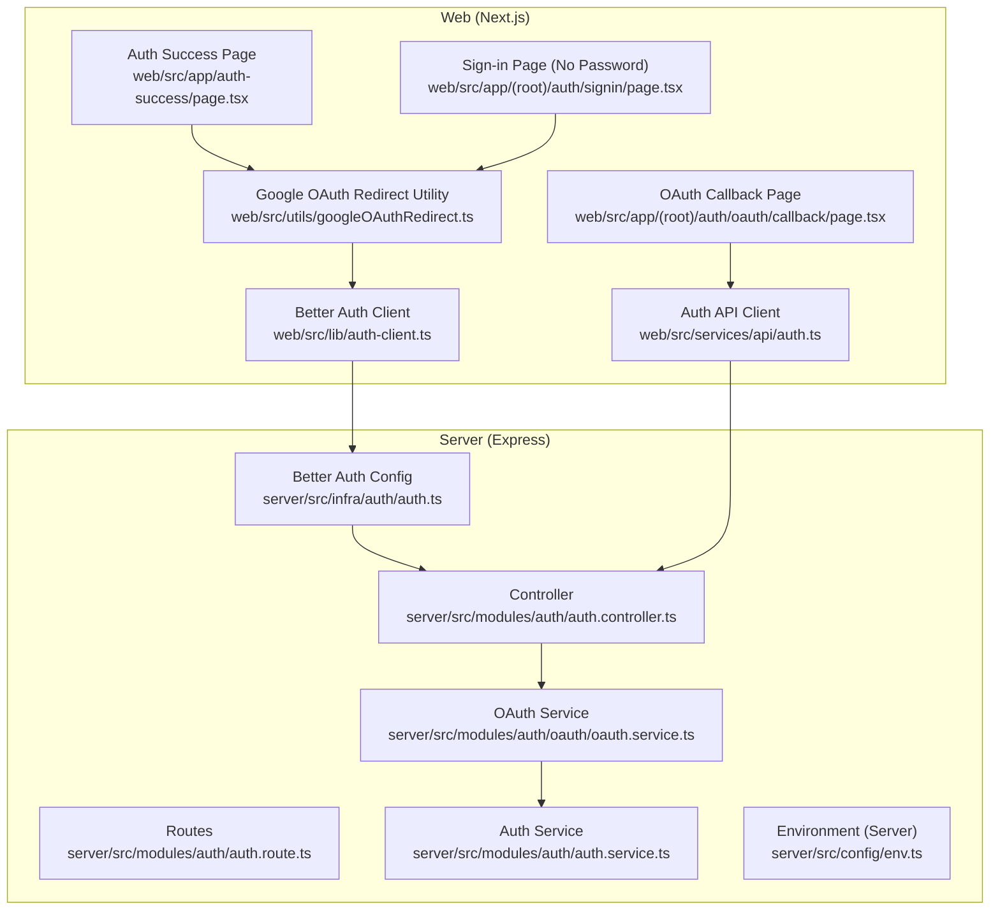
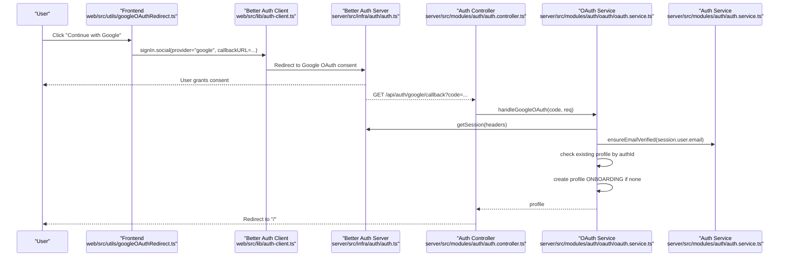
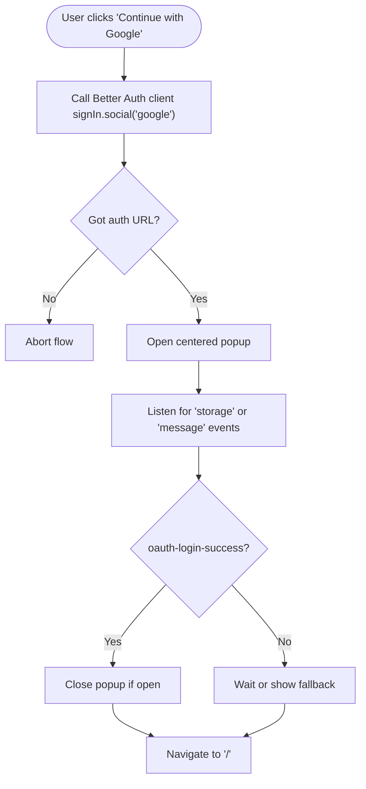
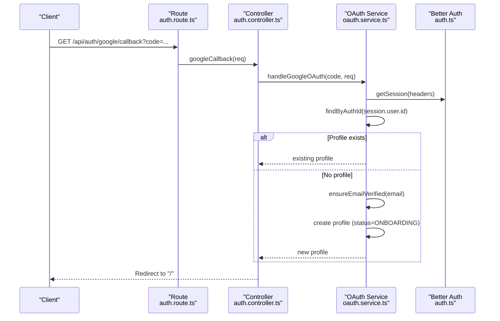
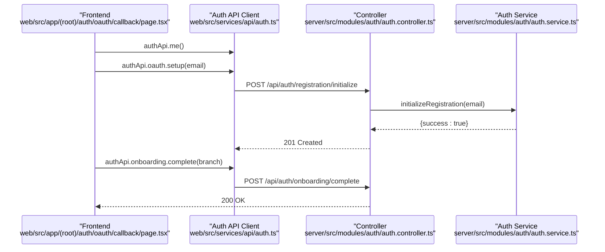
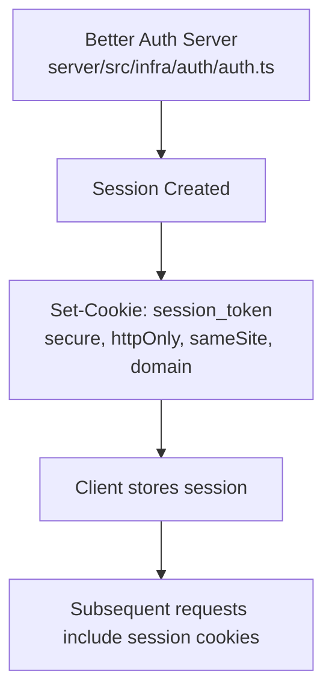
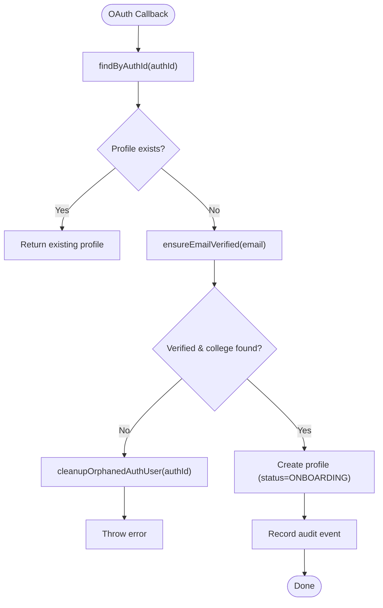
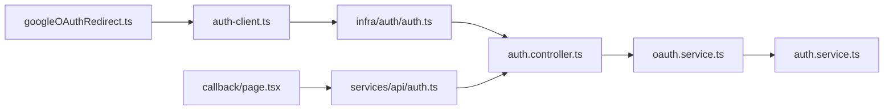

# OAuth Integration

<cite>
**Referenced Files in This Document**
- [googleOAuthRedirect.ts](file://web/src/utils/googleOAuthRedirect.ts)
- [auth.ts](file://web/src/lib/auth-client.ts)
- [page.tsx](file://web/src/app/(root)/auth/oauth/callback/page.tsx)
- [page.tsx](file://web/src/app/auth-success/page.tsx)
- [page.tsx](file://web/src/app/(root)/auth/signin/page.tsx)
- [auth.route.ts](file://server/src/modules/auth/auth.route.ts)
- [auth.controller.ts](file://server/src/modules/auth/auth.controller.ts)
- [oauth.service.ts](file://server/src/modules/auth/oauth/oauth.service.ts)
- [auth.service.ts](file://server/src/modules/auth/auth.service.ts)
- [auth.ts](file://server/src/infra/auth/auth.ts)
- [env.ts](file://server/src/config/env.ts)
- [env.ts](file://web/src/config/env.ts)
- [auth.ts](file://web/src/services/api/auth.ts)
</cite>

## Table of Contents
1. [Introduction](#introduction)
2. [Project Structure](#project-structure)
3. [Core Components](#core-components)
4. [Architecture Overview](#architecture-overview)
5. [Detailed Component Analysis](#detailed-component-analysis)
6. [Dependency Analysis](#dependency-analysis)
7. [Performance Considerations](#performance-considerations)
8. [Troubleshooting Guide](#troubleshooting-guide)
9. [Conclusion](#conclusion)

## Introduction
This document explains Google OAuth integration in Flick’s authentication system. It covers the OAuth callback flow, user data retrieval, account linking, session creation, and user profile synchronization. It also documents the OAuth controller endpoints, state management, security considerations, configuration examples, error handling, and user onboarding via OAuth. Privacy and duplicate-account handling are addressed with concrete references to the implementation.

## Project Structure
Flick’s OAuth integration spans the Next.js frontend and the Express backend:
- Frontend handles OAuth initiation, popup lifecycle, and onboarding completion.
- Backend validates the OAuth callback, provisions user profiles, and manages sessions via Better Auth.

**Diagram sources**
- [googleOAuthRedirect.ts](file://web/src/utils/googleOAuthRedirect.ts#L1-L95)
- [auth.ts](file://web/src/lib/auth-client.ts#L1-L19)
- [page.tsx](file://web/src/app/(root)/auth/oauth/callback/page.tsx#L1-L186)
- [page.tsx](file://web/src/app/auth-success/page.tsx#L1-L42)
- [page.tsx](file://web/src/app/(root)/auth/signin/page.tsx#L135-L173)
- [auth.route.ts](file://server/src/modules/auth/auth.route.ts#L1-L45)
- [auth.controller.ts](file://server/src/modules/auth/auth.controller.ts#L1-L236)
- [oauth.service.ts](file://server/src/modules/auth/oauth/oauth.service.ts#L1-L76)
- [auth.service.ts](file://server/src/modules/auth/auth.service.ts#L1-L800)
- [auth.ts](file://server/src/infra/auth/auth.ts#L1-L85)
- [env.ts](file://server/src/config/env.ts#L1-L42)

**Section sources**
- [auth.route.ts](file://server/src/modules/auth/auth.route.ts#L1-L45)
- [auth.controller.ts](file://server/src/modules/auth/auth.controller.ts#L94-L98)
- [oauth.service.ts](file://server/src/modules/auth/oauth/oauth.service.ts#L13-L72)
- [auth.ts](file://server/src/infra/auth/auth.ts#L55-L60)
- [env.ts](file://server/src/config/env.ts#L19-L20)
- [env.ts](file://web/src/config/env.ts#L13)

## Core Components
- Frontend OAuth initiation and popup management:
  - Utility to trigger Better Auth social sign-in with Google and manage a centered popup.
  - On success, the popup posts a message or writes to localStorage to signal completion.
- Backend OAuth callback handler:
  - Validates the OAuth code, retrieves Better Auth session, checks for existing user profile, ensures email is verified and linked to a college, and creates a user profile if needed.
- Onboarding flow:
  - After OAuth, the frontend navigates to an onboarding page where users select their branch and finalize registration.
- Environment configuration:
  - Server-side Better Auth configuration defines Google OAuth credentials and trusted origins.
  - Client-side environment exposes the Google OAuth client ID for Better Auth’s client plugin.

**Section sources**
- [googleOAuthRedirect.ts](file://web/src/utils/googleOAuthRedirect.ts#L6-L20)
- [auth.ts](file://web/src/lib/auth-client.ts#L9-L19)
- [page.tsx](file://web/src/app/auth-success/page.tsx#L23-L27)
- [auth.controller.ts](file://server/src/modules/auth/auth.controller.ts#L94-L98)
- [oauth.service.ts](file://server/src/modules/auth/oauth/oauth.service.ts#L13-L72)
- [page.tsx](file://web/src/app/(root)/auth/oauth/callback/page.tsx#L81-L103)
- [auth.ts](file://server/src/infra/auth/auth.ts#L55-L60)
- [env.ts](file://server/src/config/env.ts#L19-L20)
- [env.ts](file://web/src/config/env.ts#L13)

## Architecture Overview
The OAuth flow integrates the frontend Better Auth client with the backend Better Auth server and Flick’s internal services.

**Diagram sources**
- [googleOAuthRedirect.ts](file://web/src/utils/googleOAuthRedirect.ts#L11-L15)
- [auth.ts](file://web/src/lib/auth-client.ts#L9-L19)
- [auth.ts](file://server/src/infra/auth/auth.ts#L55-L60)
- [auth.controller.ts](file://server/src/modules/auth/auth.controller.ts#L94-L98)
- [oauth.service.ts](file://server/src/modules/auth/oauth/oauth.service.ts#L22-L72)
- [auth.service.ts](file://server/src/modules/auth/auth.service.ts#L296-L316)

## Detailed Component Analysis

### Frontend OAuth Initiation and Popup Lifecycle
- Triggers Better Auth social sign-in with Google and a custom callback URL.
- Opens a centered popup and listens for storage or message events to detect success and redirect.
- Falls back to full-page navigation if popup fails.

**Diagram sources**
- [googleOAuthRedirect.ts](file://web/src/utils/googleOAuthRedirect.ts#L6-L39)
- [page.tsx](file://web/src/app/auth-success/page.tsx#L23-L27)

**Section sources**
- [googleOAuthRedirect.ts](file://web/src/utils/googleOAuthRedirect.ts#L6-L95)
- [page.tsx](file://web/src/app/auth-success/page.tsx#L1-L42)

### Backend OAuth Callback Handler
- Route: GET /api/auth/google/callback
- Controller parses the code and delegates to OAuth service.
- Service validates session, checks for existing profile, verifies email and college association, and creates a new profile if needed.

**Diagram sources**
- [auth.route.ts](file://server/src/modules/auth/auth.route.ts#L17)
- [auth.controller.ts](file://server/src/modules/auth/auth.controller.ts#L94-L98)
- [oauth.service.ts](file://server/src/modules/auth/oauth/oauth.service.ts#L13-L72)

**Section sources**
- [auth.route.ts](file://server/src/modules/auth/auth.route.ts#L17)
- [auth.controller.ts](file://server/src/modules/auth/auth.controller.ts#L94-L98)
- [oauth.service.ts](file://server/src/modules/auth/oauth/oauth.service.ts#L13-L72)

### User Profile Synchronization and Onboarding
- After OAuth, the frontend navigates to the onboarding page, fetches the user’s profile and college branches, and allows branch selection.
- The frontend calls an API to initialize registration (placeholder password) and then completes onboarding.

**Diagram sources**
- [page.tsx](file://web/src/app/(root)/auth/oauth/callback/page.tsx#L39-L103)
- [auth.ts](file://web/src/services/api/auth.ts#L92-L103)
- [auth.controller.ts](file://server/src/modules/auth/auth.controller.ts#L100-L123)
- [auth.service.ts](file://server/src/modules/auth/auth.service.ts#L49-L104)

**Section sources**
- [page.tsx](file://web/src/app/(root)/auth/oauth/callback/page.tsx#L39-L103)
- [auth.ts](file://web/src/services/api/auth.ts#L92-L103)
- [auth.controller.ts](file://server/src/modules/auth/auth.controller.ts#L100-L123)
- [auth.service.ts](file://server/src/modules/auth/auth.service.ts#L49-L104)

### Session Creation and Cookie Management
- Better Auth manages session cookies and caches. On successful OAuth, the session is established server-side and forwarded to the client.
- Cookie attributes are configured for production-grade security and cross-subdomain support.

**Diagram sources**
- [auth.ts](file://server/src/infra/auth/auth.ts#L61-L78)

**Section sources**
- [auth.ts](file://server/src/infra/auth/auth.ts#L61-L78)

### Duplicate Detection and Account Merging
- Duplicate detection occurs during OAuth:
  - If a profile already exists for the Better Auth user ID, the service returns it immediately.
  - If the user’s email is not verified or the associated college is missing, the service cleans up the temporary Better Auth user and throws an error.
- Account merging is implicit: the profile is linked to the Better Auth user ID; no separate merge logic is present in the OAuth flow.

**Diagram sources**
- [oauth.service.ts](file://server/src/modules/auth/oauth/oauth.service.ts#L35-L72)
- [auth.service.ts](file://server/src/modules/auth/auth.service.ts#L318-L346)

**Section sources**
- [oauth.service.ts](file://server/src/modules/auth/oauth/oauth.service.ts#L35-L72)
- [auth.service.ts](file://server/src/modules/auth/auth.service.ts#L318-L346)

### Security Considerations
- Trusted origins and CORS:
  - Better Auth is configured with trusted origins from environment variables.
- Cookie security:
  - Secure, httpOnly, and appropriate sameSite settings; production sets secure and sameSite=None.
- CSRF and state:
  - Better Auth handles OAuth state internally; the frontend passes a callback URL and disables redirects when using popups.
- Email verification and college linkage:
  - The service enforces verified student emails and links to a valid college; otherwise, cleanup is performed.

**Section sources**
- [auth.ts](file://server/src/infra/auth/auth.ts#L15)
- [auth.ts](file://server/src/infra/auth/auth.ts#L73-L78)
- [googleOAuthRedirect.ts](file://web/src/utils/googleOAuthRedirect.ts#L11-L15)
- [auth.service.ts](file://server/src/modules/auth/auth.service.ts#L296-L316)

### OAuth Configuration Examples
- Server environment variables:
  - GOOGLE_OAUTH_CLIENT_ID and GOOGLE_OAUTH_CLIENT_SECRET define the Google OAuth app.
  - BETTER_AUTH_URL and ACCESS_CONTROL_ORIGINS configure Better Auth behavior and trusted origins.
- Client environment variables:
  - NEXT_PUBLIC_GOOGLE_OAUTH_ID is used by the Better Auth client plugin.

**Section sources**
- [env.ts](file://server/src/config/env.ts#L19-L20)
- [env.ts](file://server/src/config/env.ts#L33-L34)
- [env.ts](file://web/src/config/env.ts#L13)
- [auth.ts](file://web/src/lib/auth-client.ts#L14-L17)

### Error Scenarios
- Unauthorized request:
  - If Better Auth session is missing, the OAuth service throws an unauthorized error.
- College not found:
  - If the user’s email domain does not map to a college, the service cleans up the temporary Better Auth user and throws an error.
- OTP and registration errors:
  - Registration endpoints enforce OTP attempts and verified state; errors are surfaced to the frontend.

**Section sources**
- [oauth.service.ts](file://server/src/modules/auth/oauth/oauth.service.ts#L25-L33)
- [auth.service.ts](file://server/src/modules/auth/auth.service.ts#L318-L346)
- [auth.controller.ts](file://server/src/modules/auth/auth.controller.ts#L58-L74)

## Dependency Analysis
- Frontend depends on Better Auth client for OAuth and on local APIs for onboarding.
- Backend routes depend on the controller, which depends on the OAuth service and the auth service.
- Better Auth server depends on environment variables and database adapter.

**Diagram sources**
- [googleOAuthRedirect.ts](file://web/src/utils/googleOAuthRedirect.ts#L1-L95)
- [auth.ts](file://web/src/lib/auth-client.ts#L1-L19)
- [auth.ts](file://server/src/infra/auth/auth.ts#L1-L85)
- [auth.controller.ts](file://server/src/modules/auth/auth.controller.ts#L1-L236)
- [oauth.service.ts](file://server/src/modules/auth/oauth/oauth.service.ts#L1-L76)
- [auth.service.ts](file://server/src/modules/auth/auth.service.ts#L1-L800)
- [page.tsx](file://web/src/app/(root)/auth/oauth/callback/page.tsx#L1-L186)
- [auth.ts](file://web/src/services/api/auth.ts#L92-L103)

**Section sources**
- [auth.route.ts](file://server/src/modules/auth/auth.route.ts#L1-L45)
- [auth.controller.ts](file://server/src/modules/auth/auth.controller.ts#L1-L236)
- [oauth.service.ts](file://server/src/modules/auth/oauth/oauth.service.ts#L1-L76)
- [auth.service.ts](file://server/src/modules/auth/auth.service.ts#L1-L800)

## Performance Considerations
- Session caching:
  - Better Auth cookie cache reduces repeated database lookups for sessions.
- Rate limiting:
  - Authentication routes apply rate limits to protect against abuse.
- Caching user profiles:
  - UserRepo caches reads/writes to minimize database load during onboarding and subsequent requests.

**Section sources**
- [auth.ts](file://server/src/infra/auth/auth.ts#L62-L67)
- [auth.route.ts](file://server/src/modules/auth/auth.route.ts#L8)

## Troubleshooting Guide
- Popup does not close:
  - The frontend listens for storage or message events to close the popup; ensure origin checks and event handling are intact.
- Redirect loop or unauthorized:
  - Verify Better Auth session is present and that trusted origins match the frontend origin.
- College not found:
  - Ensure the user’s email domain resolves to a valid college; otherwise, the service cleans up the temporary Better Auth user.
- OTP failures:
  - Registration endpoints enforce OTP attempts and expiration; check cache keys and attempts counters.

**Section sources**
- [googleOAuthRedirect.ts](file://web/src/utils/googleOAuthRedirect.ts#L41-L74)
- [auth.ts](file://server/src/infra/auth/auth.ts#L15)
- [auth.service.ts](file://server/src/modules/auth/auth.service.ts#L318-L346)
- [auth.controller.ts](file://server/src/modules/auth/auth.controller.ts#L58-L74)

## Conclusion
Flick’s Google OAuth integration leverages Better Auth for secure, stateful social sign-in, with a robust backend flow that validates sessions, ensures email and college verification, and provisions user profiles. The frontend manages the popup lifecycle and onboarding UX, while the backend enforces security and consistency. The design supports graceful error handling, cleanup of orphaned users, and clear separation of concerns across modules.