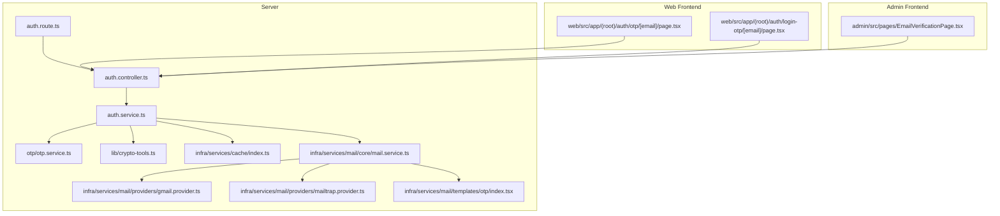
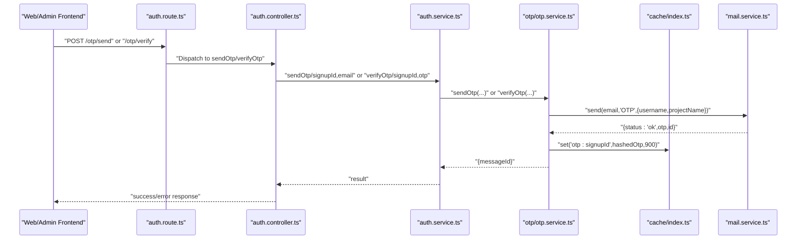
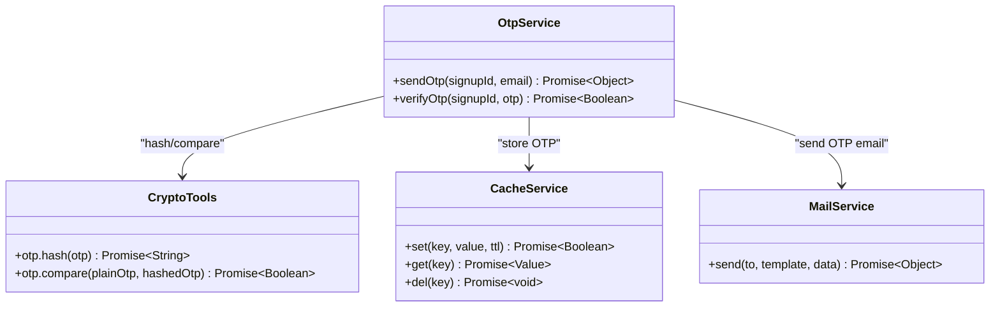
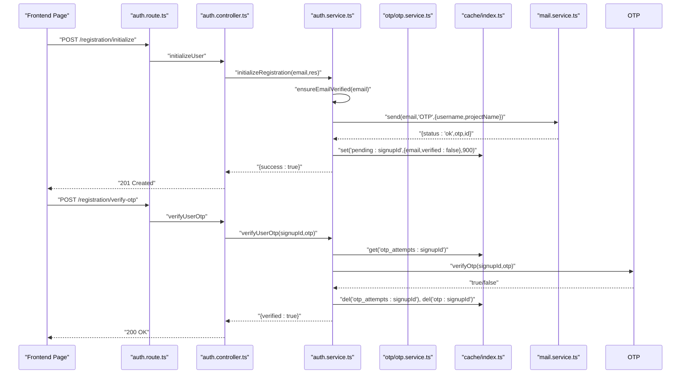
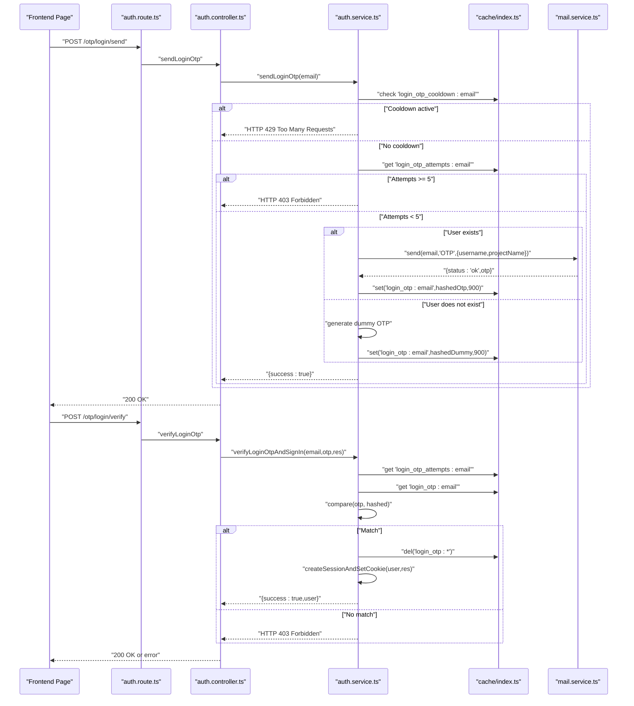
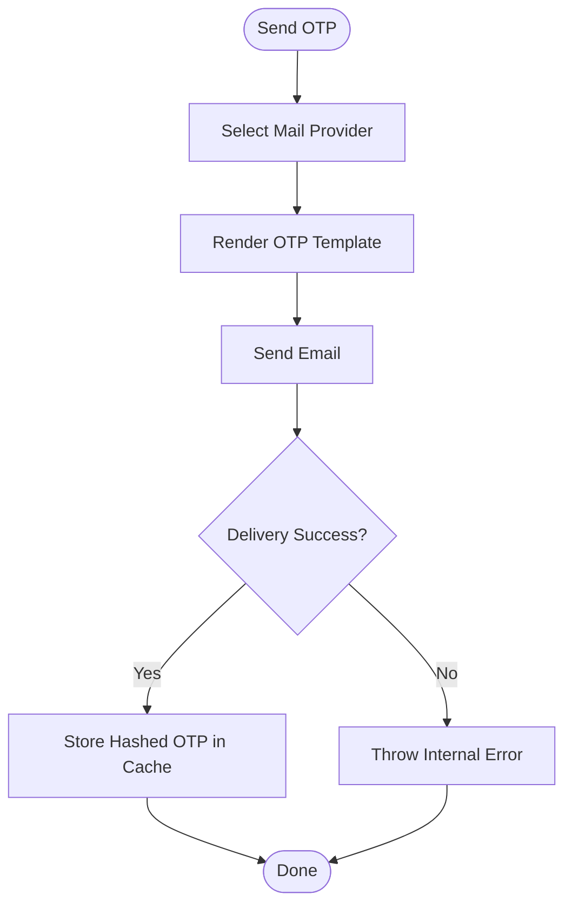
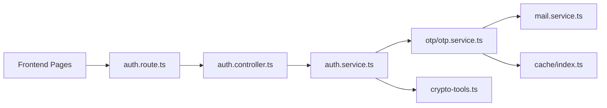

# OTP Authentication

<cite>
**Referenced Files in This Document**
- [otp.service.ts](file://server/src/modules/auth/otp/otp.service.ts)
- [auth.service.ts](file://server/src/modules/auth/auth.service.ts)
- [auth.controller.ts](file://server/src/modules/auth/auth.controller.ts)
- [auth.route.ts](file://server/src/modules/auth/auth.route.ts)
- [auth.schema.ts](file://server/src/modules/auth/auth.schema.ts)
- [crypto-tools.ts](file://server/src/lib/crypto-tools.ts)
- [index.ts](file://server/src/infra/services/cache/index.ts)
- [mail.service.ts](file://server/src/infra/services/mail/core/mail.service.ts)
- [gmail.provider.ts](file://server/src/infra/services/mail/providers/gmail.provider.ts)
- [mailtrap.provider.ts](file://server/src/infra/services/mail/providers/mailtrap.provider.ts)
- [otp/index.tsx](file://server/src/infra/services/mail/templates/otp/index.tsx)
- [page.tsx](file://web/src/app/(root)/auth/otp/[email]/page.tsx)
- [page.tsx](file://web/src/app/(root)/auth/login-otp/[email]/page.tsx)
- [EmailVerificationPage.tsx](file://admin/src/pages/EmailVerificationPage.tsx)
</cite>

## Table of Contents
1. [Introduction](#introduction)
2. [Project Structure](#project-structure)
3. [Core Components](#core-components)
4. [Architecture Overview](#architecture-overview)
5. [Detailed Component Analysis](#detailed-component-analysis)
6. [Dependency Analysis](#dependency-analysis)
7. [Performance Considerations](#performance-considerations)
8. [Troubleshooting Guide](#troubleshooting-guide)
9. [Conclusion](#conclusion)

## Introduction
This document explains OTP-based authentication in Flick, covering OTP generation, sending, and verification for both registration and login scenarios. It details the OTP service implementation, email delivery mechanisms, security measures, differences between registration and login OTP flows, timeout handling, retry mechanisms, and integration patterns with the email service provider. It also documents endpoint usage, error handling for invalid/expired OTP codes, and frontend integration patterns.

## Project Structure
OTP functionality spans backend services, controllers, routes, schemas, encryption utilities, caching, and email providers, along with frontend pages that drive the user experience.

**Diagram sources**
- [auth.route.ts](file://server/src/modules/auth/auth.route.ts#L1-L43)
- [auth.controller.ts](file://server/src/modules/auth/auth.controller.ts#L1-L236)
- [auth.service.ts](file://server/src/modules/auth/auth.service.ts#L1-L917)
- [otp.service.ts](file://server/src/modules/auth/otp/otp.service.ts#L1-L45)
- [crypto-tools.ts](file://server/src/lib/crypto-tools.ts#L1-L98)
- [index.ts](file://server/src/infra/services/cache/index.ts#L1-L7)
- [mail.service.ts](file://server/src/infra/services/mail/core/mail.service.ts)
- [gmail.provider.ts](file://server/src/infra/services/mail/providers/gmail.provider.ts)
- [mailtrap.provider.ts](file://server/src/infra/services/mail/providers/mailtrap.provider.ts)
- [otp/index.tsx](file://server/src/infra/services/mail/templates/otp/index.tsx)
- [page.tsx](file://web/src/app/(root)/auth/otp/[email]/page.tsx#L1-L148)
- [page.tsx](file://web/src/app/(root)/auth/login-otp/[email]/page.tsx#L1-L134)
- [EmailVerificationPage.tsx](file://admin/src/pages/EmailVerificationPage.tsx#L55-L126)

**Section sources**
- [auth.route.ts](file://server/src/modules/auth/auth.route.ts#L1-L43)
- [auth.controller.ts](file://server/src/modules/auth/auth.controller.ts#L1-L236)
- [auth.service.ts](file://server/src/modules/auth/auth.service.ts#L1-L917)
- [otp.service.ts](file://server/src/modules/auth/otp/otp.service.ts#L1-L45)
- [crypto-tools.ts](file://server/src/lib/crypto-tools.ts#L1-L98)
- [index.ts](file://server/src/infra/services/cache/index.ts#L1-L7)
- [mail.service.ts](file://server/src/infra/services/mail/core/mail.service.ts)
- [gmail.provider.ts](file://server/src/infra/services/mail/providers/gmail.provider.ts)
- [mailtrap.provider.ts](file://server/src/infra/services/mail/providers/mailtrap.provider.ts)
- [otp/index.tsx](file://server/src/infra/services/mail/templates/otp/index.tsx)
- [page.tsx](file://web/src/app/(root)/auth/otp/[email]/page.tsx#L1-L148)
- [page.tsx](file://web/src/app/(root)/auth/login-otp/[email]/page.tsx#L1-L134)
- [EmailVerificationPage.tsx](file://admin/src/pages/EmailVerificationPage.tsx#L55-L126)

## Core Components
- OTP Service: Handles OTP generation, hashing, storage, and verification for both registration and login flows.
- Authentication Service: Orchestrates registration initialization, OTP verification, and login OTP flows with rate limiting, cooldowns, and session creation.
- Controllers and Routes: Expose endpoints for OTP send/verify during registration and login OTP send/verify.
- Schemas: Define request validation for OTP-related endpoints.
- Crypto Tools: Provides OTP hashing and comparison utilities.
- Cache Service: Stores OTP hashes and attempt counters with TTL.
- Mail Service: Sends OTP emails via configured providers (Gmail/Mailtrap) using a dedicated template.

**Section sources**
- [otp.service.ts](file://server/src/modules/auth/otp/otp.service.ts#L1-L45)
- [auth.service.ts](file://server/src/modules/auth/auth.service.ts#L1-L917)
- [auth.controller.ts](file://server/src/modules/auth/auth.controller.ts#L1-L236)
- [auth.route.ts](file://server/src/modules/auth/auth.route.ts#L1-L43)
- [auth.schema.ts](file://server/src/modules/auth/auth.schema.ts#L1-L102)
- [crypto-tools.ts](file://server/src/lib/crypto-tools.ts#L1-L98)
- [index.ts](file://server/src/infra/services/cache/index.ts#L1-L7)
- [mail.service.ts](file://server/src/infra/services/mail/core/mail.service.ts)

## Architecture Overview
The OTP authentication architecture separates concerns across layers:
- Frontend pages trigger OTP requests and collect user input.
- Backend routes and controllers validate inputs and delegate to services.
- Services manage OTP lifecycle, caching, and secure comparisons.
- Mail service delivers OTP messages using provider-specific implementations.
- Crypto tools ensure OTP data is securely hashed and compared.

**Diagram sources**
- [auth.route.ts](file://server/src/modules/auth/auth.route.ts#L1-L43)
- [auth.controller.ts](file://server/src/modules/auth/auth.controller.ts#L1-L236)
- [auth.service.ts](file://server/src/modules/auth/auth.service.ts#L1-L917)
- [otp.service.ts](file://server/src/modules/auth/otp/otp.service.ts#L1-L45)
- [index.ts](file://server/src/infra/services/cache/index.ts#L1-L7)
- [mail.service.ts](file://server/src/infra/services/mail/core/mail.service.ts)

## Detailed Component Analysis

### OTP Service Implementation
The OTP service encapsulates OTP operations:
- OTP Generation and Hashing: Uses cryptographic hashing for secure storage.
- Storage: Stores hashed OTP in cache with a 15-minute TTL.
- Verification: Compares plaintext OTP against stored hash and clears the cache upon successful verification.

**Diagram sources**
- [otp.service.ts](file://server/src/modules/auth/otp/otp.service.ts#L1-L45)
- [crypto-tools.ts](file://server/src/lib/crypto-tools.ts#L1-L98)
- [index.ts](file://server/src/infra/services/cache/index.ts#L1-L7)
- [mail.service.ts](file://server/src/infra/services/mail/core/mail.service.ts)

**Section sources**
- [otp.service.ts](file://server/src/modules/auth/otp/otp.service.ts#L1-L45)
- [crypto-tools.ts](file://server/src/lib/crypto-tools.ts#L39-L47)
- [index.ts](file://server/src/infra/services/cache/index.ts#L1-L7)

### Registration OTP Flow
End-to-end process for user registration via OTP:
- Initialize Registration: Generates a signupId, encrypts email, sends OTP, stores pending user data with TTL, and sets a cookie.
- Verify OTP: Validates OTP attempts, compares against cached hash, marks user as verified, and proceeds to finalize registration.

**Diagram sources**
- [auth.route.ts](file://server/src/modules/auth/auth.route.ts#L10-L16)
- [auth.controller.ts](file://server/src/modules/auth/auth.controller.ts#L100-L117)
- [auth.service.ts](file://server/src/modules/auth/auth.service.ts#L49-L148)
- [otp.service.ts](file://server/src/modules/auth/otp/otp.service.ts#L33-L41)
- [index.ts](file://server/src/infra/services/cache/index.ts#L1-L7)
- [mail.service.ts](file://server/src/infra/services/mail/core/mail.service.ts)

**Section sources**
- [auth.controller.ts](file://server/src/modules/auth/auth.controller.ts#L100-L117)
- [auth.service.ts](file://server/src/modules/auth/auth.service.ts#L49-L148)
- [auth.route.ts](file://server/src/modules/auth/auth.route.ts#L10-L16)
- [otp.service.ts](file://server/src/modules/auth/otp/otp.service.ts#L33-L41)

### Login OTP Flow
End-to-end process for user login via OTP:
- Send Login OTP: Enforces cooldown, validates attempts, generates a dummy OTP for non-existent users, or sends real OTP for existing users.
- Verify Login OTP: Compares OTP, enforces attempt limits, deletes cache entries, and creates a session for the user.

**Diagram sources**
- [auth.route.ts](file://server/src/modules/auth/auth.route.ts#L20-L21)
- [auth.controller.ts](file://server/src/modules/auth/auth.controller.ts#L189-L201)
- [auth.service.ts](file://server/src/modules/auth/auth.service.ts#L652-L742)
- [index.ts](file://server/src/infra/services/cache/index.ts#L1-L7)
- [mail.service.ts](file://server/src/infra/services/mail/core/mail.service.ts)

**Section sources**
- [auth.controller.ts](file://server/src/modules/auth/auth.controller.ts#L189-L201)
- [auth.service.ts](file://server/src/modules/auth/auth.service.ts#L652-L742)
- [auth.route.ts](file://server/src/modules/auth/auth.route.ts#L20-L21)

### Email Delivery Mechanisms
- Provider Selection: The mail service supports multiple providers (e.g., Gmail, Mailtrap) and uses a template engine to render OTP emails.
- Template: The OTP template renders dynamic content with username and project name.
- Delivery: On successful OTP generation, the mail service returns metadata including a message identifier.

**Diagram sources**
- [mail.service.ts](file://server/src/infra/services/mail/core/mail.service.ts)
- [gmail.provider.ts](file://server/src/infra/services/mail/providers/gmail.provider.ts)
- [mailtrap.provider.ts](file://server/src/infra/services/mail/providers/mailtrap.provider.ts)
- [otp/index.tsx](file://server/src/infra/services/mail/templates/otp/index.tsx)

**Section sources**
- [mail.service.ts](file://server/src/infra/services/mail/core/mail.service.ts)
- [gmail.provider.ts](file://server/src/infra/services/mail/providers/gmail.provider.ts)
- [mailtrap.provider.ts](file://server/src/infra/services/mail/providers/mailtrap.provider.ts)
- [otp/index.tsx](file://server/src/infra/services/mail/templates/otp/index.tsx)

### Security Measures
- OTP Hashing: OTP values are hashed using bcrypt before storage to prevent plaintext exposure.
- Secure Comparison: OTP comparison uses bcrypt to mitigate timing attacks.
- Rate Limiting and Cooldowns: Login OTP requests enforce per-user cooldowns and attempt caps.
- Cache TTL: OTPs expire automatically after 15 minutes.
- Disposable Email Checks: Registration flow validates student email format and blocks disposable domains.
- Session Management: Successful login OTP verifies creates a session and records audit events.

**Section sources**
- [crypto-tools.ts](file://server/src/lib/crypto-tools.ts#L39-L47)
- [auth.service.ts](file://server/src/modules/auth/auth.service.ts#L652-L742)
- [auth.service.ts](file://server/src/modules/auth/auth.service.ts#L622-L650)
- [auth.service.ts](file://server/src/modules/auth/auth.service.ts#L725-L742)

### Timeout Handling and Retry Mechanisms
- Registration OTP:
  - Pending user and OTP caches expire after 15 minutes.
  - Attempt counter tracks invalid OTP submissions and locks out after 5 attempts.
- Login OTP:
  - Cooldown prevents frequent OTP requests per email.
  - Attempt counter enforces a cap of 5 invalid attempts before blocking further verification.
  - Expired OTPs trigger explicit error responses prompting a new request.

**Section sources**
- [auth.service.ts](file://server/src/modules/auth/auth.service.ts#L69-L148)
- [auth.service.ts](file://server/src/modules/auth/auth.service.ts#L652-L742)

### Endpoint Definitions and Examples
- Registration OTP
  - POST /otp/send: Send OTP to the provided email associated with a signup session.
  - POST /otp/verify: Verify OTP for the current signup session.
  - POST /registration/verify-otp: Final verification step during registration.
  - POST /registration/initialize: Initialize registration and send OTP.
  - POST /registration/finalize: Complete registration after OTP verification.
- Login OTP
  - POST /otp/login/send: Send OTP for login.
  - POST /otp/login/verify: Verify OTP and sign in.

Example usage references:
- [auth.route.ts](file://server/src/modules/auth/auth.route.ts#L10-L21)
- [auth.controller.ts](file://server/src/modules/auth/auth.controller.ts#L43-L92)
- [auth.controller.ts](file://server/src/modules/auth/auth.controller.ts#L189-L201)

**Section sources**
- [auth.route.ts](file://server/src/modules/auth/auth.route.ts#L10-L21)
- [auth.controller.ts](file://server/src/modules/auth/auth.controller.ts#L43-L92)
- [auth.controller.ts](file://server/src/modules/auth/auth.controller.ts#L189-L201)

### Error Handling for Invalid/Expired OTP Codes
- Registration OTP:
  - Invalid OTP increments attempt counter; after 5 attempts, the session is cleared and access is forbidden.
  - Expired OTP cache returns false verification.
- Login OTP:
  - Invalid OTP increments attempt counter; after 5 attempts, access is forbidden.
  - Expired OTP cache triggers an explicit error indicating OTP expiration.
  - Non-existent user receives a dummy OTP to prevent enumeration.

Frontend handling examples:
- [page.tsx](file://web/src/app/(root)/auth/otp/[email]/page.tsx#L74-L114)
- [page.tsx](file://web/src/app/(root)/auth/login-otp/[email]/page.tsx#L67-L101)
- [EmailVerificationPage.tsx](file://admin/src/pages/EmailVerificationPage.tsx#L72-L110)

**Section sources**
- [auth.service.ts](file://server/src/modules/auth/auth.service.ts#L106-L148)
- [auth.service.ts](file://server/src/modules/auth/auth.service.ts#L692-L742)
- [page.tsx](file://web/src/app/(root)/auth/otp/[email]/page.tsx#L74-L114)
- [page.tsx](file://web/src/app/(root)/auth/login-otp/[email]/page.tsx#L67-L101)
- [EmailVerificationPage.tsx](file://admin/src/pages/EmailVerificationPage.tsx#L72-L110)

### Integration Patterns with Email Service Provider
- Provider Factory: The mail service selects a provider based on configuration and delegates sending.
- Template Rendering: The OTP template is rendered with contextual data (username, project name).
- Frontend Integration: Web and admin pages call OTP endpoints and display feedback based on HTTP responses and attempt counts.

**Section sources**
- [mail.service.ts](file://server/src/infra/services/mail/core/mail.service.ts)
- [gmail.provider.ts](file://server/src/infra/services/mail/providers/gmail.provider.ts)
- [mailtrap.provider.ts](file://server/src/infra/services/mail/providers/mailtrap.provider.ts)
- [otp/index.tsx](file://server/src/infra/services/mail/templates/otp/index.tsx)
- [page.tsx](file://web/src/app/(root)/auth/otp/[email]/page.tsx#L48-L64)
- [page.tsx](file://web/src/app/(root)/auth/login-otp/[email]/page.tsx#L45-L60)
- [EmailVerificationPage.tsx](file://admin/src/pages/EmailVerificationPage.tsx#L55-L61)

## Dependency Analysis
The OTP authentication module exhibits clear separation of concerns with minimal coupling:
- Controllers depend on services for business logic.
- Services depend on OTP service, cache, mail service, and crypto tools.
- OTP service depends on mail service and cache.
- Frontend pages depend on API endpoints exposed by routes/controllers.

**Diagram sources**
- [auth.route.ts](file://server/src/modules/auth/auth.route.ts#L1-L43)
- [auth.controller.ts](file://server/src/modules/auth/auth.controller.ts#L1-L236)
- [auth.service.ts](file://server/src/modules/auth/auth.service.ts#L1-L917)
- [otp.service.ts](file://server/src/modules/auth/otp/otp.service.ts#L1-L45)
- [mail.service.ts](file://server/src/infra/services/mail/core/mail.service.ts)
- [index.ts](file://server/src/infra/services/cache/index.ts#L1-L7)
- [crypto-tools.ts](file://server/src/lib/crypto-tools.ts#L1-L98)

**Section sources**
- [auth.route.ts](file://server/src/modules/auth/auth.route.ts#L1-L43)
- [auth.controller.ts](file://server/src/modules/auth/auth.controller.ts#L1-L236)
- [auth.service.ts](file://server/src/modules/auth/auth.service.ts#L1-L917)
- [otp.service.ts](file://server/src/modules/auth/otp/otp.service.ts#L1-L45)
- [mail.service.ts](file://server/src/infra/services/mail/core/mail.service.ts)
- [index.ts](file://server/src/infra/services/cache/index.ts#L1-L7)
- [crypto-tools.ts](file://server/src/lib/crypto-tools.ts#L1-L98)

## Performance Considerations
- Caching Strategy: OTPs and attempt counters are stored in cache with TTL to avoid database pressure.
- Hashing Overhead: OTP hashing and comparison are lightweight; ensure consistent hashing parameters across environments.
- Email Delivery: Provider selection and template rendering add latency; monitor provider response times.
- Frontend Debouncing: Automatic verification triggers reduce redundant requests; ensure appropriate debounce intervals.

## Troubleshooting Guide
Common issues and resolutions:
- OTP Send Failure:
  - Verify mail provider configuration and credentials.
  - Check mail service logs for delivery errors.
  - Confirm OTP template rendering and recipient address validity.
- Invalid OTP:
  - Ensure frontend waits until OTP reaches 6 digits before auto-submitting.
  - Monitor attempt counters; after 5 failures, clear session and prompt re-initiation.
- Expired OTP:
  - Inform users to request a new OTP; verify cache TTL and cleanup on success.
- Login OTP Cooldown:
  - Respect the 1-minute cooldown; avoid rapid successive requests.
- Session Creation:
  - On successful login OTP verification, confirm session cookies are set and forwarded.

**Section sources**
- [auth.service.ts](file://server/src/modules/auth/auth.service.ts#L652-L742)
- [auth.service.ts](file://server/src/modules/auth/auth.service.ts#L106-L148)
- [page.tsx](file://web/src/app/(root)/auth/otp/[email]/page.tsx#L117-L126)
- [page.tsx](file://web/src/app/(root)/auth/login-otp/[email]/page.tsx#L103-L112)
- [EmailVerificationPage.tsx](file://admin/src/pages/EmailVerificationPage.tsx#L113-L122)

## Conclusion
Flick’s OTP authentication system provides robust, secure, and user-friendly mechanisms for both registration and login. It leverages hashing, caching, and provider-driven email delivery while enforcing strict rate limiting and attempt caps. The modular design ensures maintainability and scalability, with clear separation between frontend UX and backend orchestration.