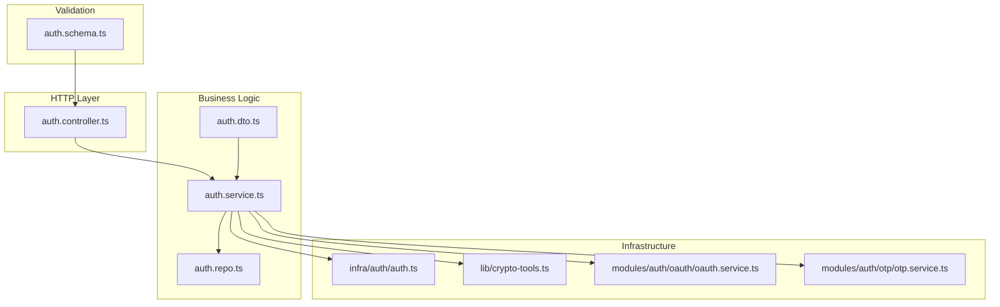
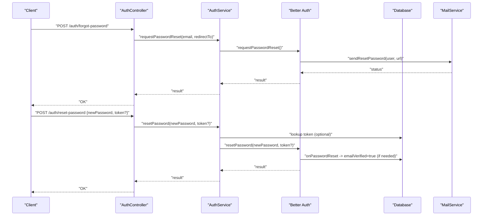
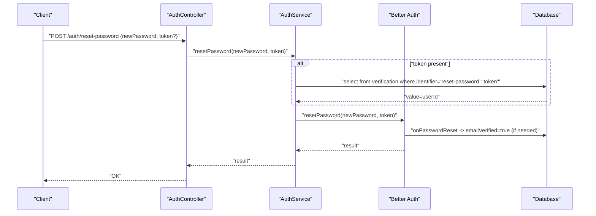
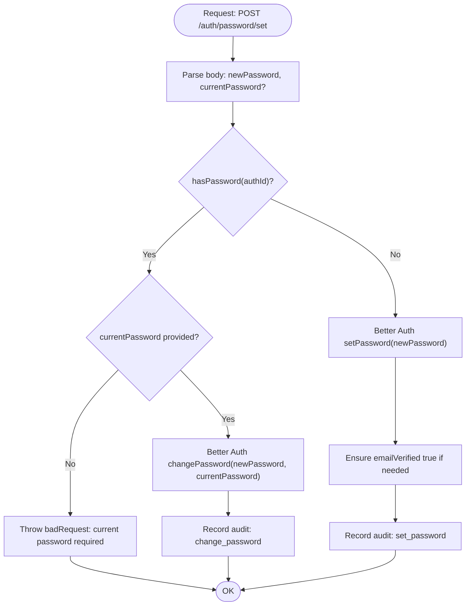
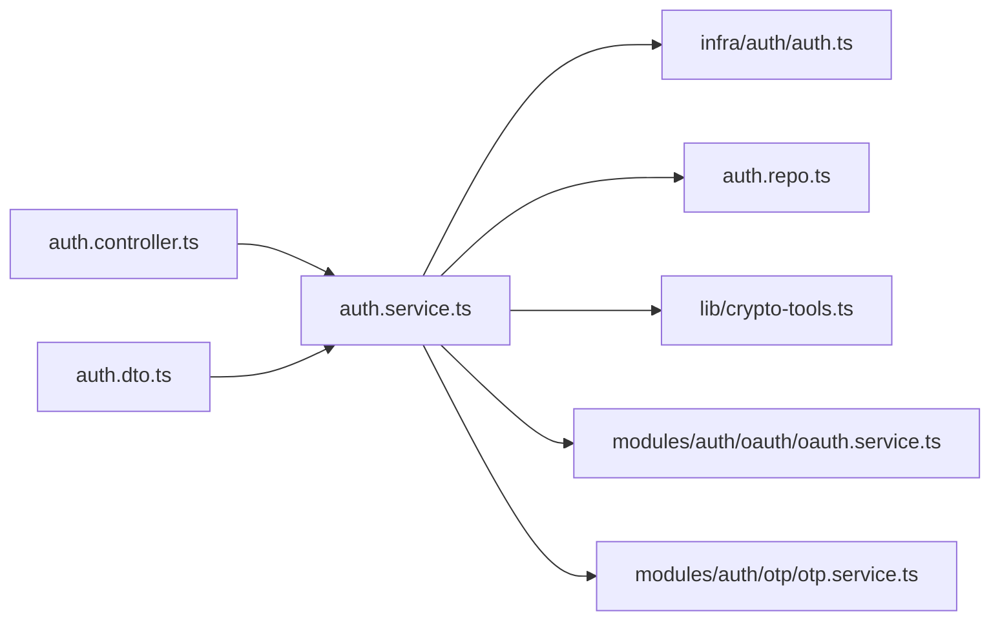

# Password Management

<cite>
**Referenced Files in This Document**
- [auth.schema.ts](file://server/src/modules/auth/auth.schema.ts)
- [auth.controller.ts](file://server/src/modules/auth/auth.controller.ts)
- [auth.service.ts](file://server/src/modules/auth/auth.service.ts)
- [auth.dto.ts](file://server/src/modules/auth/auth.dto.ts)
- [auth.repo.ts](file://server/src/modules/auth/auth.repo.ts)
- [crypto-tools.ts](file://server/src/lib/crypto-tools.ts)
- [auth.ts](file://server/src/infra/auth/auth.ts)
- [oauth.service.ts](file://server/src/modules/auth/oauth/oauth.service.ts)
- [otp.service.ts](file://server/src/modules/auth/otp/otp.service.ts)
</cite>

## Table of Contents
1. [Introduction](#introduction)
2. [Project Structure](#project-structure)
3. [Core Components](#core-components)
4. [Architecture Overview](#architecture-overview)
5. [Detailed Component Analysis](#detailed-component-analysis)
6. [Dependency Analysis](#dependency-analysis)
7. [Performance Considerations](#performance-considerations)
8. [Troubleshooting Guide](#troubleshooting-guide)
9. [Conclusion](#conclusion)

## Introduction
This document explains Flick’s password management functionality within the authentication system. It covers password reset workflows, setting a password for OAuth users, changing passwords, validation rules, email verification and token handling, and integration with the Better Auth password strategy. It also documents password hashing mechanisms, security measures, and error handling patterns.

## Project Structure
Password-related logic is implemented across the following layers:
- Validation schemas define request shapes and constraints.
- Controller handles HTTP requests and delegates to service methods.
- Service orchestrates Better Auth APIs, database operations, caching, and email delivery.
- Infrastructure integrates Better Auth with the database and mail service.
- Utilities provide cryptographic primitives for hashing and encryption.

**Diagram sources**
- [auth.schema.ts](file://server/src/modules/auth/auth.schema.ts#L1-L102)
- [auth.controller.ts](file://server/src/modules/auth/auth.controller.ts#L1-L236)
- [auth.service.ts](file://server/src/modules/auth/auth.service.ts#L1-L921)
- [auth.dto.ts](file://server/src/modules/auth/auth.dto.ts#L1-L12)
- [auth.repo.ts](file://server/src/modules/auth/auth.repo.ts#L1-L50)
- [auth.ts](file://server/src/infra/auth/auth.ts#L1-L85)
- [crypto-tools.ts](file://server/src/lib/crypto-tools.ts#L1-L98)
- [oauth.service.ts](file://server/src/modules/auth/oauth/oauth.service.ts)
- [otp.service.ts](file://server/src/modules/auth/otp/otp.service.ts)

**Section sources**
- [auth.schema.ts](file://server/src/modules/auth/auth.schema.ts#L1-L102)
- [auth.controller.ts](file://server/src/modules/auth/auth.controller.ts#L1-L236)
- [auth.service.ts](file://server/src/modules/auth/auth.service.ts#L1-L921)
- [auth.ts](file://server/src/infra/auth/auth.ts#L1-L85)

## Core Components
- Password reset request and reset endpoints with token handling.
- Password setting for OAuth users who lack credentials.
- Password change procedure requiring current password for credential users.
- Zod-based validation schemas enforcing minimum length and optional token usage.
- Better Auth integration for password reset emails, token lifecycle, and email verification on reset.
- Cryptographic utilities for hashing and OTP handling.

**Section sources**
- [auth.schema.ts](file://server/src/modules/auth/auth.schema.ts#L45-L96)
- [auth.controller.ts](file://server/src/modules/auth/auth.controller.ts#L136-L158)
- [auth.service.ts](file://server/src/modules/auth/auth.service.ts#L520-L569)
- [auth.ts](file://server/src/infra/auth/auth.ts#L35-L54)
- [crypto-tools.ts](file://server/src/lib/crypto-tools.ts#L29-L47)

## Architecture Overview
The password management flow leverages Better Auth for password reset and email verification, while the application’s service layer coordinates database writes, caching, and email delivery.

**Diagram sources**
- [auth.controller.ts](file://server/src/modules/auth/auth.controller.ts#L136-L158)
- [auth.service.ts](file://server/src/modules/auth/auth.service.ts#L520-L569)
- [auth.ts](file://server/src/infra/auth/auth.ts#L38-L53)

## Detailed Component Analysis

### Password Reset Workflow
- Endpoint: POST /auth/forgot-password
  - Validates email and optional redirect URL.
  - Delegates to Better Auth to generate and deliver a reset link.
  - Records audit event.
- Endpoint: POST /auth/reset-password
  - Accepts newPassword and optional token via body or query.
  - Optionally resolves target user from token in the verification table.
  - Calls Better Auth resetPassword.
  - If the user was unverified, marks emailVerified true upon successful reset.
  - Records audit event.

**Diagram sources**
- [auth.controller.ts](file://server/src/modules/auth/auth.controller.ts#L146-L158)
- [auth.service.ts](file://server/src/modules/auth/auth.service.ts#L534-L569)
- [auth.ts](file://server/src/infra/auth/auth.ts#L44-L53)

**Section sources**
- [auth.controller.ts](file://server/src/modules/auth/auth.controller.ts#L136-L158)
- [auth.service.ts](file://server/src/modules/auth/auth.service.ts#L520-L569)
- [auth.schema.ts](file://server/src/modules/auth/auth.schema.ts#L45-L59)
- [auth.ts](file://server/src/infra/auth/auth.ts#L38-L53)

### Set Password for OAuth Users
- Endpoint: POST /auth/password/set
  - Requires newPassword; currentPassword is optional.
  - Determines whether the user already has a password.
  - If password exists: requires currentPassword and calls changePassword.
  - If password does not exist: calls setPassword to attach a password to the OAuth account.
  - On successful set/change, ensures emailVerified true for newly verified users.
  - Returns appropriate message and status.

**Diagram sources**
- [auth.controller.ts](file://server/src/modules/auth/auth.controller.ts#L210-L224)
- [auth.service.ts](file://server/src/modules/auth/auth.service.ts#L759-L814)
- [auth.schema.ts](file://server/src/modules/auth/auth.schema.ts#L91-L96)
- [auth.ts](file://server/src/infra/auth/auth.ts#L44-L53)

**Section sources**
- [auth.controller.ts](file://server/src/modules/auth/auth.controller.ts#L210-L224)
- [auth.service.ts](file://server/src/modules/auth/auth.service.ts#L759-L814)
- [auth.schema.ts](file://server/src/modules/auth/auth.schema.ts#L91-L96)

### Password Change Procedure
- Endpoint: POST /auth/password/set
  - Enforces that currentPassword is required when changing an existing credential password.
  - Uses Better Auth changePassword without revoking other sessions.
  - Records audit event.

**Section sources**
- [auth.controller.ts](file://server/src/modules/auth/auth.controller.ts#L210-L224)
- [auth.service.ts](file://server/src/modules/auth/auth.service.ts#L773-L783)
- [auth.schema.ts](file://server/src/modules/auth/auth.schema.ts#L91-L96)

### Password Validation Rules
- Minimum length enforced by Zod schemas:
  - Registration and initialization require at least 6 characters.
  - Reset password requires at least 6 characters.
  - Set password requires at least 6 characters.
- Additional constraints:
  - Email format validated across schemas.
  - Redirect URLs must be valid URLs when provided.
  - Token presence handled per endpoint (body vs query).

**Section sources**
- [auth.schema.ts](file://server/src/modules/auth/auth.schema.ts#L22-L39)
- [auth.schema.ts](file://server/src/modules/auth/auth.schema.ts#L45-L59)
- [auth.schema.ts](file://server/src/modules/auth/auth.schema.ts#L91-L96)

### Email Verification and Token Generation
- Better Auth emailAndPassword plugin:
  - Sends reset-password emails via configured mail service.
  - Automatically verifies email on successful password reset if not already verified.
- Token storage and lookup:
  - Application optionally stores reset tokens in the verification table and resolves user ID before delegating to Better Auth.

**Section sources**
- [auth.ts](file://server/src/infra/auth/auth.ts#L38-L53)
- [auth.service.ts](file://server/src/modules/auth/auth.service.ts#L534-L569)

### Hashing Mechanisms and Security Measures
- Password hashing:
  - bcrypt with cost 12 for passwords.
- OTP hashing:
  - bcrypt with cost 10 for OTPs.
- OTP comparison:
  - bcrypt.compare for verifying OTP against hashed value.
- Email encryption:
  - AES-256-GCM for encrypting sensitive email payloads.
  - HMAC-SHA256 for email hashing.
- Cookie security defaults:
  - HttpOnly, Secure, SameSite configurable by environment.
  - Cross-subdomain cookies enabled.

**Section sources**
- [crypto-tools.ts](file://server/src/lib/crypto-tools.ts#L29-L47)
- [crypto-tools.ts](file://server/src/lib/crypto-tools.ts#L57-L94)
- [auth.ts](file://server/src/infra/auth/auth.ts#L69-L78)

### Integration with Better Auth Password Strategy
- requestPasswordReset and resetPassword delegated to Better Auth.
- setPassword and changePassword invoked via Better Auth APIs.
- getSession used to resolve current authenticated user for set/change operations.
- Two-factor plugin enabled for enhanced session security.

**Section sources**
- [auth.service.ts](file://server/src/modules/auth/auth.service.ts#L520-L569)
- [auth.service.ts](file://server/src/modules/auth/auth.service.ts#L759-L814)
- [auth.ts](file://server/src/infra/auth/auth.ts#L83-L84)

## Dependency Analysis

**Diagram sources**
- [auth.controller.ts](file://server/src/modules/auth/auth.controller.ts#L1-L236)
- [auth.service.ts](file://server/src/modules/auth/auth.service.ts#L1-L921)
- [auth.ts](file://server/src/infra/auth/auth.ts#L1-L85)
- [auth.repo.ts](file://server/src/modules/auth/auth.repo.ts#L1-L50)
- [crypto-tools.ts](file://server/src/lib/crypto-tools.ts#L1-L98)
- [oauth.service.ts](file://server/src/modules/auth/oauth/oauth.service.ts)
- [otp.service.ts](file://server/src/modules/auth/otp/otp.service.ts)

**Section sources**
- [auth.controller.ts](file://server/src/modules/auth/auth.controller.ts#L1-L236)
- [auth.service.ts](file://server/src/modules/auth/auth.service.ts#L1-L921)
- [auth.ts](file://server/src/infra/auth/auth.ts#L1-L85)

## Performance Considerations
- Prefer token-based resets to avoid unnecessary database lookups when possible.
- Cache OTP attempts and cooldown keys to reduce repeated work and protect against brute force.
- Use bcrypt costs appropriate for your threat model; costs can be tuned if latency becomes a concern.
- Leverage Better Auth’s cookie cache and JWE/JWT strategies to minimize round-trips.

## Troubleshooting Guide
Common issues and resolutions:
- Invalid or expired OTP during reset:
  - Ensure OTP is recent and matches the hashed value.
  - Respect attempt limits and cooldown periods.
- Too many OTP attempts:
  - Clear OTP cache and retry after cooldown.
- Current password required when changing:
  - Provide currentPassword for credential users.
- Disposable or invalid email:
  - Validate student email format and domain; reject disposable domains.
- Session cookie not set:
  - Confirm SameSite, Secure, and cross-subdomain cookie settings align with deployment environment.

**Section sources**
- [auth.service.ts](file://server/src/modules/auth/auth.service.ts#L106-L148)
- [auth.service.ts](file://server/src/modules/auth/auth.service.ts#L656-L746)
- [auth.service.ts](file://server/src/modules/auth/auth.service.ts#L773-L783)
- [auth.service.ts](file://server/src/modules/auth/auth.service.ts#L626-L654)
- [auth.ts](file://server/src/infra/auth/auth.ts#L69-L78)

## Conclusion
Flick’s password management integrates Better Auth for secure password reset and credential operations, while the application’s service layer adds validation, auditing, and email verification hooks. The system enforces minimum password lengths, uses robust hashing, and provides clear endpoints for setting and changing passwords, including special handling for OAuth users. Proper configuration of cookies and plugins ensures a secure and reliable user experience.