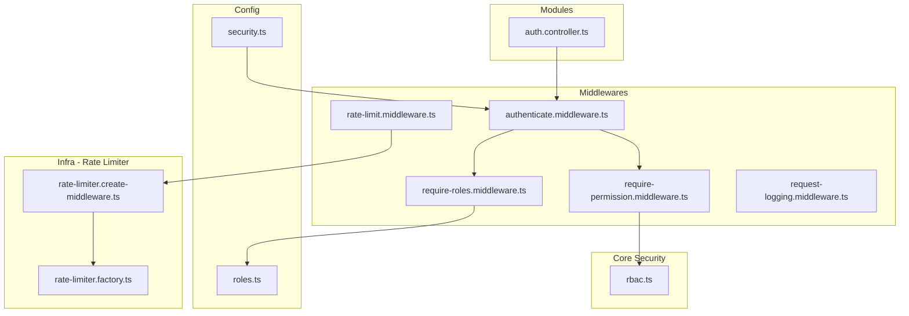
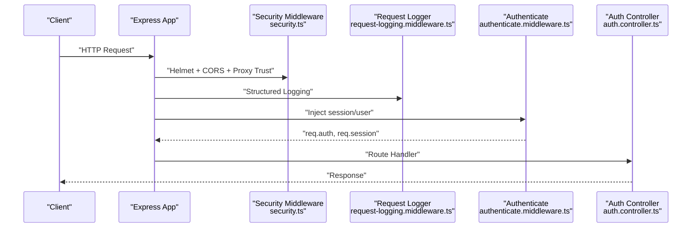
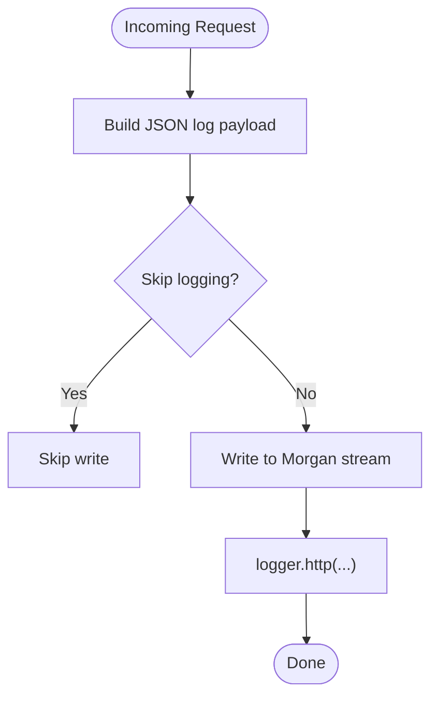
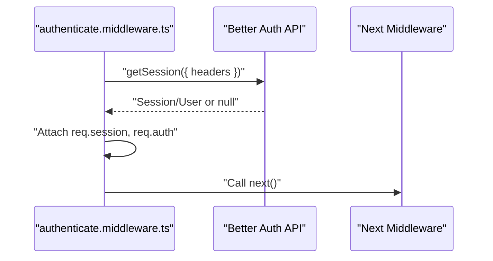
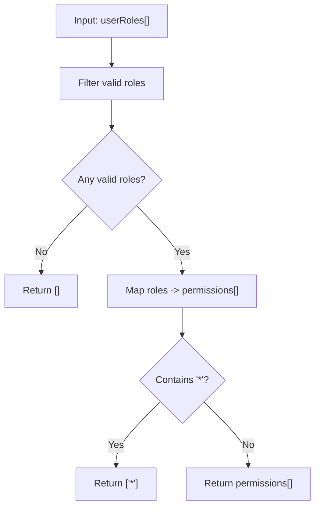
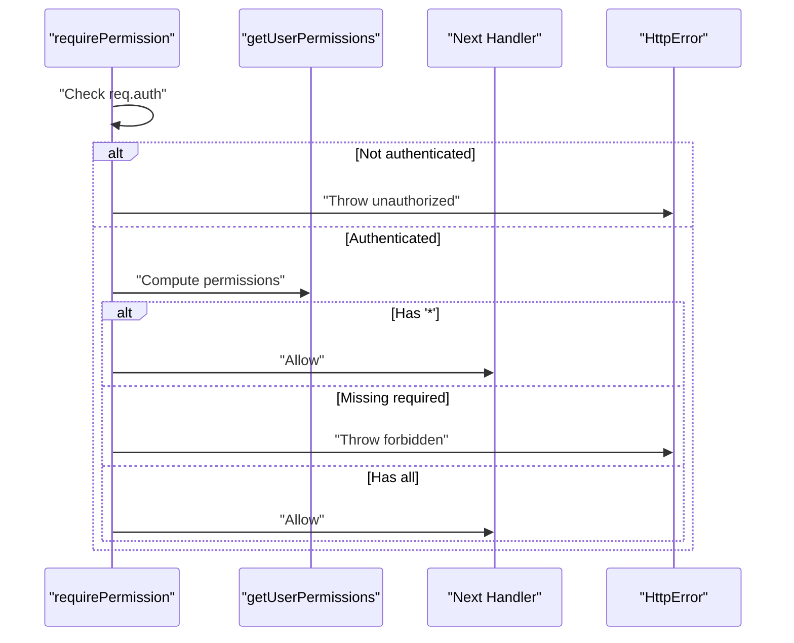
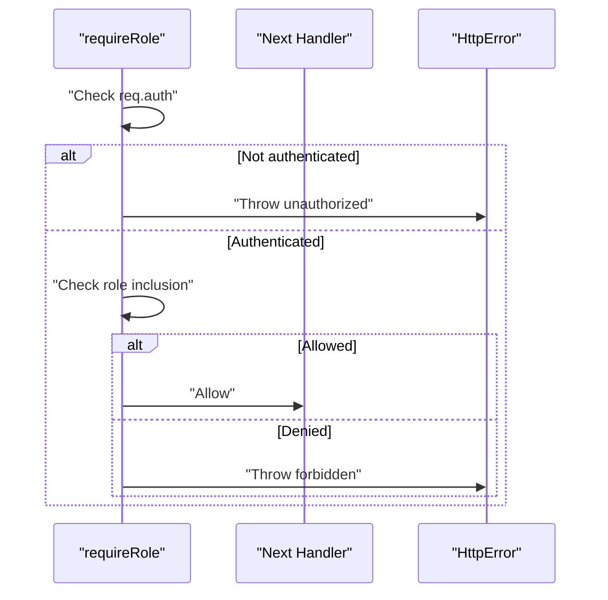
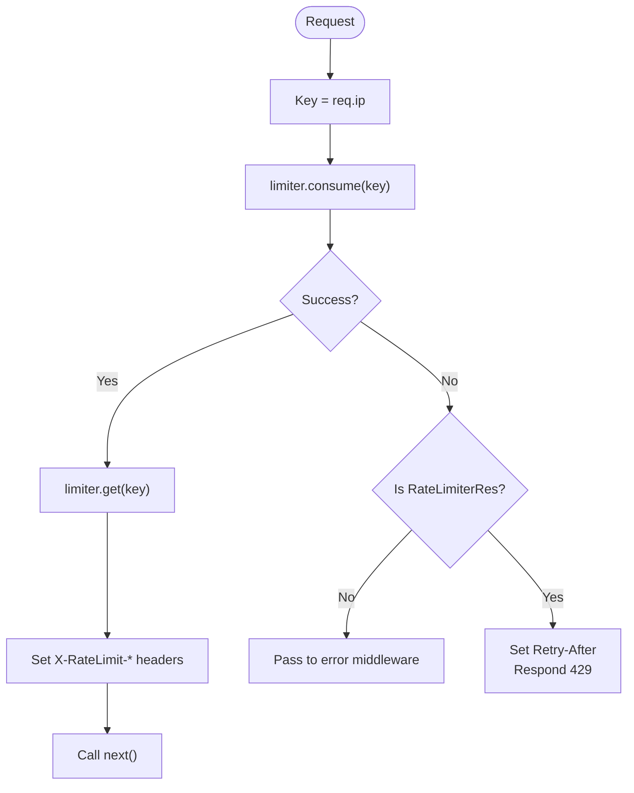
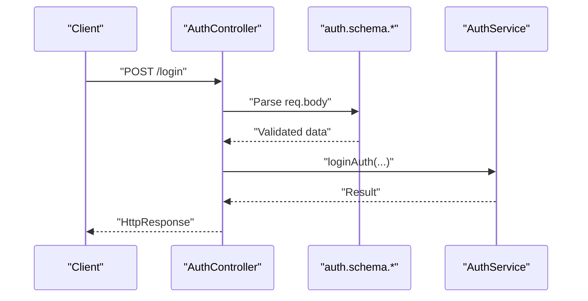
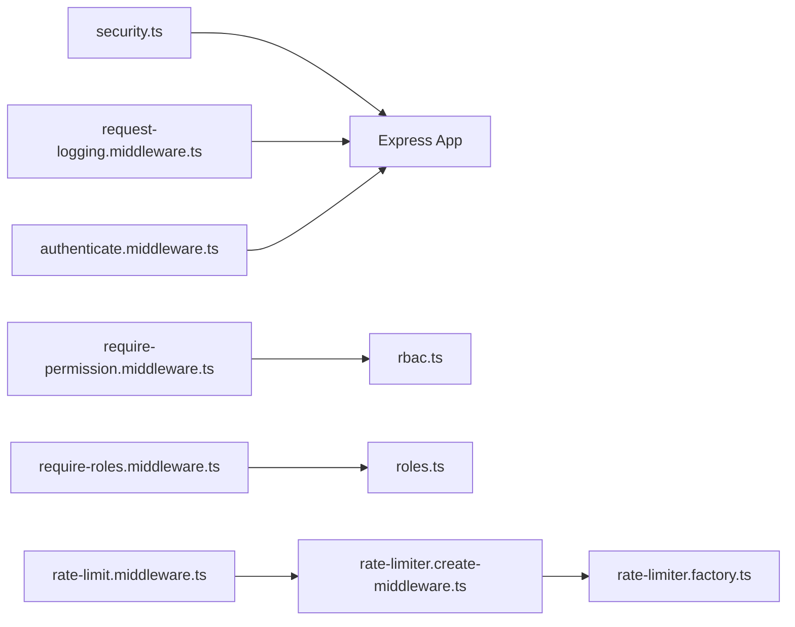

# Security Measures

<cite>
**Referenced Files in This Document**
- [security.ts](file://server/src/config/security.ts)
- [rbac.ts](file://server/src/core/security/rbac.ts)
- [roles.ts](file://server/src/config/roles.ts)
- [rate-limit.middleware.ts](file://server/src/core/middlewares/rate-limit.middleware.ts)
- [rate-limiter.create-middleware.ts](file://server/src/infra/services/rate-limiter/rate-limiter.create-middleware.ts)
- [rate-limiter.factory.ts](file://server/src/infra/services/rate-limiter/rate-limiter.factory.ts)
- [request-logging.middleware.ts](file://server/src/core/middlewares/request-logging.middleware.ts)
- [authenticate.middleware.ts](file://server/src/core/middlewares/auth/authenticate.middleware.ts)
- [require-permission.middleware.ts](file://server/src/core/middlewares/auth/require-permission.middleware.ts)
- [require-roles.middleware.ts](file://server/src/core/middlewares/auth/require-roles.middleware.ts)
- [auth.controller.ts](file://server/src/modules/auth/auth.controller.ts)
</cite>

## Table of Contents
1. [Introduction](#introduction)
2. [Project Structure](#project-structure)
3. [Core Components](#core-components)
4. [Architecture Overview](#architecture-overview)
5. [Detailed Component Analysis](#detailed-component-analysis)
6. [Dependency Analysis](#dependency-analysis)
7. [Performance Considerations](#performance-considerations)
8. [Troubleshooting Guide](#troubleshooting-guide)
9. [Conclusion](#conclusion)
10. [Appendices](#appendices)

## Introduction
This document explains the security measures implemented in Flick’s authentication system. It covers rate limiting, input validation, request logging, RBAC-based authorization, and security middleware. It also outlines configuration, threat prevention strategies, and secure coding practices, with examples of middleware usage and permission checks.

## Project Structure
Security-related code is primarily located under server/src/config, server/src/core/security, server/src/core/middlewares, and server/src/infra/services. Authentication controllers and routes integrate these security layers.

**Diagram sources**
- [security.ts](file://server/src/config/security.ts#L1-L14)
- [roles.ts](file://server/src/config/roles.ts#L1-L11)
- [authenticate.middleware.ts](file://server/src/core/middlewares/auth/authenticate.middleware.ts#L1-L27)
- [require-permission.middleware.ts](file://server/src/core/middlewares/auth/require-permission.middleware.ts#L1-L52)
- [require-roles.middleware.ts](file://server/src/core/middlewares/auth/require-roles.middleware.ts#L1-L44)
- [rate-limit.middleware.ts](file://server/src/core/middlewares/rate-limit.middleware.ts#L1-L12)
- [rate-limiter.create-middleware.ts](file://server/src/infra/services/rate-limiter/rate-limiter.create-middleware.ts#L1-L43)
- [rate-limiter.factory.ts](file://server/src/infra/services/rate-limiter/rate-limiter.factory.ts#L1-L41)
- [rbac.ts](file://server/src/core/security/rbac.ts#L1-L15)
- [auth.controller.ts](file://server/src/modules/auth/auth.controller.ts#L1-L236)

**Section sources**
- [security.ts](file://server/src/config/security.ts#L1-L14)
- [roles.ts](file://server/src/config/roles.ts#L1-L11)
- [rate-limit.middleware.ts](file://server/src/core/middlewares/rate-limit.middleware.ts#L1-L12)
- [rate-limiter.create-middleware.ts](file://server/src/infra/services/rate-limiter/rate-limiter.create-middleware.ts#L1-L43)
- [rate-limiter.factory.ts](file://server/src/infra/services/rate-limiter/rate-limiter.factory.ts#L1-L41)
- [request-logging.middleware.ts](file://server/src/core/middlewares/request-logging.middleware.ts#L1-L40)
- [authenticate.middleware.ts](file://server/src/core/middlewares/auth/authenticate.middleware.ts#L1-L27)
- [require-permission.middleware.ts](file://server/src/core/middlewares/auth/require-permission.middleware.ts#L1-L52)
- [require-roles.middleware.ts](file://server/src/core/middlewares/auth/require-roles.middleware.ts#L1-L44)
- [rbac.ts](file://server/src/core/security/rbac.ts#L1-L15)
- [auth.controller.ts](file://server/src/modules/auth/auth.controller.ts#L1-L236)

## Core Components
- Security middleware stack: Helmet, CORS, and proxy trust are applied globally.
- Request logging: Morgan-based structured logging with filtering.
- Authentication: Optional session retrieval via Better Auth; injects user/session into requests.
- Authorization: Role-based and permission-based guards.
- Rate limiting: Redis-backed limiter with standardized middleware wrapper.
- RBAC: Role-to-permissions mapping and wildcard support.

**Section sources**
- [security.ts](file://server/src/config/security.ts#L6-L11)
- [request-logging.middleware.ts](file://server/src/core/middlewares/request-logging.middleware.ts#L22-L39)
- [authenticate.middleware.ts](file://server/src/core/middlewares/auth/authenticate.middleware.ts#L8-L26)
- [require-permission.middleware.ts](file://server/src/core/middlewares/auth/require-permission.middleware.ts#L7-L51)
- [require-roles.middleware.ts](file://server/src/core/middlewares/auth/require-roles.middleware.ts#L6-L43)
- [rate-limit.middleware.ts](file://server/src/core/middlewares/rate-limit.middleware.ts#L6-L11)
- [rbac.ts](file://server/src/core/security/rbac.ts#L4-L14)

## Architecture Overview
The authentication and security pipeline integrates middleware and infrastructure components to protect endpoints.

**Diagram sources**
- [security.ts](file://server/src/config/security.ts#L6-L11)
- [request-logging.middleware.ts](file://server/src/core/middlewares/request-logging.middleware.ts#L22-L39)
- [authenticate.middleware.ts](file://server/src/core/middlewares/auth/authenticate.middleware.ts#L8-L26)
- [auth.controller.ts](file://server/src/modules/auth/auth.controller.ts#L6-L18)

## Detailed Component Analysis

### Security Middleware Stack
- Helmet hardens headers.
- CORS configuration is centralized.
- Proxy trust enabled for correct client IP resolution.
- Global disable of x-powered-by header.

Usage example: Apply security stack during server bootstrap.

**Section sources**
- [security.ts](file://server/src/config/security.ts#L6-L11)

### Request Logging Middleware
- Structured JSON logs via Morgan stream.
- Skips health endpoints and HEAD requests.
- Adds request ID and remote address tokens.
- Writes to internal logger.

**Diagram sources**
- [request-logging.middleware.ts](file://server/src/core/middlewares/request-logging.middleware.ts#L22-L39)

**Section sources**
- [request-logging.middleware.ts](file://server/src/core/middlewares/request-logging.middleware.ts#L1-L40)

### Authentication Middleware
- Retrieves session from Better Auth using Node headers.
- Optionally attaches user/session to request.
- Logs cookie presence for optional auth flows.

**Diagram sources**
- [authenticate.middleware.ts](file://server/src/core/middlewares/auth/authenticate.middleware.ts#L8-L26)

**Section sources**
- [authenticate.middleware.ts](file://server/src/core/middlewares/auth/authenticate.middleware.ts#L1-L27)

### Role-Based Access Control (RBAC)
- Role-to-permissions mapping is defined centrally.
- Wildcard permission "*" grants all permissions.
- Utility computes effective permissions for a user’s roles.

**Diagram sources**
- [rbac.ts](file://server/src/core/security/rbac.ts#L4-L14)
- [roles.ts](file://server/src/config/roles.ts#L3-L7)

**Section sources**
- [rbac.ts](file://server/src/core/security/rbac.ts#L1-L15)
- [roles.ts](file://server/src/config/roles.ts#L1-L11)

### Permission-Based Authorization
- Guards check for authenticated user.
- Computes permissions from user role(s).
- Supports wildcard permission bypass.
- Throws unauthorized or forbidden with metadata.

**Diagram sources**
- [require-permission.middleware.ts](file://server/src/core/middlewares/auth/require-permission.middleware.ts#L7-L51)
- [rbac.ts](file://server/src/core/security/rbac.ts#L4-L14)

**Section sources**
- [require-permission.middleware.ts](file://server/src/core/middlewares/auth/require-permission.middleware.ts#L1-L52)
- [rbac.ts](file://server/src/core/security/rbac.ts#L1-L15)

### Role-Based Authorization
- Guards check if user role is among allowed roles.
- Throws unauthorized or forbidden with metadata.

**Diagram sources**
- [require-roles.middleware.ts](file://server/src/core/middlewares/auth/require-roles.middleware.ts#L6-L43)

**Section sources**
- [require-roles.middleware.ts](file://server/src/core/middlewares/auth/require-roles.middleware.ts#L1-L44)

### Rate Limiting
- Middleware wrapper delegates to a limiter factory backed by Redis.
- Per-IP consumption with standardized headers.
- Returns 429 with Retry-After when exceeded; logs warning.

**Diagram sources**
- [rate-limit.middleware.ts](file://server/src/core/middlewares/rate-limit.middleware.ts#L6-L11)
- [rate-limiter.create-middleware.ts](file://server/src/infra/services/rate-limiter/rate-limiter.create-middleware.ts#L6-L42)
- [rate-limiter.factory.ts](file://server/src/infra/services/rate-limiter/rate-limiter.factory.ts#L4-L24)

**Section sources**
- [rate-limit.middleware.ts](file://server/src/core/middlewares/rate-limit.middleware.ts#L1-L12)
- [rate-limiter.create-middleware.ts](file://server/src/infra/services/rate-limiter/rate-limiter.create-middleware.ts#L1-L43)
- [rate-limiter.factory.ts](file://server/src/infra/services/rate-limiter/rate-limiter.factory.ts#L1-L41)

### Input Validation
- Controllers use Zod schemas to parse and validate request bodies and queries.
- Examples include login, OTP verification, registration, and password reset endpoints.

**Diagram sources**
- [auth.controller.ts](file://server/src/modules/auth/auth.controller.ts#L8-L18)

**Section sources**
- [auth.controller.ts](file://server/src/modules/auth/auth.controller.ts#L1-L236)

## Dependency Analysis
- Security middleware depends on Helmet and CORS configuration.
- Authentication middleware depends on Better Auth and injects into request.
- Authorization middlewares depend on RBAC and roles configuration.
- Rate limiting middleware depends on Redis limiter factory and exposes standardized headers.

**Diagram sources**
- [security.ts](file://server/src/config/security.ts#L6-L11)
- [request-logging.middleware.ts](file://server/src/core/middlewares/request-logging.middleware.ts#L22-L39)
- [authenticate.middleware.ts](file://server/src/core/middlewares/auth/authenticate.middleware.ts#L8-L26)
- [require-permission.middleware.ts](file://server/src/core/middlewares/auth/require-permission.middleware.ts#L7-L51)
- [require-roles.middleware.ts](file://server/src/core/middlewares/auth/require-roles.middleware.ts#L6-L43)
- [rbac.ts](file://server/src/core/security/rbac.ts#L4-L14)
- [roles.ts](file://server/src/config/roles.ts#L3-L7)
- [rate-limit.middleware.ts](file://server/src/core/middlewares/rate-limit.middleware.ts#L6-L11)
- [rate-limiter.create-middleware.ts](file://server/src/infra/services/rate-limiter/rate-limiter.create-middleware.ts#L6-L42)
- [rate-limiter.factory.ts](file://server/src/infra/services/rate-limiter/rate-limiter.factory.ts#L4-L24)

**Section sources**
- [security.ts](file://server/src/config/security.ts#L1-L14)
- [request-logging.middleware.ts](file://server/src/core/middlewares/request-logging.middleware.ts#L1-L40)
- [authenticate.middleware.ts](file://server/src/core/middlewares/auth/authenticate.middleware.ts#L1-L27)
- [require-permission.middleware.ts](file://server/src/core/middlewares/auth/require-permission.middleware.ts#L1-L52)
- [require-roles.middleware.ts](file://server/src/core/middlewares/auth/require-roles.middleware.ts#L1-L44)
- [rbac.ts](file://server/src/core/security/rbac.ts#L1-L15)
- [roles.ts](file://server/src/config/roles.ts#L1-L11)
- [rate-limit.middleware.ts](file://server/src/core/middlewares/rate-limit.middleware.ts#L1-L12)
- [rate-limiter.create-middleware.ts](file://server/src/infra/services/rate-limiter/rate-limiter.create-middleware.ts#L1-L43)
- [rate-limiter.factory.ts](file://server/src/infra/services/rate-limiter/rate-limiter.factory.ts#L1-L41)

## Performance Considerations
- Rate limiter uses Redis for distributed counters; ensure Redis availability and latency are monitored.
- Logging is asynchronous via setImmediate to avoid blocking the event loop.
- Helmet and CORS are lightweight; keep configuration minimal to reduce overhead.

[No sources needed since this section provides general guidance]

## Troubleshooting Guide
- Unauthorized vs Forbidden:
  - Unauthorized indicates missing or invalid session; check authentication middleware and cookies.
  - Forbidden indicates insufficient permissions; verify role/permission mapping and guards.
- Rate limit exceeded:
  - Inspect Retry-After header and X-RateLimit-* headers.
  - Confirm Redis connectivity and limiter configuration.
- Request logging:
  - Health endpoints and HEAD requests are skipped by design; adjust skip conditions if needed.

**Section sources**
- [require-permission.middleware.ts](file://server/src/core/middlewares/auth/require-permission.middleware.ts#L10-L19)
- [require-permission.middleware.ts](file://server/src/core/middlewares/auth/require-permission.middleware.ts#L32-L48)
- [rate-limiter.create-middleware.ts](file://server/src/infra/services/rate-limiter/rate-limiter.create-middleware.ts#L33-L40)
- [request-logging.middleware.ts](file://server/src/core/middlewares/request-logging.middleware.ts#L34-L38)

## Conclusion
Flick’s authentication system combines robust middleware layers with RBAC and rate limiting. Security middleware applies industry-standard protections, while request logging enables observability. RBAC and role-based guards enforce authorization policies, and Redis-backed rate limiting prevents abuse. Together, these components provide a strong foundation for secure operation.

[No sources needed since this section summarizes without analyzing specific files]

## Appendices

### Security Configurations
- Helmet hardening and proxy trust are applied globally.
- CORS options are configured centrally.
- Request logging writes structured logs to the internal logger.

**Section sources**
- [security.ts](file://server/src/config/security.ts#L6-L11)
- [request-logging.middleware.ts](file://server/src/core/middlewares/request-logging.middleware.ts#L22-L39)

### Authorization Patterns
- Use role guards for coarse-grained checks.
- Use permission guards for fine-grained checks.
- Wildcard permissions grant broad access; use sparingly.

**Section sources**
- [require-roles.middleware.ts](file://server/src/core/middlewares/auth/require-roles.middleware.ts#L6-L43)
- [require-permission.middleware.ts](file://server/src/core/middlewares/auth/require-permission.middleware.ts#L7-L51)
- [rbac.ts](file://server/src/core/security/rbac.ts#L11-L14)

### Rate Limiting Thresholds
- Limits are defined by the limiter factory; typical configuration sets points and duration per key prefix.
- Responses include standardized headers for client-side handling.

**Section sources**
- [rate-limiter.factory.ts](file://server/src/infra/services/rate-limiter/rate-limiter.factory.ts#L26-L40)
- [rate-limiter.create-middleware.ts](file://server/src/infra/services/rate-limiter/rate-limiter.create-middleware.ts#L14-L18)

### Secure Coding Practices
- Always validate inputs with Zod schemas before processing.
- Prefer permission-based guards over role-based for least privilege.
- Log warnings for permission denials and role denials with metadata for auditing.
- Avoid exposing sensitive fields in responses.

**Section sources**
- [auth.controller.ts](file://server/src/modules/auth/auth.controller.ts#L9-L17)
- [require-permission.middleware.ts](file://server/src/core/middlewares/auth/require-permission.middleware.ts#L33-L38)
- [require-roles.middleware.ts](file://server/src/core/middlewares/auth/require-roles.middleware.ts#L25-L30)