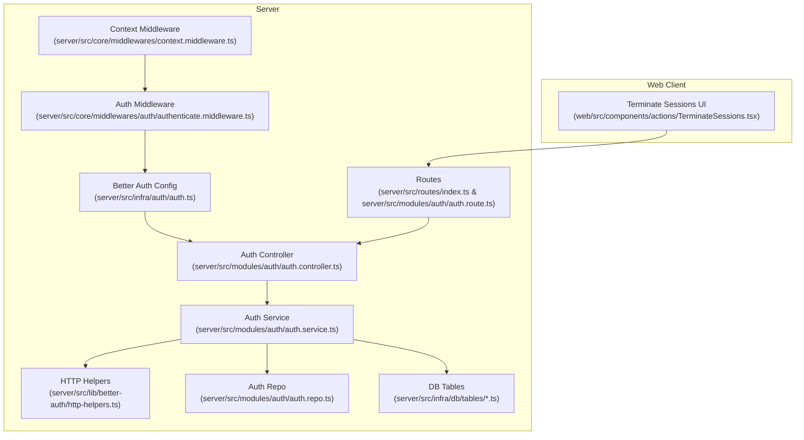
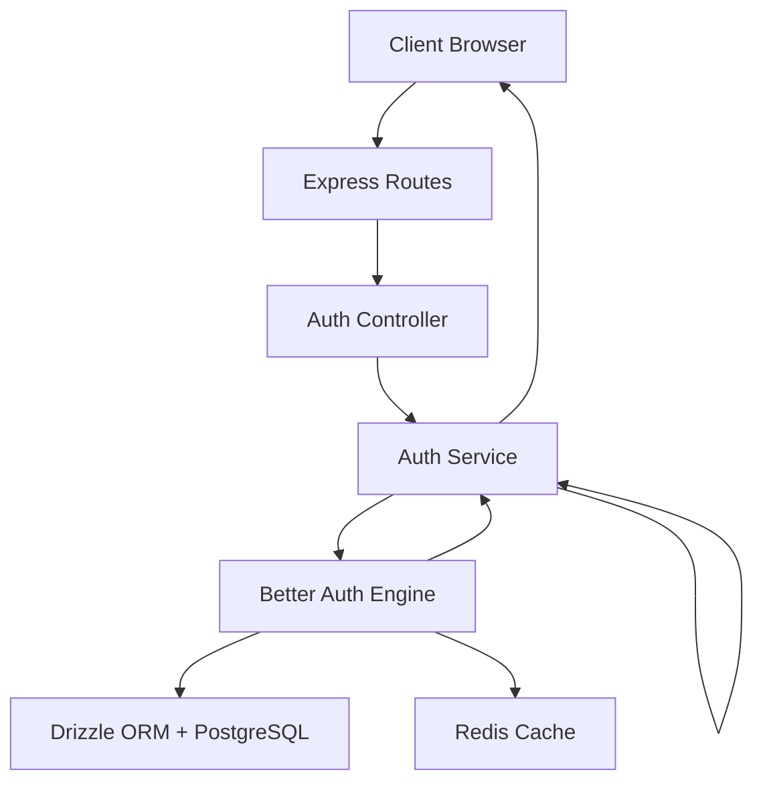
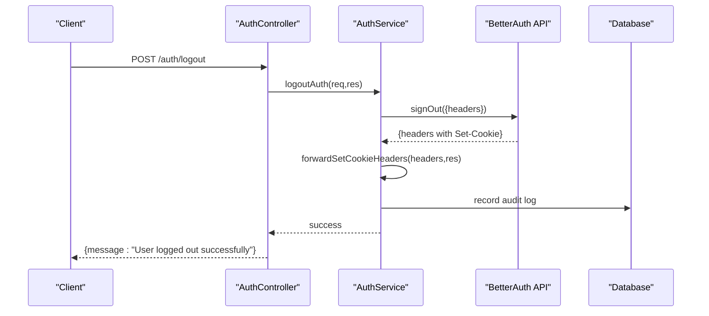
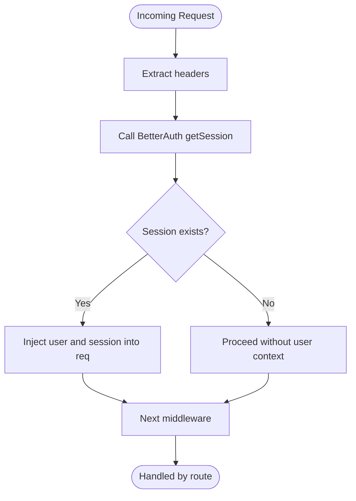
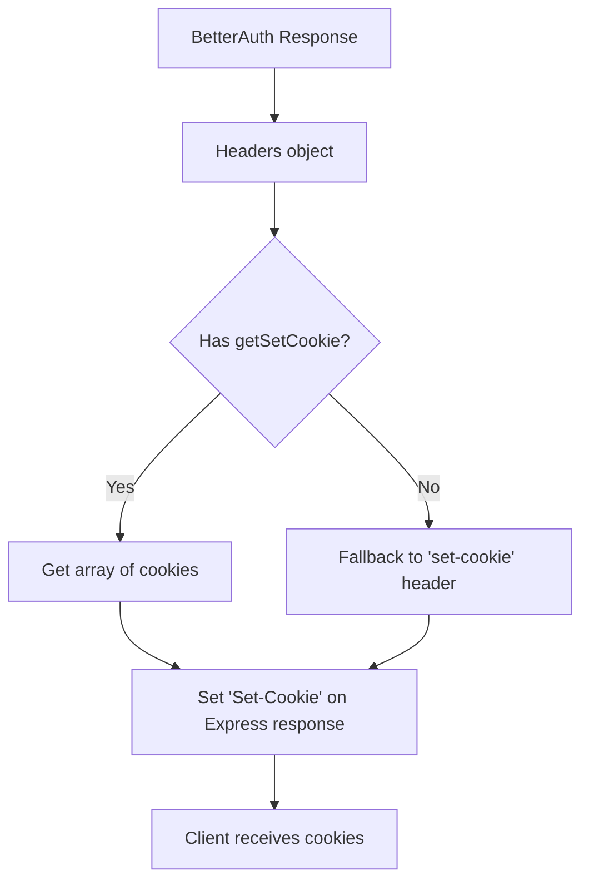
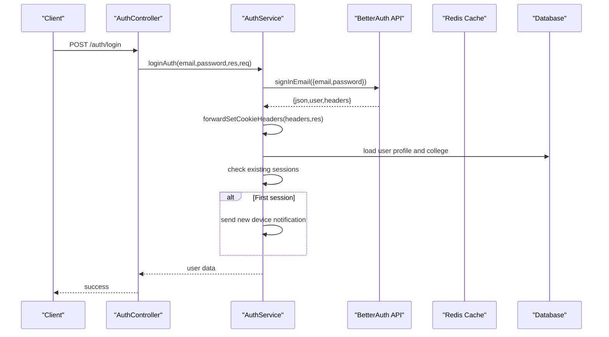
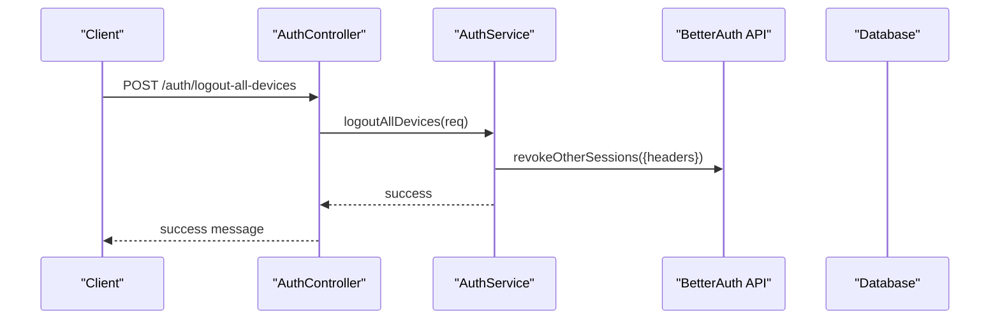
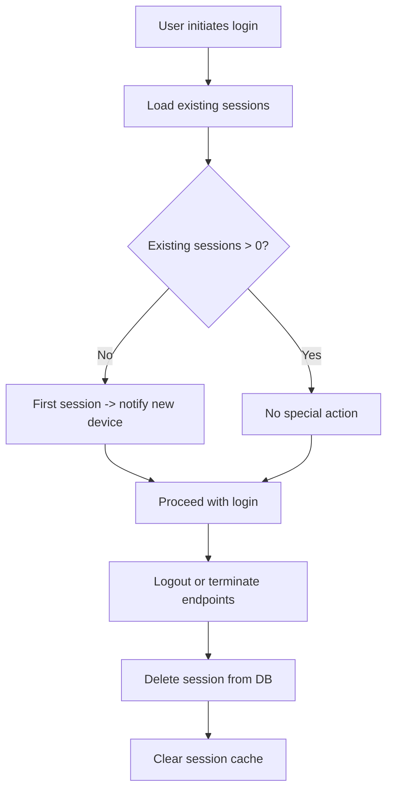
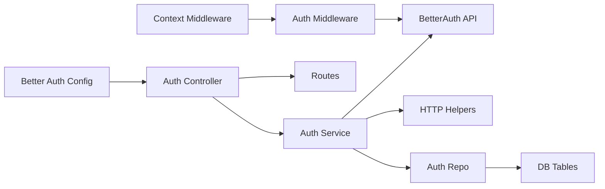

# Session Management

<cite>
**Referenced Files in This Document**
- [auth.ts](file://server/src/infra/auth/auth.ts)
- [auth.controller.ts](file://server/src/modules/auth/auth.controller.ts)
- [auth.service.ts](file://server/src/modules/auth/auth.service.ts)
- [authenticate.middleware.ts](file://server/src/core/middlewares/auth/authenticate.middleware.ts)
- [context.middleware.ts](file://server/src/core/middlewares/context.middleware.ts)
- [http-helpers.ts](file://server/src/lib/better-auth/http-helpers.ts)
- [auth.repo.ts](file://server/src/modules/auth/auth.repo.ts)
- [auth.route.ts](file://server/src/modules/auth/auth.route.ts)
- [index.ts](file://server/src/routes/index.ts)
- [env.ts](file://server/src/config/env.ts)
- [mail.ts](file://server/src/config/mail.ts)
- [cache.ts](file://server/src/infra/services/cache/index.ts)
- [auth.table.ts](file://server/src/infra/db/tables/auth.table.ts)
- [session.ts](file://server/src/infra/db/tables/session.ts)
- [TerminateSessions.tsx](file://web/src/components/actions/TerminateSessions.tsx)
</cite>

## Table of Contents
1. [Introduction](#introduction)
2. [Project Structure](#project-structure)
3. [Core Components](#core-components)
4. [Architecture Overview](#architecture-overview)
5. [Detailed Component Analysis](#detailed-component-analysis)
6. [Dependency Analysis](#dependency-analysis)
7. [Performance Considerations](#performance-considerations)
8. [Troubleshooting Guide](#troubleshooting-guide)
9. [Conclusion](#con conclusion)
10. [Appendices](#appendices)

## Introduction
This document explains session management in Flick’s authentication system built on Better Auth. It covers JWT and refresh token handling, cookie management, session persistence, token lifecycle, concurrency controls, validation middleware, user context injection, logout procedures, and security best practices. The goal is to provide a comprehensive yet accessible guide for developers and operators working with the authentication subsystem.

## Project Structure
The authentication system spans configuration, controllers, services, middleware, repositories, database tables, and client-side components. The server-side integrates Better Auth with Drizzle ORM and Redis caching, while the web client interacts with server endpoints to manage sessions.

**Diagram sources**
- [auth.ts](file://server/src/infra/auth/auth.ts#L1-L85)
- [auth.controller.ts](file://server/src/modules/auth/auth.controller.ts#L1-L236)
- [auth.service.ts](file://server/src/modules/auth/auth.service.ts#L1-L921)
- [authenticate.middleware.ts](file://server/src/core/middlewares/auth/authenticate.middleware.ts#L1-L26)
- [context.middleware.ts](file://server/src/core/middlewares/context.middleware.ts#L1-L61)
- [http-helpers.ts](file://server/src/lib/better-auth/http-helpers.ts#L1-L18)
- [auth.repo.ts](file://server/src/modules/auth/auth.repo.ts#L1-L50)
- [auth.table.ts](file://server/src/infra/db/tables/auth.table.ts)
- [session.ts](file://server/src/infra/db/tables/session.ts)
- [index.ts](file://server/src/routes/index.ts)
- [auth.route.ts](file://server/src/modules/auth/auth.route.ts)

**Section sources**
- [auth.ts](file://server/src/infra/auth/auth.ts#L1-L85)
- [auth.controller.ts](file://server/src/modules/auth/auth.controller.ts#L1-L236)
- [auth.service.ts](file://server/src/modules/auth/auth.service.ts#L1-L921)
- [authenticate.middleware.ts](file://server/src/core/middlewares/auth/authenticate.middleware.ts#L1-L26)
- [context.middleware.ts](file://server/src/core/middlewares/context.middleware.ts#L1-L61)
- [http-helpers.ts](file://server/src/lib/better-auth/http-helpers.ts#L1-L18)
- [auth.repo.ts](file://server/src/modules/auth/auth.repo.ts#L1-L50)
- [auth.table.ts](file://server/src/infra/db/tables/auth.table.ts)
- [session.ts](file://server/src/infra/db/tables/session.ts)
- [index.ts](file://server/src/routes/index.ts)
- [auth.route.ts](file://server/src/modules/auth/auth.route.ts)

## Core Components
- Better Auth configuration defines session caching, cookie attributes, cross-subdomain behavior, and plugins.
- Auth controller exposes endpoints for login, logout, OTP flows, password reset, session termination, and admin queries.
- Auth service orchestrates Better Auth API calls, cookie forwarding, session persistence, and audit logging.
- Authentication middleware injects user context into requests using Better Auth’s session retrieval.
- Context middleware enriches requests with observability metadata and flushes audit logs.
- HTTP helpers forward Set-Cookie headers from Better Auth responses to Express responses.
- Auth repository abstracts database reads and cached reads for auth entities.
- Routes bind endpoints to controller methods.

**Section sources**
- [auth.ts](file://server/src/infra/auth/auth.ts#L11-L84)
- [auth.controller.ts](file://server/src/modules/auth/auth.controller.ts#L1-L236)
- [auth.service.ts](file://server/src/modules/auth/auth.service.ts#L348-L462)
- [authenticate.middleware.ts](file://server/src/core/middlewares/auth/authenticate.middleware.ts#L8-L26)
- [context.middleware.ts](file://server/src/core/middlewares/context.middleware.ts#L28-L58)
- [http-helpers.ts](file://server/src/lib/better-auth/http-helpers.ts#L2-L17)
- [auth.repo.ts](file://server/src/modules/auth/auth.repo.ts#L6-L47)
- [index.ts](file://server/src/routes/index.ts)
- [auth.route.ts](file://server/src/modules/auth/auth.route.ts)

## Architecture Overview
The system uses Better Auth as the session engine with Drizzle ORM for persistence and Redis for caching. Cookies are managed securely with SameSite, Secure, and HttpOnly flags. The service layer forwards Better Auth cookies to clients and persists session metadata in the database.

**Diagram sources**
- [auth.ts](file://server/src/infra/auth/auth.ts#L11-L84)
- [auth.controller.ts](file://server/src/modules/auth/auth.controller.ts#L1-L236)
- [auth.service.ts](file://server/src/modules/auth/auth.service.ts#L348-L462)
- [auth.table.ts](file://server/src/infra/db/tables/auth.table.ts)
- [session.ts](file://server/src/infra/db/tables/session.ts)
- [cache.ts](file://server/src/infra/services/cache/index.ts)

## Detailed Component Analysis

### Better Auth Integration and Cookie Management
- Session caching: Enabled with JWE strategy and 7-day max age; supports stateless refresh.
- Cross-subdomain cookies enabled.
- Default cookie attributes:
  - SameSite: "none" in production, "lax" otherwise.
  - Secure: true in production.
  - HttpOnly: true.
- Account cookie storage enabled for OAuth flows.
- Plugins include two-factor and admin.

Security implications:
- HttpOnly prevents XSS from reading cookies.
- Secure flag ensures cookies are transmitted over HTTPS.
- SameSite mitigates CSRF depending on environment.

**Section sources**
- [auth.ts](file://server/src/infra/auth/auth.ts#L61-L84)
- [env.ts](file://server/src/config/env.ts)

### Token Lifecycle and Refresh Mechanisms
- Access tokens are issued by Better Auth and returned via Set-Cookie headers.
- Refresh tokens are handled by Better Auth; the controller endpoint for refresh currently returns a placeholder message indicating refresh logic is implemented elsewhere.
- Stateless refresh is enabled via cookie cache configuration.

Operational note:
- The refresh endpoint is present but does not currently set new cookies; ensure refresh logic is wired to set fresh access/refresh cookies and forward them to the client.

**Section sources**
- [auth.ts](file://server/src/infra/auth/auth.ts#L61-L67)
- [auth.controller.ts](file://server/src/modules/auth/auth.controller.ts#L26-L41)

### Session Persistence and Concurrency Controls
- Sessions are persisted in the database under the session table.
- On login, the service inspects existing sessions for the user and sends a “new device” notification when the first session is detected.
- Logout clears Better Auth session cookies and revokes the current session.
- Logout from all devices invokes Better Auth’s revokeOtherSessions.
- Terminate other sessions allows targeted removal of a specific session by ID.

**Diagram sources**
- [auth.controller.ts](file://server/src/modules/auth/auth.controller.ts#L20-L24)
- [auth.service.ts](file://server/src/modules/auth/auth.service.ts#L448-L462)
- [http-helpers.ts](file://server/src/lib/better-auth/http-helpers.ts#L2-L17)

**Section sources**
- [auth.service.ts](file://server/src/modules/auth/auth.service.ts#L402-L423)
- [auth.service.ts](file://server/src/modules/auth/auth.service.ts#L448-L462)
- [auth.service.ts](file://server/src/modules/auth/auth.service.ts#L571-L583)
- [auth.service.ts](file://server/src/modules/auth/auth.service.ts#L585-L608)
- [session.ts](file://server/src/infra/db/tables/session.ts)

### Session Validation Middleware and User Context Injection
- The authenticate middleware retrieves the Better Auth session from request headers and injects user and session data into the request object.
- The context middleware uses the injected user context to enrich observability data and flush audit logs.

**Diagram sources**
- [authenticate.middleware.ts](file://server/src/core/middlewares/auth/authenticate.middleware.ts#L8-L26)
- [context.middleware.ts](file://server/src/core/middlewares/context.middleware.ts#L28-L58)

**Section sources**
- [authenticate.middleware.ts](file://server/src/core/middlewares/auth/authenticate.middleware.ts#L8-L26)
- [context.middleware.ts](file://server/src/core/middlewares/context.middleware.ts#L28-L58)

### Cookie Forwarding and HTTP Helpers
- Better Auth responses carry Set-Cookie headers. The helper function extracts and forwards these headers to the Express response, ensuring cookies are set on the client.

**Diagram sources**
- [http-helpers.ts](file://server/src/lib/better-auth/http-helpers.ts#L2-L17)

**Section sources**
- [http-helpers.ts](file://server/src/lib/better-auth/http-helpers.ts#L2-L17)

### Login and OTP-Based Authentication Flows
- Email/password login:
  - Calls Better Auth sign-in API.
  - Forwards cookies to the client.
  - Validates user profile and college existence.
  - Sends “new device” notification on first session.
- Login OTP:
  - Rate-limited OTP generation with cooldown and attempt limits.
  - Compares OTP against cached hash.
  - On success, creates a session and sets cookies.

**Diagram sources**
- [auth.controller.ts](file://server/src/modules/auth/auth.controller.ts#L8-L18)
- [auth.service.ts](file://server/src/modules/auth/auth.service.ts#L348-L446)
- [http-helpers.ts](file://server/src/lib/better-auth/http-helpers.ts#L2-L17)

**Section sources**
- [auth.controller.ts](file://server/src/modules/auth/auth.controller.ts#L8-L18)
- [auth.service.ts](file://server/src/modules/auth/auth.service.ts#L348-L446)
- [auth.service.ts](file://server/src/modules/auth/auth.service.ts#L656-L694)
- [auth.service.ts](file://server/src/modules/auth/auth.service.ts#L696-L746)

### Logout Procedures
- Single-device logout:
  - Invokes Better Auth signOut and forwards cookies.
  - Records audit event.
- Logout from all devices:
  - Invokes Better Auth revokeOtherSessions.
  - Records audit event.
- Delete account:
  - Clears notifications, attempts to sign out via Better Auth, falls back to clearing cookies manually, deletes auth records, and records audit event.

**Diagram sources**
- [auth.controller.ts](file://server/src/modules/auth/auth.controller.ts#L160-L163)
- [auth.service.ts](file://server/src/modules/auth/auth.service.ts#L571-L583)

**Section sources**
- [auth.controller.ts](file://server/src/modules/auth/auth.controller.ts#L20-L24)
- [auth.controller.ts](file://server/src/modules/auth/auth.controller.ts#L160-L163)
- [auth.service.ts](file://server/src/modules/auth/auth.service.ts#L448-L462)
- [auth.service.ts](file://server/src/modules/auth/auth.service.ts#L464-L518)

### Concurrent Session Management and Termination
- The service enumerates a user’s sessions and sends a “new device” notification upon first login.
- Admins can terminate other sessions by targeting a specific session ID, deleting it from the database and clearing associated caches.

**Diagram sources**
- [auth.service.ts](file://server/src/modules/auth/auth.service.ts#L402-L423)
- [auth.service.ts](file://server/src/modules/auth/auth.service.ts#L585-L608)
- [session.ts](file://server/src/infra/db/tables/session.ts)

**Section sources**
- [auth.service.ts](file://server/src/modules/auth/auth.service.ts#L402-L423)
- [auth.service.ts](file://server/src/modules/auth/auth.service.ts#L585-L608)

### Security Measures and Best Practices
- Cookie security:
  - HttpOnly, Secure, and SameSite configured per environment.
  - Cross-subdomain cookies enabled for seamless UX.
- Token lifecycle:
  - Stateless refresh via cookie cache.
  - Password reset auto-verifies email if needed.
- Rate limiting and OTP safeguards:
  - OTP cooldown and attempt caps.
  - Disposable email domains blocked during registration.
- Audit and observability:
  - Centralized audit logging for sensitive actions.
  - Request ID propagation and context enrichment.

**Section sources**
- [auth.ts](file://server/src/infra/auth/auth.ts#L69-L84)
- [auth.service.ts](file://server/src/modules/auth/auth.service.ts#L656-L694)
- [auth.service.ts](file://server/src/modules/auth/auth.service.ts#L648-L654)
- [context.middleware.ts](file://server/src/core/middlewares/context.middleware.ts#L28-L58)

## Dependency Analysis
The following diagram shows key dependencies among authentication components.

**Diagram sources**
- [auth.ts](file://server/src/infra/auth/auth.ts#L11-L84)
- [auth.controller.ts](file://server/src/modules/auth/auth.controller.ts#L1-L236)
- [auth.service.ts](file://server/src/modules/auth/auth.service.ts#L1-L921)
- [http-helpers.ts](file://server/src/lib/better-auth/http-helpers.ts#L1-L18)
- [auth.repo.ts](file://server/src/modules/auth/auth.repo.ts#L1-L50)
- [auth.table.ts](file://server/src/infra/db/tables/auth.table.ts)
- [session.ts](file://server/src/infra/db/tables/session.ts)
- [authenticate.middleware.ts](file://server/src/core/middlewares/auth/authenticate.middleware.ts#L1-L26)
- [context.middleware.ts](file://server/src/core/middlewares/context.middleware.ts#L1-L61)
- [index.ts](file://server/src/routes/index.ts)
- [auth.route.ts](file://server/src/modules/auth/auth.route.ts)

**Section sources**
- [auth.ts](file://server/src/infra/auth/auth.ts#L11-L84)
- [auth.controller.ts](file://server/src/modules/auth/auth.controller.ts#L1-L236)
- [auth.service.ts](file://server/src/modules/auth/auth.service.ts#L1-L921)
- [http-helpers.ts](file://server/src/lib/better-auth/http-helpers.ts#L1-L18)
- [auth.repo.ts](file://server/src/modules/auth/auth.repo.ts#L1-L50)
- [auth.table.ts](file://server/src/infra/db/tables/auth.table.ts)
- [session.ts](file://server/src/infra/db/tables/session.ts)
- [authenticate.middleware.ts](file://server/src/core/middlewares/auth/authenticate.middleware.ts#L1-L26)
- [context.middleware.ts](file://server/src/core/middlewares/context.middleware.ts#L1-L61)
- [index.ts](file://server/src/routes/index.ts)
- [auth.route.ts](file://server/src/modules/auth/auth.route.ts)

## Performance Considerations
- Prefer cookie-based session caching for reduced database load.
- Use Redis for OTP and short-lived state to minimize latency.
- Cache user profiles and auth lookups to reduce repeated DB queries.
- Keep SameSite lax in development to avoid cookie issues; ensure none in production for cross-subdomain scenarios.

[No sources needed since this section provides general guidance]

## Troubleshooting Guide
Common issues and resolutions:
- Cookies not being set:
  - Verify Better Auth response headers include Set-Cookie and that the HTTP helper forwards them to the Express response.
- Session not recognized:
  - Ensure authenticate middleware runs before protected routes and that cookies are sent with the request.
- Logout not effective:
  - Confirm Better Auth signOut is called and cookies are cleared; check for manual fallback cookie clearing.
- OTP failures:
  - Check cooldown and attempt counters; confirm OTP hash comparison and cache TTLs.
- Session termination not working:
  - Validate session ID and user email passed to the termination endpoint; ensure DB deletion and cache invalidation occur.

**Section sources**
- [http-helpers.ts](file://server/src/lib/better-auth/http-helpers.ts#L2-L17)
- [authenticate.middleware.ts](file://server/src/core/middlewares/auth/authenticate.middleware.ts#L8-L26)
- [auth.service.ts](file://server/src/modules/auth/auth.service.ts#L448-L462)
- [auth.service.ts](file://server/src/modules/auth/auth.service.ts#L656-L694)
- [auth.service.ts](file://server/src/modules/auth/auth.service.ts#L585-L608)

## Conclusion
Flick’s session management leverages Better Auth for secure, scalable authentication with robust cookie policies, session persistence, and concurrency controls. The service layer centralizes cookie forwarding, audit logging, and user context injection, while middleware ensures consistent session validation and observability. By following the outlined best practices and troubleshooting steps, teams can maintain secure and reliable session handling across environments.

[No sources needed since this section summarizes without analyzing specific files]

## Appendices

### Endpoint Reference
- POST /auth/login: Email/password login with cookie forwarding.
- POST /auth/logout: Single-device logout.
- POST /auth/logout-all-devices: Logout from all devices.
- POST /auth/send-login-otp: Generate login OTP with cooldown and attempt limits.
- POST /auth/verify-login-otp: Verify OTP and create session.
- GET /auth/current-user: Retrieve current user (requires auth middleware).
- DELETE /auth/terminate-sessions?sessionId=...&email=...: Terminate other sessions.

**Section sources**
- [auth.controller.ts](file://server/src/modules/auth/auth.controller.ts#L8-L18)
- [auth.controller.ts](file://server/src/modules/auth/auth.controller.ts#L20-L24)
- [auth.controller.ts](file://server/src/modules/auth/auth.controller.ts#L160-L163)
- [auth.controller.ts](file://server/src/modules/auth/auth.controller.ts#L189-L201)
- [auth.controller.ts](file://server/src/modules/auth/auth.controller.ts#L226-L232)

### Client-Side Session Termination
- The web component triggers session termination via the backend endpoint, enabling users to end other sessions.

**Section sources**
- [TerminateSessions.tsx](file://web/src/components/actions/TerminateSessions.tsx)