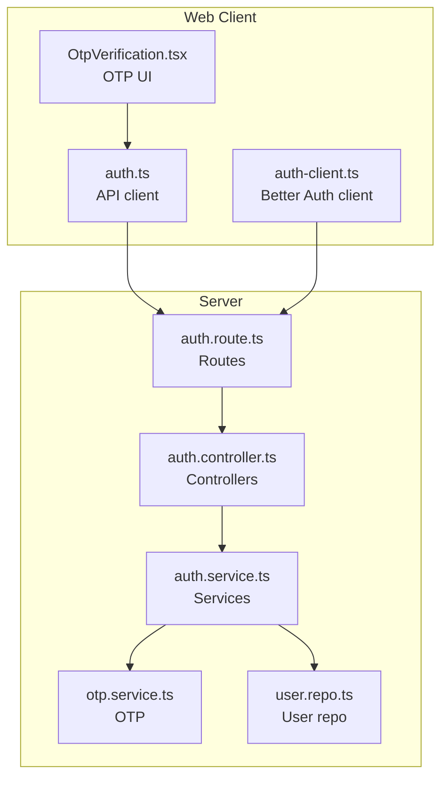
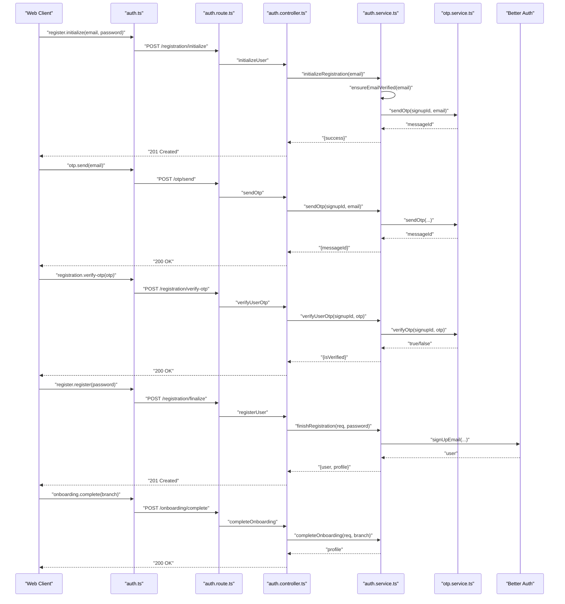
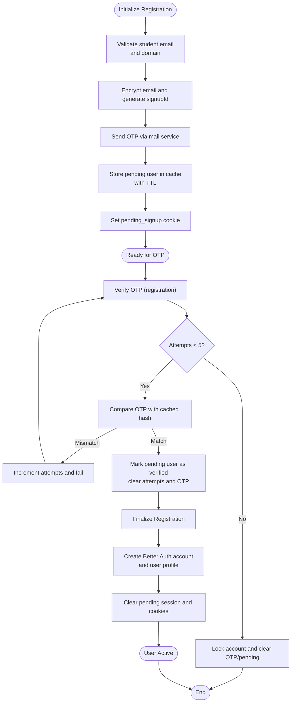
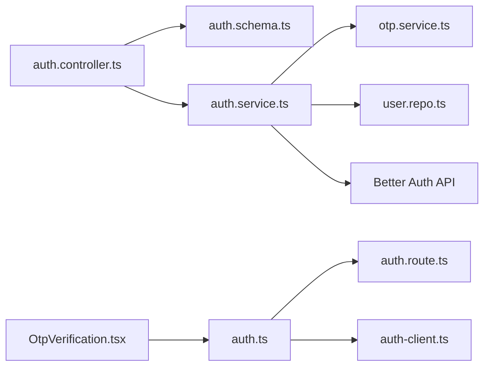

# User Registration Flow

<cite>
**Referenced Files in This Document**
- [auth.controller.ts](file://server/src/modules/auth/auth.controller.ts)
- [auth.service.ts](file://server/src/modules/auth/auth.service.ts)
- [auth.schema.ts](file://server/src/modules/auth/auth.schema.ts)
- [auth.route.ts](file://server/src/modules/auth/auth.route.ts)
- [otp.service.ts](file://server/src/modules/auth/otp/otp.service.ts)
- [auth-client.ts](file://web/src/lib/auth-client.ts)
- [auth.ts](file://web/src/services/api/auth.ts)
- [OtpVerification.tsx](file://web/src/components/general/OtpVerification.tsx)
- [user.repo.ts](file://server/src/modules/user/user.repo.ts)
- [auth.types.ts](file://server/src/modules/auth/auth.types.ts)
</cite>

## Table of Contents
1. [Introduction](#introduction)
2. [Project Structure](#project-structure)
3. [Core Components](#core-components)
4. [Architecture Overview](#architecture-overview)
5. [Detailed Component Analysis](#detailed-component-analysis)
6. [Dependency Analysis](#dependency-analysis)
7. [Performance Considerations](#performance-considerations)
8. [Troubleshooting Guide](#troubleshooting-guide)
9. [Conclusion](#conclusion)

## Introduction
This document explains the user registration flow in Flick’s authentication system. It covers the multi-stage process from email initialization and OTP verification to user profile completion and onboarding. It documents the controller endpoints, schema validation, service-layer implementation, the pending signup cookie mechanism, registration state management, and error handling. It also provides a complete workflow sequence diagram and practical troubleshooting guidance.

## Project Structure
The registration flow spans the server-side authentication module and the web client:
- Server routes define the registration endpoints.
- Controllers handle HTTP requests and delegate to services.
- Services orchestrate validation, OTP delivery, caching, Better Auth integration, and database writes.
- Frontend integrates with the server via an API client and UI components for OTP entry and submission.

**Diagram sources**
- [auth.route.ts](file://server/src/modules/auth/auth.route.ts#L1-L44)
- [auth.controller.ts](file://server/src/modules/auth/auth.controller.ts#L1-L228)
- [auth.service.ts](file://server/src/modules/auth/auth.service.ts#L1-L782)
- [otp.service.ts](file://server/src/modules/auth/otp/otp.service.ts#L1-L45)
- [user.repo.ts](file://server/src/modules/user/user.repo.ts#L1-L67)
- [auth.ts](file://web/src/services/api/auth.ts#L1-L156)
- [OtpVerification.tsx](file://web/src/components/general/OtpVerification.tsx#L1-L140)
- [auth-client.ts](file://web/src/lib/auth-client.ts#L1-L20)

**Section sources**
- [auth.route.ts](file://server/src/modules/auth/auth.route.ts#L1-L44)
- [auth.controller.ts](file://server/src/modules/auth/auth.controller.ts#L1-L228)
- [auth.service.ts](file://server/src/modules/auth/auth.service.ts#L1-L782)
- [otp.service.ts](file://server/src/modules/auth/otp/otp.service.ts#L1-L45)
- [user.repo.ts](file://server/src/modules/user/user.repo.ts#L1-L67)
- [auth.ts](file://web/src/services/api/auth.ts#L1-L156)
- [OtpVerification.tsx](file://web/src/components/general/OtpVerification.tsx#L1-L140)
- [auth-client.ts](file://web/src/lib/auth-client.ts#L1-L20)

## Core Components
- Registration endpoints:
  - Initialize registration: POST /api/auth/registration/initialize
  - Send OTP: POST /api/auth/otp/send
  - Verify OTP (registration): POST /api/auth/registration/verify-otp
  - Finalize registration: POST /api/auth/registration/finalize
  - Complete onboarding: POST /api/auth/onboarding/complete
- Schema validations enforce:
  - Email presence and format
  - OTP presence
  - Password minimum length
  - Branch presence for onboarding
- Service-layer responsibilities:
  - Validate student email and college association
  - Encrypt email and create a UUID-based signup session
  - Store pending user in cache with a short TTL
  - Set a pending_signup cookie for the browser session
  - Deliver OTP via email and compare against cached hash
  - Create Better Auth account and user profile
  - Transition user status to ONBOARDING and later ACTIVE

**Section sources**
- [auth.route.ts](file://server/src/modules/auth/auth.route.ts#L10-L31)
- [auth.schema.ts](file://server/src/modules/auth/auth.schema.ts#L1-L97)
- [auth.controller.ts](file://server/src/modules/auth/auth.controller.ts#L43-L123)
- [auth.service.ts](file://server/src/modules/auth/auth.service.ts#L48-L286)

## Architecture Overview
The registration flow is a controlled, stateful process with explicit boundaries:
- Initialization validates the student email and associates a college, creates a signup session, and sends OTP.
- OTP verification confirms identity and marks the pending user as verified.
- Finalization creates the Better Auth account and user profile, clears the pending session, and returns credentials.
- Onboarding completes the profile and activates the user.

**Diagram sources**
- [auth.route.ts](file://server/src/modules/auth/auth.route.ts#L14-L16)
- [auth.controller.ts](file://server/src/modules/auth/auth.controller.ts#L100-L123)
- [auth.service.ts](file://server/src/modules/auth/auth.service.ts#L48-L286)
- [otp.service.ts](file://server/src/modules/auth/otp/otp.service.ts#L8-L41)
- [auth.ts](file://web/src/services/api/auth.ts#L104-L121)

## Detailed Component Analysis

### Registration Endpoints and Controller Flow
- POST /api/auth/registration/initialize
  - Validates email and password.
  - Calls service to initialize registration, send OTP, and set pending session.
- POST /api/auth/otp/send
  - Validates email and requires a pending signup identifier.
  - Delegates to OTP service to deliver OTP and cache hashed OTP.
- POST /api/auth/registration/verify-otp
  - Validates OTP and checks pending signup cookie/body.
  - Enforces OTP attempt limits and marks pending user as verified.
- POST /api/auth/registration/finalize
  - Requires verified pending user and password.
  - Creates Better Auth account and user profile, clears pending session.
- POST /api/auth/onboarding/complete
  - Updates profile branch and status to ACTIVE.

**Section sources**
- [auth.controller.ts](file://server/src/modules/auth/auth.controller.ts#L43-L123)
- [auth.route.ts](file://server/src/modules/auth/auth.route.ts#L14-L31)

### Schema Validation
- Email validation enforces presence and format.
- OTP requires a string.
- Password must be at least six characters for registration.
- Branch must be a non-empty string for onboarding.

**Section sources**
- [auth.schema.ts](file://server/src/modules/auth/auth.schema.ts#L3-L39)
- [auth.schema.ts](file://server/src/modules/auth/auth.schema.ts#L29-L33)

### Service Layer Implementation
- Pending user lifecycle:
  - Pending user structure includes encrypted email, collegeId, and verified flag.
  - Stored under a cache key with a short TTL and marked as unverified initially.
  - Verified state updates the cache entry and removes OTP attempts.
- Initialization:
  - Validates student email and ensures a valid college association.
  - Encrypts email and generates a UUID for signupId.
  - Sends OTP and stores pending user in cache.
  - Sets a pending_signup cookie with secure attributes and 15-minute expiry.
- OTP verification:
  - Tracks OTP attempts per signupId and locks out after five failures.
  - Compares OTP against cached hash and clears keys upon success.
- Finalization:
  - Requires verified pending user.
  - Creates Better Auth account via Better Auth API and sets emailVerified.
  - Creates user profile with status ONBOARDING and clears pending session.
- Onboarding:
  - Updates branch and status to ACTIVE for authenticated users.

**Diagram sources**
- [auth.service.ts](file://server/src/modules/auth/auth.service.ts#L48-L147)
- [otp.service.ts](file://server/src/modules/auth/otp/otp.service.ts#L8-L41)
- [auth.types.ts](file://server/src/modules/auth/auth.types.ts#L1-L9)

**Section sources**
- [auth.service.ts](file://server/src/modules/auth/auth.service.ts#L31-L286)
- [otp.service.ts](file://server/src/modules/auth/otp/otp.service.ts#L1-L45)
- [auth.types.ts](file://server/src/modules/auth/auth.types.ts#L1-L9)

### Frontend Integration
- Web client API:
  - Provides methods for initializing registration, sending OTP, verifying OTP, finalizing registration, and completing onboarding.
  - Uses base URL pointing to /api/auth.
- Better Auth client:
  - Configured with base URL and Google OAuth plugin.
- OTP UI component:
  - Handles 6-digit OTP input, resend, attempt tracking, and invalid OTP messaging.

**Section sources**
- [auth.ts](file://web/src/services/api/auth.ts#L104-L127)
- [auth-client.ts](file://web/src/lib/auth-client.ts#L9-L19)
- [OtpVerification.tsx](file://web/src/components/general/OtpVerification.tsx#L30-L139)

## Dependency Analysis
- Controllers depend on:
  - Zod schemas for validation
  - AuthService for business logic
- AuthService depends on:
  - OTP service for OTP delivery and verification
  - Better Auth API for account creation and session handling
  - Redis cache for pending sessions and OTP storage
  - User repository for profile creation/update
- Frontend depends on:
  - API client for server communication
  - Better Auth client for session management
  - UI component for OTP entry

**Diagram sources**
- [auth.controller.ts](file://server/src/modules/auth/auth.controller.ts#L1-L228)
- [auth.schema.ts](file://server/src/modules/auth/auth.schema.ts#L1-L97)
- [auth.service.ts](file://server/src/modules/auth/auth.service.ts#L1-L782)
- [otp.service.ts](file://server/src/modules/auth/otp/otp.service.ts#L1-L45)
- [user.repo.ts](file://server/src/modules/user/user.repo.ts#L1-L67)
- [auth.ts](file://web/src/services/api/auth.ts#L1-L156)
- [auth-client.ts](file://web/src/lib/auth-client.ts#L1-L20)
- [OtpVerification.tsx](file://web/src/components/general/OtpVerification.tsx#L1-L140)

**Section sources**
- [auth.controller.ts](file://server/src/modules/auth/auth.controller.ts#L1-L228)
- [auth.service.ts](file://server/src/modules/auth/auth.service.ts#L1-L782)
- [auth.route.ts](file://server/src/modules/auth/auth.route.ts#L1-L44)
- [auth.ts](file://web/src/services/api/auth.ts#L1-L156)

## Performance Considerations
- Cache TTLs:
  - Pending user and OTP entries expire after 15 minutes, reducing stale data and memory pressure.
- Rate limiting:
  - Authentication endpoints are rate-limited at the route level to mitigate abuse.
- OTP attempt caps:
  - Prevent brute-force attempts by locking out after five failures.
- Session creation:
  - Better Auth handles session tokens; local cookie usage is minimized for security.

[No sources needed since this section provides general guidance]

## Troubleshooting Guide
Common issues and resolutions:
- Invalid or expired signup session:
  - Symptom: Forbidden error when accessing verification or finalization.
  - Cause: Missing or expired pending_signup cookie/session.
  - Resolution: Restart the registration flow from initialization.
- Too many OTP attempts:
  - Symptom: Forbidden error after five invalid OTP attempts.
  - Cause: OTP attempt counter reached threshold.
  - Resolution: Wait for lockout to clear or request a new OTP.
- OTP mismatch:
  - Symptom: Invalid OTP error during verification.
  - Cause: Incorrect OTP or expired OTP cache.
  - Resolution: Request a new OTP and retry.
- User already verified:
  - Symptom: Forbidden error during finalization.
  - Cause: Attempting to finalize without prior OTP verification.
  - Resolution: Complete OTP verification before finalization.
- College not found:
  - Symptom: Not Found error during initialization.
  - Cause: Email domain not mapped to a valid college.
  - Resolution: Use a valid institutional email.
- Disposable email used:
  - Symptom: Bad Request error.
  - Cause: Disposable email domain detected.
  - Resolution: Use a non-disposable email.
- Profile creation failure:
  - Symptom: Internal error while creating profile.
  - Cause: Constraint violation or race condition.
  - Resolution: Retry; backend recovers by fetching existing profile.

**Section sources**
- [auth.service.ts](file://server/src/modules/auth/auth.service.ts#L48-L147)
- [auth.service.ts](file://server/src/modules/auth/auth.service.ts#L149-L243)
- [auth.service.ts](file://server/src/modules/auth/auth.service.ts#L288-L308)
- [auth.schema.ts](file://server/src/modules/auth/auth.schema.ts#L561-L589)

## Conclusion
Flick’s registration flow is a secure, stateful process that validates student identities, manages OTP-based verification, and provisions user accounts and profiles. The controller endpoints, strict schema validations, and service-layer safeguards ensure robustness. The pending signup cookie and cache-backed state enable a smooth user experience while maintaining security. Following the troubleshooting steps and best practices outlined here will help diagnose and resolve common issues efficiently.