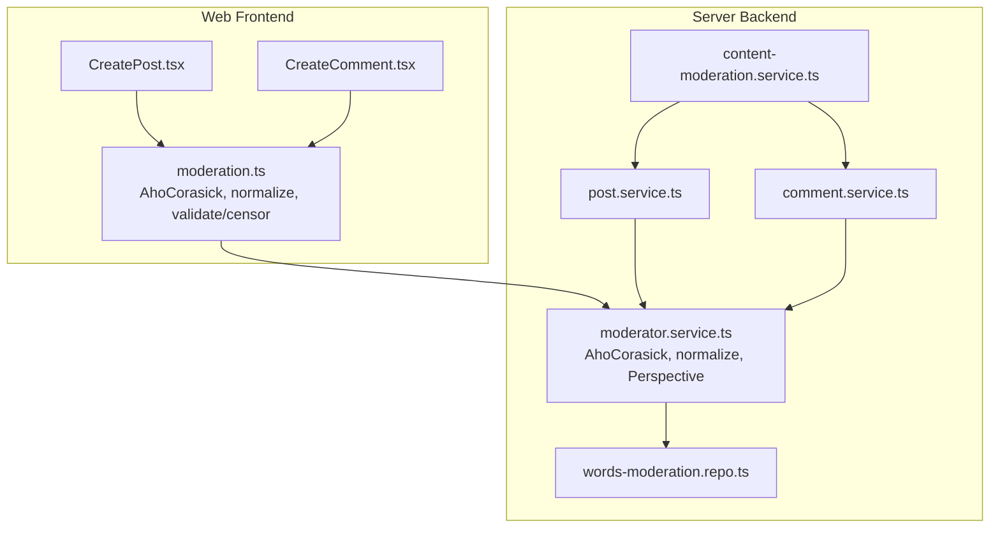
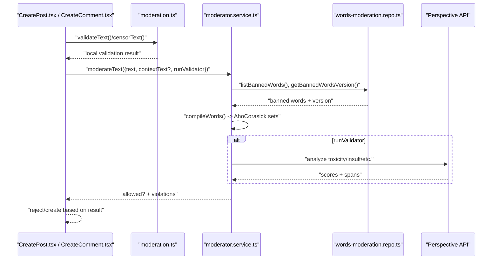
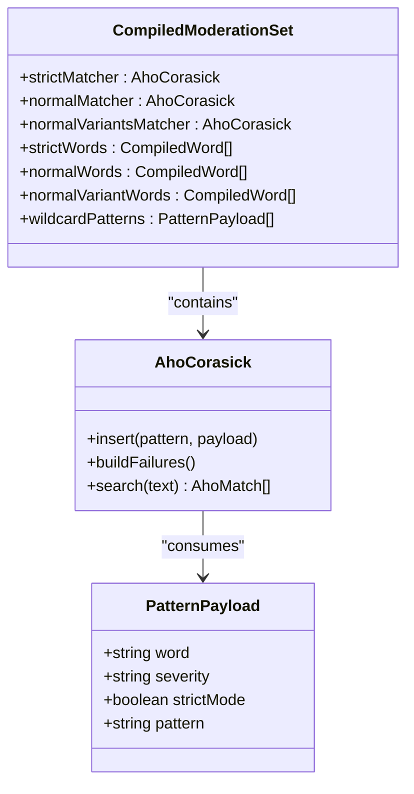
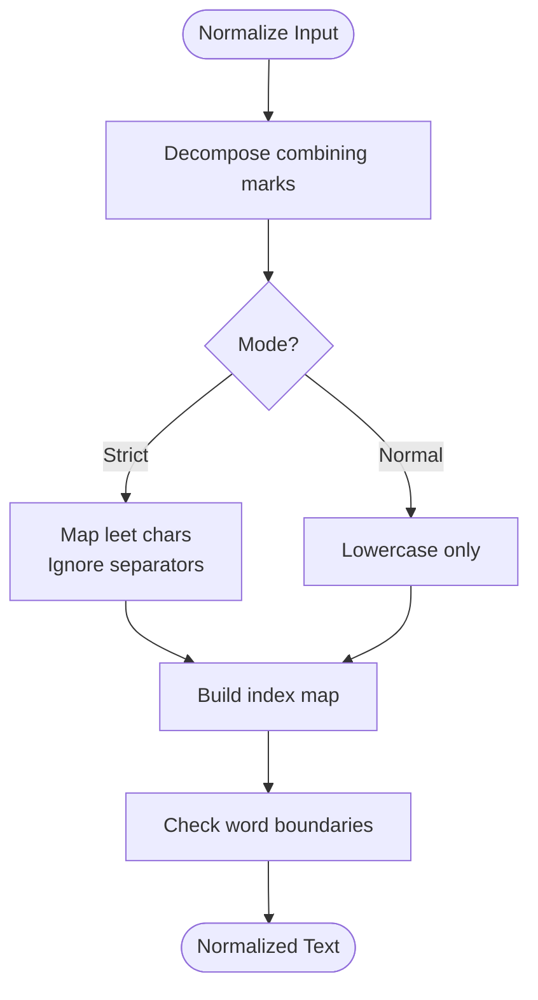
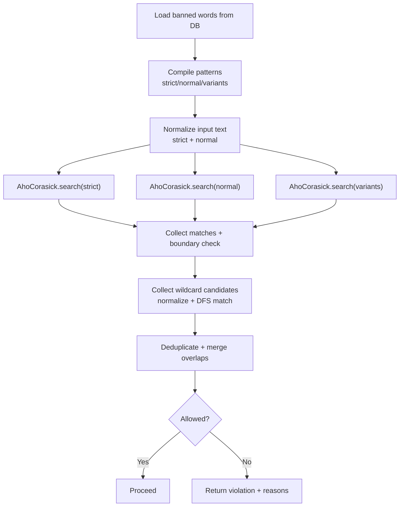
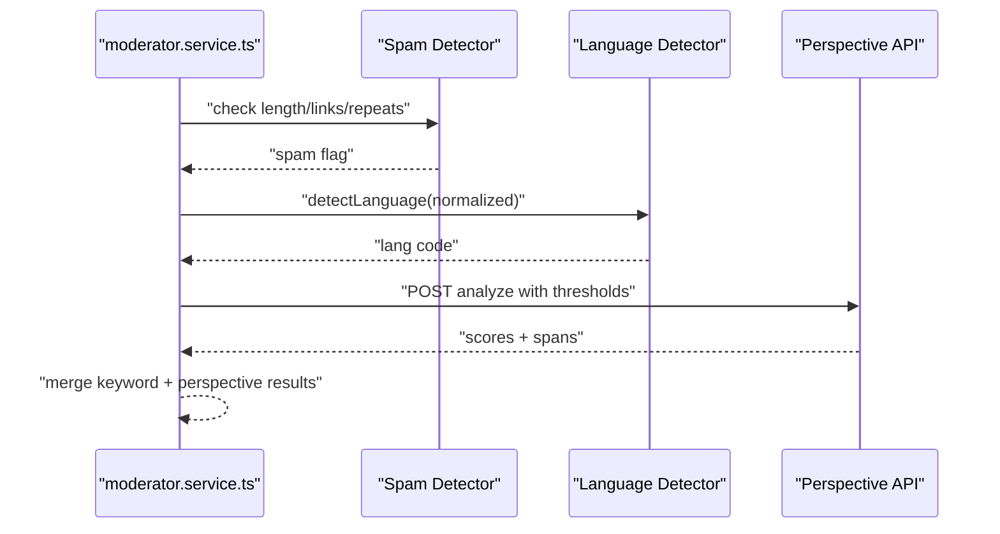
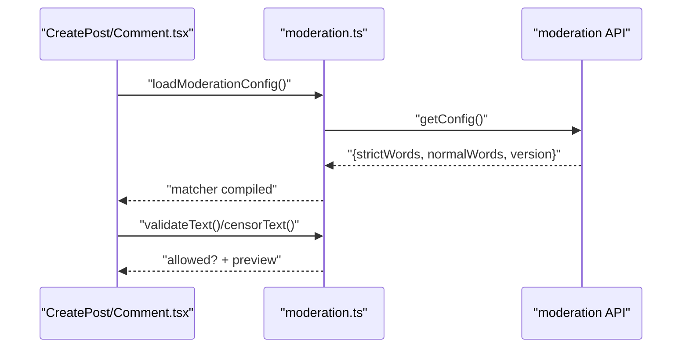
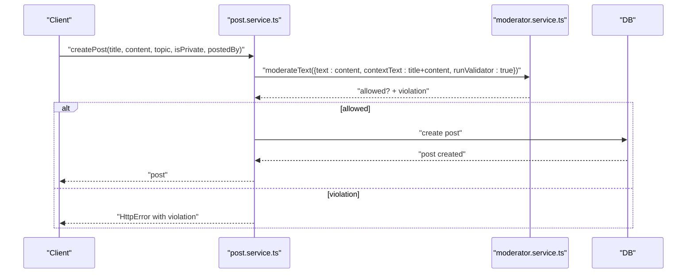
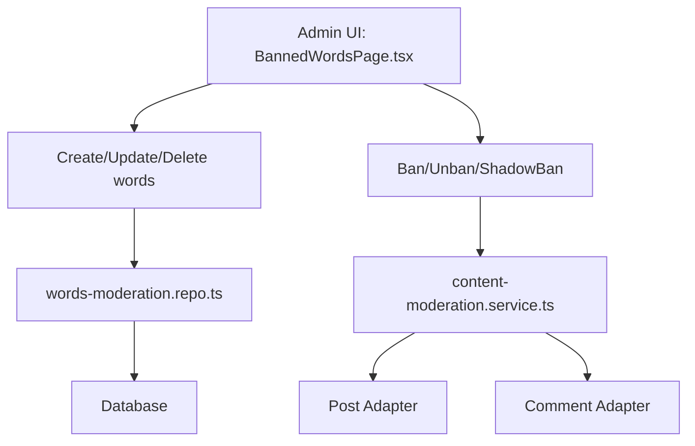
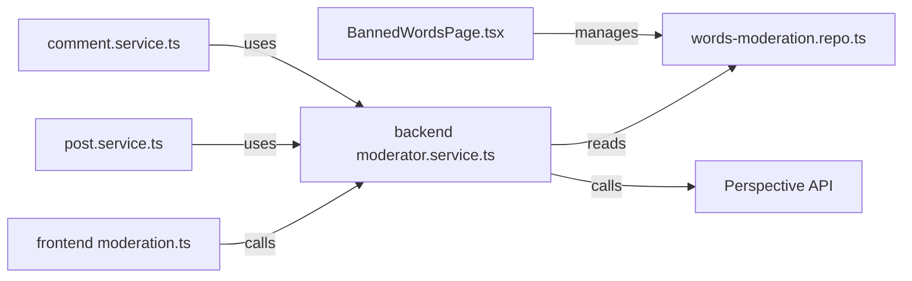

# Automated Content Filtering

<cite>
**Referenced Files in This Document**
- [moderator.service.ts](file://server/src/infra/services/moderator/moderator.service.ts)
- [normalize.ts](file://server/src/infra/services/moderator/normalize.ts)
- [aho-corasick.ts](file://server/src/infra/services/moderator/aho-corasick.ts)
- [words-moderation.repo.ts](file://server/src/modules/moderation/words/words-moderation.repo.ts)
- [content-moderation.service.ts](file://server/src/modules/moderation/content/content-moderation.service.ts)
- [post.service.ts](file://server/src/modules/post/post.service.ts)
- [comment.service.ts](file://server/src/modules/comment/comment.service.ts)
- [moderation.ts](file://web/src/utils/moderation.ts)
- [CreatePost.tsx](file://web/src/components/general/CreatePost.tsx)
- [CreateComment.tsx](file://web/src/components/general/CreateComment.tsx)
- [BannedWordsPage.tsx](file://admin/src/pages/BannedWordsPage.tsx)
</cite>

## Table of Contents
1. [Introduction](#introduction)
2. [Project Structure](#project-structure)
3. [Core Components](#core-components)
4. [Architecture Overview](#architecture-overview)
5. [Detailed Component Analysis](#detailed-component-analysis)
6. [Dependency Analysis](#dependency-analysis)
7. [Performance Considerations](#performance-considerations)
8. [Troubleshooting Guide](#troubleshooting-guide)
9. [Conclusion](#conclusion)

## Introduction
This document explains the automated content filtering system used to detect and moderate prohibited content during post and comment creation. It focuses on:
- Efficient keyword detection using the Aho-Corasick string matching algorithm
- Banned word normalization and boundary-aware matching
- Real-time content analysis and moderation decisions
- The end-to-end filtering pipeline from ingestion to enforcement
- Performance optimizations, false positive handling, and thresholds
- Integration with post/comment creation workflows and administrative controls

## Project Structure
The filtering system spans backend and frontend layers:
- Backend services orchestrate moderation decisions and enforce policies
- Frontend utilities pre-validate and optionally sanitize content before submission
- Administrative UI allows managing banned words and their modes/severities

**Diagram sources**
- [moderation.ts](file://web/src/utils/moderation.ts#L1-L671)
- [moderator.service.ts](file://server/src/infra/services/moderator/moderator.service.ts#L1-L641)
- [words-moderation.repo.ts](file://server/src/modules/moderation/words/words-moderation.repo.ts#L1-L111)
- [post.service.ts](file://server/src/modules/post/post.service.ts#L1-L408)
- [comment.service.ts](file://server/src/modules/comment/comment.service.ts#L1-L377)
- [content-moderation.service.ts](file://server/src/modules/moderation/content/content-moderation.service.ts#L1-L252)

**Section sources**
- [moderation.ts](file://web/src/utils/moderation.ts#L1-L671)
- [moderator.service.ts](file://server/src/infra/services/moderator/moderator.service.ts#L1-L641)
- [words-moderation.repo.ts](file://server/src/modules/moderation/words/words-moderation.repo.ts#L1-L111)
- [post.service.ts](file://server/src/modules/post/post.service.ts#L1-L408)
- [comment.service.ts](file://server/src/modules/comment/comment.service.ts#L1-L377)
- [content-moderation.service.ts](file://server/src/modules/moderation/content/content-moderation.service.ts#L1-L252)

## Core Components
- Aho-Corasick string matching engine for fast multi-pattern detection
- Text normalization utilities for leet-speak, diacritics, and strict/normal modes
- Dynamic banned word compilation from the database with caching and versioning
- Real-time moderation with Perspective API scoring and spam detection
- Frontend pre-validation and optional content sanitization

Key responsibilities:
- Compile banned words into three automata: strict, normal, and normal variants
- Detect wildcard patterns separately for user-entered wildcards
- Deduplicate and merge overlapping matches to reduce false positives
- Enforce moderation decisions at post/comment creation/update

**Section sources**
- [aho-corasick.ts](file://server/src/infra/services/moderator/aho-corasick.ts#L1-L118)
- [normalize.ts](file://server/src/infra/services/moderator/normalize.ts#L1-L110)
- [moderator.service.ts](file://server/src/infra/services/moderator/moderator.service.ts#L57-L641)
- [words-moderation.repo.ts](file://server/src/modules/moderation/words/words-moderation.repo.ts#L1-L111)
- [moderation.ts](file://web/src/utils/moderation.ts#L1-L671)

## Architecture Overview
The filtering pipeline integrates frontend and backend:
- Frontend loads moderation configuration and validates input locally
- Backend compiles banned words and applies dynamic and policy-based checks
- Decisions are enforced at creation/update boundaries; administrative actions ban/shadow-ban content

**Diagram sources**
- [moderation.ts](file://web/src/utils/moderation.ts#L430-L484)
- [moderator.service.ts](file://server/src/infra/services/moderator/moderator.service.ts#L418-L636)
- [words-moderation.repo.ts](file://server/src/modules/moderation/words/words-moderation.repo.ts#L16-L110)

## Detailed Component Analysis

### Aho-Corasick Implementation
The backend Aho-Corasick implementation builds a finite-state automaton from normalized banned word patterns. It supports:
- Strict normalization (leet-speak mapping, punctuation removal)
- Normal normalization (diacritics decomposition, lowercase)
- Wildcard pattern detection for user-entered patterns like “f*ck”

**Diagram sources**
- [aho-corasick.ts](file://server/src/infra/services/moderator/aho-corasick.ts#L1-L118)
- [moderator.service.ts](file://server/src/infra/services/moderator/moderator.service.ts#L34-L55)

**Section sources**
- [aho-corasick.ts](file://server/src/infra/services/moderator/aho-corasick.ts#L1-L118)
- [moderator.service.ts](file://server/src/infra/services/moderator/moderator.service.ts#L233-L386)

### Banned Word Normalization and Boundary Matching
Normalization ensures robust detection across variations:
- Diacritics decomposition and lowercasing
- Leet-speak mapping (e.g., @ → a, 1 → i)
- Strict mode ignores punctuation and inline symbols
- Boundary checks ensure matches occur at word boundaries

**Diagram sources**
- [normalize.ts](file://server/src/infra/services/moderator/normalize.ts#L51-L98)
- [normalize.ts](file://server/src/infra/services/moderator/normalize.ts#L100-L110)

**Section sources**
- [normalize.ts](file://server/src/infra/services/moderator/normalize.ts#L1-L110)

### Dynamic Keyword Detection Pipeline
The backend compiles banned words into three automata:
- strictMatcher: strict-normalized patterns
- normalMatcher: normal-normalized patterns
- normalVariantsMatcher: normal patterns whose strict-normalized form differs

Wildcard patterns are collected from user input and matched against strict-normalized wildcard patterns.

**Diagram sources**
- [moderator.service.ts](file://server/src/infra/services/moderator/moderator.service.ts#L233-L386)
- [moderator.service.ts](file://server/src/infra/services/moderator/moderator.service.ts#L77-L107)

**Section sources**
- [moderator.service.ts](file://server/src/infra/services/moderator/moderator.service.ts#L233-L386)
- [moderator.service.ts](file://server/src/infra/services/moderator/moderator.service.ts#L77-L107)

### Real-Time Content Analysis and Thresholds
Beyond keyword detection, the system performs:
- Spam detection (length, link density, repetition)
- Self-harm encouragement detection
- Perspective API scoring with configurable thresholds

Thresholds:
- TOXICITY: 0.8
- INSULT: 0.7
- IDENTITY_ATTACK: 0.6
- THREAT: 0.4
- PROFANITY: 0.6

**Diagram sources**
- [moderator.service.ts](file://server/src/infra/services/moderator/moderator.service.ts#L388-L598)
- [moderator.service.ts](file://server/src/infra/services/moderator/moderator.service.ts#L67-L73)

**Section sources**
- [moderator.service.ts](file://server/src/infra/services/moderator/moderator.service.ts#L388-L598)
- [moderator.service.ts](file://server/src/infra/services/moderator/moderator.service.ts#L67-L73)

### Frontend Pre-Validation and Sanitization
The frontend provides:
- Asynchronous loading of moderation configuration
- Local validation and preview of flagged content
- Optional sanitization of content before submission

**Diagram sources**
- [moderation.ts](file://web/src/utils/moderation.ts#L430-L484)
- [moderation.ts](file://web/src/utils/moderation.ts#L592-L622)

**Section sources**
- [moderation.ts](file://web/src/utils/moderation.ts#L430-L484)
- [moderation.ts](file://web/src/utils/moderation.ts#L592-L622)
- [CreatePost.tsx](file://web/src/components/general/CreatePost.tsx#L163-L219)
- [CreateComment.tsx](file://web/src/components/general/CreateComment.tsx#L107-L165)

### Post and Comment Creation Workflows
Both services integrate moderation:
- Post creation: validates content and title, throws detailed violations
- Comment creation: validates content, enforces parent-child constraints, and bans shadow-banned posts

**Diagram sources**
- [post.service.ts](file://server/src/modules/post/post.service.ts#L40-L94)
- [moderator.service.ts](file://server/src/infra/services/moderator/moderator.service.ts#L592-L636)

**Section sources**
- [post.service.ts](file://server/src/modules/post/post.service.ts#L40-L94)
- [comment.service.ts](file://server/src/modules/comment/comment.service.ts#L69-L203)

### Administrative Controls
Administrators manage banned words and enforce moderation outcomes:
- Manage banned words (add/update/delete), configure severity and strict mode
- Ban/unban or shadow-ban posts; resolve related reports

**Diagram sources**
- [BannedWordsPage.tsx](file://admin/src/pages/BannedWordsPage.tsx#L35-L129)
- [words-moderation.repo.ts](file://server/src/modules/moderation/words/words-moderation.repo.ts#L45-L102)
- [content-moderation.service.ts](file://server/src/modules/moderation/content/content-moderation.service.ts#L7-L142)

**Section sources**
- [BannedWordsPage.tsx](file://admin/src/pages/BannedWordsPage.tsx#L35-L129)
- [words-moderation.repo.ts](file://server/src/modules/moderation/words/words-moderation.repo.ts#L45-L102)
- [content-moderation.service.ts](file://server/src/modules/moderation/content/content-moderation.service.ts#L7-L142)

## Dependency Analysis
- Frontend depends on a local Aho-Corasick and normalization utilities
- Backend depends on the database for banned word configuration and caches compiled automata
- Backend integrates with Perspective API for contextual toxicity scoring
- Post and Comment services depend on the moderator service for enforcement

**Diagram sources**
- [moderation.ts](file://web/src/utils/moderation.ts#L1-L671)
- [moderator.service.ts](file://server/src/infra/services/moderator/moderator.service.ts#L1-L641)
- [words-moderation.repo.ts](file://server/src/modules/moderation/words/words-moderation.repo.ts#L1-L111)
- [post.service.ts](file://server/src/modules/post/post.service.ts#L1-L408)
- [comment.service.ts](file://server/src/modules/comment/comment.service.ts#L1-L377)
- [BannedWordsPage.tsx](file://admin/src/pages/BannedWordsPage.tsx#L1-L307)

**Section sources**
- [moderation.ts](file://web/src/utils/moderation.ts#L1-L671)
- [moderator.service.ts](file://server/src/infra/services/moderator/moderator.service.ts#L1-L641)
- [words-moderation.repo.ts](file://server/src/modules/moderation/words/words-moderation.repo.ts#L1-L111)
- [post.service.ts](file://server/src/modules/post/post.service.ts#L1-L408)
- [comment.service.ts](file://server/src/modules/comment/comment.service.ts#L1-L377)
- [BannedWordsPage.tsx](file://admin/src/pages/BannedWordsPage.tsx#L1-L307)

## Performance Considerations
- Compiled automata caching: backend caches compiled banned word sets and refreshes on version change
- Frontend config caching: local config loaded with short TTL and version-based invalidation
- Deduplication and merging: reduces redundant highlights and improves UX
- Wildcard memoization: shared memo per call avoids repeated DFS computations
- Boundary checks: prevent false positives by ensuring word boundaries
- Perspective API timeouts: abort long-running requests and fail-closed on errors

Recommendations:
- Keep banned word lists pruned and ordered to minimize automaton size
- Monitor cache hit rates and adjust TTLs based on moderation cadence
- Consider batching wildcard candidates to reduce DFS overhead
- Tune Perspective thresholds per community guidelines

**Section sources**
- [moderator.service.ts](file://server/src/infra/services/moderator/moderator.service.ts#L59-L63)
- [moderator.service.ts](file://server/src/infra/services/moderator/moderator.service.ts#L427-L458)
- [moderation.ts](file://web/src/utils/moderation.ts#L430-L484)
- [moderation.ts](file://web/src/utils/moderation.ts#L501-L534)
- [moderation.ts](file://web/src/utils/moderation.ts#L315-L358)
- [moderator.service.ts](file://server/src/infra/services/moderator/moderator.service.ts#L505-L528)

## Troubleshooting Guide
Common issues and resolutions:
- False positives due to leet-speak or punctuation: enable strict mode for sensitive words; review normalization behavior
- Overlapping matches: rely on deduplication and merging; verify boundary checks
- Wildcard evasion: ensure wildcard candidates meet literal and bridge criteria; validate DFS memoization
- Perspective API failures: expect fail-closed behavior; verify API key and network connectivity
- Stale banned word lists: confirm version checks and cache invalidation triggers
- Frontend lag: ensure config loading completes before validation; debounce frequent checks

Operational tips:
- Use administrative UI to adjust severity and strict mode for problematic entries
- Monitor moderation violations and refine banned word lists iteratively
- Provide user-friendly previews and guidance messages for flagged content

**Section sources**
- [moderation.ts](file://web/src/utils/moderation.ts#L592-L622)
- [moderator.service.ts](file://server/src/infra/services/moderator/moderator.service.ts#L388-L598)
- [BannedWordsPage.tsx](file://admin/src/pages/BannedWordsPage.tsx#L135-L146)

## Conclusion
The automated content filtering system combines efficient string matching, robust normalization, and real-time policy evaluation to maintain a safe and respectful platform. By integrating frontend pre-validation with backend enforcement and administrative controls, it balances strict moderation with a positive user experience. Continuous tuning of banned word lists, thresholds, and normalization rules ensures adaptability to evolving content challenges.