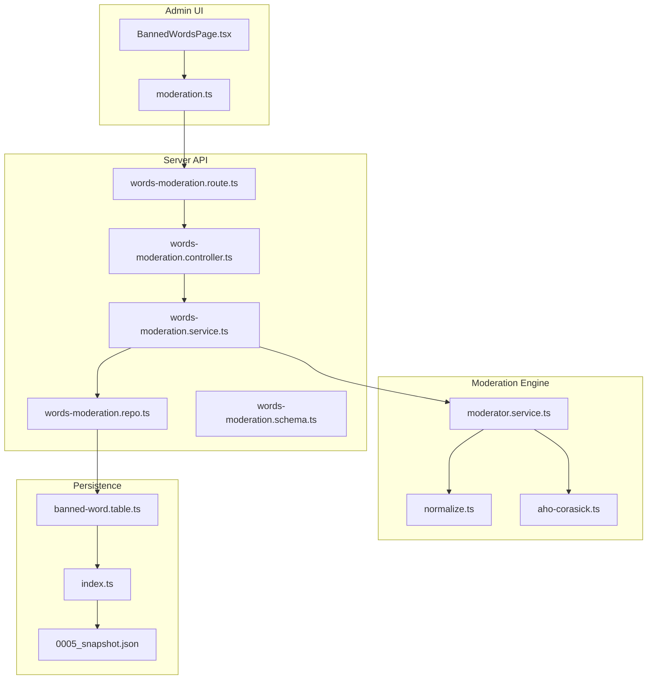
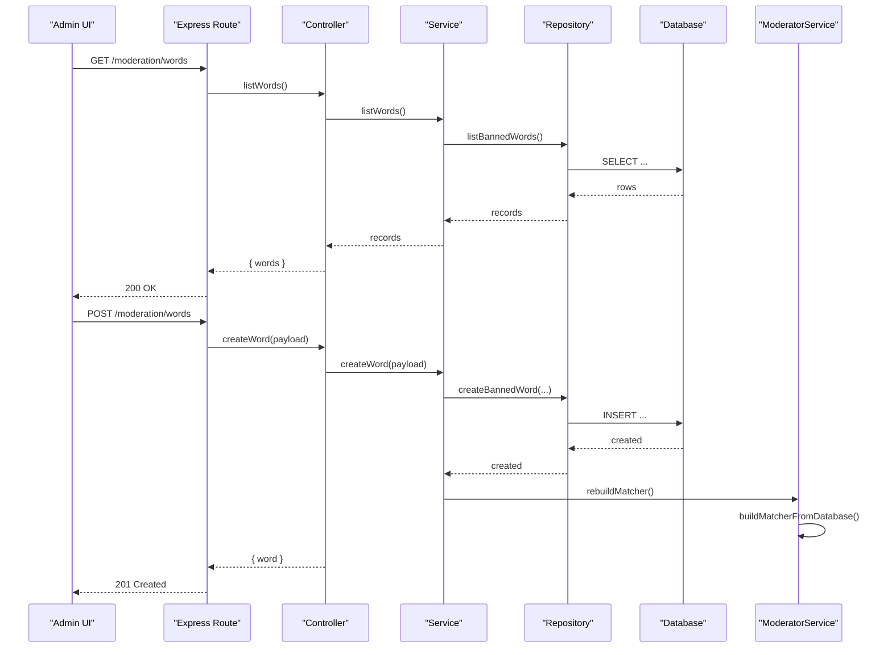
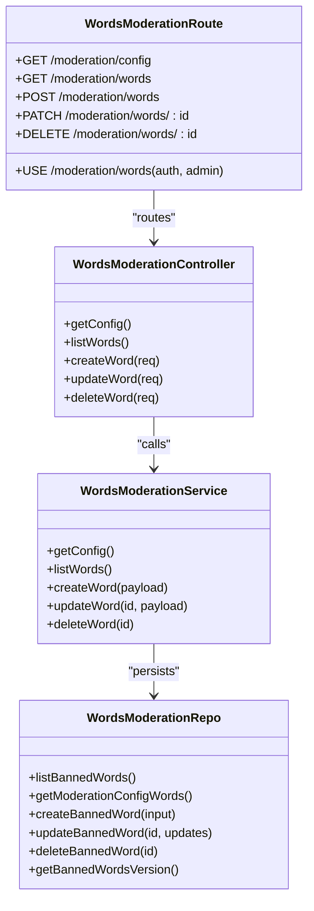
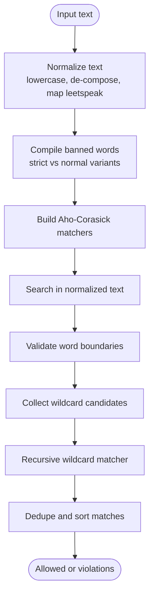
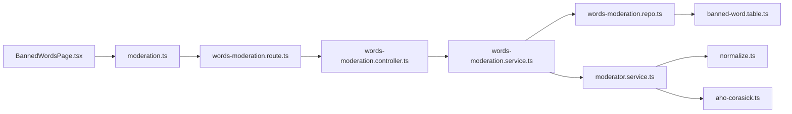

# Banned Words Management

<cite>
**Referenced Files in This Document**
- [BannedWordsPage.tsx](file://admin/src/pages/BannedWordsPage.tsx)
- [moderation.ts](file://admin/src/services/api/moderation.ts)
- [words-moderation.controller.ts](file://server/src/modules/moderation/words/words-moderation.controller.ts)
- [words-moderation.service.ts](file://server/src/modules/moderation/words/words-moderation.service.ts)
- [words-moderation.repo.ts](file://server/src/modules/moderation/words/words-moderation.repo.ts)
- [words-moderation.route.ts](file://server/src/modules/moderation/words/words-moderation.route.ts)
- [words-moderation.schema.ts](file://server/src/modules/moderation/words/words-moderation.schema.ts)
- [moderator.service.ts](file://server/src/infra/services/moderator/moderator.service.ts)
- [normalize.ts](file://server/src/infra/services/moderator/normalize.ts)
- [aho-corasick.ts](file://server/src/infra/services/moderator/aho-corasick.ts)
- [banned-word.table.ts](file://server/src/infra/db/tables/banned-word.table.ts)
- [index.ts](file://server/src/infra/db/tables/index.ts)
- [0005_snapshot.json](file://server/drizzle/meta/0005_snapshot.json)
</cite>

## Table of Contents
1. [Introduction](#introduction)
2. [Project Structure](#project-structure)
3. [Core Components](#core-components)
4. [Architecture Overview](#architecture-overview)
5. [Detailed Component Analysis](#detailed-component-analysis)
6. [Dependency Analysis](#dependency-analysis)
7. [Performance Considerations](#performance-considerations)
8. [Troubleshooting Guide](#troubleshooting-guide)
9. [Conclusion](#conclusion)
10. [Appendices](#appendices)

## Introduction
This document explains the banned words management system used to maintain a global blocklist of words and phrases, enforce dynamic filtering during content moderation, and provide administrative capabilities to manage the list. It covers:
- Administrative interface for adding, editing, and removing banned words
- Dynamic updates to the filter database and runtime recompilation
- Word normalization and pattern strategies (including leetspeak evasion and wildcards)
- Performance characteristics and maintenance recommendations

## Project Structure
The banned words system spans three layers:
- Admin UI: React page and API client for managing the list
- Server API: Express routes, controllers, services, and repositories
- Moderation engine: Text normalization, Aho-Corasick matching, and cache-backed evaluation

**Diagram sources**
- [BannedWordsPage.tsx](file://admin/src/pages/BannedWordsPage.tsx#L1-L307)
- [moderation.ts](file://admin/src/services/api/moderation.ts#L1-L48)
- [words-moderation.route.ts](file://server/src/modules/moderation/words/words-moderation.route.ts#L1-L24)
- [words-moderation.controller.ts](file://server/src/modules/moderation/words/words-moderation.controller.ts#L1-L45)
- [words-moderation.service.ts](file://server/src/modules/moderation/words/words-moderation.service.ts#L1-L66)
- [words-moderation.repo.ts](file://server/src/modules/moderation/words/words-moderation.repo.ts#L1-L111)
- [moderator.service.ts](file://server/src/infra/services/moderator/moderator.service.ts#L1-L642)
- [normalize.ts](file://server/src/infra/services/moderator/normalize.ts#L1-L110)
- [aho-corasick.ts](file://server/src/infra/services/moderator/aho-corasick.ts#L1-L118)
- [banned-word.table.ts](file://server/src/infra/db/tables/banned-word.table.ts#L1-L26)
- [index.ts](file://server/src/infra/db/tables/index.ts#L1-L23)
- [0005_snapshot.json](file://server/drizzle/meta/0005_snapshot.json#L729-L800)

**Section sources**
- [BannedWordsPage.tsx](file://admin/src/pages/BannedWordsPage.tsx#L1-L307)
- [words-moderation.route.ts](file://server/src/modules/moderation/words/words-moderation.route.ts#L1-L24)
- [words-moderation.controller.ts](file://server/src/modules/moderation/words/words-moderation.controller.ts#L1-L45)
- [words-moderation.service.ts](file://server/src/modules/moderation/words/words-moderation.service.ts#L1-L66)
- [words-moderation.repo.ts](file://server/src/modules/moderation/words/words-moderation.repo.ts#L1-L111)
- [moderator.service.ts](file://server/src/infra/services/moderator/moderator.service.ts#L1-L642)
- [normalize.ts](file://server/src/infra/services/moderator/normalize.ts#L1-L110)
- [aho-corasick.ts](file://server/src/infra/services/moderator/aho-corasick.ts#L1-L118)
- [banned-word.table.ts](file://server/src/infra/db/tables/banned-word.table.ts#L1-L26)
- [index.ts](file://server/src/infra/db/tables/index.ts#L1-L23)
- [0005_snapshot.json](file://server/drizzle/meta/0005_snapshot.json#L729-L800)

## Core Components
- Admin UI: Provides CRUD operations for banned words, search, and severity mode toggles.
- API Layer: Exposes endpoints to list, create, update, and delete banned words with role-based access control.
- Service Layer: Orchestrates persistence and triggers recompilation of the moderation matcher upon changes.
- Repository: Handles database operations and computes moderation word groups (strict vs normal).
- Moderation Engine: Compiles banned words into fast matchers, normalizes input, detects boundaries, and supports wildcards.

Key responsibilities:
- Administrative operations: [BannedWordsPage.tsx](file://admin/src/pages/BannedWordsPage.tsx#L50-L129), [moderation.ts](file://admin/src/services/api/moderation.ts#L23-L47)
- API exposure: [words-moderation.route.ts](file://server/src/modules/moderation/words/words-moderation.route.ts#L14-L21)
- Validation and enforcement: [words-moderation.schema.ts](file://server/src/modules/moderation/words/words-moderation.schema.ts#L3-L21)
- Persistence and grouping: [words-moderation.repo.ts](file://server/src/modules/moderation/words/words-moderation.repo.ts#L16-L110)
- Matching and normalization: [moderator.service.ts](file://server/src/infra/services/moderator/moderator.service.ts#L233-L386), [normalize.ts](file://server/src/infra/services/moderator/normalize.ts#L51-L110)

**Section sources**
- [BannedWordsPage.tsx](file://admin/src/pages/BannedWordsPage.tsx#L50-L129)
- [moderation.ts](file://admin/src/services/api/moderation.ts#L23-L47)
- [words-moderation.route.ts](file://server/src/modules/moderation/words/words-moderation.route.ts#L14-L21)
- [words-moderation.schema.ts](file://server/src/modules/moderation/words/words-moderation.schema.ts#L3-L21)
- [words-moderation.repo.ts](file://server/src/modules/moderation/words/words-moderation.repo.ts#L16-L110)
- [moderator.service.ts](file://server/src/infra/services/moderator/moderator.service.ts#L233-L386)
- [normalize.ts](file://server/src/infra/services/moderator/normalize.ts#L51-L110)

## Architecture Overview
The system follows a layered architecture with clear separation of concerns:
- Admin UI communicates with the backend via typed API calls.
- Routes enforce authentication and authorization, delegating to controllers.
- Controllers call services that coordinate repositories and external systems.
- The moderation engine compiles banned words into efficient matchers and caches results.

**Diagram sources**
- [words-moderation.route.ts](file://server/src/modules/moderation/words/words-moderation.route.ts#L14-L21)
- [words-moderation.controller.ts](file://server/src/modules/moderation/words/words-moderation.controller.ts#L17-L27)
- [words-moderation.service.ts](file://server/src/modules/moderation/words/words-moderation.service.ts#L21-L29)
- [words-moderation.repo.ts](file://server/src/modules/moderation/words/words-moderation.repo.ts#L45-L60)
- [moderator.service.ts](file://server/src/infra/services/moderator/moderator.service.ts#L427-L432)

**Section sources**
- [words-moderation.route.ts](file://server/src/modules/moderation/words/words-moderation.route.ts#L14-L21)
- [words-moderation.controller.ts](file://server/src/modules/moderation/words/words-moderation.controller.ts#L17-L27)
- [words-moderation.service.ts](file://server/src/modules/moderation/words/words-moderation.service.ts#L21-L29)
- [words-moderation.repo.ts](file://server/src/modules/moderation/words/words-moderation.repo.ts#L45-L60)
- [moderator.service.ts](file://server/src/infra/services/moderator/moderator.service.ts#L427-L432)

## Detailed Component Analysis

### Administrative Interface: BannedWordsPage
- Fetches and displays the current banned word list with search and severity badges.
- Supports adding new words and editing existing ones with severity and strict mode toggles.
- Uses a modal dialog to capture inputs and performs optimistic updates on success.

Operational highlights:
- Loading and error handling: [BannedWordsPage.tsx](file://admin/src/pages/BannedWordsPage.tsx#L54-L64)
- Form submission and updates: [BannedWordsPage.tsx](file://admin/src/pages/BannedWordsPage.tsx#L85-L117)
- Deletion workflow: [BannedWordsPage.tsx](file://admin/src/pages/BannedWordsPage.tsx#L119-L129)
- Search/filtering: [BannedWordsPage.tsx](file://admin/src/pages/BannedWordsPage.tsx#L131-L133)

**Section sources**
- [BannedWordsPage.tsx](file://admin/src/pages/BannedWordsPage.tsx#L54-L129)
- [BannedWordsPage.tsx](file://admin/src/pages/BannedWordsPage.tsx#L131-L133)

### API Layer: Routes, Controllers, Services, Repositories
- Routes: Enforce rate limiting and role-based access for word management endpoints.
- Controller: Delegates to service methods and returns standardized responses.
- Service: Validates inputs, persists changes, and triggers recompilation of the moderation matcher.
- Repository: Implements CRUD operations and categorizes words into strict and normal sets.

**Diagram sources**
- [words-moderation.route.ts](file://server/src/modules/moderation/words/words-moderation.route.ts#L1-L24)
- [words-moderation.controller.ts](file://server/src/modules/moderation/words/words-moderation.controller.ts#L10-L43)
- [words-moderation.service.ts](file://server/src/modules/moderation/words/words-moderation.service.ts#L12-L62)
- [words-moderation.repo.ts](file://server/src/modules/moderation/words/words-moderation.repo.ts#L16-L110)

**Section sources**
- [words-moderation.route.ts](file://server/src/modules/moderation/words/words-moderation.route.ts#L1-L24)
- [words-moderation.controller.ts](file://server/src/modules/moderation/words/words-moderation.controller.ts#L10-L43)
- [words-moderation.service.ts](file://server/src/modules/moderation/words/words-moderation.service.ts#L12-L62)
- [words-moderation.repo.ts](file://server/src/modules/moderation/words/words-moderation.repo.ts#L16-L110)

### Moderation Engine: Normalization, Matching, and Wildcards
- Normalization: Converts input to lowercase, removes combining marks, maps common leetspeak characters, and preserves word boundaries.
- Matching: Uses Aho-Corasick automata to efficiently find banned words across multiple normalized variants.
- Wildcards: Detects wildcard-like tokens and applies a recursive backtracking matcher to approximate pattern matching.
- Caching: Stores moderation results keyed by normalized text to reduce repeated work.

**Diagram sources**
- [moderator.service.ts](file://server/src/infra/services/moderator/moderator.service.ts#L233-L386)
- [normalize.ts](file://server/src/infra/services/moderator/normalize.ts#L51-L110)
- [aho-corasick.ts](file://server/src/infra/services/moderator/aho-corasick.ts#L20-L117)

**Section sources**
- [moderator.service.ts](file://server/src/infra/services/moderator/moderator.service.ts#L233-L386)
- [normalize.ts](file://server/src/infra/services/moderator/normalize.ts#L51-L110)
- [aho-corasick.ts](file://server/src/infra/services/moderator/aho-corasick.ts#L20-L117)

### Word Normalization Techniques
- Lowercasing and decomposition to remove accents and unify characters.
- Leetspeak mapping for common substitutions (e.g., @ → a, 4 → a, 1 → i, 0 → o, $ → s).
- Strict mode normalization ignores certain separators and special cases to increase detection fidelity against obfuscation.
- Boundary checks ensure matches occur at word boundaries to avoid partial substring false positives.

Implementation references:
- Normalization core: [normalize.ts](file://server/src/infra/services/moderator/normalize.ts#L51-L98)
- Strict boundary handling: [normalize.ts](file://server/src/infra/services/moderator/normalize.ts#L67-L87)
- Boundary validation: [normalize.ts](file://server/src/infra/services/moderator/normalize.ts#L100-L109)

**Section sources**
- [normalize.ts](file://server/src/infra/services/moderator/normalize.ts#L51-L109)

### Regex Pattern Support and Wildcards
- Wildcard detection identifies tokens containing "*" and validates sufficient literal signal and boundary conditions.
- A recursive backtracking matcher verifies wildcard patterns against normalized tokens.
- Compiled wildcard patterns are derived from strict-mode words and normal variants.

Implementation references:
- Wildcard collector: [moderator.service.ts](file://server/src/infra/services/moderator/moderator.service.ts#L159-L231)
- Wildcard matcher: [moderator.service.ts](file://server/src/infra/services/moderator/moderator.service.ts#L111-L157)
- Compilation of wildcard patterns: [moderator.service.ts](file://server/src/infra/services/moderator/moderator.service.ts#L303-L317)

**Section sources**
- [moderator.service.ts](file://server/src/infra/services/moderator/moderator.service.ts#L111-L157)
- [moderator.service.ts](file://server/src/infra/services/moderator/moderator.service.ts#L159-L231)
- [moderator.service.ts](file://server/src/infra/services/moderator/moderator.service.ts#L303-L317)

### Dynamic Updates and Matcher Recompilation
- Every change to the banned word list triggers rebuilding the moderation matcher.
- Version checking compares database timestamps to avoid unnecessary rebuilds.
- Compiled matchers are cached and refreshed when the database indicates updates.

Implementation references:
- Rebuild trigger after create/update/delete: [words-moderation.service.ts](file://server/src/modules/moderation/words/words-moderation.service.ts#L27-L61)
- Version retrieval: [words-moderation.repo.ts](file://server/src/modules/moderation/words/words-moderation.repo.ts#L104-L110)
- Matcher lifecycle: [moderator.service.ts](file://server/src/infra/services/moderator/moderator.service.ts#L427-L458)

**Section sources**
- [words-moderation.service.ts](file://server/src/modules/moderation/words/words-moderation.service.ts#L27-L61)
- [words-moderation.repo.ts](file://server/src/modules/moderation/words/words-moderation.repo.ts#L104-L110)
- [moderator.service.ts](file://server/src/infra/services/moderator/moderator.service.ts#L427-L458)

### Administrative Interfaces and Bulk Operations
- Current UI supports add/edit/delete per item and search filtering.
- Bulk operations are not present in the current implementation; they would require extending the UI and API to accept arrays of entries and batch inserts/updates.

Operational references:
- Add/Edit dialog and submission: [BannedWordsPage.tsx](file://admin/src/pages/BannedWordsPage.tsx#L240-L303)
- Delete confirmation and call: [BannedWordsPage.tsx](file://admin/src/pages/BannedWordsPage.tsx#L119-L129)
- API endpoints: [words-moderation.route.ts](file://server/src/modules/moderation/words/words-moderation.route.ts#L18-L21)

**Section sources**
- [BannedWordsPage.tsx](file://admin/src/pages/BannedWordsPage.tsx#L240-L303)
- [BannedWordsPage.tsx](file://admin/src/pages/BannedWordsPage.tsx#L119-L129)
- [words-moderation.route.ts](file://server/src/modules/moderation/words/words-moderation.route.ts#L18-L21)

### Category-Based Filtering
- Severity levels (mild, moderate, severe) are stored per word and surfaced in the UI.
- Strict mode toggles normalization behavior for stronger detection.
- Category-based filtering can be extended by adding category fields to the schema and UI filters.

Operational references:
- Severity and strict mode fields: [words-moderation.schema.ts](file://server/src/modules/moderation/words/words-moderation.schema.ts#L3-L7)
- UI severity badges and strict mode display: [BannedWordsPage.tsx](file://admin/src/pages/BannedWordsPage.tsx#L135-L171)

**Section sources**
- [words-moderation.schema.ts](file://server/src/modules/moderation/words/words-moderation.schema.ts#L3-L7)
- [BannedWordsPage.tsx](file://admin/src/pages/BannedWordsPage.tsx#L135-L171)

## Dependency Analysis
- Admin UI depends on the moderation API client for CRUD operations.
- API routes depend on controllers, which depend on services.
- Services depend on repositories for persistence and on the moderation engine for matcher updates.
- The moderation engine depends on normalization utilities and Aho-Corasick implementation.

**Diagram sources**
- [BannedWordsPage.tsx](file://admin/src/pages/BannedWordsPage.tsx#L1-L307)
- [moderation.ts](file://admin/src/services/api/moderation.ts#L1-L48)
- [words-moderation.route.ts](file://server/src/modules/moderation/words/words-moderation.route.ts#L1-L24)
- [words-moderation.controller.ts](file://server/src/modules/moderation/words/words-moderation.controller.ts#L1-L45)
- [words-moderation.service.ts](file://server/src/modules/moderation/words/words-moderation.service.ts#L1-L66)
- [words-moderation.repo.ts](file://server/src/modules/moderation/words/words-moderation.repo.ts#L1-L111)
- [banned-word.table.ts](file://server/src/infra/db/tables/banned-word.table.ts#L1-L26)
- [moderator.service.ts](file://server/src/infra/services/moderator/moderator.service.ts#L1-L642)
- [normalize.ts](file://server/src/infra/services/moderator/normalize.ts#L1-L110)
- [aho-corasick.ts](file://server/src/infra/services/moderator/aho-corasick.ts#L1-L118)

**Section sources**
- [words-moderation.route.ts](file://server/src/modules/moderation/words/words-moderation.route.ts#L1-L24)
- [words-moderation.controller.ts](file://server/src/modules/moderation/words/words-moderation.controller.ts#L1-L45)
- [words-moderation.service.ts](file://server/src/modules/moderation/words/words-moderation.service.ts#L1-L66)
- [words-moderation.repo.ts](file://server/src/modules/moderation/words/words-moderation.repo.ts#L1-L111)
- [moderator.service.ts](file://server/src/infra/services/moderator/moderator.service.ts#L1-L642)
- [normalize.ts](file://server/src/infra/services/moderator/normalize.ts#L1-L110)
- [aho-corasick.ts](file://server/src/infra/services/moderator/aho-corasick.ts#L1-L118)

## Performance Considerations
- Matcher caching: Moderation results are cached by normalized text to avoid repeated computation.
- Version-aware refresh: The moderation engine checks for database updates periodically to refresh matchers without manual intervention.
- Efficient matching: Aho-Corasick enables linear-time multi-pattern search relative to input length.
- Normalization overhead: Decomposition and mapping are O(n) per character; batching or streaming could help for very large texts.
- Index utilization: Database indexes on word and strict mode improve lookup performance.

Recommendations:
- Monitor cache hit rates and adjust TTL if needed.
- Batch frequent updates to minimize rebuild frequency.
- Consider partitioning by severity or category for large lists to optimize scans.

**Section sources**
- [moderator.service.ts](file://server/src/infra/services/moderator/moderator.service.ts#L59-L63)
- [moderator.service.ts](file://server/src/infra/services/moderator/moderator.service.ts#L445-L458)
- [banned-word.table.ts](file://server/src/infra/db/tables/banned-word.table.ts#L21-L24)

## Troubleshooting Guide
Common issues and resolutions:
- Empty or invalid input: Validation enforces minimum length and UUID format; ensure payloads conform to schemas.
- Not found errors: Update/delete operations throw not-found errors when IDs do not exist; verify ID correctness.
- False positives: Adjust strict mode and severity; consider adding exceptions or refining normalization rules.
- Performance degradation: Confirm cache is active and matchers are being rebuilt only when necessary.

Operational references:
- Validation and error handling: [words-moderation.schema.ts](file://server/src/modules/moderation/words/words-moderation.schema.ts#L3-L21)
- Not found handling: [words-moderation.service.ts](file://server/src/modules/moderation/words/words-moderation.service.ts#L40-L58)
- Cache behavior: [moderator.service.ts](file://server/src/infra/services/moderator/moderator.service.ts#L59-L63)

**Section sources**
- [words-moderation.schema.ts](file://server/src/modules/moderation/words/words-moderation.schema.ts#L3-L21)
- [words-moderation.service.ts](file://server/src/modules/moderation/words/words-moderation.service.ts#L40-L58)
- [moderator.service.ts](file://server/src/infra/services/moderator/moderator.service.ts#L59-L63)

## Conclusion
The banned words management system integrates an intuitive admin interface with a robust moderation engine. It supports dynamic updates, strict normalization, and wildcard pattern matching while maintaining performance through caching and efficient algorithms. Administrators can refine strategies over time by adjusting severity levels, strict mode, and normalization rules, ensuring both effectiveness and minimal false positives.

## Appendices

### Database Schema: Banned Words
- Columns: id, word (unique), strict_mode, severity, created_at, updated_at
- Indexes: word, strict_mode
- Enum: severity drawn from moderation severity enum

**Section sources**
- [banned-word.table.ts](file://server/src/infra/db/tables/banned-word.table.ts#L11-L25)
- [index.ts](file://server/src/infra/db/tables/index.ts#L10)
- [0005_snapshot.json](file://server/drizzle/meta/0005_snapshot.json#L729-L800)