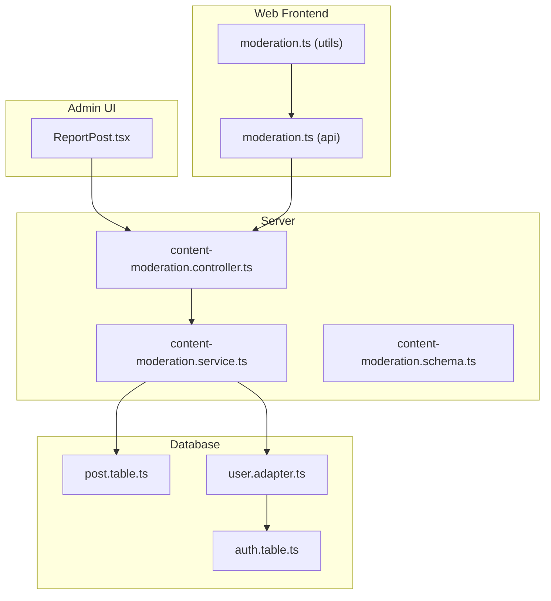
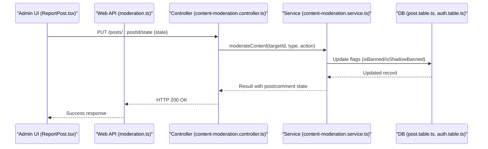
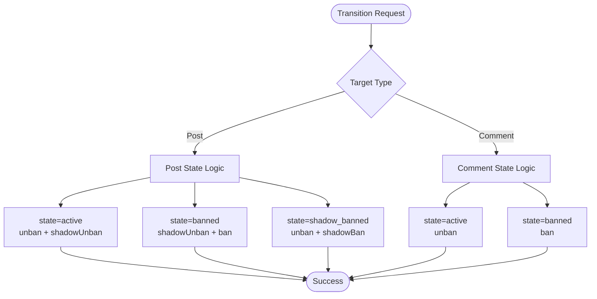
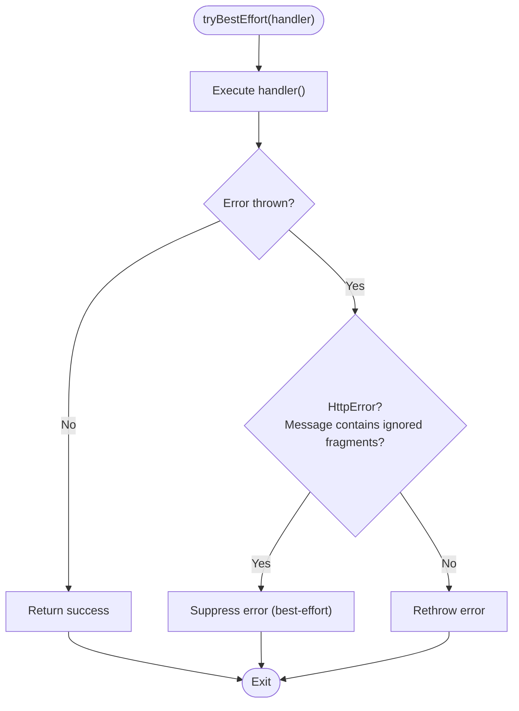
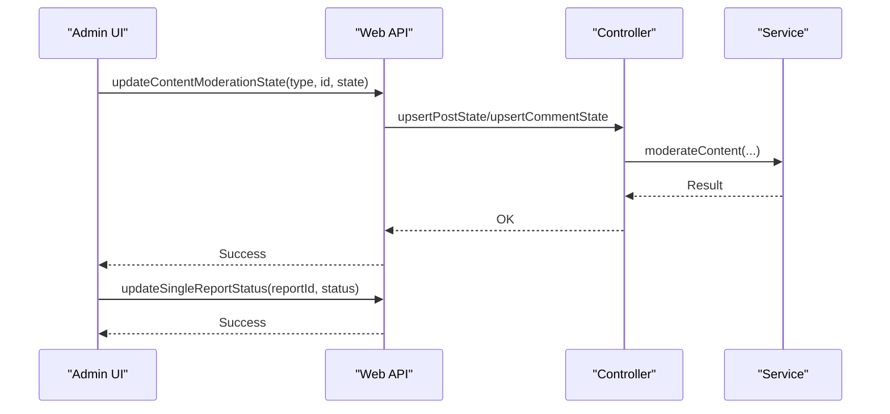
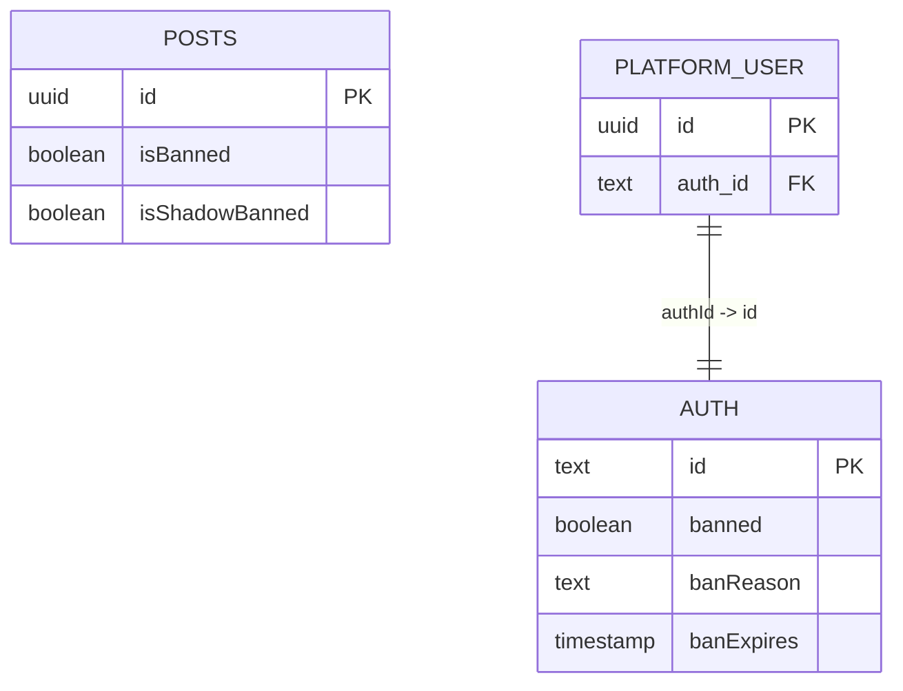
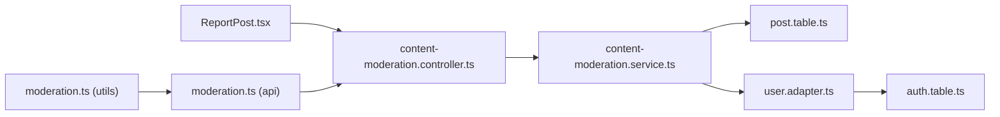

# Content Moderation States

<cite>
**Referenced Files in This Document**
- [content-moderation.controller.ts](file://server/src/modules/moderation/content/content-moderation.controller.ts)
- [content-moderation.service.ts](file://server/src/modules/moderation/content/content-moderation.service.ts)
- [content-moderation.schema.ts](file://server/src/modules/moderation/content/content-moderation.schema.ts)
- [post.table.ts](file://server/src/infra/db/tables/post.table.ts)
- [auth.table.ts](file://server/src/infra/db/tables/auth.table.ts)
- [user.adapter.ts](file://server/src/infra/db/adapters/user.adapter.ts)
- [ReportPost.tsx](file://admin/src/components/general/ReportPost.tsx)
- [moderation.ts](file://web/src/utils/moderation.ts)
- [moderation.ts](file://web/src/services/api/moderation.ts)
</cite>

## Table of Contents
1. [Introduction](#introduction)
2. [Project Structure](#project-structure)
3. [Core Components](#core-components)
4. [Architecture Overview](#architecture-overview)
5. [Detailed Component Analysis](#detailed-component-analysis)
6. [Dependency Analysis](#dependency-analysis)
7. [Performance Considerations](#performance-considerations)
8. [Troubleshooting Guide](#troubleshooting-guide)
9. [Conclusion](#conclusion)

## Introduction
This document explains the content moderation states and their management across the platform. It covers the three content states (active, banned, shadow_banned) and their impact on visibility, user experience, and safety. It documents state transitions, best-effort handling for concurrent operations, administrative controls, persistence mechanisms, and real-time propagation to clients. Examples illustrate when each state is applied, automatic state changes, and manual intervention procedures.

## Project Structure
The moderation system spans backend controllers and services, database tables, frontend utilities, and admin UI components:
- Backend: controllers and services manage state transitions for posts and comments.
- Database: tables persist moderation flags for posts and user blocking/suspension.
- Frontend: utilities and API wrappers support moderation-aware rendering and requests.
- Admin: UI components orchestrate moderation actions and report resolution.

**Diagram sources**
- [content-moderation.controller.ts](file://server/src/modules/moderation/content/content-moderation.controller.ts#L1-L89)
- [content-moderation.service.ts](file://server/src/modules/moderation/content/content-moderation.service.ts#L53-L251)
- [content-moderation.schema.ts](file://server/src/modules/moderation/content/content-moderation.schema.ts#L1-L18)
- [post.table.ts](file://server/src/infra/db/tables/post.table.ts#L13-L39)
- [auth.table.ts](file://server/src/infra/db/tables/auth.table.ts#L14-L30)
- [user.adapter.ts](file://server/src/infra/db/adapters/user.adapter.ts#L213-L379)
- [ReportPost.tsx](file://admin/src/components/general/ReportPost.tsx#L75-L130)
- [moderation.ts](file://web/src/utils/moderation.ts)
- [moderation.ts](file://web/src/services/api/moderation.ts#L1-L7)

**Section sources**
- [content-moderation.controller.ts](file://server/src/modules/moderation/content/content-moderation.controller.ts#L1-L89)
- [content-moderation.service.ts](file://server/src/modules/moderation/content/content-moderation.service.ts#L53-L251)
- [content-moderation.schema.ts](file://server/src/modules/moderation/content/content-moderation.schema.ts#L1-L18)
- [post.table.ts](file://server/src/infra/db/tables/post.table.ts#L13-L39)
- [auth.table.ts](file://server/src/infra/db/tables/auth.table.ts#L14-L30)
- [user.adapter.ts](file://server/src/infra/db/adapters/user.adapter.ts#L213-L379)
- [ReportPost.tsx](file://admin/src/components/general/ReportPost.tsx#L75-L130)
- [moderation.ts](file://web/src/utils/moderation.ts)
- [moderation.ts](file://web/src/services/api/moderation.ts#L1-L7)

## Core Components
- Moderation states for content:
  - active: visible and searchable.
  - banned: hidden from public view; reported as removed.
  - shadow_banned: hidden from public view but not reported as removed; used to hide content without explicit notice.
- Moderation states for users:
  - blocked: account-level restriction; can be permanent or suspended until a specified date.
- Controllers and services:
  - Controllers validate inputs and delegate to services.
  - Services enforce state transitions, update persistence, and resolve related reports.
- Persistence:
  - Posts table stores isBanned and isShadowBanned flags.
  - Auth table stores banned, banReason, and banExpires for user-level moderation.
- Frontend and Admin:
  - Admin UI triggers moderation actions and updates report statuses.
  - Web utilities/API wrappers integrate moderation-aware logic.

**Section sources**
- [content-moderation.schema.ts](file://server/src/modules/moderation/content/content-moderation.schema.ts#L11-L17)
- [post.table.ts](file://server/src/infra/db/tables/post.table.ts#L24-L25)
- [auth.table.ts](file://server/src/infra/db/tables/auth.table.ts#L27-L29)
- [content-moderation.controller.ts](file://server/src/modules/moderation/content/content-moderation.controller.ts#L31-L86)
- [content-moderation.service.ts](file://server/src/modules/moderation/content/content-moderation.service.ts#L53-L142)
- [ReportPost.tsx](file://admin/src/components/general/ReportPost.tsx#L92-L130)

## Architecture Overview
The moderation flow connects admin actions, frontend requests, backend controllers, services, and persistence. It ensures best-effort handling for concurrent operations and updates related reports upon state changes.

**Diagram sources**
- [ReportPost.tsx](file://admin/src/components/general/ReportPost.tsx#L92-L118)
- [moderation.ts](file://web/src/services/api/moderation.ts#L1-L7)
- [content-moderation.controller.ts](file://server/src/modules/moderation/content/content-moderation.controller.ts#L31-L61)
- [content-moderation.service.ts](file://server/src/modules/moderation/content/content-moderation.service.ts#L211-L248)
- [post.table.ts](file://server/src/infra/db/tables/post.table.ts#L24-L25)

## Detailed Component Analysis

### Content Moderation States and Implications
- active
  - Visibility: Publicly visible.
  - Impact: Normal engagement, ranking, and discoverability.
  - Trigger: Uploading content, unban operations, shadow_unban.
- banned
  - Visibility: Hidden from public view; reported as removed.
  - Impact: No engagement; potential appeal process.
  - Trigger: Manual moderation action or policy violation.
- shadow_banned
  - Visibility: Hidden from public view; not reported as removed.
  - Impact: Reduced risk of user awareness while suppressing harmful content.
  - Trigger: Administrative discretion for sensitive cases.

Examples of application:
- Active: New posts awaiting review become active after approval.
- Banned: Posts violating community guidelines are banned.
- Shadow banned: Posts deemed sensitive but not yet warranting public removal.

Automatic state changes:
- Shadow bans may be applied automatically by content filters prior to manual moderation.
- Related reports are resolved when shadow bans are applied.

Manual intervention:
- Admins can change states via the admin UI, which calls backend endpoints to update moderation state and report status.

**Section sources**
- [content-moderation.schema.ts](file://server/src/modules/moderation/content/content-moderation.schema.ts#L11-L17)
- [content-moderation.controller.ts](file://server/src/modules/moderation/content/content-moderation.controller.ts#L37-L54)
- [content-moderation.service.ts](file://server/src/modules/moderation/content/content-moderation.service.ts#L81-L114)
- [ReportPost.tsx](file://admin/src/components/general/ReportPost.tsx#L104-L118)

### State Transition Logic
The controller enforces mutually exclusive transitions:
- active: clears bans and shadow bans.
- banned: clears shadow bans, applies ban.
- shadow_banned: clears ban, applies shadow ban.

**Diagram sources**
- [content-moderation.controller.ts](file://server/src/modules/moderation/content/content-moderation.controller.ts#L31-L86)

**Section sources**
- [content-moderation.controller.ts](file://server/src/modules/moderation/content/content-moderation.controller.ts#L31-L86)

### Best-Effort Handling for Concurrent Operations
The controller wraps state-changing operations in a best-effort pattern to tolerate idempotent failures (e.g., already banned, not banned, already shadow banned, not shadow banned). Non-idempotent errors are rethrown.

**Diagram sources**
- [content-moderation.controller.ts](file://server/src/modules/moderation/content/content-moderation.controller.ts#L7-L27)

**Section sources**
- [content-moderation.controller.ts](file://server/src/modules/moderation/content/content-moderation.controller.ts#L7-L27)

### Administrative Controls
Admin actions:
- Ban/unban posts and comments.
- Shadow ban/unban posts.
- Resolve or ignore reports upon moderation actions.
- Block/unblock users or apply suspensions with end dates.

**Diagram sources**
- [ReportPost.tsx](file://admin/src/components/general/ReportPost.tsx#L92-L130)
- [content-moderation.controller.ts](file://server/src/modules/moderation/content/content-moderation.controller.ts#L31-L86)
- [content-moderation.service.ts](file://server/src/modules/moderation/content/content-moderation.service.ts#L211-L248)

**Section sources**
- [ReportPost.tsx](file://admin/src/components/general/ReportPost.tsx#L75-L130)
- [content-moderation.controller.ts](file://server/src/modules/moderation/content/content-moderation.controller.ts#L31-L86)

### Technical Implementation: State Persistence
- Posts:
  - Flags persisted in the posts table: isBanned and isShadowBanned.
- Users:
  - Flags persisted in the auth table: banned, banReason, banExpires.
  - Suspension data mapped to user adapter for moderation queries.

**Diagram sources**
- [post.table.ts](file://server/src/infra/db/tables/post.table.ts#L13-L39)
- [auth.table.ts](file://server/src/infra/db/tables/auth.table.ts#L14-L30)

**Section sources**
- [post.table.ts](file://server/src/infra/db/tables/post.table.ts#L24-L25)
- [auth.table.ts](file://server/src/infra/db/tables/auth.table.ts#L27-L29)
- [user.adapter.ts](file://server/src/infra/db/adapters/user.adapter.ts#L234-L288)

### Real-Time Propagation to Clients
- Web utilities and API wrappers coordinate moderation-aware behavior on the client side.
- Admin actions trigger backend updates; clients consume updated moderation states through API responses and UI refresh.

**Section sources**
- [moderation.ts](file://web/src/utils/moderation.ts)
- [moderation.ts](file://web/src/services/api/moderation.ts#L1-L7)

## Dependency Analysis
Moderation components depend on:
- Controllers depend on services for state transitions.
- Services depend on adapters and database tables for persistence.
- Admin UI depends on web API wrappers to invoke moderation endpoints.

**Diagram sources**
- [ReportPost.tsx](file://admin/src/components/general/ReportPost.tsx#L75-L130)
- [content-moderation.controller.ts](file://server/src/modules/moderation/content/content-moderation.controller.ts#L1-L89)
- [content-moderation.service.ts](file://server/src/modules/moderation/content/content-moderation.service.ts#L53-L251)
- [post.table.ts](file://server/src/infra/db/tables/post.table.ts#L13-L39)
- [user.adapter.ts](file://server/src/infra/db/adapters/user.adapter.ts#L213-L379)
- [auth.table.ts](file://server/src/infra/db/tables/auth.table.ts#L14-L30)
- [moderation.ts](file://web/src/utils/moderation.ts)
- [moderation.ts](file://web/src/services/api/moderation.ts#L1-L7)

**Section sources**
- [content-moderation.controller.ts](file://server/src/modules/moderation/content/content-moderation.controller.ts#L1-L89)
- [content-moderation.service.ts](file://server/src/modules/moderation/content/content-moderation.service.ts#L53-L251)
- [post.table.ts](file://server/src/infra/db/tables/post.table.ts#L13-L39)
- [auth.table.ts](file://server/src/infra/db/tables/auth.table.ts#L14-L30)
- [user.adapter.ts](file://server/src/infra/db/adapters/user.adapter.ts#L213-L379)
- [ReportPost.tsx](file://admin/src/components/general/ReportPost.tsx#L75-L130)
- [moderation.ts](file://web/src/utils/moderation.ts)
- [moderation.ts](file://web/src/services/api/moderation.ts#L1-L7)

## Performance Considerations
- Idempotency: Best-effort pattern reduces retries on redundant operations.
- Indexing: Post visibility index supports efficient filtering by moderation flags.
- Batch updates: Group related report resolutions with state changes to minimize round-trips.

[No sources needed since this section provides general guidance]

## Troubleshooting Guide
Common scenarios:
- Attempting to unban or shadow-unban when already in desired state:
  - Controller suppresses errors via best-effort handling.
- Attempting to ban or shadow-ban when already in that state:
  - Controller suppresses errors via best-effort handling.
- Invalid state transitions:
  - Validation schemas reject unsupported values.

Resolution steps:
- Verify state values match supported enums.
- Retry operations if transient failures occur.
- Confirm database updates for flags and related report resolutions.

**Section sources**
- [content-moderation.schema.ts](file://server/src/modules/moderation/content/content-moderation.schema.ts#L11-L17)
- [content-moderation.controller.ts](file://server/src/modules/moderation/content/content-moderation.controller.ts#L7-L27)
- [content-moderation.service.ts](file://server/src/modules/moderation/content/content-moderation.service.ts#L53-L142)

## Conclusion
The moderation system defines clear content states with distinct visibility and reporting implications. Controllers enforce safe, idempotent transitions, services persist changes to the database, and admin tools streamline manual interventions. Together, these components ensure platform safety, predictable user experiences, and operational resilience.