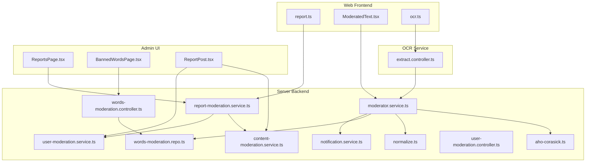
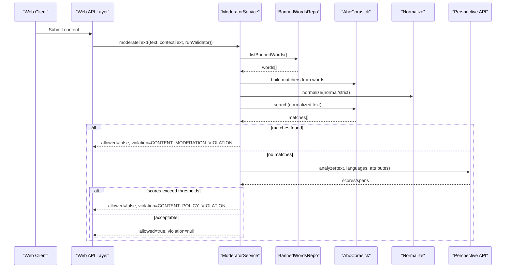
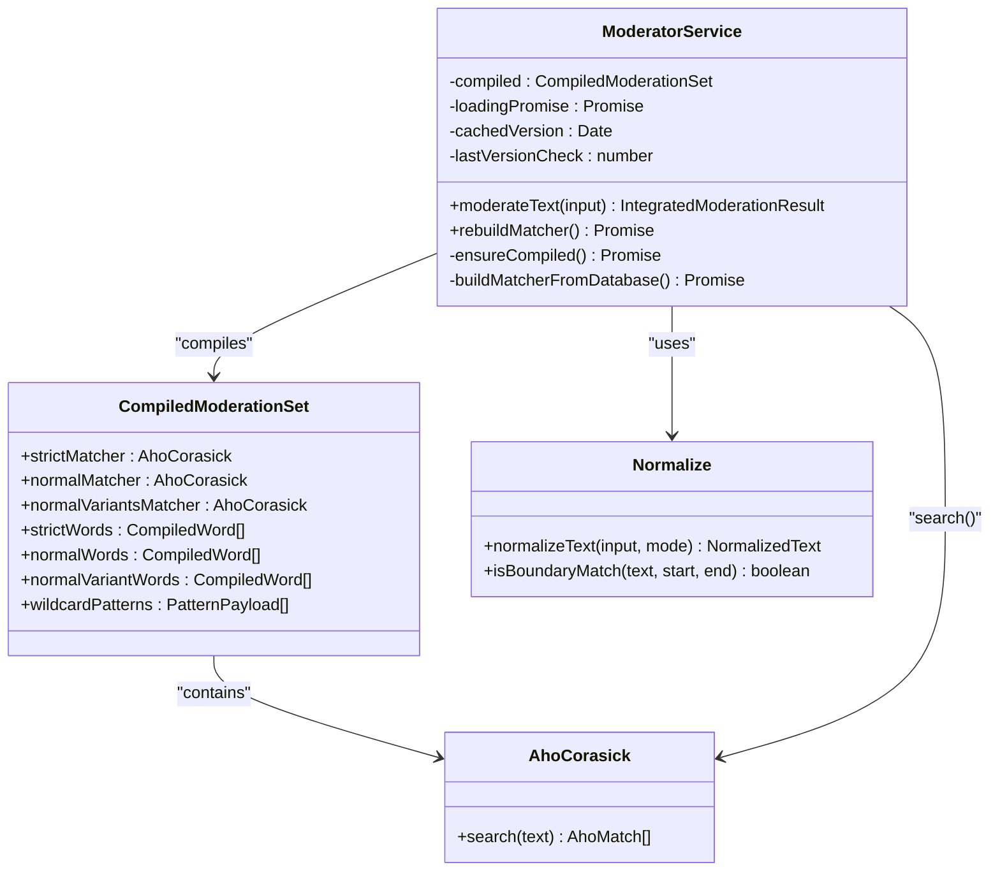
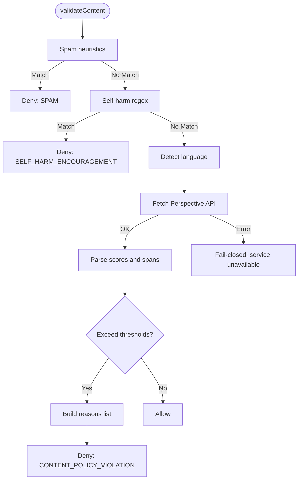
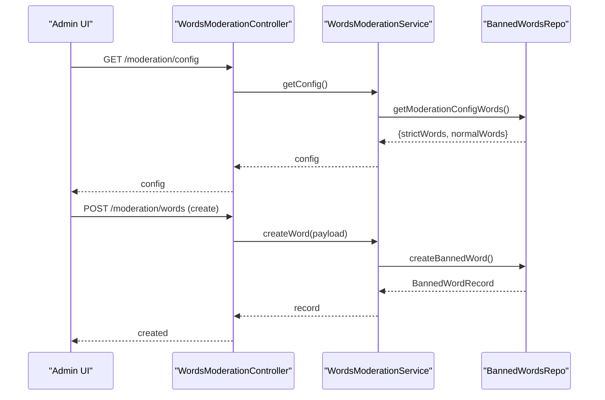
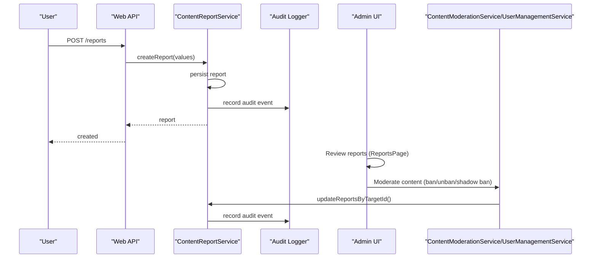
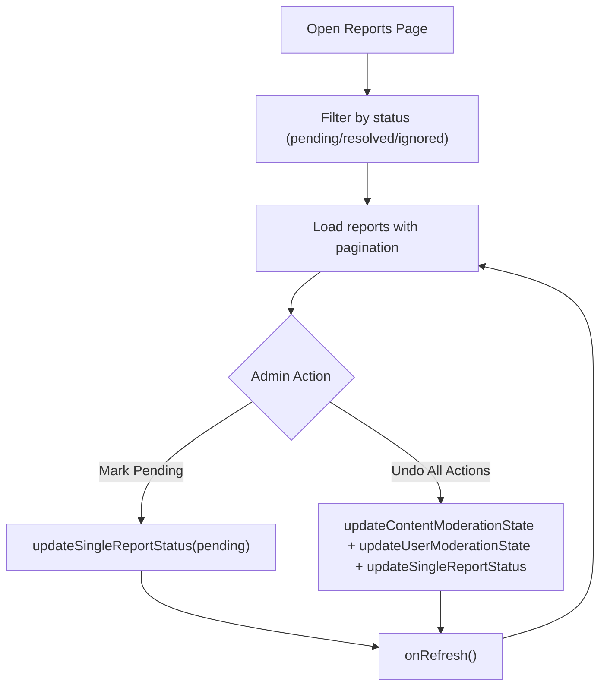
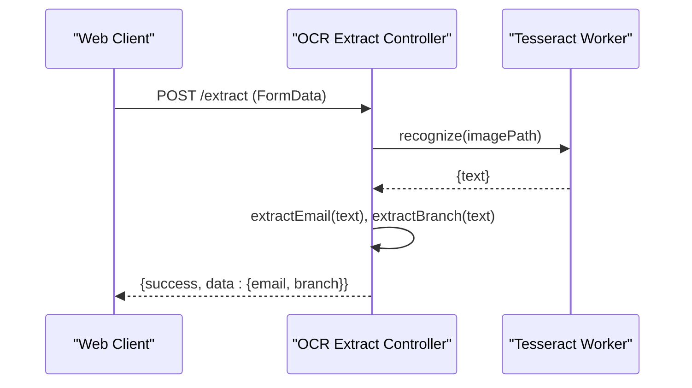
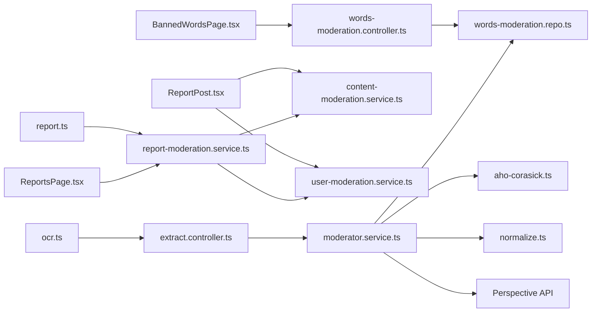

# Content Moderation

<cite>
**Referenced Files in This Document**
- [moderator.service.ts](file://server/src/infra/services/moderator/moderator.service.ts)
- [aho-corasick.ts](file://server/src/infra/services/moderator/aho-corasick.ts)
- [normalize.ts](file://server/src/infra/services/moderator/normalize.ts)
- [words-moderation.repo.ts](file://server/src/modules/moderation/words/words-moderation.repo.ts)
- [words-moderation.controller.ts](file://server/src/modules/moderation/words/words-moderation.controller.ts)
- [report-moderation.service.ts](file://server/src/modules/moderation/reports/report-moderation.service.ts)
- [content-moderation.service.ts](file://server/src/modules/moderation/content/content-moderation.service.ts)
- [user-moderation.service.ts](file://server/src/modules/moderation/user/user-moderation.service.ts)
- [user-moderation.controller.ts](file://server/src/modules/moderation/user/user-moderation.controller.ts)
- [ReportsPage.tsx](file://admin/src/pages/ReportsPage.tsx)
- [BannedWordsPage.tsx](file://admin/src/pages/BannedWordsPage.tsx)
- [ReportPost.tsx](file://admin/src/components/general/ReportPost.tsx)
- [report.ts](file://web/src/services/api/report.ts)
- [ocr.ts](file://web/src/services/api/ocr.ts)
- [extract.controller.ts](file://ocr/src/controllers/extract.controller.ts)
- [ModeratedText.tsx](file://web/src/components/general/ModeratedText.tsx)
- [notification.service.ts](file://server/src/modules/notification/notification.service.ts)
- [Notification.ts](file://web/src/types/Notification.ts)
</cite>

## Table of Contents
1. [Introduction](#introduction)
2. [Project Structure](#project-structure)
3. [Core Components](#core-components)
4. [Architecture Overview](#architecture-overview)
5. [Detailed Component Analysis](#detailed-component-analysis)
6. [Dependency Analysis](#dependency-analysis)
7. [Performance Considerations](#performance-considerations)
8. [Troubleshooting Guide](#troubleshooting-guide)
9. [Conclusion](#conclusion)
10. [Appendices](#appendices)

## Introduction
This document describes the content moderation system, focusing on automated filtering using the Aho-Corasick algorithm, reporting mechanisms, admin review workflows, banned word management, content flagging, user reporting, moderation queues, OCR integration for text extraction, moderation policies, appeals, and administrative oversight. It also outlines moderation workflows and integration with the notification system.

## Project Structure
The moderation system spans three layers:
- Backend services and repositories under server/src/modules/moderation and server/src/infra/services/moderator
- Admin UI under admin/src/pages and admin/src/components
- Web UI under web/src/components and web/src/services/api

**Diagram sources**
- [moderator.service.ts](file://server/src/infra/services/moderator/moderator.service.ts#L420-L637)
- [aho-corasick.ts](file://server/src/infra/services/moderator/aho-corasick.ts#L20-L117)
- [normalize.ts](file://server/src/infra/services/moderator/normalize.ts#L51-L110)
- [words-moderation.repo.ts](file://server/src/modules/moderation/words/words-moderation.repo.ts#L16-L110)
- [words-moderation.controller.ts](file://server/src/modules/moderation/words/words-moderation.controller.ts#L10-L45)
- [report-moderation.service.ts](file://server/src/modules/moderation/reports/report-moderation.service.ts#L9-L176)
- [content-moderation.service.ts](file://server/src/modules/moderation/content/content-moderation.service.ts#L7-L248)
- [user-moderation.service.ts](file://server/src/modules/moderation/user/user-moderation.service.ts#L6-L186)
- [user-moderation.controller.ts](file://server/src/modules/moderation/user/user-moderation.controller.ts#L26-L46)
- [ReportsPage.tsx](file://admin/src/pages/ReportsPage.tsx#L14-L121)
- [BannedWordsPage.tsx](file://admin/src/pages/BannedWordsPage.tsx#L35-L306)
- [ReportPost.tsx](file://admin/src/components/general/ReportPost.tsx#L161-L170)
- [report.ts](file://web/src/services/api/report.ts#L3-L12)
- [ocr.ts](file://web/src/services/api/ocr.ts#L4-L15)
- [extract.controller.ts](file://ocr/src/controllers/extract.controller.ts#L41-L61)
- [notification.service.ts](file://server/src/modules/notification/notification.service.ts#L28-L210)

**Section sources**
- [moderator.service.ts](file://server/src/infra/services/moderator/moderator.service.ts#L420-L637)
- [ReportsPage.tsx](file://admin/src/pages/ReportsPage.tsx#L14-L121)
- [BannedWordsPage.tsx](file://admin/src/pages/BannedWordsPage.tsx#L35-L306)

## Core Components
- Aho-Corasick-based dynamic moderation engine with normalization and boundary checks
- Perspective API-based policy validator for toxicity and related attributes
- Banned word repository and CRUD APIs for managing global blocklists
- Reporting subsystem for user-flagged content with admin workflows
- Content moderation actions (ban/shadow ban/unban) and user moderation controls
- OCR integration pipeline for extracting text from documents
- Moderation-aware UI components and admin dashboards

**Section sources**
- [moderator.service.ts](file://server/src/infra/services/moderator/moderator.service.ts#L15-L637)
- [words-moderation.repo.ts](file://server/src/modules/moderation/words/words-moderation.repo.ts#L16-L110)
- [report-moderation.service.ts](file://server/src/modules/moderation/reports/report-moderation.service.ts#L9-L176)
- [content-moderation.service.ts](file://server/src/modules/moderation/content/content-moderation.service.ts#L7-L248)
- [user-moderation.service.ts](file://server/src/modules/moderation/user/user-moderation.service.ts#L6-L186)
- [extract.controller.ts](file://ocr/src/controllers/extract.controller.ts#L41-L61)

## Architecture Overview
The moderation pipeline integrates real-time text validation and OCR-extracted text through a unified moderation service. Dynamic filtering uses Aho-Corasick on normalized text, while policy validation leverages Perspective API. Admins manage banned words and review reports; users can report content. Notifications are available for moderation outcomes.

**Diagram sources**
- [moderator.service.ts](file://server/src/infra/services/moderator/moderator.service.ts#L583-L636)
- [normalize.ts](file://server/src/infra/services/moderator/normalize.ts#L51-L98)
- [aho-corasick.ts](file://server/src/infra/services/moderator/aho-corasick.ts#L20-L117)
- [words-moderation.repo.ts](file://server/src/modules/moderation/words/words-moderation.repo.ts#L16-L23)

## Detailed Component Analysis

### Automated Content Filtering with Aho-Corasick
The dynamic moderation engine compiles banned words into three Aho-Corasick automata:
- Strict matcher: normalized strict mode words
- Normal matcher: normalized normal mode words
- Normal variants matcher: strict-normal variants of normal words

Normalization supports Unicode decomposition, leet-speak mapping, and strict character filtering. Boundary checks ensure matches occur at word boundaries. Wildcard patterns are supported via DFS over normalized tokens.

**Diagram sources**
- [moderator.service.ts](file://server/src/infra/services/moderator/moderator.service.ts#L420-L637)
- [aho-corasick.ts](file://server/src/infra/services/moderator/aho-corasick.ts#L20-L117)
- [normalize.ts](file://server/src/infra/services/moderator/normalize.ts#L51-L110)

**Section sources**
- [moderator.service.ts](file://server/src/infra/services/moderator/moderator.service.ts#L233-L386)
- [normalize.ts](file://server/src/infra/services/moderator/normalize.ts#L51-L110)
- [aho-corasick.ts](file://server/src/infra/services/moderator/aho-corasick.ts#L20-L117)

### Policy Validation with Perspective API
After dynamic filtering, the validator performs toxicity and related attribute scoring. It detects spam heuristics, self-harm encouragement, and applies language detection. Scores exceeding configured thresholds produce policy violations.

**Diagram sources**
- [moderator.service.ts](file://server/src/infra/services/moderator/moderator.service.ts#L464-L581)

**Section sources**
- [moderator.service.ts](file://server/src/infra/services/moderator/moderator.service.ts#L464-L581)

### Banned Word Management
Administrators maintain the global blocklist via CRUD endpoints backed by a repository. Words support strict vs normal modes and severity levels. The moderator service reloads matchers when the database version changes.

**Diagram sources**
- [words-moderation.controller.ts](file://server/src/modules/moderation/words/words-moderation.controller.ts#L10-L45)
- [words-moderation.repo.ts](file://server/src/modules/moderation/words/words-moderation.repo.ts#L16-L110)
- [moderator.service.ts](file://server/src/infra/services/moderator/moderator.service.ts#L427-L458)

**Section sources**
- [words-moderation.controller.ts](file://server/src/modules/moderation/words/words-moderation.controller.ts#L10-L45)
- [words-moderation.repo.ts](file://server/src/modules/moderation/words/words-moderation.repo.ts#L16-L110)
- [BannedWordsPage.tsx](file://admin/src/pages/BannedWordsPage.tsx#L35-L306)

### Content Flagging and Reporting
Users submit reports for posts or comments. Reports are stored with status and metadata, enabling admin review and bulk actions. Content moderation actions update report statuses accordingly.

**Diagram sources**
- [report.ts](file://web/src/services/api/report.ts#L3-L12)
- [report-moderation.service.ts](file://server/src/modules/moderation/reports/report-moderation.service.ts#L9-L176)
- [ReportsPage.tsx](file://admin/src/pages/ReportsPage.tsx#L14-L121)
- [ReportPost.tsx](file://admin/src/components/general/ReportPost.tsx#L161-L170)
- [content-moderation.service.ts](file://server/src/modules/moderation/content/content-moderation.service.ts#L7-L248)
- [user-moderation.service.ts](file://server/src/modules/moderation/user/user-moderation.service.ts#L6-L186)

**Section sources**
- [report.ts](file://web/src/services/api/report.ts#L3-L12)
- [report-moderation.service.ts](file://server/src/modules/moderation/reports/report-moderation.service.ts#L9-L176)
- [ReportsPage.tsx](file://admin/src/pages/ReportsPage.tsx#L14-L121)
- [ReportPost.tsx](file://admin/src/components/general/ReportPost.tsx#L161-L170)

### Admin Review Workflows
Admins can filter reports by status, refresh lists, and apply actions such as marking pending or undoing actions across content and user moderation states. Bulk operations are coordinated via admin components.

**Diagram sources**
- [ReportsPage.tsx](file://admin/src/pages/ReportsPage.tsx#L14-L121)
- [ReportPost.tsx](file://admin/src/components/general/ReportPost.tsx#L161-L170)

**Section sources**
- [ReportsPage.tsx](file://admin/src/pages/ReportsPage.tsx#L14-L121)
- [ReportPost.tsx](file://admin/src/components/general/ReportPost.tsx#L161-L170)

### OCR Integration for Document Text Extraction
The OCR service recognizes text from images and extracts structured details (e.g., email, branch). The web client sends multipart form data to the OCR endpoint, and the backend initializes a Tesseract worker to process the image.

**Diagram sources**
- [ocr.ts](file://web/src/services/api/ocr.ts#L4-L15)
- [extract.controller.ts](file://ocr/src/controllers/extract.controller.ts#L41-L61)

**Section sources**
- [ocr.ts](file://web/src/services/api/ocr.ts#L4-L15)
- [extract.controller.ts](file://ocr/src/controllers/extract.controller.ts#L41-L61)

### Moderation Policies and Appeals
- Dynamic policy: banned words via Aho-Corasick with strict/normal modes and severity
- Validator policy: Perspective API thresholds for toxicity, insult, identity attack, threat, profanity; spam detection; self-harm detection
- Appeals: not implemented in the reviewed code; administrators can adjust banned words and review reports

**Section sources**
- [moderator.service.ts](file://server/src/infra/services/moderator/moderator.service.ts#L464-L636)
- [words-moderation.repo.ts](file://server/src/modules/moderation/words/words-moderation.repo.ts#L16-L110)

### Administrative Tools for Oversight
- Banned words management: add, edit, delete, search, and toggle strict mode
- Reports dashboard: filter by status, paginate, refresh
- Bulk moderation actions: content and user moderation state updates

**Section sources**
- [BannedWordsPage.tsx](file://admin/src/pages/BannedWordsPage.tsx#L35-L306)
- [ReportsPage.tsx](file://admin/src/pages/ReportsPage.tsx#L14-L121)
- [ReportPost.tsx](file://admin/src/components/general/ReportPost.tsx#L161-L170)

### Moderation Queue and Workflows
- Reports are paginated and filtered by status
- Admins can update report statuses and trigger moderation actions on targets
- Content moderation actions propagate to related reports

**Section sources**
- [report-moderation.service.ts](file://server/src/modules/moderation/reports/report-moderation.service.ts#L82-L104)
- [content-moderation.service.ts](file://server/src/modules/moderation/content/content-moderation.service.ts#L211-L248)

### Integration with Notification System
The notification module is present but largely commented out in the reviewed code. It defines types and includes commented-out logic for emitting notifications and bundling. While not actively integrated in the reviewed files, the types and structure indicate potential future integration.

**Section sources**
- [notification.service.ts](file://server/src/modules/notification/notification.service.ts#L28-L210)
- [Notification.ts](file://web/src/types/Notification.ts#L10-L21)

## Dependency Analysis
The moderation system exhibits clear separation of concerns:
- Dynamic filtering depends on normalized text and Aho-Corasick automata
- Policy validation depends on external API and language detection
- Admin endpoints depend on repositories for CRUD operations
- Reports depend on content and user moderation services
- UI components depend on backend APIs and local moderation utilities

**Diagram sources**
- [moderator.service.ts](file://server/src/infra/services/moderator/moderator.service.ts#L420-L637)
- [words-moderation.repo.ts](file://server/src/modules/moderation/words/words-moderation.repo.ts#L16-L110)
- [words-moderation.controller.ts](file://server/src/modules/moderation/words/words-moderation.controller.ts#L10-L45)
- [report-moderation.service.ts](file://server/src/modules/moderation/reports/report-moderation.service.ts#L9-L176)
- [content-moderation.service.ts](file://server/src/modules/moderation/content/content-moderation.service.ts#L7-L248)
- [user-moderation.service.ts](file://server/src/modules/moderation/user/user-moderation.service.ts#L6-L186)
- [ReportsPage.tsx](file://admin/src/pages/ReportsPage.tsx#L14-L121)
- [BannedWordsPage.tsx](file://admin/src/pages/BannedWordsPage.tsx#L35-L306)
- [ReportPost.tsx](file://admin/src/components/general/ReportPost.tsx#L161-L170)
- [report.ts](file://web/src/services/api/report.ts#L3-L12)
- [ocr.ts](file://web/src/services/api/ocr.ts#L4-L15)
- [extract.controller.ts](file://ocr/src/controllers/extract.controller.ts#L41-L61)

**Section sources**
- [moderator.service.ts](file://server/src/infra/services/moderator/moderator.service.ts#L420-L637)
- [report-moderation.service.ts](file://server/src/modules/moderation/reports/report-moderation.service.ts#L9-L176)

## Performance Considerations
- Aho-Corasick search runs in linear time relative to input length with constant per-state transitions; ensure minimal redundant builds by leveraging versioned caching
- Normalization and boundary checks add overhead proportional to input length; consider pre-normalizing and caching repeated validations
- Perspective API calls are rate-limited and timeout-bound; implement retry/backoff and consider batching
- Wildcard matching uses DFS with memoization; avoid excessive wildcard patterns to prevent combinatorial blow-up
- OCR worker initialization should be lazy and reused to minimize startup costs

[No sources needed since this section provides general guidance]

## Troubleshooting Guide
- Dynamic moderation returns allowed=true despite flagged content: verify strict vs normal mode and boundary checks; confirm banned word normalization and wildcards
- Policy violations without dynamic matches: inspect Perspective API thresholds and language detection; check spam/self-harm heuristics
- Admin banned word changes not reflected: ensure matcher rebuild triggers on version change and that caches are invalidated
- Report status not updating: verify report ID correctness and valid status values; check audit logging for errors
- OCR extraction fails: confirm worker initialization, file upload presence, and Tesseract model availability

**Section sources**
- [moderator.service.ts](file://server/src/infra/services/moderator/moderator.service.ts#L427-L458)
- [report-moderation.service.ts](file://server/src/modules/moderation/reports/report-moderation.service.ts#L106-L123)
- [extract.controller.ts](file://ocr/src/controllers/extract.controller.ts#L8-L10)

## Conclusion
The moderation system combines efficient Aho-Corasick-based filtering with robust policy validation and a comprehensive admin toolkit. OCR integration enables automated analysis of document-based content. Administrators can manage banned words, review reports, and enforce moderation actions. Future enhancements could include formal appeals workflows and active notification emission.

[No sources needed since this section summarizes without analyzing specific files]

## Appendices

### Example Moderation Workflow
- User submits content
- Backend validates with Aho-Corasick; if matches found, deny with dynamic violation
- Else, validate with Perspective API; if thresholds exceeded, deny with policy violation
- Else, allow and optionally notify

**Section sources**
- [moderator.service.ts](file://server/src/infra/services/moderator/moderator.service.ts#L583-L636)

### UI Integration Notes
- ModeratedText component loads configuration, subscribes to updates, and splits text by matches for highlighting
- Web report API posts user-generated reports
- Admin pages provide CRUD and review capabilities

**Section sources**
- [ModeratedText.tsx](file://web/src/components/general/ModeratedText.tsx#L18-L35)
- [report.ts](file://web/src/services/api/report.ts#L3-L12)
- [ReportsPage.tsx](file://admin/src/pages/ReportsPage.tsx#L14-L121)
- [BannedWordsPage.tsx](file://admin/src/pages/BannedWordsPage.tsx#L35-L306)