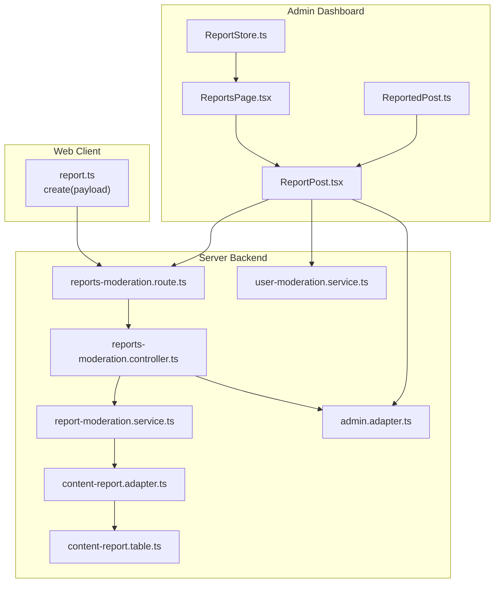
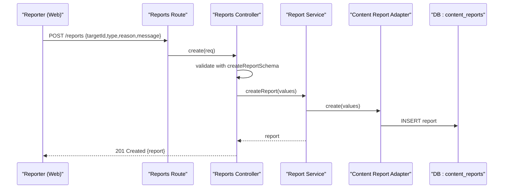
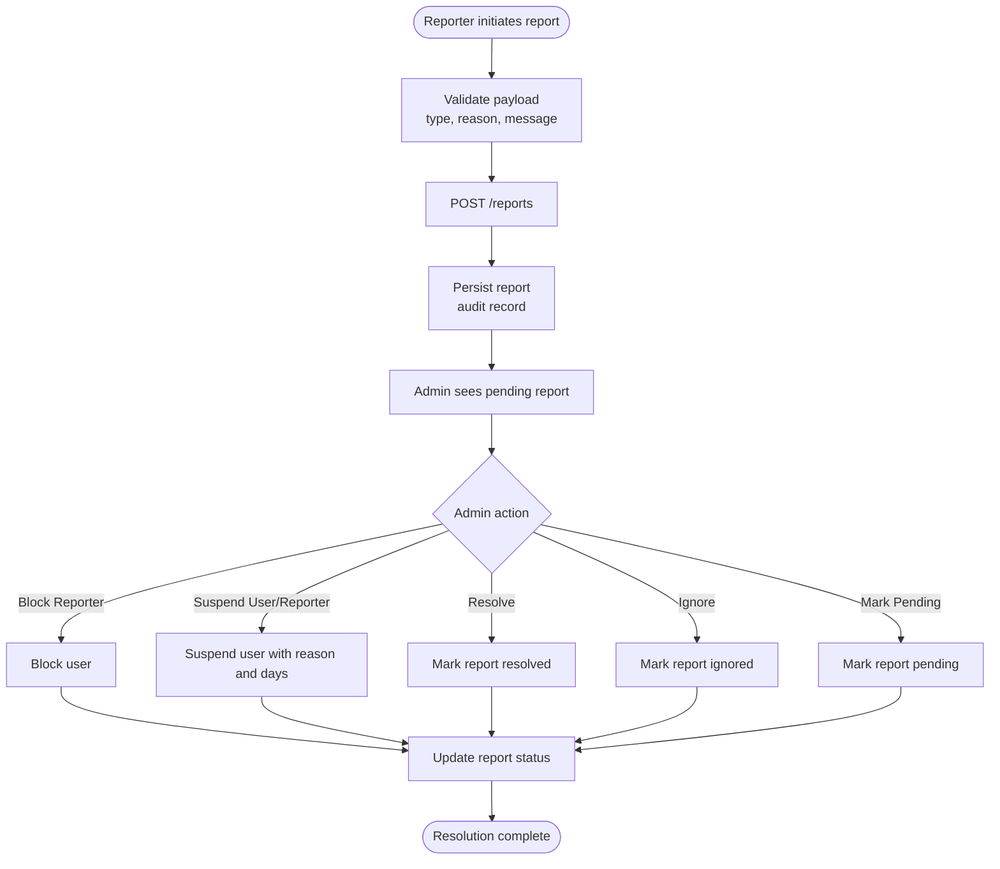

# Reporting Mechanism

<cite>
**Referenced Files in This Document**
- [ReportsPage.tsx](file://admin/src/pages/ReportsPage.tsx)
- [ReportPost.tsx](file://admin/src/components/general/ReportPost.tsx)
- [ReportStore.ts](file://admin/src/store/ReportStore.ts)
- [report.ts](file://web/src/services/api/report.ts)
- [reports-moderation.route.ts](file://server/src/modules/moderation/reports/reports-moderation.route.ts)
- [reports-moderation.controller.ts](file://server/src/modules/moderation/reports/reports-moderation.controller.ts)
- [reports-moderation.schema.ts](file://server/src/modules/moderation/reports/reports-moderation.schema.ts)
- [report-moderation.service.ts](file://server/src/modules/moderation/reports/report-moderation.service.ts)
- [content-report.adapter.ts](file://server/src/infra/db/adapters/content-report.adapter.ts)
- [content-report.table.ts](file://server/src/infra/db/tables/content-report.table.ts)
- [admin.adapter.ts](file://server/src/infra/db/adapters/admin.adapter.ts)
- [user-moderation.service.ts](file://server/src/modules/moderation/user/user-moderation.service.ts)
- [ReportedPost.ts](file://admin/src/types/ReportedPost.ts)
- [notification.service.ts](file://server/src/modules/notification/notification.service.ts)
</cite>

## Table of Contents
1. [Introduction](#introduction)
2. [Project Structure](#project-structure)
3. [Core Components](#core-components)
4. [Architecture Overview](#architecture-overview)
5. [Detailed Component Analysis](#detailed-component-analysis)
6. [Dependency Analysis](#dependency-analysis)
7. [Performance Considerations](#performance-considerations)
8. [Troubleshooting Guide](#troubleshooting-guide)
9. [Conclusion](#conclusion)
10. [Appendices](#appendices)

## Introduction
This document describes the user reporting system end-to-end. It covers how users initiate reports, how administrators triage and resolve them, the supported report types and evidence fields, queue management and filtering, duplicate detection strategies, and protective measures for reporters. It also documents integrations with user blocking and suspension capabilities, and outlines notification readiness. Examples of common scenarios, processing expectations, and administrative tools are included to guide daily operations.

## Project Structure
The reporting mechanism spans three layers:
- Web client: exposes a reporting API and surfaces the reporting UI.
- Server backend: validates requests, persists reports, aggregates reports per target, and exposes admin APIs.
- Admin dashboard: lists reports, applies filters, and executes moderation actions.

**Diagram sources**
- [report.ts](file://web/src/services/api/report.ts#L1-L13)
- [reports-moderation.route.ts](file://server/src/modules/moderation/reports/reports-moderation.route.ts#L1-L34)
- [reports-moderation.controller.ts](file://server/src/modules/moderation/reports/reports-moderation.controller.ts#L1-L86)
- [report-moderation.service.ts](file://server/src/modules/moderation/reports/report-moderation.service.ts#L1-L104)
- [content-report.adapter.ts](file://server/src/infra/db/adapters/content-report.adapter.ts#L1-L166)
- [content-report.table.ts](file://server/src/infra/db/tables/content-report.table.ts#L1-L26)
- [admin.adapter.ts](file://server/src/infra/db/adapters/admin.adapter.ts#L69-L169)
- [user-moderation.service.ts](file://server/src/modules/moderation/user/user-moderation.service.ts#L1-L187)
- [ReportsPage.tsx](file://admin/src/pages/ReportsPage.tsx#L1-L122)
- [ReportPost.tsx](file://admin/src/components/general/ReportPost.tsx#L75-L170)
- [ReportStore.ts](file://admin/src/store/ReportStore.ts#L1-L43)
- [ReportedPost.ts](file://admin/src/types/ReportedPost.ts#L1-L28)

**Section sources**
- [report.ts](file://web/src/services/api/report.ts#L1-L13)
- [reports-moderation.route.ts](file://server/src/modules/moderation/reports/reports-moderation.route.ts#L1-L34)
- [reports-moderation.controller.ts](file://server/src/modules/moderation/reports/reports-moderation.controller.ts#L1-L86)
- [report-moderation.service.ts](file://server/src/modules/moderation/reports/report-moderation.service.ts#L1-L104)
- [content-report.adapter.ts](file://server/src/infra/db/adapters/content-report.adapter.ts#L1-L166)
- [content-report.table.ts](file://server/src/infra/db/tables/content-report.table.ts#L1-L26)
- [admin.adapter.ts](file://server/src/infra/db/adapters/admin.adapter.ts#L69-L169)
- [user-moderation.service.ts](file://server/src/modules/moderation/user/user-moderation.service.ts#L1-L187)
- [ReportsPage.tsx](file://admin/src/pages/ReportsPage.tsx#L1-L122)
- [ReportPost.tsx](file://admin/src/components/general/ReportPost.tsx#L75-L170)
- [ReportStore.ts](file://admin/src/store/ReportStore.ts#L1-L43)
- [ReportedPost.ts](file://admin/src/types/ReportedPost.ts#L1-L28)

## Core Components
- Reporter client API: Provides a single endpoint to submit reports with target, type, reason, and message.
- Server routes: Enforce authentication, onboard status, and role gating; expose CRUD and listing endpoints.
- Controllers: Parse and validate inputs, delegate to service layer, and return standardized responses.
- Services: Persist reports, fetch filtered reports, and manage report status updates.
- Adapters and tables: Define the database schema and CRUD operations for content reports.
- Admin adapter: Aggregates reports by target (post/comment) and enriches with reporter and target metadata.
- Admin UI: Filters, paginates, and allows status updates and moderation actions (block, suspend, ignore, mark pending).
- Store: Updates local state for immediate UI feedback after actions.

Key responsibilities:
- Validation and sanitization via Zod schemas.
- Status lifecycle: pending → resolved or ignored.
- Target scoping: supports Post and Comment targets.
- Evidence collection: reason and message fields accompany each report.
- Queue management: server-side pagination and status filtering.

**Section sources**
- [report.ts](file://web/src/services/api/report.ts#L1-L13)
- [reports-moderation.route.ts](file://server/src/modules/moderation/reports/reports-moderation.route.ts#L1-L34)
- [reports-moderation.controller.ts](file://server/src/modules/moderation/reports/reports-moderation.controller.ts#L1-L86)
- [reports-moderation.schema.ts](file://server/src/modules/moderation/reports/reports-moderation.schema.ts#L1-L44)
- [report-moderation.service.ts](file://server/src/modules/moderation/reports/report-moderation.service.ts#L1-L104)
- [content-report.adapter.ts](file://server/src/infra/db/adapters/content-report.adapter.ts#L1-L166)
- [content-report.table.ts](file://server/src/infra/db/tables/content-report.table.ts#L1-L26)
- [admin.adapter.ts](file://server/src/infra/db/adapters/admin.adapter.ts#L69-L169)
- [ReportsPage.tsx](file://admin/src/pages/ReportsPage.tsx#L1-L122)
- [ReportPost.tsx](file://admin/src/components/general/ReportPost.tsx#L75-L170)
- [ReportStore.ts](file://admin/src/store/ReportStore.ts#L1-L43)

## Architecture Overview
The reporting workflow connects the reporter, server, and admin dashboard:

**Diagram sources**
- [reports-moderation.route.ts](file://server/src/modules/moderation/reports/reports-moderation.route.ts#L17-L23)
- [reports-moderation.controller.ts](file://server/src/modules/moderation/reports/reports-moderation.controller.ts#L8-L23)
- [report-moderation.service.ts](file://server/src/modules/moderation/reports/report-moderation.service.ts#L10-L46)
- [content-report.adapter.ts](file://server/src/infra/db/adapters/content-report.adapter.ts#L10-L17)
- [content-report.table.ts](file://server/src/infra/db/tables/content-report.table.ts#L7-L22)

## Detailed Component Analysis

### Reporter Client API
- Endpoint: POST /reports
- Payload fields: targetId (UUID), type ("Post" | "Comment"), reason (string), message (string)
- Returns: created report object

Operational notes:
- The client enforces that reason and message are required.
- The route pipeline ensures the user is authenticated, onboarded, and not banned.

**Section sources**
- [report.ts](file://web/src/services/api/report.ts#L1-L13)
- [reports-moderation.route.ts](file://server/src/modules/moderation/reports/reports-moderation.route.ts#L17-L23)
- [reports-moderation.schema.ts](file://server/src/modules/moderation/reports/reports-moderation.schema.ts#L5-L10)

### Server Routes and Middleware
- Authentication and role enforcement:
  - authenticate, requireAuth, requireOnboardedUser, stopBannedUser
  - Admin-only endpoints require role "admin" or "superadmin"
- Public endpoints:
  - POST /reports (injectUser, requireOnboardedUser, stopBannedUser, create)
  - GET /reports (list), GET /users/:userId (listByUser), GET /:id (getById)
- Admin endpoints:
  - PATCH /:id (update), DELETE /:id (remove), POST /bulk-deletion (bulkRemove)

**Section sources**
- [reports-moderation.route.ts](file://server/src/modules/moderation/reports/reports-moderation.route.ts#L1-L34)

### Controllers and Validation
- create: parses payload with createReportSchema, resolves reporter from request context, delegates to service.
- list: parses filters (page, limit, type, status) with reportFiltersSchema, delegates to service.
- getById, listByUser, update, remove, bulkRemove: parse params/body and delegate to service.

Validation outcomes:
- Type must be "Post" or "Comment".
- Status must be "pending", "resolved", or "ignored".
- Page and limit are parsed and defaulted appropriately.

**Section sources**
- [reports-moderation.controller.ts](file://server/src/modules/moderation/reports/reports-moderation.controller.ts#L1-L86)
- [reports-moderation.schema.ts](file://server/src/modules/moderation/reports/reports-moderation.schema.ts#L1-L44)

### Service Layer
- createReport: persists the report, records audit event, and returns the created entity.
- getReportById, getUserReports, getAllReports: fetch report(s) by id/user/all.
- getReportsWithFilters: returns paginated results with counts and pagination metadata.

Processing characteristics:
- Audit trail recorded for each report creation.
- Filtering supports type and multiple statuses.
- Pagination computed from total count.

**Section sources**
- [report-moderation.service.ts](file://server/src/modules/moderation/reports/report-moderation.service.ts#L1-L104)
- [content-report.adapter.ts](file://server/src/infra/db/adapters/content-report.adapter.ts#L47-L87)

### Database Schema and Adapters
- Table: content_reports with fields for id, type, postId, commentId, reportedBy, reason, status, message, timestamps.
- Adapters:
  - CRUD operations for content reports.
  - findByTargetId and updateManyByTargetId support bulk status updates by target.
  - findWithFilters supports pagination and status/type filtering.

Duplicate detection:
- No explicit duplicate detection algorithm is present in the adapter/service layer.
- Aggregation by target occurs in the admin adapter, grouping multiple reports on the same target.

**Section sources**
- [content-report.table.ts](file://server/src/infra/db/tables/content-report.table.ts#L1-L26)
- [content-report.adapter.ts](file://server/src/infra/db/adapters/content-report.adapter.ts#L1-L166)
- [admin.adapter.ts](file://server/src/infra/db/adapters/admin.adapter.ts#L69-L169)

### Admin Adapter and Report Aggregation
- Aggregates reports by target (Post or Comment) and enriches with:
  - Target details (title/content/postedBy/isBanned/isShadowBanned)
  - Reporter details (id, username, isBlocked, suspension info)
- Supports filtering by status array and pagination.

This aggregation enables the admin UI to display grouped reports per target and take coordinated actions.

**Section sources**
- [admin.adapter.ts](file://server/src/infra/db/adapters/admin.adapter.ts#L69-L169)

### Admin UI: Reports Management
- Filters: Pending, Resolved, Ignored.
- Pagination: Controlled by page and limit, with total pages computed server-side.
- Actions:
  - Update report status: pending, resolved, ignored.
  - Block/unblock reporter.
  - Suspend user/reporter with reason and duration.
  - Undo all actions (unblock reporter, unblock poster, mark report pending).
- Real-time state updates via Zustand store.

**Section sources**
- [ReportsPage.tsx](file://admin/src/pages/ReportsPage.tsx#L1-L122)
- [ReportPost.tsx](file://admin/src/components/general/ReportPost.tsx#L75-L170)
- [ReportStore.ts](file://admin/src/store/ReportStore.ts#L1-L43)
- [ReportedPost.ts](file://admin/src/types/ReportedPost.ts#L1-L28)

### User Blocking and Suspension Integration
- Admin actions can:
  - Block/unblock a user.
  - Suspend a user with an end date and reason.
- These actions are integrated with report resolution and can be applied to either the poster or the reporter.

**Section sources**
- [user-moderation.service.ts](file://server/src/modules/moderation/user/user-moderation.service.ts#L1-L187)
- [ReportPost.tsx](file://admin/src/components/general/ReportPost.tsx#L78-L170)

### Notifications
- The notification module is currently disabled (commented out).
- No active notification emissions occur for reporting events.

**Section sources**
- [notification.service.ts](file://server/src/modules/notification/notification.service.ts#L1-L211)

## Dependency Analysis

```mermaid
graph LR
W_ReportAPI["web/src/services/api/report.ts"] --> S_Route["server/src/modules/moderation/reports/reports-moderation.route.ts"]
S_Route --> S_Controller["server/src/modules/moderation/reports/reports-moderation.controller.ts"]
S_Controller --> S_Service["server/src/modules/moderation/reports/report-moderation.service.ts"]
S_Service --> S_Adapter["server/src/infra/db/adapters/content-report.adapter.ts"]
S_Adapter --> S_Table["server/src/infra/db/tables/content-report.table.ts"]
S_Controller --> S_AdminAdapter["server/src/infra/db/adapters/admin.adapter.ts"]
A_Page["admin/src/pages/ReportsPage.tsx"] --> A_Component["admin/src/components/general/ReportPost.tsx"]
A_Component --> S_Route
A_Component --> S_AdminAdapter
A_Component --> S_UserService["server/src/modules/moderation/user/user-moderation.service.ts"]
A_Store["admin/src/store/ReportStore.ts"] --> A_Page
A_Types["admin/src/types/ReportedPost.ts"] --> A_Component
```

**Diagram sources**
- [report.ts](file://web/src/services/api/report.ts#L1-L13)
- [reports-moderation.route.ts](file://server/src/modules/moderation/reports/reports-moderation.route.ts#L1-L34)
- [reports-moderation.controller.ts](file://server/src/modules/moderation/reports/reports-moderation.controller.ts#L1-L86)
- [report-moderation.service.ts](file://server/src/modules/moderation/reports/report-moderation.service.ts#L1-L104)
- [content-report.adapter.ts](file://server/src/infra/db/adapters/content-report.adapter.ts#L1-L166)
- [content-report.table.ts](file://server/src/infra/db/tables/content-report.table.ts#L1-L26)
- [admin.adapter.ts](file://server/src/infra/db/adapters/admin.adapter.ts#L69-L169)
- [ReportsPage.tsx](file://admin/src/pages/ReportsPage.tsx#L1-L122)
- [ReportPost.tsx](file://admin/src/components/general/ReportPost.tsx#L75-L170)
- [ReportStore.ts](file://admin/src/store/ReportStore.ts#L1-L43)
- [ReportedPost.ts](file://admin/src/types/ReportedPost.ts#L1-L28)
- [user-moderation.service.ts](file://server/src/modules/moderation/user/user-moderation.service.ts#L1-L187)

**Section sources**
- [reports-moderation.route.ts](file://server/src/modules/moderation/reports/reports-moderation.route.ts#L1-L34)
- [reports-moderation.controller.ts](file://server/src/modules/moderation/reports/reports-moderation.controller.ts#L1-L86)
- [report-moderation.service.ts](file://server/src/modules/moderation/reports/report-moderation.service.ts#L1-L104)
- [content-report.adapter.ts](file://server/src/infra/db/adapters/content-report.adapter.ts#L1-L166)
- [admin.adapter.ts](file://server/src/infra/db/adapters/admin.adapter.ts#L69-L169)
- [ReportsPage.tsx](file://admin/src/pages/ReportsPage.tsx#L1-L122)
- [ReportPost.tsx](file://admin/src/components/general/ReportPost.tsx#L75-L170)
- [ReportStore.ts](file://admin/src/store/ReportStore.ts#L1-L43)
- [ReportedPost.ts](file://admin/src/types/ReportedPost.ts#L1-L28)
- [user-moderation.service.ts](file://server/src/modules/moderation/user/user-moderation.service.ts#L1-L187)

## Performance Considerations
- Pagination: Server computes totals and paginates results, reducing payload sizes for admin queries.
- Filtering: Status and type filters are applied server-side to minimize unnecessary data transfer.
- Bulk operations: updateManyByTargetId allows efficient status updates across reports targeting the same entity.
- Audit sampling: Logging is sampled to reduce overhead while preserving visibility.

Recommendations:
- Indexes on content_reports.type, content_reports.status, and foreign keys improve query performance.
- Consider adding composite indexes for frequent filter combinations (type + status).
- Monitor slow queries and enable query logging during peak moderation hours.

[No sources needed since this section provides general guidance]

## Troubleshooting Guide
Common issues and resolutions:
- Invalid report payload:
  - Ensure targetId is a UUID, type is "Post" or "Comment", and reason/message are non-empty.
- Report not visible in admin:
  - Verify status filter selection; default is "pending". Use "Resolved" or "Ignored" to view accordingly.
- Duplicate reports on the same target:
  - The system groups reports by target in the admin UI; no duplicate detection algorithm exists at persistence level.
- Action errors:
  - Blocking/unblocking/suspending requires valid inputs; ensure suspension reason and days are provided when applicable.
- Network failures:
  - The admin UI displays toast notifications for failed operations and logs errors to the console.

**Section sources**
- [reports-moderation.schema.ts](file://server/src/modules/moderation/reports/reports-moderation.schema.ts#L5-L10)
- [ReportsPage.tsx](file://admin/src/pages/ReportsPage.tsx#L24-L61)
- [ReportPost.tsx](file://admin/src/components/general/ReportPost.tsx#L141-L170)

## Conclusion
The reporting system provides a robust foundation for collecting user-generated reports, enforcing validation, persisting evidence, and enabling admin triage with flexible filtering and actions. While no explicit duplicate detection exists at the persistence level, the admin adapter groups reports by target to streamline moderation. Integrations with user blocking and suspension allow swift protective actions. Notifications remain disabled pending implementation.

[No sources needed since this section summarizes without analyzing specific files]

## Appendices

### Reporting Workflow: From Initiation to Resolution

**Diagram sources**
- [report.ts](file://web/src/services/api/report.ts#L1-L13)
- [reports-moderation.route.ts](file://server/src/modules/moderation/reports/reports-moderation.route.ts#L17-L23)
- [reports-moderation.controller.ts](file://server/src/modules/moderation/reports/reports-moderation.controller.ts#L8-L23)
- [report-moderation.service.ts](file://server/src/modules/moderation/reports/report-moderation.service.ts#L10-L46)
- [ReportPost.tsx](file://admin/src/components/general/ReportPost.tsx#L75-L170)

### Administrative Tools and Capabilities
- Admin dashboard:
  - Filter by status (Pending, Resolved, Ignored)
  - Paginate through reports
  - Perform actions: block/unblock, suspend, resolve, ignore, mark pending, undo actions
- Bulk deletion:
  - Admin endpoints support bulk deletion of reports
- User management:
  - Block/unblock and suspend with end date and reason

**Section sources**
- [ReportsPage.tsx](file://admin/src/pages/ReportsPage.tsx#L1-L122)
- [ReportPost.tsx](file://admin/src/components/general/ReportPost.tsx#L75-L170)
- [reports-moderation.controller.ts](file://server/src/modules/moderation/reports/reports-moderation.controller.ts#L77-L82)
- [user-moderation.service.ts](file://server/src/modules/moderation/user/user-moderation.service.ts#L79-L128)

### Example Scenarios
- Spam post:
  - Reporter selects type "Post", provides reason and message.
  - Admin reviews, blocks reporter, marks report resolved.
- Harassment comment:
  - Reporter selects type "Comment", provides reason and message.
  - Admin suspends user for 7 days with reason, marks report resolved.
- Duplicate reports:
  - Multiple reports on the same post appear grouped; admin resolves as appropriate.

**Section sources**
- [reports-moderation.schema.ts](file://server/src/modules/moderation/reports/reports-moderation.schema.ts#L5-L10)
- [admin.adapter.ts](file://server/src/infra/db/adapters/admin.adapter.ts#L113-L154)
- [ReportPost.tsx](file://admin/src/components/general/ReportPost.tsx#L130-L170)

### Processing Times and Expectations
- Creation: Immediate server-side validation and persistence.
- Listing: Server-side pagination and filtering; response includes pagination metadata.
- Actions: Admin actions update status and user moderation state synchronously.

[No sources needed since this section provides general guidance]