# Authentication Entities

<cite>
**Referenced Files in This Document**
- [auth.table.ts](file://server/src/infra/db/tables/auth.table.ts)
- [audit-log.table.ts](file://server/src/infra/db/tables/audit-log.table.ts)
- [auth.service.ts](file://server/src/modules/auth/auth.service.ts)
- [auth.controller.ts](file://server/src/modules/auth/auth.controller.ts)
- [auth.schema.ts](file://server/src/modules/auth/auth.schema.ts)
- [otp.service.ts](file://server/src/modules/auth/otp/otp.service.ts)
- [record-audit.ts](file://server/src/lib/record-audit.ts)
- [0002_snapshot.json](file://server/drizzle/meta/0002_snapshot.json)
- [0005_snapshot.json](file://server/drizzle/meta/0005_snapshot.json)
- [page.tsx](file://web/src/app/(root)/auth/otp/[email]/page.tsx)
- [page.tsx](file://web/src/app/(root)/auth/login-otp/[email]/page.tsx)
</cite>

## Table of Contents
1. [Introduction](#introduction)
2. [Project Structure](#project-structure)
3. [Core Components](#core-components)
4. [Architecture Overview](#architecture-overview)
5. [Detailed Component Analysis](#detailed-component-analysis)
6. [Dependency Analysis](#dependency-analysis)
7. [Performance Considerations](#performance-considerations)
8. [Troubleshooting Guide](#troubleshooting-guide)
9. [Conclusion](#conclusion)

## Introduction
This document describes the authentication and security data model across the backend and frontend. It covers:
- Authentication and session entities
- Two-factor authentication (2FA) and backup codes
- Verification codes and OTP lifecycle
- Token storage mechanisms and session management
- Security constraint enforcement
- Device fingerprinting and IP tracking
- Security audit trails and logging

## Project Structure
Authentication spans three layers:
- Backend data model (Drizzle ORM tables and relations)
- Backend service/controller/schema for auth flows
- Frontend pages for OTP and login OTP flows

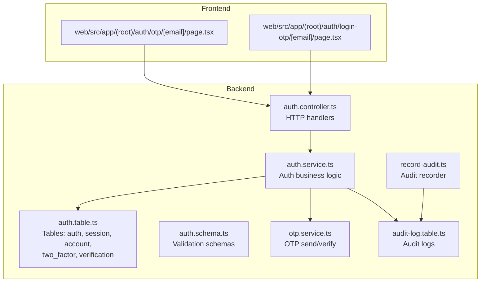

**Diagram sources**
- [auth.table.ts](file://server/src/infra/db/tables/auth.table.ts#L14-L187)
- [auth.service.ts](file://server/src/modules/auth/auth.service.ts#L1-L200)
- [auth.controller.ts](file://server/src/modules/auth/auth.controller.ts#L1-L200)
- [auth.schema.ts](file://server/src/modules/auth/auth.schema.ts#L1-L102)
- [otp.service.ts](file://server/src/modules/auth/otp/otp.service.ts#L1-L44)
- [audit-log.table.ts](file://server/src/infra/db/tables/audit-log.table.ts#L40-L76)
- [record-audit.ts](file://server/src/lib/record-audit.ts#L7-L23)
- [page.tsx](file://web/src/app/(root)/auth/otp/[email]/page.tsx#L48-L92)
- [page.tsx](file://web/src/app/(root)/auth/login-otp/[email]/page.tsx#L1-L42)

**Section sources**
- [auth.table.ts](file://server/src/infra/db/tables/auth.table.ts#L14-L187)
- [auth.service.ts](file://server/src/modules/auth/auth.service.ts#L1-L200)
- [auth.controller.ts](file://server/src/modules/auth/auth.controller.ts#L1-L200)
- [auth.schema.ts](file://server/src/modules/auth/auth.schema.ts#L1-L102)
- [otp.service.ts](file://server/src/modules/auth/otp/otp.service.ts#L1-L44)
- [audit-log.table.ts](file://server/src/infra/db/tables/audit-log.table.ts#L40-L76)
- [record-audit.ts](file://server/src/lib/record-audit.ts#L7-L23)
- [page.tsx](file://web/src/app/(root)/auth/otp/[email]/page.tsx#L48-L92)
- [page.tsx](file://web/src/app/(root)/auth/login-otp/[email]/page.tsx#L1-L42)

## Core Components
- Authentication records: user identity and credentials
- Sessions: per-user session tokens with expiry and device/IP metadata
- Accounts: provider-linked identities and credential storage
- Two-factor: TOTP secret and backup codes per user
- Verification codes: generic identifier/value with expiry
- OTP service: secure OTP generation, hashing, caching, and verification
- Audit logs: immutable event trail with device info and IP

**Section sources**
- [auth.table.ts](file://server/src/infra/db/tables/auth.table.ts#L14-L187)
- [otp.service.ts](file://server/src/modules/auth/otp/otp.service.ts#L1-L44)
- [audit-log.table.ts](file://server/src/infra/db/tables/audit-log.table.ts#L40-L76)

## Architecture Overview
High-level flow for authentication and security:

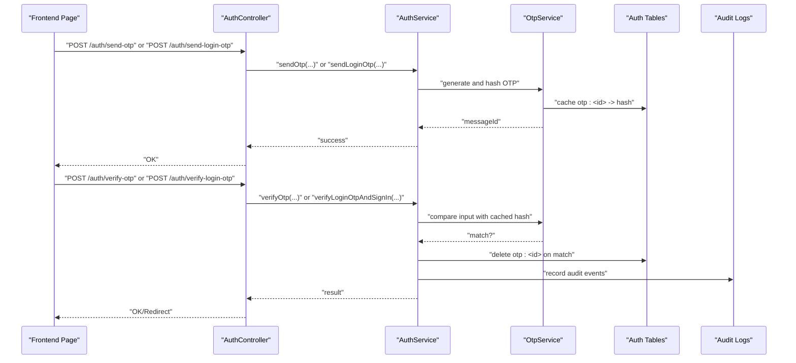

**Diagram sources**
- [auth.controller.ts](file://server/src/modules/auth/auth.controller.ts#L43-L92)
- [auth.service.ts](file://server/src/modules/auth/auth.service.ts#L697-L733)
- [otp.service.ts](file://server/src/modules/auth/otp/otp.service.ts#L8-L41)
- [auth.table.ts](file://server/src/infra/db/tables/auth.table.ts#L70-L128)
- [record-audit.ts](file://server/src/lib/record-audit.ts#L7-L23)

## Detailed Component Analysis

### Authentication and Session Data Model
- auth: primary identity with email, emailVerified flag, role, banned status, timestamps, and 2FA toggle
- session: per-user session with token, expiresAt, ipAddress, userAgent, impersonatedBy, and foreign key to auth
- account: provider-linked identity with tokens and optional local password
- two_factor: per-user TOTP secret and backup codes
- verification: generic identifier/value with expiry for verification flows

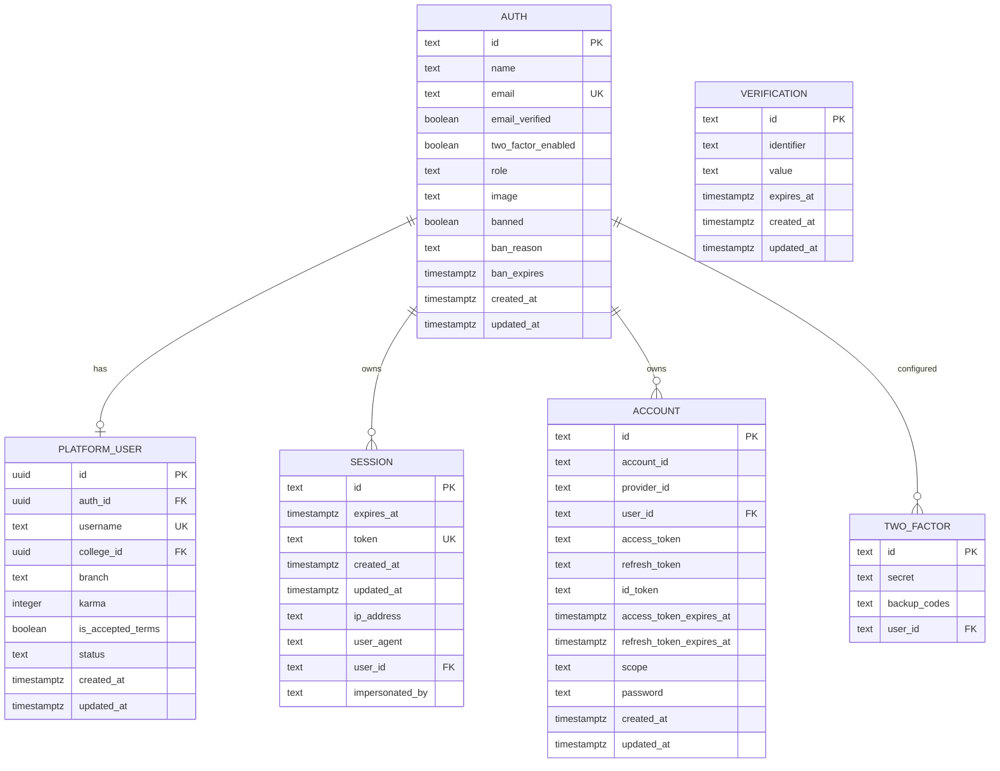

**Diagram sources**
- [auth.table.ts](file://server/src/infra/db/tables/auth.table.ts#L14-L187)

**Section sources**
- [auth.table.ts](file://server/src/infra/db/tables/auth.table.ts#L14-L187)

### Session Management
- Session creation and deletion are handled via the Better Auth integration and local cleanup.
- Session records include token, expiresAt, IP address, user agent, and impersonation metadata.
- Indexes on user_id and identifiers support efficient queries.

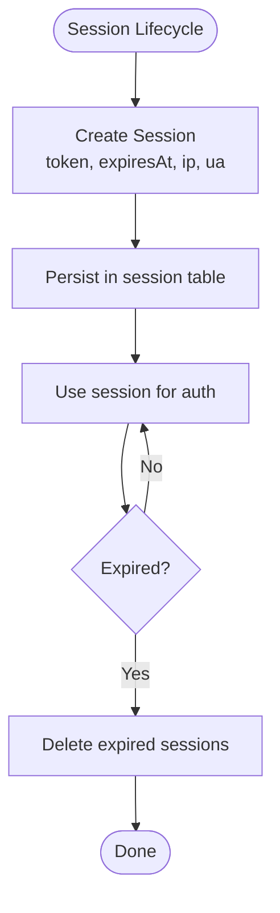

**Diagram sources**
- [auth.table.ts](file://server/src/infra/db/tables/auth.table.ts#L70-L88)
- [0002_snapshot.json](file://server/drizzle/meta/0002_snapshot.json#L544-L582)

**Section sources**
- [auth.table.ts](file://server/src/infra/db/tables/auth.table.ts#L70-L88)
- [0002_snapshot.json](file://server/drizzle/meta/0002_snapshot.json#L544-L582)

### Two-Factor Authentication (2FA)
- Two-factor secrets and backup codes are stored per user.
- Backup codes are stored as a single concatenated value; clients should split and validate as needed.
- 2FA can be enabled/disabled at the auth level.

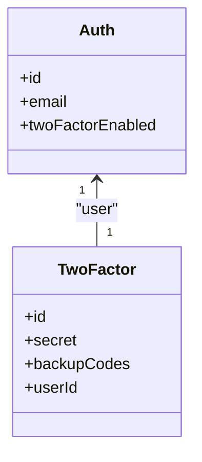

**Diagram sources**
- [auth.table.ts](file://server/src/infra/db/tables/auth.table.ts#L130-L144)

**Section sources**
- [auth.table.ts](file://server/src/infra/db/tables/auth.table.ts#L130-L144)

### Verification Codes and OTP
- OTP generation and verification are handled by the OTP service.
- OTP values are hashed before being cached under keys like otp:<id>.
- Expiration is enforced via TTL on cache entries.
- Attempts are tracked per identifier to prevent brute force.

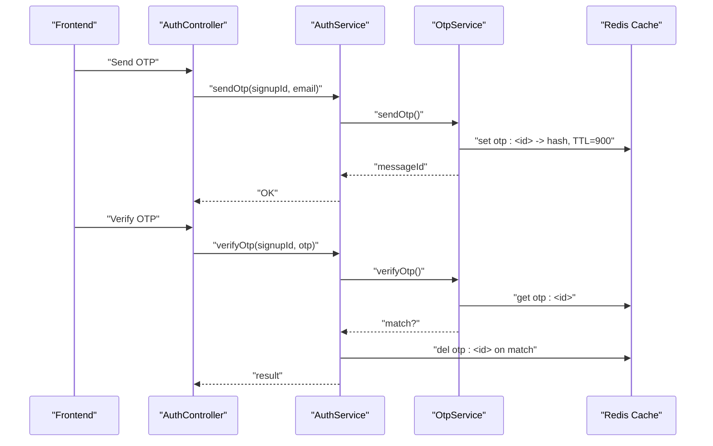

**Diagram sources**
- [otp.service.ts](file://server/src/modules/auth/otp/otp.service.ts#L8-L41)
- [auth.controller.ts](file://server/src/modules/auth/auth.controller.ts#L43-L92)
- [auth.service.ts](file://server/src/modules/auth/auth.service.ts#L697-L733)

**Section sources**
- [otp.service.ts](file://server/src/modules/auth/otp/otp.service.ts#L1-L44)
- [auth.controller.ts](file://server/src/modules/auth/auth.controller.ts#L43-L92)
- [auth.service.ts](file://server/src/modules/auth/auth.service.ts#L697-L733)

### Security Constraint Enforcement
- Email uniqueness and unique constraints on tokens and identifiers are enforced at the database level.
- Foreign keys cascade deletes to maintain referential integrity for sessions, accounts, and 2FA records.
- Validation schemas enforce input correctness and minimum length requirements.

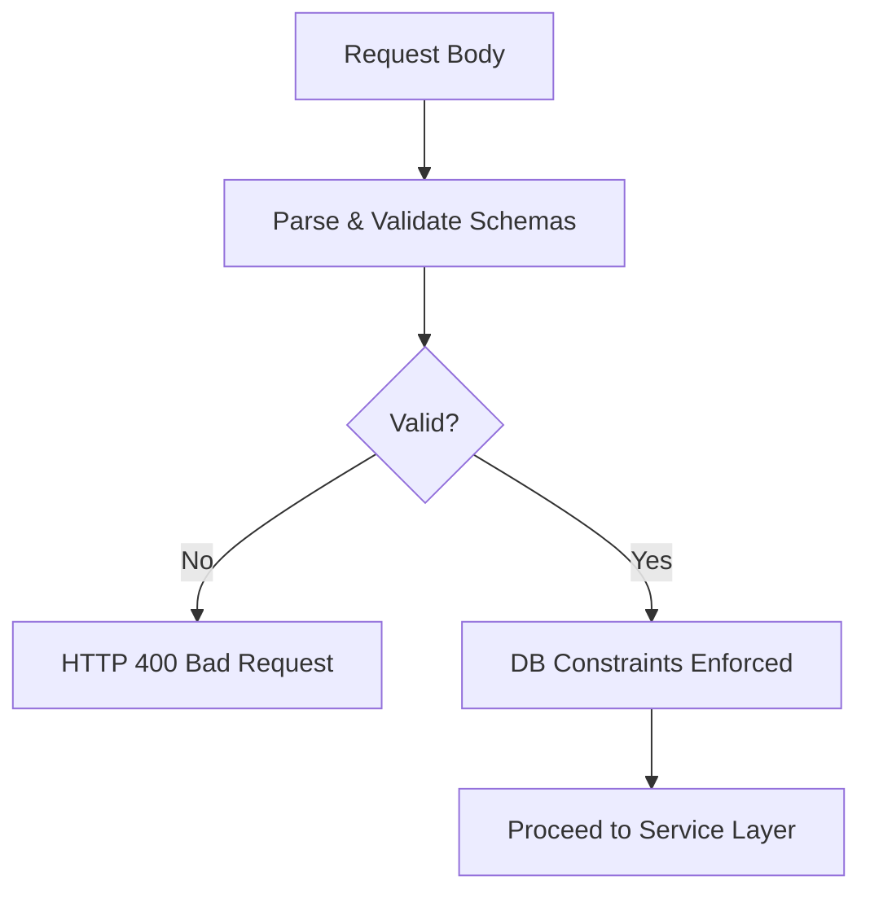

**Diagram sources**
- [auth.schema.ts](file://server/src/modules/auth/auth.schema.ts#L1-L102)
- [auth.table.ts](file://server/src/infra/db/tables/auth.table.ts#L14-L187)

**Section sources**
- [auth.schema.ts](file://server/src/modules/auth/auth.schema.ts#L1-L102)
- [auth.table.ts](file://server/src/infra/db/tables/auth.table.ts#L14-L187)

### Token Storage Mechanisms
- Access tokens and session tokens are stored in cookies and managed by Better Auth.
- Local cache stores OTP hashes and temporary identifiers with TTL.
- Refresh tokens are handled via controller logic and forwarded to the auth API.

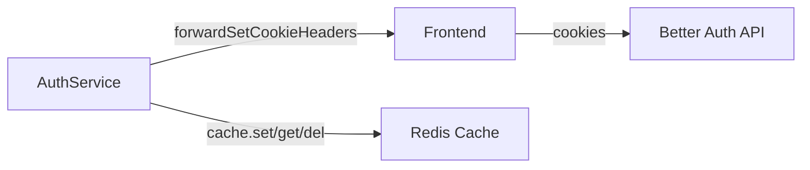

**Diagram sources**
- [auth.controller.ts](file://server/src/modules/auth/auth.controller.ts#L26-L41)
- [auth.service.ts](file://server/src/modules/auth/auth.service.ts#L448-L462)
- [otp.service.ts](file://server/src/modules/auth/otp/otp.service.ts#L20-L31)

**Section sources**
- [auth.controller.ts](file://server/src/modules/auth/auth.controller.ts#L26-L41)
- [auth.service.ts](file://server/src/modules/auth/auth.service.ts#L448-L462)
- [otp.service.ts](file://server/src/modules/auth/otp/otp.service.ts#L20-L31)

### IP Address Tracking and Device Fingerprinting
- Session records capture ip_address and user_agent for auditability.
- Audit recording enriches events with device info parsed from user agent.

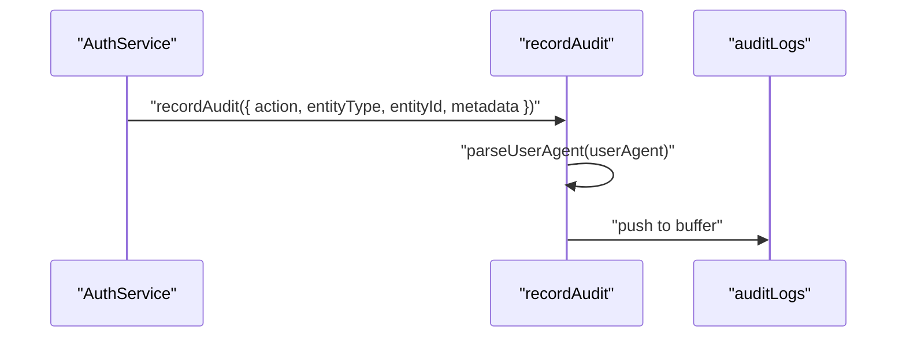

**Diagram sources**
- [auth.service.ts](file://server/src/modules/auth/auth.service.ts#L457-L461)
- [record-audit.ts](file://server/src/lib/record-audit.ts#L7-L23)
- [audit-log.table.ts](file://server/src/infra/db/tables/audit-log.table.ts#L40-L76)

**Section sources**
- [auth.service.ts](file://server/src/modules/auth/auth.service.ts#L457-L461)
- [record-audit.ts](file://server/src/lib/record-audit.ts#L7-L23)
- [audit-log.table.ts](file://server/src/infra/db/tables/audit-log.table.ts#L40-L76)

### Security Audit Trails
- Audit logs include actor, action, entity, IP, user agent, request ID, reason, and metadata.
- Indexes on entity, actor, and timestamp enable efficient querying.

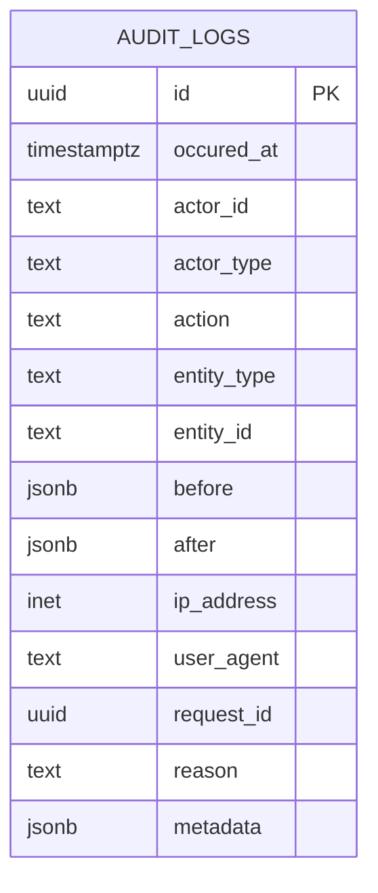

**Diagram sources**
- [audit-log.table.ts](file://server/src/infra/db/tables/audit-log.table.ts#L40-L76)
- [0005_snapshot.json](file://server/drizzle/meta/0005_snapshot.json#L99-L150)

**Section sources**
- [audit-log.table.ts](file://server/src/infra/db/tables/audit-log.table.ts#L40-L76)
- [0005_snapshot.json](file://server/drizzle/meta/0005_snapshot.json#L99-L150)

### Relationship Between User Accounts and Authentication Records
- Each auth record corresponds to a platform_user profile via a unique foreign key.
- Sessions, accounts, and 2FA records reference auth by user_id.

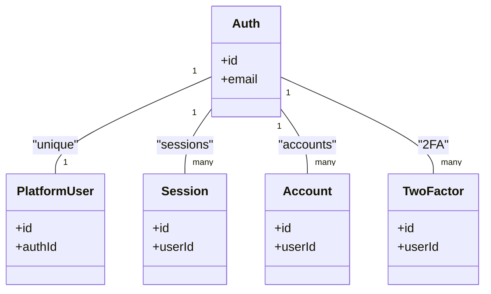

**Diagram sources**
- [auth.table.ts](file://server/src/infra/db/tables/auth.table.ts#L14-L187)

**Section sources**
- [auth.table.ts](file://server/src/infra/db/tables/auth.table.ts#L14-L187)

## Dependency Analysis
- Controllers depend on services for business logic.
- Services depend on repositories, cache, mail, and Better Auth API.
- Tables define relations and constraints.
- Audit recording depends on device parsing and observability context.

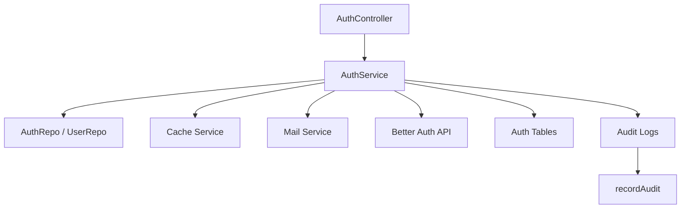

**Diagram sources**
- [auth.controller.ts](file://server/src/modules/auth/auth.controller.ts#L1-L200)
- [auth.service.ts](file://server/src/modules/auth/auth.service.ts#L1-L200)
- [auth.table.ts](file://server/src/infra/db/tables/auth.table.ts#L14-L187)
- [record-audit.ts](file://server/src/lib/record-audit.ts#L7-L23)

**Section sources**
- [auth.controller.ts](file://server/src/modules/auth/auth.controller.ts#L1-L200)
- [auth.service.ts](file://server/src/modules/auth/auth.service.ts#L1-L200)
- [auth.table.ts](file://server/src/infra/db/tables/auth.table.ts#L14-L187)
- [record-audit.ts](file://server/src/lib/record-audit.ts#L7-L23)

## Performance Considerations
- Use indexes on frequently queried columns (e.g., session.user_id, verification.identifier).
- Keep OTP TTLs reasonable to avoid stale cache entries.
- Batch audit writes to reduce I/O overhead.
- Prefer short-lived session tokens and robust invalidation on logout.

## Troubleshooting Guide
Common issues and resolutions:
- OTP expired or not found: Verify cache keys and TTLs; ensure attempts are tracked and cleared on success.
- Invalid OTP attempts: Enforce retry limits and clear OTP on max attempts.
- Session not found or expired: Confirm session token validity and expiry; check user_id index usage.
- Audit logs missing device info: Ensure user agent is present and device parser is invoked.

**Section sources**
- [auth.service.ts](file://server/src/modules/auth/auth.service.ts#L697-L733)
- [otp.service.ts](file://server/src/modules/auth/otp/otp.service.ts#L33-L41)
- [auth.table.ts](file://server/src/infra/db/tables/auth.table.ts#L70-L88)
- [record-audit.ts](file://server/src/lib/record-audit.ts#L7-L23)

## Conclusion
The authentication system combines robust data modeling, secure OTP handling, session lifecycle management, and comprehensive audit trails. By enforcing constraints at the DB level, leveraging cache for ephemeral data, and capturing device/IP metadata, the system achieves strong security posture while remaining maintainable and observable.