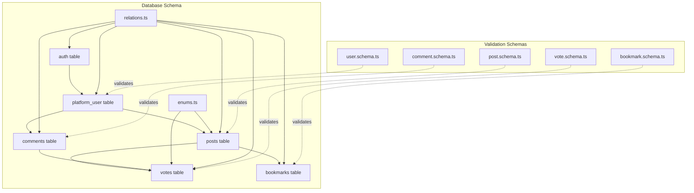
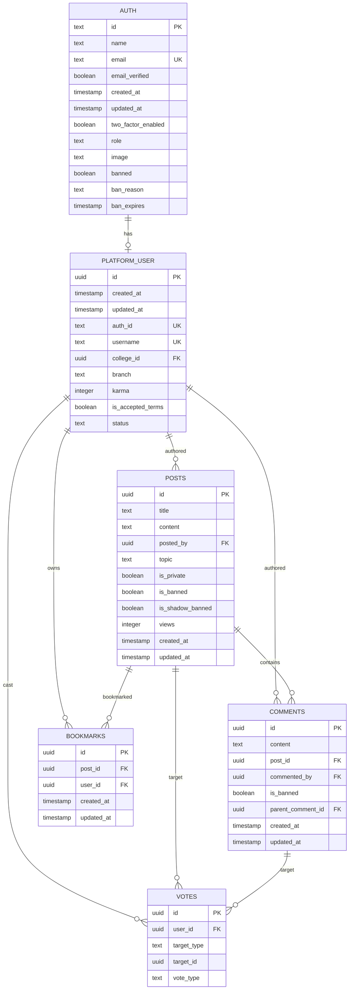
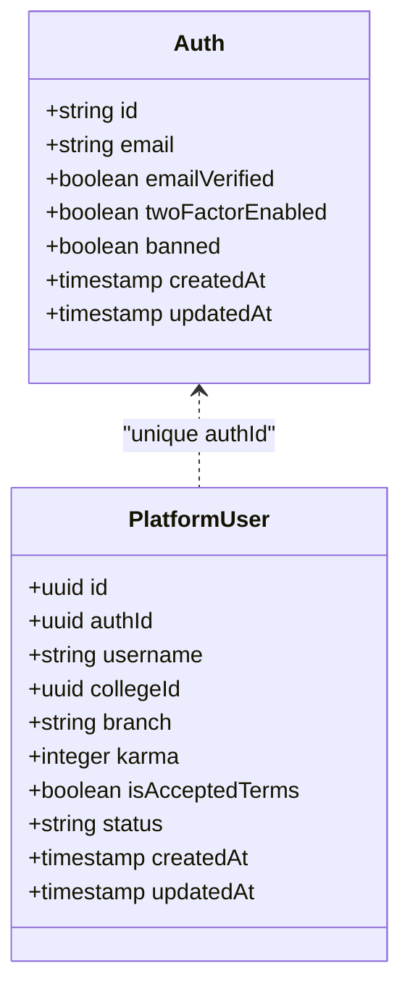
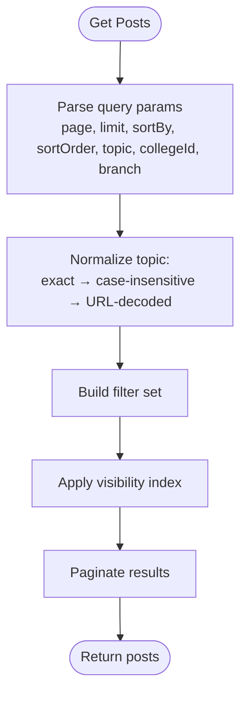
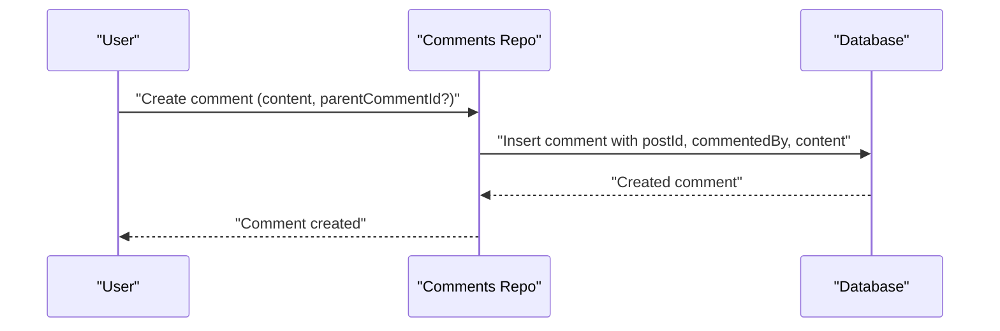
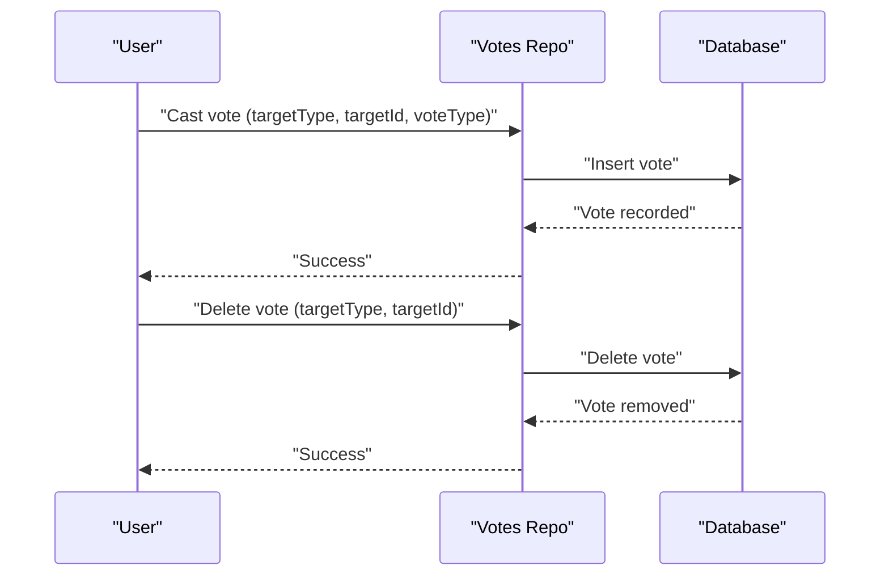
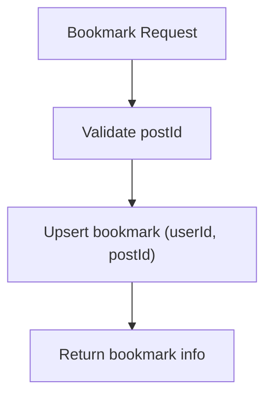
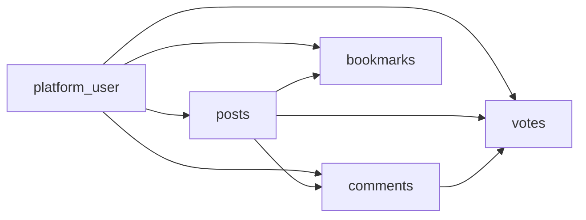

# Core Entities

<cite>
**Referenced Files in This Document**
- [auth.table.ts](file://server/src/infra/db/tables/auth.table.ts)
- [post.table.ts](file://server/src/infra/db/tables/post.table.ts)
- [comment.table.ts](file://server/src/infra/db/tables/comment.table.ts)
- [vote.table.ts](file://server/src/infra/db/tables/vote.table.ts)
- [bookmark.table.ts](file://server/src/infra/db/tables/bookmark.table.ts)
- [enums.ts](file://server/src/infra/db/tables/enums.ts)
- [relations.ts](file://server/src/infra/db/tables/relations.ts)
- [user.schema.ts](file://server/src/modules/user/user.schema.ts)
- [post.schema.ts](file://server/src/modules/post/post.schema.ts)
- [comment.schema.ts](file://server/src/modules/comment/comment.schema.ts)
- [vote.schema.ts](file://server/src/modules/vote/vote.schema.ts)
- [bookmark.schema.ts](file://server/src/modules/bookmark/bookmark.schema.ts)
</cite>

## Table of Contents
1. [Introduction](#introduction)
2. [Project Structure](#project-structure)
3. [Core Components](#core-components)
4. [Architecture Overview](#architecture-overview)
5. [Detailed Component Analysis](#detailed-component-analysis)
6. [Dependency Analysis](#dependency-analysis)
7. [Performance Considerations](#performance-considerations)
8. [Troubleshooting Guide](#troubleshooting-guide)
9. [Conclusion](#conclusion)
10. [Appendices](#appendices)

## Introduction
This document defines the core Flick data models for Users, Posts, Comments, Votes, and Bookmarks. It covers field definitions, data types, constraints, defaults, validation rules, primary keys, unique constraints, referential integrity, anonymization features, and common query patterns. The goal is to provide a clear, accessible reference for developers and stakeholders.

## Project Structure
The core data models are defined in the database schema layer and validated by Zod schemas in the modules layer:
- Database schema: Drizzle ORM tables and enums under server/src/infra/db/tables
- Validation schemas: Zod schemas under server/src/modules/*/schema.ts
- Entity relationships: Defined via relations in server/src/infra/db/tables/relations.ts

**Diagram sources**
- [auth.table.ts](file://server/src/infra/db/tables/auth.table.ts#L14-L187)
- [post.table.ts](file://server/src/infra/db/tables/post.table.ts#L13-L39)
- [comment.table.ts](file://server/src/infra/db/tables/comment.table.ts#L5-L22)
- [vote.table.ts](file://server/src/infra/db/tables/vote.table.ts#L6-L33)
- [bookmark.table.ts](file://server/src/infra/db/tables/bookmark.table.ts#L5-L19)
- [enums.ts](file://server/src/infra/db/tables/enums.ts#L1-L51)
- [relations.ts](file://server/src/infra/db/tables/relations.ts#L1-L100)
- [user.schema.ts](file://server/src/modules/user/user.schema.ts#L1-L40)
- [post.schema.ts](file://server/src/modules/post/post.schema.ts#L1-L107)
- [comment.schema.ts](file://server/src/modules/comment/comment.schema.ts#L1-L38)
- [vote.schema.ts](file://server/src/modules/vote/vote.schema.ts#L1-L14)
- [bookmark.schema.ts](file://server/src/modules/bookmark/bookmark.schema.ts#L1-L6)

**Section sources**
- [auth.table.ts](file://server/src/infra/db/tables/auth.table.ts#L14-L187)
- [post.table.ts](file://server/src/infra/db/tables/post.table.ts#L13-L39)
- [comment.table.ts](file://server/src/infra/db/tables/comment.table.ts#L5-L22)
- [vote.table.ts](file://server/src/infra/db/tables/vote.table.ts#L6-L33)
- [bookmark.table.ts](file://server/src/infra/db/tables/bookmark.table.ts#L5-L19)
- [enums.ts](file://server/src/infra/db/tables/enums.ts#L1-L51)
- [relations.ts](file://server/src/infra/db/tables/relations.ts#L1-L100)
- [user.schema.ts](file://server/src/modules/user/user.schema.ts#L1-L40)
- [post.schema.ts](file://server/src/modules/post/post.schema.ts#L1-L107)
- [comment.schema.ts](file://server/src/modules/comment/comment.schema.ts#L1-L38)
- [vote.schema.ts](file://server/src/modules/vote/vote.schema.ts#L1-L14)
- [bookmark.schema.ts](file://server/src/modules/bookmark/bookmark.schema.ts#L1-L6)

## Core Components
This section documents each core entity’s schema, constraints, and validation rules.

### Users
- Tables involved:
  - auth: Platform authentication and identity
  - platform_user: User profile, relationship to auth, college, and branch
- Primary key: platform_user.id (UUID)
- Unique constraints:
  - auth.email (unique)
  - platform_user.authId (unique)
  - platform_user.username (unique)
- Defaults:
  - platform_user.karma: 0
  - platform_user.isAcceptedTerms: false
  - platform_user.status: ONBOARDING
  - auth.twoFactorEnabled: false
  - auth.banned: false
  - auth.emailVerified: false
- Referential integrity:
  - platform_user.authId → auth.id (cascade delete)
  - platform_user.collegeId → colleges.id (cascade delete)
- Validation rules (Zod):
  - Registration requires email
  - Initialize user requires email and password (min length)
  - OAuth callback requires code
  - Search query requires query string
  - Update profile requires non-empty branch
- Anonymization:
  - Username and display name are derived from auth records; deletion cascades via auth.id → platform_user.authId
  - No explicit content anonymization fields present in core user tables

**Section sources**
- [auth.table.ts](file://server/src/infra/db/tables/auth.table.ts#L14-L187)
- [user.schema.ts](file://server/src/modules/user/user.schema.ts#L1-L40)

### Posts
- Table: posts
- Primary key: id (UUID)
- Fields and defaults:
  - title: text, not null
  - content: text, not null
  - postedBy: UUID → platform_user.id (cascade delete)
  - topic: enum (see enums.ts)
  - isPrivate: boolean, default false
  - isBanned: boolean, default false
  - isShadowBanned: boolean, default false
  - views: integer, default 0
  - createdAt: timestamp, default now
  - updatedAt: timestamp, default now
- Indexes:
  - Composite visibility index on isBanned, isShadowBanned, createdAt desc
- Validation rules (Zod):
  - Create: title min/max, content min/max, topic enum, optional isPrivate
  - Update: optional title/content/topic/isPrivate
  - Get posts: pagination, sort options, topic normalization (exact/case-insensitive/URL-decoded), optional filters
- Anonymization:
  - Author identity removed via cascade delete on platform_user.id → posts.postedBy
  - Content remains unless moderated or deleted by policy

**Section sources**
- [post.table.ts](file://server/src/infra/db/tables/post.table.ts#L13-L39)
- [enums.ts](file://server/src/infra/db/tables/enums.ts#L28-L40)
- [post.schema.ts](file://server/src/modules/post/post.schema.ts#L1-L107)

### Comments
- Table: comments
- Primary key: id (UUID)
- Fields and defaults:
  - content: text, not null
  - postId: UUID → posts.id (cascade delete)
  - commentedBy: UUID → platform_user.id (cascade delete)
  - isBanned: boolean, default false
  - parentCommentId: UUID → comments.id (delete set null)
  - createdAt: timestamp, default now
  - updatedAt: timestamp, default now
- Validation rules (Zod):
  - Create: content min/max, optional nested parentCommentId
  - Update: content min/max
  - Get comments: pagination and sort options
- Anonymization:
  - Author identity removed via cascade delete on platform_user.id → comments.commentedBy
  - Parent comment thread integrity maintained via set null on delete

**Section sources**
- [comment.table.ts](file://server/src/infra/db/tables/comment.table.ts#L5-L22)
- [comment.schema.ts](file://server/src/modules/comment/comment.schema.ts#L1-L38)

### Votes
- Table: votes
- Primary key: id (UUID)
- Unique constraint: combination of userId, targetType, targetId (enforces single vote per target per user)
- Fields and defaults:
  - userId: UUID → platform_user.id (cascade delete)
  - targetType: enum {"post","comment"}
  - targetId: UUID
  - voteType: enum {"upvote","downvote"}
- Indexes:
  - Composite index on targetType, targetId for efficient lookups
- Validation rules (Zod):
  - Insert: targetType, targetId, voteType
  - Delete: targetType, targetId
- Anonymization:
  - Voter identity removed via cascade delete on platform_user.id → votes.userId

**Section sources**
- [vote.table.ts](file://server/src/infra/db/tables/vote.table.ts#L6-L33)
- [enums.ts](file://server/src/infra/db/tables/enums.ts#L42-L44)
- [vote.schema.ts](file://server/src/modules/vote/vote.schema.ts#L1-L14)

### Bookmarks
- Table: bookmarks
- Primary key: id (UUID)
- Fields and defaults:
  - postId: UUID → posts.id (cascade delete)
  - userId: UUID → platform_user.id (cascade delete)
  - createdAt: timestamp, default now
  - updatedAt: timestamp, default now
- Indexes:
  - Composite index on userId, postId
- Validation rules (Zod):
  - PostId: postId required (string)
- Anonymization:
  - Bookmark owner identity removed via cascade delete on platform_user.id → bookmarks.userId

**Section sources**
- [bookmark.table.ts](file://server/src/infra/db/tables/bookmark.table.ts#L5-L19)
- [bookmark.schema.ts](file://server/src/modules/bookmark/bookmark.schema.ts#L1-L6)

## Architecture Overview
The data model enforces referential integrity and supports core engagement features. Users author posts and comments, vote on content, and bookmark posts. Votes and bookmarks are scoped to targets (post or comment) and users.

**Diagram sources**
- [auth.table.ts](file://server/src/infra/db/tables/auth.table.ts#L14-L187)
- [post.table.ts](file://server/src/infra/db/tables/post.table.ts#L13-L39)
- [comment.table.ts](file://server/src/infra/db/tables/comment.table.ts#L5-L22)
- [vote.table.ts](file://server/src/infra/db/tables/vote.table.ts#L6-L33)
- [bookmark.table.ts](file://server/src/infra/db/tables/bookmark.table.ts#L5-L19)
- [relations.ts](file://server/src/infra/db/tables/relations.ts#L19-L59)

## Detailed Component Analysis

### Users
- Identity and profile:
  - auth holds email, 2FA, ban state, and timestamps
  - platform_user links to auth via unique authId, stores username, college, branch, karma, terms acceptance, and status
- Constraints:
  - Status ONBOARDING requires branch to be null; otherwise branch must be present
- Validation:
  - Registration and initialization schemas enforce presence and minimum lengths
- Anonymization:
  - Deletion of auth cascades to platform_user, removing user identity

**Diagram sources**
- [auth.table.ts](file://server/src/infra/db/tables/auth.table.ts#L14-L187)

**Section sources**
- [auth.table.ts](file://server/src/infra/db/tables/auth.table.ts#L14-L187)
- [user.schema.ts](file://server/src/modules/user/user.schema.ts#L1-L40)

### Posts
- Ownership and visibility:
  - postedBy references platform_user.id
  - isPrivate toggles visibility; shadow/banned flags control moderation visibility
- Indexing:
  - Visibility index accelerates feed queries
- Validation:
  - Title/content length limits and topic enum enforcement
  - Topic normalization supports flexible query inputs

**Diagram sources**
- [post.schema.ts](file://server/src/modules/post/post.schema.ts#L53-L98)
- [post.table.ts](file://server/src/infra/db/tables/post.table.ts#L31-L37)

**Section sources**
- [post.table.ts](file://server/src/infra/db/tables/post.table.ts#L13-L39)
- [post.schema.ts](file://server/src/modules/post/post.schema.ts#L1-L107)

### Comments
- Hierarchical threading:
  - parentCommentId self-reference enables nested replies
- Ownership:
  - commentedBy references platform_user.id
- Validation:
  - Content length limits and optional nesting

**Diagram sources**
- [comment.table.ts](file://server/src/infra/db/tables/comment.table.ts#L5-L22)
- [comment.schema.ts](file://server/src/modules/comment/comment.schema.ts#L3-L9)

**Section sources**
- [comment.table.ts](file://server/src/infra/db/tables/comment.table.ts#L5-L22)
- [comment.schema.ts](file://server/src/modules/comment/comment.schema.ts#L1-L38)

### Votes
- Uniqueness and targeting:
  - Single vote per user per target enforced by unique index
  - targetType determines whether targetId refers to post or comment
- Validation:
  - Enforce enum values for vote type and target type

**Diagram sources**
- [vote.table.ts](file://server/src/infra/db/tables/vote.table.ts#L21-L28)
- [vote.schema.ts](file://server/src/modules/vote/vote.schema.ts#L7-L13)

**Section sources**
- [vote.table.ts](file://server/src/infra/db/tables/vote.table.ts#L6-L33)
- [vote.schema.ts](file://server/src/modules/vote/vote.schema.ts#L1-L14)

### Bookmarks
- Ownership and lookup:
  - userId and postId define ownership and enable efficient lookups via composite index
- Validation:
  - postId required (string)

**Diagram sources**
- [bookmark.table.ts](file://server/src/infra/db/tables/bookmark.table.ts#L17-L18)
- [bookmark.schema.ts](file://server/src/modules/bookmark/bookmark.schema.ts#L3-L5)

**Section sources**
- [bookmark.table.ts](file://server/src/infra/db/tables/bookmark.table.ts#L5-L19)
- [bookmark.schema.ts](file://server/src/modules/bookmark/bookmark.schema.ts#L1-L6)

## Dependency Analysis
Entity relationships and referential integrity are defined centrally and used across modules.

**Diagram sources**
- [relations.ts](file://server/src/infra/db/tables/relations.ts#L19-L59)

**Section sources**
- [relations.ts](file://server/src/infra/db/tables/relations.ts#L1-L100)

## Performance Considerations
- Indexes:
  - posts visibility index accelerates feed filtering and sorting
  - votes target lookup index supports fast aggregation and per-user vote checks
  - bookmarks composite index optimizes user-scoped lookups
- Defaults:
  - Boolean flags and counters initialized to neutral/false reduce conditional logic overhead
- Cascading deletes:
  - Maintain referential integrity while enabling clean removal of user-authored content

[No sources needed since this section provides general guidance]

## Troubleshooting Guide
- Duplicate vote errors:
  - Cause: Unique index violation on (userId, targetType, targetId)
  - Resolution: Check existing vote before insert; allow update semantics if needed
- Invalid topic queries:
  - Cause: Topic normalization failure
  - Resolution: Ensure topic matches enum variants (case-insensitive and URL-decoded support included)
- Deleted author visibility:
  - Cause: Cascade delete removes author identity
  - Resolution: Expect missing author data after user deletion; content persists unless moderated

**Section sources**
- [vote.table.ts](file://server/src/infra/db/tables/vote.table.ts#L21-L28)
- [post.schema.ts](file://server/src/modules/post/post.schema.ts#L64-L95)
- [auth.table.ts](file://server/src/infra/db/tables/auth.table.ts#L32-L68)

## Conclusion
The core data models for Users, Posts, Comments, Votes, and Bookmarks are designed around strong referential integrity, clear constraints, and efficient indexing. Validation schemas ensure robust input handling, while cascade deletes support user and content lifecycle management. The design balances performance with maintainability and aligns with Flick’s engagement and moderation needs.

[No sources needed since this section summarizes without analyzing specific files]

## Appendices

### Sample Data Structures
- User
  - Fields: id, authId, username, collegeId, branch, karma, isAcceptedTerms, status, createdAt, updatedAt
  - Example: { id: "uuid", authId: "text", username: "string", collegeId: "uuid", branch: "string", karma: 0, isAcceptedTerms: false, status: "ONBOARDING", createdAt: "timestamp", updatedAt: "timestamp" }
- Post
  - Fields: id, title, content, postedBy, topic, isPrivate, isBanned, isShadowBanned, views, createdAt, updatedAt
  - Example: { id: "uuid", title: "string", content: "text", postedBy: "uuid", topic: "Ask Flick", isPrivate: false, isBanned: false, isShadowBanned: false, views: 0, createdAt: "timestamp", updatedAt: "timestamp" }
- Comment
  - Fields: id, content, postId, commentedBy, isBanned, parentCommentId, createdAt, updatedAt
  - Example: { id: "uuid", content: "text", postId: "uuid", commentedBy: "uuid", isBanned: false, parentCommentId: "uuid|null", createdAt: "timestamp", updatedAt: "timestamp" }
- Vote
  - Fields: id, userId, targetType, targetId, voteType
  - Example: { id: "uuid", userId: "uuid", targetType: "post|comment", targetId: "uuid", voteType: "upvote|downvote" }
- Bookmark
  - Fields: id, postId, userId, createdAt, updatedAt
  - Example: { id: "uuid", postId: "uuid", userId: "uuid", createdAt: "timestamp", updatedAt: "timestamp" }

[No sources needed since this section provides general guidance]