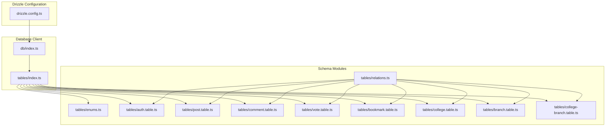
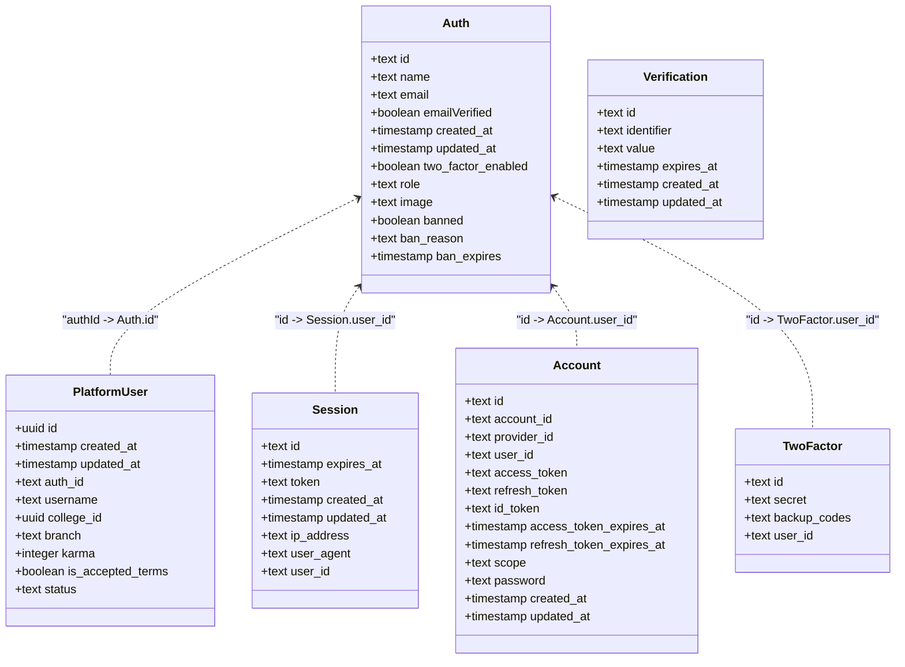
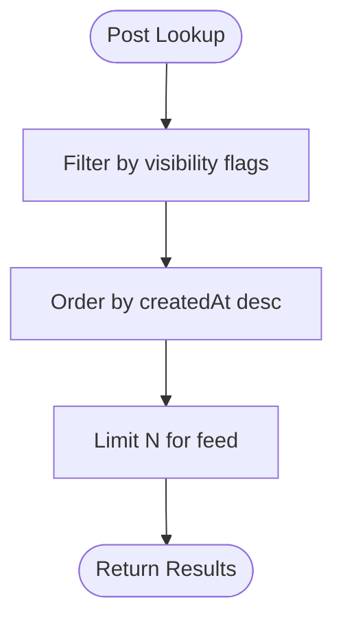
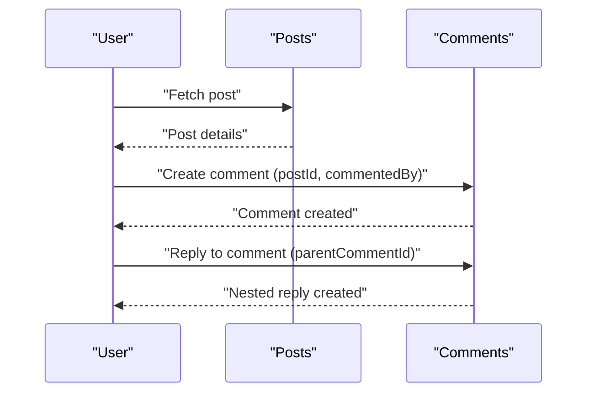
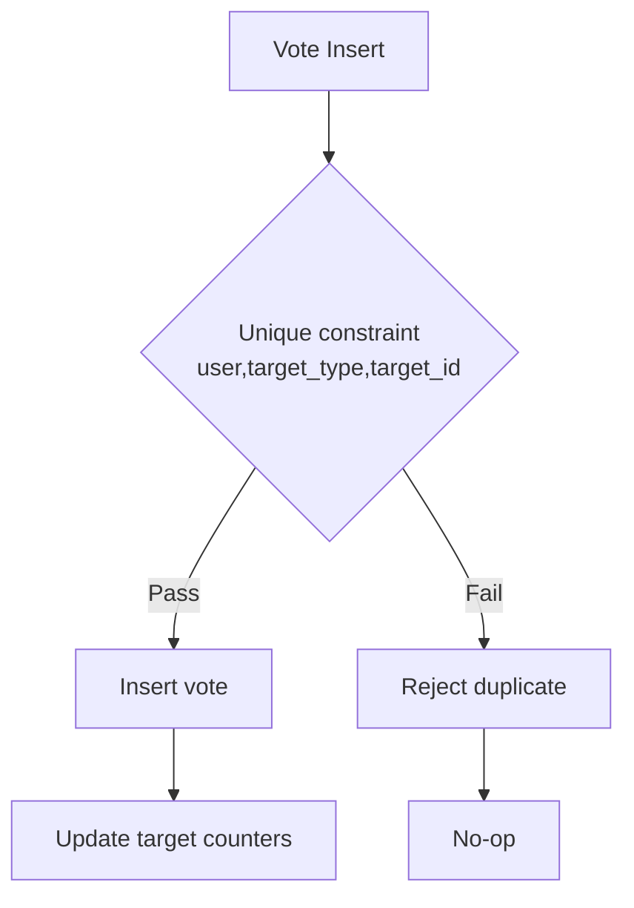
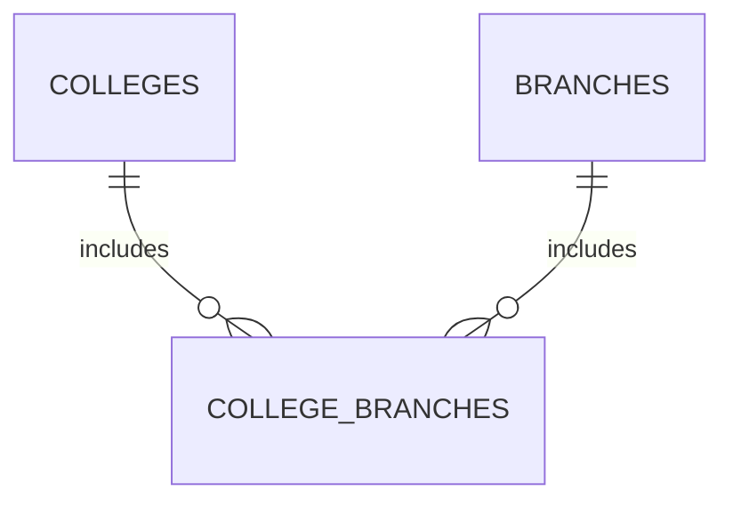
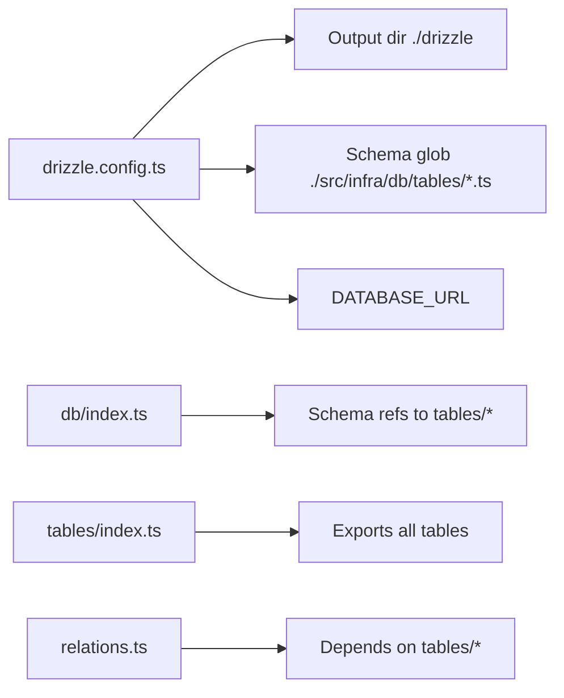

# Database Schema

<cite>
**Referenced Files in This Document**
- [drizzle.config.ts](file://server/drizzle.config.ts)
- [db.index.ts](file://server/src/infra/db/index.ts)
- [tables.index.ts](file://server/src/infra/db/tables/index.ts)
- [relations.ts](file://server/src/infra/db/tables/relations.ts)
- [enums.ts](file://server/src/infra/db/tables/enums.ts)
- [auth.table.ts](file://server/src/infra/db/tables/auth.table.ts)
- [post.table.ts](file://server/src/infra/db/tables/post.table.ts)
- [comment.table.ts](file://server/src/infra/db/tables/comment.table.ts)
- [vote.table.ts](file://server/src/infra/db/tables/vote.table.ts)
- [bookmark.table.ts](file://server/src/infra/db/tables/bookmark.table.ts)
- [college.table.ts](file://server/src/infra/db/tables/college.table.ts)
- [branch.table.ts](file://server/src/infra/db/tables/branch.table.ts)
- [college-branch.table.ts](file://server/src/infra/db/tables/college-branch.table.ts)
</cite>

## Table of Contents
1. [Introduction](#introduction)
2. [Project Structure](#project-structure)
3. [Core Components](#core-components)
4. [Architecture Overview](#architecture-overview)
5. [Detailed Component Analysis](#detailed-component-analysis)
6. [Dependency Analysis](#dependency-analysis)
7. [Performance Considerations](#performance-considerations)
8. [Troubleshooting Guide](#troubleshooting-guide)
9. [Conclusion](#conclusion)
10. [Appendices](#appendices)

## Introduction
This document provides comprehensive data model documentation for the Flick database schema. It details entity relationships, field definitions, data types, primary and foreign keys, indexes, constraints, and Drizzle ORM integration patterns. It also explains migration management via Drizzle Kit, schema evolution, and practical performance considerations for efficient querying.

## Project Structure
The database schema is defined using Drizzle ORM with PostgreSQL dialect. The schema is split into:
- A central database client initialization that exposes named tables in a typed schema.
- Individual table definitions grouped under a single directory.
- Relations and enums colocated with tables for clarity and maintainability.
- Drizzle Kit configuration pointing to the schema location and credentials.



**Diagram sources**
- [drizzle.config.ts](file://server/drizzle.config.ts#L1-L14)
- [db.index.ts](file://server/src/infra/db/index.ts#L1-L38)
- [tables.index.ts](file://server/src/infra/db/tables/index.ts#L1-L23)
- [enums.ts](file://server/src/infra/db/tables/enums.ts#L1-L51)
- [relations.ts](file://server/src/infra/db/tables/relations.ts#L1-L100)
- [auth.table.ts](file://server/src/infra/db/tables/auth.table.ts#L1-L187)
- [post.table.ts](file://server/src/infra/db/tables/post.table.ts#L1-L39)
- [comment.table.ts](file://server/src/infra/db/tables/comment.table.ts#L1-L22)
- [vote.table.ts](file://server/src/infra/db/tables/vote.table.ts#L1-L33)
- [bookmark.table.ts](file://server/src/infra/db/tables/bookmark.table.ts#L1-L19)
- [college.table.ts](file://server/src/infra/db/tables/college.table.ts#L1-L24)
- [branch.table.ts](file://server/src/infra/db/tables/branch.table.ts#L1-L17)
- [college-branch.table.ts](file://server/src/infra/db/tables/college-branch.table.ts#L1-L32)

**Section sources**
- [drizzle.config.ts](file://server/drizzle.config.ts#L1-L14)
- [db.index.ts](file://server/src/infra/db/index.ts#L1-L38)
- [tables.index.ts](file://server/src/infra/db/tables/index.ts#L1-L23)

## Core Components
This section summarizes the core entities and their primary attributes, constraints, and indexes.

- Users and Authentication
  - Auth table: stores identity and security fields with unique email and optional ban metadata.
  - Platform user table: links to Auth, enforces unique username and unique authId, includes college and branch references, and a status constraint ensuring branch presence for non-onboarding statuses.
  - Session, Account, Two-factor, Verification tables: support session management, OAuth/manual accounts, 2FA, and verification tokens with targeted indexes.

- Posts
  - Posts table: authored by platform users, includes topic enum, visibility flags, views counter, and composite index for visibility and recency.

- Comments
  - Comments table: nested replies via parentCommentId, references post and author, with ban flag and timestamps.

- Votes
  - Votes table: polymorphic target (post/comment), per-user-per-target uniqueness, and a composite index for target lookups.

- Bookmarks
  - Bookmarks table: user-post join with a composite index for fast lookup.

- Colleges and Branches
  - Colleges and Branches tables: core dimension tables with indexes on name and identifiers.
  - College-Branch junction: enforces unique pairs and indexes for fast joins.

- Enums
  - Enumerations for auth types, audit logging, notifications, topics, vote types, and moderation severity.

**Section sources**
- [auth.table.ts](file://server/src/infra/db/tables/auth.table.ts#L14-L187)
- [post.table.ts](file://server/src/infra/db/tables/post.table.ts#L13-L39)
- [comment.table.ts](file://server/src/infra/db/tables/comment.table.ts#L5-L22)
- [vote.table.ts](file://server/src/infra/db/tables/vote.table.ts#L6-L33)
- [bookmark.table.ts](file://server/src/infra/db/tables/bookmark.table.ts#L5-L19)
- [college.table.ts](file://server/src/infra/db/tables/college.table.ts#L3-L24)
- [branch.table.ts](file://server/src/infra/db/tables/branch.table.ts#L3-L17)
- [college-branch.table.ts](file://server/src/infra/db/tables/college-branch.table.ts#L11-L32)
- [enums.ts](file://server/src/infra/db/tables/enums.ts#L1-L51)

## Architecture Overview
The schema follows a normalized relational design with explicit foreign keys and constraints. Drizzle ORM manages:
- Typed table definitions with precise data types.
- Relations between entities for strongly-typed queries.
- Indexes optimized for frequent filters and joins.
- Enumerations for domain-specific values.

```mermaid
erDiagram
AUTH {
text id PK
text name
text email UK
boolean email_verified
timestamp created_at
timestamp updated_at
boolean two_factor_enabled
text role
text image
boolean banned
text ban_reason
timestamp ban_expires
}
PLATFORM_USER {
uuid id PK
timestamp created_at
timestamp updated_at
text auth_id UK FK
text username UK
uuid college_id FK
text branch
integer karma
boolean is_accepted_terms
text status
}
SESSION {
text id PK
timestamp expires_at
text token UK
timestamp created_at
timestamp updated_at
text ip_address
text user_agent
text user_id FK
text impersonated_by
}
ACCOUNT {
text id PK
text account_id
text provider_id
text user_id FK
text access_token
text refresh_token
text id_token
timestamp access_token_expires_at
timestamp refresh_token_expires_at
text scope
text password
timestamp created_at
timestamp updated_at
}
TWO_FACTOR {
text id PK
text secret
text backup_codes
text user_id FK
}
VERIFICATION {
text id PK
text identifier
text value
timestamp expires_at
timestamp created_at
timestamp updated_at
}
COLLEGES {
uuid id PK
text name
text emailDomain
text city
text state
text profile
timestamp created_at
timestamp updated_at
}
BRANCHES {
uuid id PK
text name
text code
timestamp created_at
timestamp updated_at
}
COLLEGE_BRANCHES {
uuid id PK
uuid college_id FK
uuid branch_id FK
timestamp created_at
}
POSTS {
uuid id PK
text title
text content
uuid postedBy FK
text topic
boolean isPrivate
boolean isBanned
boolean isShadowBanned
integer views
timestamp createdAt
timestamp updatedAt
}
COMMENTS {
uuid id PK
text content
uuid postId FK
uuid commentedBy FK
boolean isBanned
uuid parentCommentId FK
timestamp createdAt
timestamp updatedAt
}
BOOKMARKS {
uuid id PK
uuid postId FK
uuid userId FK
timestamp createdAt
timestamp updatedAt
}
VOTES {
uuid id PK
uuid user_id FK
text target_type
uuid target_id
text vote_type
}
CONTENT_REPORTS {
uuid id PK
uuid reported_by FK
uuid post_id FK
uuid comment_id FK
text report_type
text reason
timestamp created_at
timestamp updated_at
}
NOTIFICATIONS {
uuid id PK
uuid user_id FK
text type
text message
boolean read
timestamp created_at
timestamp updated_at
}
AUDIT_LOGS {
uuid id PK
text actor_id FK
text entity_type
text action
text status
text platform
text role
jsonb metadata
timestamp created_at
}
USER_BLOCKS {
uuid id PK
text blocked_by_id FK
text blocked_user_id FK
text reason
timestamp created_at
timestamp updated_at
}
FEEDBACKS {
uuid id PK
uuid user_id FK
text category
text message
text status
timestamp created_at
timestamp updated_at
}
BANNED_WORDS {
uuid id PK
text word
text severity
timestamp created_at
timestamp updated_at
}
AUTH ||--|| PLATFORM_USER : "links via authId"
AUTH ||--o{ SESSION : "has"
AUTH ||--o{ ACCOUNT : "has"
AUTH ||--o{ TWO_FACTOR : "has"
PLATFORM_USER }o--|| COLLEGES : "belongs to"
PLATFORM_USER ||--o{ POSTS : "authors"
PLATFORM_USER ||--o{ BOOKMARKS : "bookmarks"
PLATFORM_USER ||--o{ VOTES : "casts"
POSTS ||--o{ COMMENTS : "comments"
POSTS ||--o{ BOOKMARKS : "bookmarked by"
POSTS ||--o{ VOTES : "votes"
COLLEGES ||--o{ COLLEGE_BRANCHES : "includes"
BRANCHES ||--o{ COLLEGE_BRANCHES : "includes"
```

**Diagram sources**
- [auth.table.ts](file://server/src/infra/db/tables/auth.table.ts#L14-L187)
- [post.table.ts](file://server/src/infra/db/tables/post.table.ts#L13-L39)
- [comment.table.ts](file://server/src/infra/db/tables/comment.table.ts#L5-L22)
- [vote.table.ts](file://server/src/infra/db/tables/vote.table.ts#L6-L33)
- [bookmark.table.ts](file://server/src/infra/db/tables/bookmark.table.ts#L5-L19)
- [college.table.ts](file://server/src/infra/db/tables/college.table.ts#L3-L24)
- [branch.table.ts](file://server/src/infra/db/tables/branch.table.ts#L3-L17)
- [college-branch.table.ts](file://server/src/infra/db/tables/college-branch.table.ts#L11-L32)
- [enums.ts](file://server/src/infra/db/tables/enums.ts#L1-L51)

## Detailed Component Analysis

### Users and Authentication
- Auth table
  - Fields: id, name, email (unique), emailVerified, timestamps, twoFactorEnabled, role, image, ban flags and expiry.
  - Constraints: unique email; cascade delete on related records via foreign keys in dependent tables.
- Platform user table
  - Fields: id, timestamps, authId (unique, FK to Auth), username (unique), collegeId (FK to Colleges), branch, karma, terms acceptance, status.
  - Constraint: conditional branch presence based on status using a generated SQL check.
- Sessions, Accounts, Two-Factor, Verification
  - Indexed fields for efficient lookups (e.g., session.userId, account.userId, twoFactor indices).
  - Foreign keys cascade deletes to keep referential integrity.



**Diagram sources**
- [auth.table.ts](file://server/src/infra/db/tables/auth.table.ts#L14-L187)

**Section sources**
- [auth.table.ts](file://server/src/infra/db/tables/auth.table.ts#L14-L187)

### Posts
- Fields: id, title, content, postedBy (FK to PlatformUser), topic (enum), visibility flags, views, timestamps.
- Index: composite index on visibility and creation time to optimize feed retrieval.



**Diagram sources**
- [post.table.ts](file://server/src/infra/db/tables/post.table.ts#L31-L37)

**Section sources**
- [post.table.ts](file://server/src/infra/db/tables/post.table.ts#L13-L39)

### Comments
- Fields: id, content, postId (FK to Posts), commentedBy (FK to PlatformUser), isBanned, parentCommentId (self-reference), timestamps.
- Supports threaded discussions via parentCommentId with set-null on deletion.



**Diagram sources**
- [comment.table.ts](file://server/src/infra/db/tables/comment.table.ts#L5-L22)

**Section sources**
- [comment.table.ts](file://server/src/infra/db/tables/comment.table.ts#L5-L22)

### Votes
- Fields: id, user_id (FK to PlatformUser), target_type (enum: post/comment), target_id, vote_type (enum: upvote/downvote).
- Constraints: unique index on (user_id, target_type, target_id) to prevent duplicate votes.
- Index: composite index on (target_type, target_id) for efficient aggregation.



**Diagram sources**
- [vote.table.ts](file://server/src/infra/db/tables/vote.table.ts#L21-L28)

**Section sources**
- [vote.table.ts](file://server/src/infra/db/tables/vote.table.ts#L6-L33)

### Bookmarks
- Fields: id, postId (FK to Posts), userId (FK to PlatformUser), timestamps.
- Index: composite index on (userId, postId) for quick bookmark checks and lists.

**Section sources**
- [bookmark.table.ts](file://server/src/infra/db/tables/bookmark.table.ts#L5-L19)

### Colleges and Branches
- Colleges and Branches: core dimension tables with indexes on name and identifiers.
- College-Branch junction: enforces unique combinations and supports many-to-many relationships.



**Diagram sources**
- [college.table.ts](file://server/src/infra/db/tables/college.table.ts#L3-L24)
- [branch.table.ts](file://server/src/infra/db/tables/branch.table.ts#L3-L17)
- [college-branch.table.ts](file://server/src/infra/db/tables/college-branch.table.ts#L11-L32)

**Section sources**
- [college.table.ts](file://server/src/infra/db/tables/college.table.ts#L3-L24)
- [branch.table.ts](file://server/src/infra/db/tables/branch.table.ts#L3-L17)
- [college-branch.table.ts](file://server/src/infra/db/tables/college-branch.table.ts#L11-L32)

## Dependency Analysis
- Drizzle configuration
  - Defines output directory, schema glob, dialect, and credentials for migrations and schema generation.
- Database client
  - Exposes a typed schema with all tables for use across repositories/services.
- Table exports
  - Centralized re-exports enable clean imports across modules.
- Relations
  - Explicit relations connect entities and enforce referential integrity in queries.



**Diagram sources**
- [drizzle.config.ts](file://server/drizzle.config.ts#L4-L13)
- [db.index.ts](file://server/src/infra/db/index.ts#L19-L35)
- [tables.index.ts](file://server/src/infra/db/tables/index.ts#L1-L23)
- [relations.ts](file://server/src/infra/db/tables/relations.ts#L1-L12)

**Section sources**
- [drizzle.config.ts](file://server/drizzle.config.ts#L1-L14)
- [db.index.ts](file://server/src/infra/db/index.ts#L1-L38)
- [tables.index.ts](file://server/src/infra/db/tables/index.ts#L1-L23)
- [relations.ts](file://server/src/infra/db/tables/relations.ts#L1-L100)

## Performance Considerations
- Indexing strategies
  - Posts: Composite index on visibility flags and createdAt to accelerate feed queries.
  - Sessions, Accounts: Indexes on userId improve auth-related lookups.
  - Two-Factor: Indexes on secret and userId for secure token operations.
  - Votes: Unique index per (user, target_type, target_id) prevents duplicates; composite index on (target_type, target_id) supports aggregations.
  - Bookmarks: Composite index on (userId, postId) for fast bookmark checks.
  - Colleges/Branches: Separate indexes on name and code; composite index on (city, state) for geographic filtering.
  - College-Branch: Unique index on (collegeId, branchId) plus dedicated indexes on foreign keys for efficient joins.
- Query optimization techniques
  - Prefer selective filters using indexed columns (e.g., visibility flags, usernames, tokens).
  - Use LIMIT for paginated feeds and avoid N+1 by eager-loading relations via Drizzle’s relations.
  - Normalize enums to reduce storage and improve query clarity.
  - Avoid wildcard LIKE on leading columns; consider GIN/BTree indexes for text search needs outside this schema.
- Concurrency and integrity
  - Unique indexes on votes and bookmarks prevent race conditions during concurrent writes.
  - Cascade deletes maintain referential integrity across hierarchical data (posts/comments).

[No sources needed since this section provides general guidance]

## Troubleshooting Guide
- Migration and schema evolution
  - Use Drizzle Kit CLI to generate and apply migrations; ensure DATABASE_URL is configured.
  - Keep schema definitions in sync with relations and enums to avoid runtime errors.
- Common issues
  - Unique constraint violations on votes/bookmarks: ensure upsert logic or pre-checks before insert.
  - Missing indexes causing slow queries: add targeted indexes for new filter patterns.
  - Enum mismatches: validate enum values against declared enums before inserts/updates.
- Debugging tips
  - Enable verbose logging in Drizzle Kit for detailed migration steps.
  - Verify foreign key constraints and cascades after schema changes.

**Section sources**
- [drizzle.config.ts](file://server/drizzle.config.ts#L1-L14)
- [enums.ts](file://server/src/infra/db/tables/enums.ts#L1-L51)
- [vote.table.ts](file://server/src/infra/db/tables/vote.table.ts#L21-L28)
- [bookmark.table.ts](file://server/src/infra/db/tables/bookmark.table.ts#L17-L17)

## Conclusion
The Flick database schema leverages Drizzle ORM to define a clear, typed, and maintainable relational model. It incorporates strong constraints, targeted indexes, and explicit relations to support efficient queries and robust data integrity. The schema is designed for scalability with migration-friendly patterns and performance-conscious indexing strategies.

[No sources needed since this section summarizes without analyzing specific files]

## Appendices

### Sample Data Structures
- User
  - Fields: id, name, email, role, banned, timestamps.
  - Related: platform_user, sessions, accounts, two_factor.
- Post
  - Fields: id, title, content, postedBy, topic, visibility flags, views, timestamps.
- Comment
  - Fields: id, content, postId, commentedBy, isBanned, parentCommentId, timestamps.
- Vote
  - Fields: id, user_id, target_type, target_id, vote_type.
- Bookmark
  - Fields: id, postId, userId, timestamps.
- College
  - Fields: id, name, emailDomain, city, state, profile, timestamps.
- Branch
  - Fields: id, name, code, timestamps.
- College-Branch
  - Fields: id, collegeId, branchId, timestamps.

**Section sources**
- [auth.table.ts](file://server/src/infra/db/tables/auth.table.ts#L14-L187)
- [post.table.ts](file://server/src/infra/db/tables/post.table.ts#L13-L39)
- [comment.table.ts](file://server/src/infra/db/tables/comment.table.ts#L5-L22)
- [vote.table.ts](file://server/src/infra/db/tables/vote.table.ts#L6-L33)
- [bookmark.table.ts](file://server/src/infra/db/tables/bookmark.table.ts#L5-L19)
- [college.table.ts](file://server/src/infra/db/tables/college.table.ts#L3-L24)
- [branch.table.ts](file://server/src/infra/db/tables/branch.table.ts#L3-L17)
- [college-branch.table.ts](file://server/src/infra/db/tables/college-branch.table.ts#L11-L32)