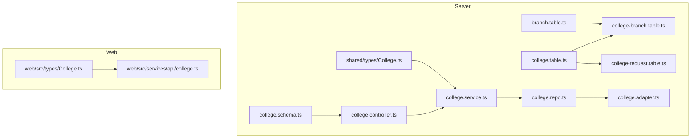
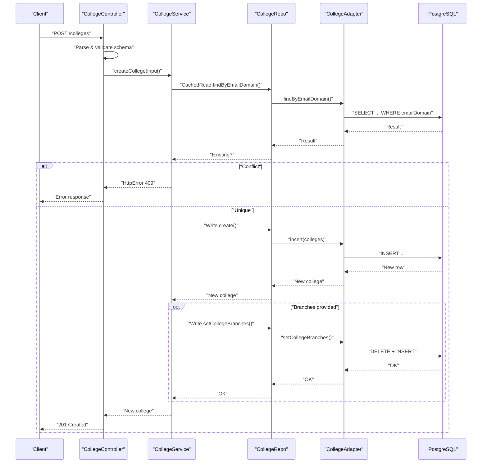
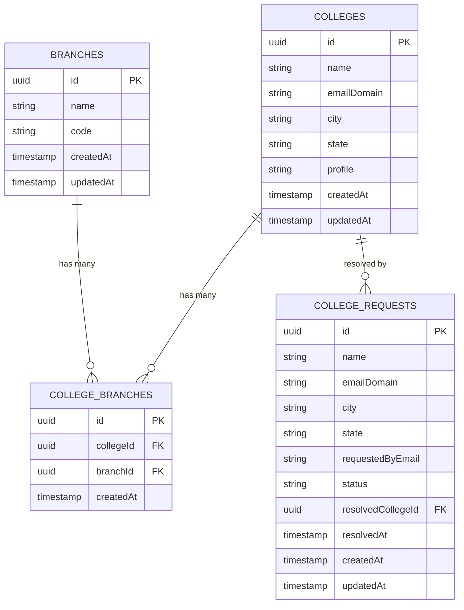
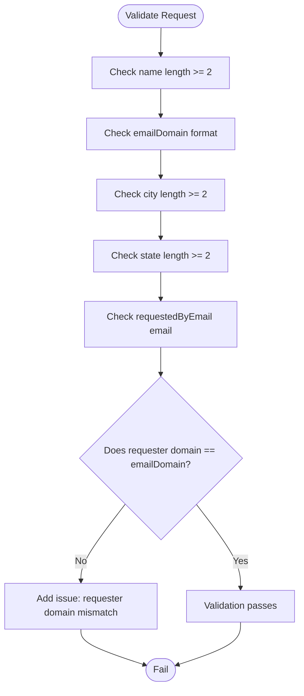
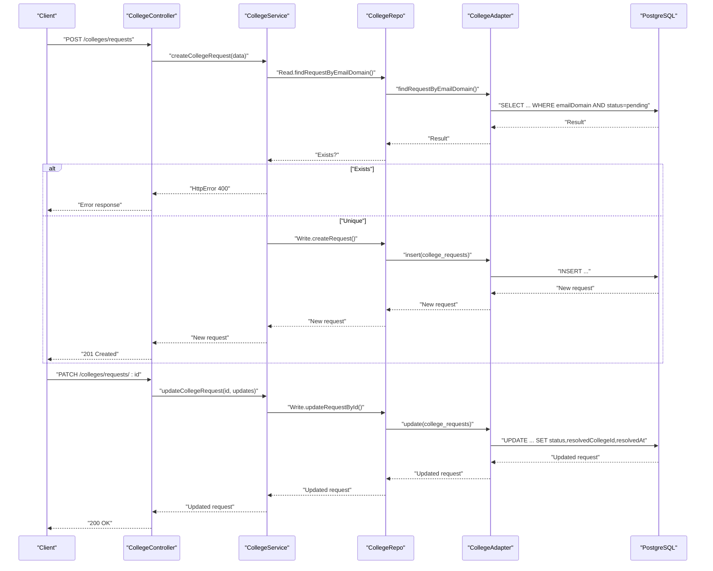
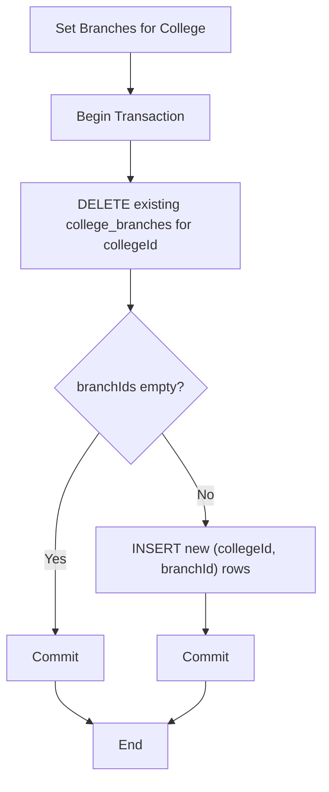
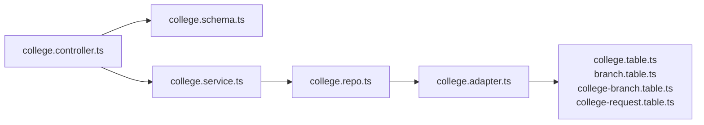

# Institutional Entities

<cite>
**Referenced Files in This Document**
- [college.table.ts](file://server/src/infra/db/tables/college.table.ts)
- [branch.table.ts](file://server/src/infra/db/tables/branch.table.ts)
- [college-branch.table.ts](file://server/src/infra/db/tables/college-branch.table.ts)
- [college-request.table.ts](file://server/src/infra/db/tables/college-request.table.ts)
- [college.schema.ts](file://server/src/modules/college/college.schema.ts)
- [college.service.ts](file://server/src/modules/college/college.service.ts)
- [college.controller.ts](file://server/src/modules/college/college.controller.ts)
- [college.repo.ts](file://server/src/modules/college/college.repo.ts)
- [college.adapter.ts](file://server/src/infra/db/adapters/college.adapter.ts)
- [College.ts](file://server/src/shared/types/College.ts)
- [College.ts](file://web/src/types/College.ts)
- [college.ts](file://web/src/services/api/college.ts)
</cite>

## Table of Contents
1. [Introduction](#introduction)
2. [Project Structure](#project-structure)
3. [Core Components](#core-components)
4. [Architecture Overview](#architecture-overview)
5. [Detailed Component Analysis](#detailed-component-analysis)
6. [Dependency Analysis](#dependency-analysis)
7. [Performance Considerations](#performance-considerations)
8. [Troubleshooting Guide](#troubleshooting-guide)
9. [Conclusion](#conclusion)

## Introduction
This document describes the institutional entity model for colleges and branches, including their relational structure, validation rules, and administrative workflows. It focuses on:
- Hierarchical relationships: colleges and branches, connected via a many-to-many junction table
- Institution metadata and geographic constraints
- Enrollment tracking considerations and access control mechanisms
- The college request workflow and approval process
- Validation rules for institutional data

## Project Structure
The institutional entities are implemented across database tables, schema validations, repositories, adapters, services, controllers, and shared types. The frontend exposes typed interfaces and API clients for colleges.

**Diagram sources**
- [college.table.ts](file://server/src/infra/db/tables/college.table.ts#L1-L24)
- [branch.table.ts](file://server/src/infra/db/tables/branch.table.ts#L1-L17)
- [college-branch.table.ts](file://server/src/infra/db/tables/college-branch.table.ts#L1-L32)
- [college-request.table.ts](file://server/src/infra/db/tables/college-request.table.ts#L1-L26)
- [college.schema.ts](file://server/src/modules/college/college.schema.ts#L1-L67)
- [college.repo.ts](file://server/src/modules/college/college.repo.ts#L1-L54)
- [college.adapter.ts](file://server/src/infra/db/adapters/college.adapter.ts#L1-L253)
- [college.service.ts](file://server/src/modules/college/college.service.ts#L1-L284)
- [college.controller.ts](file://server/src/modules/college/college.controller.ts#L1-L109)
- [College.ts](file://server/src/shared/types/College.ts#L1-L5)
- [College.ts](file://web/src/types/College.ts#L1-L6)
- [college.ts](file://web/src/services/api/college.ts)

**Section sources**
- [college.table.ts](file://server/src/infra/db/tables/college.table.ts#L1-L24)
- [branch.table.ts](file://server/src/infra/db/tables/branch.table.ts#L1-L17)
- [college-branch.table.ts](file://server/src/infra/db/tables/college-branch.table.ts#L1-L32)
- [college-request.table.ts](file://server/src/infra/db/tables/college-request.table.ts#L1-L26)
- [college.schema.ts](file://server/src/modules/college/college.schema.ts#L1-L67)
- [college.service.ts](file://server/src/modules/college/college.service.ts#L1-L284)
- [college.controller.ts](file://server/src/modules/college/college.controller.ts#L1-L109)
- [college.repo.ts](file://server/src/modules/college/college.repo.ts#L1-L54)
- [college.adapter.ts](file://server/src/infra/db/adapters/college.adapter.ts#L1-L253)
- [College.ts](file://server/src/shared/types/College.ts#L1-L5)
- [College.ts](file://web/src/types/College.ts#L1-L6)
- [college.ts](file://web/src/services/api/college.ts)

## Core Components
- Colleges: Core institution entity with metadata and geographic fields
- Branches: Academic or administrative units under colleges
- Junction table: Many-to-many relationship between colleges and branches
- Requests: Administrative workflow to propose new colleges
- Schema validations: Field-level rules and cross-field constraints
- Service layer: Business logic for CRUD, caching, audit, and branch assignment
- Repository and adapter: Data access and transaction boundaries
- Shared types: Strong typing for backend and frontend

**Section sources**
- [college.table.ts](file://server/src/infra/db/tables/college.table.ts#L1-L24)
- [branch.table.ts](file://server/src/infra/db/tables/branch.table.ts#L1-L17)
- [college-branch.table.ts](file://server/src/infra/db/tables/college-branch.table.ts#L1-L32)
- [college-request.table.ts](file://server/src/infra/db/tables/college-request.table.ts#L1-L26)
- [college.schema.ts](file://server/src/modules/college/college.schema.ts#L1-L67)
- [college.service.ts](file://server/src/modules/college/college.service.ts#L1-L284)
- [college.repo.ts](file://server/src/modules/college/college.repo.ts#L1-L54)
- [college.adapter.ts](file://server/src/infra/db/adapters/college.adapter.ts#L1-L253)
- [College.ts](file://server/src/shared/types/College.ts#L1-L5)
- [College.ts](file://web/src/types/College.ts#L1-L6)

## Architecture Overview
The institutional module follows layered architecture:
- Controllers validate and route requests
- Services encapsulate business logic and orchestrate repository operations
- Repositories abstract reads/writes and caching
- Adapters translate typed queries to SQL and manage transactions
- Database tables define schema and constraints

**Diagram sources**
- [college.controller.ts](file://server/src/modules/college/college.controller.ts#L1-L109)
- [college.service.ts](file://server/src/modules/college/college.service.ts#L1-L284)
- [college.repo.ts](file://server/src/modules/college/college.repo.ts#L1-L54)
- [college.adapter.ts](file://server/src/infra/db/adapters/college.adapter.ts#L1-L253)
- [college.table.ts](file://server/src/infra/db/tables/college.table.ts#L1-L24)

## Detailed Component Analysis

### Data Model: Colleges, Branches, and Junction
- Colleges
  - Fields: id, name, emailDomain, city, state, profile, timestamps
  - Constraints: notNull on name, emailDomain, city, state; default profile URL; indexes on name, emailDomain, city+state
- Branches
  - Fields: id, name, code, timestamps
  - Constraints: notNull on name, code; indexes on name, code
- Junction: college_branches
  - Fields: id, collegeId, branchId, createdAt
  - Constraints: foreign keys with cascade deletes; unique index on (collegeId, branchId); indexes on collegeId and branchId
- Requests: college_requests
  - Fields: id, name, emailDomain, city, state, requestedByEmail, status, resolvedCollegeId, resolvedAt, timestamps
  - Constraints: notNull on name, emailDomain, city, state, status; default "pending"; FK to colleges on delete SET NULL; indexes on emailDomain, status

**Diagram sources**
- [college.table.ts](file://server/src/infra/db/tables/college.table.ts#L1-L24)
- [branch.table.ts](file://server/src/infra/db/tables/branch.table.ts#L1-L17)
- [college-branch.table.ts](file://server/src/infra/db/tables/college-branch.table.ts#L1-L32)
- [college-request.table.ts](file://server/src/infra/db/tables/college-request.table.ts#L1-L26)

**Section sources**
- [college.table.ts](file://server/src/infra/db/tables/college.table.ts#L1-L24)
- [branch.table.ts](file://server/src/infra/db/tables/branch.table.ts#L1-L17)
- [college-branch.table.ts](file://server/src/infra/db/tables/college-branch.table.ts#L1-L32)
- [college-request.table.ts](file://server/src/infra/db/tables/college-request.table.ts#L1-L26)

### Validation Rules and Geographic Constraints
- Create/Update College
  - name: required, min length enforced
  - emailDomain: required, validated as a domain-like string
  - city/state: required, min length enforced
  - profile: optional URL
  - branches: optional array of UUIDs
- Create College Request
  - name, city, state: minimum lengths enforced
  - emailDomain: required, domain format validated
  - requestedByEmail: required email
  - Cross-field constraint: requester email domain must match the requested emailDomain
- Update College Request
  - status: enum of pending, approved, rejected
  - resolvedCollegeId: optional UUID when approved/rejected

**Diagram sources**
- [college.schema.ts](file://server/src/modules/college/college.schema.ts#L37-L61)

**Section sources**
- [college.schema.ts](file://server/src/modules/college/college.schema.ts#L1-L67)

### Access Control Mechanisms
- Authentication and authorization are handled by the shared auth layer and RBAC utilities. While not detailed here, the college module participates in the broader authorization framework used across the platform.
- Audit logging records administrative actions on colleges, including creation, updates, and deletions.

**Section sources**
- [college.service.ts](file://server/src/modules/college/college.service.ts#L63-L69)
- [college.service.ts](file://server/src/modules/college/college.service.ts#L235-L242)

### Enrollment Tracking Considerations
- The schema does not include explicit enrollment counts or capacity fields. If enrollment metrics are required, consider adding fields such as totalStudents, fullTimeStudents, partTimeStudents, or similar, along with appropriate indexes and constraints.

### College Request Workflow and Approval
- Submission: Submit a request with name, emailDomain, city, state, and requestedByEmail
- Duplicate prevention: Prevents creating a request if a pending request exists for the same emailDomain
- Approval/rejection: Update request status to approved or rejected; optionally link to an existing college via resolvedCollegeId
- Status lifecycle: pending -> approved or rejected; resolvedAt auto-populated on last status change

**Diagram sources**
- [college.controller.ts](file://server/src/modules/college/college.controller.ts#L59-L86)
- [college.service.ts](file://server/src/modules/college/college.service.ts#L120-L181)
- [college.adapter.ts](file://server/src/infra/db/adapters/college.adapter.ts#L203-L252)
- [college-request.table.ts](file://server/src/infra/db/tables/college-request.table.ts#L1-L26)

**Section sources**
- [college.controller.ts](file://server/src/modules/college/college.controller.ts#L59-L86)
- [college.service.ts](file://server/src/modules/college/college.service.ts#L120-L181)
- [college.adapter.ts](file://server/src/infra/db/adapters/college.adapter.ts#L203-L252)
- [college-request.table.ts](file://server/src/infra/db/tables/college-request.table.ts#L1-L26)

### Branch Assignment and Many-to-Many Relationship
- Branch assignment is managed via setCollegeBranches, which replaces existing assignments within a transaction
- Retrieval returns branch IDs per college; adapter joins to fetch branch details when needed
- Unique constraint prevents duplicate college-branch pairs

**Diagram sources**
- [college.adapter.ts](file://server/src/infra/db/adapters/college.adapter.ts#L181-L201)
- [college-branch.table.ts](file://server/src/infra/db/tables/college-branch.table.ts#L1-L32)

**Section sources**
- [college.adapter.ts](file://server/src/infra/db/adapters/college.adapter.ts#L181-L201)
- [college-branch.table.ts](file://server/src/infra/db/tables/college-branch.table.ts#L1-L32)

### Frontend Types and API Exposure
- Backend shared type defines insert/select shapes for colleges
- Web types define a simplified interface for UI consumption
- Web API service exposes college endpoints for listing, retrieving, and managing colleges

**Section sources**
- [College.ts](file://server/src/shared/types/College.ts#L1-L5)
- [College.ts](file://web/src/types/College.ts#L1-L6)
- [college.ts](file://web/src/services/api/college.ts)

## Dependency Analysis
- Controllers depend on Zod schemas for validation
- Services depend on repositories for data access and adapters for SQL operations
- Repositories wrap adapter calls with caching keys
- Adapters encapsulate Drizzle ORM queries and transactions
- Tables define schema and constraints; junction table enforces many-to-many semantics

**Diagram sources**
- [college.controller.ts](file://server/src/modules/college/college.controller.ts#L1-L109)
- [college.schema.ts](file://server/src/modules/college/college.schema.ts#L1-L67)
- [college.service.ts](file://server/src/modules/college/college.service.ts#L1-L284)
- [college.repo.ts](file://server/src/modules/college/college.repo.ts#L1-L54)
- [college.adapter.ts](file://server/src/infra/db/adapters/college.adapter.ts#L1-L253)
- [college.table.ts](file://server/src/infra/db/tables/college.table.ts#L1-L24)
- [branch.table.ts](file://server/src/infra/db/tables/branch.table.ts#L1-L17)
- [college-branch.table.ts](file://server/src/infra/db/tables/college-branch.table.ts#L1-L32)
- [college-request.table.ts](file://server/src/infra/db/tables/college-request.table.ts#L1-L26)

**Section sources**
- [college.controller.ts](file://server/src/modules/college/college.controller.ts#L1-L109)
- [college.service.ts](file://server/src/modules/college/college.service.ts#L1-L284)
- [college.repo.ts](file://server/src/modules/college/college.repo.ts#L1-L54)
- [college.adapter.ts](file://server/src/infra/db/adapters/college.adapter.ts#L1-L253)
- [college.table.ts](file://server/src/infra/db/tables/college.table.ts#L1-L24)
- [branch.table.ts](file://server/src/infra/db/tables/branch.table.ts#L1-L17)
- [college-branch.table.ts](file://server/src/infra/db/tables/college-branch.table.ts#L1-L32)
- [college-request.table.ts](file://server/src/infra/db/tables/college-request.table.ts#L1-L26)

## Performance Considerations
- Indexes on frequently filtered fields (name, emailDomain, city+state for colleges; name, code for branches; emailDomain, status for requests) improve query performance
- Caching wrappers around repository reads reduce repeated database hits for college listings and details
- Batched inserts for branch assignments minimize round-trips during updates
- Consider adding composite indexes for common filter combinations (e.g., city+state) to further optimize queries

## Troubleshooting Guide
- Duplicate emailDomain on create/update college: Conflict error indicating an existing college with the same domain
- College not found: Not found errors when fetching or updating non-existent colleges
- Pending request exists: Prevents duplicate pending requests for the same emailDomain
- Domain mismatch in requests: Validation fails when requester email domain differs from requested emailDomain
- Branch assignment failures: Ensure branch IDs are valid UUIDs and exist in branches table

**Section sources**
- [college.service.ts](file://server/src/modules/college/college.service.ts#L34-L46)
- [college.service.ts](file://server/src/modules/college/college.service.ts#L94-L98)
- [college.service.ts](file://server/src/modules/college/college.service.ts#L137-L141)
- [college.schema.ts](file://server/src/modules/college/college.schema.ts#L50-L61)
- [college.adapter.ts](file://server/src/infra/db/adapters/college.adapter.ts#L151-L201)

## Conclusion
The institutional entity model establishes a robust foundation for colleges and branches with strong validation, clear many-to-many relationships, and a structured request workflow. Extending the model with enrollment metrics and refining access controls will further strengthen operational capabilities.