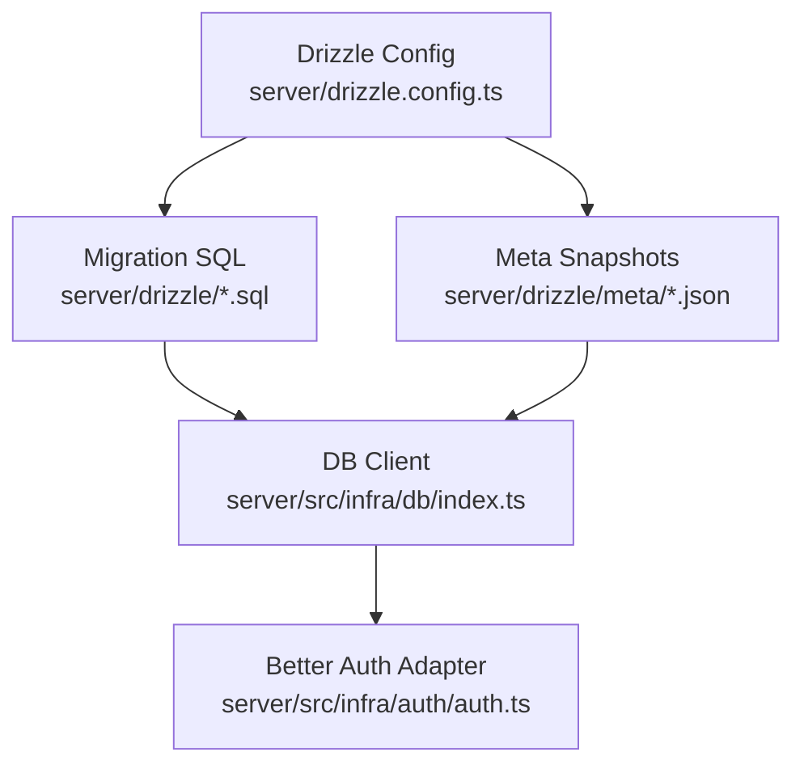
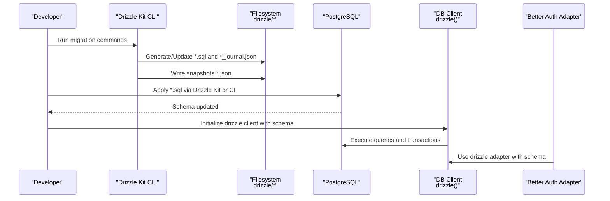
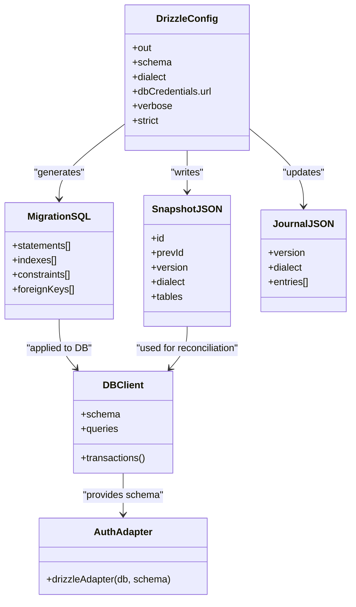
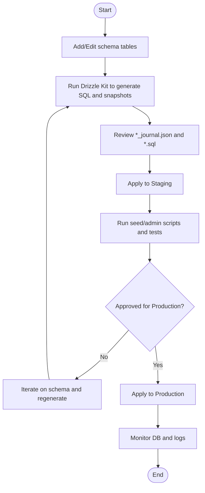
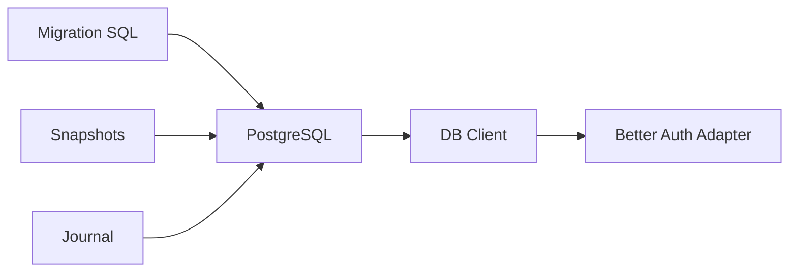

# Migrations and Schema Evolution

<cite>
**Referenced Files in This Document**
- [drizzle.config.ts](file://server/drizzle.config.ts)
- [_journal.json](file://server/drizzle/meta/_journal.json)
- [0000_loose_edwin_jarvis.sql](file://server/drizzle/0000_loose_edwin_jarvis.sql)
- [0001_flat_mathemanic.sql](file://server/drizzle/0001_flat_mathemanic.sql)
- [0002_perfect_drax.sql](file://server/drizzle/0002_perfect_drax.sql)
- [0003_flat_reptil.sql](file://server/drizzle/0003_flat_reptil.sql)
- [0004_brisk_harrier.sql](file://server/drizzle/0004_brisk_harrier.sql)
- [0005_superb_ken_ellis.sql](file://server/drizzle/0005_superb_ken_ellis.sql)
- [0000_snapshot.json](file://server/drizzle/meta/0000_snapshot.json)
- [0001_snapshot.json](file://server/drizzle/meta/0001_snapshot.json)
- [0002_snapshot.json](file://server/drizzle/meta/0002_snapshot.json)
- [0003_snapshot.json](file://server/drizzle/meta/0003_snapshot.json)
- [0005_snapshot.json](file://server/drizzle/meta/0005_snapshot.json)
- [db index.ts](file://server/src/infra/db/index.ts)
- [db types.ts](file://server/src/infra/db/types.ts)
- [seed.ts](file://server/scripts/seed.ts)
- [create-admin.ts](file://server/scripts/create-admin.ts)
- [auth.ts](file://server/src/infra/auth/auth.ts)
- [transactions.ts](file://server/src/infra/db/transactions.ts)
</cite>

## Table of Contents
1. [Introduction](#introduction)
2. [Project Structure](#project-structure)
3. [Core Components](#core-components)
4. [Architecture Overview](#architecture-overview)
5. [Detailed Component Analysis](#detailed-component-analysis)
6. [Dependency Analysis](#dependency-analysis)
7. [Performance Considerations](#performance-considerations)
8. [Troubleshooting Guide](#troubleshooting-guide)
9. [Conclusion](#conclusion)

## Introduction
This document explains how Flick manages database migrations and schema evolution using Drizzle ORM. It covers the migration workflow from development to production, rollback strategies, data preservation techniques, and the relationship between migration SQL files and database snapshots. It also provides best practices for schema changes, backward compatibility, zero-downtime deployments, and troubleshooting guidance for migration failures and conflicts.

## Project Structure
Flick’s migration system is organized under the server/drizzle directory:
- drizzle.config.ts defines the Drizzle Kit configuration, pointing to the schema location and database credentials.
- The drizzle/ directory contains numbered migration SQL files (e.g., 0000_loose_edwin_jarvis.sql).
- The drizzle/meta/ directory contains JSON snapshots and a journal file (_journal.json) that tracks migration history and metadata.

**Diagram sources**
- [drizzle.config.ts](file://server/drizzle.config.ts#L1-L14)
- [_journal.json](file://server/drizzle/meta/_journal.json#L1-L49)
- [0000_loose_edwin_jarvis.sql](file://server/drizzle/0000_loose_edwin_jarvis.sql#L1-L247)
- [db index.ts](file://server/src/infra/db/index.ts#L1-L40)
- [auth.ts](file://server/src/infra/auth/auth.ts#L1-L20)

**Section sources**
- [drizzle.config.ts](file://server/drizzle.config.ts#L1-L14)
- [db index.ts](file://server/src/infra/db/index.ts#L1-L40)

## Core Components
- Drizzle Kit configuration: Defines schema path, output directory, dialect, and credentials.
- Migration SQL files: Idempotent SQL statements representing incremental schema changes.
- Snapshots: JSON representations of the database schema at each migration stage.
- Journal: Tracks migration entries, timestamps, and tags.
- DB client: Drizzle client initialized with the schema for runtime queries and transactions.
- Better Auth adapter: Integrates authentication tables with the Drizzle schema.

Key responsibilities:
- Drizzle Kit generates and updates migration SQL and snapshots.
- The DB client loads the schema and executes queries.
- Transactions ensure atomicity for write operations.

**Section sources**
- [drizzle.config.ts](file://server/drizzle.config.ts#L1-L14)
- [0000_loose_edwin_jarvis.sql](file://server/drizzle/0000_loose_edwin_jarvis.sql#L1-L247)
- [0000_snapshot.json](file://server/drizzle/meta/0000_snapshot.json#L1-L1844)
- [_journal.json](file://server/drizzle/meta/_journal.json#L1-L49)
- [db index.ts](file://server/src/infra/db/index.ts#L1-L40)
- [auth.ts](file://server/src/infra/auth/auth.ts#L1-L20)

## Architecture Overview
The migration lifecycle connects Drizzle Kit, migration SQL, snapshots, and the runtime DB client.

**Diagram sources**
- [drizzle.config.ts](file://server/drizzle.config.ts#L1-L14)
- [0000_loose_edwin_jarvis.sql](file://server/drizzle/0000_loose_edwin_jarvis.sql#L1-L247)
- [_journal.json](file://server/drizzle/meta/_journal.json#L1-L49)
- [db index.ts](file://server/src/infra/db/index.ts#L1-L40)
- [auth.ts](file://server/src/infra/auth/auth.ts#L1-L20)

## Detailed Component Analysis

### Drizzle Kit Configuration
- Output path and schema glob are configured.
- Dialect is PostgreSQL.
- Credentials are loaded from environment variables.
- Verbose and strict modes are enabled for safety.

Operational impact:
- Ensures consistent generation of SQL and snapshots.
- Enforces schema parity between code and DB.

**Section sources**
- [drizzle.config.ts](file://server/drizzle.config.ts#L1-L14)

### Migration SQL Files
Each numbered SQL file encapsulates a single migration step:
- Creates types and tables.
- Adds indexes and constraints.
- Establishes foreign keys.
- Includes comments indicating statement boundaries.

Implications:
- Idempotency is implied by Drizzle Kit’s design.
- Rollbacks are typically handled by generating new migrations rather than deleting SQL.

**Section sources**
- [0000_loose_edwin_jarvis.sql](file://server/drizzle/0000_loose_edwin_jarvis.sql#L1-L247)
- [0001_flat_mathemanic.sql](file://server/drizzle/0001_flat_mathemanic.sql#L1-L200)
- [0002_perfect_drax.sql](file://server/drizzle/0002_perfect_drax.sql#L1-L200)
- [0003_flat_reptil.sql](file://server/drizzle/0003_flat_reptil.sql#L1-L200)
- [0004_brisk_harrier.sql](file://server/drizzle/0004_brisk_harrier.sql#L1-L200)
- [0005_superb_ken_ellis.sql](file://server/drizzle/0005_superb_ken_ellis.sql#L1-L200)

### Snapshots and Journal
- Snapshots encode the schema state at each migration index.
- The journal records ordered migration entries with timestamps and tags.
- These artifacts enable Drizzle Kit to reconcile schema drift and plan migrations.

Relationship:
- Snapshots represent the “source of truth” for schema shape at each step.
- Journal ensures deterministic replay order.

**Section sources**
- [0000_snapshot.json](file://server/drizzle/meta/0000_snapshot.json#L1-L1844)
- [0001_snapshot.json](file://server/drizzle/meta/0001_snapshot.json#L1-L200)
- [0002_snapshot.json](file://server/drizzle/meta/0002_snapshot.json#L1-L200)
- [0003_snapshot.json](file://server/drizzle/meta/0003_snapshot.json#L1-L200)
- [0005_snapshot.json](file://server/drizzle/meta/0005_snapshot.json#L1-L200)
- [_journal.json](file://server/drizzle/meta/_journal.json#L1-L49)

### Runtime DB Client and Transactions
- The DB client initializes with the schema and exposes typed tables.
- Transactions are managed via a helper that reuses an existing parent transaction or starts a new one.

Best practices:
- Wrap write-heavy operations in transactions.
- Use the provided transaction helper to avoid leaks and ensure atomicity.

**Section sources**
- [db index.ts](file://server/src/infra/db/index.ts#L1-L40)
- [db types.ts](file://server/src/infra/db/types.ts#L1-L11)
- [transactions.ts](file://server/src/infra/db/transactions.ts#L1-L19)

### Authentication Schema Integration
- Better Auth adapter uses the Drizzle schema to persist auth-related entities.
- This ensures consistent schema evolution across auth and application tables.

**Section sources**
- [auth.ts](file://server/src/infra/auth/auth.ts#L1-L20)

### Seed and Admin Scripts
- Seed script creates a default college and test users using the schema-defined tables.
- Admin creation script ensures an admin user exists with verified email and admin role.

These scripts demonstrate runtime usage of the schema and can be used to validate migrations in staging environments.

**Section sources**
- [seed.ts](file://server/scripts/seed.ts#L1-L109)
- [create-admin.ts](file://server/scripts/create-admin.ts#L1-L39)

## Architecture Overview

**Diagram sources**
- [drizzle.config.ts](file://server/drizzle.config.ts#L1-L14)
- [0000_loose_edwin_jarvis.sql](file://server/drizzle/0000_loose_edwin_jarvis.sql#L1-L247)
- [0000_snapshot.json](file://server/drizzle/meta/0000_snapshot.json#L1-L1844)
- [_journal.json](file://server/drizzle/meta/_journal.json#L1-L49)
- [db index.ts](file://server/src/infra/db/index.ts#L1-L40)
- [auth.ts](file://server/src/infra/auth/auth.ts#L1-L20)

## Detailed Component Analysis

### Migration Workflow: Development to Production
- Author schema changes in TypeScript tables under the schema path.
- Run Drizzle Kit commands to generate SQL and update snapshots/journal.
- Commit migration files and snapshots to version control.
- Apply migrations to staging, then production.
- Verify with seed/admin scripts and tests.

[No sources needed since this diagram shows conceptual workflow, not actual code structure]

### Rollback Procedures
- Prefer forward-compatible migrations and additive schema changes.
- If necessary, generate a new migration that undoes specific changes rather than deleting prior SQL.
- Use snapshots and journal to confirm the target state before applying corrective migrations.

[No sources needed since this section provides general guidance]

### Data Preservation Techniques
- Avoid destructive operations (e.g., DROP COLUMN without careful planning).
- Use nullable columns and defaults during schema evolution.
- Add indexes/constraints in separate migrations to minimize lock duration.
- Validate with seed/admin scripts after applying migrations.

[No sources needed since this section provides general guidance]

### Relationship Between Migration Files and Snapshots
- Each migration SQL corresponds to a snapshot that captures the schema state after that migration.
- The journal maintains the order and metadata of applied migrations.
- Drizzle Kit uses this relationship to reconcile differences and plan future migrations.

**Section sources**
- [_journal.json](file://server/drizzle/meta/_journal.json#L1-L49)
- [0000_loose_edwin_jarvis.sql](file://server/drizzle/0000_loose_edwin_jarvis.sql#L1-L247)
- [0000_snapshot.json](file://server/drizzle/meta/0000_snapshot.json#L1-L1844)

### Best Practices for Schema Changes
- Keep migrations small and focused.
- Maintain backward compatibility where possible.
- Use enums and constraints to enforce data integrity.
- Add indexes for frequently queried columns.
- Use transactions for multi-table writes.

[No sources needed since this section provides general guidance]

### Zero-Downtime Deployment Strategies
- Use online schema change techniques supported by PostgreSQL (e.g., concurrent index builds).
- Batch changes to reduce maintenance windows.
- Validate schema changes in staging with realistic data volumes.
- Use blue/green deployments with schema migrations coordinated with traffic switching.

[No sources needed since this section provides general guidance]

## Dependency Analysis
The runtime DB client depends on the schema defined in the migration system. Better Auth integrates with this schema to persist authentication data.

**Diagram sources**
- [0000_loose_edwin_jarvis.sql](file://server/drizzle/0000_loose_edwin_jarvis.sql#L1-L247)
- [0000_snapshot.json](file://server/drizzle/meta/0000_snapshot.json#L1-L1844)
- [_journal.json](file://server/drizzle/meta/_journal.json#L1-L49)
- [db index.ts](file://server/src/infra/db/index.ts#L1-L40)
- [auth.ts](file://server/src/infra/auth/auth.ts#L1-L20)

**Section sources**
- [db index.ts](file://server/src/infra/db/index.ts#L1-L40)
- [auth.ts](file://server/src/infra/auth/auth.ts#L1-L20)

## Performance Considerations
- Keep migrations minimal to reduce downtime.
- Use partial indexes and appropriate data types to optimize queries.
- Avoid long-running migrations during peak hours.
- Monitor index creation concurrency and lock contention.

[No sources needed since this section provides general guidance]

## Troubleshooting Guide
Common issues and resolutions:
- Migration fails due to constraint conflicts:
  - Inspect the journal and snapshots to identify the offending migration.
  - Generate a corrective migration that adjusts schema to satisfy constraints.
- Snapshot mismatch:
  - Re-run Drizzle Kit to regenerate snapshots and SQL.
  - Ensure environment variables (DATABASE_URL) are consistent across environments.
- Transaction errors:
  - Wrap operations in the provided transaction helper to ensure atomicity.
- Auth adapter errors:
  - Confirm the schema includes auth tables and indexes referenced by Better Auth.

Validation steps:
- Apply migrations to a staging replica.
- Run seed and admin scripts to validate schema usage.
- Monitor DB logs for constraint violations or lock timeouts.

**Section sources**
- [_journal.json](file://server/drizzle/meta/_journal.json#L1-L49)
- [seed.ts](file://server/scripts/seed.ts#L1-L109)
- [create-admin.ts](file://server/scripts/create-admin.ts#L1-L39)
- [transactions.ts](file://server/src/infra/db/transactions.ts#L1-L19)

## Conclusion
Flick’s migration system leverages Drizzle Kit to maintain a clear, versioned history of schema changes. By combining migration SQL, snapshots, and a journal, teams can safely evolve the database while preserving data and enabling reproducible environments. Adhering to best practices for schema changes, using transactions, and validating with seed/admin scripts ensures reliable deployments from development to production.