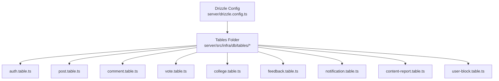
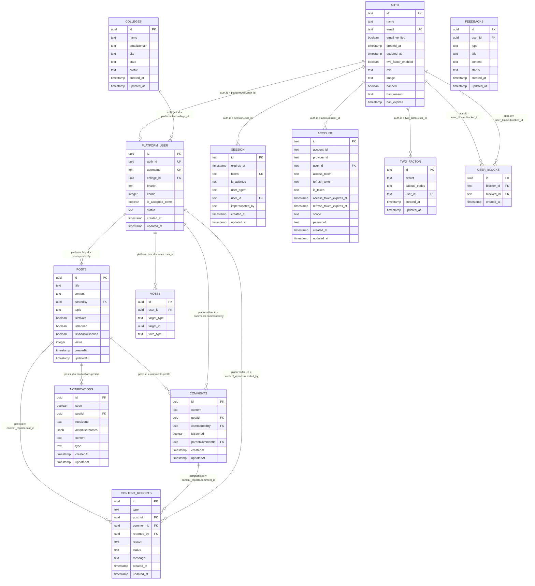
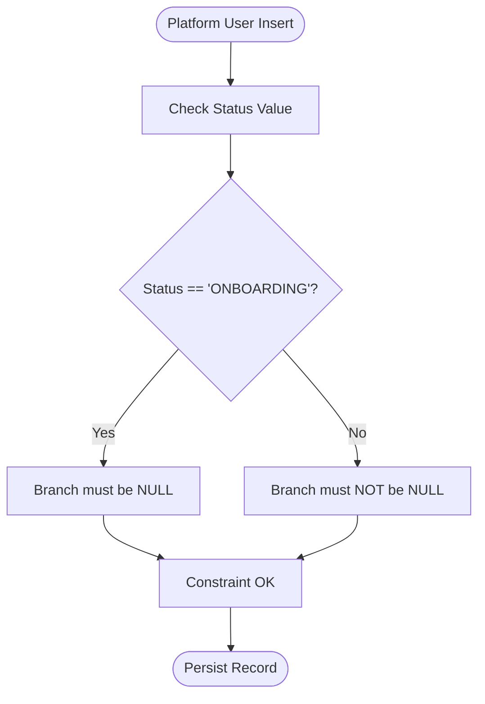
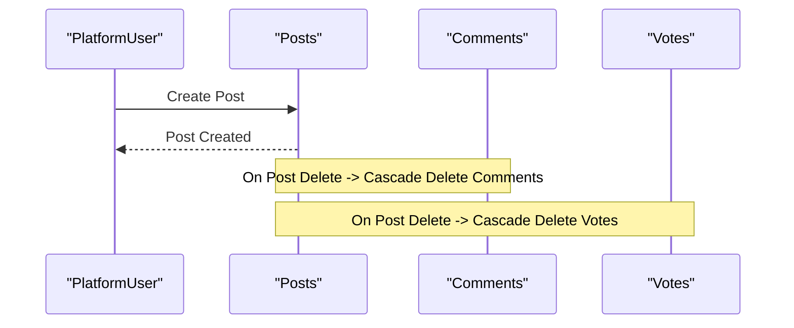
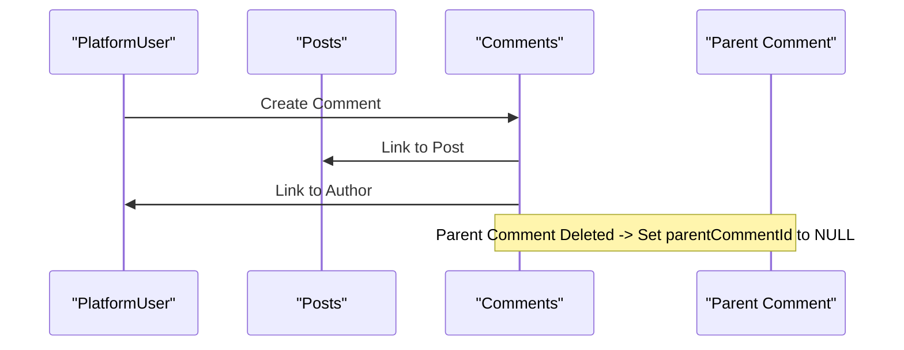
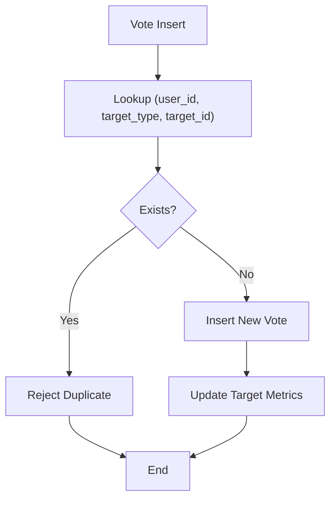
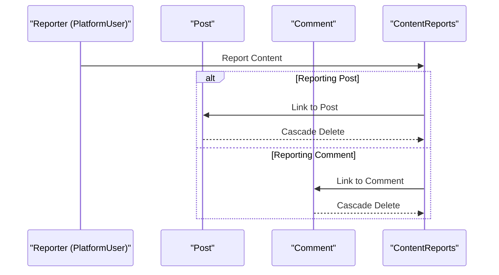
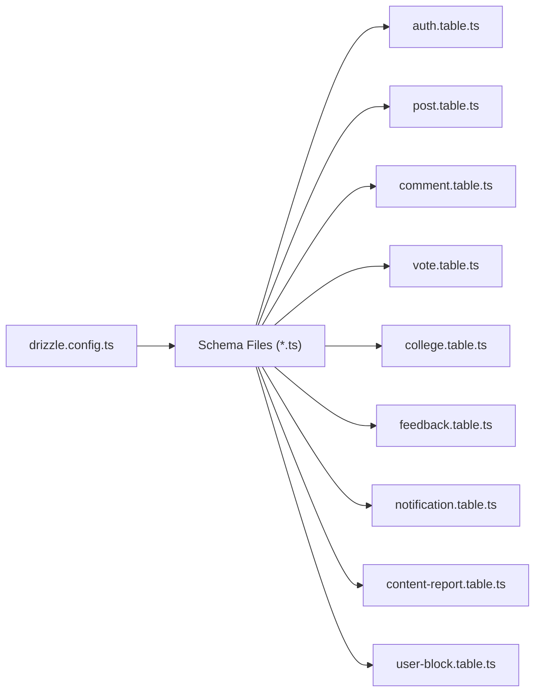

# Relationships and Constraints

<cite>
**Referenced Files in This Document**
- [drizzle.config.ts](file://server/drizzle.config.ts)
- [auth.table.ts](file://server/src/infra/db/tables/auth.table.ts)
- [post.table.ts](file://server/src/infra/db/tables/post.table.ts)
- [comment.table.ts](file://server/src/infra/db/tables/comment.table.ts)
- [vote.table.ts](file://server/src/infra/db/tables/vote.table.ts)
- [college.table.ts](file://server/src/infra/db/tables/college.table.ts)
- [feedback.table.ts](file://server/src/infra/db/tables/feedback.table.ts)
- [notification.table.ts](file://server/src/infra/db/tables/notification.table.ts)
- [content-report.table.ts](file://server/src/infra/db/tables/content-report.table.ts)
- [user-block.table.ts](file://server/src/infra/db/tables/user-block.table.ts)
</cite>

## Table of Contents
1. [Introduction](#introduction)
2. [Project Structure](#project-structure)
3. [Core Components](#core-components)
4. [Architecture Overview](#architecture-overview)
5. [Detailed Component Analysis](#detailed-component-analysis)
6. [Dependency Analysis](#dependency-analysis)
7. [Performance Considerations](#performance-considerations)
8. [Troubleshooting Guide](#troubleshooting-guide)
9. [Conclusion](#conclusion)

## Introduction
This document explains the database relationships, foreign key constraints, referential integrity rules, and validation constraints across Flick’s entities. It details parent-child relationships, many-to-many associations, cascade behaviors, enum definitions, indexing strategies, and query optimization patterns. It also covers constraint violation scenarios and approaches to maintain data consistency.

## Project Structure
The database schema is defined using Drizzle ORM with PostgreSQL dialect. The schema is split into individual table definitions under a dedicated folder and configured via a central configuration file.

**Diagram sources**
- [drizzle.config.ts](file://server/drizzle.config.ts#L1-L14)
- [auth.table.ts](file://server/src/infra/db/tables/auth.table.ts#L1-L187)
- [post.table.ts](file://server/src/infra/db/tables/post.table.ts#L1-L39)
- [comment.table.ts](file://server/src/infra/db/tables/comment.table.ts#L1-L22)
- [vote.table.ts](file://server/src/infra/db/tables/vote.table.ts#L1-L33)
- [college.table.ts](file://server/src/infra/db/tables/college.table.ts#L1-L24)
- [feedback.table.ts](file://server/src/infra/db/tables/feedback.table.ts#L1-L26)
- [notification.table.ts](file://server/src/infra/db/tables/notification.table.ts#L1-L30)
- [content-report.table.ts](file://server/src/infra/db/tables/content-report.table.ts#L1-L26)
- [user-block.table.ts](file://server/src/infra/db/tables/user-block.table.ts#L1-L40)

**Section sources**
- [drizzle.config.ts](file://server/drizzle.config.ts#L1-L14)

## Core Components
- Entities and primary keys are defined as UUIDs for most tables, except where noted.
- Foreign keys enforce referential integrity with explicit cascade behaviors.
- Unique constraints prevent duplicates for critical identifiers.
- Check constraints enforce business rules at the database level.
- Indexes optimize frequent queries by visibility, lookups, and uniqueness.

Key constraints and behaviors:
- Cascade deletes on user deletion propagate to related records (sessions, accounts, two-factor records, posts, comments, votes, content reports).
- Set null on parent deletion for hierarchical comments.
- Unique indexes on composite keys for votes and user blocks.
- Partial constraints ensuring consistent user status and branch assignment.

**Section sources**
- [auth.table.ts](file://server/src/infra/db/tables/auth.table.ts#L14-L187)
- [post.table.ts](file://server/src/infra/db/tables/post.table.ts#L13-L39)
- [comment.table.ts](file://server/src/infra/db/tables/comment.table.ts#L5-L22)
- [vote.table.ts](file://server/src/infra/db/tables/vote.table.ts#L6-L33)
- [college.table.ts](file://server/src/infra/db/tables/college.table.ts#L3-L24)
- [feedback.table.ts](file://server/src/infra/db/tables/feedback.table.ts#L4-L26)
- [notification.table.ts](file://server/src/infra/db/tables/notification.table.ts#L12-L30)
- [content-report.table.ts](file://server/src/infra/db/tables/content-report.table.ts#L7-L26)
- [user-block.table.ts](file://server/src/infra/db/tables/user-block.table.ts#L11-L40)

## Architecture Overview
The schema centers around an authentication and user model, with posts, comments, votes, feedback, notifications, content reports, and colleges. Relationships are primarily parent-child with a few many-to-one and many-to-many-like constructs enforced by unique constraints.

**Diagram sources**
- [auth.table.ts](file://server/src/infra/db/tables/auth.table.ts#L14-L187)
- [post.table.ts](file://server/src/infra/db/tables/post.table.ts#L13-L39)
- [comment.table.ts](file://server/src/infra/db/tables/comment.table.ts#L5-L22)
- [vote.table.ts](file://server/src/infra/db/tables/vote.table.ts#L6-L33)
- [college.table.ts](file://server/src/infra/db/tables/college.table.ts#L3-L24)
- [feedback.table.ts](file://server/src/infra/db/tables/feedback.table.ts#L4-L26)
- [notification.table.ts](file://server/src/infra/db/tables/notification.table.ts#L12-L30)
- [content-report.table.ts](file://server/src/infra/db/tables/content-report.table.ts#L7-L26)
- [user-block.table.ts](file://server/src/infra/db/tables/user-block.table.ts#L11-L40)

## Detailed Component Analysis

### Authentication and User Model
- Primary identity is stored in the AUTH table with unique email and timestamps.
- PLATFORM_USER links to AUTH via a unique foreign key, ensuring one user per auth record.
- Unique username and unique authId constraints enforce identity integrity.
- CASCADE DELETE from AUTH to SESSION, ACCOUNT, and TWO_FACTOR ensures cleanup on user removal.
- PLATFORM_USER references COLLEGES with CASCADE DELETE to keep college membership consistent.
- CHECK constraint enforces that branch is null only when status equals ONBOARDING; otherwise branch must be present.

**Diagram sources**
- [auth.table.ts](file://server/src/infra/db/tables/auth.table.ts#L61-L67)

**Section sources**
- [auth.table.ts](file://server/src/infra/db/tables/auth.table.ts#L14-L187)

### Posts
- Posts belong to a single user (postedBy) with CASCADE DELETE to remove dependent comments and votes.
- Topic is an enum; visibility flags support shadow/banning policies.
- Visibility index accelerates queries filtering by ban/shadow ban and creation time.

**Diagram sources**
- [post.table.ts](file://server/src/infra/db/tables/post.table.ts#L19-L21)
- [comment.table.ts](file://server/src/infra/db/tables/comment.table.ts#L10)
- [vote.table.ts](file://server/src/infra/db/tables/vote.table.ts#L13)

**Section sources**
- [post.table.ts](file://server/src/infra/db/tables/post.table.ts#L13-L39)

### Comments
- Comments belong to a post and a user; both foreign keys use CASCADE DELETE.
- Hierarchical comments supported via parentCommentId with SET NULL on parent delete.
- isBanned flag supports moderation.

**Diagram sources**
- [comment.table.ts](file://server/src/infra/db/tables/comment.table.ts#L8-L17)

**Section sources**
- [comment.table.ts](file://server/src/infra/db/tables/comment.table.ts#L5-L22)

### Votes
- Many-to-one relationship per target type and target ID.
- Composite unique index prevents duplicate votes per user per target.
- Target lookup index optimizes queries by target type and target ID.

**Diagram sources**
- [vote.table.ts](file://server/src/infra/db/tables/vote.table.ts#L21-L28)

**Section sources**
- [vote.table.ts](file://server/src/infra/db/tables/vote.table.ts#L6-L33)

### Colleges
- Unique indexes on name, email domain, and city/state improve search performance.
- Profile defaults to a CDN URL for consistency.

**Section sources**
- [college.table.ts](file://server/src/infra/db/tables/college.table.ts#L3-L24)

### Feedback
- Optional user association allows anonymous feedback submission.
- userId uses SET NULL on user deletion to preserve feedback records.

**Section sources**
- [feedback.table.ts](file://server/src/infra/db/tables/feedback.table.ts#L4-L26)

### Notifications
- ReceiverId is not constrained to a specific type; JSON array stores actor usernames.
- Optional postId link to posts; nullable to support general notifications.

**Section sources**
- [notification.table.ts](file://server/src/infra/db/tables/notification.table.ts#L12-L30)

### Content Reports
- Supports reporting either posts or comments via separate foreign keys.
- CASCADE DELETE ensures reports are removed when target content is deleted.
- Composite unique index on reporter and target avoids duplicate reports.

**Diagram sources**
- [content-report.table.ts](file://server/src/infra/db/tables/content-report.table.ts#L10-L16)

**Section sources**
- [content-report.table.ts](file://server/src/infra/db/tables/content-report.table.ts#L7-L26)

### User Blocks
- Self-referencing user blocks enforced by two foreign keys to AUTH.
- Composite unique index prevents duplicate block entries.

**Section sources**
- [user-block.table.ts](file://server/src/infra/db/tables/user-block.table.ts#L11-L40)

## Dependency Analysis
- Drizzle configuration defines the schema location and PostgreSQL dialect.
- Table definitions import enums and other tables to establish relationships.
- Relations are declared via Drizzle’s relations helper to mirror foreign keys and enable typed joins.

**Diagram sources**
- [drizzle.config.ts](file://server/drizzle.config.ts#L1-L14)
- [auth.table.ts](file://server/src/infra/db/tables/auth.table.ts#L1-L187)
- [post.table.ts](file://server/src/infra/db/tables/post.table.ts#L1-L39)
- [comment.table.ts](file://server/src/infra/db/tables/comment.table.ts#L1-L22)
- [vote.table.ts](file://server/src/infra/db/tables/vote.table.ts#L1-L33)
- [college.table.ts](file://server/src/infra/db/tables/college.table.ts#L1-L24)
- [feedback.table.ts](file://server/src/infra/db/tables/feedback.table.ts#L1-L26)
- [notification.table.ts](file://server/src/infra/db/tables/notification.table.ts#L1-L30)
- [content-report.table.ts](file://server/src/infra/db/tables/content-report.table.ts#L1-L26)
- [user-block.table.ts](file://server/src/infra/db/tables/user-block.table.ts#L1-L40)

**Section sources**
- [drizzle.config.ts](file://server/drizzle.config.ts#L1-L14)

## Performance Considerations
- Visibility index on posts accelerates filtered retrieval by ban/shadow ban and creation time.
- Session/account/two-factor indices on user_id improve auth-related lookups.
- Two-factor indices on secret and user_id support secure retrieval and uniqueness checks.
- Composite unique index on votes prevents duplicates and speeds up conflict detection.
- Composite unique index on user blocks prevents duplicate blocking pairs.
- Multi-column indexes on colleges (name, email domain, city/state) optimize search and filtering.

[No sources needed since this section provides general guidance]

## Troubleshooting Guide
Common constraint violations and resolutions:
- Duplicate vote per user per target: The unique index prevents inserting a second vote for the same user-target combination. Resolve by updating the existing vote or removing it before re-inserting.
- Blocked user attempting to create content: If a user is blocked, ensure the block relationship is enforced at application level to prevent writes; database constraints alone rely on foreign keys.
- Deleting a post removes comments and votes: If dependent records must persist, adjust cascade behavior or soft-delete strategy at the application layer.
- Deleting a user cascades to sessions/accounts/two-factor: If audit trails require preservation, implement soft-delete or archival before hard deletion.
- Status and branch consistency: If a user’s status is not ONBOARDING, branch must be set; otherwise insertion/update will fail the check constraint.

**Section sources**
- [vote.table.ts](file://server/src/infra/db/tables/vote.table.ts#L21-L28)
- [user-block.table.ts](file://server/src/infra/db/tables/user-block.table.ts#L23-L25)
- [auth.table.ts](file://server/src/infra/db/tables/auth.table.ts#L61-L67)

## Conclusion
Flick’s schema enforces strong referential integrity with targeted cascade behaviors, unique constraints, and check constraints. Indexes are strategically placed to support common queries. Adhering to these constraints and leveraging the documented cascade rules helps maintain data consistency and enables efficient query patterns.