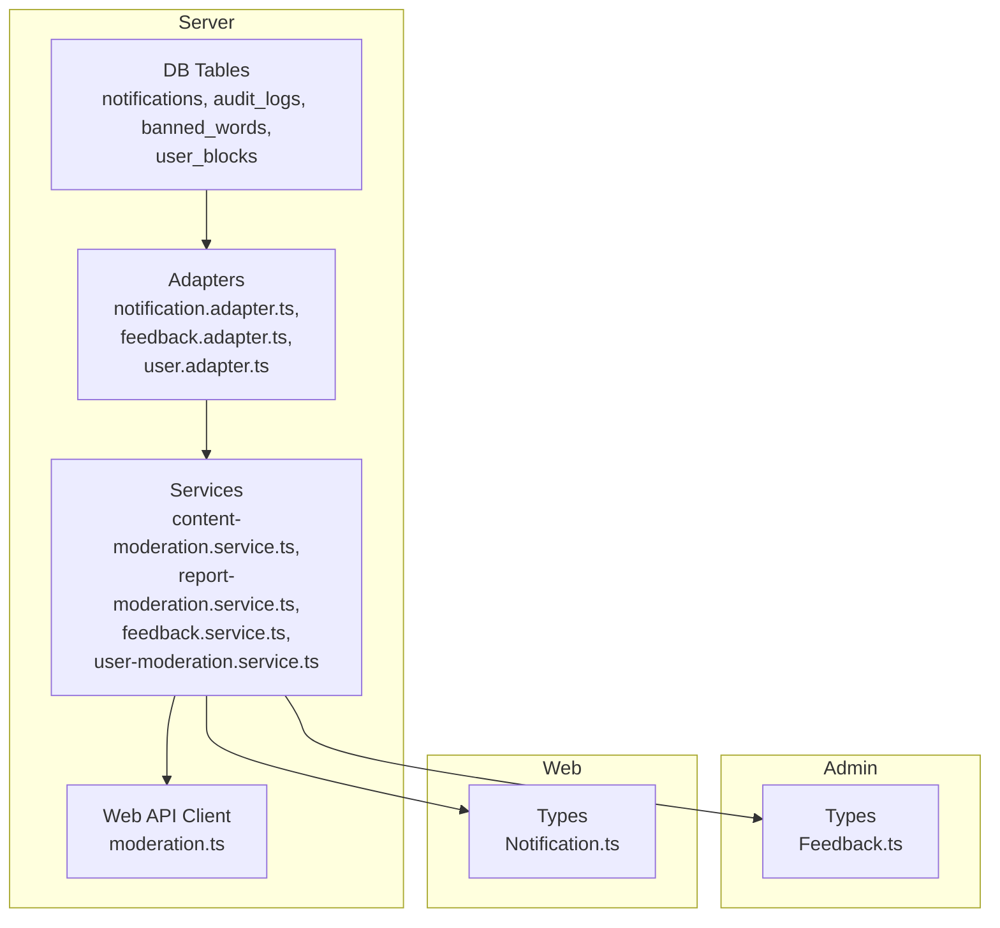
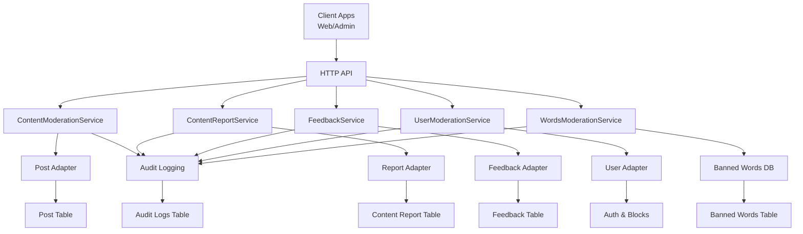
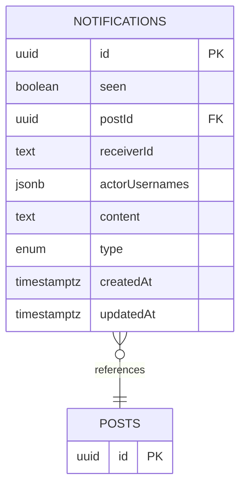
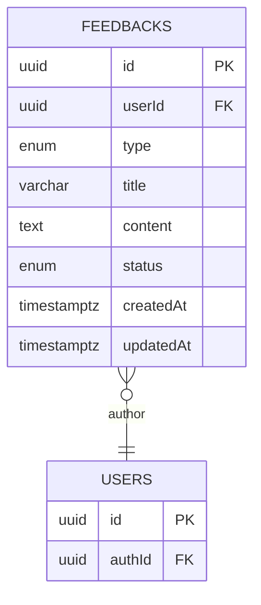
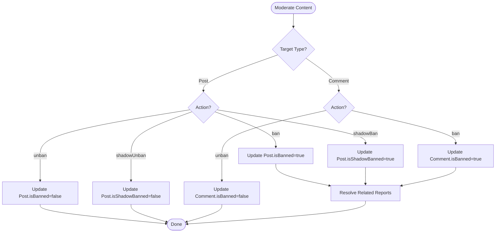
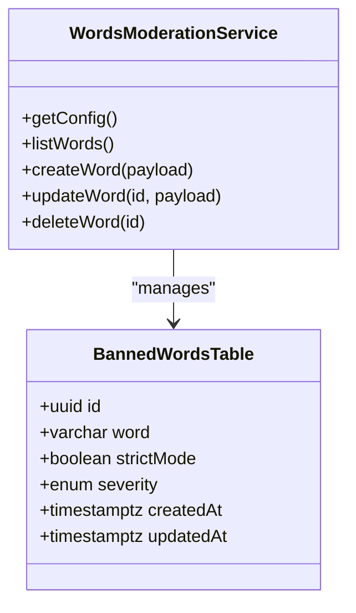
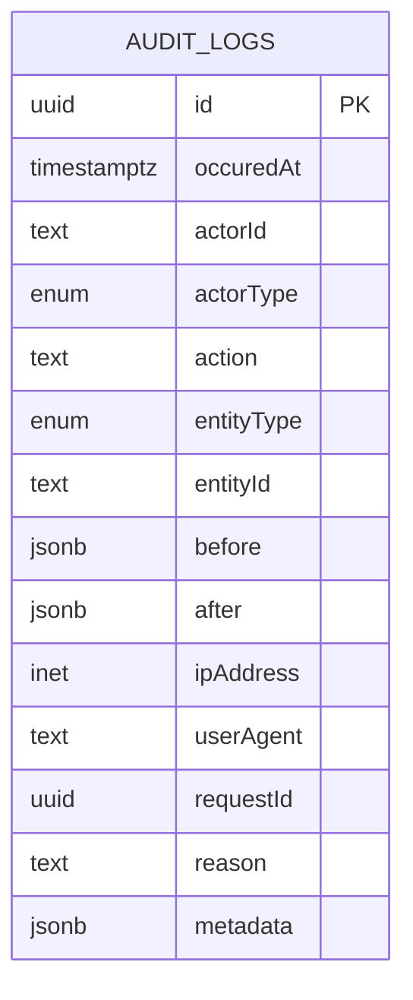
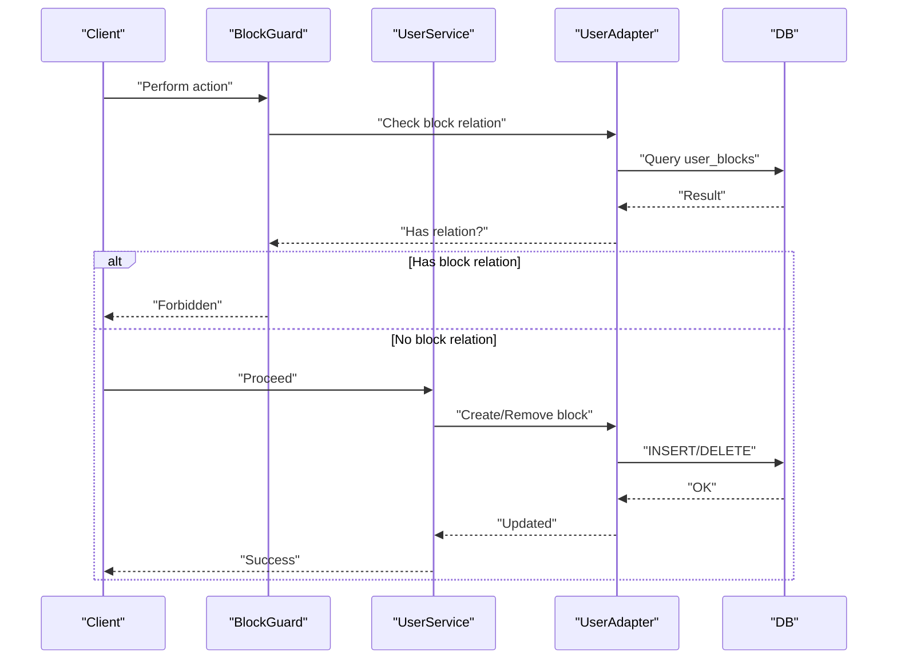
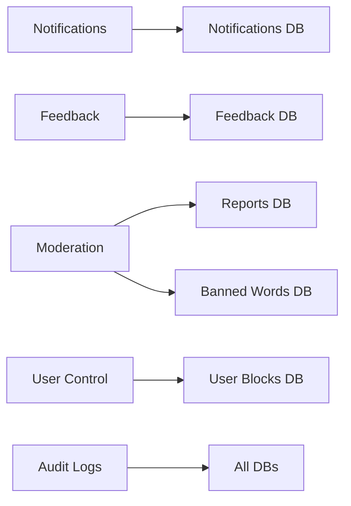

# System Entities

<cite>
**Referenced Files in This Document**
- [notification.table.ts](file://server/src/infra/db/tables/notification.table.ts)
- [notification.adapter.ts](file://server/src/infra/db/adapters/notification.adapter.ts)
- [Notification.ts](file://web/src/types/Notification.ts)
- [feedback.schema.ts](file://server/src/modules/feedback/feedback.schema.ts)
- [feedback.adapter.ts](file://server/src/infra/db/adapters/feedback.adapter.ts)
- [feedback.service.ts](file://server/src/modules/feedback/feedback.service.ts)
- [Feedback.ts](file://admin/src/types/Feedback.ts)
- [content-moderation.service.ts](file://server/src/modules/moderation/content/content-moderation.service.ts)
- [report-moderation.service.ts](file://server/src/modules/moderation/reports/report-moderation.service.ts)
- [words-moderation.service.ts](file://server/src/modules/moderation/words/words-moderation.service.ts)
- [banned-word.table.ts](file://server/src/infra/db/tables/banned-word.table.ts)
- [audit-log.table.ts](file://server/src/infra/db/tables/audit-log.table.ts)
- [user.adapter.ts](file://server/src/infra/db/adapters/user.adapter.ts)
- [user.service.ts](file://server/src/modules/user/user.service.ts)
- [block.guard.ts](file://server/src/modules/user/block.guard.ts)
- [user-block.table.ts](file://server/src/infra/db/tables/user-block.table.ts)
- [user-moderation.service.ts](file://server/src/modules/moderation/user/user-moderation.service.ts)
- [moderation.ts](file://web/src/services/api/moderation.ts)
- [0003_snapshot.json](file://server/drizzle/meta/0003_snapshot.json)
- [0005_snapshot.json](file://server/drizzle/meta/0005_snapshot.json)
</cite>

## Table of Contents
1. [Introduction](#introduction)
2. [Project Structure](#project-structure)
3. [Core Components](#core-components)
4. [Architecture Overview](#architecture-overview)
5. [Detailed Component Analysis](#detailed-component-analysis)
6. [Dependency Analysis](#dependency-analysis)
7. [Performance Considerations](#performance-considerations)
8. [Troubleshooting Guide](#troubleshooting-guide)
9. [Conclusion](#conclusion)

## Introduction
This document defines the data models and operational flows for system-level entities involved in notifications, feedback, content moderation, auditing, and user blocking. It explains how moderation actions relate to user permissions, documents field definitions for system logs, moderation queues, and administrative controls, and outlines notification delivery mechanisms and feedback collection workflows.

## Project Structure
The relevant system entities are implemented across:
- Database tables and adapters (server/src/infra/db/tables and adapters)
- Domain services (server/src/modules)
- Frontend types and API clients (web/admin)
- Drizzle migrations and snapshots (server/drizzle/meta)

**Diagram sources**
- [notification.table.ts](file://server/src/infra/db/tables/notification.table.ts#L1-L30)
- [audit-log.table.ts](file://server/src/infra/db/tables/audit-log.table.ts#L1-L76)
- [banned-word.table.ts](file://server/src/infra/db/tables/banned-word.table.ts#L1-L26)
- [user-block.table.ts](file://server/src/infra/db/tables/user-block.table.ts#L1-L39)
- [notification.adapter.ts](file://server/src/infra/db/adapters/notification.adapter.ts#L61-L83)
- [feedback.adapter.ts](file://server/src/infra/db/adapters/feedback.adapter.ts#L59-L187)
- [user.adapter.ts](file://server/src/infra/db/adapters/user.adapter.ts#L423-L536)
- [content-moderation.service.ts](file://server/src/modules/moderation/content/content-moderation.service.ts#L1-L252)
- [report-moderation.service.ts](file://server/src/modules/moderation/reports/report-moderation.service.ts#L1-L177)
- [feedback.service.ts](file://server/src/modules/feedback/feedback.service.ts#L95-L146)
- [user-moderation.service.ts](file://server/src/modules/moderation/user/user-moderation.service.ts#L1-L50)
- [moderation.ts](file://web/src/services/api/moderation.ts#L1-L7)
- [Feedback.ts](file://admin/src/types/Feedback.ts#L1-L13)
- [Notification.ts](file://web/src/types/Notification.ts#L1-L21)

**Section sources**
- [notification.table.ts](file://server/src/infra/db/tables/notification.table.ts#L1-L30)
- [audit-log.table.ts](file://server/src/infra/db/tables/audit-log.table.ts#L1-L76)
- [banned-word.table.ts](file://server/src/infra/db/tables/banned-word.table.ts#L1-L26)
- [user-block.table.ts](file://server/src/infra/db/tables/user-block.table.ts#L1-L39)
- [notification.adapter.ts](file://server/src/infra/db/adapters/notification.adapter.ts#L61-L83)
- [feedback.adapter.ts](file://server/src/infra/db/adapters/feedback.adapter.ts#L59-L187)
- [user.adapter.ts](file://server/src/infra/db/adapters/user.adapter.ts#L423-L536)
- [content-moderation.service.ts](file://server/src/modules/moderation/content/content-moderation.service.ts#L1-L252)
- [report-moderation.service.ts](file://server/src/modules/moderation/reports/report-moderation.service.ts#L1-L177)
- [feedback.service.ts](file://server/src/modules/feedback/feedback.service.ts#L95-L146)
- [user-moderation.service.ts](file://server/src/modules/moderation/user/user-moderation.service.ts#L1-L50)
- [moderation.ts](file://web/src/services/api/moderation.ts#L1-L7)
- [Feedback.ts](file://admin/src/types/Feedback.ts#L1-L13)
- [Notification.ts](file://web/src/types/Notification.ts#L1-L21)

## Core Components
- Notifications: stored with type, recipients, actors, and optional post linkage; persisted via adapter and consumed by web/admin.
- Feedback: structured with type and status; validated via schema; persisted via adapter; audited on updates/deletes.
- Content Moderation: actions to ban/unban and shadow-ban posts/comments; integrates with reports resolution.
- Banned Words: managed with severity and strictness; triggers matcher rebuilds.
- Auditing: centralized audit log schema with indexes; services record changes and events.
- User Blocking: block/unblock/suspend flows; guard prevents interactions between blocked users; block relations tracked in user_blocks.

**Section sources**
- [notification.table.ts](file://server/src/infra/db/tables/notification.table.ts#L1-L30)
- [notification.adapter.ts](file://server/src/infra/db/adapters/notification.adapter.ts#L61-L83)
- [Notification.ts](file://web/src/types/Notification.ts#L1-L21)
- [feedback.schema.ts](file://server/src/modules/feedback/feedback.schema.ts#L1-L35)
- [feedback.adapter.ts](file://server/src/infra/db/adapters/feedback.adapter.ts#L59-L187)
- [feedback.service.ts](file://server/src/modules/feedback/feedback.service.ts#L95-L146)
- [content-moderation.service.ts](file://server/src/modules/moderation/content/content-moderation.service.ts#L211-L251)
- [report-moderation.service.ts](file://server/src/modules/moderation/reports/report-moderation.service.ts#L106-L144)
- [words-moderation.service.ts](file://server/src/modules/moderation/words/words-moderation.service.ts#L13-L62)
- [banned-word.table.ts](file://server/src/infra/db/tables/banned-word.table.ts#L1-L26)
- [audit-log.table.ts](file://server/src/infra/db/tables/audit-log.table.ts#L40-L76)
- [user.adapter.ts](file://server/src/infra/db/adapters/user.adapter.ts#L323-L379)
- [user.adapter.ts](file://server/src/infra/db/adapters/user.adapter.ts#L423-L536)
- [user.service.ts](file://server/src/modules/user/user.service.ts#L96-L136)
- [block.guard.ts](file://server/src/modules/user/block.guard.ts#L5-L40)
- [user-block.table.ts](file://server/src/infra/db/tables/user-block.table.ts#L1-L39)
- [user-moderation.service.ts](file://server/src/modules/moderation/user/user-moderation.service.ts#L7-L41)

## Architecture Overview
The moderation and user-control subsystems integrate with database adapters and domain services, emitting audit records and supporting admin and user workflows.

**Diagram sources**
- [content-moderation.service.ts](file://server/src/modules/moderation/content/content-moderation.service.ts#L1-L252)
- [report-moderation.service.ts](file://server/src/modules/moderation/reports/report-moderation.service.ts#L1-L177)
- [feedback.service.ts](file://server/src/modules/feedback/feedback.service.ts#L95-L146)
- [user-moderation.service.ts](file://server/src/modules/moderation/user/user-moderation.service.ts#L1-L50)
- [words-moderation.service.ts](file://server/src/modules/moderation/words/words-moderation.service.ts#L1-L66)
- [notification.adapter.ts](file://server/src/infra/db/adapters/notification.adapter.ts#L61-L83)
- [feedback.adapter.ts](file://server/src/infra/db/adapters/feedback.adapter.ts#L59-L187)
- [user.adapter.ts](file://server/src/infra/db/adapters/user.adapter.ts#L423-L536)
- [audit-log.table.ts](file://server/src/infra/db/tables/audit-log.table.ts#L40-L76)
- [notification.table.ts](file://server/src/infra/db/tables/notification.table.ts#L1-L30)
- [banned-word.table.ts](file://server/src/infra/db/tables/banned-word.table.ts#L1-L26)
- [user-block.table.ts](file://server/src/infra/db/tables/user-block.table.ts#L1-L39)

## Detailed Component Analysis

### Notifications
- Purpose: Deliver contextual activity notifications to users (e.g., upvotes, replies, posts).
- Data model: See [notification.table.ts](file://server/src/infra/db/tables/notification.table.ts#L12-L29).
- Fields:
  - id: UUID primary key
  - seen: boolean flag
  - postId: optional foreign key to posts
  - receiverId: text identifier of recipient
  - actorUsernames: JSON array of usernames
  - content: optional text
  - type: enumeration with defaults
  - createdAt/updatedAt: timestamps
- Delivery mechanism:
  - Web/admin consume notifications via adapter queries and typed interfaces.
  - Adapter supports creation and retrieval by receiverId.
  - Frontend types define shape and optional post linkage.

**Diagram sources**
- [notification.table.ts](file://server/src/infra/db/tables/notification.table.ts#L12-L29)

**Section sources**
- [notification.table.ts](file://server/src/infra/db/tables/notification.table.ts#L12-L29)
- [notification.adapter.ts](file://server/src/infra/db/adapters/notification.adapter.ts#L61-L83)
- [Notification.ts](file://web/src/types/Notification.ts#L10-L21)

### Feedback
- Purpose: Collect user feedback/bugs/features with status tracking.
- Data model: Feedback table and adapter define fields and operations.
- Validation: Zod schemas enforce constraints on create/update/list queries.
- Workflows:
  - Admin lists and filters feedback.
  - Status updates are audited.
  - Deletions are recorded in audit logs.

**Diagram sources**
- [feedback.adapter.ts](file://server/src/infra/db/adapters/feedback.adapter.ts#L59-L118)
- [feedback.schema.ts](file://server/src/modules/feedback/feedback.schema.ts#L3-L35)

**Section sources**
- [feedback.schema.ts](file://server/src/modules/feedback/feedback.schema.ts#L1-L35)
- [feedback.adapter.ts](file://server/src/infra/db/adapters/feedback.adapter.ts#L59-L187)
- [feedback.service.ts](file://server/src/modules/feedback/feedback.service.ts#L95-L146)
- [Feedback.ts](file://admin/src/types/Feedback.ts#L1-L13)

### Content Moderation
- Purpose: Enforce content safety by banning/unbanning posts/comments and shadow-banning posts.
- Actions:
  - banPost/unbanPost
  - shadowBanPost/shadowUnbanPost
  - banComment/unbanComment
- Integration:
  - On ban/shadow-ban, related reports are marked resolved.
  - Errors and successes are logged; operations are audited indirectly via report updates.

**Diagram sources**
- [content-moderation.service.ts](file://server/src/modules/moderation/content/content-moderation.service.ts#L8-L248)
- [report-moderation.service.ts](file://server/src/modules/moderation/reports/report-moderation.service.ts#L125-L144)

**Section sources**
- [content-moderation.service.ts](file://server/src/modules/moderation/content/content-moderation.service.ts#L211-L251)
- [report-moderation.service.ts](file://server/src/modules/moderation/reports/report-moderation.service.ts#L106-L144)

### Banned Word Management
- Purpose: Maintain a dictionary of prohibited terms with severity and strictness.
- Operations:
  - List, create, update, delete banned words.
  - Rebuild internal matcher after changes to ensure real-time enforcement.

**Diagram sources**
- [words-moderation.service.ts](file://server/src/modules/moderation/words/words-moderation.service.ts#L12-L66)
- [banned-word.table.ts](file://server/src/infra/db/tables/banned-word.table.ts#L11-L25)

**Section sources**
- [words-moderation.service.ts](file://server/src/modules/moderation/words/words-moderation.service.ts#L13-L62)
- [banned-word.table.ts](file://server/src/infra/db/tables/banned-word.table.ts#L11-L25)

### Auditing
- Purpose: Record who did what, when, and with what impact.
- Schema: Centralized audit logs with actor, action, entity, IP, user-agent, request correlation, reason, and metadata.
- Indexes: Entity, actor, and timestamp indexes for efficient querying.
- Usage: Services record changes and events; moderation actions trigger audit entries.

**Diagram sources**
- [audit-log.table.ts](file://server/src/infra/db/tables/audit-log.table.ts#L40-L76)
- [0005_snapshot.json](file://server/drizzle/meta/0005_snapshot.json#L49-L150)

**Section sources**
- [audit-log.table.ts](file://server/src/infra/db/tables/audit-log.table.ts#L40-L76)
- [0005_snapshot.json](file://server/drizzle/meta/0005_snapshot.json#L49-L150)
- [report-moderation.service.ts](file://server/src/modules/moderation/reports/report-moderation.service.ts#L33-L43)
- [feedback.service.ts](file://server/src/modules/feedback/feedback.service.ts#L122-L128)

### User Blocking and Permissions
- Purpose: Prevent interactions between users; support block/unblock/suspend.
- Data model: user_blocks table maintains bidirectional block relations.
- Guards: Middleware checks for block relations before allowing actions.
- Operations:
  - Block/unblock user via user adapter and service.
  - Suspend user with reason and expiry.
  - Retrieve blocked users and check relations.

**Diagram sources**
- [block.guard.ts](file://server/src/modules/user/block.guard.ts#L5-L40)
- [user.service.ts](file://server/src/modules/user/user.service.ts#L96-L136)
- [user.adapter.ts](file://server/src/infra/db/adapters/user.adapter.ts#L423-L536)
- [user-block.table.ts](file://server/src/infra/db/tables/user-block.table.ts#L11-L26)

**Section sources**
- [user-block.table.ts](file://server/src/infra/db/tables/user-block.table.ts#L11-L26)
- [block.guard.ts](file://server/src/modules/user/block.guard.ts#L5-L40)
- [user.service.ts](file://server/src/modules/user/user.service.ts#L96-L136)
- [user.adapter.ts](file://server/src/infra/db/adapters/user.adapter.ts#L323-L379)
- [user.adapter.ts](file://server/src/infra/db/adapters/user.adapter.ts#L423-L536)
- [user-moderation.service.ts](file://server/src/modules/moderation/user/user-moderation.service.ts#L7-L41)

## Dependency Analysis
- Notification delivery depends on:
  - Adapter retrieval by receiverId
  - Frontend types for rendering
- Feedback depends on:
  - Zod schemas for validation
  - Adapters for persistence
  - Audit logging for state changes
- Moderation depends on:
  - Report resolution on content bans
  - Audit logging for actions
  - Banned word management for matcher updates
- User blocking depends on:
  - user_blocks table
  - block guard middleware
  - user adapter CRUD

**Diagram sources**
- [notification.adapter.ts](file://server/src/infra/db/adapters/notification.adapter.ts#L61-L83)
- [feedback.adapter.ts](file://server/src/infra/db/adapters/feedback.adapter.ts#L59-L187)
- [report-moderation.service.ts](file://server/src/modules/moderation/reports/report-moderation.service.ts#L125-L144)
- [banned-word.table.ts](file://server/src/infra/db/tables/banned-word.table.ts#L11-L25)
- [user-block.table.ts](file://server/src/infra/db/tables/user-block.table.ts#L11-L26)
- [audit-log.table.ts](file://server/src/infra/db/tables/audit-log.table.ts#L40-L76)

**Section sources**
- [notification.adapter.ts](file://server/src/infra/db/adapters/notification.adapter.ts#L61-L83)
- [feedback.adapter.ts](file://server/src/infra/db/adapters/feedback.adapter.ts#L59-L187)
- [report-moderation.service.ts](file://server/src/modules/moderation/reports/report-moderation.service.ts#L125-L144)
- [banned-word.table.ts](file://server/src/infra/db/tables/banned-word.table.ts#L11-L25)
- [user-block.table.ts](file://server/src/infra/db/tables/user-block.table.ts#L11-L26)
- [audit-log.table.ts](file://server/src/infra/db/tables/audit-log.table.ts#L40-L76)

## Performance Considerations
- Prefer filtered queries with indexed columns (e.g., notifications by receiverId, audit logs by entity/actor/timestamp).
- Batch operations for report deletions and moderation updates to reduce round-trips.
- Cache-friendly feedback listing with versioned keys to minimize repeated scans.
- Limit notification fan-out to necessary recipients to avoid excessive writes.

## Troubleshooting Guide
- Notifications not appearing:
  - Verify receiverId filtering and createdAt ordering in adapter.
  - Confirm frontend types align with backend schema.
- Feedback status not updating:
  - Check audit recording on status change and cache invalidation.
- Reports stuck unresolved:
  - Ensure moderation actions call report resolution.
- User interactions failing:
  - Confirm block guard logic and user_blocks relations.
- Audit gaps:
  - Validate indexes and ensure recordAudit is invoked on state changes.

**Section sources**
- [notification.adapter.ts](file://server/src/infra/db/adapters/notification.adapter.ts#L61-L83)
- [feedback.service.ts](file://server/src/modules/feedback/feedback.service.ts#L122-L128)
- [report-moderation.service.ts](file://server/src/modules/moderation/reports/report-moderation.service.ts#L125-L144)
- [block.guard.ts](file://server/src/modules/user/block.guard.ts#L5-L40)
- [audit-log.table.ts](file://server/src/infra/db/tables/audit-log.table.ts#L67-L71)

## Conclusion
The system’s moderation and control surfaces are built around well-defined data models and service-layer workflows. Notifications, feedback, content moderation, banned word management, auditing, and user blocking are integrated through adapters and services, with clear audit trails and permission guards ensuring safe and traceable operations.