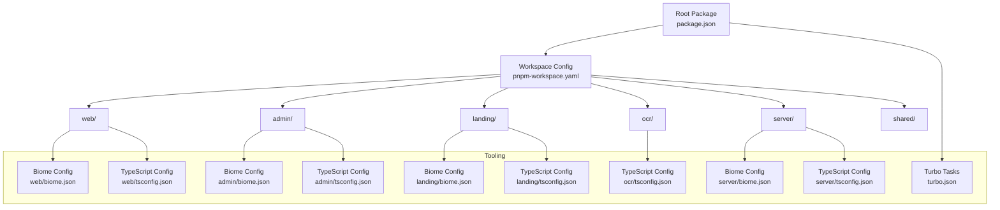
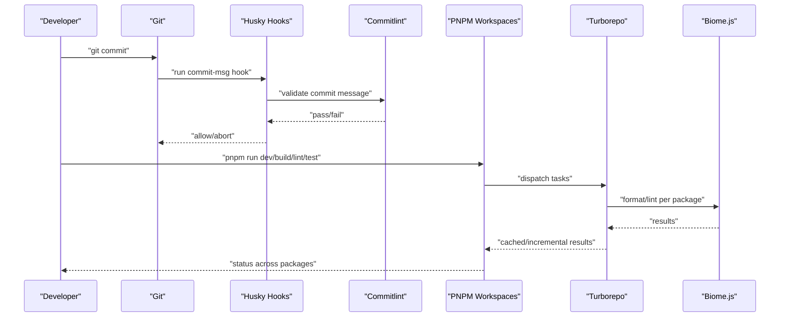
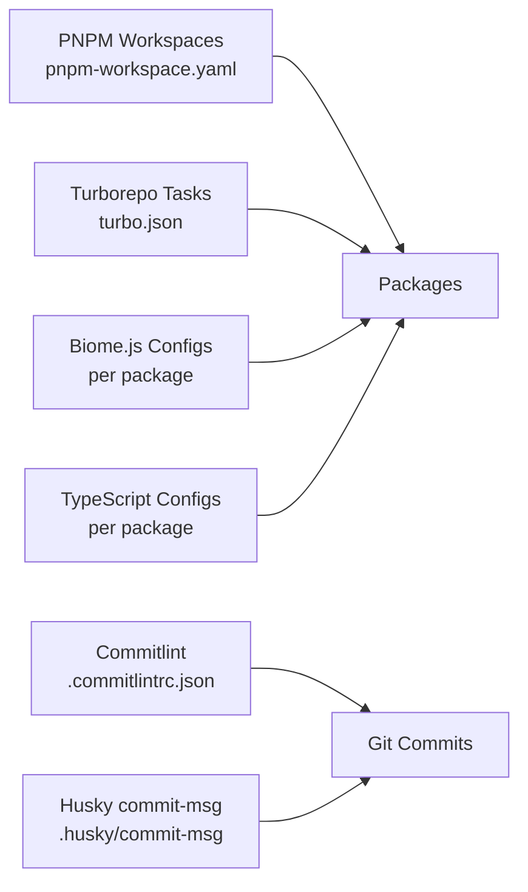

# Development Guidelines

<cite>
**Referenced Files in This Document**
- [package.json](file://package.json)
- [pnpm-workspace.yaml](file://pnpm-workspace.yaml)
- [turbo.json](file://turbo.json)
- [.commitlintrc.json](file://.commitlintrc.json)
- [.npmrc](file://.npmrc)
- [.nvmrc](file://.nvmrc)
- [admin/biome.json](file://admin/biome.json)
- [landing/biome.json](file://landing/biome.json)
- [server/biome.json](file://server/biome.json)
- [web/biome.json](file://web/biome.json)
- [web/tsconfig.json](file://web/tsconfig.json)
- [server/tsconfig.json](file://server/tsconfig.json)
- [admin/tsconfig.json](file://admin/tsconfig.json)
- [landing/tsconfig.json](file://landing/tsconfig.json)
- [ocr/tsconfig.json](file://ocr/tsconfig.json)
- [.github/workflows/ci.yml](file://.github/workflows/ci.yml)
- [.husky/commit-msg](file://.husky/commit-msg)
</cite>

## Table of Contents
1. [Introduction](#introduction)
2. [Project Structure](#project-structure)
3. [Core Components](#core-components)
4. [Architecture Overview](#architecture-overview)
5. [Detailed Component Analysis](#detailed-component-analysis)
6. [Dependency Analysis](#dependency-analysis)
7. [Performance Considerations](#performance-considerations)
8. [Troubleshooting Guide](#troubleshooting-guide)
9. [Conclusion](#conclusion)
10. [Appendices](#appendices)

## Introduction
This document provides comprehensive development guidelines for the Flick monorepo. It covers code style standards using Biome.js, TypeScript configuration, monorepo development practices, commit conventions, pre-commit hooks, task orchestration with Turbo, package management with PNPM, testing strategies, debugging techniques, and contribution guidelines to maintain consistency across packages.

## Project Structure
The repository is a PNPM-managed monorepo containing multiple packages:
- Web application (Next.js)
- Admin dashboard (Next.js)
- Landing page (Next.js)
- OCR service (Node.js)
- Server (Node.js)
- Shared library

Workspace configuration defines the packages and explicitly lists built dependencies to optimize builds.

**Diagram sources**
- [pnpm-workspace.yaml](file://pnpm-workspace.yaml#L1-L15)
- [turbo.json](file://turbo.json#L1-L27)
- [admin/biome.json](file://admin/biome.json#L1-L43)
- [web/biome.json](file://web/biome.json#L1-L38)
- [landing/biome.json](file://landing/biome.json#L1-L38)
- [server/biome.json](file://server/biome.json#L1-L37)
- [web/tsconfig.json](file://web/tsconfig.json#L1-L35)
- [server/tsconfig.json](file://server/tsconfig.json#L1-L22)
- [admin/tsconfig.json](file://admin/tsconfig.json#L1-L14)
- [landing/tsconfig.json](file://landing/tsconfig.json#L1-L34)
- [ocr/tsconfig.json](file://ocr/tsconfig.json#L1-L12)

**Section sources**
- [pnpm-workspace.yaml](file://pnpm-workspace.yaml#L1-L15)
- [package.json](file://package.json#L1-L32)

## Core Components
- Monorepo orchestration via PNPM workspaces and Turbo tasks
- Consistent code quality enforcement with Biome.js per package
- Type-safe development with TypeScript configurations tailored per package
- Commit convention enforcement via Commitlint and Husky commit-msg hook
- CI pipeline definition for automated checks on push events

Key capabilities:
- Parallel development across packages with Turborepo caching and incremental builds
- Formatting and linting standardized with Biome.js rules and VCS integration
- Strict type checking aligned with Next.js and Node.js environments
- Pre-commit enforcement to keep commit messages conventional and consistent

**Section sources**
- [turbo.json](file://turbo.json#L1-L27)
- [admin/biome.json](file://admin/biome.json#L1-L43)
- [web/biome.json](file://web/biome.json#L1-L38)
- [landing/biome.json](file://landing/biome.json#L1-L38)
- [server/biome.json](file://server/biome.json#L1-L37)
- [web/tsconfig.json](file://web/tsconfig.json#L1-L35)
- [server/tsconfig.json](file://server/tsconfig.json#L1-L22)
- [.commitlintrc.json](file://.commitlintrc.json#L1-L4)
- [.husky/commit-msg](file://.husky/commit-msg)

## Architecture Overview
The development workflow integrates PNPM, Turbo, Biome.js, and Git hooks to enforce quality and consistency across the monorepo.

**Diagram sources**
- [.commitlintrc.json](file://.commitlintrc.json#L1-L4)
- [.husky/commit-msg](file://.husky/commit-msg)
- [turbo.json](file://turbo.json#L1-L27)
- [admin/biome.json](file://admin/biome.json#L1-L43)
- [web/biome.json](file://web/biome.json#L1-L38)
- [landing/biome.json](file://landing/biome.json#L1-L38)
- [server/biome.json](file://server/biome.json#L1-L37)

## Detailed Component Analysis

### Code Style Standards with Biome.js
- VCS integration enabled to integrate with git operations and respect .gitignore
- Formatter settings:
  - Admin, Web, Landing: 2-space indentation, enabled
  - Server: tab indentation, enabled
- Linter:
  - Recommended rules enabled
  - React and Next domains recommended for web packages
  - Suspicious rules customized per package
- Import organization assistance enabled

Guidelines:
- Run formatter and linter across packages using PNPM scripts
- Prefer package-specific Biome configurations for domain-specific rules
- Keep ignore patterns consistent with package build artifacts

**Section sources**
- [admin/biome.json](file://admin/biome.json#L1-L43)
- [web/biome.json](file://web/biome.json#L1-L38)
- [landing/biome.json](file://landing/biome.json#L1-L38)
- [server/biome.json](file://server/biome.json#L1-L37)

### TypeScript Configuration
- Web/Landing: Next.js strict mode, bundler module resolution, JSX transform, path aliases
- Admin: Composite tsconfig with app/node references and path aliases
- Server: ESNext modules, Node resolution, decorators, path aliases
- OCR: CommonJS target, strict mode

Guidelines:
- Align compiler options with framework requirements (Next.js vs Node.js)
- Use path aliases consistently across packages
- Keep include/exclude patterns aligned with source and generated types

**Section sources**
- [web/tsconfig.json](file://web/tsconfig.json#L1-L35)
- [landing/tsconfig.json](file://landing/tsconfig.json#L1-L34)
- [admin/tsconfig.json](file://admin/tsconfig.json#L1-L14)
- [server/tsconfig.json](file://server/tsconfig.json#L1-L22)
- [ocr/tsconfig.json](file://ocr/tsconfig.json#L1-L12)

### Commit Convention System
- Conventional commits enforced via Commitlint with conventional preset
- Husky commit-msg hook validates commit messages before allowing commits

Workflow:
- Install dependencies to activate Husky hooks
- Ensure commit messages follow conventional patterns
- CI can be extended to enforce commitlint on push events

**Section sources**
- [.commitlintrc.json](file://.commitlintrc.json#L1-L4)
- [.husky/commit-msg](file://.husky/commit-msg)

### Pre-commit Hooks Setup
- Husky commit-msg hook configured to validate commit messages
- Enable pre/post scripts via .npmrc to ensure lifecycle scripts run during install

Best practices:
- Keep hooks minimal and fast; rely on Biome and Commitlint for heavy checks
- Use lint-staged for staged file checks if needed (configured at root)

**Section sources**
- [.npmrc](file://.npmrc#L1-L2)
- [.husky/commit-msg](file://.husky/commit-msg)

### Task Orchestration with Turbo
- Turborepo tasks define caching, incremental builds, and inter-package dependencies
- Build outputs configured per package to support caching and incremental runs
- Dev task configured as persistent and non-cached for local iteration

Recommendations:
- Use turbo run <task> --scope for targeted development
- Leverage caching for faster CI and local builds
- Define custom tasks per package when needed

**Section sources**
- [turbo.json](file://turbo.json#L1-L27)

### Package Management with PNPM
- Workspace packages declared for monorepo management
- Only-built dependencies explicitly listed to optimize build performance
- Root scripts delegate to all packages for dev, build, lint, format, test

Guidelines:
- Add new packages to pnpm-workspace.yaml
- Use pnpm install to bootstrap the monorepo
- Run root scripts to coordinate tasks across packages

**Section sources**
- [pnpm-workspace.yaml](file://pnpm-workspace.yaml#L1-L15)
- [package.json](file://package.json#L10-L16)

### Testing Strategies
- Root scripts expose a test task; ensure each package implements its own test runner and configuration
- Integrate tests into Turbo tasks for caching and incremental runs
- Use package-specific jest, vitest, or other test frameworks as appropriate

Recommendations:
- Keep tests colocated with source code
- Use turbo run test --scope for targeted runs
- Add coverage reporting and type checks as separate tasks

**Section sources**
- [package.json](file://package.json#L10-L16)
- [turbo.json](file://turbo.json#L24-L25)

### Debugging Techniques
- Use package-specific debuggers (e.g., Node inspector for server, browser devtools for web)
- Enable strict TypeScript checks and incremental builds for faster feedback loops
- Leverage Biome’s assist actions to organize imports and fix common issues

Guidelines:
- Set breakpoints in source files; ensure sourcemaps are enabled for Node.js
- Use Next.js dev tools for client-side debugging
- Validate environment variables per package

**Section sources**
- [server/tsconfig.json](file://server/tsconfig.json#L1-L22)
- [web/tsconfig.json](file://web/tsconfig.json#L1-L35)

### Development Workflow Best Practices
- Use conventional commits for clear changelogs and automated releases
- Run formatter and linter locally before committing
- Use turbo run dev to start multiple packages in parallel
- Keep dependencies aligned with workspace boundaries

**Section sources**
- [.commitlintrc.json](file://.commitlintrc.json#L1-L4)
- [admin/biome.json](file://admin/biome.json#L1-L43)
- [web/biome.json](file://web/biome.json#L1-L38)
- [turbo.json](file://turbo.json#L15-L18)

### Contributing to Different Packages
- Admin/Web/Landing: Follow Next.js conventions; align Biome and TS configs
- Server: Follow Node.js conventions; align Biome and TS configs
- OCR: Follow CommonJS conventions; align TS config
- Shared: Provide clear exports and maintain backward compatibility

Guidelines:
- Respect package-specific Biome rules and TS compiler options
- Keep commit messages conventional
- Run package-local tests and formatting before opening PRs

**Section sources**
- [admin/biome.json](file://admin/biome.json#L1-L43)
- [web/biome.json](file://web/biome.json#L1-L38)
- [landing/biome.json](file://landing/biome.json#L1-L38)
- [server/biome.json](file://server/biome.json#L1-L37)
- [ocr/tsconfig.json](file://ocr/tsconfig.json#L1-L12)
- [web/tsconfig.json](file://web/tsconfig.json#L1-L35)
- [server/tsconfig.json](file://server/tsconfig.json#L1-L22)

## Dependency Analysis
The monorepo relies on PNPM for workspace management and Turbo for task orchestration. Biome.js enforces code quality per package. Commitlint and Husky ensure conventional commits. TypeScript configurations vary by package to match framework requirements.

**Diagram sources**
- [pnpm-workspace.yaml](file://pnpm-workspace.yaml#L1-L15)
- [turbo.json](file://turbo.json#L1-L27)
- [admin/biome.json](file://admin/biome.json#L1-L43)
- [web/biome.json](file://web/biome.json#L1-L38)
- [landing/biome.json](file://landing/biome.json#L1-L38)
- [server/biome.json](file://server/biome.json#L1-L37)
- [.commitlintrc.json](file://.commitlintrc.json#L1-L4)
- [.husky/commit-msg](file://.husky/commit-msg)
- [web/tsconfig.json](file://web/tsconfig.json#L1-L35)
- [server/tsconfig.json](file://server/tsconfig.json#L1-L22)

**Section sources**
- [pnpm-workspace.yaml](file://pnpm-workspace.yaml#L1-L15)
- [turbo.json](file://turbo.json#L1-L27)
- [admin/biome.json](file://admin/biome.json#L1-L43)
- [web/biome.json](file://web/biome.json#L1-L38)
- [landing/biome.json](file://landing/biome.json#L1-L38)
- [server/biome.json](file://server/biome.json#L1-L37)
- [.commitlintrc.json](file://.commitlintrc.json#L1-L4)
- [.husky/commit-msg](file://.husky/commit-msg)
- [web/tsconfig.json](file://web/tsconfig.json#L1-L35)
- [server/tsconfig.json](file://server/tsconfig.json#L1-L22)

## Performance Considerations
- Use Turbo caching to avoid redundant work across packages
- Configure build outputs per package to enable incremental builds
- Keep ignore patterns in Biome configs aligned with build artifacts
- Prefer composite projects for packages with multiple tsconfig references

[No sources needed since this section provides general guidance]

## Troubleshooting Guide
- Node version mismatch: Ensure Node version matches .nvmrc
- Scripts not running: Verify .npmrc enables pre/post scripts
- Commit blocked: Review commit-msg hook and commitlint configuration
- Formatting/lint errors: Run Biome formatter and linter per package

**Section sources**
- [.nvmrc](file://.nvmrc#L1-L1)
- [.npmrc](file://.npmrc#L1-L2)
- [.commitlintrc.json](file://.commitlintrc.json#L1-L4)
- [.husky/commit-msg](file://.husky/commit-msg)

## Conclusion
By adhering to the established conventions—Biome.js formatting and linting, TypeScript configurations per package, conventional commits, Turbo task orchestration, and PNPM workspace management—you can maintain a consistent, scalable, and efficient development experience across the Flick monorepo.

[No sources needed since this section summarizes without analyzing specific files]

## Appendices
- CI pipeline: Extend the existing GitHub Actions workflow to run lint, build, and test tasks on push events.

**Section sources**
- [.github/workflows/ci.yml](file://.github/workflows/ci.yml#L1-L5)