# Admin Dashboard

<cite>
**Referenced Files in This Document**
- [main.tsx](file://admin/src/main.tsx)
- [AdminLayout.tsx](file://admin/src/layouts/AdminLayout.tsx)
- [auth-client.ts](file://admin/src/lib/auth-client.ts)
- [roles.ts](file://admin/src/lib/roles.ts)
- [http.ts](file://admin/src/services/http.ts)
- [moderation.ts](file://admin/src/services/api/moderation.ts)
- [OverviewPage.tsx](file://admin/src/pages/OverviewPage.tsx)
- [ReportsPage.tsx](file://admin/src/pages/ReportsPage.tsx)
- [PostsPage.tsx](file://admin/src/pages/PostsPage.tsx)
- [UserPage.tsx](file://admin/src/pages/UserPage.tsx)
- [ReportPost.tsx](file://admin/src/components/general/ReportPost.tsx)
- [UserTable.tsx](file://admin/src/components/general/UserTable.tsx)
- [TimelineChart.tsx](file://admin/src/components/charts/TimelineChart.tsx)
- [tabs.tsx](file://admin/src/constants/tabs.tsx)
- [ReportStore.ts](file://admin/src/store/ReportStore.ts)
</cite>

## Table of Contents
1. [Introduction](#introduction)
2. [Project Structure](#project-structure)
3. [Core Components](#core-components)
4. [Architecture Overview](#architecture-overview)
5. [Detailed Component Analysis](#detailed-component-analysis)
6. [Dependency Analysis](#dependency-analysis)
7. [Performance Considerations](#performance-considerations)
8. [Troubleshooting Guide](#troubleshooting-guide)
9. [Conclusion](#conclusion)

## Introduction
This document describes the administrative dashboard frontend built with React. It covers the application’s routing, layout, authentication and role-based access control, moderation tools, analytics visualization, and data management interfaces. It also explains administrative workflows for content oversight, user management, and system monitoring, along with the integration points to moderation APIs.

## Project Structure
The admin frontend is organized around a React Router-based SPA with a dedicated AdminLayout that enforces admin-only access. Pages are grouped by functional domains (overview, users, reports, colleges, branches, logs, feedback, settings, banned words). Shared UI components, services, and stores support consistent behavior across pages.

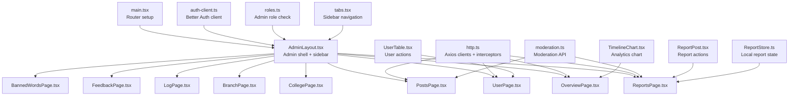

**Diagram sources**
- [main.tsx](file://admin/src/main.tsx#L1-L96)
- [AdminLayout.tsx](file://admin/src/layouts/AdminLayout.tsx#L1-L132)
- [auth-client.ts](file://admin/src/lib/auth-client.ts#L1-L11)
- [roles.ts](file://admin/src/lib/roles.ts#L1-L7)
- [http.ts](file://admin/src/services/http.ts#L1-L154)
- [moderation.ts](file://admin/src/services/api/moderation.ts#L1-L49)
- [OverviewPage.tsx](file://admin/src/pages/OverviewPage.tsx#L1-L80)
- [UserPage.tsx](file://admin/src/pages/UserPage.tsx#L1-L235)
- [ReportsPage.tsx](file://admin/src/pages/ReportsPage.tsx#L1-L122)
- [PostsPage.tsx](file://admin/src/pages/PostsPage.tsx#L1-L68)
- [ReportPost.tsx](file://admin/src/components/general/ReportPost.tsx#L1-L503)
- [UserTable.tsx](file://admin/src/components/general/UserTable.tsx#L1-L323)
- [TimelineChart.tsx](file://admin/src/components/charts/TimelineChart.tsx#L1-L47)
- [tabs.tsx](file://admin/src/constants/tabs.tsx#L1-L53)
- [ReportStore.ts](file://admin/src/store/ReportStore.ts#L1-L43)

**Section sources**
- [main.tsx](file://admin/src/main.tsx#L1-L96)
- [AdminLayout.tsx](file://admin/src/layouts/AdminLayout.tsx#L1-L132)
- [tabs.tsx](file://admin/src/constants/tabs.tsx#L1-L53)

## Core Components
- Authentication and session management via Better Auth client configured for admin endpoints.
- Role-based access control enforcing admin/superadmin permissions.
- Centralized HTTP client with credential support and automatic token refresh on 401.
- Store for managing report state locally to reflect UI updates without full reloads.
- Reusable UI components for tables, dialogs, badges, and charts.

Key responsibilities:
- AdminLayout validates session and role, renders sidebar, and provides outlet for child pages.
- http.ts exposes two clients: adminApiBase for admin endpoints and rootApiBase for non-admin endpoints.
- ReportStore maintains and updates report lists and statuses for optimistic UI.

**Section sources**
- [auth-client.ts](file://admin/src/lib/auth-client.ts#L1-L11)
- [roles.ts](file://admin/src/lib/roles.ts#L1-L7)
- [http.ts](file://admin/src/services/http.ts#L1-L154)
- [ReportStore.ts](file://admin/src/store/ReportStore.ts#L1-L43)

## Architecture Overview
The admin app uses a nested routing model under AdminLayout. Navigation is driven by a constant tab list. Authentication is enforced at the layout level, redirecting unauthorized users to sign-in and restricting access to admin-only roles. HTTP requests leverage interceptors for token injection and automatic refresh.

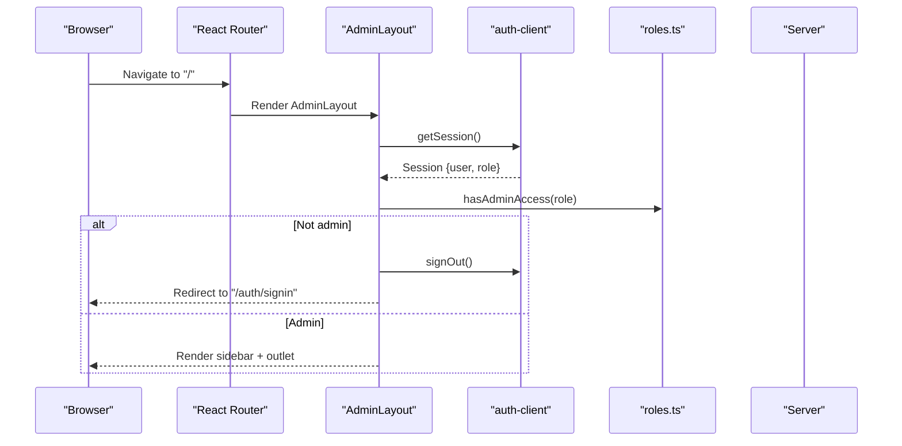

**Diagram sources**
- [AdminLayout.tsx](file://admin/src/layouts/AdminLayout.tsx#L17-L65)
- [auth-client.ts](file://admin/src/lib/auth-client.ts#L1-L11)
- [roles.ts](file://admin/src/lib/roles.ts#L1-L7)

## Detailed Component Analysis

### Routing and Page Organization
- Routes define nested pages under AdminLayout and an AuthLayout for sign-in.
- Dynamic routes support viewing posts, comments, and users by ID.
- Wildcard route handles unknown paths gracefully.

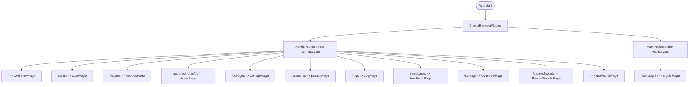

**Diagram sources**
- [main.tsx](file://admin/src/main.tsx#L20-L89)

**Section sources**
- [main.tsx](file://admin/src/main.tsx#L1-L96)

### Admin Layout and Sidebar
- Mobile-responsive sidebar with collapsible menu.
- Sidebar items sourced from a constant list of tabs.
- Session validation and role checks occur on mount and navigation changes.
- Uses a toast library for user feedback.

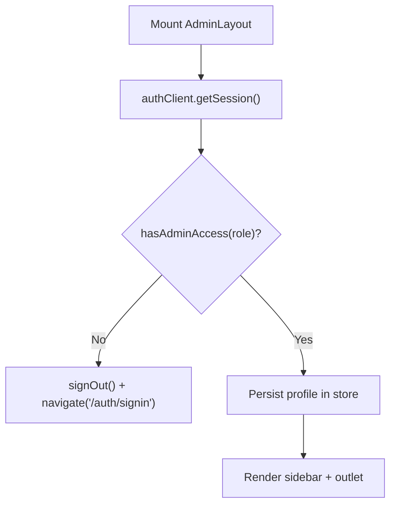

**Diagram sources**
- [AdminLayout.tsx](file://admin/src/layouts/AdminLayout.tsx#L17-L65)
- [tabs.tsx](file://admin/src/constants/tabs.tsx#L1-L53)

**Section sources**
- [AdminLayout.tsx](file://admin/src/layouts/AdminLayout.tsx#L1-L132)
- [tabs.tsx](file://admin/src/constants/tabs.tsx#L1-L53)

### Authentication and Role-Based Access
- Better Auth client configured with admin plugin and inferred fields.
- Admin access validated against a set of roles.
- On missing or invalid session, redirects to sign-in and clears profile.

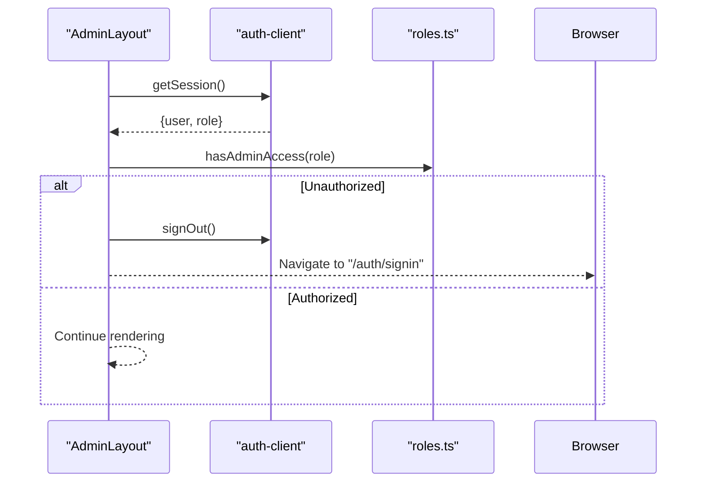

**Diagram sources**
- [auth-client.ts](file://admin/src/lib/auth-client.ts#L1-L11)
- [roles.ts](file://admin/src/lib/roles.ts#L1-L7)
- [AdminLayout.tsx](file://admin/src/layouts/AdminLayout.tsx#L17-L65)

**Section sources**
- [auth-client.ts](file://admin/src/lib/auth-client.ts#L1-L11)
- [roles.ts](file://admin/src/lib/roles.ts#L1-L7)

### HTTP Client and Token Refresh
- Two Axios instances: adminApiBase for admin endpoints and rootApiBase for non-admin endpoints.
- Request interceptor injects Authorization header when present.
- Response interceptor normalizes backend envelope to a unified ApiResponse shape.
- Automatic refresh flow on 401 with queued retry for concurrent requests.

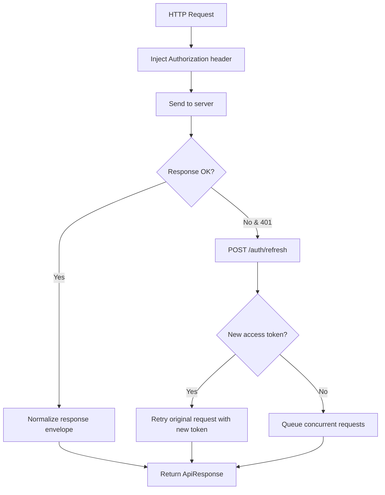

**Diagram sources**
- [http.ts](file://admin/src/services/http.ts#L21-L150)

**Section sources**
- [http.ts](file://admin/src/services/http.ts#L1-L154)

### Analytics and Overview
- Overview page fetches dashboard metrics and displays counts for users, posts, and comments.
- TimelineChart demonstrates a reusable chart component for time-series-like data.

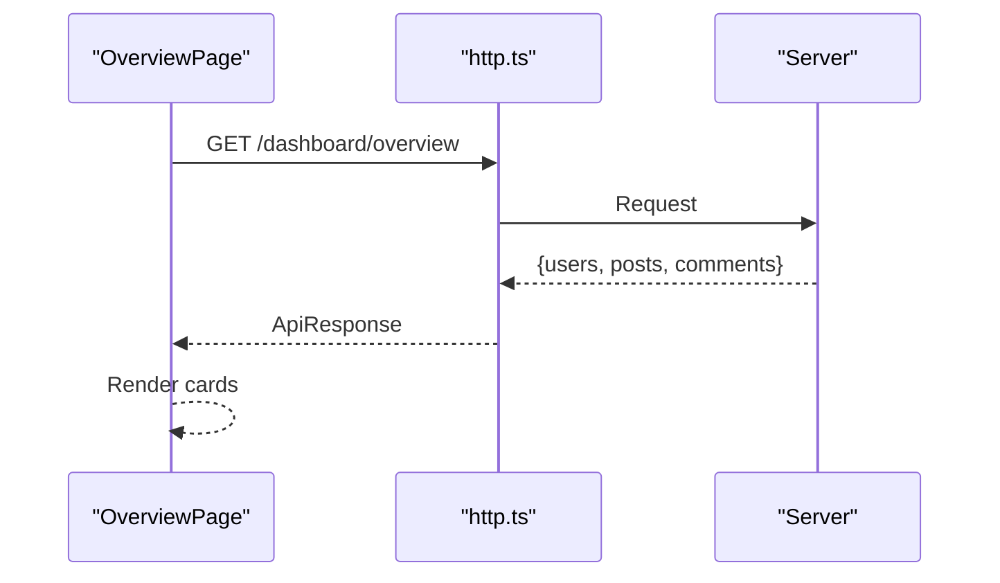

**Diagram sources**
- [OverviewPage.tsx](file://admin/src/pages/OverviewPage.tsx#L16-L29)
- [http.ts](file://admin/src/services/http.ts#L11-L19)

**Section sources**
- [OverviewPage.tsx](file://admin/src/pages/OverviewPage.tsx#L1-L80)
- [TimelineChart.tsx](file://admin/src/components/charts/TimelineChart.tsx#L1-L47)

### Moderation Tools and Reporting
- ReportsPage lists reported posts with filtering by status (pending, resolved, ignored) and pagination.
- PostsPage aggregates recent reports for quick moderation.
- ReportPost component provides a table of reports with contextual actions (ban/unban, shadow ban, suspend, ignore, undo).
- ReportStore optimistically updates report status to improve responsiveness.

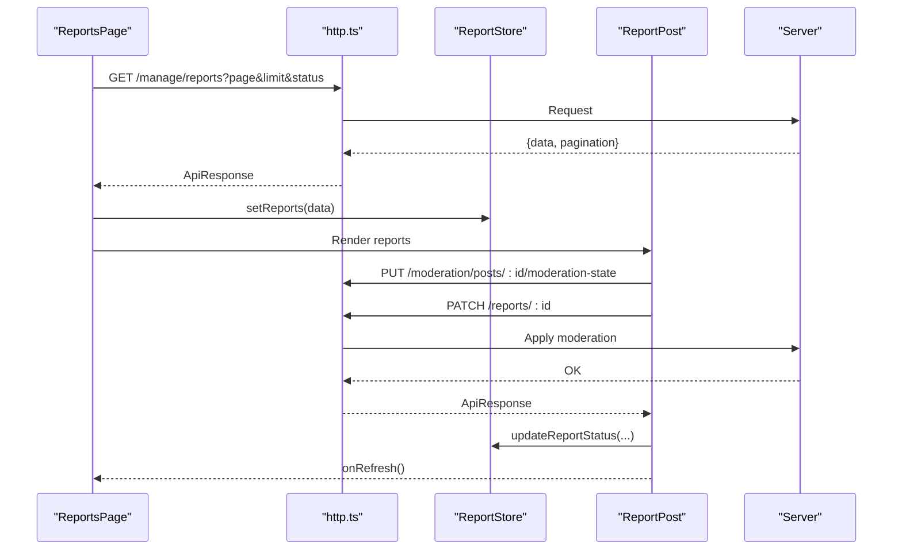

**Diagram sources**
- [ReportsPage.tsx](file://admin/src/pages/ReportsPage.tsx#L24-L61)
- [PostsPage.tsx](file://admin/src/pages/PostsPage.tsx#L20-L38)
- [ReportPost.tsx](file://admin/src/components/general/ReportPost.tsx#L61-L90)
- [ReportStore.ts](file://admin/src/store/ReportStore.ts#L14-L26)

**Section sources**
- [ReportsPage.tsx](file://admin/src/pages/ReportsPage.tsx#L1-L122)
- [PostsPage.tsx](file://admin/src/pages/PostsPage.tsx#L1-L68)
- [ReportPost.tsx](file://admin/src/components/general/ReportPost.tsx#L1-L503)
- [ReportStore.ts](file://admin/src/store/ReportStore.ts#L1-L43)

### User Management
- UserPage lists users with search by username/email and pagination.
- UserTable provides actions to ban/unban, suspend/remove suspension, and view user profiles.
- Suspensions are temporary and tracked with end dates.

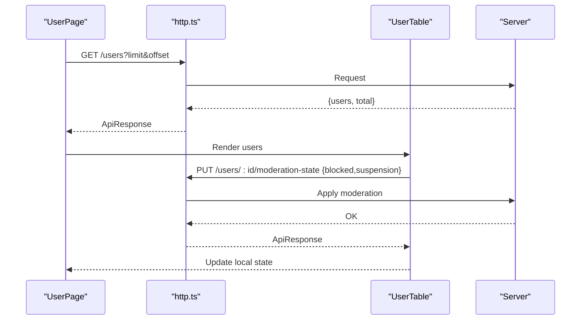

**Diagram sources**
- [UserPage.tsx](file://admin/src/pages/UserPage.tsx#L45-L71)
- [UserTable.tsx](file://admin/src/components/general/UserTable.tsx#L48-L116)

**Section sources**
- [UserPage.tsx](file://admin/src/pages/UserPage.tsx#L1-L235)
- [UserTable.tsx](file://admin/src/components/general/UserTable.tsx#L1-L323)

### Banned Words Management
- moderation.ts defines typed APIs for banned word configuration, listing, creation, updates, and deletion.
- BannedWordsPage would integrate these APIs to manage word lists and severities.

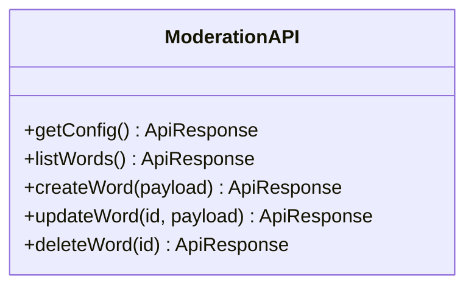

**Diagram sources**
- [moderation.ts](file://admin/src/services/api/moderation.ts#L23-L48)

**Section sources**
- [moderation.ts](file://admin/src/services/api/moderation.ts#L1-L49)

## Dependency Analysis
- AdminLayout depends on auth-client and roles for session validation and role checks.
- Pages depend on http.ts for API communication and on shared components for UI.
- ReportPost and UserTable encapsulate moderation actions and rely on ReportStore for optimistic updates.
- http.ts centralizes interceptors and token refresh logic, reducing duplication across modules.

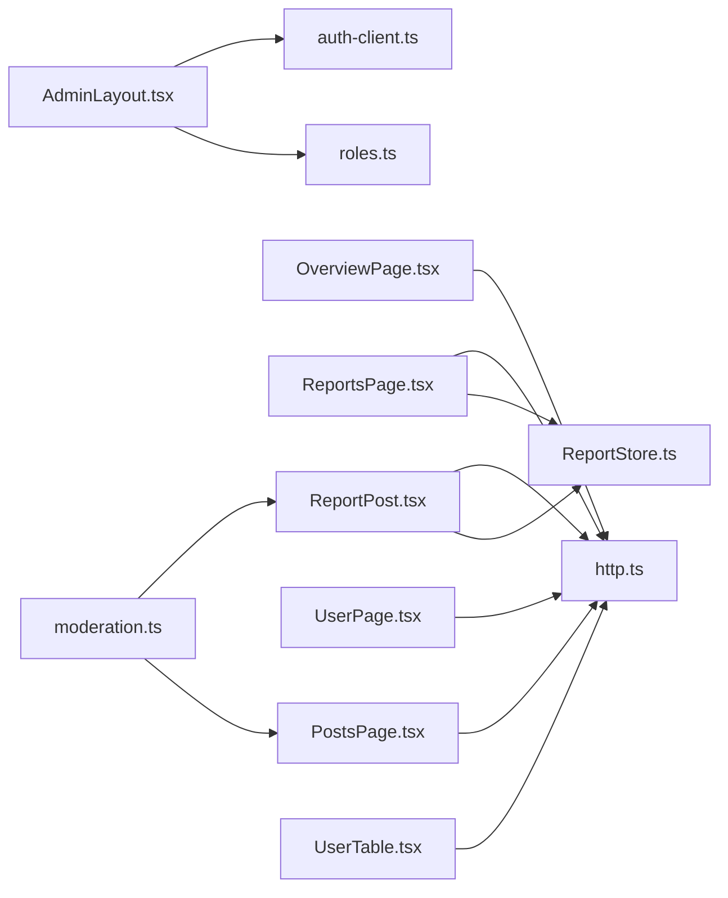

**Diagram sources**
- [AdminLayout.tsx](file://admin/src/layouts/AdminLayout.tsx#L1-L132)
- [auth-client.ts](file://admin/src/lib/auth-client.ts#L1-L11)
- [roles.ts](file://admin/src/lib/roles.ts#L1-L7)
- [http.ts](file://admin/src/services/http.ts#L1-L154)
- [OverviewPage.tsx](file://admin/src/pages/OverviewPage.tsx#L1-L80)
- [ReportsPage.tsx](file://admin/src/pages/ReportsPage.tsx#L1-L122)
- [PostsPage.tsx](file://admin/src/pages/PostsPage.tsx#L1-L68)
- [UserPage.tsx](file://admin/src/pages/UserPage.tsx#L1-L235)
- [ReportPost.tsx](file://admin/src/components/general/ReportPost.tsx#L1-L503)
- [UserTable.tsx](file://admin/src/components/general/UserTable.tsx#L1-L323)
- [ReportStore.ts](file://admin/src/store/ReportStore.ts#L1-L43)
- [moderation.ts](file://admin/src/services/api/moderation.ts#L1-L49)

**Section sources**
- [AdminLayout.tsx](file://admin/src/layouts/AdminLayout.tsx#L1-L132)
- [http.ts](file://admin/src/services/http.ts#L1-L154)

## Performance Considerations
- Local state updates via ReportStore avoid unnecessary network round-trips for UI responsiveness.
- Pagination on user and report listings reduces initial payload sizes.
- Conditional rendering and memoization patterns (e.g., status filters) minimize re-renders.
- Chart components are responsive and should be used judiciously to avoid heavy computations on large datasets.

## Troubleshooting Guide
Common issues and resolutions:
- Unauthorized access: Ensure the session has admin/superadmin role; otherwise, the layout will sign out and redirect to sign-in.
- 401 responses: The HTTP client automatically attempts token refresh; if refresh fails, requests are rejected and the app navigates to sign-in.
- Report actions failing: Verify that the action is permitted given current states (e.g., shadow ban is not allowed for comments); check toast messages for specific errors.
- User suspension: Confirm suspension days are positive integers and reason is non-empty before submitting.

Operational checks:
- Confirm VITE_SERVER_URI is set so the auth client targets the correct base URL.
- Validate that the backend endpoints for moderation and management are reachable.

**Section sources**
- [AdminLayout.tsx](file://admin/src/layouts/AdminLayout.tsx#L17-L65)
- [http.ts](file://admin/src/services/http.ts#L97-L150)
- [ReportPost.tsx](file://admin/src/components/general/ReportPost.tsx#L100-L207)
- [UserTable.tsx](file://admin/src/components/general/UserTable.tsx#L122-L144)

## Conclusion
The admin dashboard frontend provides a robust, role-protected interface for content oversight, user management, and system monitoring. Its modular structure, centralized HTTP client, and optimistic UI updates enable efficient moderation workflows. The integration with Better Auth ensures secure and seamless admin sessions, while reusable components promote consistency and maintainability.