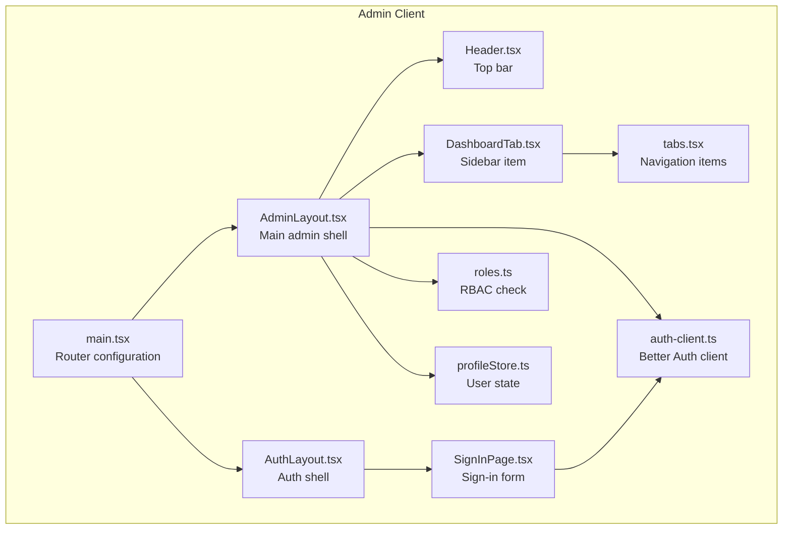
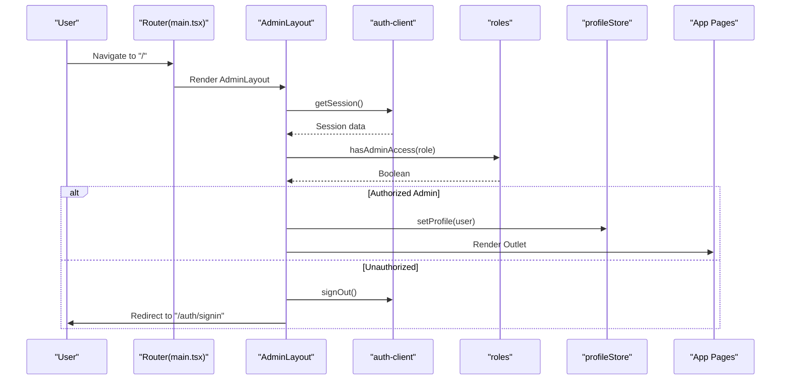
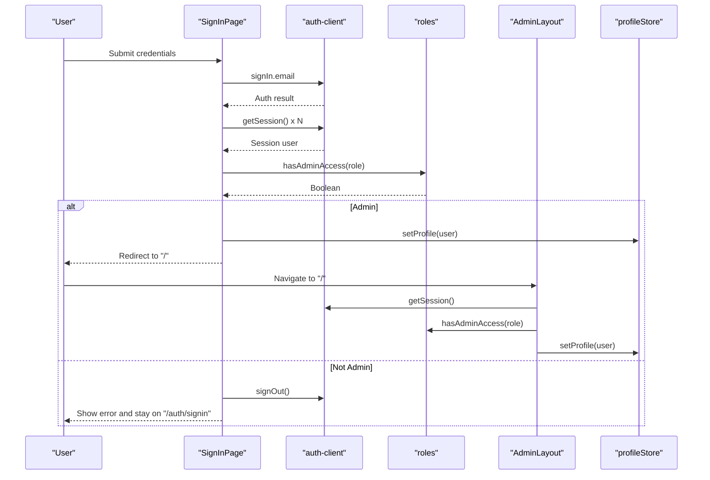
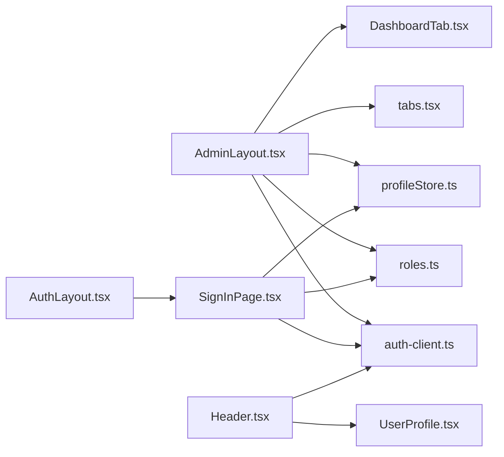

# Admin Layout System

<cite>
**Referenced Files in This Document**
- [AdminLayout.tsx](file://admin/src/layouts/AdminLayout.tsx)
- [main.tsx](file://admin/src/main.tsx)
- [auth-client.ts](file://admin/src/lib/auth-client.ts)
- [roles.ts](file://admin/src/lib/roles.ts)
- [SignInPage.tsx](file://admin/src/pages/SignInPage.tsx)
- [Header.tsx](file://admin/src/components/general/Header.tsx)
- [DashboardTab.tsx](file://admin/src/components/general/DashboardTab.tsx)
- [tabs.tsx](file://admin/src/constants/tabs.tsx)
- [profileStore.ts](file://admin/src/store/profileStore.ts)
- [AuthLayout.tsx](file://admin/src/layouts/AuthLayout.tsx)
- [AppLayout.tsx](file://admin/src/layouts/AppLayout.tsx)
- [RootLayout.tsx](file://admin/src/layouts/RootLayout.tsx)
- [UserProfile.tsx](file://admin/src/components/general/UserProfile.tsx)
- [OverviewPage.tsx](file://admin/src/pages/OverviewPage.tsx)
- [types.ts](file://admin/src/lib/types.ts)
</cite>

## Table of Contents
1. [Introduction](#introduction)
2. [Project Structure](#project-structure)
3. [Core Components](#core-components)
4. [Architecture Overview](#architecture-overview)
5. [Detailed Component Analysis](#detailed-component-analysis)
6. [Dependency Analysis](#dependency-analysis)
7. [Performance Considerations](#performance-considerations)
8. [Troubleshooting Guide](#troubleshooting-guide)
9. [Conclusion](#conclusion)

## Introduction
This document explains the admin layout system architecture, focusing on the AdminLayout component, navigation patterns, responsive design, routing configuration, authentication guards, and layout composition. It also covers header components, sidebar navigation, and the authentication flow for admin users, including role-based access control and layout customization options. Examples of layout extensions and component composition patterns are included to guide future development.

## Project Structure
The admin application is organized around a React-based client with TypeScript and Vite. The layout system centers on AdminLayout, which wraps admin pages and enforces authentication and role checks. Routing is configured via React Router, and authentication is handled by Better Auth with a dedicated client. State management for user profiles is implemented with Zustand.

**Diagram sources**
- [main.tsx](file://admin/src/main.tsx#L19-L89)
- [AdminLayout.tsx](file://admin/src/layouts/AdminLayout.tsx#L11-L132)
- [AuthLayout.tsx](file://admin/src/layouts/AuthLayout.tsx#L4-L16)
- [Header.tsx](file://admin/src/components/general/Header.tsx#L12-L65)
- [DashboardTab.tsx](file://admin/src/components/general/DashboardTab.tsx#L4-L28)
- [tabs.tsx](file://admin/src/constants/tabs.tsx#L7-L53)
- [SignInPage.tsx](file://admin/src/pages/SignInPage.tsx#L24-L134)
- [profileStore.ts](file://admin/src/store/profileStore.ts#L12-L39)
- [auth-client.ts](file://admin/src/lib/auth-client.ts#L4-L11)
- [roles.ts](file://admin/src/lib/roles.ts#L3-L7)

**Section sources**
- [main.tsx](file://admin/src/main.tsx#L19-L89)
- [AdminLayout.tsx](file://admin/src/layouts/AdminLayout.tsx#L11-L132)
- [AuthLayout.tsx](file://admin/src/layouts/AuthLayout.tsx#L4-L16)
- [Header.tsx](file://admin/src/components/general/Header.tsx#L12-L65)
- [DashboardTab.tsx](file://admin/src/components/general/DashboardTab.tsx#L4-L28)
- [tabs.tsx](file://admin/src/constants/tabs.tsx#L7-L53)
- [SignInPage.tsx](file://admin/src/pages/SignInPage.tsx#L24-L134)
- [profileStore.ts](file://admin/src/store/profileStore.ts#L12-L39)
- [auth-client.ts](file://admin/src/lib/auth-client.ts#L4-L11)
- [roles.ts](file://admin/src/lib/roles.ts#L3-L7)

## Core Components
- AdminLayout: Provides the admin shell with responsive sidebar, mobile menu, and outlet rendering for child routes. It validates sessions, enforces admin-only access, and stores the user profile in state.
- AuthLayout: Wraps authentication pages with a centered container and toast notifications.
- SignInPage: Handles admin sign-in, validates credentials, waits for session readiness, and redirects based on role.
- Header: Renders the top navigation bar with logo, links, and user profile dropdown.
- DashboardTab: Styled navigation link for sidebar items.
- tabs: Defines the sidebar navigation entries with icons and paths.
- profileStore: Manages current user profile and theme preferences.
- auth-client: Configured Better Auth client pointing to the backend authentication API.
- roles: Role-based access control utility for admin roles.

**Section sources**
- [AdminLayout.tsx](file://admin/src/layouts/AdminLayout.tsx#L11-L132)
- [AuthLayout.tsx](file://admin/src/layouts/AuthLayout.tsx#L4-L16)
- [SignInPage.tsx](file://admin/src/pages/SignInPage.tsx#L24-L134)
- [Header.tsx](file://admin/src/components/general/Header.tsx#L12-L65)
- [DashboardTab.tsx](file://admin/src/components/general/DashboardTab.tsx#L4-L28)
- [tabs.tsx](file://admin/src/constants/tabs.tsx#L7-L53)
- [profileStore.ts](file://admin/src/store/profileStore.ts#L12-L39)
- [auth-client.ts](file://admin/src/lib/auth-client.ts#L4-L11)
- [roles.ts](file://admin/src/lib/roles.ts#L3-L7)

## Architecture Overview
The admin layout system uses nested layouts and route guards to enforce authentication and role checks. AdminLayout acts as a route guard by validating sessions and redirecting unauthorized users. AuthLayout isolates authentication routes. Navigation is driven by a constant list of tabs rendered inside a reusable DashboardTab component.

**Diagram sources**
- [main.tsx](file://admin/src/main.tsx#L19-L89)
- [AdminLayout.tsx](file://admin/src/layouts/AdminLayout.tsx#L17-L65)
- [auth-client.ts](file://admin/src/lib/auth-client.ts#L4-L11)
- [roles.ts](file://admin/src/lib/roles.ts#L3-L7)
- [profileStore.ts](file://admin/src/store/profileStore.ts#L18-L29)

## Detailed Component Analysis

### AdminLayout
Responsibilities:
- Manage mobile sidebar visibility and overlay.
- Validate session and enforce admin-only access.
- Persist admin user profile in state after successful validation.
- Render the sidebar navigation using DashboardTab and tabs.
- Provide a container for child routes via Outlet.

Responsive design:
- Uses Tailwind classes to switch from a fixed sidebar on mobile to a grid layout on larger screens.
- Mobile menu toggles with transform transitions and backdrop overlay.

Authentication and role checks:
- On mount and navigation changes, fetches session and verifies admin role.
- On failure, signs out, clears profile, shows a toast, and redirects to sign-in.

Layout composition:
- Grid layout with three columns on desktop: sidebar (md:col-span-3 lg:col-span-2), content area (md:col-span-9 lg:col-span-10), and a mobile top bar.

Key behaviors:
- Resets mobile menu on navigation.
- Shows a loading screen while session is pending.

**Section sources**
- [AdminLayout.tsx](file://admin/src/layouts/AdminLayout.tsx#L11-L132)
- [DashboardTab.tsx](file://admin/src/components/general/DashboardTab.tsx#L4-L28)
- [tabs.tsx](file://admin/src/constants/tabs.tsx#L7-L53)
- [profileStore.ts](file://admin/src/store/profileStore.ts#L18-L29)
- [roles.ts](file://admin/src/lib/roles.ts#L3-L7)
- [auth-client.ts](file://admin/src/lib/auth-client.ts#L4-L11)

### Routing Configuration
The router defines two primary shells:
- Admin shell: "/" renders AdminLayout with nested routes for users, posts, colleges, branches, reports, feedbacks, logs, banned words, and settings. Includes a wildcard fallback to NotFoundPage.
- Auth shell: "/auth" renders AuthLayout with the SignInPage.

Routing patterns:
- Dynamic segments like "/p/:id", "/c/:id", "/u/:id" are supported for post-centric views.
- Nested routes under AdminLayout ensure consistent layout and guards.

**Section sources**
- [main.tsx](file://admin/src/main.tsx#L19-L89)

### Authentication Flow for Admin Users
End-to-end flow:
- User navigates to "/auth/signin".
- SignInPage submits credentials to Better Auth.
- Waits for session readiness before proceeding.
- Validates admin role; on success, sets profile and redirects to "/".
- On failure, displays an error and signs out.

Guard behavior in AdminLayout:
- On mount and navigation, fetches session and role.
- If missing or unauthorized, signs out, clears profile, shows a toast, and redirects to "/auth/signin".

**Diagram sources**
- [SignInPage.tsx](file://admin/src/pages/SignInPage.tsx#L38-L78)
- [auth-client.ts](file://admin/src/lib/auth-client.ts#L4-L11)
- [roles.ts](file://admin/src/lib/roles.ts#L3-L7)
- [AdminLayout.tsx](file://admin/src/layouts/AdminLayout.tsx#L23-L65)
- [profileStore.ts](file://admin/src/store/profileStore.ts#L18-L29)

**Section sources**
- [SignInPage.tsx](file://admin/src/pages/SignInPage.tsx#L24-L134)
- [AdminLayout.tsx](file://admin/src/layouts/AdminLayout.tsx#L17-L65)
- [auth-client.ts](file://admin/src/lib/auth-client.ts#L4-L11)
- [roles.ts](file://admin/src/lib/roles.ts#L3-L7)
- [profileStore.ts](file://admin/src/store/profileStore.ts#L18-L29)

### Role-Based Access Control (RBAC)
- Admin roles are defined as a set containing "admin" and "superadmin".
- Two validation points:
  - SignInPage: Ensures the signed-in user has admin role before allowing access.
  - AdminLayout: Re-validates on mount/navigation and blocks non-admin users.

**Section sources**
- [roles.ts](file://admin/src/lib/roles.ts#L1-L7)
- [SignInPage.tsx](file://admin/src/pages/SignInPage.tsx#L65-L71)
- [AdminLayout.tsx](file://admin/src/layouts/AdminLayout.tsx#L40-L57)

### Layout Composition Patterns
- AdminLayout composes:
  - Mobile top bar with menu toggle.
  - Fixed sidebar with collapsible overlay on mobile.
  - Content area via Outlet.
- AuthLayout composes:
  - Centered container for auth forms.
- Header composes:
  - Logo, navigation links, and user profile dropdown.
- DashboardTab composes:
  - Styled NavLink with active state styling and icon support.

**Section sources**
- [AdminLayout.tsx](file://admin/src/layouts/AdminLayout.tsx#L75-L129)
- [AuthLayout.tsx](file://admin/src/layouts/AuthLayout.tsx#L4-L16)
- [Header.tsx](file://admin/src/components/general/Header.tsx#L34-L62)
- [DashboardTab.tsx](file://admin/src/components/general/DashboardTab.tsx#L11-L25)

### Sidebar Navigation and Breadcrumb Systems
- Sidebar navigation:
  - Driven by tabs constant with entries for Dashboard, Users, Reports, Colleges, Branches, Banned Words, Logs, Feedbacks, and Settings.
  - Each entry is rendered as a DashboardTab with an icon and path.
- Breadcrumbs:
  - No explicit breadcrumb component is present in the admin layout. The current design relies on the sidebar and page titles for navigation context.

**Section sources**
- [tabs.tsx](file://admin/src/constants/tabs.tsx#L7-L53)
- [DashboardTab.tsx](file://admin/src/components/general/DashboardTab.tsx#L4-L28)
- [AdminLayout.tsx](file://admin/src/layouts/AdminLayout.tsx#L101-L110)

### Header Components
- Header renders a fixed top navigation bar with:
  - Logo link.
  - Navigation links to home/feed.
  - User profile dropdown for authenticated users.
- Session synchronization:
  - Fetches session on mount and updates profile store accordingly.

**Section sources**
- [Header.tsx](file://admin/src/components/general/Header.tsx#L12-L65)
- [UserProfile.tsx](file://admin/src/components/general/UserProfile.tsx#L8-L45)

### Responsive Design Implementation
- Mobile-first approach:
  - Mobile menu toggle controls sidebar visibility with transform transitions.
  - Overlay backdrop closes the menu when tapped outside.
- Desktop layout:
  - Grid-based layout with sidebar and content areas spanning multiple columns on large screens.

**Section sources**
- [AdminLayout.tsx](file://admin/src/layouts/AdminLayout.tsx#L75-L129)

### Layout Customization Options
- Theme preference:
  - profileStore exposes setTheme to update theme in the user profile.
- User profile persistence:
  - profileStore maintains id, email, name, image, and role for UI rendering and guards.

**Section sources**
- [profileStore.ts](file://admin/src/store/profileStore.ts#L12-L39)
- [types.ts](file://admin/src/lib/types.ts#L5-L11)

### Examples of Layout Extensions and Component Composition
- Extending AdminLayout:
  - Add new nested routes in main.tsx under AdminLayout to introduce new admin pages.
  - Extend tabs.tsx to include new sidebar entries for the new pages.
- Composing pages:
  - Pages like OverviewPage demonstrate fetching data and rendering cards within the admin layout’s content area.

**Section sources**
- [main.tsx](file://admin/src/main.tsx#L19-L89)
- [tabs.tsx](file://admin/src/constants/tabs.tsx#L7-L53)
- [OverviewPage.tsx](file://admin/src/pages/OverviewPage.tsx#L12-L80)

## Dependency Analysis
High-level dependencies:
- AdminLayout depends on auth-client for session management, roles for RBAC, profileStore for user state, and tabs/DashboardTab for navigation.
- SignInPage depends on auth-client and roles for sign-in validation.
- Header depends on auth-client and UserProfile for session-aware UI.
- AuthLayout depends on SignInPage for authentication flow.

**Diagram sources**
- [AdminLayout.tsx](file://admin/src/layouts/AdminLayout.tsx#L11-L132)
- [SignInPage.tsx](file://admin/src/pages/SignInPage.tsx#L24-L134)
- [Header.tsx](file://admin/src/components/general/Header.tsx#L12-L65)
- [AuthLayout.tsx](file://admin/src/layouts/AuthLayout.tsx#L4-L16)
- [auth-client.ts](file://admin/src/lib/auth-client.ts#L4-L11)
- [roles.ts](file://admin/src/lib/roles.ts#L3-L7)
- [profileStore.ts](file://admin/src/store/profileStore.ts#L12-L39)
- [tabs.tsx](file://admin/src/constants/tabs.tsx#L7-L53)
- [DashboardTab.tsx](file://admin/src/components/general/DashboardTab.tsx#L4-L28)
- [UserProfile.tsx](file://admin/src/components/general/UserProfile.tsx#L8-L45)

**Section sources**
- [AdminLayout.tsx](file://admin/src/layouts/AdminLayout.tsx#L11-L132)
- [SignInPage.tsx](file://admin/src/pages/SignInPage.tsx#L24-L134)
- [Header.tsx](file://admin/src/components/general/Header.tsx#L12-L65)
- [AuthLayout.tsx](file://admin/src/layouts/AuthLayout.tsx#L4-L16)
- [auth-client.ts](file://admin/src/lib/auth-client.ts#L4-L11)
- [roles.ts](file://admin/src/lib/roles.ts#L3-L7)
- [profileStore.ts](file://admin/src/store/profileStore.ts#L12-L39)
- [tabs.tsx](file://admin/src/constants/tabs.tsx#L7-L53)
- [DashboardTab.tsx](file://admin/src/components/general/DashboardTab.tsx#L4-L28)
- [UserProfile.tsx](file://admin/src/components/general/UserProfile.tsx#L8-L45)

## Performance Considerations
- Session validation occurs on mount and navigation; avoid unnecessary re-renders by keeping validation logic efficient.
- Debounce or batch repeated session reads during sign-in to reduce network overhead.
- Lazy-load heavy pages to minimize initial bundle size.
- Use CSS containment and transforms for smooth mobile menu transitions.

## Troubleshooting Guide
Common issues and resolutions:
- Unauthorized access attempts:
  - Symptom: Non-admin users redirected to sign-in with an error message.
  - Cause: Role validation failed.
  - Resolution: Verify user role in the backend and ensure Better Auth is configured correctly.
- Stuck loading on admin dashboard:
  - Symptom: Loading screen remains indefinitely.
  - Cause: Pending session state or network issues.
  - Resolution: Check session availability and network connectivity; ensure auth-client is configured with the correct base URL.
- Sign-in does not redirect to admin:
  - Symptom: Credentials accepted but no redirection.
  - Cause: Session not yet ready or role mismatch.
  - Resolution: Confirm session readiness loop and admin role presence; ensure profileStore is updated.

**Section sources**
- [AdminLayout.tsx](file://admin/src/layouts/AdminLayout.tsx#L23-L73)
- [SignInPage.tsx](file://admin/src/pages/SignInPage.tsx#L51-L78)
- [auth-client.ts](file://admin/src/lib/auth-client.ts#L4-L11)

## Conclusion
The admin layout system provides a robust, role-gated shell with responsive navigation and a clean separation of concerns. AdminLayout centralizes authentication and RBAC checks, while AuthLayout isolates authentication flows. The modular design using DashboardTab and tabs enables easy extension of navigation and pages. By leveraging Better Auth and Zustand, the system balances simplicity with scalability for future enhancements.