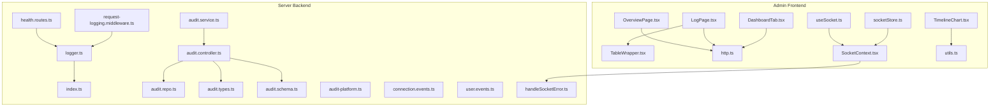
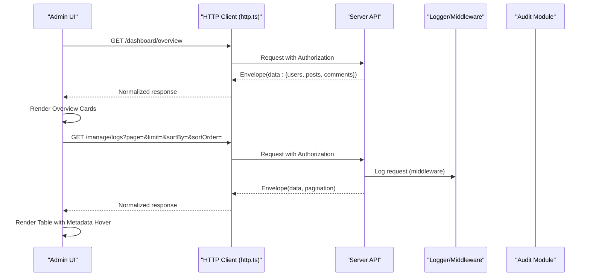
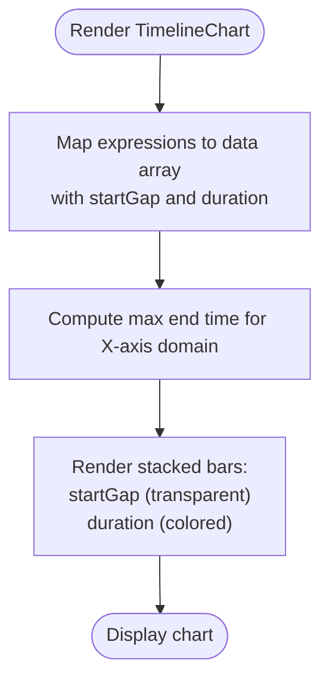
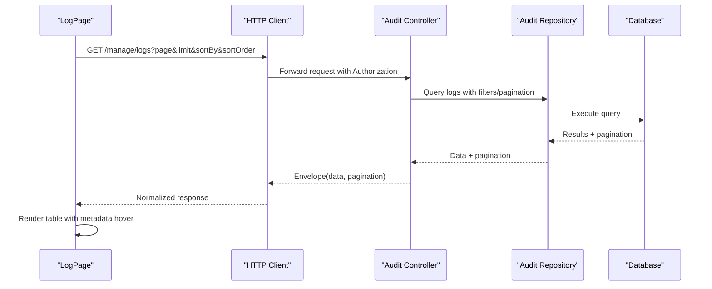
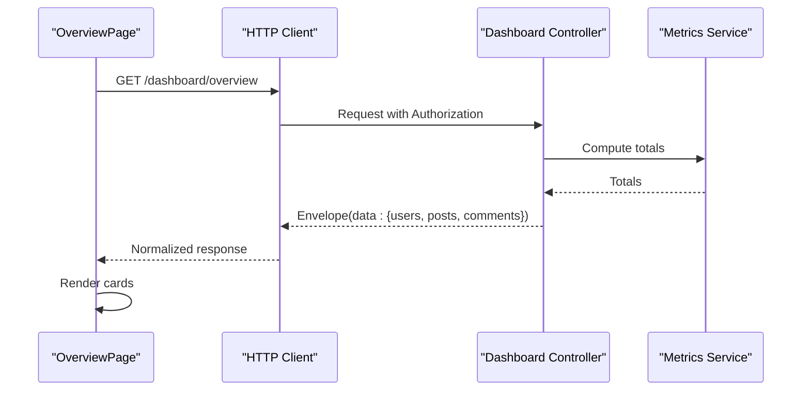
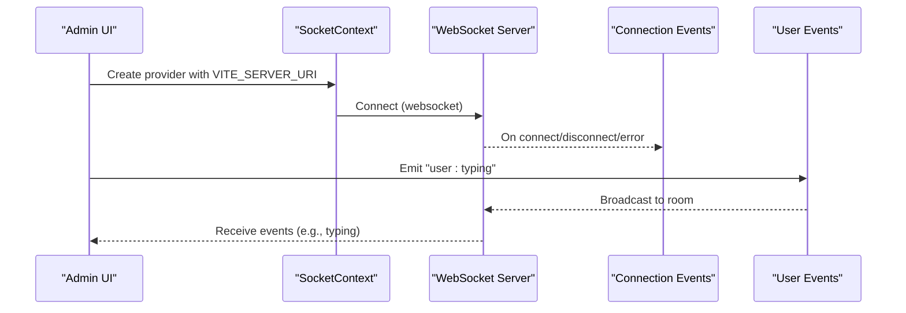
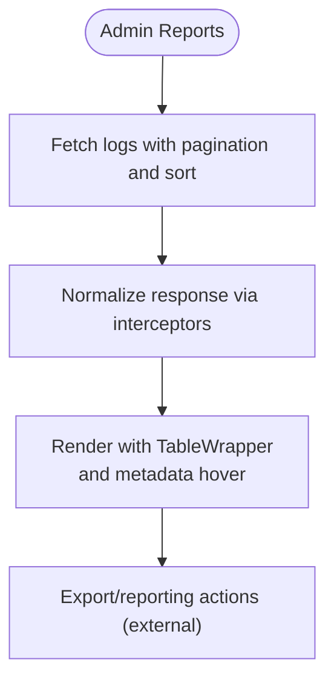
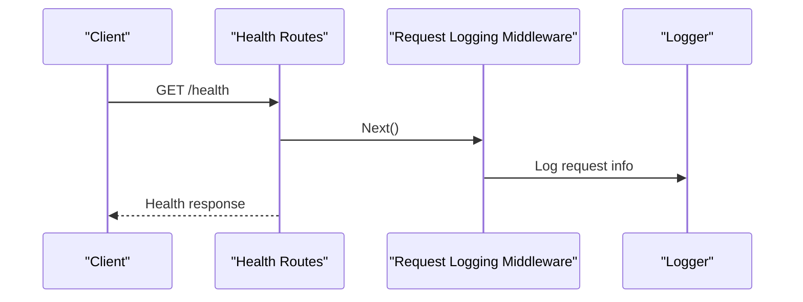
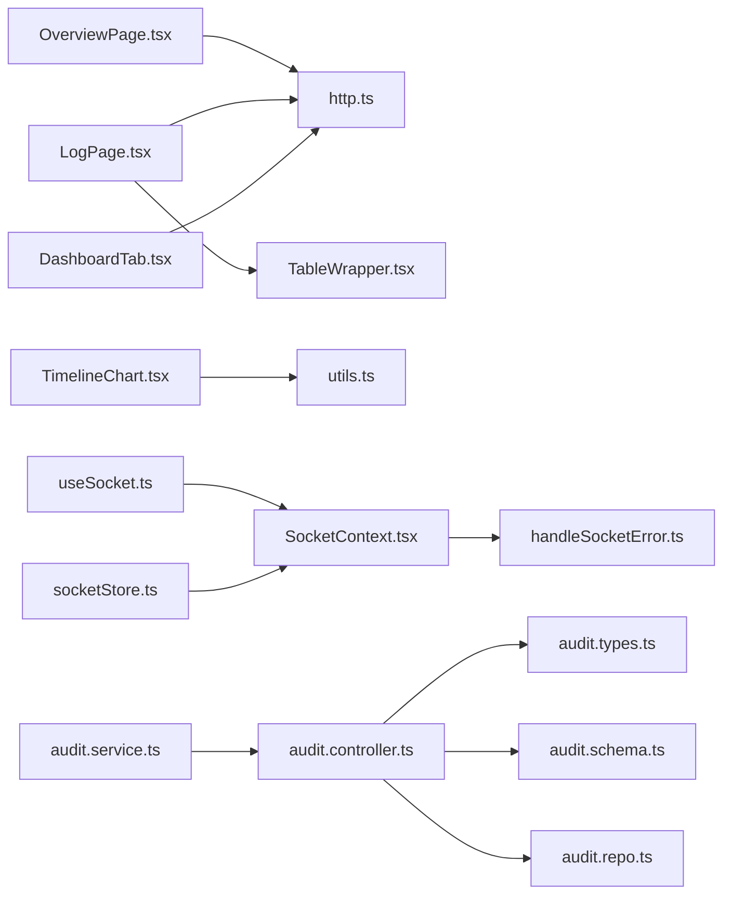

# Analytics and Monitoring

<cite>
**Referenced Files in This Document**
- [TimelineChart.tsx](file://admin/src/components/charts/TimelineChart.tsx)
- [LogPage.tsx](file://admin/src/pages/LogPage.tsx)
- [OverviewPage.tsx](file://admin/src/pages/OverviewPage.tsx)
- [DashboardTab.tsx](file://admin/src/components/general/DashboardTab.tsx)
- [http.ts](file://admin/src/services/http.ts)
- [SocketContext.tsx](file://admin/src/socket/SocketContext.tsx)
- [useSocket.ts](file://admin/src/socket/useSocket.ts)
- [socketStore.ts](file://admin/src/store/socketStore.ts)
- [TableWrapper.tsx](file://admin/src/components/general/TableWrapper.tsx)
- [utils.ts](file://admin/src/lib/utils.ts)
- [health.routes.ts](file://server/src/routes/health.routes.ts)
- [request-logging.middleware.ts](file://server/src/core/middlewares/request-logging.middleware.ts)
- [logger.ts](file://server/src/core/logger/logger.ts)
- [index.ts](file://server/src/core/logger/index.ts)
- [audit.controller.ts](file://server/src/modules/audit/audit.controller.ts)
- [audit.repo.ts](file://server/src/modules/audit/audit.repo.ts)
- [audit.service.ts](file://server/src/modules/audit/audit.service.ts)
- [audit.types.ts](file://server/src/modules/audit/audit.types.ts)
- [audit.schema.ts](file://server/src/modules/audit/audit.schema.ts)
- [audit-platform.ts](file://server/src/shared/constants/audit/platform.ts)
- [connection.events.ts](file://server/src/infra/services/socket/events/connection.events.ts)
- [user.events.ts](file://server/src/infra/services/socket/events/user.events.ts)
- [handleSocketError.ts](file://server/src/infra/services/socket/errors/handleSocketError.ts)
</cite>

## Table of Contents
1. [Introduction](#introduction)
2. [Project Structure](#project-structure)
3. [Core Components](#core-components)
4. [Architecture Overview](#architecture-overview)
5. [Detailed Component Analysis](#detailed-component-analysis)
6. [Dependency Analysis](#dependency-analysis)
7. [Performance Considerations](#performance-considerations)
8. [Troubleshooting Guide](#troubleshooting-guide)
9. [Conclusion](#conclusion)
10. [Appendices](#appendices)

## Introduction
This document explains the analytics and monitoring capabilities within the admin dashboard. It covers:
- Timeline chart implementations for visualizing temporal data
- System logging interfaces and audit trails
- Dashboard analytics visualization and overview cards
- Real-time monitoring via WebSocket connections
- Administrative reporting tools and pagination
- Integration with backend monitoring APIs and data visualization components

## Project Structure
The admin dashboard organizes analytics and monitoring features across:
- Pages: overview and logs
- Charts: reusable timeline chart component
- UI: generic table wrapper and dashboard tab navigation
- Services: HTTP client with interceptors and normalization
- Sockets: WebSocket context and hooks for real-time updates
- Stores: lightweight socket state management
- Server-side: health routes, request logging middleware, structured logger, and audit module

**Diagram sources**
- [OverviewPage.tsx](file://admin/src/pages/OverviewPage.tsx#L1-L80)
- [LogPage.tsx](file://admin/src/pages/LogPage.tsx#L1-L177)
- [TimelineChart.tsx](file://admin/src/components/charts/TimelineChart.tsx#L1-L47)
- [TableWrapper.tsx](file://admin/src/components/general/TableWrapper.tsx#L1-L101)
- [http.ts](file://admin/src/services/http.ts#L1-L154)
- [SocketContext.tsx](file://admin/src/socket/SocketContext.tsx#L1-L26)
- [useSocket.ts](file://admin/src/socket/useSocket.ts#L1-L13)
- [socketStore.ts](file://admin/src/store/socketStore.ts#L1-L14)
- [DashboardTab.tsx](file://admin/src/components/general/DashboardTab.tsx#L1-L28)
- [utils.ts](file://admin/src/lib/utils.ts#L1-L7)
- [health.routes.ts](file://server/src/routes/health.routes.ts)
- [request-logging.middleware.ts](file://server/src/core/middlewares/request-logging.middleware.ts)
- [logger.ts](file://server/src/core/logger/logger.ts)
- [index.ts](file://server/src/core/logger/index.ts)
- [audit.controller.ts](file://server/src/modules/audit/audit.controller.ts)
- [audit.repo.ts](file://server/src/modules/audit/audit.repo.ts)
- [audit.service.ts](file://server/src/modules/audit/audit.service.ts)
- [audit.types.ts](file://server/src/modules/audit/audit.types.ts)
- [audit.schema.ts](file://server/src/modules/audit/audit.schema.ts)
- [audit-platform.ts](file://server/src/shared/constants/audit/platform.ts)
- [connection.events.ts](file://server/src/infra/services/socket/events/connection.events.ts#L1-L20)
- [user.events.ts](file://server/src/infra/services/socket/events/user.events.ts#L1-L9)
- [handleSocketError.ts](file://server/src/infra/services/socket/errors/handleSocketError.ts#L1-L22)

**Section sources**
- [OverviewPage.tsx](file://admin/src/pages/OverviewPage.tsx#L1-L80)
- [LogPage.tsx](file://admin/src/pages/LogPage.tsx#L1-L177)
- [TimelineChart.tsx](file://admin/src/components/charts/TimelineChart.tsx#L1-L47)
- [TableWrapper.tsx](file://admin/src/components/general/TableWrapper.tsx#L1-L101)
- [http.ts](file://admin/src/services/http.ts#L1-L154)
- [SocketContext.tsx](file://admin/src/socket/SocketContext.tsx#L1-L26)
- [useSocket.ts](file://admin/src/socket/useSocket.ts#L1-L13)
- [socketStore.ts](file://admin/src/store/socketStore.ts#L1-L14)
- [DashboardTab.tsx](file://admin/src/components/general/DashboardTab.tsx#L1-L28)
- [utils.ts](file://admin/src/lib/utils.ts#L1-L7)
- [health.routes.ts](file://server/src/routes/health.routes.ts)
- [request-logging.middleware.ts](file://server/src/core/middlewares/request-logging.middleware.ts)
- [logger.ts](file://server/src/core/logger/logger.ts)
- [index.ts](file://server/src/core/logger/index.ts)
- [audit.controller.ts](file://server/src/modules/audit/audit.controller.ts)
- [audit.repo.ts](file://server/src/modules/audit/audit.repo.ts)
- [audit.service.ts](file://server/src/modules/audit/audit.service.ts)
- [audit.types.ts](file://server/src/modules/audit/audit.types.ts)
- [audit.schema.ts](file://server/src/modules/audit/audit.schema.ts)
- [audit-platform.ts](file://server/src/shared/constants/audit/platform.ts)
- [connection.events.ts](file://server/src/infra/services/socket/events/connection.events.ts#L1-L20)
- [user.events.ts](file://server/src/infra/services/socket/events/user.events.ts#L1-L9)
- [handleSocketError.ts](file://server/src/infra/services/socket/errors/handleSocketError.ts#L1-L22)

## Core Components
- TimelineChart: Renders a responsive vertical stacked bar chart to visualize temporal segments per expression.
- LogPage: Fetches paginated and sortable audit/log entries, displays metadata via hover cards, and supports sorting by multiple fields.
- OverviewPage: Loads dashboard overview metrics (users, posts, comments) via a dedicated endpoint.
- TableWrapper: Generic table renderer with column definitions, nested value support, and optional actions.
- HTTP service: Centralized Axios client with base URLs, bearer token injection, response envelope normalization, and automatic auth refresh.
- SocketContext/useSocket: Provides a WebSocket connection and hook for real-time features.
- Audit module: Server-side audit controller, service, repository, types, and schema define the audit trail structure and platform constants.

**Section sources**
- [TimelineChart.tsx](file://admin/src/components/charts/TimelineChart.tsx#L1-L47)
- [LogPage.tsx](file://admin/src/pages/LogPage.tsx#L1-L177)
- [OverviewPage.tsx](file://admin/src/pages/OverviewPage.tsx#L1-L80)
- [TableWrapper.tsx](file://admin/src/components/general/TableWrapper.tsx#L1-L101)
- [http.ts](file://admin/src/services/http.ts#L1-L154)
- [SocketContext.tsx](file://admin/src/socket/SocketContext.tsx#L1-L26)
- [useSocket.ts](file://admin/src/socket/useSocket.ts#L1-L13)
- [audit.controller.ts](file://server/src/modules/audit/audit.controller.ts)
- [audit.service.ts](file://server/src/modules/audit/audit.service.ts)
- [audit.repo.ts](file://server/src/modules/audit/audit.repo.ts)
- [audit.types.ts](file://server/src/modules/audit/audit.types.ts)
- [audit.schema.ts](file://server/src/modules/audit/audit.schema.ts)
- [audit-platform.ts](file://server/src/shared/constants/audit/platform.ts)

## Architecture Overview
The analytics and monitoring architecture connects the admin frontend to backend services:
- OverviewPage consumes a dashboard overview endpoint to render KPI cards.
- LogPage queries the manage/logs endpoint with pagination and sorting, rendering a table with metadata hover details.
- TimelineChart transforms expression-duration data into a stacked bar visualization.
- HTTP service normalizes responses and injects auth tokens, while handling 401 refresh flows.
- SocketContext establishes a WebSocket connection for real-time events; server-side connection and user events are handled with error handling.

**Diagram sources**
- [OverviewPage.tsx](file://admin/src/pages/OverviewPage.tsx#L16-L29)
- [LogPage.tsx](file://admin/src/pages/LogPage.tsx#L39-L61)
- [http.ts](file://admin/src/services/http.ts#L11-L19)
- [request-logging.middleware.ts](file://server/src/core/middlewares/request-logging.middleware.ts)
- [audit.controller.ts](file://server/src/modules/audit/audit.controller.ts)

## Detailed Component Analysis

### Timeline Chart Implementation
The timeline chart renders a vertical stacked bar chart to show time-aligned segments for different expressions. It:
- Accepts an expressions object mapping expression names to [start, end] tuples
- Computes max time for axis domain and stacks two bars per expression: a transparent start gap and a colored duration bar
- Uses Recharts for responsive container, axes, grid, and tooltips

**Diagram sources**
- [TimelineChart.tsx](file://admin/src/components/charts/TimelineChart.tsx#L10-L44)

**Section sources**
- [TimelineChart.tsx](file://admin/src/components/charts/TimelineChart.tsx#L1-L47)

### System Logging Interfaces and Audit Trail Management
The logging interface aggregates audit/log entries with:
- Pagination and sorting controls
- Hover cards for metadata arrays
- Skeleton loaders during initial load
- Error handling for server failures

**Diagram sources**
- [LogPage.tsx](file://admin/src/pages/LogPage.tsx#L39-L61)
- [audit.controller.ts](file://server/src/modules/audit/audit.controller.ts)
- [audit.repo.ts](file://server/src/modules/audit/audit.repo.ts)

**Section sources**
- [LogPage.tsx](file://admin/src/pages/LogPage.tsx#L1-L177)
- [TableWrapper.tsx](file://admin/src/components/general/TableWrapper.tsx#L1-L101)

### Dashboard Analytics Visualization
The overview page fetches aggregated counts and displays them in KPI cards with icons. It:
- Requests a single endpoint for overview metrics
- Handles loading and error states
- Renders three cards: users, posts, comments

**Diagram sources**
- [OverviewPage.tsx](file://admin/src/pages/OverviewPage.tsx#L16-L29)

**Section sources**
- [OverviewPage.tsx](file://admin/src/pages/OverviewPage.tsx#L1-L80)

### Real-Time Monitoring Capabilities
Real-time monitoring is enabled via WebSocket:
- SocketContext initializes a WebSocket connection with explicit transport
- useSocket provides a hook to access the socket instance
- Server-side connection events log disconnects and errors
- User-related events demonstrate typing indicators

**Diagram sources**
- [SocketContext.tsx](file://admin/src/socket/SocketContext.tsx#L12-L23)
- [useSocket.ts](file://admin/src/socket/useSocket.ts#L4-L10)
- [connection.events.ts](file://server/src/infra/services/socket/events/connection.events.ts#L4-L18)
- [user.events.ts](file://server/src/infra/services/socket/events/user.events.ts#L3-L6)

**Section sources**
- [SocketContext.tsx](file://admin/src/socket/SocketContext.tsx#L1-L26)
- [useSocket.ts](file://admin/src/socket/useSocket.ts#L1-L13)
- [connection.events.ts](file://server/src/infra/services/socket/events/connection.events.ts#L1-L20)
- [user.events.ts](file://server/src/infra/services/socket/events/user.events.ts#L1-L9)
- [handleSocketError.ts](file://server/src/infra/services/socket/errors/handleSocketError.ts#L1-L22)

### Administrative Reporting Tools
Administrative reporting is supported by:
- Paginated log retrieval with sorting
- Generic table wrapper supporting nested values and custom renderers
- Utility class merging for consistent styling

**Diagram sources**
- [LogPage.tsx](file://admin/src/pages/LogPage.tsx#L39-L61)
- [TableWrapper.tsx](file://admin/src/components/general/TableWrapper.tsx#L35-L99)
- [http.ts](file://admin/src/services/http.ts#L34-L57)
- [utils.ts](file://admin/src/lib/utils.ts#L4-L6)

**Section sources**
- [LogPage.tsx](file://admin/src/pages/LogPage.tsx#L1-L177)
- [TableWrapper.tsx](file://admin/src/components/general/TableWrapper.tsx#L1-L101)
- [utils.ts](file://admin/src/lib/utils.ts#L1-L7)

### System Health Monitoring
Health monitoring is exposed via a dedicated route and logged by middleware:
- Health route handler responds with system status
- Request logging middleware records incoming requests
- Structured logger centralizes logging utilities

**Diagram sources**
- [health.routes.ts](file://server/src/routes/health.routes.ts)
- [request-logging.middleware.ts](file://server/src/core/middlewares/request-logging.middleware.ts)
- [logger.ts](file://server/src/core/logger/logger.ts)
- [index.ts](file://server/src/core/logger/index.ts)

**Section sources**
- [health.routes.ts](file://server/src/routes/health.routes.ts)
- [request-logging.middleware.ts](file://server/src/core/middlewares/request-logging.middleware.ts)
- [logger.ts](file://server/src/core/logger/logger.ts)
- [index.ts](file://server/src/core/logger/index.ts)

## Dependency Analysis
The admin dashboard components depend on:
- HTTP service for API communication and auth token management
- UI primitives for tables, cards, and layout
- Socket context for real-time features
- Audit module for log retrieval and audit trail

**Diagram sources**
- [OverviewPage.tsx](file://admin/src/pages/OverviewPage.tsx#L1-L80)
- [LogPage.tsx](file://admin/src/pages/LogPage.tsx#L1-L177)
- [TimelineChart.tsx](file://admin/src/components/charts/TimelineChart.tsx#L1-L47)
- [TableWrapper.tsx](file://admin/src/components/general/TableWrapper.tsx#L1-L101)
- [http.ts](file://admin/src/services/http.ts#L1-L154)
- [SocketContext.tsx](file://admin/src/socket/SocketContext.tsx#L1-L26)
- [useSocket.ts](file://admin/src/socket/useSocket.ts#L1-L13)
- [socketStore.ts](file://admin/src/store/socketStore.ts#L1-L14)
- [DashboardTab.tsx](file://admin/src/components/general/DashboardTab.tsx#L1-L28)
- [utils.ts](file://admin/src/lib/utils.ts#L1-L7)
- [audit.controller.ts](file://server/src/modules/audit/audit.controller.ts)
- [audit.service.ts](file://server/src/modules/audit/audit.service.ts)
- [audit.repo.ts](file://server/src/modules/audit/audit.repo.ts)
- [audit.types.ts](file://server/src/modules/audit/audit.types.ts)
- [audit.schema.ts](file://server/src/modules/audit/audit.schema.ts)
- [handleSocketError.ts](file://server/src/infra/services/socket/errors/handleSocketError.ts#L1-L22)

**Section sources**
- [http.ts](file://admin/src/services/http.ts#L1-L154)
- [audit.controller.ts](file://server/src/modules/audit/audit.controller.ts)
- [audit.service.ts](file://server/src/modules/audit/audit.service.ts)
- [audit.repo.ts](file://server/src/modules/audit/audit.repo.ts)

## Performance Considerations
- TimelineChart responsiveness: The chart container is sized based on the number of expressions to avoid clipping and improve readability.
- HTTP interceptors: Token injection and response normalization reduce boilerplate and ensure consistent error handling.
- Table rendering: TableWrapper supports virtualization-friendly rendering by limiting DOM nodes per row and using efficient column rendering.
- WebSocket transport: Explicitly specifying websocket transport can reduce overhead compared to polling-based approaches.
- Pagination: LogPage uses pagination and controlled sorting to minimize payload sizes and improve perceived performance.

[No sources needed since this section provides general guidance]

## Troubleshooting Guide
Common issues and resolutions:
- Authentication failures: The HTTP client handles 401 responses by refreshing the access token and retrying the request. Ensure refresh callbacks are configured.
- Socket errors: Server-side connection events log disconnects and errors; use the error handler to emit standardized error messages to clients.
- Audit logs not appearing: Verify pagination parameters and sorting fields passed to the logs endpoint; confirm audit controller and repository are wired correctly.
- Timeline chart not rendering: Ensure the expressions prop is a record of expression name to [start, end] tuples and that max time is computed correctly.

**Section sources**
- [http.ts](file://admin/src/services/http.ts#L97-L150)
- [connection.events.ts](file://server/src/infra/services/socket/events/connection.events.ts#L4-L18)
- [handleSocketError.ts](file://server/src/infra/services/socket/errors/handleSocketError.ts#L3-L22)
- [LogPage.tsx](file://admin/src/pages/LogPage.tsx#L39-L61)
- [TimelineChart.tsx](file://admin/src/components/charts/TimelineChart.tsx#L16-L24)

## Conclusion
The admin dashboard integrates analytics and monitoring through:
- A reusable timeline chart for temporal segment visualization
- A robust logging interface with pagination, sorting, and metadata inspection
- Dashboard overview cards for quick KPI insights
- Real-time capabilities via WebSocket with server-side event handling
- Strong backend foundations with health checks, request logging, and audit trails

[No sources needed since this section summarizes without analyzing specific files]

## Appendices
- Example analytics dashboard: OverviewPage presents aggregated metrics; TimelineChart can be embedded in a dashboard panel to visualize expression timelines.
- System monitoring workflow: Health routes, request logging middleware, and centralized logger provide a baseline for system observability.
- Administrative reporting procedure: Use LogPage to filter and export logs; leverage TableWrapper for consistent presentation and metadata inspection.

[No sources needed since this section provides general guidance]