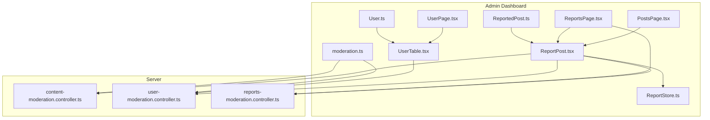
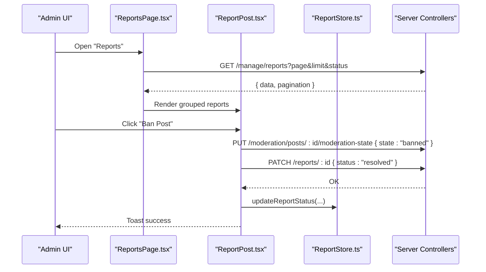
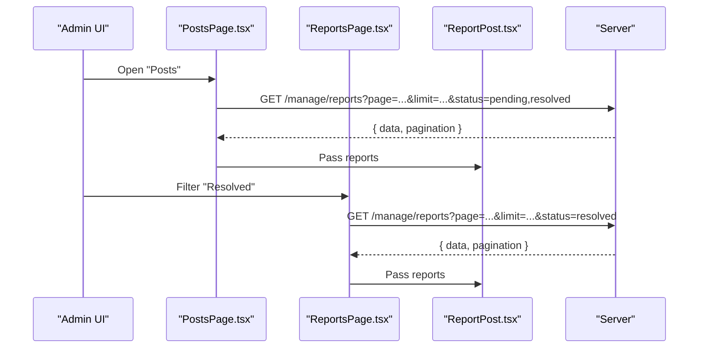
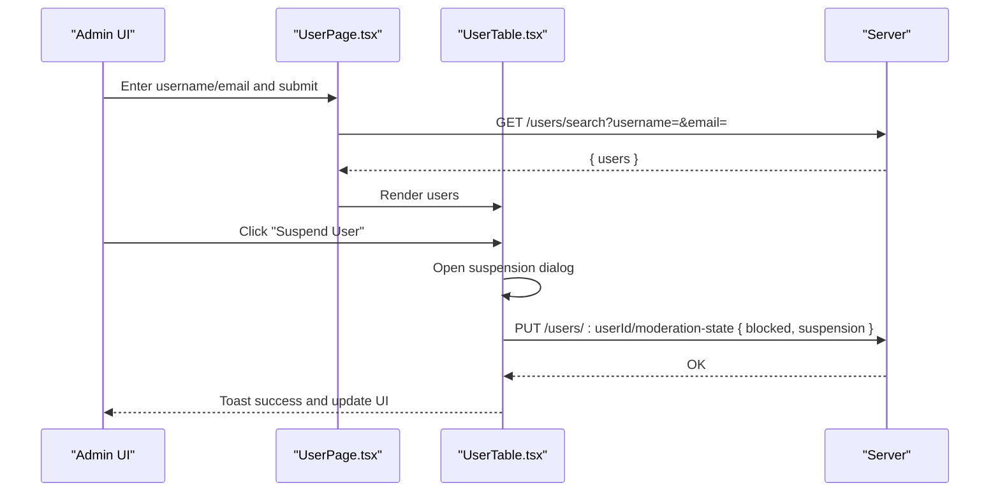
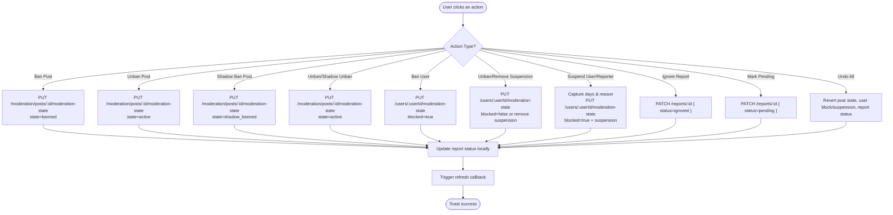
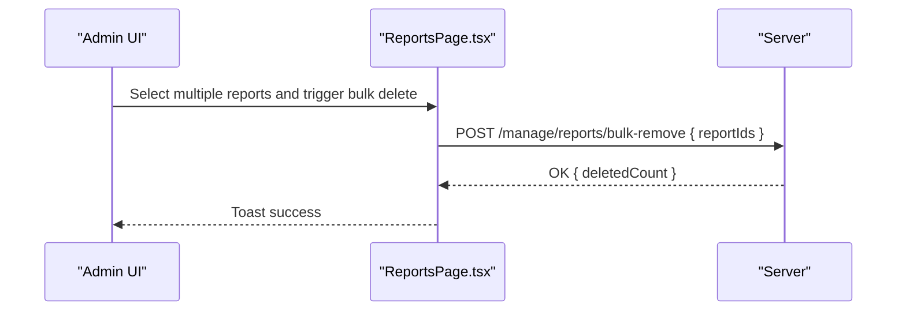
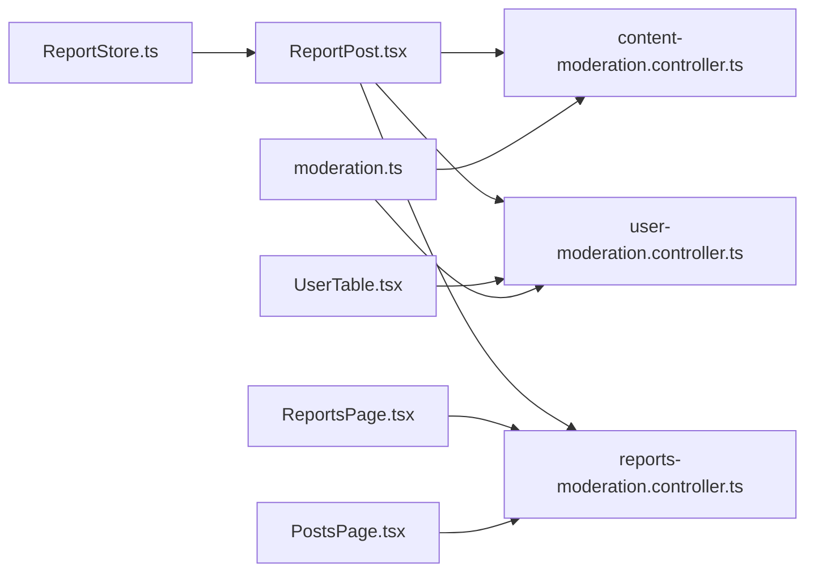

# Content Management

<cite>
**Referenced Files in This Document**
- [PostsPage.tsx](file://admin/src/pages/PostsPage.tsx)
- [ReportsPage.tsx](file://admin/src/pages/ReportsPage.tsx)
- [UserPage.tsx](file://admin/src/pages/UserPage.tsx)
- [ReportPost.tsx](file://admin/src/components/general/ReportPost.tsx)
- [UserTable.tsx](file://admin/src/components/general/UserTable.tsx)
- [ReportStore.ts](file://admin/src/store/ReportStore.ts)
- [moderation.ts](file://admin/src/services/api/moderation.ts)
- [ReportedPost.ts](file://admin/src/types/ReportedPost.ts)
- [User.ts](file://admin/src/types/User.ts)
- [content-moderation.controller.ts](file://server/src/modules/moderation/content/content-moderation.controller.ts)
- [user-moderation.controller.ts](file://server/src/modules/moderation/user/user-moderation.controller.ts)
- [reports-moderation.controller.ts](file://server/src/modules/moderation/reports/reports-moderation.controller.ts)
</cite>

## Table of Contents
1. [Introduction](#introduction)
2. [Project Structure](#project-structure)
3. [Core Components](#core-components)
4. [Architecture Overview](#architecture-overview)
5. [Detailed Component Analysis](#detailed-component-analysis)
6. [Dependency Analysis](#dependency-analysis)
7. [Performance Considerations](#performance-considerations)
8. [Troubleshooting Guide](#troubleshooting-guide)
9. [Conclusion](#conclusion)
10. [Appendices](#appendices)

## Introduction
This document describes the content management system within the admin dashboard. It covers post management interfaces, user moderation tools, and content oversight workflows. It explains post filtering, user search, and content review mechanisms, and documents bulk moderation actions, user blocking/unblocking, and content removal processes. It also details integrations with the content management APIs, real-time updates via local state, and administrative controls. Examples of moderation workflows and oversight procedures are included to guide administrators.

## Project Structure
The admin dashboard organizes moderation concerns into dedicated pages and reusable components:
- Pages:
  - Posts: lists reported posts with pagination and refresh.
  - Reports: filters reports by status and supports refresh.
  - User Management: lists users, applies search filters, and manages blocks/suspensions.
- Components:
  - ReportPost: renders grouped reports, exposes moderation actions, and handles suspension dialogs.
  - UserTable: renders user list, exposes block/suspend actions, and handles suspension dialogs.
- Stores and Types:
  - ReportStore: maintains local state for reports and updates statuses after moderation actions.
  - Types: strongly-typed shapes for ReportedPost and User.
- Services:
  - moderation.ts: typed client for banned-word moderation configuration and word management.

**Diagram sources**
- [PostsPage.tsx](file://admin/src/pages/PostsPage.tsx#L1-L68)
- [ReportsPage.tsx](file://admin/src/pages/ReportsPage.tsx#L1-L122)
- [UserPage.tsx](file://admin/src/pages/UserPage.tsx#L1-L235)
- [ReportPost.tsx](file://admin/src/components/general/ReportPost.tsx#L1-L503)
- [UserTable.tsx](file://admin/src/components/general/UserTable.tsx#L1-L323)
- [ReportStore.ts](file://admin/src/store/ReportStore.ts#L1-L43)
- [moderation.ts](file://admin/src/services/api/moderation.ts#L1-L49)
- [ReportedPost.ts](file://admin/src/types/ReportedPost.ts#L1-L28)
- [User.ts](file://admin/src/types/User.ts#L1-L16)
- [content-moderation.controller.ts](file://server/src/modules/moderation/content/content-moderation.controller.ts#L1-L90)
- [user-moderation.controller.ts](file://server/src/modules/moderation/user/user-moderation.controller.ts#L1-L82)
- [reports-moderation.controller.ts](file://server/src/modules/moderation/reports/reports-moderation.controller.ts#L1-L86)

**Section sources**
- [PostsPage.tsx](file://admin/src/pages/PostsPage.tsx#L1-L68)
- [ReportsPage.tsx](file://admin/src/pages/ReportsPage.tsx#L1-L122)
- [UserPage.tsx](file://admin/src/pages/UserPage.tsx#L1-L235)
- [ReportPost.tsx](file://admin/src/components/general/ReportPost.tsx#L1-L503)
- [UserTable.tsx](file://admin/src/components/general/UserTable.tsx#L1-L323)
- [ReportStore.ts](file://admin/src/store/ReportStore.ts#L1-L43)
- [moderation.ts](file://admin/src/services/api/moderation.ts#L1-L49)
- [ReportedPost.ts](file://admin/src/types/ReportedPost.ts#L1-L28)
- [User.ts](file://admin/src/types/User.ts#L1-L16)

## Core Components
- PostsPage: Fetches and displays reported posts with pagination and status filters. Supports manual refresh.
- ReportsPage: Filters reports by status (pending/resolved/ignored) and paginates results.
- ReportPost: Renders grouped reports, exposes moderation actions per report, and updates local state.
- UserPage: Lists users with pagination and search filters (username/email). Shows statistics and supports block/suspend actions.
- UserTable: Renders user rows with actions (block/unblock, suspend/remove suspension) and handles suspension dialogs.
- ReportStore: Maintains local report state and updates statuses after actions.
- moderation.ts: Typed client for banned-word moderation configuration and CRUD operations.

Key responsibilities:
- Post filtering and review: PostsPage and ReportsPage provide filtered views of reported content.
- User search and moderation: UserPage and UserTable enable targeted user queries and administrative actions.
- Bulk moderation actions: ReportPost supports per-report actions; ReportsPage supports bulk deletion via server-side route.
- Real-time updates: Local state updates via ReportStore and direct UI updates in UserTable after actions.

**Section sources**
- [PostsPage.tsx](file://admin/src/pages/PostsPage.tsx#L1-L68)
- [ReportsPage.tsx](file://admin/src/pages/ReportsPage.tsx#L1-L122)
- [ReportPost.tsx](file://admin/src/components/general/ReportPost.tsx#L1-L503)
- [UserPage.tsx](file://admin/src/pages/UserPage.tsx#L1-L235)
- [UserTable.tsx](file://admin/src/components/general/UserTable.tsx#L1-L323)
- [ReportStore.ts](file://admin/src/store/ReportStore.ts#L1-L43)
- [moderation.ts](file://admin/src/services/api/moderation.ts#L1-L49)

## Architecture Overview
The admin dashboard integrates with server-side moderation endpoints to perform actions such as banning/unbanning posts, shadow-banning posts, blocking/unblocking users, suspending users, and updating report statuses. The UI components call HTTP endpoints and update local state to reflect changes immediately.

**Diagram sources**
- [ReportsPage.tsx](file://admin/src/pages/ReportsPage.tsx#L24-L61)
- [ReportPost.tsx](file://admin/src/components/general/ReportPost.tsx#L61-L90)
- [ReportStore.ts](file://admin/src/store/ReportStore.ts#L14-L26)
- [content-moderation.controller.ts](file://server/src/modules/moderation/content/content-moderation.controller.ts#L31-L61)
- [reports-moderation.controller.ts](file://server/src/modules/moderation/reports/reports-moderation.controller.ts#L61-L68)

## Detailed Component Analysis

### Post Management Interfaces
- PostsPage:
  - Fetches reports with pagination and a comma-separated status filter.
  - Provides a refresh button and pagination controls.
  - Renders ReportPost to display grouped reports and actions.
- ReportsPage:
  - Manages status filter (pending/resolved/ignored) and resets page when filter changes.
  - Builds query parameters and fetches paginated reports.
  - Renders ReportPost and pagination when applicable.

**Diagram sources**
- [PostsPage.tsx](file://admin/src/pages/PostsPage.tsx#L20-L42)
- [ReportsPage.tsx](file://admin/src/pages/ReportsPage.tsx#L24-L69)
- [ReportPost.tsx](file://admin/src/components/general/ReportPost.tsx#L1-L503)

**Section sources**
- [PostsPage.tsx](file://admin/src/pages/PostsPage.tsx#L1-L68)
- [ReportsPage.tsx](file://admin/src/pages/ReportsPage.tsx#L1-L122)

### User Moderation Tools
- UserPage:
  - Implements search by username and/or email via a dedicated endpoint.
  - Falls back to paginated listing when filters are empty.
  - Computes statistics for blocked/suspended/active users.
- UserTable:
  - Renders user rows with profile preview, branch, blocked status, and suspension info.
  - Exposes actions: block/unblock, suspend/remove suspension.
  - Handles suspension dialog inputs and validates days and reason.

**Diagram sources**
- [UserPage.tsx](file://admin/src/pages/UserPage.tsx#L73-L117)
- [UserTable.tsx](file://admin/src/components/general/UserTable.tsx#L48-L116)
- [user-moderation.controller.ts](file://server/src/modules/moderation/user/user-moderation.controller.ts#L48-L71)

**Section sources**
- [UserPage.tsx](file://admin/src/pages/UserPage.tsx#L1-L235)
- [UserTable.tsx](file://admin/src/components/general/UserTable.tsx#L1-L323)

### Content Review Mechanisms
- ReportPost:
  - Groups reports by target (post/comment) and renders actionable rows with status badges.
  - Provides actions: ban/unban post, shadow ban/unban post, ban/unban user, suspend/un_suspend user/reporter, mark pending, ignore report, undo all actions.
  - Uses a suspension dialog to capture days and reason for suspension actions.
  - Updates local state via ReportStore and triggers refresh callbacks.

**Diagram sources**
- [ReportPost.tsx](file://admin/src/components/general/ReportPost.tsx#L92-L207)
- [ReportStore.ts](file://admin/src/store/ReportStore.ts#L14-L26)
- [content-moderation.controller.ts](file://server/src/modules/moderation/content/content-moderation.controller.ts#L31-L61)
- [user-moderation.controller.ts](file://server/src/modules/moderation/user/user-moderation.controller.ts#L48-L71)
- [reports-moderation.controller.ts](file://server/src/modules/moderation/reports/reports-moderation.controller.ts#L61-L68)

**Section sources**
- [ReportPost.tsx](file://admin/src/components/general/ReportPost.tsx#L1-L503)
- [ReportStore.ts](file://admin/src/store/ReportStore.ts#L1-L43)

### Bulk Moderation Actions
- Reports bulk deletion:
  - ReportsPage uses a server route supporting bulk removal of reports.
  - The UI constructs a request body with report IDs and calls the endpoint.
- Post/user moderation:
  - Per-action endpoints are used for individual targets (ban/unban, shadow ban, block/unblock, suspend/remove suspension).
  - These actions are triggered from ReportPost and UserTable.

**Diagram sources**
- [reports-moderation.controller.ts](file://server/src/modules/moderation/reports/reports-moderation.controller.ts#L77-L82)
- [ReportsPage.tsx](file://admin/src/pages/ReportsPage.tsx#L24-L61)

**Section sources**
- [reports-moderation.controller.ts](file://server/src/modules/moderation/reports/reports-moderation.controller.ts#L1-L86)
- [ReportsPage.tsx](file://admin/src/pages/ReportsPage.tsx#L1-L122)

### Content Removal Processes
- Post removal:
  - Ban: PUT /moderation/posts/:id/moderation-state with state=banned.
  - Shadow ban: PUT /moderation/posts/:id/moderation-state with state=shadow_banned.
  - Unban/Shadow unban: PUT with state=active.
- Comment removal:
  - Ban: PUT /moderation/comments/:id/moderation-state with state=banned.
  - Unban: PUT with state=active.
- Report status updates:
  - PATCH /reports/:id to change status to resolved/ignored/pending.

**Section sources**
- [content-moderation.controller.ts](file://server/src/modules/moderation/content/content-moderation.controller.ts#L31-L86)
- [reports-moderation.controller.ts](file://server/src/modules/moderation/reports/reports-moderation.controller.ts#L61-L68)

### User Blocking/Unblocking and Suspension Controls
- Block/Unblock:
  - PUT /users/:userId/moderation-state with blocked=true/false.
- Suspension:
  - PUT /users/:userId/moderation-state with blocked=true and suspension { ends, reason }.
  - Remove suspension: PUT with blocked=false or remove suspension payload.
- Suspension dialog validation:
  - Days must be a positive integer; reason is required.

**Section sources**
- [user-moderation.controller.ts](file://server/src/modules/moderation/user/user-moderation.controller.ts#L48-L71)
- [UserTable.tsx](file://admin/src/components/general/UserTable.tsx#L122-L144)

### Integration with Content Management APIs
- Banned word moderation:
  - getConfig: GET /moderation/config
  - listWords: GET /moderation/words
  - createWord: POST /moderation/words
  - updateWord: PATCH /moderation/words/:id
  - deleteWord: DELETE /moderation/words/:id
- These endpoints are consumed via the typed client in moderation.ts.

**Section sources**
- [moderation.ts](file://admin/src/services/api/moderation.ts#L1-L49)

### Real-Time Updates and Administrative Controls
- Local state updates:
  - ReportStore updates report statuses after actions to reflect changes instantly.
- UI-driven refresh:
  - ReportPost and ReportsPage trigger refresh callbacks to re-fetch data after actions.
- Administrative controls:
  - Status badges and action menus provide contextual controls based on current state (e.g., disable actions when already applied).

**Section sources**
- [ReportStore.ts](file://admin/src/store/ReportStore.ts#L1-L43)
- [ReportPost.tsx](file://admin/src/components/general/ReportPost.tsx#L197-L207)
- [ReportsPage.tsx](file://admin/src/pages/ReportsPage.tsx#L104-L117)

## Dependency Analysis
- Frontend-to-Backend:
  - ReportPost and UserTable call server endpoints for moderation actions.
  - ReportsPage and PostsPage call report listing endpoints with pagination and status filters.
  - moderation.ts integrates with banned-word moderation endpoints.
- Backend Controllers:
  - content-moderation.controller.ts: handles post/comment moderation state updates.
  - user-moderation.controller.ts: handles user block/suspend/unblock operations.
  - reports-moderation.controller.ts: handles report creation, listing, status updates, and bulk deletion.
- State Management:
  - ReportStore maintains normalized report state and updates nested report statuses.

**Diagram sources**
- [ReportPost.tsx](file://admin/src/components/general/ReportPost.tsx#L61-L90)
- [UserTable.tsx](file://admin/src/components/general/UserTable.tsx#L55-L71)
- [ReportsPage.tsx](file://admin/src/pages/ReportsPage.tsx#L36-L41)
- [PostsPage.tsx](file://admin/src/pages/PostsPage.tsx#L24-L28)
- [ReportStore.ts](file://admin/src/store/ReportStore.ts#L14-L26)
- [moderation.ts](file://admin/src/services/api/moderation.ts#L24-L47)
- [content-moderation.controller.ts](file://server/src/modules/moderation/content/content-moderation.controller.ts#L31-L86)
- [user-moderation.controller.ts](file://server/src/modules/moderation/user/user-moderation.controller.ts#L48-L79)
- [reports-moderation.controller.ts](file://server/src/modules/moderation/reports/reports-moderation.controller.ts#L25-L82)

**Section sources**
- [ReportPost.tsx](file://admin/src/components/general/ReportPost.tsx#L1-L503)
- [UserTable.tsx](file://admin/src/components/general/UserTable.tsx#L1-L323)
- [ReportsPage.tsx](file://admin/src/pages/ReportsPage.tsx#L1-L122)
- [PostsPage.tsx](file://admin/src/pages/PostsPage.tsx#L1-L68)
- [ReportStore.ts](file://admin/src/store/ReportStore.ts#L1-L43)
- [moderation.ts](file://admin/src/services/api/moderation.ts#L1-L49)
- [content-moderation.controller.ts](file://server/src/modules/moderation/content/content-moderation.controller.ts#L1-L90)
- [user-moderation.controller.ts](file://server/src/modules/moderation/user/user-moderation.controller.ts#L1-L82)
- [reports-moderation.controller.ts](file://server/src/modules/moderation/reports/reports-moderation.controller.ts#L1-L86)

## Performance Considerations
- Pagination:
  - PostsPage and ReportsPage use fixed limits and compute total pages to avoid loading large datasets at once.
- Local state updates:
  - ReportStore updates only affected records, minimizing re-renders.
- Best-effort moderation:
  - Server-side controllers wrap operations to ignore idempotent errors (e.g., already banned/not banned), reducing retries and improving resilience.

[No sources needed since this section provides general guidance]

## Troubleshooting Guide
Common issues and resolutions:
- Invalid response from server:
  - ReportsPage validates response shape and shows user-friendly messages.
- Action conflicts:
  - ReportPost disables actions when already applied (e.g., ban/unban toggles).
- Suspension dialog validation:
  - UserTable validates days and reason before submitting suspension requests.
- Idempotent errors:
  - Server-side moderation controllers ignore repeated state changes to prevent failures.

**Section sources**
- [ReportsPage.tsx](file://admin/src/pages/ReportsPage.tsx#L42-L61)
- [ReportPost.tsx](file://admin/src/components/general/ReportPost.tsx#L356-L438)
- [UserTable.tsx](file://admin/src/components/general/UserTable.tsx#L122-L144)
- [content-moderation.controller.ts](file://server/src/modules/moderation/content/content-moderation.controller.ts#L7-L27)
- [user-moderation.controller.ts](file://server/src/modules/moderation/user/user-moderation.controller.ts#L9-L24)

## Conclusion
The admin dashboard provides a comprehensive suite of tools for content oversight and user moderation. Administrators can filter and review reports, manage user blocks and suspensions, and enforce content policies through targeted actions. The UI integrates with server endpoints to perform moderation tasks and updates local state for immediate feedback. Bulk moderation and banned-word management further streamline administrative workflows.

[No sources needed since this section summarizes without analyzing specific files]

## Appendices

### Example Workflows

- Content moderation workflow:
  - Open Reports page, filter by pending.
  - Review grouped reports; choose action (ban post, shadow ban, unban, ignore).
  - Confirm suspension dialog if needed; observe toast and local state update.

- User management task:
  - Open User Management page, apply username/email filters.
  - Search users; click actions (block, unblock, suspend, remove suspension).
  - Observe updated badges and suspension status.

- System oversight procedure:
  - Use Posts page to refresh and inspect recent reports.
  - Apply banned-word moderation via moderation.ts endpoints.
  - Monitor statistics and adjust filters to focus on high-priority items.

**Section sources**
- [ReportsPage.tsx](file://admin/src/pages/ReportsPage.tsx#L72-L118)
- [ReportPost.tsx](file://admin/src/components/general/ReportPost.tsx#L92-L207)
- [UserPage.tsx](file://admin/src/pages/UserPage.tsx#L73-L117)
- [UserTable.tsx](file://admin/src/components/general/UserTable.tsx#L48-L116)
- [moderation.ts](file://admin/src/services/api/moderation.ts#L24-L47)