# Institutional Organization

<cite>
**Referenced Files in This Document**
- [CollegePage.tsx](file://admin/src/pages/CollegePage.tsx)
- [BranchPage.tsx](file://admin/src/pages/BranchPage.tsx)
- [CollegeRequestTable.tsx](file://admin/src/components/general/CollegeRequestTable.tsx)
- [CollegeTable.tsx](file://admin/src/components/general/CollegeTable.tsx)
- [CollegeForm.tsx](file://admin/src/components/forms/CollegeForm.tsx)
- [College.ts](file://admin/src/types/College.ts)
- [CollegeRequest.ts](file://admin/src/types/CollegeRequest.ts)
- [http.ts](file://admin/src/services/http.ts)
- [college.controller.ts](file://server/src/modules/college/college.controller.ts)
- [college.route.ts](file://server/src/modules/college/college.route.ts)
- [college.service.ts](file://server/src/modules/college/college.service.ts)
- [college.schema.ts](file://server/src/modules/college/college.schema.ts)
- [college.types.ts](file://server/src/modules/college/college.types.ts)
- [college.adapter.ts](file://server/src/infra/db/adapters/college.adapter.ts)
- [college-branch.table.ts](file://server/src/infra/db/tables/college-branch.table.ts)
- [branch.table.ts](file://server/src/infra/db/tables/branch.table.ts)
- [branch.service.ts](file://server/src/modules/admin/branch/branch.service.ts)
- [branch.controller.ts](file://server/src/modules/admin/branch/branch.controller.ts)
- [branch.schema.ts](file://server/src/modules/admin/branch/branch.schema.ts)
- [0001_flat_mathemanic.sql](file://server/drizzle/0001_flat_mathemanic.sql)
- [0002_perfect_drax.sql](file://server/drizzle/0002_perfect_drax.sql)
</cite>

## Table of Contents
1. [Introduction](#introduction)
2. [Project Structure](#project-structure)
3. [Core Components](#core-components)
4. [Architecture Overview](#architecture-overview)
5. [Detailed Component Analysis](#detailed-component-analysis)
6. [Dependency Analysis](#dependency-analysis)
7. [Performance Considerations](#performance-considerations)
8. [Troubleshooting Guide](#troubleshooting-guide)
9. [Conclusion](#conclusion)
10. [Appendices](#appendices)

## Introduction
This document describes the institutional organization management capabilities in the admin dashboard. It covers the college administration interface, branch management systems, and institutional hierarchy controls. It also documents the college approval workflows, branch creation processes, institutional relationship management, integration with institutional APIs, data validation processes, and administrative oversight tools. Examples of college onboarding, branch configuration, and institutional governance workflows are included to guide administrators through typical tasks.

## Project Structure
The institutional organization management spans the admin frontend and the server backend:
- Admin frontend pages and components manage college and branch records, display requests, and orchestrate approval workflows.
- Server backend exposes REST endpoints for colleges and branches, enforces validation, and manages institutional relationships.

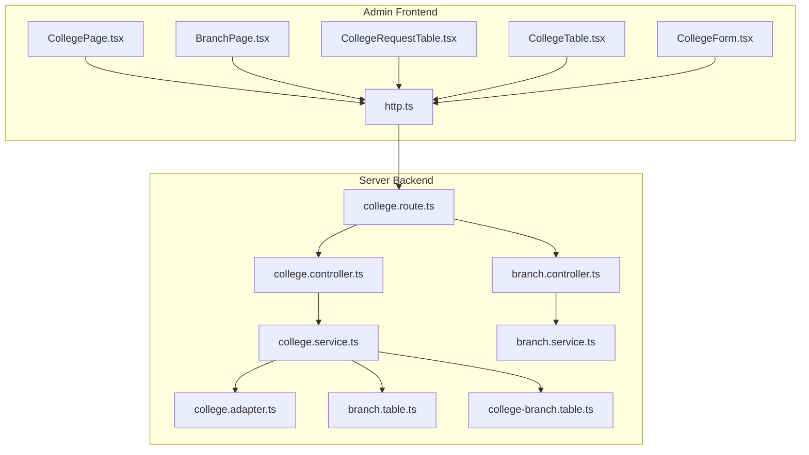

**Diagram sources**
- [CollegePage.tsx](file://admin/src/pages/CollegePage.tsx#L1-L98)
- [BranchPage.tsx](file://admin/src/pages/BranchPage.tsx#L1-L142)
- [CollegeRequestTable.tsx](file://admin/src/components/general/CollegeRequestTable.tsx#L1-L145)
- [CollegeTable.tsx](file://admin/src/components/general/CollegeTable.tsx#L1-L95)
- [CollegeForm.tsx](file://admin/src/components/forms/CollegeForm.tsx#L1-L432)
- [http.ts](file://admin/src/services/http.ts#L1-L51)
- [college.route.ts](file://server/src/modules/college/college.route.ts#L1-L19)
- [college.controller.ts](file://server/src/modules/college/college.controller.ts#L1-L109)
- [college.service.ts](file://server/src/modules/college/college.service.ts#L1-L284)
- [college.adapter.ts](file://server/src/infra/db/adapters/college.adapter.ts#L60-L113)
- [branch.service.ts](file://server/src/modules/admin/branch/branch.service.ts#L1-L30)
- [branch.controller.ts](file://server/src/modules/admin/branch/branch.controller.ts#L1-L33)
- [branch.table.ts](file://server/src/infra/db/tables/branch.table.ts#L1-L16)
- [college-branch.table.ts](file://server/src/infra/db/tables/college-branch.table.ts#L1-L31)

**Section sources**
- [CollegePage.tsx](file://admin/src/pages/CollegePage.tsx#L1-L98)
- [BranchPage.tsx](file://admin/src/pages/BranchPage.tsx#L1-L142)
- [college.route.ts](file://server/src/modules/college/college.route.ts#L1-L19)
- [branch.controller.ts](file://server/src/modules/admin/branch/branch.controller.ts#L1-L33)

## Core Components
- Admin Pages
  - CollegePage: Lists colleges and displays pending college requests; supports creating colleges and approving/rejecting requests.
  - BranchPage: Manages branch catalog (create, delete) and displays current branches.
- Admin Components
  - CollegeTable: Displays college records with editable actions.
  - CollegeRequestTable: Shows pending requests and allows approval (with inline form) or rejection.
  - CollegeForm: Handles creation and editing of colleges, including profile image upload and branch selection.
- Types
  - College and CollegeRequest define the data contracts used by the admin UI.
- HTTP Client
  - http.ts and rootHttp.ts provide base URLs and interceptors for API communication.

Key responsibilities:
- Admin UI orchestrates CRUD operations and approval workflows.
- Server validates inputs, enforces uniqueness and domain checks, and maintains institutional relationships.

**Section sources**
- [CollegePage.tsx](file://admin/src/pages/CollegePage.tsx#L1-L98)
- [BranchPage.tsx](file://admin/src/pages/BranchPage.tsx#L1-L142)
- [CollegeRequestTable.tsx](file://admin/src/components/general/CollegeRequestTable.tsx#L1-L145)
- [CollegeTable.tsx](file://admin/src/components/general/CollegeTable.tsx#L1-L95)
- [CollegeForm.tsx](file://admin/src/components/forms/CollegeForm.tsx#L1-L432)
- [College.ts](file://admin/src/types/College.ts#L1-L10)
- [CollegeRequest.ts](file://admin/src/types/CollegeRequest.ts#L1-L14)
- [http.ts](file://admin/src/services/http.ts#L1-L51)

## Architecture Overview
The admin dashboard integrates with the server backend through typed HTTP clients. The backend enforces validation, manages institutional relationships, and records audit events.

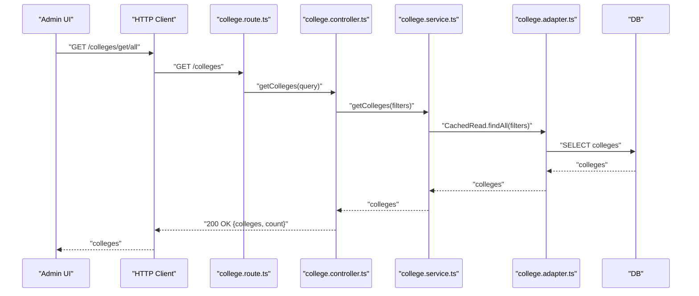

**Diagram sources**
- [college.route.ts](file://server/src/modules/college/college.route.ts#L10-L11)
- [college.controller.ts](file://server/src/modules/college/college.controller.ts#L26-L37)
- [college.service.ts](file://server/src/modules/college/college.service.ts#L80-L86)
- [college.adapter.ts](file://server/src/infra/db/adapters/college.adapter.ts#L60-L83)
- [http.ts](file://admin/src/services/http.ts#L1-L51)

## Detailed Component Analysis

### College Administration Interface
The CollegePage aggregates two primary views:
- Colleges list with edit actions.
- Pending college requests with approval/rejection actions.

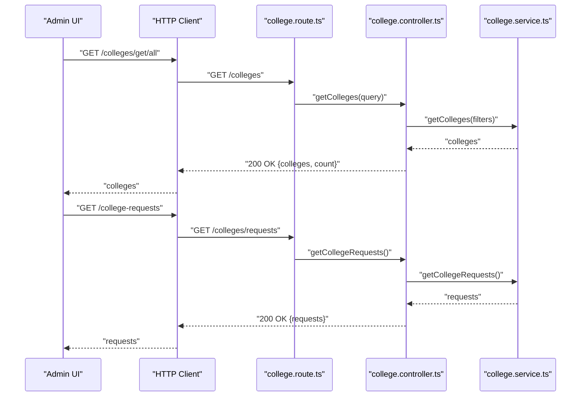

**Diagram sources**
- [CollegePage.tsx](file://admin/src/pages/CollegePage.tsx#L19-L42)
- [college.route.ts](file://server/src/modules/college/college.route.ts#L12-L12)
- [college.controller.ts](file://server/src/modules/college/college.controller.ts#L69-L75)
- [college.service.ts](file://server/src/modules/college/college.service.ts#L157-L162)

**Section sources**
- [CollegePage.tsx](file://admin/src/pages/CollegePage.tsx#L1-L98)
- [college.controller.ts](file://server/src/modules/college/college.controller.ts#L26-L75)
- [college.service.ts](file://server/src/modules/college/college.service.ts#L80-L162)

### Branch Management Systems
BranchPage provides:
- Listing all branches.
- Creating new branches with name and code.
- Deleting branches.

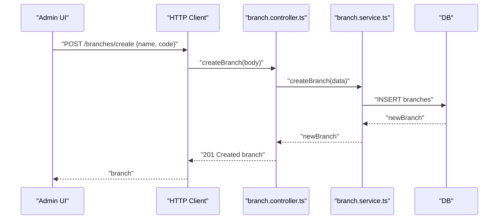

**Diagram sources**
- [BranchPage.tsx](file://admin/src/pages/BranchPage.tsx#L43-L60)
- [branch.controller.ts](file://server/src/modules/admin/branch/branch.controller.ts#L13-L16)
- [branch.service.ts](file://server/src/modules/admin/branch/branch.service.ts#L11-L14)

**Section sources**
- [BranchPage.tsx](file://admin/src/pages/BranchPage.tsx#L1-L142)
- [branch.controller.ts](file://server/src/modules/admin/branch/branch.controller.ts#L1-L33)
- [branch.service.ts](file://server/src/modules/admin/branch/branch.service.ts#L1-L30)

### Institutional Hierarchy Controls
Institutional hierarchy is modeled via a many-to-many relationship between colleges and branches:
- A college can have multiple branches.
- A branch can be associated with multiple colleges.
- The join table tracks these associations and ensures uniqueness per college-branch pair.

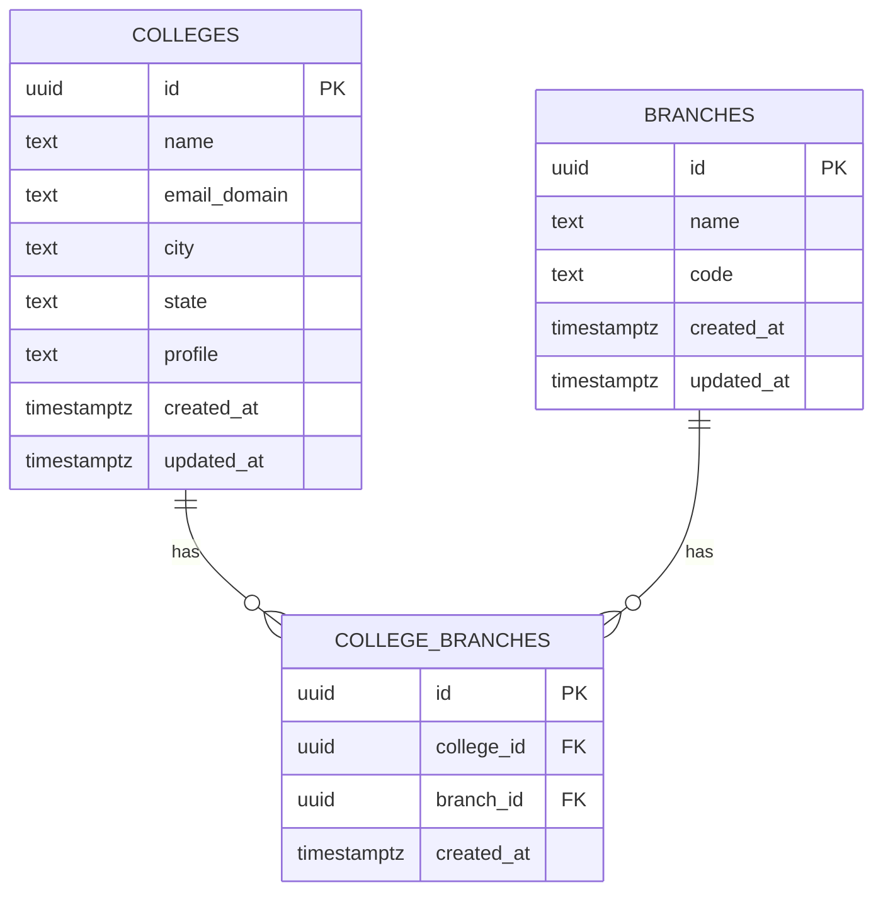

**Diagram sources**
- [college-branch.table.ts](file://server/src/infra/db/tables/college-branch.table.ts#L11-L31)
- [branch.table.ts](file://server/src/infra/db/tables/branch.table.ts#L3-L11)
- [0001_flat_mathemanic.sql](file://server/drizzle/0001_flat_mathemanic.sql#L1-L1)
- [0002_perfect_drax.sql](file://server/drizzle/0002_perfect_drax.sql#L1-L10)

**Section sources**
- [college-branch.table.ts](file://server/src/infra/db/tables/college-branch.table.ts#L1-L31)
- [branch.table.ts](file://server/src/infra/db/tables/branch.table.ts#L1-L16)
- [0001_flat_mathemanic.sql](file://server/drizzle/0001_flat_mathemanic.sql#L1-L1)
- [0002_perfect_drax.sql](file://server/drizzle/0002_perfect_drax.sql#L1-L10)

### College Approval Workflows
Pending college requests are reviewed and resolved by:
- Approving a request and creating a college from the request details.
- Rejecting a request and closing it.

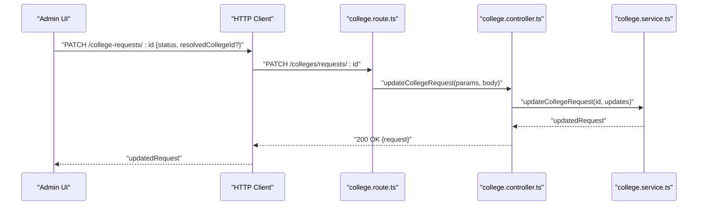

**Diagram sources**
- [CollegeRequestTable.tsx](file://admin/src/components/general/CollegeRequestTable.tsx#L34-L59)
- [college.route.ts](file://server/src/modules/college/college.route.ts#L17-L17)
- [college.controller.ts](file://server/src/modules/college/college.controller.ts#L77-L86)
- [college.service.ts](file://server/src/modules/college/college.service.ts#L164-L181)

**Section sources**
- [CollegeRequestTable.tsx](file://admin/src/components/general/CollegeRequestTable.tsx#L1-L145)
- [college.controller.ts](file://server/src/modules/college/college.controller.ts#L59-L86)
- [college.service.ts](file://server/src/modules/college/college.service.ts#L120-L181)

### Branch Creation Processes
Branch creation is validated and persisted:
- Validation ensures minimum length for name and code.
- Creation inserts a new branch record.

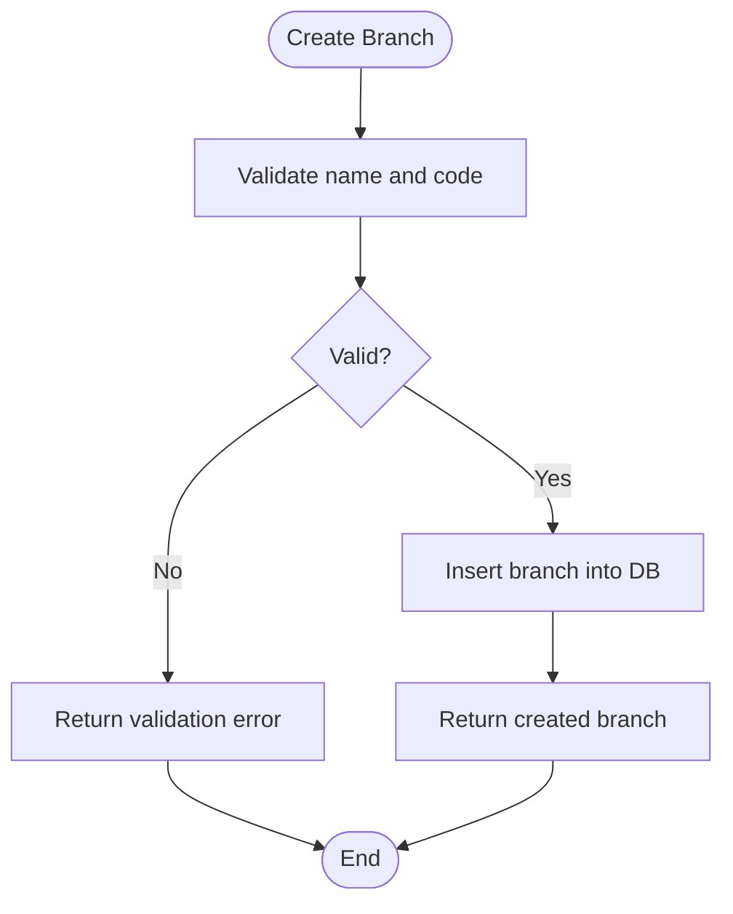

**Diagram sources**
- [branch.schema.ts](file://server/src/modules/admin/branch/branch.schema.ts#L3-L6)
- [branch.controller.ts](file://server/src/modules/admin/branch/branch.controller.ts#L13-L16)
- [branch.service.ts](file://server/src/modules/admin/branch/branch.service.ts#L11-L14)

**Section sources**
- [BranchPage.tsx](file://admin/src/pages/BranchPage.tsx#L43-L60)
- [branch.schema.ts](file://server/src/modules/admin/branch/branch.schema.ts#L1-L25)
- [branch.service.ts](file://server/src/modules/admin/branch/branch.service.ts#L1-L30)

### Institutional Relationship Management
Relationships between colleges and branches are managed via:
- Setting branches for a college during creation or update.
- Fetching branches associated with a college.

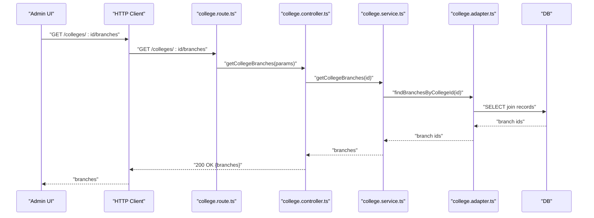

**Diagram sources**
- [college.controller.ts](file://server/src/modules/college/college.controller.ts#L49-L57)
- [college.service.ts](file://server/src/modules/college/college.service.ts#L108-L118)
- [college.adapter.ts](file://server/src/infra/db/adapters/college.adapter.ts#L60-L83)

**Section sources**
- [college.controller.ts](file://server/src/modules/college/college.controller.ts#L49-L57)
- [college.service.ts](file://server/src/modules/college/college.service.ts#L108-L118)
- [college.adapter.ts](file://server/src/infra/db/adapters/college.adapter.ts#L60-L83)

### Integration with Institutional APIs
The admin client communicates with backend endpoints using a shared HTTP client:
- Base URLs are derived from environment variables.
- Interceptors normalize responses and attach bearer tokens.

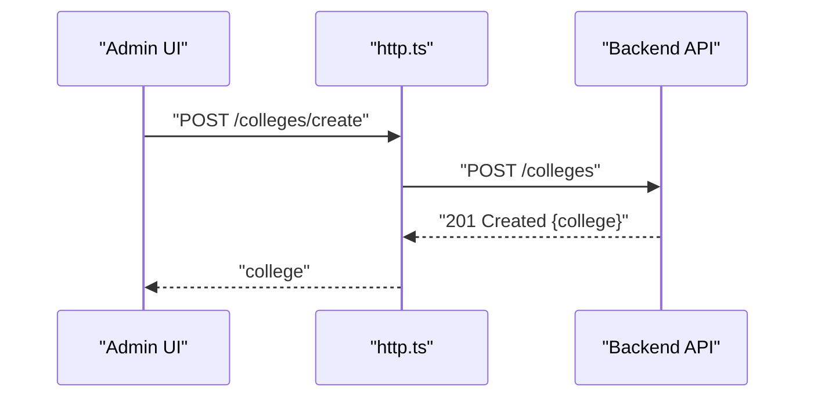

**Diagram sources**
- [http.ts](file://admin/src/services/http.ts#L1-L51)
- [college.route.ts](file://server/src/modules/college/college.route.ts#L10-L10)

**Section sources**
- [http.ts](file://admin/src/services/http.ts#L1-L51)
- [college.route.ts](file://server/src/modules/college/college.route.ts#L1-L19)

### Data Validation Processes
Validation is enforced at the server boundary:
- College creation and update validate presence and format of fields.
- College request creation validates email domain format and requester domain alignment.
- Branch creation validates name and code lengths.

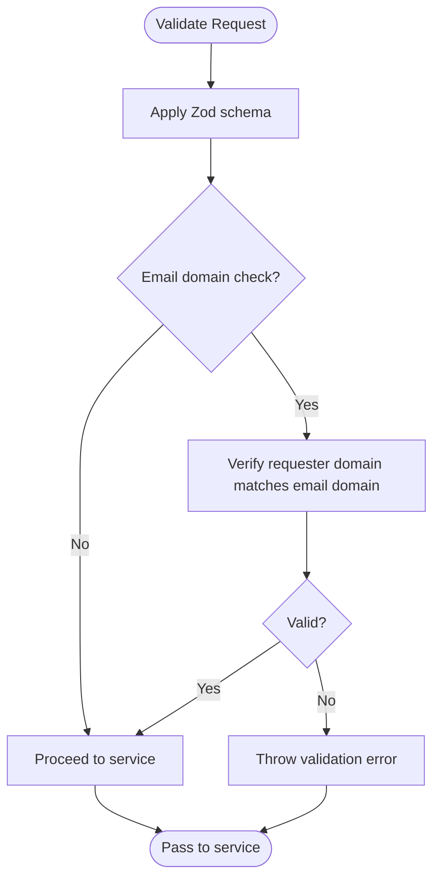

**Diagram sources**
- [college.schema.ts](file://server/src/modules/college/college.schema.ts#L37-L66)
- [branch.schema.ts](file://server/src/modules/admin/branch/branch.schema.ts#L3-L6)

**Section sources**
- [college.schema.ts](file://server/src/modules/college/college.schema.ts#L32-L66)
- [branch.schema.ts](file://server/src/modules/admin/branch/branch.schema.ts#L1-L25)

### Administrative Oversight Tools
Administrative actions are audited:
- Actions like creating, updating, and deleting colleges are recorded with before/after snapshots and metadata.

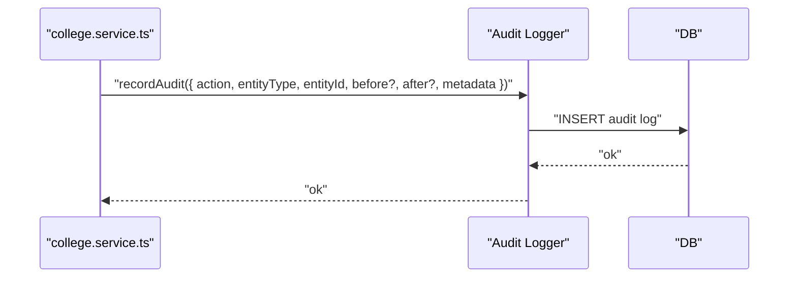

**Diagram sources**
- [college.service.ts](file://server/src/modules/college/college.service.ts#L63-L69)
- [college.service.ts](file://server/src/modules/college/college.service.ts#L235-L242)

**Section sources**
- [college.service.ts](file://server/src/modules/college/college.service.ts#L63-L78)
- [college.service.ts](file://server/src/modules/college/college.service.ts#L235-L242)

## Dependency Analysis
The admin components depend on the HTTP client and share types with the backend. The server enforces validation and persists data through adapters and tables.

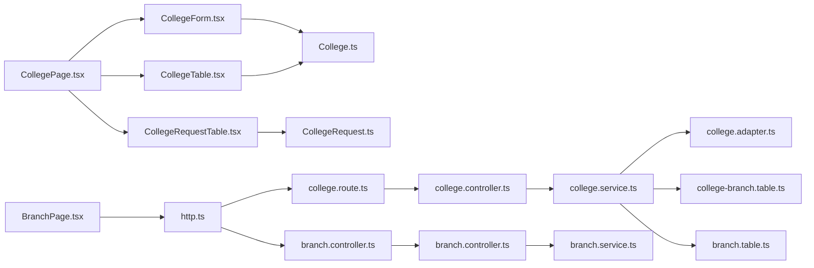

**Diagram sources**
- [CollegeForm.tsx](file://admin/src/components/forms/CollegeForm.tsx#L1-L432)
- [CollegeTable.tsx](file://admin/src/components/general/CollegeTable.tsx#L1-L95)
- [CollegeRequestTable.tsx](file://admin/src/components/general/CollegeRequestTable.tsx#L1-L145)
- [CollegePage.tsx](file://admin/src/pages/CollegePage.tsx#L1-L98)
- [BranchPage.tsx](file://admin/src/pages/BranchPage.tsx#L1-L142)
- [College.ts](file://admin/src/types/College.ts#L1-L10)
- [CollegeRequest.ts](file://admin/src/types/CollegeRequest.ts#L1-L14)
- [http.ts](file://admin/src/services/http.ts#L1-L51)
- [college.route.ts](file://server/src/modules/college/college.route.ts#L1-L19)
- [branch.controller.ts](file://server/src/modules/admin/branch/branch.controller.ts#L1-L33)
- [college.controller.ts](file://server/src/modules/college/college.controller.ts#L1-L109)
- [college.service.ts](file://server/src/modules/college/college.service.ts#L1-L284)
- [college.adapter.ts](file://server/src/infra/db/adapters/college.adapter.ts#L60-L113)
- [college-branch.table.ts](file://server/src/infra/db/tables/college-branch.table.ts#L1-L31)
- [branch.table.ts](file://server/src/infra/db/tables/branch.table.ts#L1-L16)

**Section sources**
- [CollegeForm.tsx](file://admin/src/components/forms/CollegeForm.tsx#L1-L432)
- [CollegeTable.tsx](file://admin/src/components/general/CollegeTable.tsx#L1-L95)
- [CollegeRequestTable.tsx](file://admin/src/components/general/CollegeRequestTable.tsx#L1-L145)
- [CollegePage.tsx](file://admin/src/pages/CollegePage.tsx#L1-L98)
- [BranchPage.tsx](file://admin/src/pages/BranchPage.tsx#L1-L142)
- [college.route.ts](file://server/src/modules/college/college.route.ts#L1-L19)
- [branch.controller.ts](file://server/src/modules/admin/branch/branch.controller.ts#L1-L33)

## Performance Considerations
- Batch fetching: CollegePage fetches colleges and requests concurrently to reduce latency.
- Caching: Services utilize cached reads for colleges and branches to minimize database load.
- Indexes: Branch tables include indexes on name and code to speed up lookups.
- Unique constraints: The join table ensures unique college-branch pairs to prevent duplicates.

[No sources needed since this section provides general guidance]

## Troubleshooting Guide
Common issues and resolutions:
- Validation errors on creation/edit:
  - Verify required fields and formats (e.g., email domain, name/code lengths).
  - See validation schemas for precise constraints.
- Conflict on email domain:
  - Ensure the email domain is unique; conflicts raise a conflict error.
- Requester domain mismatch:
  - The requester’s email must belong to the same domain as the requested email domain.
- Branch operations:
  - Ensure name and code meet minimum length requirements.
  - Confirm branch deletion does not violate referential integrity if used by colleges.

**Section sources**
- [college.schema.ts](file://server/src/modules/college/college.schema.ts#L37-L66)
- [branch.schema.ts](file://server/src/modules/admin/branch/branch.schema.ts#L3-L6)
- [college.service.ts](file://server/src/modules/college/college.service.ts#L34-L46)
- [college.service.ts](file://server/src/modules/college/college.service.ts#L125-L141)

## Conclusion
The admin dashboard provides a comprehensive toolkit for managing institutional organizations:
- Colleges and branches are managed through dedicated pages and forms.
- Approval workflows streamline onboarding of new colleges from requests.
- Institutional relationships are modeled with a robust many-to-many schema.
- Validation and auditing ensure data integrity and transparency.
- The HTTP client and route/controller/service layers provide a clean separation of concerns and reliable integration points.

[No sources needed since this section summarizes without analyzing specific files]

## Appendices

### Example Workflows

- College Onboarding from Request
  - Review pending request in the “College requests” section.
  - Approve the request; the system opens a form pre-filled with request data.
  - Save the form to create the college and mark the request as approved with resolution metadata.

- Branch Configuration
  - Navigate to the “Branches” page.
  - Use the “Create Branch” dialog to add a new branch with a unique name and code.
  - Assign branches to colleges during college creation or update.

- Institutional Governance
  - Use the “Colleges” table to edit college details and manage branch assignments.
  - Monitor audit logs for administrative actions performed on colleges.

**Section sources**
- [CollegeRequestTable.tsx](file://admin/src/components/general/CollegeRequestTable.tsx#L87-L124)
- [CollegeForm.tsx](file://admin/src/components/forms/CollegeForm.tsx#L172-L255)
- [BranchPage.tsx](file://admin/src/pages/BranchPage.tsx#L43-L73)
- [CollegeTable.tsx](file://admin/src/components/general/CollegeTable.tsx#L64-L83)
- [college.service.ts](file://server/src/modules/college/college.service.ts#L63-L78)