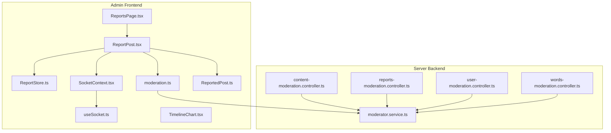
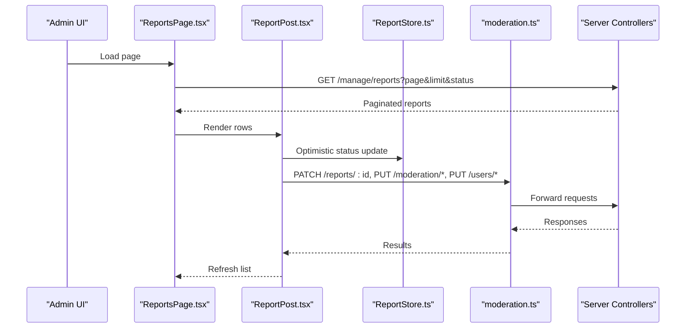
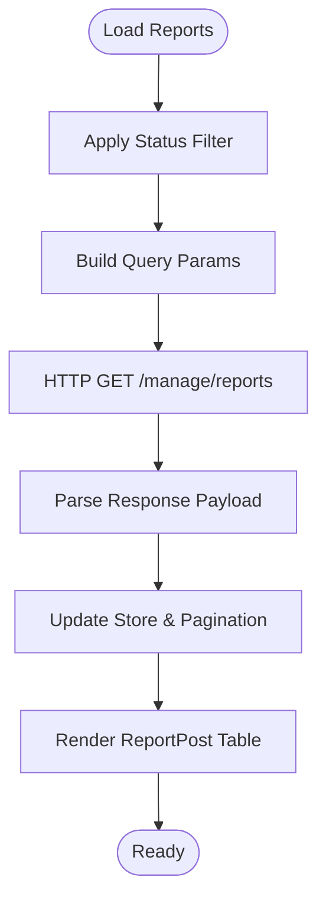
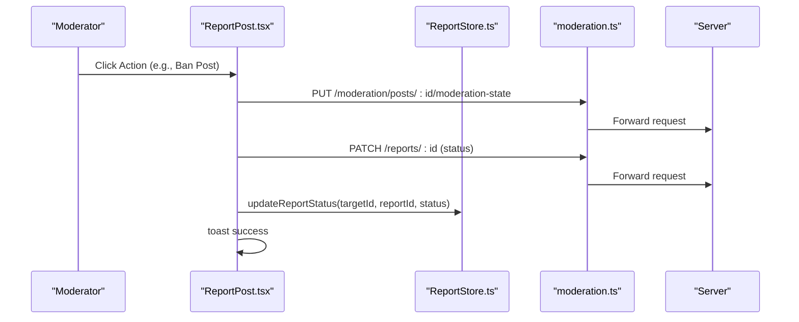
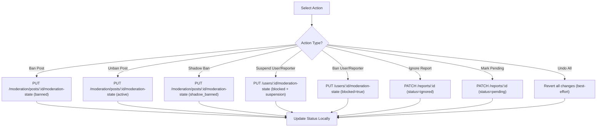
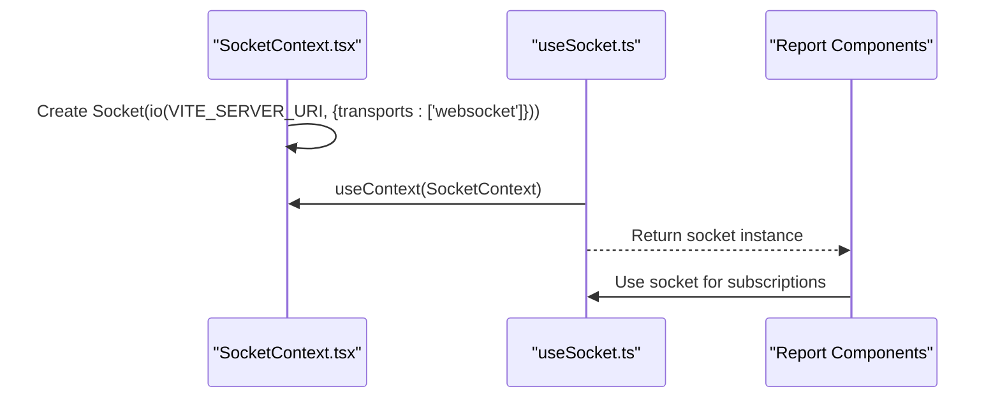
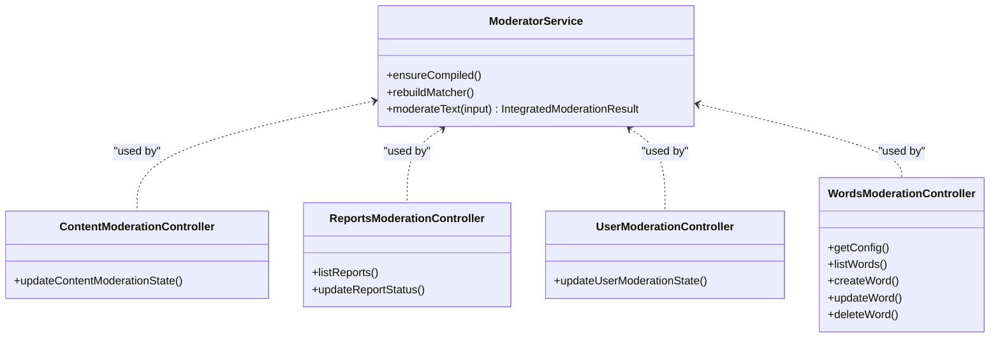
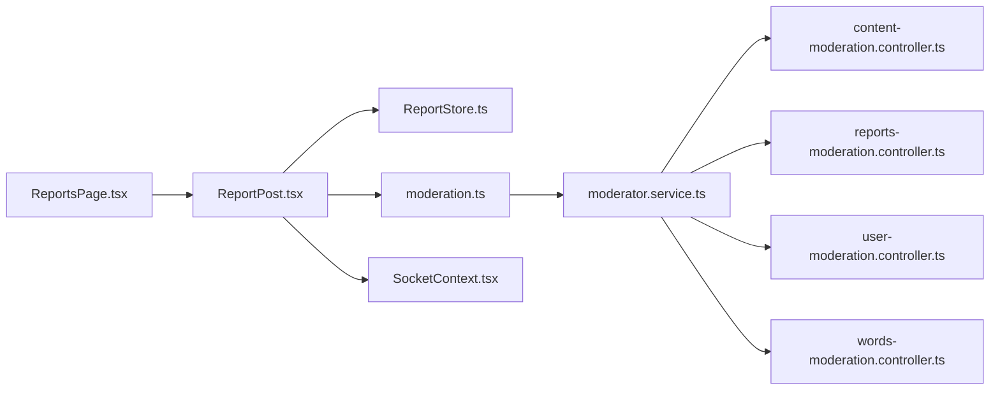

# Moderation Dashboard

<cite>
**Referenced Files in This Document**
- [ReportsPage.tsx](file://admin/src/pages/ReportsPage.tsx)
- [ReportPost.tsx](file://admin/src/components/general/ReportPost.tsx)
- [ReportStore.ts](file://admin/src/store/ReportStore.ts)
- [moderation.ts](file://admin/src/services/api/moderation.ts)
- [TimelineChart.tsx](file://admin/src/components/charts/TimelineChart.tsx)
- [SocketContext.tsx](file://admin/src/socket/SocketContext.tsx)
- [useSocket.ts](file://admin/src/socket/useSocket.ts)
- [ReportedPost.ts](file://admin/src/types/ReportedPost.ts)
- [moderator.service.ts](file://server/src/infra/services/moderator/moderator.service.ts)
- [content-moderation.controller.ts](file://server/src/modules/moderation/content/content-moderation.controller.ts)
- [reports-moderation.controller.ts](file://server/src/modules/moderation/reports/reports-moderation.controller.ts)
- [user-moderation.controller.ts](file://server/src/modules/moderation/user/user-moderation.controller.ts)
- [words-moderation.controller.ts](file://server/src/modules/moderation/words/words-moderation.controller.ts)
</cite>

## Table of Contents
1. [Introduction](#introduction)
2. [Project Structure](#project-structure)
3. [Core Components](#core-components)
4. [Architecture Overview](#architecture-overview)
5. [Detailed Component Analysis](#detailed-component-analysis)
6. [Dependency Analysis](#dependency-analysis)
7. [Performance Considerations](#performance-considerations)
8. [Troubleshooting Guide](#troubleshooting-guide)
9. [Conclusion](#conclusion)

## Introduction
This document describes the moderation dashboard functionality, focusing on overview analytics, report management, content moderation workflows, real-time reporting, moderation queues, content flagging, report categorization, resolution tracking, and administrative decision-making. It also covers integration with the reporting store, real-time updates via sockets, and moderation statistics visualization.

## Project Structure
The moderation dashboard spans the admin frontend and the server-side moderation modules:
- Admin frontend: Pages, components, stores, services, and sockets for managing reports and moderation actions.
- Server moderation modules: Controllers and services for content moderation, reports, users, and banned words.

**Diagram sources**
- [ReportsPage.tsx](file://admin/src/pages/ReportsPage.tsx#L1-L122)
- [ReportPost.tsx](file://admin/src/components/general/ReportPost.tsx#L1-L503)
- [ReportStore.ts](file://admin/src/store/ReportStore.ts#L1-L43)
- [moderation.ts](file://admin/src/services/api/moderation.ts#L1-L49)
- [SocketContext.tsx](file://admin/src/socket/SocketContext.tsx#L1-L26)
- [useSocket.ts](file://admin/src/socket/useSocket.ts#L1-L13)
- [TimelineChart.tsx](file://admin/src/components/charts/TimelineChart.tsx#L1-L47)
- [ReportedPost.ts](file://admin/src/types/ReportedPost.ts#L1-L28)
- [content-moderation.controller.ts](file://server/src/modules/moderation/content/content-moderation.controller.ts)
- [reports-moderation.controller.ts](file://server/src/modules/moderation/reports/reports-moderation.controller.ts)
- [user-moderation.controller.ts](file://server/src/modules/moderation/user/user-moderation.controller.ts)
- [words-moderation.controller.ts](file://server/src/modules/moderation/words/words-moderation.controller.ts)
- [moderator.service.ts](file://server/src/infra/services/moderator/moderator.service.ts#L1-L642)

**Section sources**
- [ReportsPage.tsx](file://admin/src/pages/ReportsPage.tsx#L1-L122)
- [ReportPost.tsx](file://admin/src/components/general/ReportPost.tsx#L1-L503)
- [ReportStore.ts](file://admin/src/store/ReportStore.ts#L1-L43)
- [moderation.ts](file://admin/src/services/api/moderation.ts#L1-L49)
- [SocketContext.tsx](file://admin/src/socket/SocketContext.tsx#L1-L26)
- [useSocket.ts](file://admin/src/socket/useSocket.ts#L1-L13)
- [TimelineChart.tsx](file://admin/src/components/charts/TimelineChart.tsx#L1-L47)
- [ReportedPost.ts](file://admin/src/types/ReportedPost.ts#L1-L28)
- [content-moderation.controller.ts](file://server/src/modules/moderation/content/content-moderation.controller.ts)
- [reports-moderation.controller.ts](file://server/src/modules/moderation/reports/reports-moderation.controller.ts)
- [user-moderation.controller.ts](file://server/src/modules/moderation/user/user-moderation.controller.ts)
- [words-moderation.controller.ts](file://server/src/modules/moderation/words/words-moderation.controller.ts)
- [moderator.service.ts](file://server/src/infra/services/moderator/moderator.service.ts#L1-L642)

## Core Components
- Reports Page: Fetches paginated reports filtered by status, renders actionable report rows, and refreshes data.
- Report Management Component: Provides moderation actions per report (ban/unban post, shadow ban, suspend/ban user/reporter, mark pending/ignore, undo).
- Report Store: Local state for reports and optimistic updates of report status.
- Moderation API: CRUD for banned words and moderation configuration.
- Real-time Socket: WebSocket connection for live updates.
- Overview Analytics: Dashboard cards for users, posts, comments.
- Timeline Chart: Visualization utility for time-series-like data.

**Section sources**
- [ReportsPage.tsx](file://admin/src/pages/ReportsPage.tsx#L14-L122)
- [ReportPost.tsx](file://admin/src/components/general/ReportPost.tsx#L39-L503)
- [ReportStore.ts](file://admin/src/store/ReportStore.ts#L4-L43)
- [moderation.ts](file://admin/src/services/api/moderation.ts#L23-L48)
- [SocketContext.tsx](file://admin/src/socket/SocketContext.tsx#L12-L26)
- [useSocket.ts](file://admin/src/socket/useSocket.ts#L4-L13)
- [OverviewPage.tsx](file://admin/src/pages/OverviewPage.tsx#L12-L80)
- [TimelineChart.tsx](file://admin/src/components/charts/TimelineChart.tsx#L10-L47)

## Architecture Overview
The moderation dashboard integrates frontend components with backend moderation services:
- Frontend pages and components call HTTP endpoints for reports and moderation actions.
- The reporting store optimistically updates UI state after actions.
- Real-time updates are handled via socket connections.
- Backend moderation services enforce content policies, manage banned words, and expose moderation endpoints.

**Diagram sources**
- [ReportsPage.tsx](file://admin/src/pages/ReportsPage.tsx#L24-L69)
- [ReportPost.tsx](file://admin/src/components/general/ReportPost.tsx#L85-L207)
- [ReportStore.ts](file://admin/src/store/ReportStore.ts#L14-L39)
- [moderation.ts](file://admin/src/services/api/moderation.ts#L23-L48)
- [reports-moderation.controller.ts](file://server/src/modules/moderation/reports/reports-moderation.controller.ts)
- [content-moderation.controller.ts](file://server/src/modules/moderation/content/content-moderation.controller.ts)
- [user-moderation.controller.ts](file://server/src/modules/moderation/user/user-moderation.controller.ts)

## Detailed Component Analysis

### Reports Page
- Fetches paginated reports with status filters (pending/resolved/ignored).
- Supports manual refresh and pagination.
- Renders actionable report rows via the ReportPost component.

**Diagram sources**
- [ReportsPage.tsx](file://admin/src/pages/ReportsPage.tsx#L24-L69)

**Section sources**
- [ReportsPage.tsx](file://admin/src/pages/ReportsPage.tsx#L14-L122)

### Report Management Component
- Displays target content, reporter, reason, message, and status badges.
- Provides a dropdown menu of moderation actions:
  - Content actions: ban/unban post, shadow ban/unban post (comments cannot be shadow banned).
  - User/reporter actions: ban/unban, suspend/un_suspend, undo all actions.
  - Report actions: mark pending, ignore report.
- Handles suspension dialogs with days and reason validation.
- Updates report status locally and refreshes data.

**Diagram sources**
- [ReportPost.tsx](file://admin/src/components/general/ReportPost.tsx#L61-L207)
- [ReportStore.ts](file://admin/src/store/ReportStore.ts#L14-L39)
- [moderation.ts](file://admin/src/services/api/moderation.ts#L23-L48)

**Section sources**
- [ReportPost.tsx](file://admin/src/components/general/ReportPost.tsx#L39-L503)
- [ReportStore.ts](file://admin/src/store/ReportStore.ts#L4-L43)
- [ReportedPost.ts](file://admin/src/types/ReportedPost.ts#L1-L28)

### Moderation Queue Management
- Status-driven queue: pending, resolved, ignored.
- Filtering and pagination enable efficient queue navigation.
- Actions move items across statuses and update content/user moderation states.

**Section sources**
- [ReportsPage.tsx](file://admin/src/pages/ReportsPage.tsx#L12-L69)
- [ReportPost.tsx](file://admin/src/components/general/ReportPost.tsx#L85-L207)

### Content Flagging Mechanisms
- Reports are grouped by target (Post/Comment) with nested report entries.
- Each report includes reporter metadata and timestamps.
- The component renders flags for banned/shadow-banned content and blocked reporters.

**Section sources**
- [ReportedPost.ts](file://admin/src/types/ReportedPost.ts#L1-L28)
- [ReportPost.tsx](file://admin/src/components/general/ReportPost.tsx#L256-L322)

### Report Categorization and Resolution Tracking
- Status badges reflect current state (pending/resolved/ignored).
- Resolution tracking occurs via PATCH /reports/:id with status updates.
- Local optimistic updates ensure immediate UI responsiveness.

**Section sources**
- [ReportPost.tsx](file://admin/src/components/general/ReportPost.tsx#L296-L322)
- [ReportStore.ts](file://admin/src/store/ReportStore.ts#L14-L39)

### Moderation Decision Workflows
- Content moderation state transitions: active → banned → shadow_banned → active.
- User moderation state transitions: blocked/suspended toggles with reason and end date.
- Undo-all consolidates multiple reversals atomically (best-effort with Promise.allSettled).

**Diagram sources**
- [ReportPost.tsx](file://admin/src/components/general/ReportPost.tsx#L103-L181)
- [ReportStore.ts](file://admin/src/store/ReportStore.ts#L14-L39)

**Section sources**
- [ReportPost.tsx](file://admin/src/components/general/ReportPost.tsx#L92-L207)

### Real-time Reporting System and Sockets
- Socket provider initializes a WebSocket connection configured for transport.
- Custom hook ensures consumers use the socket within a provider.
- Real-time updates can be integrated by listening to moderation events on the socket.

**Diagram sources**
- [SocketContext.tsx](file://admin/src/socket/SocketContext.tsx#L12-L26)
- [useSocket.ts](file://admin/src/socket/useSocket.ts#L4-L13)

**Section sources**
- [SocketContext.tsx](file://admin/src/socket/SocketContext.tsx#L1-L26)
- [useSocket.ts](file://admin/src/socket/useSocket.ts#L1-L13)

### Integration with Reporting Store
- Centralized state for reports with helpers to update status and individual report entries.
- Optimistic updates improve perceived performance; server sync can reconcile later.

**Section sources**
- [ReportStore.ts](file://admin/src/store/ReportStore.ts#L1-L43)

### Moderation Statistics Visualization
- Timeline chart utility supports horizontal bar charts for time-based metrics.
- Useful for visualizing moderation trends or activity windows.

**Section sources**
- [TimelineChart.tsx](file://admin/src/components/charts/TimelineChart.tsx#L1-L47)

### Overview Analytics Components
- Dashboard cards display total users, posts, and comments.
- Data fetched via HTTP GET to the dashboard overview endpoint.

**Section sources**
- [OverviewPage.tsx](file://admin/src/pages/OverviewPage.tsx#L12-L80)

### Backend Moderation Services
- Content moderation service compiles banned words, normalizes text, detects spam, and queries Perspective API thresholds.
- Enforces policy violations and caches results for performance.
- Controllers expose endpoints for content, reports, users, and banned words.

**Diagram sources**
- [moderator.service.ts](file://server/src/infra/services/moderator/moderator.service.ts#L420-L636)
- [content-moderation.controller.ts](file://server/src/modules/moderation/content/content-moderation.controller.ts)
- [reports-moderation.controller.ts](file://server/src/modules/moderation/reports/reports-moderation.controller.ts)
- [user-moderation.controller.ts](file://server/src/modules/moderation/user/user-moderation.controller.ts)
- [words-moderation.controller.ts](file://server/src/modules/moderation/words/words-moderation.controller.ts)

**Section sources**
- [moderator.service.ts](file://server/src/infra/services/moderator/moderator.service.ts#L1-L642)
- [content-moderation.controller.ts](file://server/src/modules/moderation/content/content-moderation.controller.ts)
- [reports-moderation.controller.ts](file://server/src/modules/moderation/reports/reports-moderation.controller.ts)
- [user-moderation.controller.ts](file://server/src/modules/moderation/user/user-moderation.controller.ts)
- [words-moderation.controller.ts](file://server/src/modules/moderation/words/words-moderation.controller.ts)

## Dependency Analysis
- Frontend depends on:
  - HTTP client for API calls.
  - Zustand store for local state.
  - Socket provider for real-time updates.
  - Types for report data structures.
- Backend depends on:
  - Banned words repository and normalization utilities.
  - Aho–Corasick automaton for fast substring matching.
  - Perspective API for toxicity scoring.
  - Caching layer for performance.

**Diagram sources**
- [ReportsPage.tsx](file://admin/src/pages/ReportsPage.tsx#L1-L122)
- [ReportPost.tsx](file://admin/src/components/general/ReportPost.tsx#L1-L503)
- [ReportStore.ts](file://admin/src/store/ReportStore.ts#L1-L43)
- [moderation.ts](file://admin/src/services/api/moderation.ts#L1-L49)
- [SocketContext.tsx](file://admin/src/socket/SocketContext.tsx#L1-L26)
- [moderator.service.ts](file://server/src/infra/services/moderator/moderator.service.ts#L1-L642)
- [content-moderation.controller.ts](file://server/src/modules/moderation/content/content-moderation.controller.ts)
- [reports-moderation.controller.ts](file://server/src/modules/moderation/reports/reports-moderation.controller.ts)
- [user-moderation.controller.ts](file://server/src/modules/moderation/user/user-moderation.controller.ts)
- [words-moderation.controller.ts](file://server/src/modules/moderation/words/words-moderation.controller.ts)

**Section sources**
- [ReportsPage.tsx](file://admin/src/pages/ReportsPage.tsx#L1-L122)
- [ReportPost.tsx](file://admin/src/components/general/ReportPost.tsx#L1-L503)
- [ReportStore.ts](file://admin/src/store/ReportStore.ts#L1-L43)
- [moderation.ts](file://admin/src/services/api/moderation.ts#L1-L49)
- [SocketContext.tsx](file://admin/src/socket/SocketContext.tsx#L1-L26)
- [moderator.service.ts](file://server/src/infra/services/moderator/moderator.service.ts#L1-L642)

## Performance Considerations
- Local optimistic updates reduce perceived latency; ensure reconciliation with server responses.
- Perspective API calls are time-bound and fail-closed to maintain safety.
- NodeCache stores moderation results keyed by normalized content to avoid repeated computations.
- Aho–Corasick automaton enables efficient multi-pattern matching against banned words.

[No sources needed since this section provides general guidance]

## Troubleshooting Guide
- API errors: The reports page displays toast notifications for invalid responses or failures during report loading.
- Action failures: Individual moderation actions show error messages and prevent state inconsistencies.
- Socket initialization: Ensure the socket provider wraps the application and environment variables are configured for the server URI.

**Section sources**
- [ReportsPage.tsx](file://admin/src/pages/ReportsPage.tsx#L50-L58)
- [ReportPost.tsx](file://admin/src/components/general/ReportPost.tsx#L200-L207)
- [SocketContext.tsx](file://admin/src/socket/SocketContext.tsx#L12-L26)

## Conclusion
The moderation dashboard combines a responsive UI with robust backend moderation capabilities. It supports filtering, real-time updates, and comprehensive moderation actions across content and users. The system’s design balances immediate feedback with safe enforcement, leveraging caching and external moderation APIs to maintain performance and accuracy.