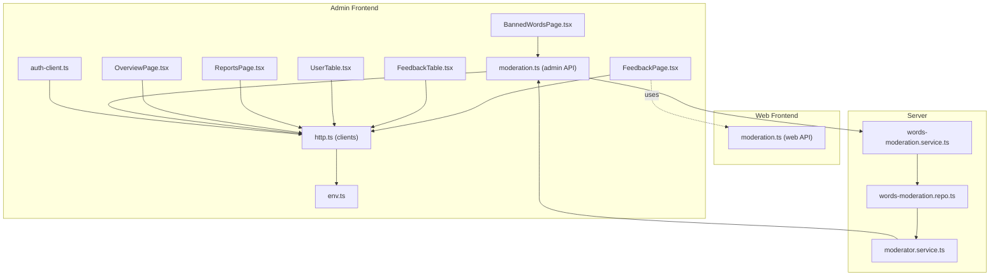
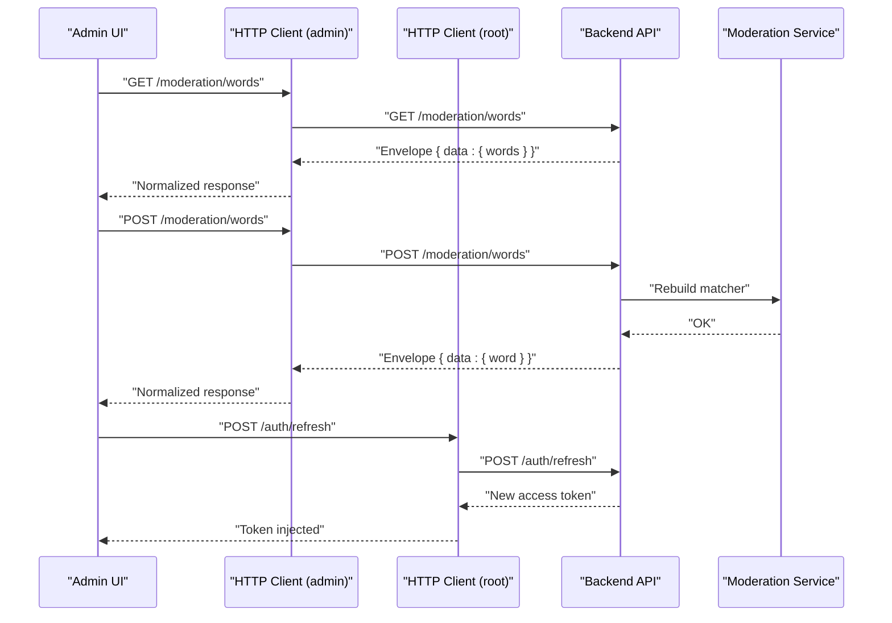
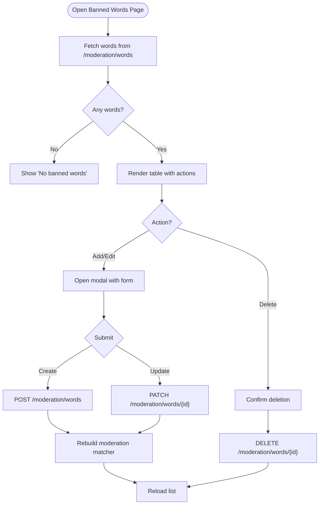
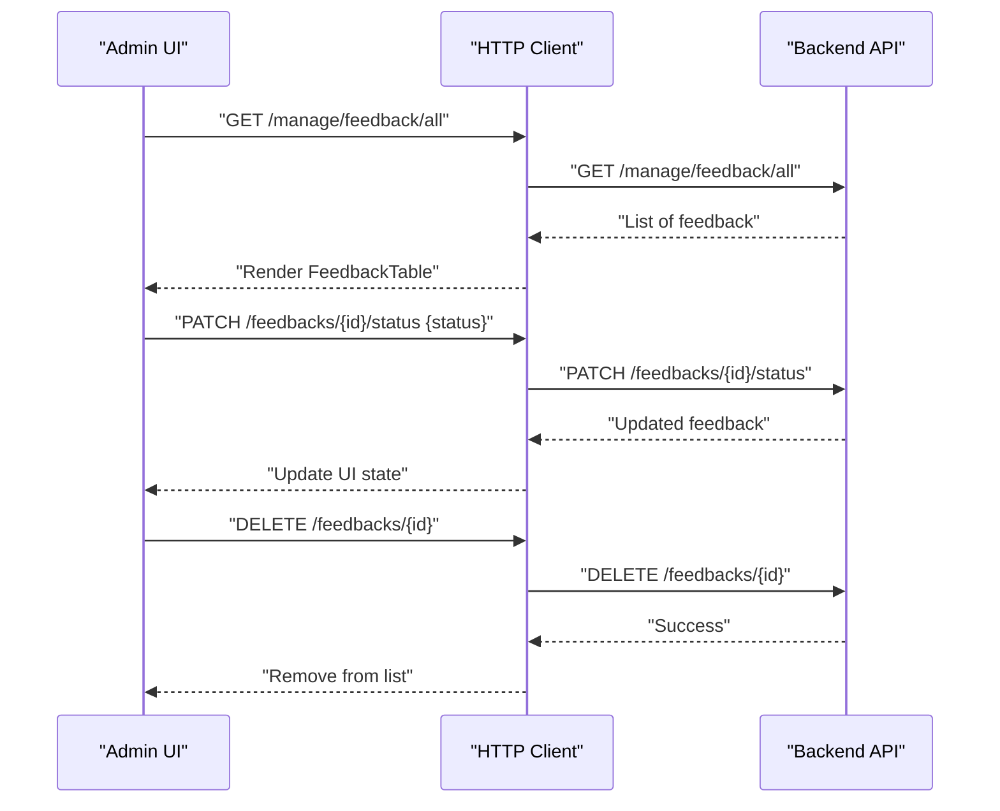
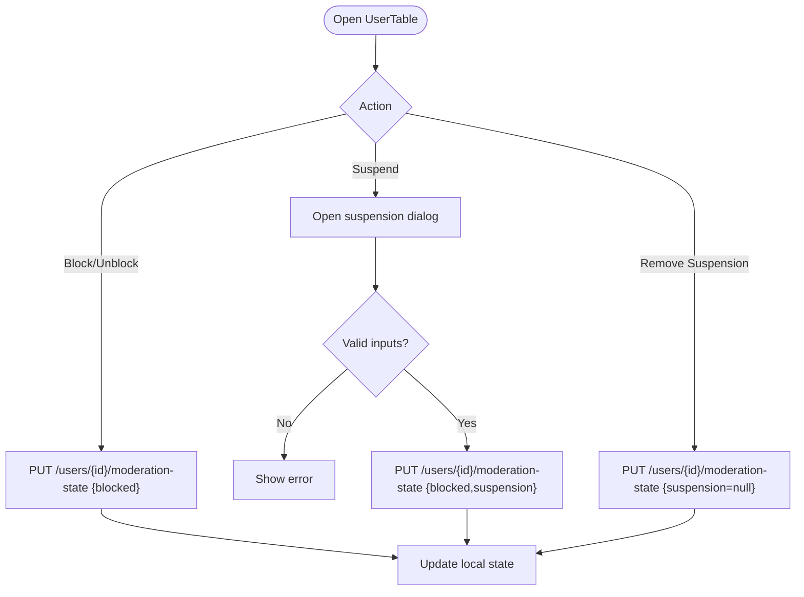
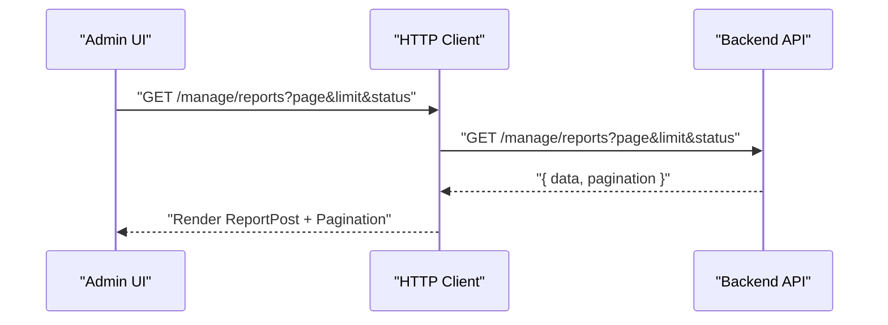
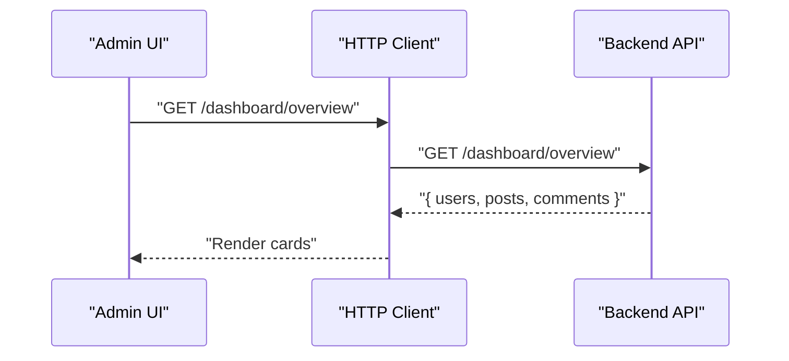
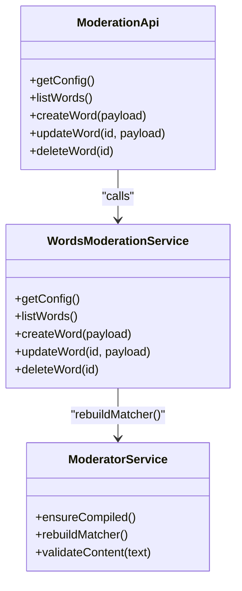
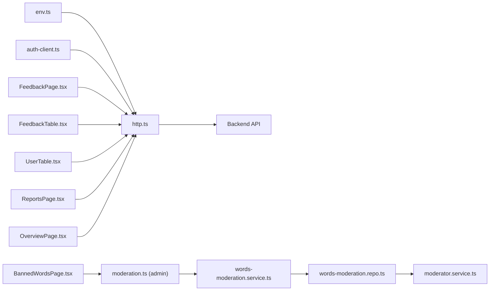

# System Configuration

<cite>
**Referenced Files in This Document**
- [BannedWordsPage.tsx](file://admin/src/pages/BannedWordsPage.tsx)
- [FeedbackPage.tsx](file://admin/src/pages/FeedbackPage.tsx)
- [FeedbackTable.tsx](file://admin/src/components/general/FeedbackTable.tsx)
- [UserTable.tsx](file://admin/src/components/general/UserTable.tsx)
- [ReportsPage.tsx](file://admin/src/pages/ReportsPage.tsx)
- [OverviewPage.tsx](file://admin/src/pages/OverviewPage.tsx)
- [moderation.ts](file://admin/src/services/api/moderation.ts)
- [http.ts](file://admin/src/services/http.ts)
- [env.ts](file://admin/src/config/env.ts)
- [auth-client.ts](file://admin/src/lib/auth-client.ts)
- [Feedback.ts](file://admin/src/types/Feedback.ts)
- [User.ts](file://admin/src/types/User.ts)
- [moderation.ts](file://web/src/services/api/moderation.ts)
- [moderator.service.ts](file://server/src/infra/services/moderator/moderator.service.ts)
- [words-moderation.service.ts](file://server/src/modules/moderation/words/words-moderation.service.ts)
- [words-moderation.repo.ts](file://server/src/modules/moderation/words/words-moderation.repo.ts)
</cite>

## Table of Contents
1. [Introduction](#introduction)
2. [Project Structure](#project-structure)
3. [Core Components](#core-components)
4. [Architecture Overview](#architecture-overview)
5. [Detailed Component Analysis](#detailed-component-analysis)
6. [Dependency Analysis](#dependency-analysis)
7. [Performance Considerations](#performance-considerations)
8. [Troubleshooting Guide](#troubleshooting-guide)
9. [Conclusion](#conclusion)
10. [Appendices](#appendices)

## Introduction
This document explains the system configuration and administrative controls available in the admin dashboard. It focuses on:
- Feedback management: collection, display, and status updates
- Banned words configuration: CRUD operations, severity, and strict mode
- Content policy enforcement and moderation integration
- Administrative control mechanisms: user moderation states and report handling
- Configuration APIs and backend integration patterns

The goal is to provide a practical guide for administrators to configure policies, monitor feedback, manage content, and maintain system-wide settings.

## Project Structure
The admin dashboard is a Vite + React application that communicates with the backend via HTTP clients. Key areas:
- Pages: dedicated views for Banned Words, Feedback, Reports, Overview, and user-related controls
- Services: HTTP clients and typed API bindings for moderation and general requests
- Types: shared TypeScript interfaces for feedback and user data
- Backend integration: server-side moderation service and database-backed banned word storage

**Diagram sources**
- [BannedWordsPage.tsx](file://admin/src/pages/BannedWordsPage.tsx#L1-L307)
- [FeedbackPage.tsx](file://admin/src/pages/FeedbackPage.tsx#L1-L37)
- [FeedbackTable.tsx](file://admin/src/components/general/FeedbackTable.tsx#L1-L130)
- [UserTable.tsx](file://admin/src/components/general/UserTable.tsx#L1-L323)
- [ReportsPage.tsx](file://admin/src/pages/ReportsPage.tsx#L1-L122)
- [OverviewPage.tsx](file://admin/src/pages/OverviewPage.tsx#L1-L80)
- [moderation.ts](file://admin/src/services/api/moderation.ts#L1-L49)
- [http.ts](file://admin/src/services/http.ts#L1-L154)
- [env.ts](file://admin/src/config/env.ts#L1-L5)
- [auth-client.ts](file://admin/src/lib/auth-client.ts#L1-L11)
- [moderation.ts](file://web/src/services/api/moderation.ts#L1-L7)
- [moderator.service.ts](file://server/src/infra/services/moderator/moderator.service.ts#L420-L641)
- [words-moderation.service.ts](file://server/src/modules/moderation/words/words-moderation.service.ts#L1-L65)
- [words-moderation.repo.ts](file://server/src/modules/moderation/words/words-moderation.repo.ts#L1-L60)

**Section sources**
- [BannedWordsPage.tsx](file://admin/src/pages/BannedWordsPage.tsx#L1-L307)
- [FeedbackPage.tsx](file://admin/src/pages/FeedbackPage.tsx#L1-L37)
- [FeedbackTable.tsx](file://admin/src/components/general/FeedbackTable.tsx#L1-L130)
- [UserTable.tsx](file://admin/src/components/general/UserTable.tsx#L1-L323)
- [ReportsPage.tsx](file://admin/src/pages/ReportsPage.tsx#L1-L122)
- [OverviewPage.tsx](file://admin/src/pages/OverviewPage.tsx#L1-L80)
- [moderation.ts](file://admin/src/services/api/moderation.ts#L1-L49)
- [http.ts](file://admin/src/services/http.ts#L1-L154)
- [env.ts](file://admin/src/config/env.ts#L1-L5)
- [auth-client.ts](file://admin/src/lib/auth-client.ts#L1-L11)
- [moderation.ts](file://web/src/services/api/moderation.ts#L1-L7)
- [moderator.service.ts](file://server/src/infra/services/moderator/moderator.service.ts#L420-L641)
- [words-moderation.service.ts](file://server/src/modules/moderation/words/words-moderation.service.ts#L1-L65)
- [words-moderation.repo.ts](file://server/src/modules/moderation/words/words-moderation.repo.ts#L1-L60)

## Core Components
- Banned Words Management (Admin UI): CRUD for words/phrases with severity and strict mode; integrates with moderation API
- Feedback Management (Admin UI): list and update feedback status (reviewed/dismissed/delete)
- User Moderation Controls (Admin UI): ban/unban and suspend/remove suspension
- Reports Management (Admin UI): filter and paginate reported posts
- Overview Dashboard (Admin UI): system metrics (users, posts, comments)
- HTTP Clients and Auth: unified base URLs, interceptors, envelope normalization, and token refresh
- Moderation API Bindings (Admin): typed endpoints for moderation config and banned words
- Backend Moderation Engine: dynamic banned word matching, policy validation, and cache-aware recompilation

**Section sources**
- [BannedWordsPage.tsx](file://admin/src/pages/BannedWordsPage.tsx#L35-L307)
- [FeedbackPage.tsx](file://admin/src/pages/FeedbackPage.tsx#L7-L37)
- [FeedbackTable.tsx](file://admin/src/components/general/FeedbackTable.tsx#L13-L130)
- [UserTable.tsx](file://admin/src/components/general/UserTable.tsx#L41-L323)
- [ReportsPage.tsx](file://admin/src/pages/ReportsPage.tsx#L14-L122)
- [OverviewPage.tsx](file://admin/src/pages/OverviewPage.tsx#L12-L80)
- [http.ts](file://admin/src/services/http.ts#L11-L154)
- [moderation.ts](file://admin/src/services/api/moderation.ts#L23-L48)

## Architecture Overview
The admin dashboard communicates with the backend through two clients:
- Admin client: base URL derived from environment, used for admin endpoints
- Root client: base URL stripped of admin suffix, used for auth refresh and non-admin endpoints

Requests are intercepted to inject Authorization headers and normalize responses into a consistent envelope. The moderation module orchestrates banned word configuration and content policy enforcement.

**Diagram sources**
- [http.ts](file://admin/src/services/http.ts#L11-L154)
- [moderation.ts](file://admin/src/services/api/moderation.ts#L29-L47)
- [moderator.service.ts](file://server/src/infra/services/moderator/moderator.service.ts#L420-L641)

**Section sources**
- [http.ts](file://admin/src/services/http.ts#L11-L154)
- [moderation.ts](file://admin/src/services/api/moderation.ts#L23-L48)
- [moderator.service.ts](file://server/src/infra/services/moderator/moderator.service.ts#L420-L641)

## Detailed Component Analysis

### Banned Words Management
Administrators can:
- List existing banned words with severity and mode indicators
- Add new words with severity and strict mode
- Edit existing entries (word, severity, strict mode)
- Delete words
- Filter by search term

Strict mode bypasses leetspeak and punctuation evasion. Severity levels are mild, moderate, and severe. Updates trigger backend recompilation of the moderation matcher.

**Diagram sources**
- [BannedWordsPage.tsx](file://admin/src/pages/BannedWordsPage.tsx#L50-L129)
- [moderation.ts](file://admin/src/services/api/moderation.ts#L29-L47)
- [words-moderation.service.ts](file://server/src/modules/moderation/words/words-moderation.service.ts#L21-L62)
- [words-moderation.repo.ts](file://server/src/modules/moderation/words/words-moderation.repo.ts#L45-L60)
- [moderator.service.ts](file://server/src/infra/services/moderator/moderator.service.ts#L420-L462)

**Section sources**
- [BannedWordsPage.tsx](file://admin/src/pages/BannedWordsPage.tsx#L35-L307)
- [moderation.ts](file://admin/src/services/api/moderation.ts#L4-L48)
- [words-moderation.service.ts](file://server/src/modules/moderation/words/words-moderation.service.ts#L12-L65)
- [words-moderation.repo.ts](file://server/src/modules/moderation/words/words-moderation.repo.ts#L16-L60)
- [moderator.service.ts](file://server/src/infra/services/moderator/moderator.service.ts#L420-L462)

### Feedback Management
Administrators can:
- View all feedback entries
- Update status to reviewed or dismissed
- Delete feedback entries

The page fetches data from a management endpoint and renders a table with actions.

**Diagram sources**
- [FeedbackPage.tsx](file://admin/src/pages/FeedbackPage.tsx#L11-L22)
- [FeedbackTable.tsx](file://admin/src/components/general/FeedbackTable.tsx#L68-L96)

**Section sources**
- [FeedbackPage.tsx](file://admin/src/pages/FeedbackPage.tsx#L7-L37)
- [FeedbackTable.tsx](file://admin/src/components/general/FeedbackTable.tsx#L13-L130)
- [Feedback.ts](file://admin/src/types/Feedback.ts#L1-L14)

### User Moderation Controls
Administrators can:
- Ban/unban users
- Suspend/remove suspension with reason and duration
- View blocking and suspension status

Suspension requires days and reason inputs; the system computes an end date and updates state accordingly.

**Diagram sources**
- [UserTable.tsx](file://admin/src/components/general/UserTable.tsx#L48-L116)
- [UserTable.tsx](file://admin/src/components/general/UserTable.tsx#L118-L144)

**Section sources**
- [UserTable.tsx](file://admin/src/components/general/UserTable.tsx#L41-L323)
- [User.ts](file://admin/src/types/User.ts#L1-L16)

### Reports Management
Administrators can:
- Filter reports by status (pending, resolved, ignored)
- Paginate through reports
- Refresh the list

**Diagram sources**
- [ReportsPage.tsx](file://admin/src/pages/ReportsPage.tsx#L24-L61)

**Section sources**
- [ReportsPage.tsx](file://admin/src/pages/ReportsPage.tsx#L14-L122)

### Overview Dashboard
Displays system metrics (users, posts, comments) fetched from a dashboard endpoint.

**Diagram sources**
- [OverviewPage.tsx](file://admin/src/pages/OverviewPage.tsx#L16-L29)

**Section sources**
- [OverviewPage.tsx](file://admin/src/pages/OverviewPage.tsx#L12-L80)

### Moderation API Bindings and Backend Integration
- Admin API bindings expose typed endpoints for moderation config and banned words
- Web API bindings expose a lighter-weight moderation config endpoint
- Backend moderation service compiles banned words, detects spam/self-harm, validates language, and caches decisions
- Words moderation service coordinates persistence and triggers matcher rebuilds

**Diagram sources**
- [moderation.ts](file://admin/src/services/api/moderation.ts#L23-L48)
- [words-moderation.service.ts](file://server/src/modules/moderation/words/words-moderation.service.ts#L12-L65)
- [moderator.service.ts](file://server/src/infra/services/moderator/moderator.service.ts#L420-L462)

**Section sources**
- [moderation.ts](file://admin/src/services/api/moderation.ts#L1-L49)
- [moderation.ts](file://web/src/services/api/moderation.ts#L1-L7)
- [words-moderation.service.ts](file://server/src/modules/moderation/words/words-moderation.service.ts#L1-L65)
- [moderator.service.ts](file://server/src/infra/services/moderator/moderator.service.ts#L420-L641)

## Dependency Analysis
- Admin UI depends on HTTP clients for all backend communication
- HTTP clients depend on environment variables for base URLs and interceptors for auth and response normalization
- Moderation endpoints depend on backend services for banned word storage and content validation
- Auth client integrates with Better Auth for admin-specific flows

**Diagram sources**
- [env.ts](file://admin/src/config/env.ts#L1-L5)
- [http.ts](file://admin/src/services/http.ts#L1-L154)
- [auth-client.ts](file://admin/src/lib/auth-client.ts#L1-L11)
- [BannedWordsPage.tsx](file://admin/src/pages/BannedWordsPage.tsx#L1-L307)
- [FeedbackPage.tsx](file://admin/src/pages/FeedbackPage.tsx#L1-L37)
- [FeedbackTable.tsx](file://admin/src/components/general/FeedbackTable.tsx#L1-L130)
- [UserTable.tsx](file://admin/src/components/general/UserTable.tsx#L1-L323)
- [ReportsPage.tsx](file://admin/src/pages/ReportsPage.tsx#L1-L122)
- [OverviewPage.tsx](file://admin/src/pages/OverviewPage.tsx#L1-L80)
- [moderation.ts](file://admin/src/services/api/moderation.ts#L1-L49)
- [words-moderation.service.ts](file://server/src/modules/moderation/words/words-moderation.service.ts#L1-L65)
- [words-moderation.repo.ts](file://server/src/modules/moderation/words/words-moderation.repo.ts#L1-L60)
- [moderator.service.ts](file://server/src/infra/services/moderator/moderator.service.ts#L420-L641)

**Section sources**
- [env.ts](file://admin/src/config/env.ts#L1-L5)
- [http.ts](file://admin/src/services/http.ts#L1-L154)
- [auth-client.ts](file://admin/src/lib/auth-client.ts#L1-L11)
- [moderation.ts](file://admin/src/services/api/moderation.ts#L1-L49)
- [words-moderation.service.ts](file://server/src/modules/moderation/words/words-moderation.service.ts#L1-L65)
- [words-moderation.repo.ts](file://server/src/modules/moderation/words/words-moderation.repo.ts#L1-L60)
- [moderator.service.ts](file://server/src/infra/services/moderator/moderator.service.ts#L420-L641)

## Performance Considerations
- Cache-aware moderation: the backend caches validation results and periodically checks for banned word updates to avoid unnecessary recomputation
- Matcher rebuilds: triggered only on banned word changes to minimize runtime overhead
- Pagination and filtering: reports page supports pagination and status filters to reduce payload sizes
- UI responsiveness: loading states and toast notifications improve perceived performance

[No sources needed since this section provides general guidance]

## Troubleshooting Guide
Common issues and resolutions:
- Authentication failures: the HTTP client automatically refreshes tokens; ensure refresh endpoint is reachable and credentials are valid
- API envelope mismatch: responses are normalized; check that backend returns the expected envelope structure
- Banned word updates not taking effect: verify that the words moderation service triggers a matcher rebuild after create/update/delete
- Feedback/status updates failing: confirm endpoint availability and that the feedback ID exists

**Section sources**
- [http.ts](file://admin/src/services/http.ts#L97-L150)
- [words-moderation.service.ts](file://server/src/modules/moderation/words/words-moderation.service.ts#L21-L62)
- [FeedbackTable.tsx](file://admin/src/components/general/FeedbackTable.tsx#L68-L96)

## Conclusion
The admin dashboard provides comprehensive controls for system configuration and administration:
- Banned words can be managed with severity and strict mode, triggering backend matcher rebuilds
- Feedback can be collected, viewed, and curated via status updates
- Users can be moderated with blocking and suspension controls
- Reports can be filtered and paginated for efficient triage
- HTTP clients and interceptors ensure secure and normalized communication with the backend

These capabilities integrate tightly with the backend moderation engine to enforce content policies consistently across the platform.

[No sources needed since this section summarizes without analyzing specific files]

## Appendices

### Example Workflows

- Banned Words Configuration Workflow
  - Navigate to Banned Words page
  - Click Add Word, choose severity and strict mode, submit
  - Observe immediate effect after backend matcher rebuild

- Feedback Management Procedure
  - Open Feedback page
  - Review entries and mark as reviewed or dismissed
  - Delete entries as needed

- Administrative Control Mechanisms
  - Open User table, select action (ban/unban/suspend/remove suspension)
  - For suspension, provide days and reason; confirm submission

[No sources needed since this section provides general guidance]