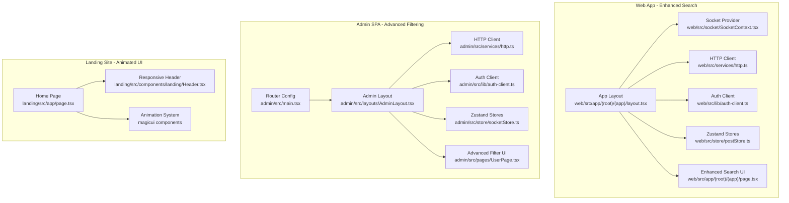
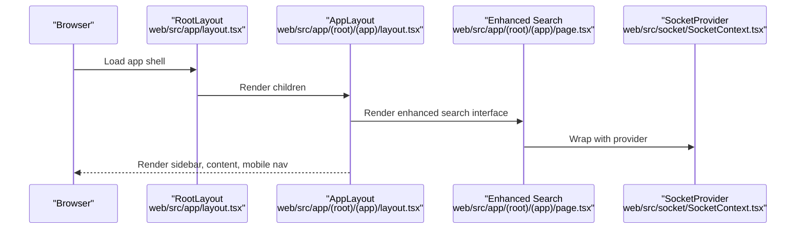
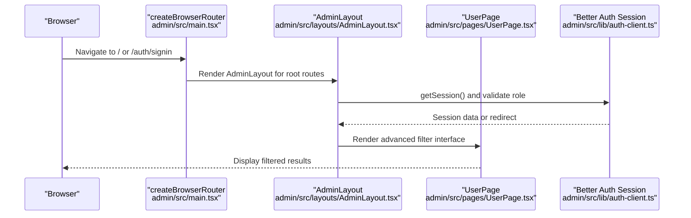
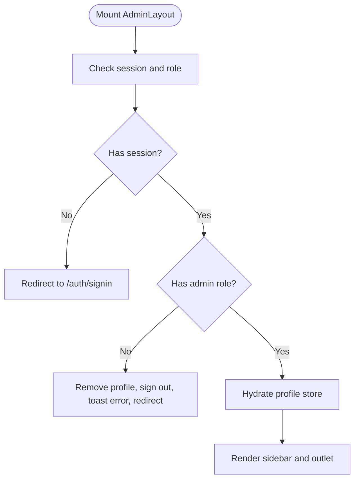
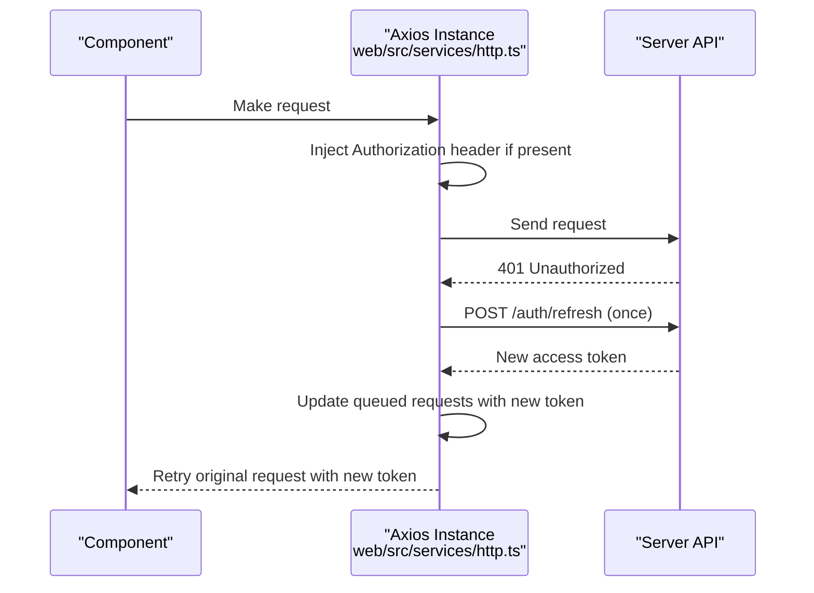
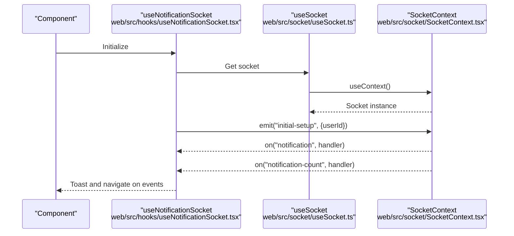
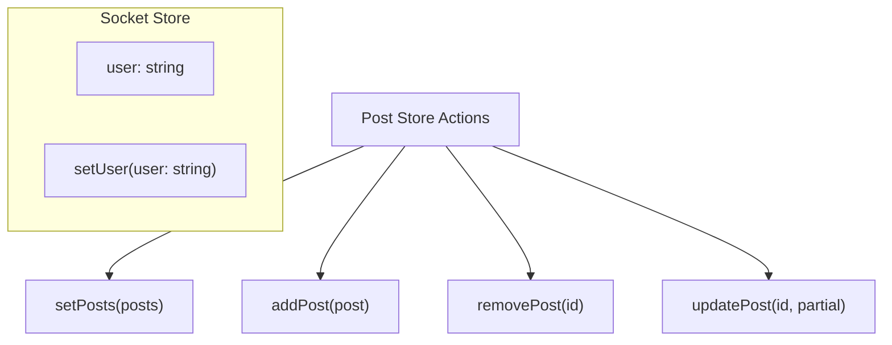
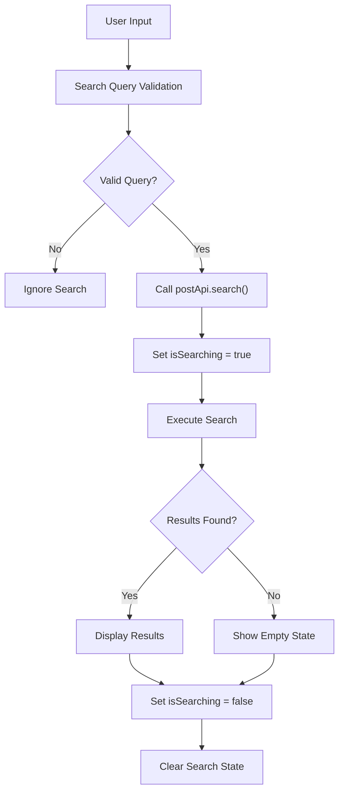
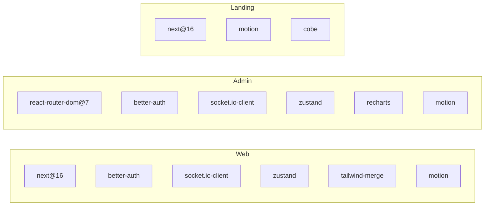

# Frontend Components

<cite>
**Referenced Files in This Document**
- [web/package.json](file://web/package.json)
- [admin/package.json](file://admin/package.json)
- [landing/package.json](file://landing/package.json)
- [web/src/app/layout.tsx](file://web/src/app/layout.tsx)
- [web/src/app/(root)/(app)/layout.tsx](file://web/src/app/(root)/(app)/layout.tsx)
- [web/src/app/(root)/(app)/page.tsx](file://web/src/app/(root)/(app)/page.tsx)
- [admin/src/main.tsx](file://admin/src/main.tsx)
- [admin/src/layouts/AdminLayout.tsx](file://admin/src/layouts/AdminLayout.tsx)
- [admin/src/pages/UserPage.tsx](file://admin/src/pages/UserPage.tsx)
- [landing/src/app/page.tsx](file://landing/src/app/page.tsx)
- [landing/src/components/landing/Header.tsx](file://landing/src/components/landing/Header.tsx)
- [web/src/lib/auth-client.ts](file://web/src/lib/auth-client.ts)
- [admin/src/lib/auth-client.ts](file://admin/src/lib/auth-client.ts)
- [web/src/services/http.ts](file://web/src/services/http.ts)
- [admin/src/services/http.ts](file://admin/src/services/http.ts)
- [web/src/socket/SocketContext.tsx](file://web/src/socket/SocketContext.tsx)
- [admin/src/socket/SocketContext.tsx](file://admin/src/socket/SocketContext.tsx)
- [web/src/socket/useSocket.ts](file://web/src/socket/useSocket.ts)
- [admin/src/socket/useSocket.ts](file://admin/src/socket/useSocket.ts)
- [web/src/hooks/useNotificationSocket.tsx](file://web/src/hooks/useNotificationSocket.tsx)
- [web/src/store/postStore.ts](file://web/src/store/postStore.ts)
- [admin/src/store/socketStore.ts](file://admin/src/store/socketStore.ts)
- [web/src/app/globals.css](file://web/src/app/globals.css)
- [admin/tailwind.config.js](file://admin/tailwind.config.js)
- [admin/src/index.css](file://admin/src/index.css)
</cite>

## Update Summary
**Changes Made**
- Enhanced search functionality documentation with improved UI styling and responsive design
- Added detailed analysis of modern color transitions and animation effects
- Updated component composition patterns for search interfaces
- Expanded responsive design coverage across all frontend applications
- Documented enhanced user experience improvements with modern transitions

## Table of Contents
1. [Introduction](#introduction)
2. [Project Structure](#project-structure)
3. [Core Components](#core-components)
4. [Architecture Overview](#architecture-overview)
5. [Detailed Component Analysis](#detailed-component-analysis)
6. [Enhanced Search Functionality](#enhanced-search-functionality)
7. [Modern UI Styling and Animations](#modern-ui-styling-and-animations)
8. [Responsive Design Patterns](#responsive-design-patterns)
9. [Dependency Analysis](#dependency-analysis)
10. [Performance Considerations](#performance-considerations)
11. [Troubleshooting Guide](#troubleshooting-guide)
12. [Conclusion](#conclusion)

## Introduction
This document explains the frontend component architecture across the Next.js web application, the separate admin SPA, and the landing site. It covers the Next.js app router structure, component organization, state management with Zustand, API integration patterns, React component library usage, styling with Tailwind CSS, responsive design, real-time communication via Socket.IO, authentication state management, and routing configurations. The document now includes comprehensive coverage of the enhanced search functionality with improved UI styling, modern color transitions, and better user experience across all applications.

## Project Structure
The repository contains three primary frontend packages:
- Web (Next.js app): Main social platform UI under web/src/app with enhanced search capabilities and modern UI elements.
- Admin (Vite/React SPA): Administrative dashboard under admin/src with advanced filtering and search functionality.
- Landing (Next.js app): Marketing and onboarding site under landing/src/app with animated UI components and responsive design.

Key characteristics:
- Web uses Next.js App Router with route groups and dynamic routes, featuring enhanced search with modern styling.
- Admin uses React Router DOM v7 with nested routes and protected layouts, implementing sophisticated search filters.
- Landing uses Next.js App Router with minimal UI and marketing components, showcasing modern animations and responsive patterns.
- Shared styling and component libraries are configured via Tailwind CSS and Radix UI primitives with modern color transitions.

```mermaid
graph TB
subgraph "Web (Next.js) - Enhanced Search"
W_App["web/src/app/layout.tsx"]
W_Root["web/src/app/(root)/(app)/layout.tsx"]
W_Search["web/src/app/(root)/(app)/page.tsx<br/>Enhanced Search UI"]
end
subgraph "Admin (SPA) - Advanced Search"
A_Main["admin/src/main.tsx"]
A_Layout["admin/src/layouts/AdminLayout.tsx"]
A_UserPage["admin/src/pages/UserPage.tsx<br/>Advanced Filters"]
end
subgraph "Landing (Next.js) - Animated UI"
L_App["landing/src/app/page.tsx"]
L_Header["landing/src/components/landing/Header.tsx<br/>Responsive Header"]
end
W_App --> W_Root
W_Root --> W_Search
A_Main --> A_Layout
A_Layout --> A_UserPage
L_App --> L_Header
```

**Diagram sources**
- [web/src/app/layout.tsx](file://web/src/app/layout.tsx#L1-L21)
- [web/src/app/(root)/(app)/layout.tsx](file://web/src/app/(root)/(app)/layout.tsx#L1-L290)
- [web/src/app/(root)/(app)/page.tsx](file://web/src/app/(root)/(app)/page.tsx#L119-L149)
- [admin/src/main.tsx](file://admin/src/main.tsx#L1-L96)
- [admin/src/layouts/AdminLayout.tsx](file://admin/src/layouts/AdminLayout.tsx#L1-L132)
- [admin/src/pages/UserPage.tsx](file://admin/src/pages/UserPage.tsx#L168-L196)
- [landing/src/app/page.tsx](file://landing/src/app/page.tsx#L1-L195)
- [landing/src/components/landing/Header.tsx](file://landing/src/components/landing/Header.tsx#L1-L57)

**Section sources**
- [web/src/app/layout.tsx](file://web/src/app/layout.tsx#L1-L21)
- [web/src/app/(root)/(app)/layout.tsx](file://web/src/app/(root)/(app)/layout.tsx#L1-L290)
- [web/src/app/(root)/(app)/page.tsx](file://web/src/app/(root)/(app)/page.tsx#L119-L149)
- [admin/src/main.tsx](file://admin/src/main.tsx#L1-L96)
- [admin/src/layouts/AdminLayout.tsx](file://admin/src/layouts/AdminLayout.tsx#L1-L132)
- [admin/src/pages/UserPage.tsx](file://admin/src/pages/UserPage.tsx#L168-L196)
- [landing/src/app/page.tsx](file://landing/src/app/page.tsx#L1-L195)
- [landing/src/components/landing/Header.tsx](file://landing/src/components/landing/Header.tsx#L1-L57)

## Core Components
- Authentication clients:
  - Web: Better Auth client configured with admin and Google One Tap plugins.
  - Admin: Better Auth client configured with admin and inferred fields plugins.
- HTTP clients:
  - Web: Axios instance with base URL from environment, credential support, bearer token injection, and automatic 401 refresh handling with queued retry.
  - Admin: Dual Axios instances (admin and root) with envelope normalization and similar auth refresh logic.
- Real-time:
  - Socket.IO providers and hooks for both Web and Admin, exposing typed contexts and safe hook usage.
- State management:
  - Zustand stores for posts (Web) and socket user state (Admin).
- UI and styling:
  - Tailwind CSS v4 for Web with modern OKLCH color system and v3 for Admin/Landing; Radix UI primitives; Sonner for notifications.
  - Enhanced search interfaces with improved styling and responsive design.

**Section sources**
- [web/src/lib/auth-client.ts](file://web/src/lib/auth-client.ts#L1-L20)
- [admin/src/lib/auth-client.ts](file://admin/src/lib/auth-client.ts#L1-L11)
- [web/src/services/http.ts](file://web/src/services/http.ts#L1-L135)
- [admin/src/services/http.ts](file://admin/src/services/http.ts#L1-L154)
- [web/src/socket/SocketContext.tsx](file://web/src/socket/SocketContext.tsx#L1-L26)
- [admin/src/socket/SocketContext.tsx](file://admin/src/socket/SocketContext.tsx#L1-L26)
- [web/src/socket/useSocket.ts](file://web/src/socket/useSocket.ts#L1-L9)
- [admin/src/socket/useSocket.ts](file://admin/src/socket/useSocket.ts#L1-L13)
- [web/src/store/postStore.ts](file://web/src/store/postStore.ts#L1-L30)
- [admin/src/store/socketStore.ts](file://admin/src/store/socketStore.ts#L1-L14)

## Architecture Overview
High-level runtime architecture:
- Web app bootstraps a Socket.IO provider at the root layout level and renders the main app layout with sidebar, trending feed, and mobile navigation, featuring enhanced search functionality.
- Admin SPA defines nested routes under an AdminLayout that enforces admin role checks and redirects unauthorized users, with advanced filtering capabilities.
- Both apps share a unified HTTP client pattern for API calls and token refresh, while Admin additionally exposes a root HTTP client for cross-domain endpoints.
- Landing site implements modern animations and responsive design patterns for optimal user experience.

**Diagram sources**
- [web/src/app/(root)/(app)/layout.tsx](file://web/src/app/(root)/(app)/layout.tsx#L1-L290)
- [web/src/socket/SocketContext.tsx](file://web/src/socket/SocketContext.tsx#L1-L26)
- [web/src/services/http.ts](file://web/src/services/http.ts#L1-L135)
- [web/src/lib/auth-client.ts](file://web/src/lib/auth-client.ts#L1-L20)
- [web/src/store/postStore.ts](file://web/src/store/postStore.ts#L1-L30)
- [web/src/app/(root)/(app)/page.tsx](file://web/src/app/(root)/(app)/page.tsx#L119-L149)
- [admin/src/main.tsx](file://admin/src/main.tsx#L1-L96)
- [admin/src/layouts/AdminLayout.tsx](file://admin/src/layouts/AdminLayout.tsx#L1-L132)
- [admin/src/services/http.ts](file://admin/src/services/http.ts#L1-L154)
- [admin/src/lib/auth-client.ts](file://admin/src/lib/auth-client.ts#L1-L11)
- [admin/src/store/socketStore.ts](file://admin/src/store/socketStore.ts#L1-L14)
- [admin/src/pages/UserPage.tsx](file://admin/src/pages/UserPage.tsx#L168-L196)
- [landing/src/app/page.tsx](file://landing/src/app/page.tsx#L1-L195)
- [landing/src/components/landing/Header.tsx](file://landing/src/components/landing/Header.tsx#L1-L57)

## Detailed Component Analysis

### Next.js App Router (Web)
- Root layout sets global fonts and theme attributes with modern OKLCH color system.
- App layout composes:
  - Sidebar with branches/topics tabs and responsive show/hide behavior.
  - Main content area with scrollable viewport and trending section.
  - Mobile navigation bar with icons and conditional rendering based on authentication.
  - Socket provider wrapping the entire app for real-time features.
  - Suspense boundary around content for streaming hydration.
- Enhanced search functionality with improved UI styling and responsive design.

**Diagram sources**
- [web/src/app/layout.tsx](file://web/src/app/layout.tsx#L1-L21)
- [web/src/app/(root)/(app)/layout.tsx](file://web/src/app/(root)/(app)/layout.tsx#L1-L290)
- [web/src/app/(root)/(app)/page.tsx](file://web/src/app/(root)/(app)/page.tsx#L119-L149)
- [web/src/socket/SocketContext.tsx](file://web/src/socket/SocketContext.tsx#L1-L26)

**Section sources**
- [web/src/app/layout.tsx](file://web/src/app/layout.tsx#L1-L21)
- [web/src/app/(root)/(app)/layout.tsx](file://web/src/app/(root)/(app)/layout.tsx#L1-L290)
- [web/src/app/(root)/(app)/page.tsx](file://web/src/app/(root)/(app)/page.tsx#L119-L149)

### Admin SPA Routing and Protected Layout
- Router configuration:
  - Root route mounts AdminLayout with nested routes for users, posts, logs, colleges, branches, reports, feedbacks, settings, and banned words.
  - Auth route group for sign-in.
- AdminLayout:
  - Enforces admin role checks on mount and on navigation.
  - Uses Better Auth session to hydrate profile and redirect/unauthorize as needed.
  - Mobile-responsive sidebar with collapsible menu and tab navigation.
  - Advanced filtering system with enhanced search capabilities.

**Diagram sources**
- [admin/src/main.tsx](file://admin/src/main.tsx#L1-L96)
- [admin/src/layouts/AdminLayout.tsx](file://admin/src/layouts/AdminLayout.tsx#L1-L132)
- [admin/src/pages/UserPage.tsx](file://admin/src/pages/UserPage.tsx#L168-L196)
- [admin/src/lib/auth-client.ts](file://admin/src/lib/auth-client.ts#L1-L11)

**Section sources**
- [admin/src/main.tsx](file://admin/src/main.tsx#L1-L96)
- [admin/src/layouts/AdminLayout.tsx](file://admin/src/layouts/AdminLayout.tsx#L1-L132)
- [admin/src/pages/UserPage.tsx](file://admin/src/pages/UserPage.tsx#L168-L196)

### Authentication State Management
- Web:
  - Better Auth client configured with admin and Google One Tap plugins, pointing to the server's auth API base URL.
- Admin:
  - Better Auth client configured with admin and inferred fields plugins, pointing to Vite environment variable for server URI.
- Session validation:
  - Admin layout validates session and role on mount and navigation, removing invalid profiles and signing out unauthorized users.

**Diagram sources**
- [admin/src/layouts/AdminLayout.tsx](file://admin/src/layouts/AdminLayout.tsx#L17-L65)
- [admin/src/lib/auth-client.ts](file://admin/src/lib/auth-client.ts#L1-L11)

**Section sources**
- [web/src/lib/auth-client.ts](file://web/src/lib/auth-client.ts#L1-L20)
- [admin/src/lib/auth-client.ts](file://admin/src/lib/auth-client.ts#L1-L11)
- [admin/src/layouts/AdminLayout.tsx](file://admin/src/layouts/AdminLayout.tsx#L1-L132)

### API Integration Patterns
- Web:
  - Axios instance with base URL from environment and credentials enabled.
  - Request interceptor injects Authorization header if access token exists.
  - Response interceptor normalizes backend envelope to a unified API response shape.
  - Centralized 401 refresh logic with retry queue to avoid multiple refresh calls.
  - Access token getter and refresh callbacks are registered externally.
- Admin:
  - Two Axios instances: admin and root, with trailing slash and admin suffix stripping.
  - Similar interceptor pipeline for access token injection and envelope normalization.
  - 401 refresh logic uses root endpoint to refresh tokens and propagate to queued requests.

**Diagram sources**
- [web/src/services/http.ts](file://web/src/services/http.ts#L10-L111)

**Section sources**
- [web/src/services/http.ts](file://web/src/services/http.ts#L1-L135)
- [admin/src/services/http.ts](file://admin/src/services/http.ts#L1-L154)

### Real-Time Communication with Socket.IO
- Providers:
  - Web: Socket provider wraps the app layout and memoizes a Socket.IO connection to the server URI.
  - Admin: Socket provider memoizes a Socket.IO connection with WebSocket transport.
- Hooks:
  - Web: Custom hook returns context or null; used by notification hook.
  - Admin: Custom hook throws if used outside provider, ensuring strict usage.
- Notifications:
  - Web notification hook subscribes to "initial-setup" with user ID, listens to "notification" and "notification-count", triggers toast with action to navigate to post.

**Diagram sources**
- [web/src/hooks/useNotificationSocket.tsx](file://web/src/hooks/useNotificationSocket.tsx#L1-L54)
- [web/src/socket/useSocket.ts](file://web/src/socket/useSocket.ts#L1-L9)
- [web/src/socket/SocketContext.tsx](file://web/src/socket/SocketContext.tsx#L1-L26)

**Section sources**
- [web/src/socket/SocketContext.tsx](file://web/src/socket/SocketContext.tsx#L1-L26)
- [admin/src/socket/SocketContext.tsx](file://admin/src/socket/SocketContext.tsx#L1-L26)
- [web/src/socket/useSocket.ts](file://web/src/socket/useSocket.ts#L1-L9)
- [admin/src/socket/useSocket.ts](file://admin/src/socket/useSocket.ts#L1-L13)
- [web/src/hooks/useNotificationSocket.tsx](file://web/src/hooks/useNotificationSocket.tsx#L1-L54)

### State Management with Zustand
- Web:
  - Post store manages a list of posts with setters for set, add, remove, and update operations.
- Admin:
  - Socket store maintains a simple user string state with setter.

**Diagram sources**
- [web/src/store/postStore.ts](file://web/src/store/postStore.ts#L1-L30)
- [admin/src/store/socketStore.ts](file://admin/src/store/socketStore.ts#L1-L14)

**Section sources**
- [web/src/store/postStore.ts](file://web/src/store/postStore.ts#L1-L30)
- [admin/src/store/socketStore.ts](file://admin/src/store/socketStore.ts#L1-L14)

### Component Composition and Reusable UI Elements
- Web:
  - App layout composes reusable UI pieces: sidebar, trending section, mobile navigation, and conditional auth prompts.
  - Uses Radix UI primitives and Tailwind classes for consistent spacing and theming.
  - Enhanced search interface with improved styling and responsive behavior.
- Admin:
  - AdminLayout composes a responsive sidebar with collapsible mobile menu and tab navigation.
  - Uses Sonner for toast notifications and Lucide icons for UI affordances.
  - Advanced filtering system with sophisticated search capabilities.
- Landing:
  - Minimal Next.js app with typography and marketing components; Tailwind CSS configured similarly.
  - Implements modern animations and responsive design patterns.

**Section sources**
- [web/src/app/(root)/(app)/layout.tsx](file://web/src/app/(root)/(app)/layout.tsx#L1-L290)
- [web/src/app/(root)/(app)/page.tsx](file://web/src/app/(root)/(app)/page.tsx#L119-L149)
- [admin/src/layouts/AdminLayout.tsx](file://admin/src/layouts/AdminLayout.tsx#L1-L132)
- [admin/src/pages/UserPage.tsx](file://admin/src/pages/UserPage.tsx#L168-L196)
- [landing/src/app/page.tsx](file://landing/src/app/page.tsx#L1-L195)
- [landing/src/components/landing/Header.tsx](file://landing/src/components/landing/Header.tsx#L1-L57)

## Enhanced Search Functionality

### Web Application Search Enhancement
The main web application features an enhanced search interface with modern UI styling and improved user experience:

- **Sticky Search Bar**: Positioned at the top of the feed with sticky positioning for continuous access.
- **Modern Input Styling**: Rounded input with group-focus-within transitions, smooth color transitions, and subtle shadows.
- **Interactive Elements**: 
  - Search icon with color transition on focus
  - Loading spinner during search operations
  - Clear button with hover effects
- **Responsive Design**: Adapts from mobile to desktop with appropriate spacing and sizing.
- **Visual Feedback**: Loading states, empty states, and search result presentation.

**Diagram sources**
- [web/src/app/(root)/(app)/page.tsx](file://web/src/app/(root)/(app)/page.tsx#L68-L92)

**Section sources**
- [web/src/app/(root)/(app)/page.tsx](file://web/src/app/(root)/(app)/page.tsx#L119-L149)
- [web/src/app/(root)/(app)/page.tsx](file://web/src/app/(root)/(app)/page.tsx#L68-L92)

### Admin Application Advanced Filtering
The admin panel implements sophisticated filtering capabilities:

- **Multi-Field Search**: Username and email filtering with real-time updates.
- **Responsive Form Layout**: Flex layout on mobile, row layout on larger screens.
- **Filter State Management**: Tracks active filters and provides reset functionality.
- **Loading States**: Visual feedback during search operations.
- **Result Indicators**: Badge system showing filter status.

**Section sources**
- [admin/src/pages/UserPage.tsx](file://admin/src/pages/UserPage.tsx#L168-L196)
- [admin/src/pages/UserPage.tsx](file://admin/src/pages/UserPage.tsx#L198-L204)

## Modern UI Styling and Animations

### Color System and Transitions
The applications utilize modern color systems with smooth transitions:

- **Web**: OKLCH color system with dark/light mode variants, providing smooth color transitions.
- **Admin**: Traditional HSL color system with dark mode support.
- **Landing**: Gradient backgrounds with animated text effects.

### Animation Framework
- **Landing Site**: Comprehensive animation system using motion/react with multiple animation variants.
- **Header Responsiveness**: Smooth transitions for header styling on scroll.
- **Button Interactions**: Hover effects with scaling and shadow enhancements.

**Section sources**
- [web/src/app/globals.css](file://web/src/app/globals.css#L1-L133)
- [admin/tailwind.config.js](file://admin/tailwind.config.js#L1-L52)
- [admin/src/index.css](file://admin/src/index.css#L1-L43)
- [landing/src/components/landing/Header.tsx](file://landing/src/components/landing/Header.tsx#L20-L26)
- [landing/src/components/magicui/text-animate.tsx](file://landing/src/components/magicui/text-animate.tsx#L1-L233)

## Responsive Design Patterns

### Multi-Tier Responsive Approach
- **Web Application**: 
  - Mobile-first design with tablet and desktop adaptations
  - Sticky search bar with appropriate spacing
  - Collapsible sidebar for mobile devices
- **Admin Panel**:
  - Flexible form layouts adapting to screen size
  - Responsive table displays with pagination
  - Adaptive filter controls
- **Landing Site**:
  - Dynamic content grid based on viewport width
  - Responsive typography scaling
  - Adaptive header styling with scroll effects

### Breakpoint Strategies
- **Mobile**: Single column layouts, simplified navigation
- **Tablet**: Hybrid layouts with sidebar adjustments
- **Desktop**: Full-width layouts with advanced features

**Section sources**
- [web/src/app/(root)/(app)/layout.tsx](file://web/src/app/(root)/(app)/layout.tsx#L138-L256)
- [admin/src/pages/UserPage.tsx](file://admin/src/pages/UserPage.tsx#L168-L196)
- [landing/src/app/page.tsx](file://landing/src/app/page.tsx#L31-L53)

## Dependency Analysis
- Package dependencies:
  - Web: Next.js 16, React 19, better-auth, socket.io-client, zustand, radix-ui, lucide-react, tailwind-merge, sonner, motion.
  - Admin: Vite, React Router DOM v7, better-auth, socket.io-client, zustand, radix-ui, recharts, jspdf, html2canvas, sonner.
  - Landing: Next.js, motion, cobe, radix-ui, tailwind-merge.

**Diagram sources**
- [web/package.json](file://web/package.json#L13-L52)
- [admin/package.json](file://admin/package.json#L13-L57)
- [landing/package.json](file://landing/package.json#L12-L25)

**Section sources**
- [web/package.json](file://web/package.json#L1-L67)
- [admin/package.json](file://admin/package.json#L1-L78)
- [landing/package.json](file://landing/package.json#L1-L37)

## Performance Considerations
- Memoized Socket.IO connections prevent redundant reconnections.
- Zustand stores keep state local to components, reducing unnecessary re-renders.
- Axios interceptors centralize token injection and normalization, minimizing duplication.
- Next.js App Router enables efficient code splitting and route-based lazy loading.
- Tailwind CSS utility classes reduce CSS overhead compared to scoped styles.
- Enhanced search functionality includes proper loading states and debouncing.
- Modern animations are optimized for performance with proper cleanup.

## Troubleshooting Guide
- Authentication failures:
  - Verify Better Auth base URL and plugin configuration in both Web and Admin.
  - Ensure session hydration and role checks occur on mount and navigation.
- Token refresh issues:
  - Confirm access token getter is registered and refresh callbacks are wired in HTTP clients.
  - Check that queued requests are processed after successful refresh.
- Socket.IO errors:
  - Ensure SocketProvider wraps the consuming components.
  - Admin hook requires usage inside provider; otherwise it throws an error.
- Routing problems:
  - Web uses App Router with dynamic routes; confirm route groups and query parameters match expectations.
  - Admin uses nested routes under AdminLayout; verify tab paths and outlet rendering.
- Search functionality issues:
  - Verify search API endpoints are properly configured.
  - Check for proper loading state management and error handling.
  - Ensure responsive design breakpoints are correctly implemented.
- Animation performance:
  - Monitor animation frame rates and optimize complex animations.
  - Use proper cleanup for scroll listeners and resize handlers.

**Section sources**
- [web/src/lib/auth-client.ts](file://web/src/lib/auth-client.ts#L1-L20)
- [admin/src/lib/auth-client.ts](file://admin/src/lib/auth-client.ts#L1-L11)
- [web/src/services/http.ts](file://web/src/services/http.ts#L21-L54)
- [admin/src/services/http.ts](file://admin/src/services/http.ts#L59-L92)
- [web/src/socket/useSocket.ts](file://web/src/socket/useSocket.ts#L1-L9)
- [admin/src/socket/useSocket.ts](file://admin/src/socket/useSocket.ts#L1-L13)
- [admin/src/main.tsx](file://admin/src/main.tsx#L19-L89)
- [admin/src/layouts/AdminLayout.tsx](file://admin/src/layouts/AdminLayout.tsx#L17-L65)
- [web/src/app/(root)/(app)/page.tsx](file://web/src/app/(root)/(app)/page.tsx#L68-L92)

## Conclusion
The frontend architecture combines Next.js App Router for the main web application with enhanced search functionality, a React Router DOM SPA for administration with advanced filtering capabilities, and a marketing landing site with modern animations and responsive design. State management leverages Zustand for lightweight stores, HTTP integration is centralized via Axios interceptors with robust token refresh, and real-time features are implemented with Socket.IO. The UI stack relies on Tailwind CSS and Radix UI primitives for consistent, responsive design with modern color transitions and smooth animations. The enhanced search functionality across all applications demonstrates improved user experience through better styling, responsive design, and modern interaction patterns, enabling scalable, maintainable, and user-friendly frontend experiences across the product ecosystem.