# Landing Page

<cite>
**Referenced Files in This Document**
- [layout.tsx](file://landing/src/app/layout.tsx)
- [page.tsx](file://landing/src/app/page.tsx)
- [globals.css](file://landing/src/app/globals.css)
- [fonts.ts](file://landing/src/app/fonts.ts)
- [next.config.ts](file://landing/next.config.ts)
- [Header.tsx](file://landing/src/components/landing/Header.tsx)
- [Footer.tsx](file://landing/src/components/landing/Footer.tsx)
- [CTAButton.tsx](file://landing/src/components/landing/CTAButton.tsx)
- [FeatureCard.tsx](file://landing/src/components/landing/FeatureCard.tsx)
- [HowItWorks.tsx](file://landing/src/components/landing/HowItWorks.tsx)
- [FAQs.tsx](file://landing/src/components/landing/FAQs.tsx)
- [AnimateWrapper.tsx](file://landing/src/components/animations/AnimateWrapper.tsx)
- [LogoSVG.tsx](file://landing/src/components/animations/LogoSVG.tsx)
- [HowItWorksSteps.ts](file://landing/src/data/HowItWorksSteps.ts)
- [mockPosts.ts](file://landing/src/data/mockPosts.ts)
</cite>

## Table of Contents
1. [Introduction](#introduction)
2. [Project Structure](#project-structure)
3. [Core Components](#core-components)
4. [Architecture Overview](#architecture-overview)
5. [Detailed Component Analysis](#detailed-component-analysis)
6. [Dependency Analysis](#dependency-analysis)
7. [Performance Considerations](#performance-considerations)
8. [Troubleshooting Guide](#troubleshooting-guide)
9. [Conclusion](#conclusion)
10. [Appendices](#appendices)

## Introduction
This document provides comprehensive documentation for the marketing landing page frontend built with Next.js App Router. It covers the routing configuration, page structure, responsive design, feature showcases, testimonials, and call-to-action elements. It also explains animation components, typography and font management, component composition patterns, SEO optimization techniques, performance considerations, and the data management for mock content. Finally, it outlines integration patterns for lead capture and user acquisition flows.

## Project Structure
The landing page is organized under the landing directory and follows Next.js App Router conventions. Key areas include:
- App shell and global styles
- Marketing page layout and content
- Reusable marketing components
- Animation wrappers and custom SVG animations
- Mock data for dynamic content
- Typography and font loading

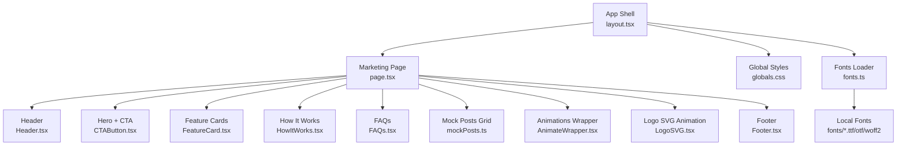

**Diagram sources**
- [layout.tsx](file://landing/src/app/layout.tsx#L1-L27)
- [page.tsx](file://landing/src/app/page.tsx#L1-L195)
- [globals.css](file://landing/src/app/globals.css#L1-L143)
- [fonts.ts](file://landing/src/app/fonts.ts#L1-L84)
- [Header.tsx](file://landing/src/components/landing/Header.tsx#L1-L58)
- [Footer.tsx](file://landing/src/components/landing/Footer.tsx#L1-L175)
- [CTAButton.tsx](file://landing/src/components/landing/CTAButton.tsx#L1-L35)
- [FeatureCard.tsx](file://landing/src/components/landing/FeatureCard.tsx#L1-L33)
- [HowItWorks.tsx](file://landing/src/components/landing/HowItWorks.tsx#L1-L28)
- [FAQs.tsx](file://landing/src/components/landing/FAQs.tsx#L1-L61)
- [AnimateWrapper.tsx](file://landing/src/components/animations/AnimateWrapper.tsx#L1-L113)
- [LogoSVG.tsx](file://landing/src/components/animations/LogoSVG.tsx#L1-L140)
- [mockPosts.ts](file://landing/src/data/mockPosts.ts#L1-L140)

**Section sources**
- [layout.tsx](file://landing/src/app/layout.tsx#L1-L27)
- [page.tsx](file://landing/src/app/page.tsx#L1-L195)
- [globals.css](file://landing/src/app/globals.css#L1-L143)
- [fonts.ts](file://landing/src/app/fonts.ts#L1-L84)

## Core Components
- App shell and metadata: Defines site metadata and applies global fonts and styles.
- Marketing page: Orchestrates hero, feature showcase, testimonials, steps, FAQs, and CTA.
- Reusable components: Header, Footer, CTAButton, FeatureCard, HowItWorks, FAQs.
- Animations: AnimateWrapper for staggered entrance effects; LogoSVG for custom SVG stroke animations.
- Data: HowItWorksSteps and mockPosts for dynamic content rendering.

**Section sources**
- [layout.tsx](file://landing/src/app/layout.tsx#L1-L27)
- [page.tsx](file://landing/src/app/page.tsx#L1-L195)
- [Header.tsx](file://landing/src/components/landing/Header.tsx#L1-L58)
- [Footer.tsx](file://landing/src/components/landing/Footer.tsx#L1-L175)
- [CTAButton.tsx](file://landing/src/components/landing/CTAButton.tsx#L1-L35)
- [FeatureCard.tsx](file://landing/src/components/landing/FeatureCard.tsx#L1-L33)
- [HowItWorks.tsx](file://landing/src/components/landing/HowItWorks.tsx#L1-L28)
- [FAQs.tsx](file://landing/src/components/landing/FAQs.tsx#L1-L61)
- [AnimateWrapper.tsx](file://landing/src/components/animations/AnimateWrapper.tsx#L1-L113)
- [LogoSVG.tsx](file://landing/src/components/animations/LogoSVG.tsx#L1-L140)
- [HowItWorksSteps.ts](file://landing/src/data/HowItWorksSteps.ts#L1-L26)
- [mockPosts.ts](file://landing/src/data/mockPosts.ts#L1-L140)

## Architecture Overview
The landing page uses Next.js App Router with a root layout applying global fonts and metadata. The home page composes marketing components and renders dynamic content from mock data. Animations are integrated via AnimateWrapper and a custom SVG animation. Responsive breakpoints and Tailwind utilities ensure cross-device compatibility.

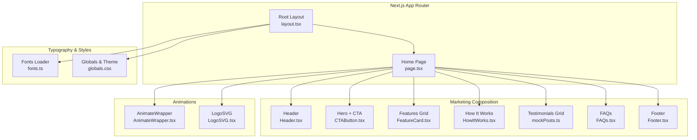

**Diagram sources**
- [layout.tsx](file://landing/src/app/layout.tsx#L1-L27)
- [page.tsx](file://landing/src/app/page.tsx#L1-L195)
- [Header.tsx](file://landing/src/components/landing/Header.tsx#L1-L58)
- [Footer.tsx](file://landing/src/components/landing/Footer.tsx#L1-L175)
- [CTAButton.tsx](file://landing/src/components/landing/CTAButton.tsx#L1-L35)
- [FeatureCard.tsx](file://landing/src/components/landing/FeatureCard.tsx#L1-L33)
- [HowItWorks.tsx](file://landing/src/components/landing/HowItWorks.tsx#L1-L28)
- [FAQs.tsx](file://landing/src/components/landing/FAQs.tsx#L1-L61)
- [AnimateWrapper.tsx](file://landing/src/components/animations/AnimateWrapper.tsx#L1-L113)
- [LogoSVG.tsx](file://landing/src/components/animations/LogoSVG.tsx#L1-L140)
- [fonts.ts](file://landing/src/app/fonts.ts#L1-L84)
- [globals.css](file://landing/src/app/globals.css#L1-L143)

## Detailed Component Analysis

### App Shell and Global Styles
- Root layout sets metadata and applies font variables and base styles.
- Global CSS defines theme tokens, animations, and Tailwind layers.
- Fonts loader registers Google Fonts and local font files with Next/font.

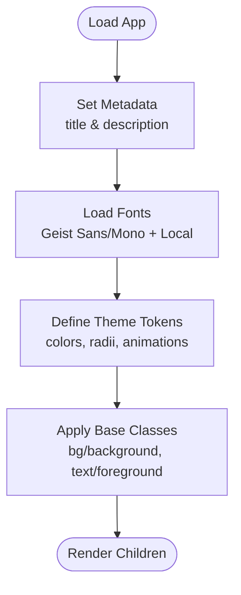

**Diagram sources**
- [layout.tsx](file://landing/src/app/layout.tsx#L1-L27)
- [globals.css](file://landing/src/app/globals.css#L28-L97)
- [fonts.ts](file://landing/src/app/fonts.ts#L1-L84)

**Section sources**
- [layout.tsx](file://landing/src/app/layout.tsx#L1-L27)
- [globals.css](file://landing/src/app/globals.css#L1-L143)
- [fonts.ts](file://landing/src/app/fonts.ts#L1-L84)

### Marketing Page Composition
- The home page orchestrates hero messaging, animated CTAs, dynamic post grid, feature cards, “How it works” steps, FAQs, and a prominent final CTA.
- Responsive breakpoints adjust the number of posts per row based on viewport width.
- Dynamic content is sourced from mock data arrays.

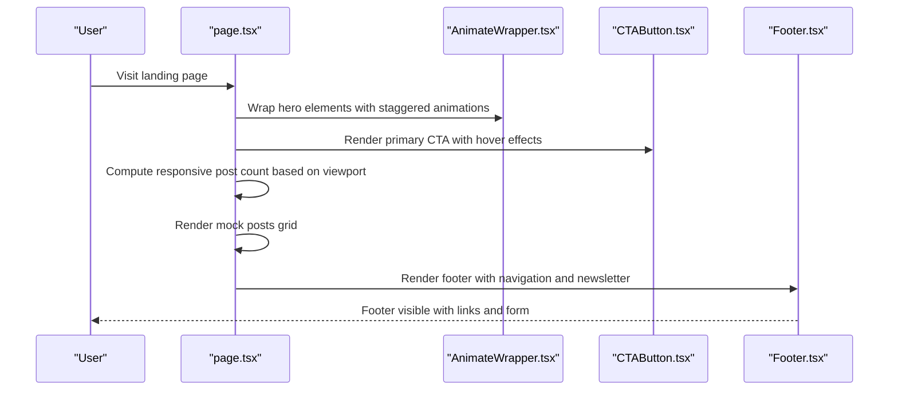

**Diagram sources**
- [page.tsx](file://landing/src/app/page.tsx#L27-L53)
- [AnimateWrapper.tsx](file://landing/src/components/animations/AnimateWrapper.tsx#L82-L112)
- [CTAButton.tsx](file://landing/src/components/landing/CTAButton.tsx#L7-L31)
- [Footer.tsx](file://landing/src/components/landing/Footer.tsx#L8-L172)

**Section sources**
- [page.tsx](file://landing/src/app/page.tsx#L22-L53)
- [mockPosts.ts](file://landing/src/data/mockPosts.ts#L1-L140)

### Header Component
- Sticky header with scroll-aware styling and responsive behavior.
- Conditional CTA visibility based on scroll position.
- Uses backdrop blur and transitions for modern UX.

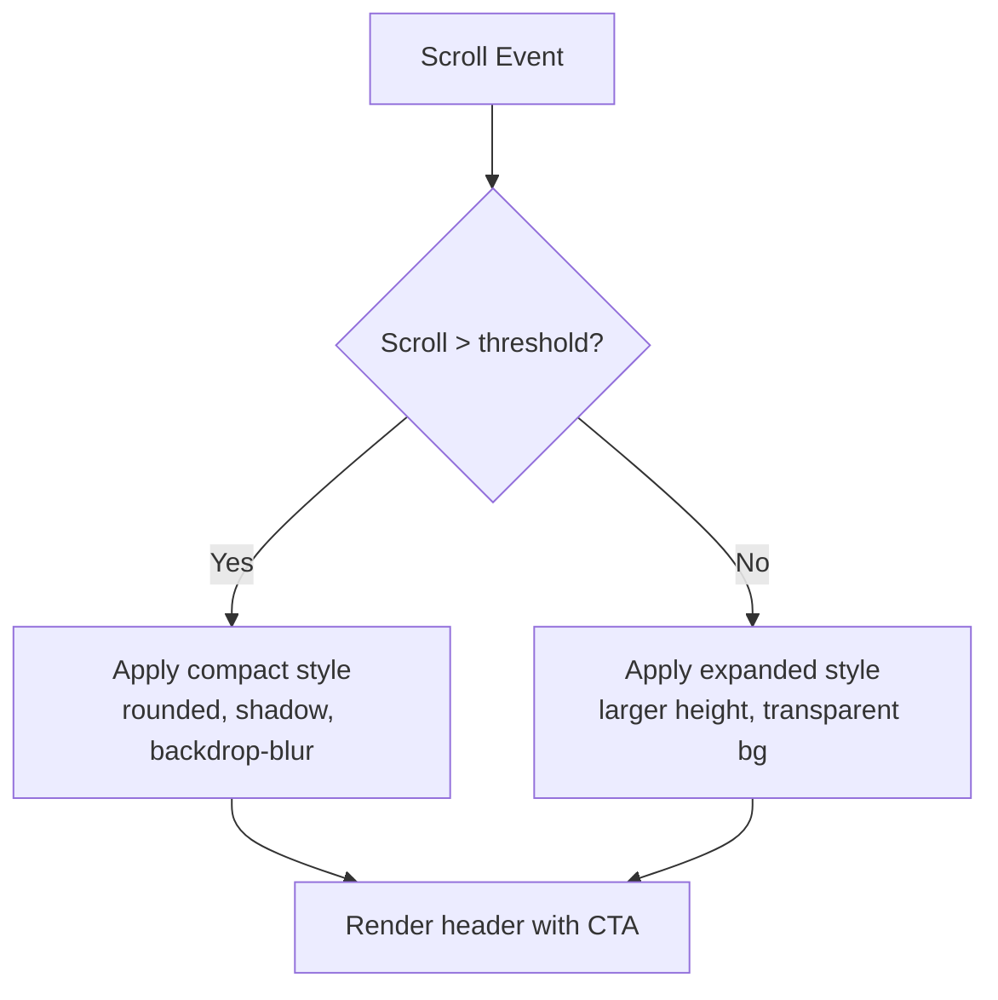

**Diagram sources**
- [Header.tsx](file://landing/src/components/landing/Header.tsx#L8-L25)

**Section sources**
- [Header.tsx](file://landing/src/components/landing/Header.tsx#L1-L58)

### Footer Component
- Multi-column layout with brand, navigation, contact, and legal sections.
- Newsletter subscription form present but currently non-functional; can be wired to backend APIs.
- Social links open external profiles in new tabs.

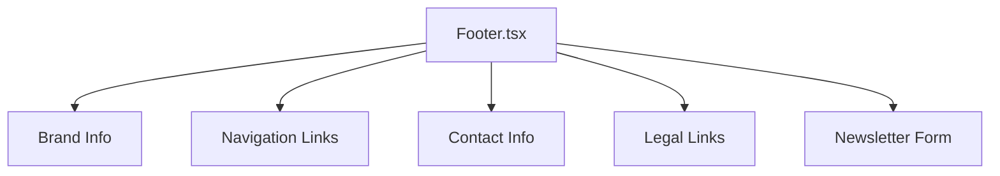

**Diagram sources**
- [Footer.tsx](file://landing/src/components/landing/Footer.tsx#L8-L172)

**Section sources**
- [Footer.tsx](file://landing/src/components/landing/Footer.tsx#L1-L175)

### Call-to-Action (CTA) Component
- Interactive button with hover scaling and arrow toggle.
- Opens the production app URL in a new tab.
- Integrates with a primary button component and supports size variants.

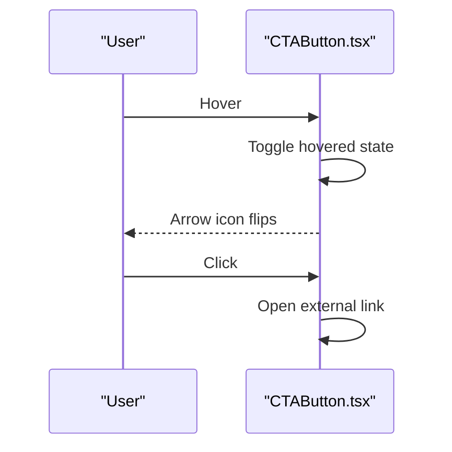

**Diagram sources**
- [CTAButton.tsx](file://landing/src/components/landing/CTAButton.tsx#L14-L31)

**Section sources**
- [CTAButton.tsx](file://landing/src/components/landing/CTAButton.tsx#L1-L35)

### Feature Showcase Components
- FeatureCard displays icon, title, and description in a consistent card layout.
- Used to highlight platform benefits like anonymity, student-only clubs, role badges, and ad-free experience.

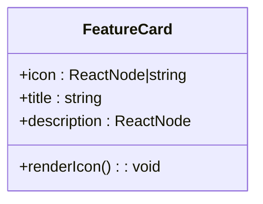

**Diagram sources**
- [FeatureCard.tsx](file://landing/src/components/landing/FeatureCard.tsx#L3-L32)

**Section sources**
- [FeatureCard.tsx](file://landing/src/components/landing/FeatureCard.tsx#L1-L33)

### How It Works Steps
- Presentational cards with emoji, title, and description.
- Steps data is imported from a dedicated module.

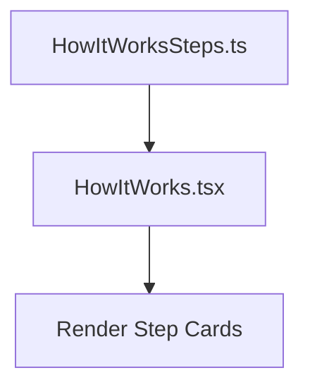

**Diagram sources**
- [HowItWorksSteps.ts](file://landing/src/data/HowItWorksSteps.ts#L1-L26)
- [HowItWorks.tsx](file://landing/src/components/landing/HowItWorks.tsx#L8-L25)

**Section sources**
- [HowItWorksSteps.ts](file://landing/src/data/HowItWorksSteps.ts#L1-L26)
- [HowItWorks.tsx](file://landing/src/components/landing/HowItWorks.tsx#L1-L28)

### Testimonials and Dynamic Content
- Mock posts simulate real-time campus discussions.
- The page computes responsive post counts and shuffles mock data for variety.

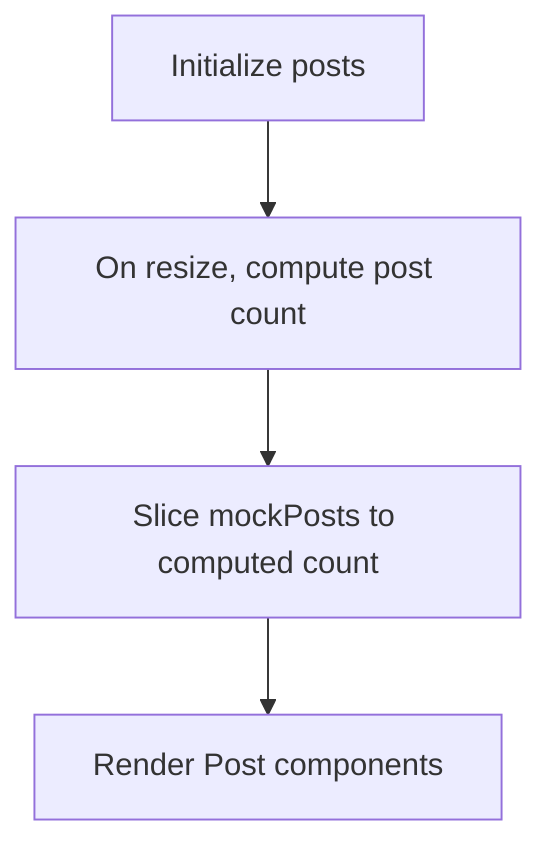

**Diagram sources**
- [page.tsx](file://landing/src/app/page.tsx#L22-L53)
- [mockPosts.ts](file://landing/src/data/mockPosts.ts#L1-L140)

**Section sources**
- [page.tsx](file://landing/src/app/page.tsx#L22-L53)
- [mockPosts.ts](file://landing/src/data/mockPosts.ts#L1-L140)

### Animation Components
- AnimateWrapper provides a library of motion variants (fade, blur, slide, scale) with optional viewport-triggered animations.
- LogoSVG renders a custom animated SVG with cascading stroke animations and gradient strokes.

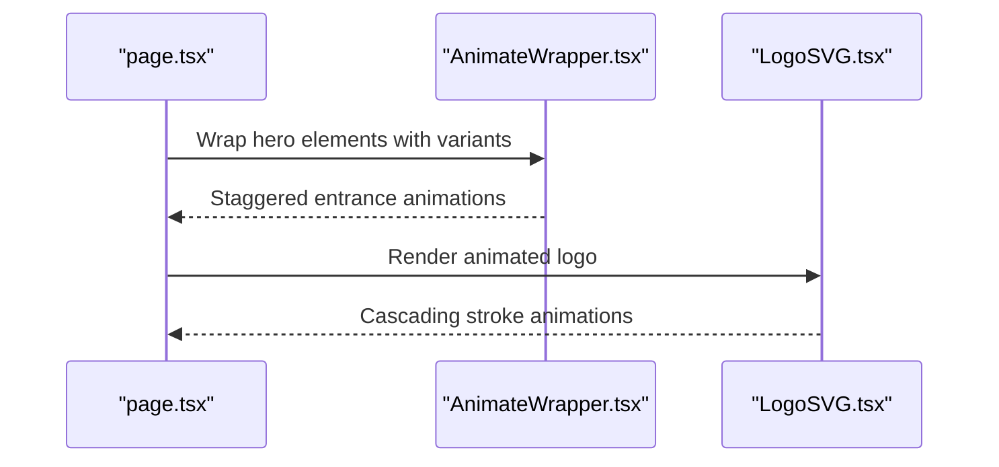

**Diagram sources**
- [AnimateWrapper.tsx](file://landing/src/components/animations/AnimateWrapper.tsx#L34-L80)
- [LogoSVG.tsx](file://landing/src/components/animations/LogoSVG.tsx#L11-L51)

**Section sources**
- [AnimateWrapper.tsx](file://landing/src/components/animations/AnimateWrapper.tsx#L1-L113)
- [LogoSVG.tsx](file://landing/src/components/animations/LogoSVG.tsx#L1-L140)

### Typography System and Font Management
- Next/font loads Geist Sans and Mono with variable fonts and subset inclusion.
- Local fonts are loaded via next/font/local for branding and stylistic emphasis.
- Theme tokens define font families for Tailwind and CSS variables.

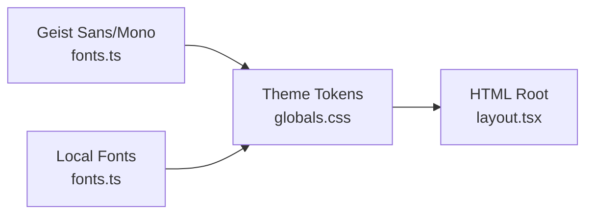

**Diagram sources**
- [fonts.ts](file://landing/src/app/fonts.ts#L1-L84)
- [globals.css](file://landing/src/app/globals.css#L28-L43)
- [layout.tsx](file://landing/src/app/layout.tsx#L18-L22)

**Section sources**
- [fonts.ts](file://landing/src/app/fonts.ts#L1-L84)
- [globals.css](file://landing/src/app/globals.css#L28-L43)
- [layout.tsx](file://landing/src/app/layout.tsx#L18-L22)

### SEO Optimization Techniques
- Metadata configured in the root layout provides title and description for search engines.
- Semantic headings and structured content improve readability and accessibility.
- Alt text for images and proper link semantics enhance SEO signals.

**Section sources**
- [layout.tsx](file://landing/src/app/layout.tsx#L5-L9)
- [page.tsx](file://landing/src/app/page.tsx#L119-L125)

### Data Management for Mock Content
- HowItWorksSteps and mockPosts are exported arrays used to render dynamic content.
- The home page consumes these arrays and adapts presentation based on viewport.

**Section sources**
- [HowItWorksSteps.ts](file://landing/src/data/HowItWorksSteps.ts#L1-L26)
- [mockPosts.ts](file://landing/src/data/mockPosts.ts#L1-L140)
- [page.tsx](file://landing/src/app/page.tsx#L19-L25)

### Integration Patterns for Lead Capture and User Acquisition
- Newsletter subscription form exists in the footer; currently non-functional and can be extended to integrate with backend APIs or third-party services.
- Primary CTA opens the production app URL, driving conversions to the core product.

**Section sources**
- [Footer.tsx](file://landing/src/components/landing/Footer.tsx#L149-L161)
- [CTAButton.tsx](file://landing/src/components/landing/CTAButton.tsx#L21)

## Dependency Analysis
The marketing page depends on:
- Next.js App Router for routing and metadata
- Tailwind CSS for styling and responsive utilities
- motion/react for animations
- react-icons for icons
- next/font for font loading

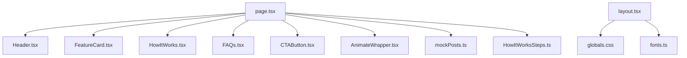

**Diagram sources**
- [page.tsx](file://landing/src/app/page.tsx#L8-L20)
- [Header.tsx](file://landing/src/components/landing/Header.tsx#L3-L5)
- [FeatureCard.tsx](file://landing/src/components/landing/FeatureCard.tsx#L1)
- [HowItWorks.tsx](file://landing/src/components/landing/HowItWorks.tsx#L1)
- [FAQs.tsx](file://landing/src/components/landing/FAQs.tsx#L1-L6)
- [CTAButton.tsx](file://landing/src/components/landing/CTAButton.tsx#L3-L5)
- [AnimateWrapper.tsx](file://landing/src/components/animations/AnimateWrapper.tsx#L3-L8)
- [mockPosts.ts](file://landing/src/data/mockPosts.ts#L1)
- [HowItWorksSteps.ts](file://landing/src/data/HowItWorksSteps.ts#L1)
- [layout.tsx](file://landing/src/app/layout.tsx#L1-L3)
- [globals.css](file://landing/src/app/globals.css#L1-L2)
- [fonts.ts](file://landing/src/app/fonts.ts#L1-L2)

**Section sources**
- [page.tsx](file://landing/src/app/page.tsx#L1-L25)
- [layout.tsx](file://landing/src/app/layout.tsx#L1-L3)

## Performance Considerations
- Font loading: next/font ensures fast font delivery with subset and display swap; consider preloading critical font weights.
- Animations: motion/react introduces runtime overhead; use viewport-triggered animations sparingly and avoid excessive nested wrappers.
- Images: optimize the mockup image and lazy-load where appropriate.
- CSS: consolidate animations and theme tokens to reduce CSS payload.
- Hydration: ensure client directives are used only where necessary to minimize client-side JavaScript.

[No sources needed since this section provides general guidance]

## Troubleshooting Guide
- Fonts not loading: Verify font paths and variable names match theme tokens.
- Animations not triggering: Confirm viewport options and startOnView behavior; check for conflicting parent animations.
- Newsletter form not working: Implement backend handler or integrate with a service provider; ensure form submission is wired.
- CTA not opening app: Validate the external URL and ensure no browser policies block pop-ups.

**Section sources**
- [fonts.ts](file://landing/src/app/fonts.ts#L1-L84)
- [globals.css](file://landing/src/app/globals.css#L28-L43)
- [AnimateWrapper.tsx](file://landing/src/components/animations/AnimateWrapper.tsx#L90-L106)
- [Footer.tsx](file://landing/src/components/landing/Footer.tsx#L149-L161)
- [CTAButton.tsx](file://landing/src/components/landing/CTAButton.tsx#L21)

## Conclusion
The landing page leverages Next.js App Router, a cohesive component architecture, and a robust typography and animation system to deliver a responsive, engaging marketing experience. With modular components, mock data-driven content, and clear integration points for lead capture and user acquisition, the page is well-positioned for iterative improvements and performance optimizations.

[No sources needed since this section summarizes without analyzing specific files]

## Appendices
- Next.js configuration remains minimal; consider adding experimental features or optimization flags as needed.
- Accessibility: Add ARIA labels, keyboard navigation, and semantic markup where missing.

**Section sources**
- [next.config.ts](file://landing/next.config.ts#L1-L8)